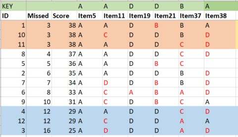
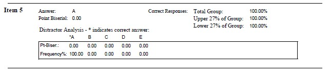
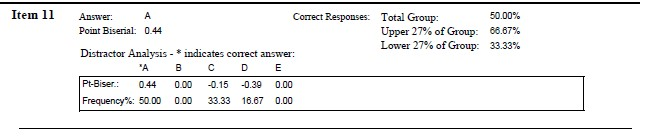
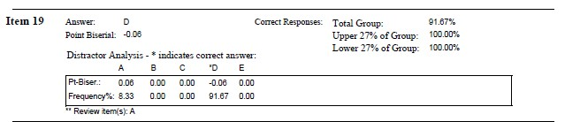
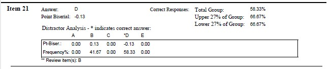
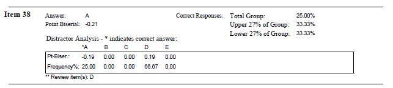

# Item Analysis for Educational Achievement Tests (Exams) {#ItemAnalExam}

 [Screencasted Lecture Link](https://spu.hosted.panopto.com/Panopto/Pages/Viewer.aspx?pid=e7edfd08-439c-4170-be8a-ad9e0167af17) 
 
```{r  include=FALSE}
knitr::opts_chunk$set(echo = TRUE)
knitr::opts_chunk$set(comment = NA) #keeps out the hashtags in the knits
options(scipen=999)#eliminates scientific notation
```

In this lecture I walk through some procedures for analyzing the quality of multiple choice (including true/false) exam items. We look at item difficulty and item discrimination. We also look at item coverage as it relates to the learning objectives for an educational endeavor.

## Navigating this Lesson

There is about one hour of lecture.  If you work through the materials with me it would be plan for an additional 30 minutes.

While the majority of R objects and data you will need are created within the R script that sources the chapter, occasionally there are some that cannot be created from within the R framework. Additionally, sometimes links fail.  All original materials are provided at the [Github site](https://github.com/lhbikos/ReC_Psychometrics) that hosts the book. More detailed guidelines for ways to access all these materials are provided in the OER's [introduction](#ReCintro)

### Learning Objectives

Focusing on this week's materials, make sure you can:

* Provide a rationale for why having a *test bank* might be a good idea.
* Describe the effects of skewness on the interpretation of exam results.
* Evaluate the the quality of a multiple choice item on the basis of item difficulty, correlation, and discrimination.
* Discuss the challenges of identifying an *ideal* difficulty level for test items. Further elaborate how guessing, speeded tests, interitem correlations, and the purposes of the test influence the *ideal difficulty.*

### Planning for Practice

Practice suggestions for this lesson encourage you to think about the exams in your life:  those you might be taking; those you might be writing or proctoring.

### Readings & Resources

Classic psychometric texts tend to not cover item analysis for achievement tests.  And/or, they skip over these fundamentals and move straight to item response theory/Rasch modeling (IRT).  After scouring the internet, I landed on these two resources as concise, accessible, summaries. 

* Understanding item analysis.  Office of Educational Assessment, University of Washington.  Retrieved September 20, 2019.  Retrieved from https://www.washington.edu/assessment/scanning-scoring/scoring/reports/item-analysis/
  + It is common for excellent instructions/descriptions to accompany the scoring software used by institutions.  UW appears to use ScorePak and this resource provides both conceptual and interpretive information.
* Revelle, W. (2017). An overview of the psych package.  Retrieved from http://personality-project.org/r/overview.pdf 
  + Pages 85-85 provide a vignette for conducting item analysis on multiple choice items.

### Packages

The packages used in this lesson are embedded in this code. When the hashtags are removed, the script below will (a) check to see if the following packages are installed on your computer and, if not (b) install them.
```{r }
#will install the package if not already installed
#if(!require(psych)){install.packages("psych")}
```

## Research Vignette

This lesson's research vignette is from my own class. Especially in the early years of my teaching, I gave high(er) stakes mid-term and final exams. There were usually 40 (or so) multiple choice or true/false items, 2-3 applied problems or short essays, and 1 longer essay. Today's vignette are an array of exam items from a statistics exam that demonstrate the desirable and undesirable elements we want in objective items.

## Item Analysis in the Educational/Achievement Context

Multiple choice, true/false, and other *objectively* formatted/scored items are part-n-parcel to educational/achievement assessment.  But how do we know if the items are performing the way they should?  This lecture focuses on item analysis in the context of multiple choice and true/false items.  Using these practices can help you identify what selection of items you'd like for your exams.  These can be critical tools in helping you improve your ability to assess student performance.  
In-so-doing, we walk through a bit of "what we used to do," to current common practices, to a glimpse of our future. We owe much of this to rapid advances in technology.

*Test banks* are instructor-created resources for developing/storing/protecting items for use in future exams.  We create test banks when we carefully distribute/collect/protect items "that work" (from statistical perspective). Why would we want to do this?

* Once a test is "out" it's out. Instructors can presume that resourceful students are using it to study; yet all students won't have equal access to it.
* Developing "good" items takes a good deal of time; does the instructor want to redo this each term?
* Should we be piloting *all new items* on students each term and then having the debates about whether the item should be rescored? 
  + Better is to introduce a proportion of new items each year and evaluate them for inclusion in the test bank;  EPPP, SAT, GRE do this.
* A challenge is providing students appropriate study tools -- old exams are favorites of students (but maybe there are other ways -- worksheets, Jeopardy).

The conceptual portions of this lecture, particularly the interpretation of the difficulty and discrimination statistics are based in Anastasi's work [@anastasi_psychological_1997]


### And now a quiz! Please take it.
Let's start with some items from an early version of the exam I gave when I taught CPY7020/Statistical Methods.

**Item 5** A grouping variable such as men or women that uses dummy coding of 1 and 0 to categorize the groups is an example of _____ scaling.

* a)	Nominal
* b)	Ordinal
* c)	Interval
* d)	Ratio

**Item 11**  The term “grade inflation” has frequently been applied to describe the distribution of grades in graduate school.  Which of the following best describes this distribution.

* a)	negatively skewed 
* b)	uniform/rectangular
* c)	positively skewed and leptokurtic
* d)	uniform and platykurtic

**Item 19**	 All distributions of Z-scores will have the identical

* a)	Mean
* b)	Variance
* c)	Standard deviation
* d)	All of the above

**Item 21**  The most appropriate score for comparing scores across two or more distributions (e.g., exam scores in math and art classes) is the:

* a)	mean
* b)	percentile rank
* c)	raw score
* d)	z-score

**Item 37 **  Of the following, what statement best describes $r^2$ = .49

* a)	strong positive correlation
* b)	strong positive or negative correlation
* c)	weak positive or negative correlation
* d)	weak negative correlation

**Item 38**   When there are no ties among ranks, what is the relationship between the Spearman rho ($\rho$) and the Pearson ($r$)?

* a)	$\rho$ = $r$
* ii)	$\rho$ > $r$
* a)	$\rho$ < $r$
* b)	no relationship

## Item Difficulty 

### Percent passing

**Item difficulty index** is the proportion of test takers who answer an item correctly.  It is calculated by dividing the number of people who passed the item (e.g., 55) by the total number of people (e.g., 100).

* If 55% pass an item, we write $p$ = .55
* The easier the item; the larger the percentage will be. 

What is an ideal pass rate (and this "ideal" is the *statistical ideal* mostly for norm-referenced tests like the ACT, SAT, GRE)?

* The closer the difficulty of an item approaches 1.00 or 0, the less differential information about test takers it contributes. 
  + If, out of 100 people, 50 pass an item and 50 fail ($p$ = .50)…we have 50 X 50 or 2,500 paired comparisons or differential bits of information.
* How much information would we have for an item passed by:
  + 70% of the people (70 * 30 = ???)
  + 90% of the people (90 * 10 = ???)
* For maximum differentiation, one would choose all items at the .50 level (but hold up...)

### Several factors prevent .50 from being the ideal difficulty level

**Speeded tests** complicate the interpretation of item difficulty because items are usually of equivalent difficulty and there are so many that no one could complete them all.  Thus later items should be considered to be more difficult -- but item difficulty is probably not the best assessment of item/scale quality.

**Guessing** the correct answer in true/false and multiple choice contexts interferes with the goal of $p$ - .50. In a 1952 issue of *Psychometrika*, Lord provided this guide for optimal $p$ values based on the number of choices in the objective context:

|Optimal *p* values
|:------------------------------|

|Number of Choices|Optimal Mean Difficulty Level
|:-------------:|:-------------:|
|2 (T/F)        |0.85           |
|3              |0.77           |
|4              |0.74           |
|5              |0.69           |
|Constructed response essay |0.5|

**The purpose** of the testing changes the ideal difficulty level.

* If the test is *norm-referenced* (ACT, SAT, GRE), .50 is very useful.
* If the test is mastery oriented, $p$ values may be be as high as 0.90 since student performance is a function of repeated attempts with feedback.

**Item intercorrelations** impacts interpretation of item difficulty.

* The more homogeneous the test, the higher these intercorrelations will be. If all items were perfectly intercorrelated and all were of the .50 difficulty level: 
  + the same 50 persons out of 100 would pass each item, that is,
  + half of the test takers would obtain perfect scores; the other half zero scores
* Best to select items with a moderate spread of difficulty, but whose AVERAGE difficulty level of .50
* The percentage of persons passing an item, expresses the item difficulty in terms of which statistical scale of measurement?  Is it nominal, ordinal, interval, or ratio?
  + Because of this issue, we can correctly indicate the rank order or relative difficulty of the items 
  + However, we cannot infer that the difference in difficulty between Items 1 and 2 is equal to the difference between Items 2 and 3.
* We can make an *equal-interval inference* with the table of normal curve frequencies (i.e., translating the proportion to z-scores). Z-scores would be used as the units if an equal interval inference was required in the analysis. For example,
  + *p* = .84 is equal to -1 *SD*
  + *p* = .16 is equal to +1 *SD*
  
*Seem a little upside down?  Recall that we are calculating the percent passing and starting the count "from the top." So a relatively easy item where 84% passed, would have an standard deviation of -1.*


## Item Discrimination

The degree to which an item differentiates correctly among test takers in the behavior that the test is designed to measure.

* the *criterion* can be internal or external to the test itself
  + under some conditions, the two approaches lead to opposite results because (a) items chosen to maximize the validity of the test tend to be the ones rejected on the basis of internal consistency, and (b) rejecting items with low correlations with the total score tends to homogenize the test (we are more likely to keep items with the highest average intercorrelations)
* *internal* criteria serve to maximize internal consistency or homogeneity of the test, example:
  + achievement test, where criteria is total score itself
* *external* criteria serve to maximize the validity of an external criterion, example:
  + a different assessment of the same ability being assessed
  
  
### Index of Discrimination

* Compare the proportion of cases that pass an item in contrasting criterion groups
  + upper (U) and lower (L) criterion groups are selected from the extremes of the distribution
  + traditionally these groups are created from the 27% from each of those sides of the distribution
 
* This *index of discrimination (D)* can be expressed as a difference of raw frequencies (U - L), or (more conventionally) as the difference of percentages of those who scored it correctly in the upper 27% and lower 27% groups
  + when all members of the U group and none of the members of the L group pass, D = 100
  + when all members of the L group and none of the members of the U group pass, D = 0
  + optimum point at which these two conditions reach balance is with the upper and lower 27% 

|Optimal Discrimination
|:------------------------------|

|Difficulty      |Discrimination
|:--------------:|:------------:|
|0.40 and larger |Excellent     |
|0.30 - 0.39     |Good          |
|0.11 - 0.29     |Fair          |
|0.00 -0.10      |Poor          |
|Negative values |Mis-keyed or other major flaw|


### Application of Item Difficulty and Discrimination

Earlier I asked you to "take the quiz." To keep it engaging, I encourage you to look at your own answers and compare them to "what happened" from in this actual exam administration. I will demonstrate how to evaluate my exam items with these indices of difficulty and discrimination.  I have intentionally selected items with a variety of desirable (and undesirable) characteristics.

{#id .class width=400 height=300px}
  
**Item 5**  A grouping variable such as men or women that uses dummy coding of 1 and 0 to categorize the groups is an example of _____ scaling.

* a)	Nominal
* b)	Ordinal
* c)	Interval
* d)	Ratio

If we wanted to hand-calculate the index of discrimination for Item #5, we find that 3 people (100%) in the upper group selected the correct answer and 3 people (100%) in the lower group selected the correct answer:  3 - 3 = 0.  If you prefer percentages:  100% - 100% = 0%.  This means there is no discrimination in performance of the upper and lower performing groupings.

Older scoring systems (e.g., Scantron) used to provide this information.

{#id .class width=1000 height=250}

Considering what we have learned already, Item #5 is

* too easy
* does not discriminate between upper and lower performance
* *Yes, there is more data on here, but we will save it for the next level of review...just a few moments.*


**Item 11** The term “grade inflation” has frequently been applied to describe the distribution of grades in graduate school.  Which of the following best describes this distribution.

* a)	negatively skewed 
* b)	uniform/rectangular
* c)	positively skewed and leptokurtic
* d)	uniform and platykurtic

For Item #11, 2 people (~66%) from the upper group selected the correct answer, 1 person (~33%) from the lower group selected the correct answer.  Thus, the U-L was +1 (+33%) and the item is working in the proper direction.



Considering what we have learned already, Item #11 is

* difficult (50% overall selected the correct item)
* does discriminate between upper and lower performance, with more individuals in the upper groups selecting the correct answer than in the lower group

**Item 19**  All distributions of Z-scores will have the identical

* a)	Mean
* b)	Variance
* c)	Standard deviation
* d)	All of the above

Hand calculation:  Upper = 3 (100%), Lower = 3 (100%).  Difference = 0.  



Considering what we have learned already, Item #19 is

* somewhat easy (92% overall selected the correct item)
* using the U - L discrimination index, it does not discriminate between upper and lower performance

**Item 21** The most appropriate score for comparing scores across two or more distributions (e.g., exam scores in math and art classes) is the:

* a)	mean
* b)	percentile rank
* c)	raw score
* d)	z-score

Hand calculation:  Upper = 2 (66%), Lower = 3 (100%).  Difference = -33%. This item is upside down.   This is different than the Scantron snip below because uppers and lowers were likely calculated on exam total that included subjectively scored items (essays; and I no longer have that data). 




Considering what we have learned already, Item21 is

* somewhat difficult (58% overall selected the correct item)
* on the basis of the hand-calculations it does not discriminate between uppers and lowers


**Item 37** Of the following, what statement best describes $r^2$ = .49

* a)	strong positive correlation
* b)	strong positive or negative correlation
* c)	weak positive or negative correlation
* d)	weak negative correlation

Hand calculation:  Upper = 2 (66%), Lower = 0 (0%).  Difference = 66%.  


Considering what we have learned already, Item 37 is

* very difficult (33% overall selected the correct item)
* on the basis of the hand-calculations, this completely discriminates the uppers from the lowers)


**Item 38** When there are no ties among ranks, what is the relationship between the Spearman rho ($\rho$) and the Pearson r ($r$)?

* a)	$\rho$ = $r$
* ii)	$\rho$ > $r$
* a)	$\rho$ < $r$
* b)	no relationship

Hand calculation:  Upper = 1 (33%), Lower = 1 (33%).  Difference = 0%.  



Considering what we have learned already, Item 21 is

* very difficult (25% overall selected the correct item)
* on the basis of the hand-calculations, this does not discrimniate the uppers from the lowers)

## In the *psych* Package

Using the *score.multiple.choice()* function in the *psych* package.  Documentation is pp. 85-86 in http://personality-project.org/r/overview.pdf

A multiple choice exam presumes that there is one correct response.  We start with a dataset that records the students' responses. It *appears* that the psych package requires these responses to be numerical (rather than A, B, C, D).

```{r}
#For portability of the lesson, I hand-entered the exam score data. 
#Variables are items (not students), so the entry is the 41 items for the 12 students
Item1 <- c(1,1,4,1,1,1,1,1,1,1,1,1)
Item2 <- c(4,4,1,4,4,4,4,4,4,4,4,4)
Item3 <- c(1,1,4,1,1,1,1,3,1,1,1,1)
Item4 <- c(2,3,2,2,2,2,2,2,2,2,2,2)
Item5 <- c(1,1,1,1,1,1,1,1,1,1,1,1)
Item6 <- c(1,1,1,1,1,1,1,1,1,1,1,1)
Item7 <- c(3,3,4,4,4,3,3,3,3,3,3,2)
Item8 <- c(1,2,2,4,2,2,2,2,1,4,2,2)
Item9 <- c(1,1,4,4,1,4,1,1,1,1,1,4)
Item10 <- c(3,3,3,2,3,2,3,2,2,3,3,3)
Item11 <- c(1,1,4,1,1,3,4,1,3,3,1,3)
Item12 <- c(2,1,2,4,2,2,2,2,2,2,2,2)
Item13 <- c(2,2,3,3,2,2,2,2,2,2,2,1)
Item14 <- c(2,2,2,2,2,2,3,2,2,2,2,2)
Item15 <- c(2,1,1,3,2,4,2,2,2,2,4,2)
Item16 <- c(2,2,2,4,4,2,2,2,4,2,2,1)
Item17 <- c(1,1,1,1,1,1,1,1,1,1,1,1)
Item18 <- c(3,3,3,3,3,3,3,3,3,3,3,3)
Item19 <- c(4,4,4,4,4,1,4,4,4,4,4,4)
Item20 <- c(1,1,1,1,1,1,1,1,1,1,1,1)
Item21 <- c(2,4,4,4,2,2,2,4,2,4,4,4)
Item22 <- c(3,3,3,3,3,3,3,3,3,3,3,1)
Item23 <- c(3,3,2,3,3,3,3,3,2,3,3,2)
Item24 <- c(3,3,1,3,3,3,2,3,3,3,3,1)
Item25 <- c(2,2,2,2,3,2,2,2,2,2,2,2)
Item26 <- c(4,4,4,4,4,4,4,4,1,4,4,1)
Item27 <- c(4,4,1,4,4,4,4,4,4,4,4,4)
Item28 <- c(1,1,1,1,1,1,1,1,1,1,1,1)
Item29 <- c(1,3,1,1,1,1,1,1,1,1,1,1)
Item30 <- c(2,2,2,2,2,2,2,2,2,2,2,2)
Item31 <- c(1,1,1,2,1,1,3,1,1,1,1,2)
Item32 <- c(1,1,3,1,1,1,3,1,1,1,1,1)
Item33 <- c(3,3,3,3,3,3,3,3,3,3,3,3)
Item34 <- c(3,3,3,3,3,3,3,3,3,3,3,3)
Item35 <- c(3,3,3,3,3,3,3,3,3,3,3,3)
Item36 <- c(2,2,2,2,2,2,2,2,2,2,2,2)
Item37 <- c(2,2,1,3,3,1,2,3,3,2,3,1)
Item38 <- c(1,4,4,4,NA,4,4,4,1,4,4,1)
Item39 <- c(3,3,3,3,3,3,3,3,3,3,3,3)
Item40 <- c(3,3,4,3,3,3,3,3,3,3,3,3)
Item41 <- c(2,1,2,2,2,4,4,2,2,4,4,2)

exam <- data.frame(Item1, Item2, Item3, Item4, Item5, Item6, Item7, Item8, Item9, Item10, Item11,Item12, Item13, Item14, Item15, Item16, Item17, Item18, Item19, Item20, Item21, Item22, Item23, Item24,Item25, Item26, Item27, Item28, Item29, Item30, Item31, Item32, Item33, Item34, Item35, Item36, Item37, Item38, Item39, Item40, Item41)
```

The optional script below will let you save the simulated data to your computing environment as either a .csv file (think "Excel lite") or .rds object (preserves any formatting you might do).
```{r}
#write the simulated data  as a .csv
#write.table(exam, file="exam.csv", sep=",", col.names=TRUE, row.names=FALSE)
#bring back the simulated dat from a .csv file
#exam <- read.csv ("exam.csv", header = TRUE)
```

```{r}
#to save the df as an .rds (think "R object") file on your computer; it should save in the same file as the .rmd file you are working with
#saveRDS(exam, "exam.rds")
#bring back the simulated dat from an .rds file
#exam <- readRDS("exam.rds")
```
We create a key of the correct answers.
```{r Item analysis for a multiple choice test, message=TRUE, warning=FALSE}
exam.keys <- c(1,4,1,2,1,1,3,2,1,3,1,2,2,2,2,2,1,3,4,1,4,3,3,3,1,4,4,1,1,2,1,1,3,3,3,2,2,1,3,3,4)  
```

We then insert that key into the *psych* package's *score.multiple.choice()* function.
```{r}
results <- psych::score.multiple.choice(exam.keys, exam, score = TRUE, short = FALSE, skew = TRUE)
results
#short=FALSE allows us to produce scores; we will use these later in some IRT analyses
#names(results)
```


The first screen of output provides an alpha. In this context, *alpha* should tell us the consistency of getting answers right or wrong. Technically, the alpha is reduced to a KR-20 (Kuder Richardson 20). We interpret it the same. Alpha is directly effected by:

* *interitem correlations* among the items:  a large number of positive correlations between items increases alpha
* test length:  more items produce higher reliability (all things being equal)
* test content:  the more diverse/broad, the lower the reliability coefficient

In the context of the classroom, reliabilities above .70 are probably adequate and above .80 are good.  Reliabilities below .60 suggest that items should be investigated and additional measures (tests, homework assignments) should be included in assigning grades.
 
Focus instead on the second screen of output.

**key** indicates which answer was correct.

**1, 2, 3, 4** (there would be as many as there are options in the multiple choice exam) provide a *distractor analysis* by indicating the percentage of time that answer was chosen. For item 1, option 1 was correct, and it was chosen 92% of the time.  No individuals chose options 2 or 3.  Option 4 was chosen 8% of the time.  

**miss** indicates how many times the item was skipped.

*r* is a point-biserial correlation with a dichotomous correct/incorrect correlated with the continuously scaled total scale score.  Positively scored items let us know that item is working in the proper direction...the students who got the item correct, did better on the overall total score and vice versa. 

* one of the best indicators of an items ability to *discriminate* (hence, **item discrimination**) among the criterion assessed on the test
* it is important to investigate those with values close to zero (no relation between item performance with overall test performance) and those with negative values (meaning that those who had the correct answer on the item were those who scored lower on the exam).

*n* tells us how many participants completed the item (this would necessarily be the inverse of "miss").

*mean* repeats the proportion of individuals who scored correctly; it would be the same as the percentage in the item keyed as the correct one.  This is an indication of **item dificulty**.

*sd* gives an indication of the variability around that mean

It is mportant to look at the *r* and *mean* columns, together to understand the degree of difficulty and how well each item is discriminating between performance levels.

*skew* can provide an indication of ceiling and floor effects.

{#id .class width=600 height=200px}

If a score has a significant negative skew (long tail to the left), then there may be a piling up of items at the upper end of the scale.  This would indicate an *insufficient ceiling* and make it more difficult to discriminate among differences among the higher performers.

If a score has a significant positive skew (long tail to the right), then there may be a piling up of items at the low end, indicating an *insufficient floor.*  That is, it lacks the ability to discriminate between poorer performers.

How do you tell what is significant?

A general rule of thumb says that anything greater or less than 1.0 is significantly skewed.  A formal z-test can be conducted this way: $z_{skewness}= \frac{S-0}{SE_{skewness}}$ 

In our exam dataset, -2.65 is the most extremely negatively skewed item and its *se* = 0.08.

```{r z-score high skew}
-2.65/0.08
```

Considering that anything greater than +/- 1.96 is statistically significant...it is safe to say that this item has an insufficient ceiling.

What about the items with -0.30 (*se* = 0.15)

```{r z-score low skew}
-.30/.15
```

This is not as extreme (and recall my *N* = 12, so I should probably look up a critical *t* value), but there is still some question about whether my exam items can discriminate among high performers.

Please note, because these distributions are *dichotomous* (correct/incorrect) they will never be normally distributed, but, like the difficulty index, they give another glimpse of the ability to discriminate.

Before we look at the specific exam items and their output from the scoring function, let me introduce you to the features of the psych package that draw from *item response theory* (IRT).

### A Mini-Introduction to IRT

To recap -- at the instructional level, the combination of percent passing (mean) and point-biserial correlation (discrimination index) is status quo for evaluating/improving the items.

The *psych* package draws from its IRT capacity to conduct distractor analysis.  IRT models individual responses to items by estimating individual ability (theta) and item difficulty (diff) parameters.  

In these graphs, theta is on the X axis.  Theta is the standard unit of the IRT model that represents the level of the domain being measured.  Like a z-score, a theta unit of "1" is the SD of the calibrated sample.

The pattern of responses to multiple choice ability items can show that some items have poor distractors. This may be done by using the the irt.responses function. A good distractor is one that is negatively related to ability.

As we look at each of the exam items, we will look at the psych input from the scoring function as well as use the *results* objects to create the IRT graphs. 

**Item 5** A grouping variable such as men or women that uses dummy coding of 1 and 0 to categorize the groups is an example of _____ scaling.

* a)	Nominal
* b)	Ordinal
* c)	Interval
* d)	Ratio

Mean = 1.0 (much too easy), *r* = NA, Distractors:  1.00	0.00	0.00	0.00, skew = -2.65 

```{r graph item5}
#irt.responses(scores$scores, exam[5], breaks = 2)
psych::irt.responses(results$scores, exam[5], breaks = 2)
```

With Item #5, 100% responded correctly (the flat, solid line at the top); there is not much to see.


**Item 11** The term “grade inflation” has frequently been applied to describe the distribution of grades in graduate school.  Which of the following best describes this distribution.

* a)	negatively skewed 
* b)	uniform/rectangular
* c)	positively skewed and leptokurtic
* d)	uniform and platykurtic

Mean = .50, *r* = .42, Distractors: 0.50	0.00	0.33	0.17, skew = 0.00

```{r graph item11}
psych::irt.responses(results$scores, exam[11], breaks = 2)
```

With Item #11 there is a positive relationship between 1/A (correct answer) and ability (theta), no relationship between 3/C and ability, and a negative relationship between 4/D and ability (indicating that 4/D is a good distractor).  These map onto each of the point-biserial correlations associated with the distractors in the Scantron output.


**Item 19** All distributions of Z-scores will have the identical

* a)	Mean
* b)	Variance
* c)	Standard deviation
* d)	All of the above

Mean = .92, *r* = .04, Distractors: 0.08	0.00	0.00	0.92	, skew = -2.65

```{r graph item19}
psych::irt.responses(results$scores, exam[19], breaks = 2)
```

Item #19 shows rather flat (no relationship) relations with ability for the correct item and the lone distractor.


**Item 21** The most appropriate score for comparing scores across two or more distributions (e.g., exam scores in math and art classes) is the:

* a)	mean
* b)	percentile rank
* c)	raw score
* d)	z-score

Mean = .58, *r* = -.19, Distractors:  0.00	0.42	0.00	0.58, skew = -0.30

```{r graph item21}
psych::irt.responses(results$scores, exam[21], breaks = 2)
```

For Item #21, a positive relationship between the WRONG answer (2/B) and ability (theta) and a negative relationship between 4/D (incorrect answer) and ability.  This makes sense as the point biserial for the overall item was 0-.13.


**Item 37** Of the following, what statement best describes $r^2$ = .49

* a)	strong positive correlation
* b)	strong positive or negative correlation
* c)	weak positive or negative correlation
* d)	weak negative correlation

Mean = .33, *r* = .49, Distractors:  0.25	0.33	0.42	0.00, skew = .62

```{r }
psych::irt.responses(results$scores, exam[37], breaks = 2)
```

For Item 37, a negative relation between endorsing 1/A and ability (a good distractor).  No relationshp with ability for endorsing 3/C.  A positive relation with ability for those endorsing 2/B 9correct answer).

**Item 38** When there are no ties among ranks, what is the relationship between the Spearman rho ($\rho$) and the Pearson r ($r$)?

* a)	$\rho$ = $r$
* ii)	$\rho$ > $r$
* a)	$\rho$ < $r$
* b)	no relationship

Mean = .27, *r* = -.07, Distractors:  0.27	0.00	0.00	0.73, skew = .68     
*Notice anything else that's funky about Item38?*

```{r graph item38}
psych::irt.responses(results$scores, exam[38], breaks = 2)
```

For item 38, there is a positive relationship with ability for endorsing 1/A (correct answer) and a negative relationship with ability for 4/D (incorrect answer).


**Regarding overall test characteristics**


## Closing Thoughts on Developing Measures in the Education/Achievement Context

Item analysis tends to be an assessment of *reliability*.  However, in the context of educational assessment and achievement exams, there are also *validity* issues.  

**Content validity** is concerned with whether or not the scale adequately represents the entirety of the *domain* to be assessed.

In educational and achievement contexts, this is often accomplished with a *table of specifications.* I introduced this in the [Validity lesson](#rxy). As a refresher, I will include another example -- imagining that I am going to write a quiz or short exam based on the learning objectives of this, single, lesson.  There are a number of different ways to organize the types of knowledge that is being assessed.  Since the American Psychological Association (and others) work in "KSAs" (knowledge, skills, attitudes) in their accreditation standards, I will use those.
 
In creating a table of specifications, we start with the learning objectives. Then we decide what type of items to write and what type of performance level they satisfy. This helps us ensure that all learning objectives are proportionately covered, using a variety of assessment approaches. Otherwise, we might be tempted to include the items that come easily to us or that are from our favorite topics. Personally, I find that when I work on the exam, and am informed by the learning objectives and table of specifications, I find myself tinkering with all three. I am inclined to believe that this results in an ever-increasingly-improved pedagogy.

**Table of Specifications**

|Learning Objectives                |Knowledge  |Skills     |Attitudes  |% of test |
|:----------------------------------|:---------:|:---------:|:---------:|:---------:|
|Provide a rationale for why having a *test bank* might be a good idea.| | |1 item |30% |
|Describe the effects of skewness on the interpretation of exam results.|2 items|   |           |       10%|
|Evaluate the the quality of a multiple choice item on the basis of item difficulty, correlation, and discrimination.| |5 items  |  |  25%|
|Discuss the challenges of identifying an *ideal* difficulty level for test items. Further elaborate how guessing, speeded tests, interitem correlations, and the purposes of the test influence the *ideal difficulty.*|2 items |    | 1 item   |  35%|
|TOTALS                             |4 items    |5 items    |2 items     |100%  |  

There are a variety of free resources that help with this process. Below are some that I find helpful:

* [Bloom's Taxonomy Verbs](https://www.fractuslearning.com/blooms-taxonomy-verbs-free-chart/), freely available from Fractus Learning.
* [The Bloom's Taxonomy Verbs Poster for Teachers](https://wabisabilearning.com/blogs/literacy-numeracy/download-blooms-digital-taxonomy-verbs-poster)
* If you have "writer's block" for writing objectives, here is a [learning outcome generator](https://elearn.sitehost.iu.edu/courses/tos/gen2/) that may help get you started.
* From APA's Education Directorate, [Guidance for Writing Behavioral Learning Objectives](https://www.apa.org/ed/sponsor/resources/objectives.pdf). The APA Guidance really emphasizes key components of well-written behavioral leaning objectives.  These include:
  - **observable and measurable**, using action verbs that describe measureable behaviors. The APA CE office disallows the use of "understand" as an action verb,
  - statements that clearly describe what the learner will know or be able to do **as a result** of having participated,
  - focused on the learner and learning (as opposed to what the trainer is doing or leading),
  - appropriate in breadth (not too few or too many)

**Takeaway message**:  Together, mapping out  exam coverage in a table of specifications PLUS item analysis (difficulty/discrimination) can be powerful tools in educational assessment.

## Practice Problems
   
For this particular lesson, I think some of the most meaningful practice comes from multiple choice and true/false exams that occur in your life. If you are in a class, see if your instructor is willing to share item analysis information that they have received. Learning management systems like Canvas, automatically calculate these.

If you are an instructor, calculate and review item analysis data on your own items. Think about how you might improve items between exams and cconsider how the dificulty and discrimination capacity of the item changes.


```{r include=FALSE}
sessionInfo()
```


