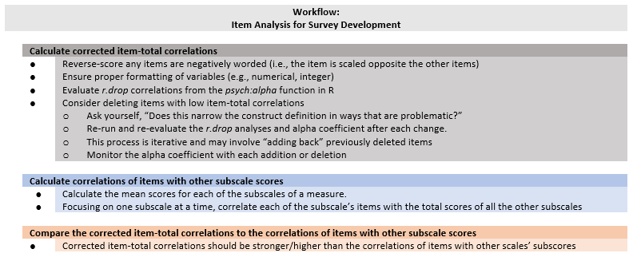
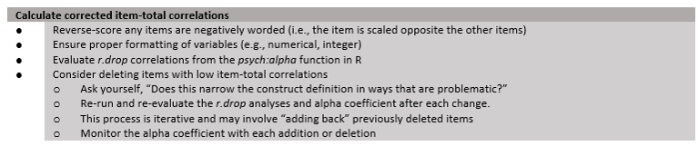
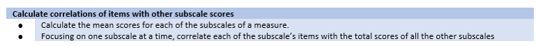
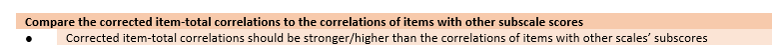

# Item Analysis for Likert Type Scale Construction {#ItemAnalSurvey}

 [Screencasted Lecture Link](https://youtube.com/playlist?list=PLtz5cFLQl4KOjH-HGCpixJAA41XlPJp_s&si=sGZUYF6d-rH74wwi) 
 
```{r  include=FALSE}
knitr::opts_chunk$set(echo = TRUE)
knitr::opts_chunk$set(comment = NA) #keeps out the hashtags in the knits
options(scipen=999)#eliminates scientific notation
```

The focus of this lecture is on item analysis for surveys. We use information about alpha coefficients and item-total correlations (within and across subscales) to help assess what we might consider to be *within-scale convergent and discriminant validity* (although we tend to think of it as an assessment of reliability).

## Navigating this Lesson

There is about 45 minutes of lecture.  If you work through the materials with me it would be plan for an additional hour.

While the majority of R objects and data you will need are created within the R script that sources the chapter, occasionally there are some that cannot be created from within the R framework. Additionally, sometimes links fail.  All original materials are provided at the [Github site](https://github.com/lhbikos/ReC_Psychometrics) that hosts the book. More detailed guidelines for ways to access all these materials are provided in the OER's [introduction](#ReCintro)

### Learning Objectives

Focusing on this week's materials, make sure you can:

* Define the corrected item-total correlation and compare it to an item-total correlation.
* List the preliminary steps essential for scale construction, beginning with item development.
* Name the type(s; e.g., reliability, validity) of psychometric evaluation that item analytic procedures assess.
* Identify threats to the interpretation of item-total correlations and alpha coefficients.
* Make decisions about item retention, deletion, and revision that balances statistical output with construct definitions.

### Planning for Practice

In each of these lessons I provide suggestions for practice that allow you to select one or more problems that are graded in difficulty. The least complex is to change the random seed in the research and rework the problem demonstrated in the lesson. The results *should* map onto the ones obtained in the lecture. 

The second option involves utilizing one of the simulated datasets available in this OER. The [last lesson](#sims) in the OER contains three simulations that could be used for all of the statistics-based practice suggestions. Especially if you started with one of these examples in an earlier lesson, I highly recommend you continue with that.

Alternatively, Lewis and Neville's [-@lewis_construction_2015] Gendered Racial Microaggressions Scale for Black Women will be used in the lessons on exploratory factor analysis; Keum et al.'s Gendered Racial Microaggressions Scale for Asian American Women [@keum_gendered_2018] will be used in the lessons on confirmatory factor analysis; and Conover et al.'s [-@conover_development_2017] Ableist Microaggressions Scale is used in the lesson on invariance testing. Any of these would be suitable for the PCA and PAF homework assignments.

As a third option, you are welcome to use data to which you have access and is suitable for PCA. In any case, please plan to:

* Produce alpha coefficients, average inter-item correlations, and corrected item-total correlations for the total and subscales, separately.
* Produce correlations between the individual items of one subscale and the subscale scores of all other scales.
* Draft an APA style results section with an accompanying table.

In my example there were only two subscales. If you have more, you will need to compare each subscale with all the others. For example, if you had three subscales:  A, B, C, you would need to compare A/B, B/C, and A/C.

### Readings & Resources

In preparing this chapter, I drew heavily from the following resource(s). Other resources are cited (when possible, linked) in the text with complete citations in the reference list.

* Green & Salkind (2017). Lesson 38: Item analysis using the reliability Procedure. In S.B. Green and N.J. Salkind's, "Using SPSS for Windows and Macintosh: Analyzing and understanding data (8th ed). New York: Pearson.
  - Even though the operation of the chapter uses SPSS, the narration of the "what" and "why" of item analysis is clear and concise. Further, I have not found another chapter (not even in psychometrics texts) that addresses this as completely.
* Szymanski, D. M., & Bissonette, D. (2020). Perceptions of the LGBTQ College Campus Climate Scale: Development and psychometric evaluation. *Journal of Homosexuality*, 67(10), 1412–1428. https://doi.org/10.1080/00918369.2019.1591788
  - The research vignette for this lesson.

### Packages

The packages used in this lesson are embedded in this code. When the hashtags are removed, the script below will (a) check to see if the following packages are installed on your computer and, if not (b) install them.
```{r tidy=TRUE, tidy.opts=list(width.cutoff=70)}
#will install the package if not already installed
#if(!require(tidyverse)){install.packages("tidyverse")}
#if(!require(MASS)){install.packages("MASS")}
#if(!require(psych)){install.packages("psych")}
#if(!require(apaTables)){install.packages("apaTables")}
#if(!require(sjstats)){install.packages("sjstats")}
#if(!require(qualtRics)){install.packages("qualtRics")}
```

## Introducing Item Analysis for Survey Development

Item analysis can be used to help determine which items to include and exclude from a scale or subscale.  The goal is to select a set of items that yields a summary score (total or mean) that is strongly related to the construct identified and defined in the scale. 

* Item analysis is somewhat limiting because we usually cannot relate our items to a direct (external) measure of a construct to select our items.
* Instead, we *trust* (term used lightly) that the items we have chosen, together, represent the construct and we make decisions about the relative strength of each item's correlation to the total score.
* This makes it imperative that we look to both statistics and our construct definition (e.g., how well does each item map onto the construct definition)

If this is initial scale development, the researchers are wise to write more items than needed so that there is flexibility in selecting items with optimal functioning. Szymanski and Bissonette [-@szymanski_perceptions_2020] do this. Their article narrates how they began with 36 items, narrowed it to 24, and -- on the basis of subject matter expertise and peer review --  further narrowed it to 10. The reduction of additional items happened on the basis of exploratory factor analysis. 

### Workflow for Item Analysis



Step I:  Calculate corrected item-total correlations. This involves:

* Reverse-scoring items that are negatively worded.
* Ensuring proper formatting of variables (i.e., numerical and integer formats).
* Evaluating the corrected item-total correlations ("r.drop" in the *psych::alpha* function)
* Consider deleting items with low item-total correlations.
  - Consider the how deleting items might create too narrow of a construct definition. If so, hesitate before deleting.
  - Re-run and re-evaluate the *r.drop* values and alpha coefficients after each change.
  - This is an interative process and may involved "adding back" previously deleted items.

* Calculate correlations of items with other subscale scores.
  - Calculate the mean scores for each of the subscales of a measure.
  - Focusing on one subscale at a time, correlate each of the subscale's items with the total score of all the other subscales.

* Compare the corrected item-total correlations to the correlations of items with other subscale scores.
  - The correted item-total correlations should be stronger/higher than the correlations of items with other scales' subscores.

## Research Vignette

The research vignette for this lesson is the development and psychometric evaluation of the Perceptions of the LGBTQ College Campus Climate Scale [@szymanski_perceptions_2020]. The scale is six items with responses rated on a 7-point Likert scale ranging from 1 (*strongly disagree*) to 7 (*strongly agree*). Higher scores indicate more negative perceptions of the LGBTQ campus climate. Szymanski and Bissonette [-@szymanski_perceptions_2020] have suggested that the psychometric evaluation supports using the scale in its entirety or as subscales. Each item is listed below with its variable name in parentheses:

* College response to LGBTQ students:  
  - My university/college is cold and uncaring toward LGBTQ students. (cold)
  - My university/college is unresponsive to the needs of LGBTQ students. (unresponsive) 
  - My university/college provides a supportive environment for LGBTQ students. (unsupportive) 
    + this item must be reverse-scored
* LGBTQ Stigma:  
  - Negative attitudes toward LGBTQ persons are openly expressed on my university/college campus. (negative)
  - Heterosexism, homophobia, biphobia, transphobia, and cissexism are visible on my university/college campus. (heterosexism)
  - LGBTQ students are harassed on my university/college campus. (harassed)

A [preprint](https://www.researchgate.net/publication/332062781_Perceptions_of_the_LGBTQ_College_Campus_Climate_Scale_Development_and_Psychometric_Evaluation/link/5ca0bef945851506d7377da7/download) of the article is available at ResearchGate. Below is the script for simulating item-level data from the factor loadings, means, and sample size presented in the published article. 

Because data is collected at the item level (and I want this resource to be as practical as possible, I have simulated the data for each of the scales at the item level. 

Simulating the data involved using factor loadings, means, and correlations between the scales. Because the simulation will produce "out-of-bounds" values, the code below rescales the scores into the range of the Likert-type scaling and rounds them to whole values.

Five additional scales were reported in the Szymanski and Bissonette article [-@szymanski_perceptions_2020]. Unfortunately, I could not locate factor loadings for all of them; and in two cases, I used estimates from a more recent psychometric analysis. When the individual item and their factor loadings are known, I assigned names based on item content (e.g., "lo_energy") rather than using item numbers (e.g., "PHQ4"). When I am doing psychometric analyses, I prefer item-level names so that I can quickly see (without having to look up the item names) how the items are behaving. While the focus of this series of chapters is on the LGBTQ Campus Climate scale, this simulated data might be useful to you in one or more of the suggestions for practice (e.g., examining the psychometric characteristics of one or the other scales). The scales, their original citation, and information about how I simulated data for each are listed below.

* **Sexual Orientation-Based Campus Victimization Scale** [@herek_documenting_1993] is a 9-item item scale with Likert scaling ranging from 0 (*never*) to 3 (*two or more times*). Because I was not able to locate factor loadings from a psychometric evaluation, I simulated the data by specifying a 0.8 as a standardized factor loading for each of the items.
* **College Satisfaction Scale** [@helm_relationship_1998] is a 5-item scale with Likert scaling ranging from 1 (*strongly disagree*) to 7 (*strongly agree*). Higher scores represent greater college satisfaction. Because I was not able to locate factor loadings from a psychometric evaluation, I simulated the data by specifying a 0.8 as a standardized factor loading for each of the items.
* **Institutional and Goals Commitment** [@pascarella_predicting_1980] is a 6-item subscale from a 35-item measure assessing academic/social integration and institutional/goal commitment (5 subscales total). The measure had with Likert scaling ranging from 1 (*strongly disagree*) to 5 (*strongly agree*). Higher scores on the institutional and goals commitment subscale indicate greater intentions to persist in college. Data were simulated using factor loadings in the source article.
* **GAD-7** [@spitzer_brief_2006] is a 7-item scale with Likert scaling ranging from 0 (*not at all*) to 3 (*nearly every day*). Higher scores indicate more anxiety. I simulated data by estimating factor loadings from Brattmyr et al. [-@brattmyr_factor_2022].
* **PHQ-9** [@kroenke_phq-9_2001] is a 9-item scale with Likert scaling ranging from 0 (*not at all*) to 3 (*nearly every day*). Higher scores indicate higher levels of depression. I simulated data by estimating factor loadings from Brattmyr et al. [-@brattmyr_factor_2022].

```{r tidy=TRUE, tidy.opts=list(width.cutoff=70), warning=FALSE, message=FALSE}
#Entering the intercorrelations, means, and standard deviations from the journal article

Szymanski_generating_model <- '
        #measurement model
        CollegeResponse  =~ .88*cold + .73*unresponsive + .73*supportive 
        Stigma =~ .86*negative + .76*heterosexism + .71*harassed
        Victimization =~ .8*Vic1 + .8*Vic2 + .8*Vic3 + .8*Vic4 + .8*Vic5 + .8*Vic6 + .8*Vic7 + .8*Vic8 + .8*Vic9
        CollSat =~ .8*Sat1 + .8*Sat2 + .8*Sat3 + .8*Sat4 + .8*Sat5
        Persistence =~ .69*graduation_importance + .63*right_decision + .62*will_register + .59*not_graduate + .45*undecided + .44*grades_unimportant
        Anxiety =~ .851*nervous + .887*worry_control + .894*much_worry + 674*cant_relax + .484*restless + .442*irritable + 716*afraid
        Depression =~ .798*anhedonia + .425*down +  .591*sleep +  .913*lo_energy +  .441*appetite +  .519*selfworth +  .755*concentration +  .454*too_slowfast + .695*s_ideation
   
        #Means
         CollegeResponse ~ 2.71*1
         Stigma ~3.61*1
         Victimization ~ 0.11*1
         CollSat ~ 5.61*1
         Persistence ~ 4.41*1
         Anxiety ~ 1.45*1
         Depression ~1.29*1

         
        #Correlations
         CollegeResponse ~~ .58*Stigma
         CollegeResponse ~~ -.25*Victimization
         CollegeResponse ~~  -.59*CollSat
         CollegeResponse ~~  -.29*Persistence
         CollegeResponse ~~  .17*Anxiety
         CollegeResponse ~~  .18*Depression
         
         Stigma ~~ .37*Victimization
         Stigma ~~  -.41*CollSat
         Stigma ~~  -.19*Persistence
         Stigma ~~  .27*Anxiety
         Stigma ~~  .24*Depression
         
         Victimization ~~  -.22*CollSat
         Victimization ~~  -.04*Persistence
         Victimization ~~  .23*Anxiety
         Victimization ~~  .21*Depression
         
         CollSat ~~  .53*Persistence
         CollSat ~~  -.29*Anxiety
         CollSat ~~  -.32*Depression
         
         Persistence ~~  -.22*Anxiety
         Persistence ~~  -.26*Depression
         
         Anxiety ~~  .76*Depression
        '

set.seed(240218)
dfSzy <- lavaan::simulateData(model = Szymanski_generating_model,
                              model.type = "sem",
                              meanstructure = T,
                              sample.nobs=646,
                              standardized=FALSE)

#used to retrieve column indices used in the rescaling script below
col_index <- as.data.frame(colnames(dfSzy))

#The code below loops through each column of the dataframe and assigns the scaling accordingly
#Rows 1 thru 6 are the Perceptions of LGBTQ Campus Climate Scale
#Rows 7 thru 15 are the Sexual Orientation-Based Campus Victimization Scale
#Rows 16 thru 20 are the College Satisfaction Scale
#Rows 21 thru 26 are the Institutional and Goals Commitment Scale 
#Rows 27 thru 33 are the GAD7
#Rows 34 thru 42 are the PHQ9

for(i in 1:ncol(dfSzy)){  
  if(i >= 1 & i <= 6){   
    dfSzy[,i] <- scales::rescale(dfSzy[,i], c(1, 7))
  }
    if(i >= 7 & i <= 15){   
    dfSzy[,i] <- scales::rescale(dfSzy[,i], c(0, 3))
    }
      if(i >= 16 & i <= 20){  
    dfSzy[,i] <- scales::rescale(dfSzy[,i], c(1, 7))
      }
        if(i >= 21 & i <= 26){  
    dfSzy[,i] <- scales::rescale(dfSzy[,i], c(1, 5))
        }
  if(i >= 27 & i <= 33){  
    dfSzy[,i] <- scales::rescale(dfSzy[,i], c(0, 3))
  }
    if(i >= 34 & i <= 42){  
    dfSzy[,i] <- scales::rescale(dfSzy[,i], c(0, 3))
  }
}

#rounding to integers so that the data resembles that which was collected
library(tidyverse)
dfSzy <- dfSzy %>% round(0) 

#quick check of my work
#psych::describe(dfSzy) 

#Reversing the supportive item on the Perceptions of LGBTQ Campus Climate Scale so that the exercises will be consistent with the format in which the data was collected

dfSzy <- dfSzy %>%
  dplyr::mutate(supportiveNR = 8 - supportive)

#Reversing three items on the Institutional and Goals Commitments scale so that the exercises will be consistent with the format in which the data was collected

dfSzy <- dfSzy %>%
  dplyr::mutate(not_graduateNR = 8 - not_graduate)%>%
  dplyr::mutate(undecidedNR = 8 - undecided)%>%
  dplyr::mutate(grades_unimportantNR = 8 - grades_unimportant)

dfSzy <- dplyr::select(dfSzy, -c(supportive, not_graduate, undecided, grades_unimportant))

```

The optional script below will let you save the simulated data to your computing environment as either an .rds object (preserves any formatting you might do)  or a.csv file (think "Excel lite").

```{r tidy=TRUE, tidy.opts=list(width.cutoff=70)}
#to save the df as an .rds (think "R object") file on your computer; it should save in the same file as the .rmd file you are working with
#saveRDS(dfSzy, "SzyDF.rds")
#bring back the simulated dat from an .rds file
#dfSzy <- readRDS("SzyDF.rds")
```

```{r tidy=TRUE, tidy.opts=list(width.cutoff=70)}
#write the simulated data  as a .csv
#write.table(dfSzy, file="SzyDF.csv", sep=",", col.names=TRUE, row.names=FALSE)
#bring back the simulated dat from a .csv file
#dfSzy <- read.csv("SzyDF.csv", header = TRUE)
```

Although Szymanski and Bissonette report inter-item correlations, it does not appear that they used item analysis to guide their selection of items. In fact, it is not necessary to do so. I teach item analysis because I think it provides a conceptual grounding for future lessons on exploratory and confirmatory factor analysis.

## Step I:  Corrected item-total correlations



You might think of corrected item-total correlations as form *a within-scale of convergent validity.*

* If needed, transform any items (i.e., reverse-coding) and calculate a total score.
* Calculate *corrected item-total correlations* by correlating each item to the total score *excluding* the item being evaluated.
  + to the degree that the item total represents the construct of interest, the items should be strongly correlated with the corrected total score.
* Make decisions about items and scales.  For items that have low or negative correlations
  + consider deletion,
  + consider revision (requires new data collection).
* Each time an item is deleted, the item analysis needs to be repeated because it changes the total-scale score.  
  + In fact, it's a very iterative process. At times, researchers "add back" a previously deleted item (once others are deleted) because with each deletion/addition the statistical construct definition is evolving.
* In multidimensional scales, if the total-scale score is ever used, researchers should conduct item analyses separately for both the total- and the sub- scale scores.
  
There are reasons to not "blindly follow the results of an item analysis" [@green_using_2017].

* **Method factors** (aka *method effects*) are common *methods* that are irrelevant to the characteristics or traits being measured -- yet when analyzed they share variance. Examples of these include negatively word items and common phrasing such as "My supervisor tells me" versus "I receive feedback" [@chyung_evidencebased_2018]. 
* Adequacy of construct representation. That is, how broad is the construct and to what degree do the items represent the entire construct? Threats to the adequacy of the construct representation include:
  + Writing items on a particular, narrow, aspect of the construct, ignoring others.
  + Retaining items that are strongly correlated while deleting those that whose correlations are less strong (although they represent a different aspect of the construct).

This means we should think carefully and simultaneously about:

* statistical properties of the item and overall scale,
* construct definition,
* scale structure (unidimensional?  multidimensional?  hierarchical?).


### Data Prep

Let's do the operational work to get all the pieces we need:

1. Reverse-code the *supportive* variable.
2. From the raw data calculate
   * total-scale score,
   * college response subscale,
   * stigma subscale.
3. The result is dataset with the item-level data and the three mean scores (total, college response, stigma).

When we review the information about this scale, we learn that the *supportive* item is scaled in the opposite direction of the rest of the items.  That is, a higher score on *supportive* would indicate a positive perception of the campus climate for LGBTQ individuals whereas higher scores on the remaining items indicate a more negative perception. Before moving forward, we must reverse score this item.

In doing this, I will briefly note that in this case I have given my variables one-word names that represent each item. Many researchers (including myself) will often give variable names that are alpha numerical:  LGBTQ1, LGBTQ2, LGBTQ*n*. Either is acceptable. In the psychometrics case, I find the the one-word names to be useful shortcuts as I begin to understand the inter-item relations.

In reverse-scoring the *supportive* item, I will rename it "unsupportive" as an indication of its reversed direction.

```{r tidy=TRUE, tidy.opts=list(width.cutoff=70)}
dfSzy<- dfSzy %>%
  dplyr::mutate(unsupportive = 8 - supportiveNR) #scaling 1 to 7; so we subtract from 8

#psych::describe(dfSzy)
```

Next, we score the items. In our simulation, we have no missing data. Using an available information approach (AIA; [@parent_handling_2013]) where it is common to allow 20-25% missingness, we might allow the total-scale score to calculate if there is one variable missing. I am inclined to also score the subscales if there is one missing; thus I set the thresshold at 66%. The *mean_n()* function in the *sjstats* packages is especially helpul for this. 

```{r tidy=TRUE, tidy.opts=list(width.cutoff=70)}
LGBTQvars <- c('cold', 'unresponsive', 'negative', 'heterosexism', 'harassed', 'unsupportive')
ResponseVars <- c('cold', 'unresponsive', 'unsupportive')
Stigmavars <- c('negative', 'heterosexism', 'harassed')

dfSzy$Total <- sjstats::mean_n(dfSzy[, LGBTQvars], .80)#will create the mean for each individual if 80% of variables are present (this means there must be at least 5 of 6)
dfSzy$Response <- sjstats::mean_n(dfSzy[, ResponseVars], .66)#will create the mean for each individual if 66% of variables are present (in this case 1 variable can be missing)
dfSzy$Stigma <- sjstats::mean_n(dfSzy[, Stigmavars], .66)#will create the mean for each individual if 66% of variables are present (in this case 1 variable can be missing)

# If the scoring code above does not work for you, try the format
# below which involves inserting to periods in front of the variable
# list. One example is provided. dfLewis$Belonging <-
# sjstats::mean_n(dfLewis[, ..Belonging_vars], 0.80)
```

While we are at it, let's just create tiny dfs with just our variables of interest.
```{r tidy=TRUE, tidy.opts=list(width.cutoff=70)}
LGBTQ <- dplyr::select(dfSzy, cold, unresponsive, unsupportive, negative, heterosexism, harassed)
Response <- dplyr::select(dfSzy, cold, unresponsive, unsupportive)
Stigma <- dplyr::select(dfSzy, negative, heterosexism, harassed)
```


### Calculating Item-Total Correlation Coefficients

Let's first ask, "Is there support for this instrument as a unidimensional measure?"  To do that, we get an alpha for the whole scale score.

The easiest way to do this is apply the *alpha()* function to a tiny df with the variables in that particular scale or subscale. Any variables should be pre-reversed.

```{r tidy=TRUE, tidy.opts=list(width.cutoff=70)}
LGBTQalpha <- psych::alpha(LGBTQ)#Although unnecessary, I have saved the output as objects because I will use the objects to create a table 
LGBTQalpha
```

Examining our list, the overall alpha is 0.70. Further, the average inter-item correlation (*average_r*) is .28.  
*And just hold up a minute, I thought you told us alpha was bad!*  

* While it is less than ideal, we still use it all the time:
  + keeping in mind its relative value (does it increase/decrease, holding other things [like sample size] constant) and
  + examining alpha alternatives (such as we obtained from the omega output)
* Why alpha in this context?  Its information about *consistency* is essential.  In evaluating a scale's reliability we do want to know if items (unidimensionally or across subscales) are responding consistently high/middle/low.

We take note of two columns: 

* *r.cor* is the correlation between the item and the total-scale score with the row-item included. When our focus is on the contribution of a specific item, this information is not helpful since this column gets "extra credit" for the redundancy of the duplicated item.
* *r.drop* is the corrected item-total correlation. This is the better choice because it excludes the row-item being evaluated (eliminating the redundancy) prior to conducting the correlation.
  + Looking at the two columns, notice that the *r.drop* correlations are lower. This is the more honest correlation of the item with the *other* items.
  + In item analysis, we look for items that have relatively high (assessing redundancy or duplication) of items and relatively low (indicating they are unlike the other items) values. 
  
If we thought an item was problematic, we could eliminate it and rerun the analysis. Because we are looking at a list of items that "made the cut," we don't have any items that are concerningly high or low. For demonstration purposes, though, the corrected item-total correlation (*r.drop*) of the *harassed* variable was the lowest (0.40). Let's re-run the analysis excluding this item.

```{r tidy=TRUE, tidy.opts=list(width.cutoff=70)}
minus_harassed <- dplyr::select(dfSzy, cold, unresponsive, unsupportive, negative, heterosexism)
```

```{r tidy=TRUE, tidy.opts=list(width.cutoff=70)}
psych::alpha(minus_harassed) 
```

The alpha $(\alpha = 0.67)$ decreases; the overall inter-item correlations increase, slightly (*average_r*; 0.29). This decrease in alpha is an example of how sample size can effect the result.

Examining item-level statistics, we do see greater variability (0.37 to 0.50) in the corrected item-total correlations (*r.drop*).  What might this mean?  

* The item we dropped (*harassed*) may be clustering with *negative* and *heterosexism* in a subordinate factor (think subscale).
* Although item analysis is more of a tool in assessing reliability, the statistical information that *harassed* provided may broaden the construct definition (definitions are a concern of *validity*) of perceptions of campus climate such that it is necessary to ground/anchor *negative* and *heterosexism*.

Tentative conclusion: there is evidence that this is not a unidimensional measure. Let's move on to inspect similar data for each of the subscales. We'll start with the College Response subscale.

```{r tidy=TRUE, tidy.opts=list(width.cutoff=70)}
RESPalpha <- psych::alpha(Response)
RESPalpha
```

The alpha for the College Response subscale is 0.66; this is a bit lower than the alpha for the total scale score $(\alpha = 0.70)$. The average inter-item correlation (*average_r*) is higher somewhat higher than the that of the total scale score (0.39 versus 0.28). 

Examining the corrected item-total correlations (r.drop) indicates strong correlations between the row-item with the remaining variables (0.45 to 0.50).

Let's examine at the Stigma subscale.

```{r tidy=TRUE, tidy.opts=list(width.cutoff=70)}
STIGalpha <- psych::alpha(Stigma)
STIGalpha
```

The alpha for the Stigma subscale is 0.63; this is a bit lower than the alpha for the total-scale $(\alpha = 0.70)$. In contrast, the inter-item correlation (*average_r*) is a bit higher than the same for the total scale score (0.36 versus 0.28). 

Examining the corrected item-total correlations (r.drop) indicates a strong correlation between the row-item with the remaining variables (0.43 to 0.44).

In addition to needing strong inter-item correlations (which we just assessed) we want the individual items to correlate more strongly with themselves than with the other scale. Let's do that next.

## Step II: Correlating Items with Other Scale Totals

You might think of this step as analyzing a within-scale version of discriminant validity. That is, we do not want individual items from one scale to correlate more highly with subscale scores of other scales, than it does with its own.



* Calculate scale scores for each of the subscales of a measure.
* Focusing on one subscale at a time, correlate each of the subscale's items with the total scores of all the other subscales.
* Comparing to the results of Step I's corrected item-total process, each item should have stronger correlations with its own items (i.e., the corrected item-total correlations) than with the other subscale total scores.

In this first analysis, we will correlate the individual *items* from the College Response subscale to the Stigma subscale *score.*

```{r tidy=TRUE, tidy.opts=list(width.cutoff=70)}
apaTables::apa.cor.table(dfSzy[c("cold", "unresponsive", "unsupportive", "Stigma")])
```
We want the corrected item-total correlations of the College Response scale (0.45 to 0.50; retrieved from the *r.drop* column above)to be higher than their correlations with the Stigma scale (0.28 to 0.33) with all three items). These items follow the pattern.

Let's examine the individual items from the Stigma scale with the College Response subscale score.

```{r tidy=TRUE, tidy.opts=list(width.cutoff=70)}
apaTables::apa.cor.table(dfSzy[c("negative", "heterosexism", "harassed", "Response")])
```

Similarly, the corrected item-total correlations (i.e., *r.drop*) from the Stigma subscale  (0.43 to 0.44) are stronger than their correlation with the College Response subsale (0.27 to 0.29).

## Step III: Interpreting and Writing up the Results

Now it's time to make sense of the results. Here's a reminder from the workflow:



Tabling these results can be really useful to present them effectively. As is customary in APA style tables, when the item is in bold, the value represents its relationship with its own factor. These values come from the corrected item-total (*r.drop*) values where the item is singled out and correlated with the remaining items in its subscale.

|Item-Total Correlations of Items with their Own and Other Subscales
|:-------------------------------------|

|Variables     |College Response |Stigma
|:-------------|:---------:|:---------:|
|cold          |**.50**    |0.33       |
|unresponsive  |**.45**    |0.28       |
|unsupportive  |**.46**    |0.26       |
|negative      |0.29       |**0.44**    |
|heterosexism  |0.29       |**0.44**    |
|harassed      |0.27       |**0.43**    |

Although I pitched this type of item-analysis as *reliability*, to some degree it assesses within-scale **convergent and discriminant validity** because we can see the item relates more strongly to members of its own scale (higher correlation coefficients indicate *convergence*) than to the subscale scores of the other scales. When this pattern occurs, we can argue that the items *discriminate* well.

**Results**

Item analyses were conducted on the six items hypothesized to assess perceptions of campus climate for members of the LGBTQ community. To assess the within-scale convergent and discriminant validity of the College Response and Stigma subscales, each item was correlated with its own scale (with the item removed) and with the other subscale (see Table 1). In all cases, items were more highly correlated with their own scale than with the other scale. Coefficient alphas were 0.66, 0.63, and 0.70 for the College Response, Stigma, and total-scale scores, respectively. We concluded that the within-scale convergent and discriminant validity of this measure is strong.

For your consideration:
You are at your dissertation defense.  For one of your measures, the Cronbach’s alpha is .45.  A committee member asks, “So why was the alpha coefficient so low?”  On the basis of what you have learned in this lesson, how do you respond?

## A Conversation with Dr. Szymanski

Doctoral students Julian Williams (Industrial-Organizational Psychology), Jaylee York (Clinical Psychology), and I  were able to interview the first author (Dawn Szymanski, PhD) about the article [@szymanski_perceptions_2020] and what it means. Here's a direct [link](https://spu.hosted.panopto.com/Panopto/Pages/Viewer.aspx?id=0f9696ab-df9a-452b-8ccd-aee101271054) to that interview.

Among other things, we asked:

* How were you able to create such an efficient (6 items) survey?
* What were the decisions around a potential third factor of *visibility*?
* What would you say to senior leadership on a college campus (where there hiring policies that discriminate against LGBTQIA+ applicants) who will acknowledge the research that indicates that the existence of such policies are associated with reduced well-being for members of the LGBTQIA+ community but who insists that their campus is different?
* How would you like to see the article used?

## Practice Problems
   
In each of these lessons I provide suggestions for practice that allow you to select one or more problems that are graded in difficulty. For this lesson, please locate item-level data for a scale that has the potential for at least two subscales  and a total-scale score. Ideally, you selected such data for practice from the prior lesson. Then, please examine the following:

* produce alpha coefficients, average inter-item correlations, and corrected item-total correlations for the total and subscales, separately
* produce correlations between the individual items of one subscale and the subscale scores of all other scales
* draft an APA style results section with an accompanying table.

In my example, there were only two subscales. If you have more, you will need to compare each subscale with all the others. For example, if you had three subscales:  A, B, C, you would need to compare A/B, B/C, and A/C.

### Problem #1:  Play around with this simulation.

Copy the script for the simulation and then change (at least) one thing in the simulation to see how it impacts the results.  

If item analysis is new to you, copy the script for the simulation and then change (at least) one thing in the simulation to see how it impacts the results. Perhaps you just change the number in "set.seed(210827)" from 210827 to something else. Your results should parallel those obtained in the lecture, making it easier for you to check your work as you go. 

### Problem #2: Use raw data from the ReCentering Psych Stats survey on Qualtrics.

The script below pulls live data directly from the ReCentering Psych Stats survey on Qualtrics. As described in the [Scrubbing and Scoring chapters](https://lhbikos.github.io/ReC_MultivariateModeling/) of the ReCentering Psych Stats Multivariate Modeling volume, the Perceptions of the LGBTQ College Campus Climate Scale [@szymanski_perceptions_2020] was included (LGBTQ) and further adapted to assess perceptions of campus climate for Black students (BLst), non-Black students of color (nBSoC), international students (INTst), and students with disabilities (wDIS). Consider conducting the analyses on one of these scales or merging them together and imagining subscales according to identity/group (LGBTQ, Black, non-Black, disability, international) or College Response and Stigma across the different groups.

```{r tidy=TRUE, tidy.opts=list(width.cutoff=70), eval=FALSE, warning=FALSE, message=FALSE}
library(tidyverse)
#only have to run this ONCE to draw from the same Qualtrics account...but will need to get different token if you are changing between accounts 
library(qualtRics)
#qualtrics_api_credentials(api_key = "mUgPMySYkiWpMFkwHale1QE5HNmh5LRUaA8d9PDg",
              #base_url = "spupsych.az1.qualtrics.com", overwrite = TRUE, install = TRUE)
QTRX_df <-qualtRics::fetch_survey(surveyID = "SV_b2cClqAlLGQ6nLU", time_zone = NULL, verbose = FALSE, label=FALSE, convert=FALSE, force_request = TRUE, import_id = FALSE)
climate_df <- QTRX_df%>%
  select('Blst_1', 'Blst_2','Blst_3','Blst_4','Blst_5','Blst_6',
         'nBSoC_1', 'nBSoC_2','nBSoC_3','nBSoC_4','nBSoC_5','nBSoC_6',
         'INTst_1', 'INTst_2','INTst_3','INTst_4','INTst_5','INTst_6',
         'wDIS_1', 'wDIS_2','wDIS_3','wDIS_4','wDIS_5','wDIS_6',
         'LGBTQ_1', 'LGBTQ_2','LGBTQ_3','LGBTQ_4','LGBTQ_5','LGBTQ_6')
#Item numbers are supported with the following items:
#_1 "My campus unit provides a supportive environment for ___ students"
#_2 "________ is visible in my campus unit"
#_3 "Negative attitudes toward persons who are ____ are openly expressed in my campus unit."
#_4 "My campus unit is unresponsive to the needs of ____ students."
#_5 "Students who are_____ are harassed in my campus unit."
#_6 "My campus unit is cold and uncaring toward ____ students."

#Item 1 on each subscale should be reverse coded.
#The College Response scale is composed of items 1, 4, 6, 
#The Stigma scale is composed of items 2,3, 5
```


The optional script below will let you save the simulated data to your computing environment as either a .csv file (think "Excel lite") or .rds object (preserves any formatting you might do).
```{r tidy=TRUE, tidy.opts=list(width.cutoff=70)}
#write the simulated data  as a .csv
#write.table(climate_df, file="climate_df.csv", sep=",", col.names=TRUE, row.names=FALSE)
#bring back the simulated dat from a .csv file
#climate_df <- read.csv ("climate_df.csv", header = TRUE)
```

```{r tidy=TRUE, tidy.opts=list(width.cutoff=70)}
#to save the df as an .rds (think "R object") file on your computer; it should save in the same file as the .rmd file you are working with
#saveRDS(climate_df, "climate_df.rds")
#bring back the simulated dat from an .rds file
#climate_df <- readRDS("climate_df.rds")
```

### Problem #3:  Try something entirely new.

Complete the same steps using data for which you have permission and access.  This might be data of your own, from your lab, simulated from an article, or located on an open repository.

### Grading Rubric

Using the lecture and workflow (chart) as a guide, please work through all the steps listed in the proposed assignment/grading rubric.

|Assignment Component                    | Points Possible   | Points Earned|
|:-------------------------------------- |:----------------: |:------------:|
|1. Check and, if needed, format and score data |      5            |_____  |           
|2. Report alpha coefficients and average inter-item correlations for the total and subscales|5  |_____  |
|3. Produce and interpret corrected item-total correlations for total and subscales, separately|5| _____  |  
|4. Produce and interpret correlations between the individual items of a given subscale and the subscale scores of all other subscales| 5 |_____  |               
|5. APA style results section with table        |    5        |_____  |   
|6. Explanation to grader                 |    5        |_____  |       
|**Totals**                               |      30       |_____  |           


## Bonus Reel: 


For our interpretation and results, I created the table by manually typing in the results. Since there were only two subscales, this was easy. However, it can be a very useful skill (and prevent typing errors) by leveraging R's capabilities to build a table.

The script below

* Creates a correlation matrix of the items of each scale and correlates them with the "other" subscale, separately for both subscales.
* Extracts the r.drop from each subscale
* Joins (adds more variables) the analyses across the corrected item-total and item-other subscale analyses
* Binds (adds more cases) the two sets of items together

```{r tidy=TRUE, tidy.opts=list(width.cutoff=70), warning=FALSE, message=FALSE}
Resp_othR <- psych::corr.test(dfSzy[c("negative", "heterosexism", "harassed", "Response")])#Run the correlation of the subscale and the items that are *not* on the subscale
Resp_othR <- as.data.frame(Resp_othR$r)#extracts the "r" matrix and makes it a df
Resp_othR$Items <- c("negative", "heterosexism", "harassed", "Response")#Assigning names to the items
Resp_othR <- Resp_othR[!Resp_othR$Items == "Response",]#Removing the subscale score as a a row in the df
Resp_othR[, 'Stigma'] <- NA #We need a column for this to bind the items later
Resp_othR <- dplyr::select(Resp_othR, Items, Response, Stigma) #All we need is the item name and the correlations with the subscales
RESPalpha <- as.data.frame(RESPalpha$item.stats)#Grabbing the alpha objet we created earlier and making it a df  
RESPalpha$Items <- c("cold", "unresponsive", "unsupportive")

Stig_othR <- psych::corr.test(dfSzy[c("cold", "unresponsive", "unsupportive", "Stigma")])#Run the correlation of the subscale and the items that are *not* on the subscale
Stig_othR <- as.data.frame(Stig_othR$r)#extracts the "r" matrix and makes it a df
Stig_othR$Items <- c("cold", "unresponsive", "unsupportive", "Stigma")#Assigning names to the items
Stig_othR <- Stig_othR[!Stig_othR$Items == "Stigma",]#Removing the subscale score as a a row in the df
Stig_othR[, 'Response'] <- NA #We need a column for this to bind the items later
Stig_othR <- dplyr::select(Stig_othR, Items, Response, Stigma) #All we need is the item name and the correlations with the subscales
STIGalpha <- as.data.frame(STIGalpha$item.stats)#Grabbing the alpha objet we created earlier and making it a df  
STIGalpha$Items <- c("negative", "heterosexism", "harassed")

#Combining these four dfs
ResponseStats <- full_join(RESPalpha, Stig_othR, by = "Items")
ResponseStats$Response <- ResponseStats$r.drop
ResponseStats <- dplyr::select(ResponseStats, Items, Response, Stigma)
StigmaStats <- full_join(STIGalpha, Resp_othR, by = "Items")
StigmaStats$Stigma <- StigmaStats$r.drop
StigmaStats <- dplyr::select(StigmaStats, Items, Response, Stigma)
ItemAnalyses <- rbind(ResponseStats, StigmaStats)
ItemAnalyses

#Writing them to a .csv file allows post-r formatting
write.csv(ItemAnalyses, file = "LGBTQ_Climate_ItemAnalyses.csv", sep = ",", row.names=TRUE, col.names=TRUE)
```

```{r, child= 'Worked_Examples/3-woRked_itemanalysis.Rmd'}
```

```{r include=FALSE}
sessionInfo()
```


