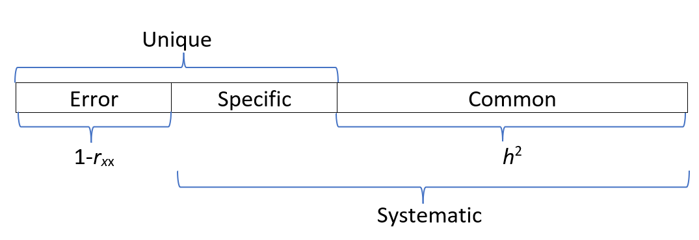
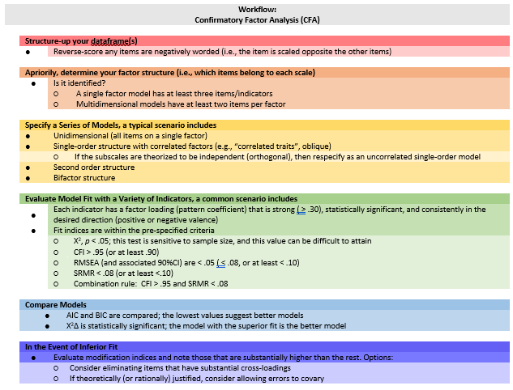

# Confirmatory Factor Analysis {-}

# CFA: First Order Models {#CFA1st}

[Screencasted Lecture Link](https://spu.hosted.panopto.com/Panopto/Pages/Viewer.aspx?pid=121320e4-e934-42c6-80dd-adc4015b944e) 
 
```{r  include=FALSE}
knitr::opts_chunk$set(echo = TRUE)
knitr::opts_chunk$set(comment = NA) #keeps out the hashtags in the knits
options(scipen=999)#eliminates scientific notation
```

This is the first in our series on confirmatory factor analysis (CFA).  

Our goal is:

* Comparison of CFA and EFA/PCA
* Identify issues in specifying models
* First order models -- specification and running
  + unidimensional
  + multidimensional
* Interpreting output
* Comparing two versions (unidimensional, multidimensional) of a first-order model

## Navigating this Lesson

This lesson is just over two hours.  I would add another two hours to work through and digest the materials.

While the majority of R objects and data you will need are created within the R script that sources the chapter, occasionally there are some that cannot be created from within the R framework. Additionally, sometimes links fail.  All original materials are provided at the [Github site](https://github.com/lhbikos/ReC_Psychometrics) that hosts the book. More detailed guidelines for ways to access all these materials are provided in the OER's [introduction](#ReCintro)

### Learning Objectives

Focusing on this week's materials, make sure you can:

* Compare and contrast EFA and CFA
* Identify the components of item-level variance in CFA
* Specify CFA measurement models 
* Interpret fit indices (e.g., Chi-square, CFI, RMSEA)
* Interpret statistics used do compare two CFA models

### Planning for Practice

In each of these lessons I provide suggestions for practice that allow you to select one or more problems that are graded in difficulty. The least complex is to change the random seed and rework the problem demonstrated in the lesson. The results *should* map onto the ones obtained in the lecture. 

The second option comes from the "the back of the book" where a [chapter](#sims) contains simulated data for all of the examples worked in this volume. Any of these is available for CFA.

As a third option, you are welcome to use data to which you have access and is suitable for CFA. These could include other simualated data, data available through open science repositories, or your own data (presuming you have permissoin to use it). 

The suggestion for practice spans this chapter and the [next](#CFA2nd). From this assignment, you should plan to:

* Prepare the data frame for CFA. 
* Specify and run unidimensional and single order (with correlated factors) models.
  - In the next chapter, you will add the specification, evaluation, and write-up of second-order and bifactor models.
* Narrate the adequacy of fit with $\chi ^{2}$, CFI, RMSEA, SRMR 
  - Write a mini-results section for each
* Compare model fit with $\chi ^{2}\Delta$, AIC, and BIC.
* Write an APA style results sections with table(s) and figures.

### Readings & Resources

In preparing this chapter, I drew heavily from the following resource(s). Other resources are cited (when possible, linked) in the text with complete citations in the reference list.

Byrne, B. M. (2016). Structural equation modeling with AMOS: Basic concepts, applications, and programming (3rd ed.). Routledge. http://ebookcentral.proquest.com/lib/spu/detail.action?docID=4556523

  * Chapter 1, Structural Equation Modeling: The basics
  * Chapter 3, Application 1:  Testing the Factorial Validity of a Theoretical Construct (First-Order CFA Model)
  * Chapter 4, Application 2:  Testing the Factorial Validity of a Measurement Scale (First-Order CFA Model)

Dekay, Nicole (2021). Quick Reference Guide: The statistics for psychometrics  https://www.humanalysts.com/quick-reference-guide-the-statistics-for-psychometrics

Kline, R. (2016). Principles and practice of structural equation modeling (Fourth ed., Methodology in the social sciences). New York: The Guilford Press.

* Chapter 9:  Specification and Identification of Confirmatory Factor Analysis Models
* Chapter 13:  Analysis of Confirmatory Factor Analysis Models
* Chapter 12:  Global Fit Testing

Rosseel, Y. (2019). The *lavaan* tutorial. Belgium:  Department of Data Analysis, Ghent University. http://lavaan.ugent.be/tutorial/tutorial.pdf 

* "The model syntax" pp. 3 - 4
* "A first example:  confirmatory factor analysis (CFA)" pp. 4-8.

### Packages

The packages used in this lesson are embedded in this code. When the hashtags are removed, the script below will (a) check to see if the following packages are installed on your computer and, if not (b) install them.
```{r }
#will install the package if not already installed
#if(!require(lavaan)){install.packages("lavaan")}
#if(!require(lavaanPlot)){install.packages("lavaanPlot")}
#if(!require(psych)){install.packages("psych")}
#if(!require(semTable)){install.packages("semTable")}
```


## Two Broad Categories of Factor Analysis: Exploratory and Confirmatory

Kline [-@kline_principles_2016] described confirmatory factor analysis as "exactly half that of SEM -- the other half comes from regression analysis" (p. 189).

### Common to Both Exploratory and Confirmatory Approaches

In both exploratory and confirmatory approaches, the variance of each indicator/item is divided into **common** and **unique** variance. When we assume that variance is 1.0, the common variance becomes the communality.  If we have 8 items, we will have 8 communalities and this represents the common variance explained by the factors or components.

* **Common variance** is shared among the indicators and serves as a basis for observed covariances among them that depart, meaningfully, from zero.  We generally assume that
  + common variance is due to the factors, and
  + there will be fewer factors than the number of indicators/items (after all, there is no point in retaining as many factors [explanatory entities] as there are entities to be explained [indicators/items])
  + the proportion of total variance that is shared is the **communality** (estimated by $h^2$); if $h^2$ =.70, then 70% of the total indicator variance is common and potentially explained by the factors
* **Unique variance** consists of 
  + **specific variance**:  systematic variance that is not explained by any factor in the model
  * **random measurement error**
  * **method variance** is not pictured, but could be another source of unique variance
* In factor analysis, summing the communalities represents the total common variance (a portion of the total variance), but not the total variance. 
  + Factor analysis, then, aligns well with classic test theory and classic approaches to understanding reliability (observed score = true score + error).
  + The inclusion of error is illustrated well in the classic illustrations of CFA and SEM where each item/indicator includes common variance (from the factor) and error variance.
  
*Recall that principal components analysis (PCA is not factor analysis) one of the key distinctions is that all variance is common variance (there is no unique variance).  Total common variance is equal to the total variance explained, which in turn is equal to the total variance.*




### Differences between EFA and CFA

* **A priori specification of the number of factors**
  + EFA requires no a priori specification; prior to extraction an EFA program will extract as many factors as indicators.  Typically, in subsequent analyses, the researchers specifies how many factors to extract.
  + CFA requires researchers to specify the exact number of factors.
* **The degree of "exact correspondence" between indicators/items and factors/scales**
  + EFA is an **unrestricted measurement model**  That is, indicators/items  depend on (theoretically, measure) all factors. The direct effects from factors to indicators are *pattern coefficients*. Kline [-@kline_principles_2016] says that most refer to these as *factor loadings* or just *loadings* but because he believes these terms are ambiguous, he refers to the direct effects as *pattern coefficients*. We assign them to factors based on their highest loadings (and hopefully no cross-loadings).  Depending on whether we select an orthogonal or oblique relationship, there may be an identified correlation between factors.
  + CFA is a **restricted measurement model**. The researcher specifies the factor(s) on which each indicator/item(s) depends (recall, the causal direction in CFA is from factor to indicators/items.)
* **Identification status**  The *identification* of a model has to do with whether it is theoretically possible for a computer to derive a unique set of model parameter estimates. Identification is related to model *degrees of freedom*; we will later explore under-, just-, and over-identified models.  For now...
  + EFA models with multiple factors are *unidentified* because they will have more free parameters than observations.  Thus, there is no unique set of statistical estimates for the multifactor EFA model, consequently this requires the rotation phase in EFA.
  + CFA models must be identified before they can be analyzed so there is only one unique set of parmeter estimates.  Correspondingly, there is no rotation phase in CFA.
* **Sharing variances**
  + In EFA the specific variance of each indicator is not shared with that of any other indicator.
  + In CFA, the researchers can specify if variance is shared between certain pairs of indicators (i.e., error covariances).
  
### On the relationship between EFA and CFA

Kline [-@kline_principles_2016] admonishes us to not overinterpret the labels "exploratory" and "confirmatory".  Why?

  * EFA requires no a priori hypotheses about the relationship between indicators/items and factors, but researchers often expect to specify a predetermined number of factors.
  * CFA is not strictly confirmatory.  After initial runs, many researchers modify models and hypotheses. 

CFA is not a verification or confirmation of EFA results for the same data and number of factors.  Kline [-@kline_principles_2016] does not recommend that researchers follow a model retained from EFA.  Why?

  * It is possible that the CFA model will be rejected.  Oftentimes this is because the secondary coefficients (i.e., non-primary pattern coefficients) accounted for a signifciant proportion of variance in the model.  When they are constrained to 0.0 in the CFA model, the model fit will suffer.
  * If the CFA model is retained, then it is possible that both EFA and CFA capitalized on chance variation. Thus, if verification via CFA is desired, it should be evaluated through a replication sample.


## Exploring a Standard CFA Model

The research vignette for today is a fairly standard CFA model.


The image represents represents the hypothesis that $AS_1 - AS_9$, $AF_1 - AF_4$, $MI_1 - MI_5$, and $AUA_1 - AUA_4$ measure, respectively, the AS, AF, MI, and AUA factors, which are assumed to covary.  Specifically,in this model:

1. Each indicator is continuous with two causes:  $AS$ --> $AS_1$ <-- $E_1$
   * a single factor that the indicator is supposed to measure, and
   * all unique sources of influence represented by the error term
2. The error terms are independent of each other and of the factors
3. All associations are linear and the factors covary.
   * hence, the symbol for an unanalyzed association is a solid line (upgraded from the dashed one in the EFA)
4. Each item has a single *pattern coefficient* (i.e., often more casually termed as a "factor loading")
   * All other potential pattern coeficients are set to "0.00."  These are *hard hypotheses* and are specified by their absence (i.e., not specified in the code or in the diagram).
5. *Structure coefficents* are the Pearson correlations between factors and continuous indicators.  They reflect any source of association, causal or noncausal. Sometimes the association is an undirected, back-door path.  There is no pattern coefficient for $AS_2$ <-> $AF$.  BUT, there is a connection from $AS_2$ to $AF$ via the $AS$ <--> $AF$ covariance.
6.  *Scaling constants* (aka *unit loading identification [ULI] constraints*) are necessary to scale the factors in a metric related to that of the explained (common) variance of the corresponding indicator, or *reference (marker) variable*. In the figure these are the dashed-line paths from $AS$ --> $AS_1$,  $AF$ --> $AF1$,  $MI$ --> $MI1$ and  $AUA$ --> $AUA1$.
   * Selecting the reference marker variable is usually aribtrary and selected by the computer program as the first (or last) variable in the code/path.  So long as all the indicator variables of the same factor have equally reliable scores, this works satisfactorily.
   * Additional scaling constants are found for each of the errors and indicators.
   
### Model Identification for CFA

SEM, in general, requires that all models be *identified.*  Measurement models analyzed in CFA share this requirement, but identification is more straightforward than in other models.  

Standard CFA models are sufficiently identifed when:

1. A single factor model has at least three indicators, or
2. In a model with two or more factors, each factor has two or more indicators.
   * Note:  It is better to have at least three to five indicators per factor to prevent technical problems with statistical identification.
   
Identification becomes much more complicated than this, but for today's models this instruction is sufficent.

### Selecting Indicators/Items for a Reflective Measurement

*Reflective measurement* is another term to describe the circumstance where latent variables are assumed to cause observed variables.  Observed variables in reflective measurement are called *effect (reflective) indicators*.

* At least three for a unidimensional model; at least two per factor for a multidimensional model (but more is safer).
* The items/indicators should have reasonable internal consistency, they should correlate with each other, and correlate more with themselves than with items on other factors (if multidimensional).
* Negative correlations reduce the reliability of factor measurement, so they should be reverse coded pior to analysis.
* Do not be tempted to specify a factor with indicators that do not measure something.  A common mistake is to create a "background " factor and include indicators such as gender, ethnicity, and level of education.  *Just what is the predicted relationship between gender and ethnicity?*


## CFA Workflow

Below is a screenshot of a CFA workflow. The original document is located in the [Github site](https://github.com/lhbikos/ReC_Psychometrics) that hosts the ReCentering Psych Stats:  Psychometrics OER.



Because the intended audience for the ReCentering Psych Stats OER is the scientist-practitioner-advocate, this lesson focuses on the workflow and decisions. As you might guess, the details of CFA can be quite complex and require more investigation and decision-making in models that pose more complexity or empirical challenges. 

* Creating an items only dataframe where any items are scaled in the same direction (e.g., negatively worded items are reverse-scored).
* Determining a factor structure that is *identified*, that is
  - A single factor (unidimensional) model has at least three items/indicators
  - Multidimensional models have at least two items per factor
* Specify a series of models, these typicallyinclude
  - A unidimensional model (all items on a single factor)
  - A single order structure with correlated factors
  - A second orer structure
  - A bifactor structure
* Evaluate model fit with a variety of indicators
  - factor loadings
  - fit indices
* Compare models
* In the event of poor model fit, investigate modification indices and consider respecification
  - eliminating items
  - changing factor membership
  - allowing errors to covary

### CFA in *lavaan* Requires Fluency with the Syntax

* It's really just regression
  + tilda (~, *is regressed on*) is regression operator 
  + place DV (y) on left of operator
  + place IVs, separate by + on the right
* f is a latent variable (LV)
* Example:  y ~ f1 + f2 + x1 + x2

* LVs must be *defined* by their manifest or latent indicators.  
  + the special operator (=~, *is measured/defined by*) is used for this
  + Example:  f1 =~ y1 + y2 + y3
  
* Variances and covariances are specified with a double tilde operator (~~, *is correlated with*)
  + Example of variance:  y1 ~~ y1 (the relationship with itself)
  + Example of covariance:  y1 ~~ y2 (relationship with another variable)
  + Example of covariance of a factor:  f1 ~~ f2
  
*Intercepts (~ 1) for observed and LVs are simple, intercept-only regression formulas
  + Example of variable intercept:  y1 ~ 1
  + Example of factor intercept:  f1 ~ 1
  
A complete lavaan model is a combination of these formula types, enclosed between single quotation models. Readibility of model syntax is improved by:

* splitting formulas over multiple lines
* using blank lines within single quote
* labeling with the hashtag

myModel <- '# regressions
            y1 + y2 ~ f1 + f2 + x1 + x2
            f1 ~ f2 + f3
            f2 ~ f3 + x1 + x2
            
            # latent variable definitions
            f1 =~ y1 + y2 + y3
            f2 =~ y4 + y5 + y6
            f3 =~ y7 + y8 + y9 + y10
            
            # variances and covariances
            y1 ~~ y1
            y2 ~~ y2
            f1 ~~ f2
            
            # intercepts
            y1 ~ 1
            fa ~ 1

### Differing Factor Structures

All models worked in this lesson are *first-order* (or single-order) models; in the next lesson we extend to hierarchical and bifactor models. To provide an advanced cognitive organizer, let's take a look across the models.  


Models A and B are first-order models.  Note that all factors are on a single plane.

* Model A is undimensional, each item is influenced by a single common factor and a term that includes systematic and random error. Note that there is only one *systematic* source of variance for each item and it is from a single source.
* Model B is often referred to as a "correlated traits" model.  Here, the larger construct is separated into distinct-yet-correlated elements.  The variance of each item is assumed to be a weighted linear function of two or more common factors.  
* Models C is a second-order factor structure.  Rather than merely being correlated, factors are related because they share a common cause.  In this model, the second order factor *explains* why three or more traits are correlated.  Note that here is no direct relationship between the item and the target construct.  Rather, the relationship between the second-order factor and each item is mediated through the primary factor (yes, an indirect effect!).
* Model D is a bifactor structure.  Here each item loads on a general factor.  This general factor (bottom row) reflects what is common among the items and represents the individual differences on the target dimension that a researcher is most interested in. Group factors (top row) are now specified as *orthogonal*.  The group factors represent common factors measured by the items that explain item response variation not accounted for by the general factor.  In some research scenarios, the group factors are termed "nuisance" dimensions.  That is, that which they have in common interferes with measuring the primary target of interest.

## Research Vignette

This lesson's research vignette emerges from Keum et al's Gendered Racial Microaggressions Scale for Asian American Women (GRMSAAW; [@keum_gendered_2018]). The article reports on two separate studies that comprised the development, refinement, and psychometric evaluation of two, parallel, versions (stress appraisal, frequency) of scale. We simulate data from the final construction of the frequency version as the basis of the lecture.  If the scale looks somewhat familiar it is because the authors used the Gendered Racial Microaggressions Scale for Black Women [@lewis_construction_2015] as a model. 

Keum et al. [-@keum_gendered_2018] reported support for a total scale score (22 items) and four subscales. Below, I list the four subscales, their number of items, and a single example item. At the outset, let me provide a content warning. For those who hold this particular identity (or related identities) the content in the items may be upsetting. In other lessons, I often provide a variable name that gives an indication of the primary content of the item. In the case of the GRMSAAW, I will simply provide an abbreviation of the subscale name and its respective item number. This will allow us to easily inspect the alignment of the item with its intended factor, and hopefully minimize discomfort. If you are not a member of this particular identity, I encourage you to learn about these microaggressions by reading the article in its entirety.  Please do not ask members of this group to explain why these microaggressions are harmful or ask if they have encountered them.  

There are 22 items on the GRMSAAW scale. The frequency scaling ranged included: 0(*never*), 1 (*rarely*), 2(*sometimes*), 3(*often*), 4(*very frequently*), and 5(*always*).

The four factors, number of items, and sample item are as follows:

* Ascribed Submissiveness
  - 9 items
  - "Others have been surprised when I disagree with them."
  - Abbreviated in the simulated data as "AS#"
* Asian Fetishism
  - 4 items
  - "Others have treated me as if I am always open to sexual advances.'"
  - Abbreviated in the simulated data as "AF#"
* Media Invalidation
  - 5 items
  - "I see AAW playing the same type of characters (e.g., Kung Fu woman, sidekick, mistress, tiger mom) in the media."
  - Abbreviated in the simulated data as "MI#"
* Assumptions of Universal Appearance
  - 4 items
  - "Others have pointed out physical traits in AAW that do not look 'Asian'."
  - Abbreviated in the simulated data as "UA#"

Below I walk through the data simulation. This is not an essential portion of the lesson, but I will lecture it in case you are interested. None of the items are negatively worded (relative to the other items), so there is no need to reverse-score any items.

```{r }
#The GRMSAAW has two scales:  frequency and stress appraisal. This simulation is for the frequency scale.
set.seed(210927)
GRMSAAWmat <- matrix(c(.83, .79, .75, .72, .70, .69, .69, .69, .63, -.06, -.01, -.02, .21, -.03, -.04, .02, .05, .17, .05, .01, .00, -.06,
                       .07, -.03, -.06, -.02, .08, -.06, -.01, -.03, .13, .85, .76, .75, .70, .10, -.12, -.06, .01, .06, -.06, -.04, .07, .18,
                       -.11, -.06, .04, .02, -.03, .04, .15, .08, -.03, -.10, .11, .13, -.13, .69, .63, .61, .54, .46, -.05, -.02, .14, .14,
                       .03, .05, -.01, -.06, .04, .08, -.13, .03, .02, .07, .06, -.11, -.02, -.08, .13, .09, -.04, -.03, .90, .79, .62, .51), ncol=4) #primary factor loadings for the four factors taken from Table 2 of the manuscript
rownames(GRMSAAWmat) <- c("AS1", "AS2", "AS3", "AS4", "AS5", "AS6", "AS7", "AS8", "AS9", "AF1", "AF2", "AF3", "AF4", "MI1", "MI2", "MI3", "MI4", "MI5", "AUA1", "AUA2", "AUA3", "AUA4") #variable names for the items
colnames(GRMSAAWmat) <- c("Submissiveness", "Fetishism", "Media", "Appearance") #component (subscale) names
GRMSAAWCorMat <- GRMSAAWmat %*% t(GRMSAAWmat) #create the correlation matrix via some matrix algebra
diag(GRMSAAWCorMat) <- 1
#GRMSAAWCorMat  #prints the correlation matrix
GRMSAAW_M <- c(2.91,	3.3,	3.45,	2.85,	3.89,	3.11,	3.83,	3.07,	2.88, 3.3, 3.64,	3.21,	3.21, 4.2,	4.8,	4.7,	4.5,	4.89, 4.47,	4.69,	4.47,	4.45) #Means estimated from the information in Table 4. I divided the M by the number of items in each scale then "jittered" the number of values I needed around that mean.
GRMSAAW_SD <- c(1.21,	0.81,	1.34,	1.62,	1.89,	0.93,	1.01,	1.17,	1.22, 1.28,	1.47,	1.45,	1.34, 0.78,	0.93,	0.96,	0.88,	0.91, 1.13,	1.15,	1.11,	1.09) #SDs estimated from the information in Table 4. I divided the SD by the number of items in each scale then "jittered" the number of values I needed around that SD
GRMSAAWCovMat <- GRMSAAW_SD %*% t(GRMSAAW_SD) * GRMSAAWCorMat #creates a covariance matrix (with more matrix algebra) from the correlation matrix
dfGRMSAAW <- as.data.frame(round(MASS::mvrnorm(n=304, mu = GRMSAAW_M, Sigma = GRMSAAWCovMat,  empirical = TRUE),0)) #creates the item level data from the sample size, mean, and covariance matrix; wrapped in commands to round to 0 decimal places and format as a df
dfGRMSAAW[dfGRMSAAW>5]<-5 #restricts the upperbound of all variables to be 5 or less
dfGRMSAAW[dfGRMSAAW<0]<-0 #resticts the lowerbound of all variable to be 0 or greater

#Below is code if you would like an ID number for each case. Expecially at first, the ID number would just need to be removed, so I will not include it in the original simulation. We will add it later.
#library(tidyverse)
#dfGRMSAAW <- dfGRMSAAW %>% dplyr::mutate(ID = row_number()) #add ID to each row
#dfGRMSAAW <- dfGRMSAAW %>%dplyr::select(ID, everything())#moving the ID number to the first column; requires
```

Let's take a quick peek at the data to see if everthing looks correct.
```{r}
psych::describe(dfGRMSAAW)
```

The optional script below will let you save the simulated data to your computing environment as either a .csv file (think "Excel lite") or .rds object (preserves any formatting you might do). If you save the .csv file and bring it back in, you will lose any formatting (e.g., ordered factors will be interpreted as character variables).
```{r}
#write the simulated data  as a .csv
#write.table(dfGRMSAAW, file="dfGRMSAAW.csv", sep=",", col.names=TRUE, row.names=FALSE)
#bring back the simulated dat from a .csv file
#dfGRMSAAW <- read.csv ("dfGRMSAAW.csv", header = TRUE)
```
An .rds file preserves all formatting to variables prior to the export and re-import.  For the purpose of this chapter, you don't need to do either. That is, you can re-simulate the data each time you work the problem.
```{r}
#to save the df as an .rds (think "R object") file on your computer; it should save in the same file as the .rmd file you are working with
#saveRDS(dfGRMSAAW, "dfGRMSAAW.rds")
#bring back the simulated dat from an .rds file
#dfGRMSAAW <- readRDS("dfGRMSAAW.rds")
```


### Modeling the GRMSAAW as Unidimensional

Let's start simply, taking the GRMSAAW data and seeing about its fit as a unidimensional instrument. First evaluating multi-dimensional measures as unidimensional is a common pratice.  And there are two reasons:

*  Operationally, it's a check to see that data, script, and so forth. are all working.
*  If you can't reject a single-factor model (e.g., if there is a strong support for such), then it makes little sense to evaluate models with more factors [@kline_principles_2016].

With a single factor model:

* GRMSAAW is a latent variable and can be named anything.  We know this because it is followed by: =~
* All the items follow and are "added" with the plus sign
  +  Don't let this fool you...the assumption behind SEM/CFA is that the LV *causes* the score on the item/indicator.  Recall, item/indicator scores are influenced by the LV and error.
* The entire model is enclosed in tic marks (' and ')

```{r}
grmsAAWmod1  <- 'GRMSAAW =~ AS1 + AS2 + AS3 + AS4 + AS5 + AS6 + AS7 + AS8 + AS9 + AF1 + AF2 + AF3 + AF4 + MI1 + MI2 + MI3 + MI4 + MI5 + AUA1 + AUA2 + AUA3 + AUA4'
grmsAAWmod1
```

The object representing the model is then included in the *lavaan::cfa()* along with the dataset.

We can ask for a summary of the object representing the results.
```{r}
grmsAAW1fit <- lavaan::cfa (grmsAAWmod1, data = dfGRMSAAW)
lavaan::summary(grmsAAW1fit, fit.measures=TRUE, standardized=TRUE, rsquare = TRUE)
```

I find it helpful to immediately plot what we did.  A quick look alerts me to errors.  
```{r}
semPlot::semPaths(grmsAAW1fit, layout = "tree", style = "lisrel", what = "col", whatLabels = "stand")
```


#### Interpreting the Output

With a quick look at the plot, let's work through the results.  Rosseel's (2019) *lavaan* tutorial is a useful resource in walking through the output.

The *header* is the first few lines of the information. It contains:

* the *lavaan* version number (0.6-9 that I'm using on 10/4/2021)
* maximum likelihood (ML) was used as the estimator
* confirmation that the specification converged normally after 28 iterations
* 304 cases were used in this analysis (would be less if some were skipped because of missing data)
* the model user test statistic, df, and corresponding p value:  $\chi ^{2}(209) = 1004.136, p < .001$

**Fit statistics** are included in the second section.  They are only shown when the argument "fit.measures = TRUE" is in the script. Standardized values are not the default, they require the argument, "standardized = TRUE".  We'll come back to these shortly...

*Parameter estimates* is the last section.

For now we are interested in the Latent Variables section.

* *Estimate* contains the estimated or fixed parameter value for each model parameter;
* *Std. err* is the standard error for each estimated parameter;
* *Z-value* is the Wald statistic (the parameter divided by its SE)
* *P(>|z|)* is the p value for testing the null hypothesis that the parameter equals zero in the population
* *Std.lv* standardizes only the LVs
* *Std.all* both latent and observed variables are standardized; this is considered the "completely standardized solution"

Note that item AS1 might seem incomplete -- there is only a 1.000 and a value for the Std.lv.  Recall we used this to scale the single factor by fixing its value to 1.000.  Coefficients that are fixed to 1.0 to scale a factor have no standard errors and therefore no significance test.

The SE and associated $p$ values are associated with the unstandardized estimates. Intuitively, it is easiest for me to understand the relative magnitude of the pattern coefficients by looking at the *Std.all* column. We can see that the items associated with what we will soon define as the AS factor are all strong and positive. The remaining items have variable loadings with many of the being quite low, non-significant, and even negatively valenced.

Let's examine to the middle set metrics which assess *global fit*.

CFA falls into a *modeling* approach to evaluating results.  While it provides some flexibility (we get away from the strict, NHST appproach of $p$ < .05) there is greater interpretive ambiguity.

Fit statistics tend to be clustered together based on their approach to summarizing the *goodness* or *badness* of fit.

#### Model Test *User* Model: 

The chi-square statistic that evaluates the *exact-fit hypothesis* that there is no difference between the covariances predicted by the model, given the parameter estimates, and the population covariance matrix.  Rejecting the hypothesis says that, 

* the data contain covariance information that speak against the model, and
* the researcher should explain model-data discrepancies that exceed those expected by sampling error.

Traditional interpretion of the chi-square is an *accept-support test* where the null hypothesis represents the researchers' believe that the model is correct.  This means that the absence of statistical significance ($p$ > .05) that supports the model.  This is backwards from our usual *reject-support test* approach.

The $\chi^2$ is frequently criticized:

* *accept-support test* approaches are logically weaker because the failure to disprove an assertation (the exact-fit hypothesis) does not prove that the assertion is true;
* too small a sample size (low power) makes it more likely that the model will be retained;
* CFA/SEM, though, requires large samples and so the $\chi^2$ is frequently statistically significant -- which rejects the researchers' model;

Kline [-@kline_principles_2016] recommends that we treat the $\chi^2$ like a smoke alarm -- if the alarm sounds, there may or may not be a fire (a serious model-data discrepancy), but we should treat the alarm seriously and further inspect issues of fit.

For our unidimensional GRMSAAW CFA  $\chi ^{2}(209)=1004.136, p < .001$, this significant value is not what we want because it says that our specified model is different than the covariances in the model.


#### Model Test *Baseline* Model

This model is the *independence* model.  That is, there is complete independence of of all variables in the model (i.e., in which all correlations among variables are zero).  This is the most restricted model.  It is typical for chi-quare values to be quite high (as it is in our example:  2114.899).  On its own, this model is not useful to us.  It is used, though, in comparisons of *incremental fit*.  


#### Incremental Fit Indices (User versus Baseline Models)  

Incremental fit indices ask the question, how much better is the fit of our specified model to the data then the baseline model (where it is assumed no relations between the variables).

The Comparative Fit Index (CFI) and Tucker-Lewis Index (TLI) are *goodness of fit* statistics, ranging from 0 to 1.0 where 1.0 is best.

**CFI**:  compares the amount of departure from close fit for the researcher's model against that of the independence/baseline (null) model. 

$$CFI = 1-\frac{\hat{\Delta_{M}}}{\hat{\Delta_{B}}}$$

We can actually calculate this using the baseline and chi-square values from our own data:

```{r}
1 - (1004.136/2114.899)
```

Where there is no departure from close fit, then CFI will equal 1.0.  We interpret the value of the CFI as a percent of how much better the researcher's model is than the baseline model.  While 58% sounds like an improvement -- Hu and Bentler (1999) stated that "acceptable fit" is achieved when the $CFI \geq .95$ and $SRMR \leq .08$; the **combination rule**.  It is important to note that later simulation studies have not supported those thresholds.

**TLI**:  aka the **non-normed fit index (NNFI)** controls for $df_M$ from the researcher's model and $df_B$ from the baseline model.  As such, it imposes a greater relative penalty for model complexity than the CFI. The TLI is a bit unstable in that the values can exceed 1.0.  

Because the two measures are so related, only one should be reported (I typically see the CFI).

For our unidimensional GRMSAAW CFA, CFI = .578 and TLI = .534.  While these predict around 58% better than the baseline/independence model, it does not come close to the standard of $\geq .95$.

*I note that our hand calcuation of user and baseline models did not result in the exact CFI. I do not know why.*

#### Loglikelihood and Information Criteria

The **Aikaike Information Criterion (AIC)** and the **Bayesian Information Criterion (BIC)** utilize an information theory approach to data analysis by combing statistical estimation and model selection into a single framework. The BIC augments the AIC by taking sample size into consideration.

The AIC and BIC are usually used to select among competing nonhierarchical models and are only used in comparison with each other.  Thus our current values of 17755.028 (AIC) and 17918.577 (BIC) are meaningless on their own.  The model with the smallest value of the predictive fit index is chosen as the one that is most likely to replicate.  It means that this model has relatively better fit and fewer free parameters than competing models.

For our unidimensional GRMSAAW CFA we'll return to these values to compare a correlated, four-factor solution.

#### Root Mean Square Error of Approximation

The RMSEA is an absolute fit index scaled as a *badness-of-fit* statistic where a value of 0.00 is the best fit. The RMSEA favors models with more degrees of freedom and larger sample sizes.  A unique aspect of the RMSEA is its 90% confidence interval. 

While there is chatter/controversy about what constitutes an acceptable value, there is general consensus that $RMSEA \geq .10$ points to serious problems.  An $RMSEA\leq .05$ is desired.  Watching the upper bound of the confidence interval is important to see that it isn't sneaking into the danger zone.

For our unidimensional GRMSAAW CFA, RMSEA = .112, 90% CI(.105, .119). Unfortuantely this value points to serious problems.

#### Standardized Root Mean Square Residual

The SRMR is an absolute fit index that is a *badness-of-fit* statistic (i.e., perfect model fit is when the value = 0.00 and increasingly higher values indicate the "badness").

The SRMR is a standardized version of the **root mean square residual (RMR)**, which is a measure of the mean absolute covariance residual.  Standardizing the value facilitates interpretation.

Poor fit is indicated when $SRMR \geq .10$. 

Recall, Hu and Bentler's **combination rule** (which is somewhat contested) suggested that the SRMR be interpreted along with the CFI such that:   $CFI \geqslant .95$ and $SRMR \leq .05$.

For our unidimensional GRMSAAW CFA, SRMR = .124.  Not good.

Inspecting the residuals (we look for relatively large values) may help understand the source of poor fit, so let's do that.  

```{r}
lavaan::fitted(grmsAAW1fit)
#lavaan::residuals(grmsAAW1fit, type = "raw")
#lavaan::residuals(grmsAAW1fit, type = "standardized")

#will hashtag out for knitted file
lavaan::residuals(grmsAAW1fit, type = "cor")
lavaan::modindices(grmsAAW1fit)
```

Kline recommends evaluating the "cor" residuals.  In our output, these seem to be the "cor.bollen" and are near the bottom.  He recommends that residuals > .10 may be possible sources for misfit.  He also indicated that patterns may be helpful (is there an item that has consistently high residuals).

Kline also cautions that there is no dependable or trustworthy connection between the size of the residual and the type or degree of model misspecification.  

My first read of our results is that the items in the AS# factor were well-defined. I suspect that a multi-factor solution will improve the fit.

The *semTable* package can help us extract the values into a .csv file which will make it easier to create an APA style table.  It takes some tinkering...

```{r}
#library(semTable)
#I took out commas internal to the items because the comma causes the text to split across columns in the exported .csv
v1 <- c(AS1 = "Others expect me to be submissive", AS2 = "Others have been surprised when I disagree with them", AS3 = "Others take my silence as a sign of compliance", AS4 = "Others have been surprised when I do things independent of my family", AS5 = "Others have implied that AAW seem content for being a subordinate", AS6 = "Others treat me as if I will always comply with their requests", AS7 = "Others expect me to sacrifice my own needs to take care of others (eg family partner) ecause I am an AAW", AS8 = "Others have hinted that AAW are not assertive enough to be leaders", AS9 = "Others have hinted that AAW seem to have no desire for leadership", AF1 = "Others express sexual interest in me because of my Asian appearance", AF2 = "Others take sexual interest in AAW to fulfill their fantasy", AF3 = "Others take romantic interest in AAW just because they never had sex with an AAW before", AF4 = "Others have treated me as if I am always open to sexual advances", MI1 = "I see non-Asian women being casted to play female Asian characters", MI2 = "I rarely see AAW playing the lead role in the media", MI3 = "I rarely see AAW in the media", MI4 = "I see AAW playing the same type of characters (eg Kung Fu woman sidekick mistress tiger mom) in the media", MI5 = "I see AAW charaters being portrayed as emotionally distanct (eg cold-hearted lack of empathy) in the media", AUA1 = "Others have talked about AAW as if they all have the same facial features (eg eye shape skin tone)", AUA2 = "Others have suggested that all AAW look alike", AUA3 = "Others have talked about AAW as if they all have the same body type (eg petite tiny small-chested", AUA4 = "Others have pointed out physical traits in AAW that do not look 'Asian'")

grmsAAW1table <- semTable::semTable(grmsAAW1fit, columns = c("eststars", "se", "p"), columnLabels = c(eststars = "Estimate", se = "SE", p = "p-value"), fits = c("chisq", "df", "pvalue", "cfi", "rmsea", "rmsea.ci.lower", "rmsea.ci.upper", "srmr", "aic", "bic"),  varLabels = v1, file = "grmsAAW1table", type = "csv", print.results = FALSE )
#Can change "print.results" to TRUE if you want to see the (messy) output in the .rmd file (it's easier to read the lavaan output).
```
Cool, but it doesn't contain standardized estimates. One way to get them is to create an updated model with the standardized output:

```{r}
grmsAAW1stdzd <- update (grmsAAW1fit, std.lv = TRUE, std.ov = TRUE, meanstructure = TRUE)
```

Now request both models in the semTable

```{r}
grmsAAW1table <- semTable::semTable(list ("Ordinary" = grmsAAW1fit, "Standardized" = grmsAAW1stdzd), columns = list ("Ordinary" = c("eststars", "se", "p"), "Standardized" = c("est")), columnLabels = c(eststars = "Estimate", se = "SE", p = "p-value"), fits = c("chisq", "df", "pvalue", "cfi", "rmsea", "rmsea.ci.lower", "rmsea.ci.upper", "srmr", "aic", "bic"),  varLabels = v1, file = "grmsAAW1table", type = "csv", print.results = FALSE )
#Can change "print.results" to TRUE if you want to see the (messy) output in the .rmd file (it's easier to read the lavaan output).
```

*Troubleshooting*  If, while working with this function you get the error, "Error in file(file, ifelse(append, "a", "w")) : cannot open the connection" it's because the .csv file that received your table is still open.  R is just trying to write over it.  A similar error happens when knitting, or updating any spreadsheet or word document.

**APA Style Results from the Unidimensional model**

**Model testing**.  To evaluate the models we, we used confirmatory factor analysis (CFA) in the R package, *lavaan* (v.0-6.9) with maximum likelihood estimation. Our sample size was 304.  We selected fit criteria for their capacity to assess different aspects of the statistical analysis.  As is common among SEM researchers, we reported the Chi-square goodness of fit ($\chi^2$).  This evaluates the discrepancy between the unrestricted sample matrix and the restricted covariance matrix.  Although the associated $p$ value indicates adequate fit when the value is non-significant, it is widely recognized that large sample size can result in a statistically significant p value [@byrne_structural_2016].  The comparative fit index (CFI) is an incremental index, comparing the hypothesized modelat least .90 and perhaps higher than .95 [@kline_principles_2016].  The root mean square error of approximation (RMSEA) takes into account the error of approximation in the population and expresses it per degree of freedom.  As such, the fit indicator considers the complexity of the model. Ideal values are equal to or less than .05, values less than .08 represent reasonable fit, and values between .08 and .10 represent mediocre fit. The standardized root mean residual is a standardized measure of the mean absolute covariance residual -- the overall difference between the observed and predicted correlations. Values greater than .10 may indicate poor fit and inspection of residuals is then advised. Kline [-@kline_principles_2016] advised researchers to be cautious when using these criteria as strict cut-offs.  Elements such as sample size and model complexity should be considered when evaluating fit.

Our first model was unidimensional where each of the 24 items loaded onto a single factor representing overall, gendered racial microaggressions towards Asian American women. The Chi-square index was statistically signficant ($\chi ^{2}(209)=1004.136, p < .001$) indicating likely misfit. The CFI value of .58 indicated poor fit. The RMSEA = .11 (90% CI [.11, .20]) suggested serious problems.  The SRMR value of .12 exceeded the warning criteria of .10.  The AIC and BIC values were 17755.028 and 17918.577, respectively, and will become useful in comparing subsequent models.

### Modeling the GRMSAAW as a First-Order, 4-factor model

#### Specifying and Running the Model

As we know from the article, the GRMSAAW has four subscales. Therefore, let's respecify it as a first-order, four-factor model, allowing the factors to correlate.

**Model identification** is always a consideration.  In a multi-dimensional model, each factor requires a minimum of two items/indicators.  Our shortest scales are the AF and AUA scales, each with 4 items, so we are OK!

We will be using the *cfa()* function in lavaan.  When we do this, it does three things by default:

1. The factor loading of the first indicator of a latent variable is fixed to 1.0; this fixes the scale of the LV
2. Residual variances are added automatically.
3. All exogenous LVs are correlated.  
  - If you are specifying an orthogonal model you will want to to switch off the default behavior by including the statement: auto.cov.lv.x=FALSE

```{r}
grmsAAW4mod  <- 'AS =~ AS1 + AS2 + AS3 + AS4 + AS5 + AS6 + AS7 + AS8 + AS9
             AF =~ AF1 + AF2 + AF3 + AF4 
             MI =~ MI1 + MI2 + MI3 + MI4 + MI5
             AUA =~ AUA1 + AUA2 + AUA3 + AUA4'
grmsAAW4mod
```

```{r eval=FALSE}
#This code is identical to the one we ran above -- in this code below, we are just clearly specifying the covariances -- but the default of lavaan is to correlate latent variables when the cfa() function is used.

grmsAAW4mod  <- 'AS =~ AS1 + AS2 + AS3 + AS4 + AS5 + AS6 + AS7 + AS8 + AS9
             AF =~ AF1 + AF2 + AF3 + AF4 
             MI =~ MI1 + MI2 + MI3 + MI4 + MI5
             AUA =~ AUA1 + AUA2 + AUA3 + AUA4'
#covariances in our oblique model
  AS ~~ AF
  AS ~~ MI
  AS ~~ AUA
  AF ~~ MI
  AF ~~ AUA
  MI ~~ AUA
```

```{r}
grmsAAW4fit <- lavaan::cfa (grmsAAW4mod, data = dfGRMSAAW)
lavaan::summary(grmsAAW4fit, fit.measures=TRUE, standardized=TRUE, rsquare = TRUE)
```

```{r}
semPlot::semPaths(grmsAAW4fit, layout = "tree", style = "lisrel", what = "col", whatLabels = "stand")
```


The table

First an update to get the standardized results:
```{r}
grmsAAW4stdzd <- update (grmsAAW4fit, std.lv = TRUE, std.ov = TRUE, meanstructure = TRUE)
```

```{r eval = FALSE}
grmsAAW4table <- semTable::semTable(list ("Ordinary" =grmsAAW4fit, "Standardized" = grmsAAW4stdzd), columns = list ("Ordinary" = c("eststars", "se", "p"), "Standardized" = c("est")), columnLabels = c(eststars = "Estimate", se = "SE", p = "p-value"), fits = c("chisq", "df", "pvalue", "cfi", "rmsea", "rmsea.ci.lower", "rmsea.ci.upper", "srmr", "aic", "bic"), varLabels = v1, file = "grmsAAW4table", type = "csv", print.results = FALSE )

#Can change "print.results" to TRUE if you want to see the (messy) output in the .rmd file (it's easier to read the lavaan output).
```

#### Interpretation

Our model converged, normally, with 37 iterations.  The estimator was the lavaan default, maximum likelihood (ML).  All 304 cases were used in the analysis.

I mapped our pattern coefficients into the GRMSAAW tables.  Most pattern coefficients are strong, signifciant, and stably connected to their respective factor. The lowest factor loading was .220 (MI5).

A multidimensional factor structure also includes correlations/covariances between factors.  We can see that the correlation (look at the Std.all column) shows the following correlations (none are statistically significant):

AF & AS:  0.017
AF & MI: -0.060
AF & AUA: 0.035
AS & MI:  0.082
AS & AUA: 0.035
MI & AUA: 0.077

For our multi-dimensional GRMSAAW4 CFA  $\chi ^{2}(203)=220.858, p < .186$, this significant value is not what we want because it says that our specified model is not statistically significantly different than the covariances in the model. That is, our more parsimonious model is a reasonable explanation (simplification).

The CFI and TLI compare user (the 4-dimensional model we specified) and baseline (where no relations would exist between variables) models.  These values will always be close together because the only difference is that the TLI imposes a penalty for any model complexity.  The CFI seems to be more commonly reported and its value is 0.991.  This means our model performed 99% better than a model with no relations. It well-exceeds the traditional cutoffs of .90 and the more strict cutoff of .95. The TLI imposes a greater relative penalty for model complexity, consequently it is a smidge lower at .989.

The RMSEA one of the *badness of fit*, absolute fit index, statistics where a value of 0.00 is the best fit. Our RMSEA = 0.017 (90%CI[.000, .031]). As a quick reminder, an there is general consensus that $RMSEA\leq .05$ is desired and an $RMSEA \geq .10$ points to serious problems.  We watch the upper bound of the confidence interval to see that it isn't sneaking into the danger zone.

The SRMR is another absolute, *badness of fit* index (i.e., perfect model fit is when the value = 0.00 and increasingly higher values indicate the "badness"). The SRMR is a measure of the mean absolute covariance residual.  Standardizing the value facilitates interpretation. Poor fit is indicated when $SRMR \geq .10$. The GRMSAAW SRMR = .058.

Recall, Hu and Bentler's **combination rule** (which is somewhat contested) suggested that the SRMR be interpreted along with the CFI such that:   $CFI \geq .95$ and $SRMR \leq .08$.

For our unidimensional GRMSAAW CFA, the CFI = .99 and the SRMR = .058.  We are close!

The AIC and BIC utilize an information theory approach to data analysis by combing statistical estimation and model selection into a single framework. The BIC augments the AIC by taking sample size into consideration. We can compare the values from our current model to the former one.  The model with the smallest value of the predictive fit index is chosen as the one that is most likely to replicate.  It means that this model has relatively better fit and fewer free parameters than competing models. We will do that in the next section.

Before moving to model comparison, it is a good practice for locating sources of misfit (we look for relatively large values) is to inspect the residuals, so let's do that.  

```{r}
lavaan::fitted(grmsAAW4fit)
#lavaan::residuals(grmsAAW4fit, type = "raw")
#lavaan::residuals(grmsAAW4fit, type = "standardized")
lavaan::residuals(grmsAAW4fit, type = "cor")
#lavaan::modindices(grmsAAW4fit)
```

## Model Comparison

We evaluated two models (i.e., a unidimensional model and four-factor correlated model), which one is better? While, we have the narrative comparison (and would create a table with the comparisons) where the four-dimensional fit values (CFI = 0.99, RMSEA = 0.02 (90%CI[.00, .03], and SRMR = .058) outperformed the unidimensional ones (CFI = 0.58, RMSEA = .11 (90%CI[.11, .20]), and SRMR = .12). We can formally compare them with statistical comparisons.

Easy are AIC and BIC comparisons where "smaller value wins."

AIC GRMSAAW1: 17755.028
AIC GRMSAAW4: 16983.750

BIC GRMSAAW1: 17918.577
BIC GRMSAAW4: 17169.602

In both cases, the smaller values are for the more complex, 4-dimensional model.  The interpretation is that the model with the smaller AIC/BIC values is most likely to replicate.

Additionally, the **chi-square difference test**, $\chi_{D}^{2}$ can be used to compare nested models. Single-factor CFA models are nested under any other CFA model with two or more factors *for the same indicators*.  This is because a one-factor model is a restricted version of any model with multiple factors.  Our unidimensional GRMSAAW was nested under the 4-factor GRMSAAW model.

To calculate the chi-square difference test, we first grab the chi-square test values:

GRMSAAW1: $\chi ^{2}(209)=1004.136, p < .001$
GRMSAAW4:$\chi ^{2}(203)=220.858, p < .186$

Given both sets of results we calculate: $\chi ^{2}(6)= 783.278, p < .05$ and determine that the two models are statistically significantly different. Given that the fit statistics are better for the single-order, correlated, four-factor model, we prefer that one.

How did I do that?  

* Subtract the df
* Subtract the chi-square values
* Use a chi-square difference table to look up the chi-square critical value for a 6 df test
  + https://www.itl.nist.gov/div898/handbook/eda/section3/eda3674.htm, or
  + use this code to look it up *qchisq(p, df, lower.tail=FALSE)*
  + the critical value for our test is 12.592
* We conclude that the two models are statistically significantly different; our 4-factor model is preferred.


```{r}
209-203 #subtract df
1004.136 - 220.858 #subtract chi-square values
qchisq(.05, 6, lower.tail=FALSE)
```

Of course, there is a function for something this easy:

```{r}
lavaan::lavTestLRT(grmsAAW1fit, grmsAAW4fit)
```

And we get the same result:  $\chi ^{2}(6)= 783.28, p < .001$ 

And now a table with estimates and fit indices from both models.

```{r eval = FALSE}
#All the requested data gets transferred over, but the pattern coefficients do not end up side-by-side.  This is because one is unidimensional, the other multidimensional. More instructions here:  http://www.crmda.dept.ku.edu/timeline/archives/193

grmsAAWtables <- semTable::semTable(list("Single Dimension" = grmsAAW1fit, "Multidimensional" = grmsAAW4fit), columns = c("eststars", "se", "p"),  columnLabels = c(eststars = "Estimate", se = "SE", p = "p-value"), fits = c("chisq", "df", "pvalue", "cfi", "rmsea", "rmsea.ci.lower", "rmsea.ci.upper", "srmr", "aic", "bic"), varLabels = v1, file = "grmsAAWtables", type = "csv", print.results = FALSE )
#Can change "print.results" to TRUE if you want to see the (messy) output in the .rmd file (it's easier to read the lavaan output).)
```
Let's try it with standardized output:

```{r}
GRMSAAWstdzd <- semTable::semTable(list("Single Dimension" = grmsAAW1stdzd, "Multidimensional" = grmsAAW4stdzd), columns = c("eststars"),  columnLabels = c(eststars = "Estimate"), fits = c("chisq", "df", "pvalue", "cfi", "rmsea", "rmsea.ci.lower", "rmsea.ci.upper", "srmr", "aic", "bic"), varLabels = v1, file = "GRMSAAWstzd", type = "csv", print.results = FALSE )
#Can change "print.results" to TRUE if you want to see the (messy) output in the .rmd file (it's easier to read the lavaan output).
```


```{r include=FALSE, eval=FALSE}
#Can we get all 4 columns?  Not yet...a work in progress.
grmsAAW4cols <- semTable::semTable(list("Undimensional" = grmsAAW1fit, "Uni Standardized" = grmsAAW1stdzd, "Multidimensional" = grmsAAW4fit, "Mult Standardized" = grmsAAW4stdzd), columns = list ("Unidimensional" =c("eststars", "se", "p"), "Uni Standardized" = c("est"), "Multidimensional" = c("eststars", "se", "p"), "Mult Standardized" =c("est")),  columnLabels = c(eststars = "Estimate", se = "SE", p = "p-value", est = "Standardized"), fits = c("chisq", "df", "pvalue", "cfi", "rmsea", "rmsea.ci.lower", "rmsea.ci.upper", "srmr", "aic", "bic"), varLabels = v1, file = "GRMSAAW4cols", type = "csv", print.results = FALSE )
#Can change "print.results" to TRUE if you want to see the (messy) output in the .rmd file (it's easier to read the lavaan output).
```


**(Placeholder, more to come!)APA Results Section:**  

**Model testing**.  To evaluate the models we, we used confirmatory factor analysis (CFA) in the R package, *lavaan* (v.0.6-9) with maximum likelihood estimation. Our sample size was 304.  We selected fit criteria for their capacity to assess different aspects of the statistical analysis.  As is common among SEM researchers, we reported the Chi-square goodness of fit ($\chi^2$).  This evaluates the discrepancy between the unrestricted sample matrix and the restricted covariance matrix.  Although the associated $p$ value indicates adequate fit when the value is non-significant, it is widely recognized that large sample size can result in a statistically significant p value [@byrne_structural_2016].  The comparative fit index (CFI) is an incremental index, comparing the hypothesized modelat least .90 and perhaps higher than .95 [@kline_principles_2016].  The root mean square error of approximation (RMSEA) takes into account the error of approximation in the population and expresses it per degree of freedom.  As such, the fit indicator considers the complexity of the model. Ideal values are equal to or less than .05, values less than .08 represent reasonable fit, and values between .08 and .10 represent mediocre fit. The standardized root mean residual is a standardized measure of the mean absolute covariance residual -- the overall difference between the observed and predicted correlations. Values greater than .10 may indicate poor fit and inspection of residuals is then advised. Because we were interested in comparing nested models we used the Chi-square difference test where a significant chi-square indicates statistically significant differences in models.  Additionally we used Akaike’s Information Criterion (AIC) and the Bayesian Information Criterion (BIC) that take model complexity and sample size into consideration. Models with lower values on each are considered to be superior. Kline (2016) advised researchers to be cautious when using these criteria as strict cut-offs.  Elements such as sample size and model complexity should be considered when evaluating fit. Table 1 provides a side-by-side comparison of the resulting parameter estimates and fit statistics; Figures 1 and 2 provide a graphic representation of the models tested.

Our first model was unidimensional where each of the 22 items loaded onto a single factor representing overall gendered racial microaggressions for Asian American women. Standardized pattern coefficients ranged between -.030 and .799 and were not all statistically significant.  The Chi-square index was statistically signficant ($\chi ^{2}(209)=1004.136, p < .001$) indicating likely misfit. The CFI value of .58 indicated poor fit. The RMSEA = .11 (90% CI [.11, .20]) suggested serious problems.  The SRMR value of .12 exceeded the warning criteria of .10.  The AIC and BIC values were 17755.028 and 17918.577, respectively, and will become useful in comparing subsequent models.

Our second model was a single-order, multidimensional model where each of the 22 items loaded onto one of four factors. Standardized pattern coefficients ranged between .59 and .80 on the AF factor, between .64 and .82 on the AS factor, between .35 and .60 on the MI factor, and between .59 and .82 on the AUA factor.  The Chi-square index was statistically signficant ($\chi ^{2}(203)=220.858, p < .186$) indicating reasonable fit. The CFI value of .99 exceeded the recommendation of .95. The RMSEA = .017 (90% CI [.000, .031]) was satisfactory.  The SRMR value of .058 remained below the warning criteria of .10.  The AIC and BIC values were 16983.750 and 17169.602, respectively.

The Chi-square difference test ($\chi ^{2}(6)= 783.28, p < .001$) was statistically significant and AIC and BIC values of the multidimensional value were lowest.  Thus, we conclude the multidimensional model (i.e., the first-order, correlated factors model) is superior and acceptable for use in preliminary research and evaluation.

*We will continue to create, evaluate, and compare models in the next lesson.*

## A concluding thought

Much like the children's game *Don't Break the Ice* we start with a full, saturated, matrix of sample data where every indicator/item is allowed to correlate/covary with every other.

As researchers, we specify a more parsimonious model where we fix some relations to zero and allow others to relate.  In our GRMSAAW example, we allowed 

* the AF items to relate via their relationship to the AF factor; 
* the AS items to relate via their relationship to the AS factor; 
* the MI items to relate via their relationship to the MI factor; and
* the AUA items to relate via their relationship to the AUA factor.
* we did not allow any of the items on any given factor to relate to the items on any other factor; these are *hard hypotheses* where we fix the relation to zero.

Our goal (especially via the chi-square test) is that we account for as much variance as possible through the specified relations that remain.  Harkening to the *Don't Break the Ice* metaphor, we want the ice matrix to remain stable with as many ice cubes deleted as possible.


Source:  https://www.flickr.com/photos/arfsb/4407495674

## Practice Problems

In each of these lessons I provide suggestions for practice that allow you to select one or more problems that are graded in difficulty The least complex is to change the random seed in the research and rework the problem demonstrated in the lesson. The most complex is to use data of your own. In either case, please plan to:

### Problem #1:  Play around with this simulation.

Copy the script for the simulation and then change (at least) one thing in the simulation to see how it impacts the results.  

Using the lecture and workflow (chart) as a guide, please work through all the steps listed in the proposed assignment/grading rubric.

|Assignment Component                    | Points Possible   | Points Earned|
|:-------------------------------------- |:----------------: |:------------:|
|1. Prepare data for CFA (items only df, reverse-scored) |5  |_____  |           
|2. Specify and run a unidimensional model       |      5            |_____  |
|3. Narrate adequacy of fit with $\chi ^{2}$, CFI, RMSEA, SRMR (write a mini-results section)|5| _____  |  
|4. Specify and run a single-order model with correlated factors | 5 |_____  |               
|5. Narrate adequacy of fit with $\chi ^{2}$, CFI, RMSEA, SRMR (write a mini-results section)|5| _____  |  
|6. Compare model fit with $\chi ^{2}\Delta$, AIC, BIC|    5        |_____  |   
|7. APA style results with table(s) and figure|    5        |_____  |       
|8. Explanation to grader                 |      5        |_____  |
|**Totals**                               |      40       |_____  |          


### Problem #2:  Use simulated data from other lessons.

The second option comes from the "the back of the book" where a [chapter](#sims) contains simulated data for all of the examples worked in this volume. Any of these is available for CFA.

|Assignment Component                    | Points Possible   | Points Earned|
|:-------------------------------------- |:----------------: |:------------:|
|1. Prepare data for CFA (items only df, reverse-scored) |5  |_____  |           
|2. Specify and run a unidimensional model       |      5            |_____  |
|3. Narrate adequacy of fit with $\chi ^{2}$, CFI, RMSEA, SRMR (write a mini-results section)|5| _____  |  
|4. Specify and run a single-order model with correlated factors | 5 |_____  |               
|5. Narrate adequacy of fit with $\chi ^{2}$, CFI, RMSEA, SRMR (write a mini-results section)|5| _____  |  
|6. Compare model fit with $\chi ^{2}\Delta$, AIC, BIC|    5        |_____  |   
|7. APA style results with table(s) and figure|    5        |_____  |       
|8. Explanation to grader                 |      5        |_____  |
|**Totals**                               |      40       |_____  |  

### Problem #3:  Try something entirely new.

As a third option, you are welcome to use data to which you have access and is suitable for CFA. These could include other simualated data, data available through open science repositories, or your own data (presuming you have permissoin to use it). In either case, please plan to:

Using the lecture and workflow (chart) as a guide, please work through all the steps listed in the proposed assignment/grading rubric.

|Assignment Component                    | Points Possible   | Points Earned|
|:-------------------------------------- |:----------------: |:------------:|
|1. Prepare data for CFA (items only df, reverse-scored) |5  |_____  |           
|2. Specify and run a unidimensional model       |      5            |_____  |
|3. Narrate adequacy of fit with $\chi ^{2}$, CFI, RMSEA, SRMR (write a mini-results section)|5| _____  |  
|4. Specify and run a single-order model with correlated factors | 5 |_____  |               
|5. Narrate adequacy of fit with $\chi ^{2}$, CFI, RMSEA, SRMR (write a mini-results section)|5| _____  |  
|6. Compare model fit with $\chi ^{2}\Delta$, AIC, BIC|    5        |_____  |   
|7. APA style results with table(s) and figure|    5        |_____  |       
|8. Explanation to grader                 |      5        |_____  |
|**Totals**                               |      40       |_____  |        

```{r include=FALSE}
sessionInfo()
```


