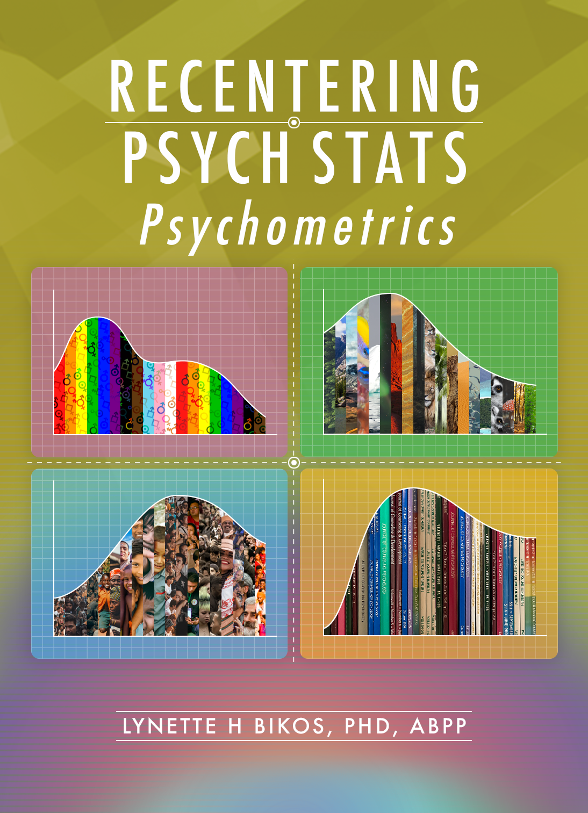

--- 
lang: "en"
title: "ReCentering Psych Stats:  Psychometrics"
author: "Lynette H Bikos, PhD, ABPP"
knit: "bookdown::render_book"
site:  bookdown::bookdown_site
documentclass: book
bibliography: STATSnMETH.bib
citation-style: apa-single-spaced.csl
link-citations: true

#url: 'http\://whateveritis
#github-repo: whatever it is

description: 'This is an open-access, book-in-progress. My goal in offering it is to re-center the materials used in training statistics and research methods in graduate and post-graduate psychology programs.'
#cover-image: "ReCenter_bookcover.jpg"

output:
  bookdown::gitbook:
    dev: svglite
    css: css/style.css
    #includes: 
        #in_header: [google-analytics-otl.html]
    toc_depth: 4
    split-by: section
    split_bib: true
    number_sections: true
    #pandoc_args: [ "--csl", "apa-single-spaced.csl" ]
    config:
      toc:
        scroll_highlight: yes
        collapse: section
        before: |
          <li><a href="./"><strong>ReCentering Psych Stats:  Psychometrics</strong><br>by Lynette H Bikos, PhD, ABPP</a></li>
        after: |
          #<li><a href="https:link" target="_blank">Open access book-in-progress</br>
          <li><a rel="license" href="http://creativecommons.org/licenses/by-nc-sa/4.0/"></a></li>
            <li><a href="https://bookdown.org" target="_blank">Built with Bookdown</a></li>
      download: [pdf]
      view: https://github.com/ontheline/otl-bookdown/blob/master/%s
      search: yes
      sharing:
        facebook: yes
        github: yes
        twitter: yes

  #bookdown::pdf_book:
    #citation_package: default
    #pandoc_args: [ "--csl", "apa-single-spaced.csl" ]

  bookdown::word_document2:
    default

  bookdown::markdown_document2:
    default
---

# BOOK COVER {-}



# Preface {-}

**If you are viewing this document, you should know that this is a book-in-progress.  Early drafts are released for the purpose teaching my classes and gaining formative feedback from a host of stakeholders. The document was last updated on `r format (Sys.Date(), '%d %b %Y')`**.  Emerging volumes on other statistics are posted on the [ReCentering Psych Stats](https://lhbikos.github.io/BikosRVT/ReCenter.html) page at my research team's website. 

[Screencasted Lecture Link](https://spu.hosted.panopto.com/Panopto/Pages/Viewer.aspx?id=c932455e-ef06-444a-bdca-acf7012d759a)

To *center* a variable in regression means to set its value at zero and interpret all other values in relation to this reference point. Regarding race and gender, researchers often center male and White at zero. Further, it is typical that research vignettes in statistics textbooks are similarly seated in a White, Western (frequently U.S.), heteronormative, framework. The purpose of this project is to create a set of open educational resources (OER) appropriate for doctoral and post-doctoral training that contribute to a socially responsive pedagogy -- that is, it contributes to justice, equity, diversity, and inclusion. 

Statistics training in doctoral programs are frequently taught with fee-for-use programs (e.g., SPSS/AMOS, SAS, MPlus) that may not be readily available to the post-doctoral professional. In recent years, there has been an increase and improvement in R packages (e.g., *psych*, *lavaan*) used for in analyses common to psychological research. Correspondingly, many graduate programs are transitioning to statistics training in R (free and open source).  This is a challenge for post-doctoral psychologists who were trained with other software. This OER will offer statistics training with R and be freely available (specifically in a GitHub respository and posted through GitHub Pages) under a Creative Commons Attribution - Non Commercial - Share Alike license [CC BY-NC-SA 4.0]. 

Training models for doctoral programs in HSP are commonly scholar-practitioner, scientist-practitioner, or clinical-scientist.  An emerging model, the *scientist-practitioner-advocacy* training model incorporates social justice advocacy so that graduates are equipped to recognize and address the sociocultural context of oppression and unjust distribution of resources and opportunities [@mallinckrodt_scientist-practitioner-advocate_2014]. In statistics textbooks, the use of research vignettes engages the learner around a tangible scenario for identifying independent variables, dependent variables, covariates, and potential mechanisms of change. Many students recall examples in Field's  [-@field_discovering_2012] popular statistics text:  Viagra to teach one-way ANOVA, beer goggles for two-way ANOVA, and bushtucker for repeated measures.  What if the research vignettes were more socially responsive? 

In this OER, research vignettes will be from recently published articles where: 

* the author’s identity is from a group where scholarship is historically marginalized (e.g., BIPOC, LGBTQ+, LMIC[low-middle income countries]), 
* the research is responsive to issues of justice, equity, inclusion, diversity, 
* the lesson’s statistic is used in the article, and 
* there is sufficient information in the article to simulate the data for the chapter example(s) and practice problem(s); or it is publicly available.  

In training for multicultural competence, the saying, "A fish doesn't know that it's wet" is often used to convey the notion that we are often unaware of our own cultural characteristics. In recent months and years, there has been an increased awakening to the institutional and systemic racism that our systems are perpetuating. Queuing from the water metaphor, I am hopeful that a text that is recentered in the ways I have described can contribute to *changing the water* in higher education and in the profession of psychology.


## Copyright with Open Access {-}
<a rel="license" href="http://creativecommons.org/licenses/by-nc-sa/4.0/"></a>

This book is published under a a <a rel="license" href="http://creativecommons.org/licenses/by-nc-sa/4.0/">Creative Commons Attribution-NonCommercial-ShareAlike 4.0 International License</a>. This means that this book can be reused, remixed, retained, revised and redistributed (including commercially) as long as appropriate credit is given to the authors. If you remix, or modify the original version of this open textbook, you must redistribute all versions of this open textbook under the same license - CC BY-SA.

A [GitHub open-source repository](https://github.com/lhbikos/ReC_Psychometrics) contains all of the text and source code for the book, including data and images. 

# ACKNOWLEDGEMENTS {-}

As a doctoral student at the University of Kansas (1992-2005), I learned that "a foreign language" was required for graduation. *Please note that as one who studies the intersections of global, vocational, and sustainable psychology, I regret that I do not have language skills beyond English.* This could have been met with credit from high school my rural, mid-Missouri high school did not offer such classes. This requirement would have typically been met with courses taken during an undergraduate program -- but my non-teaching degree in the University of Missouri's School of Education was exempt from this. The requirement could have also been met with a computer language (fortran, C++) -- I did not have any of those either. There was a tiny footnote on my doctoral degree plan that indicated that a 2-credit course, "SPSS for Windows" would substitute for the language requirement.  Given that it was taught by my one of my favorite professors, I readily signed up. As it turns out, Samuel B. Green, PhD, was using the course to draft chapters in the textbook [@green_using_2014] that has been so helpful for so many. Unfortunately, Drs. Green (1947 - 2018) and Salkind (2947 - 2017) are no longer with us. I have worn out numerous versions of their text. Another favorite text of mine was Dr. Barbara Byrne's [-@byrne_structural_2016], "Structural Equation Modeling with AMOS." I loved the way she worked through each problem and paired it with a published journal article, so that the user could see how the statistical evaluation fit within the larger project/article. I took my tea-stained text with me to a workshop she taught at APA and was proud of the signature she added to it (a little catfur might have fallen out).  Dr. Byrne created SEM texts for a number of statistical programs (e.g., LISREL, EQS, MPlus). As I was learning R, I wrote Dr. Byrne, asking if she had an edition teaching SEM/CFA with R. She promptly wrote back, saying that she did not have the bandwidth to learn a new statistics package.  We lost Dr. Byrne in December 2020. I am so grateful to these role models for their contributions to my statistical training.  I am also grateful for the doctoral students who have taken my courses and are continuing to provide input for how to improve the materials.

The inspiration for training materials that re*center statistics and research methods came from the [Academics for Black Survival and Wellness Initiative](https://www.academics4blacklives.com/). This project, co-founded by Della V. Mosley, Ph.D., and Pearis L. Bellamy, M.S., made clear the necessity and urgency for change in higher education and the profession of psychology. 

At very practical levels, I am indebted to SPU's Library, and more specifically, SPU's Education, Technology, and Media Department.  Assistant Dean for Instructional Design and Emerging Technologies, R. John Robertson, MSc, MCS, has offered unlimited consultation, support, and connection. Senior Instructional Designer in Graphics & Illustrations, Dominic Wilkinson, designed the logo and bookcover.  Psychology and Scholarly Communications Librarian, Kristin Hoffman, MLIS, has provided consultation on topics ranging from OERS to citations. I am alo indebted to Associate Vice President, Teaching and Learning at Kwantlen Polytechnic University, Rajiv Jhangiani, PhD. Dr. Jhangiani's text [-@jhangiani_research_2019] was the first OER I ever used and I was grateful for his encouraging conversation.

Financial support for this text has been provided from the *Call to Action on Equity, Inclusion, Diversity, Justice, and Social Responsivity
Request for Proposals* grant from the Association of Psychology Postdoctoral and Internship Centers (2021-2022). 


<!--chapter:end:index.Rmd-->

# Introduction {#ReCintro}

[Screencasted Lecture Link](https://spu.hosted.panopto.com/Panopto/Pages/Viewer.aspx?pid=cc9b7c0d-e5c3-4e4e-a469-acf7013ee761)

## What to expect in each chapter

This textbook is intended as *applied,* in that a primary goal is to help the scientist-practitioner-advocate use a variety of statistics in research problems and *writing them up* for a program evaluation, dissertation, or journal article. In support of that goal, I try to provide just enough conceptual information so that the researcher can select the appropriate statistic (i.e., distinguishing between when ANOVA is appropriate and when regression is appropriate) and assign variables to their proper role (e.g., covariate, moderator, mediator).

This conceptual approach does include occasional, step-by-step, *hand-calculations* (only we calculate them arithmetically in R) to provide a *visceral feeling* of what is happening within the statistical algorithm that may be invisible to the researcher.  Additionally, the conceptual review includes a review of the assumptions about the characteristics of the data and research design that are required for the statistic. Statistics can be daunting, so I have worked hard to establish a *workflow* through each analysis. When possible, I include a flowchart that is referenced frequently in each chapter and assists the the researcher keep track of their place in the many steps and choices that accompany even the simplest of analyses.

As with many statistics texts, each chapter includes a *research vignette.* Somewhat unique to this resource is that the vignettes are selected from recently published articles. Each vignette is chosen with the intent to meet as many of the following criteria as possible:

* the statistic that is the focus of the chapter was properly used in the article,
* the author’s identity is from a group where scholarship is historically marginalized (e.g., BIPOC, LGBTQ+, LMIC [low middle income countries]),
* the research has a justice, equity, inclusion, diversity, and social responsivity focus and will contribute positively to a social justice pedagogy, and 
* the data is available in a repository or there is sufficient  information in the article to simulate the data for the chapter example(s) and practice problem(s).  

In each chapter we employ *R* packages that will efficiently calculate the statistic and the dashboard of metrics (e.g., effect sizes, confidence intervals) that are typically reported in psychological science.

## Strategies for Accessing and Using this OER

There are a number of ways you can access this resource. You may wish to try several strategies and then select which works best for you.  I demonstrate these in the screencast that accompanies this chapter.

1. Simply follow along in the .html formatted document that is available on via GitHug Pages, and then
   * open a fresh .rmd file of your own, copying (or retyping) the script  and running it 
2. Locate the original documents at the [GitHub repository](https://github.com/lhbikos/ReC_Psychometrics) . You can
   * open them to simply take note of the "behind the scenes" script
   * copy/download individual documents that are of interest to you
   * fork a copy of the entire project to your own GitHub site and further download it (in its entirety) to your personal workspace. The [GitHub Desktop app](https://desktop.github.com/) makes this easy!
3. Listen to the accompanying lectures (I think sound best when the speed is 1.75). The lectures are being recorded in Panopto and should include the closed captioning.
4. Provide feedback to me!  If you fork a copy to your own GitHub repository, you can 
   * open up an editing tool and mark up the document with your edits,
   * start a discussion by leaving comments/questions, and then
   * sending them back to me by committing and saving.  I get an e-mail notiying me of this action.  I can then review (accepting or rejecting) them and, if a discussion is appropriate, reply back to you.

## If You are New to R

R can be oveRwhelming. Jumping right into advanced statistics might not be the easiest way to start. However, in these chapters, I provide complete code for every step of the process, starting with uploading the data. To help explain what R script is doing, I sometimes write it in the chapter text; sometimes leave hastagged-comments in the chunks; and, particularly in the accompanying screencasted lectures, try to take time to narrate what the R script is doing.  

I've found that, somewhere on the internet, there's almost always a solution to what I'm trying to do. I am frequently stuck and stumped and have spent hours searching the internet for even the tiniest of things.  When you watch my videos, you may notice that in my R studio, there is a "scRiptuRe" file. I takes notes on the solutions and scripts here -- using keywords that are meaningful to me so that when I need to repeat the task, I can hopefully search my own prior solutions and find a fix or a hint.

### Base R

The base program is free and is available here:  https://www.r-project.org/  

Because R is already on my machine (and because the instructions are sufficient), I will not walk through the instllation, but I will point out a few things.

* Follow the instructions for your operating system (Mac, Windows, Linux)
* The "cran" (I think "cranium") is the *Comprehensive R Archive Network.*  In order for R to run on your computer, you have to choose a location.  Because proximity is somewhat related to processing speed, select one that is geographically "close to you." 
* You will see the results of this download on your desktop (or elsewhere if you chose to not have it appear there) but you won't ever use R through this platform.

### R Studio

*R Studio* is the desktop application I work in R.  It's a separate download. Choose the free, desktop, option that is appropriate for your operating system:   https://www.rstudio.com/products/RStudio/

* Upper right window:  Includes several tabs; we frequently monitor the
  + Environment: it lists the *objects* that are available to you (e.g., dataframes)
* Lower right window: has a number of helpful tabs.
  + Files:  Displays the file structure in your computer's environment.  Make it a practice to (a) organize your work in small folders and (b) navigating to that small folder that is holding your project when you are working on it.
  + Packages:  Lists the packages that have been installed.  If you navigate to it, you can see if it is "on."  You can also access information about the package (e.g., available functions, examples of script used with the package) in this menu.  This information opens in the Help window.
  + Viewer and Plots are helpful, later, when we can simultaneously look at our output and still work on our script.
* Primary window
  + R Studio runs in the background(in the console).  Very occasionally, I can find useful troubleshooting information here.
  + More commonly, I open my R Markdown document so that it takes the whole screen and I work directly, right here.
* *R Markdown* is the way that many analysts write *script*, conduct analyses, and even write up results.  These are saved as .rmd files.
  + In R Studio, open an R Markdown document through File/New File/R Markdown
  + Specify the details of your document (title, author, desired ouput)
  + In a separate step, SAVE this document (File/Save] into a NEW FILE FOLDER that will contain anything else you need for your project (e.g., the data).
  + *Packages* are at the heart of working in R.  Installing and activating packages require writing script.

### R Hygiene

Many initial problems in R can be solved with good R hygiene. Here are some suggestions for basic practices.  It can be tempting to "skip this."  However, in the first few weeks of class, these are the solutions I am presenting to my students.

#### Everything is documented in the .rmd file

Although others do it differently, everything is in my .rmd file. That is, for uploading data and opening packages I write the code in my .rmd file.  Why?  Because when I read about what I did hours or years later, I have a permanent record of very critical things like (a) where my data is located, (b) what version I was using, and (c) what package was associated with the functions.

#### File organization

File organization is a critical key to this:

* Create a project file folder.
* Put the data file in it.
* Open an R Markdown file.
* Save it in the same file folder.
* When your data and .rmd files are in the same folder (not your desktop, but a shared folder), they can be connected.

#### Chunks

The R Markdown document is an incredible tool for integrating text, tables, and analyses.  This entire OER is written in R Markdown.  A central feature of this is "chunks."

The easiest way to insert a chunk is to use the INSERT/R command at the top of this editor box.  You can also insert a chunk with the keyboard shortcut:  CTRL/ALT/i

"Chunks" start and end with with those three tic marks and will show up in a shaded box, like this:

```{r title for the chunk contents}
#hashtags let me write comments to remind myself what I did
#here I am simply demonstrating arithmetic (but I would normally be running code)
2021 - 1966
```

Each chunk must open and close.  If one or more of your tic marks get deleted, your chunk won't be read as such and your script will not run.  The only thing in the chunks should be script for running R; you can hashtag-out script so it won't run.

Although unnecessary, you can add a brief title for the chunk in the opening row, after the "r."  These create something of a table of contents of all the chunks -- making it easier to find what you did.  You can access them in the "Chunks" tab at the bottom left of R Studio. If you wish to knit a document, you cannot have identical chunk titles.

You can put almost anything you want in the space outside of tics.  Syntax for simple formatting in the text areas (e.g,. using italics, making headings, bold, etc.) is found here:  https://rmarkdown.rstudio.com/authoring_basics.html


#### Packages

As scientist-practitioners (and not coders), we will rely on *packages* to do our work for us. At first you may feel overwhelmed about the large number of packages that are available. Soon, though, you will become accustomed to the ones most applicable to our work (e.g., psych, tidyverse, lavaan, apaTables).

Researchers treat packages differently. In these lectures, I list all the packages we will use in an opening chunk that asks R to check to see if the package is installed, and if not, installs it.  

```{r checking for packages}
if(!require(psych)){install.packages("psych")}
```

To make a package operable, you need to open it through the library.  This process must be repeated each time you restart R. I don't open the package (through the "library(package_name)") command until it is time to use it.  Especially for new users, I think it's important to connect the functions with the specific packages.

```{r opening psych, package, message=FALSE, warning=FALSE}
#install.packages ("psych")
library (psych)
```

If you type in your own "install.packages" code, hashtag it out once it's been installed.  It is problematic to continue to re-run this code .

#### Knitting

An incredible feature of R Markdown is its capacity to *knit* to HTML, powerpoint, or word. If you access the .rmd files for this OER, you can use annotate or revise them to suit your purposes.  If you redistribute them, though, please honor the Creative Commons Attribution-NonCommercial-ShareAlike 4.0 International License with a citation.

### tRoubleshooting in R maRkdown

Hiccups are normal.  Here are some ideas that I have found useful in getting unstuck.

* In an R script, you must have everything in order -- Every. Single. Time. 
  + All the packages have to be in your library and activated; if you restart R, you need to reload each package.
  + If you open an .rmd file and want a boxplot, you cannot just scroll down to that script.  You need to run any *prerequisite* script (like loading the package, importing data, putting the data in the global environment, etc.)
  + Do you feel lost?  clear your global environment (broom) and start at the top of the R script. Frequent, fresh starts are good.
* Your .rmd file and your data need to be stored in the same file folder.  These should be separate for separate projects, no matter how small.
* Type any warnings you get into a search engine.  Odds are, you'll get some decent hints in a manner of seconds.  Especially at first, these are common errors:
  + The package isn't loaded (if you restarted R, you need to reload your packages)
  + The .rmd file has been saved yet, or isn't saved in the same folder as the data
  + Errors of punctuation or spelling
* Restart R (it's quick -- not like restarting your computer)
* If you receive an error indicating that a function isn't working or recognized, and you have loaded the package, type the name of the package in front of the function with two colons (e.g., psych::describe(df). If multiple packages are loaded with functions that have the same name, R can get confused.

### stRategies for success

* Engage with R, but don't let it overwhelm you.
  + The *mechanical is also the conceptual*. Especially when it is *simpler*, do try to retype the script into your own .rmd file and run it. Track down the errors you are making and fix them.
  + If this stresses you out, move to simply copying the code into the .rmd file and running it.  If you continue to have errors, you may have violated one of the best practices above (Is the package loaded? Are the data and .rmd files in the same place? Is all the prerequisite script run?).
  + Still overwhelmed?  Keep moving forward by downloading a copy of the .rmd file that accompanies any given chapter and just "run it along" with the lecture. Spend your mental power trying to understand what each piece does. Then select a practice problem that is appropriate for your next level of growth. 
* Copy script that works elsewhere and replace it with your datafile, variables, etc.  
* The leaRning curve is steep, but not impossible.  Gladwell[-@gladwell_outliers_2008] reminds us that it takes about 10,000 hours to get GREAT at something (2,000 to get reasonably competent). Practice. Practice. Practice.
* Updates to R, R Studio, and the packages are NECESSARY, but can also be problematic.  It could very well be that updates cause programs/script to fail (e.g., "X has been deprecated for version X.XX").  Moreover, this very well could have happened between my distribution of these resources and your attempt to use it.  My personal practice is to update R, R Studio, and the packages a week or two before each academic term.
* Embrace your downward dog.  Also, walk away, then come back.
  

### Resources for getting staRted

R for Data Science:  https://r4ds.had.co.nz/

R Cookbook:  http://shop.oreilly.com/product/9780596809164.do

R Markdown homepage with tutorials:  https://rmarkdown.rstudio.com/index.html

R has cheatsheets for everything, here's one for R Markdown:  https://www.rstudio.com/wp-content/uploads/2015/02/rmarkdown-cheatsheet.pdf 

R Markdown Reference guide:  https://www.rstudio.com/wp-content/uploads/2015/03/rmarkdown-reference.pdf

Using R Markdown for writing reproducible scientific papers:  https://libscie.github.io/rmarkdown-workshop/handout.html 

LaTeX equation editor:  https://www.codecogs.com/latex/eqneditor.php

<!--chapter:end:01-Introduction.Rmd-->

# Questionnaire Construction: The Fundamentals {#QuestCon}

 [Screencasted Lecture Link](https://spu.hosted.panopto.com/Panopto/Pages/Viewer.aspx?pid=becbbc0a-70b9-4fde-a256-aabb0156d460) 
 
```{r  include=FALSE}
knitr::opts_chunk$set(echo = TRUE)
knitr::opts_chunk$set(comment = NA) #keeps out the hashtags in the knits
options(scipen=999)#eliminates scientific notation
```

The focus of this lecture is about some of the more mechanical and design issues of survey construction. To that end we will look at issues such as the use of negatively worded items, scaling, and where to place sensitive items. We review the available evidence to see how decisions about these items contributes to survey completion and engagement of the research participant.

## Navigating this Lesson

There is 1 hour and 30 minutes of lecture. 

While the majority of R objects and data you will need are created within the R script that sources the chapter, occasionally there are some that cannot be created from within the R framework. Additionally, sometimes links fail.  All original materials are provided at the [Github site](https://github.com/lhbikos/ReC_Psychometrics) that hosts the book. More detailed guidelines for ways to access all these materials are provided in the OER's [introduction](#ReCintro)

### Learning Objectives

Focusing on this week's materials, make sure you can:

* List characteristics questionnaires that facilitate accuracy in responses,
* Identify common problems with item construction and online surveys,
* Outline the overall structure/components of a questionnaire,
* Articulate test construction myths (e.g., location of sensitive items, “requirement” to have reverse scored items) and their evidence-based solutions (when they have them)
* List elements to consider when the questionnaire is administered online

### Planning for Practice

This is a two-part lesson on questionnaire construction. After the second lesson, a detailed suggestion for practice will be provided that lists criteria for creating and piloting a survey of your own.

### Readings & Resources

In preparing this chapter, I drew heavily from the following resource(s). Other resources are cited (when possible, linked) in the text with complete citations in the reference list.

* Chyung, S. Y., Roberts, K., Swanson, I., & Hankinson, A. (2017). Evidence-Based Survey Design: The Use of a Midpoint on the Likert Scale. Performance Improvement, 56(10), 15–23. https://doi.org/10.1002/pfi.21727
* Chyung, S. Y., Barkin, J. R., & Shamsy, J. A. (2018a). Evidence‐Based Survey Design: The Use of Negatively Worded Items in Surveys. Performance Improvement, 57(3), 16–25. https://doi.org/10.1002/pfi.21749
* Chung, S. Y., Kennedy, M., & Campbell, I (2018b). Evidence-based survey design: The use of ascending or descending order of Likert-type response options. Performance Improvement, 57(9), 9-16. https://doi.org/10.1002/pfi.21800 
* Chyung, S. Y., Swanson, I., Roberts, K., & Hankinson, A. (2018c). Evidence‐Based Survey Design: The Use of Continuous Rating Scales in Surveys. Performance Improvement, 57(5), 38–48. https://doi.org/10.1002/pfi.21763
  - Finding the Chyung et al. series was like finding a pot of gold! They provide empirical support for guiding choices about survey construction. And they are current! If you don't have time to read them in detail, I recommend you scan them and archive them for future reference.
*  Schwarz, N., & Oyserman, D. (2001). Asking Questions About Behavior: Cognition, Communication, and Questionnaire Construction. American Journal of Eavluation, 34.
  - While this article is two decades old, I have not been able to locate another that provides as concrete and helpful information about survey construction.


## Old Fashioned Foundations of Questionnaire Construction

There are a lot of stakeholders/players in the world of questionnaire construction.  Of course this includes clinical and industrial/organizational psychology.  However, the resources in this lecture also include education, social work, and business/marketing types.

My hours-long search(es) for a good article on test construction came up empty-handed.  A promising and recent(ish) text, though, is Colton and Covert's [-@colton_designing_2015] *Designing and Constructing Instruments for Social Research and Evaluation.*  At this time, a good bit of it is [available for free](https://books.google.com/books?id=MLD5CQAAQBAJ&printsec=frontcover&source=gbs_ge_summary_r&cad=0#v=onepage&q&f=false) on Google Books:  https://books.google.com/books?id=MLD5CQAAQBAJ&printsec=frontcover&source=gbs_ge_summary_r&cad=0#v=onepage&q&f=false

Beyond that, I did not find a good website or article that provides the foundations.  Thus, this lecture is a composite of what I consider to be best practices for the creation of self-report questionnaires from (a) foregoing literature (mostly practices based on paper-based questionnaires); (b) websites and more recent, isolated, articles; and (c) what I've learned to be true over time.

The majority of this lecture covers the mechanics and technical aspects of questionnaire constructions/assembly. While seeming a bit dated, Schwarz and Oyserman's [-@schwarz_asking_2001] article set the stage for establishing *why* these mechanical/technical considerations are critical.

They open their article with a hypothetical (and likely typical) survey question:  "Have you ever drunk beer, wine, wine coolers, whiskey, gin, or other liquor?" and  "How many times have you had beer, wine, or other liquor in the past month?"

Schwarz and Oyserman identified nine assumptions that researchers' make about the survey respondent's ability to self-report attitudes, cognitions, affective states, and behaviors.  Within each, they identify the elements that threaten those assumptions.

1. Understand the question -- much about contexts
    + Open vs. closed ended questions:  Closed clarify the context, by narrowing it... but, is it too far?
    + Question context:  Do survey titles or preceding questions frame/bias/lead the question?
    + Researcher affiliation:  In an open-ended question, when the questionnaire was printed on "Institute for Personality Research" letterhead,  responses focused on personality variables.  When printed on "Institute for Social Research" letterhead, responses focused on social determinants of the behavior.
    + Frequency scales and reference periods:  "How many times have you felt *really* irritated?"  Then describe one instance.  Those with high frequencies tend to describe lesser irritation; and vice versa.
    + Reference periods can be similarly problematic with "last year" references drawing "major irritations" and "last week" drawing "minor ones."
    
2. Recalling relevant behavior
    + Autobiographical memory:  3% of participants failed to report an episode of hospitalization when interviewed 10 weeks later; 42% failed to report when interviewed 1 year later.
    + Reference periods and recall cues:  Short reference periods (1 week) may result in "0" but more accurate responses.
    + Decomposition strategies (e.g., asking separately about "drinking wine," "drinking beer," "drinking liquor") can serve as recall cues and facilitate memory (assuming respondents can interpret "drinking liquor"). Decomposition strategies appear to increase the reported frequencies of behaviors, but not their accuracy (low frequency behaviors are reported more frequently than they occur and vice versa).
    + Time matters:  Accuracy improves when people have sufficient time to answer the question.  Respondents may not have the motivation to take the time/search memory.
    + Motivation may be improved when told: "the next question is very important."  This strategy is econmical to employ but is most likely to have a positive effect when used sparingly.
    + Temporal direction of search:  Better recall is achieved when respondents begin with most recent occurence of behavior and work backward.
    
3. Inference and estimation
    + Estimations often end up in "sensible numbers" either rounded, or in the case of estimates of days, in multiples of 7 (weeks) or 30 (months). This may be an indication of the respondent's own awareness of the "rough estimation" they are providing.
    + Respondents are likely to estimate past behavior based on how they are feeling/behaving at the time of the questionnaire.
    + "Proxy reports" (reporting on the behavior of others) are highly dependent upon the respondent's theory about "what kind of person" the actor is.
    + Range of responses in frequency scales serve as a frame of reference for the respondent.  When presented with a high frequency scale, respondents will tend to report more behaviors. The same is true for evaluations.  If a high frequency scale is used for both health symptoms and satisfaction with health care, the same patients will report more health symptoms and greater satisfaction.
    
4. Mapping the answer to the response format
    + "Vague quantifiers" are scales that include, "sometimes," "frequently" and so on.  When actual frequencies exist, they are preferable to these quantifiers.
    + Item order matters.  An item is more likely to be endorsed when it is earlier on the list.
    
5. "Editing" the answer
    + Socially desirable responding occurs when respondents deliberately provide inaccurate answers to threatening questions. This occurs more in face-to-face interviews than in self-administered questionnaires (more confidentiality/anonimity). Normalizing less desirable responses ("As you know, many people have been killing their spouses these days") before asking the question ("Have you happened to have killed yours?") are one strategy.  More effective, though is the assurance of privacy/confidentiality.

Schwarz and Oyserman's [-@schwarz_asking_2001] review reminds us that each of these design optionscomes with specific tradeoffs. Several times in the paper the authors reference "safeguarding against surprises."  It is critical to think through the specifics in each particular case, to take the assessment yourself, and to pilot it with representatives of the intended sample.

Reminds me of my own master's experience with the M.A.S.T. in a sample of United Methodist clergy...

These broader issues is cognition and communication inform the more technical features of survey construction.


### Components of the Questionnaire

In general, questionnaires, irrespective of their purpose have the following components, that adhere to the criteria below [@colton_designing_2015; @pershing_ineffective_2001]:

**Title**

* reflect the content of the instrument
* be concisely worded
* be written in language easily understood by the respondents
* should not be offensive or off-putting
* should be formatted clearly at the top/beginning of the document

**Introductory Statement**

* include a brief summary of the instrument's purpose
* contain an appropriate statement concerning the confidentiality of the respondent's information (informed consent)
* be motivating such that respondents are inspired/willing to complete the items
* specify the approximate amount of time required to complete the instrument

**Directions**

* complete, unambiguous, concise
* written at a language level appropriate to the respondents
* tell the respondents how to return the instrument once they have completed it (surprisingly, in Qualtrics, this is also important; submission requires hitting that last little "-->>")

**Items** (discussed in a later section)

**Closing Statement**

* thank the participants for their participation
* remind participants that their information is valuable and perhaps remind about 
  + next steps or follow-up
  + confidentiality

**Overall Structure/Look**

* should be coherent with an easy-to-follow layout
* not crowded
* professional appearance
  + not crowded, plenty of white space
  + avoiding a "slick look"
  + numbering and headings to provide a sense of progress
  + breaks between every 4-6 questions (or shading alternate items)
  + in a sense, inviting and "easy on the eye"


Pershing and Pershing [-@pershing_ineffective_2001] reviewed 50 "reactionnaires" (p. 73; surveys used by training evaluators that assess an individuals *reactions* [as opposed to learning, behavior, or results]) at a "prestigious medical school."  

Results suggested:

* 72% did not include an introductory statement; an additional 16% were "minimal"
* 78% had no closing statement
* 30% had no directions; another 54% of directions were "minimal"
* 8% were professional in appearance

### Item Selection, Ordering, and Writing (if necessary)

As scientist-practitioners, we do what we can to select measures that have established psychometric credibility (reliability, validity). That said, it is common for our studies to have a blend of pre-existing and authors-constructed measures because some of our variables may not have established measures.  Further, we may seek to create and psychometrically evaluate a measure -- which would call for scale construction.

#### Considerations in the Questionnaire Structure

**Funnel-sequence**:  a strategy that begins with broad questions and then narrows to the topic of interest.

**Clustering**:  the notion if that if you cluster similar questions to minimize the respondent's need to change a "mental set."  Online, clustering might be enhanced through using **matrices** or **blocks**.

**Context/ordering**:  What might effect might the first 3 questions have on the fourth:

* "How do you feel about solar power"?
* "How much gas mileage does your current automobile get?"
* "How much do you spend per week in gasoline?"
* "What is the most important consideration for purchasing a new vehicle?"
  + make and model
  + fuel economy
  + color
  + price
  
**Placement of Sensitive questions**:  Historically, these are recommended to come last.  The notion is that if they are presented first, people will be less likely to continue [@krathwohl_methods_2009; @rowley_designing_2014].  But:

* Roberson and Sundstrom [-@roberson_questionnaire_1990] suggested that this effect has not held up in employee groups.
* In a survey of social workers (NASW members), the placement of the sensitive items made no difference in response completion [@robert_g._green_should_2000].

**Length and Time**:  Paper and pencil measures were recommended to be between two and four pages [@krathwohl_methods_2009].  Rowley [-@rowley_designing_2014]recommended that in the UK a pilot, small-scale study could take 2 sides of A4 paper; 4 sides for a major study. Rowley advised the *equivalent* for an online study, but did not specify what that meant.

Chyung, Barkin, and Ramsey [-@chyung_evidencebased_2018] noted that resondent performance declines approximately 12 minutes after respondents start a survey.  

Online, participants' time can be respected by using **branching techniques**, **skip logic**, and **display logic**.  Participants can also have a sense of how long the survey is when the **progress bar** is enabled.

### Item-Level and Content Considerations

* In as much as possible, items should be short, grammatically simple, specific, and concrete.
* Avoid colloquial terms, jargon, and slang.
* Avoid *double-barreled* questions, that is, items that pose two issues at once and obscuring which is being responded to:
  + "Do you favor candidate X and higher taxes or candidate Y and lower taxes?" 
* Avoid 1.5 barreled questions, where the second issue is introduced in the alternative.  For example, "The campus is considering a mandatory chapel requirement for its faculty.  Which of the following statements is closest to your opinion on this proposal?"
  + I strongly support the mandatory chapel requirement.
  + I support a modified proposal -- that faculty should attend 2 chapels each quarter.
  + I would like to see options for demonstrating faith commitment other than mandatory chapel.
  + I strongly oppose the mandatory chapel requirement.
* Avoid leading questions. Consider how the *framing* of this question might influence the response.
  + "The likelihood of being injured in an automobile is 1 in 100,000.  Considering this data, do you support mandatory seatbelt legislation?"  54% supported mandatory seatbelt legislation.
  + "The likelihood of you being injured in a lifetime of driving is one and three. Considering this data, do you support mandatory seatbelt legislation?"  78% supported mandatory seatbelt legislation.
  + Response sets, like "Yea" an "Nay" saying predispose individuals to respond in certain ways.  Thus, many recommended reversing some of the items on Likert-type scales.  HOWEVER, exploratory factor analysis of this data sometimes detects a "negative" factor, likely based on the *methods* issue of the reversal. If reverse items are used, format (underline, italicize, or bold) the negative qualifier.
  
#### Strategies for Sensitive Items

**Protect the respondent’s ego**: If you are inquiring about children’s reading habits among at-risk families, you wouldn’t first ask, “What books does your child read?”

* Rather, you would first start with something more gentle.  
  + You might ask, “Are you able to keep track of your child’s reading?” 
  + And then, “If so, what books does your child read?”

**Assuage guilt**: If you are asking someone to provide negative information, “What do you dislike about your direct supervisor?” You might first ask them, “What do you like about your supervisor?” 

**Consider impersonal leads**: Consider asking, “Do persons like yourself generally believe….”  Then ask, “Are you like them?”  or “How similar are you to these people?”

**“Other, please specify:”** When you give a list of options, always include an “other option.” 


#### What Improves (or Threatens) Response Rates and Bias?

It's not always clear, but more increasingly well-designed studies and formal reviews of literature are making the issue more clear. When we design survey instruments based on our own preference rather than research-based evidence, we
may get less than optimal data [@chyung_evidence-based_2018].

Chyung et al. (2018) remind us of the five steps [@schwarz_asking_2001] that survey respondents execute when answering structured, closed-ended survey items. 

1. Interpreting the question
2. Retrieving information from their memory
3. Integrating the information
4. Selecting one of the given response options
5. Editing the answer for reasons of social desirability

**All the things.** In an experimental design [@helgeson_determinants_2002], a handful of variables were manipulated on a mail-in survey. Elements of **attractiveness** (paper color, commemorative stamp, personalization) did contribute, and in the hypothesized direction (e.g., the more attractive, the more likely that surveys were attempted/completed).  **Perceived length** contributed in the positive direction (e.g., if it was perceived to be a reasonable length, it was more likely to be completed).  The biggest contribution:  **possibility of an incentive**.  Other variables included in the study did not contribute to completion:  **Attitudes toward research**, **perceived time**, and **privacy**.

Other studies have been evaluating survey components but until recently they have not been systematically reviewed.  Chyung and colleagues appear to be starting such a systematic review -- looking at the forgoing research on some of the most pervasive questions about questionnaire construction.

**Should Likert-type scales include a midpoint?**  Chyung et al. [-@chyung_evidence-based_2017] reviewed the literature on whether/not to use a **midpoint**.  Looking at the article, we can see variants of Likert-style scaling for a scale of agreement.  Chyung and colleagues quickly suggest that the question is not "Should I use a midpoint?" but rather "When should I use a midpoint?"

The article is more detailed, but essentially, a midpoint is appropriate when:

* you can support that the scale is interval (instead of ordinal; this is a good statistical property to have)
* the question content is such that the midpoint is a *true* midpoint and not a dumping ground
* if a true midpoint is impossible, then add other options such as "I don't know" or "It depends" (but these introduce odd scoring dilemas)

**Should *continuous rating scales* be used in surveys?**  First, the distinction between *discrete*, *continuous*, and *numerical* scales. Figure 4 in the Chyung, Swanson, Roberts, and Hankinson [-@chyung_evidencebased_2018-1] article illustrate the major differences and some variations.

* **Discrete** scales are Likert-type scales that range range between 2 and 11 *discrete* options. Clasically, respondents pick *words* (e.g., pain rated as no pain, mild, moderate, severe, extreme, worst pain possible).
  + 6-point discrete rating scales result in a collection of six *ordered values* 
  + thus they are on the ordinal measurement scale and (as discussed above)
  + they should be analyzed with non-parametric statistical procedures (parametric approaches can be used if the data are normally distributed and there is a mid-point)
* **Continuous** scales allow respondents to indicate a response anywhere within a given range -- usually by marking a place on a horizontal line on a continuum of a minimum of 100 points.  There are no discrete categories defined by words or numbers.  In Qualtrics -- this is the slider option.
  + Continuous scales result in precise numbers (e.g., 26 or 26.8 if the scale is 0 to 100) 
  + these are on an interval-level measurement scale AND 
  + they can be evaluated with parametric statistical analyses
  + *visual analog scales (VAS; aka graphic rating scales, GRS)* are another variant of continuous rating scales if they allow the participants to make "anywhere on the line."  Some VAS scales have verbal descriptors to guide the marking; some have numbers (hence, *numerical response scales*)
  
Which is better?  The mixed results are summarized in Table 1.  Here's my take (based on what our research typically needs):

* continuous scales provide better data (more precise/full information, more likely to be normally distributed, better reliability) for statistical analysis
  + caveat, if the response scale on a Likert scale is increased to 11, there is a better chance to have normally distributed responses
  + caveat, when "simple descriptives" are desired (e.g., histograms, frequency distributions...such as in the most basic program evaluation circumstance), the discrete scale may be the best choice
  
* both are easy to use, except in the case where resondents complete the surveys on mobile devices (a more common scenario...but technology may improve)
  + caveat, there has been more missing data with sliders (compared to radio buttons)
  + caveat, respondents are more likely to change their responses on sliders (good?  improves accuracy), but there are also higher rates of non-completion and missing data
  
* in both circumstances adding "don't know," "prefer not to respond," or "not applicable" may improve the validity of the responses

**Should Likert-type response options use an ascending or descending order?**  This question was addressed in the Chyung et al. series [@chyung_evidence-based_2018]  

The ascending order of Likert response options is *Strongly disagree, Disagree, Neutral, Agree*, and *Strongly agree*, whereas the descending order is *Strongly agree, Agree, Neutral, Disagree*, and *Strongly disagree*.

In the consideration of the choice between ascending/descending, we are concerned with *response-order effects**.  Let's first examine these conceptually/theoretically.

**Recency effect**: the tendency of survey respondents to select the options that they see at the end of the response-option list.

* expected when options are presented orally (e.g., during interviews, people tend to choose from the last-offered options) 

**Primacy effect**: the survey respondents’ tendency to select the options that are presented at the beginning of the
response-option list. 

* expected when options are presented visually—for example, people tend to choose among the first-presented categories in self-administered written survey questionnaires
* *left-sided selection bias* occurs when respondents read text from left-to-right and are more inclined to select options from the left.
* *satisficing theory* occurs when individuals seek solutions that are "simply satisfactory" so as to minimize psychological costs.  thus, respondents may select the first option that seems "reasonable enough", select the "I don't know" response, or randomly select one of the options.
* *acquiesence bias* is the tendency for respondents to agree with the statement provided—aka yea-saying bias (e.g., being polite). 
  + Closely related is *social-desirability bias,* the tendency for respondents to select among the options they think are more socially acceptable or desirable (instead of true responses).
  + In surveys, this generally is selecting *agree* or *strongly agree*.

Considering these response biases together, Chyung et al. suggest that when the response options are presented in descending order (*Strongly agree, Agree, Neutral, Disagree, Strongly disagree*), respondents would see THEORETICALLY see a positive option immediately on the left side of the response scale and perceive it to be socially desirable and satisfactory, resulting in their decision to select it without having to spend more time to choose a true response. However, the same effects may or may not happen when the response options are presented in ascending order (*Strongly disagree, Disagree, Neutral, Agree, Strongly agree*).

After reviewing 13 studies, Chyung et al. suggested  

* many studies (paper and web based, with children and adults, in English and other language) revealed response-order effects in self administered surveys, especially the primacy effect, associated with left-side selection bias, acquiescence bias, and satisficing. 
* many studies showed more positive average scores from descending-ordered scales

Recommendations:

* present response scales in ascending order
  + when a number line is used, lower and negative numbers should be on the left
* when using descended order scales
  + keep respondents motivated to complete items acurately
  + present half items with descended-ordered scales and the other half with ascended-ordered scales
  + assign half of participants with descended-ordered scales; half with ascended-ordered scales
  + present response options vertically rather than horizontally


**Should surveys include negatively worded items?** Again, we look to the Chyung et al. team [@chyung_evidencebased_2018].

In examining this question, the authors make a distinction between (see Table 1 in the article):

* **Statement format** the same response scale such as a Likert scale
* **Question format** different response scales that are tailored to individual survey questions. A challenge with this format is the difficulty in calculating an average score of data obtained from multiple survey items.

The advent of negatively-worded items began with Rensis Likert in 1932.  He was an American social psychologist who, in attempt to mitigate aqcuiescence/yea-saying biases, recommended designing one half of survey items to be associated with agreement and the other half with disagreement. Although Likert recommended "straightforward statements," incorporating negative words can become quickly complicated. Table 2 in the Chyung paper shows that there are four ways of wording survey statements:

**Reverse-coding,** necessary when including negatively worded items in a scale, assumes that agreeing to a positively worded statement and disagreeing to its negatively worded counterpart are the same.  Tables 3 and 4 in the ms show how this assumption may be faulty.

A review of the negatively-worded-item literature suggested the following:

* scales with all positively worded items yielded greater accuracy when compared with all negatively worded items or mixed worded items
* scores on positively and negatively worded items are not the same (e.g., strongly disagreeing to a positively worded statement is differenf from strongly agreeing to a negatively worded statement)
* positively worded items produce higher means than negatively worded items
  + carelessness and fatigue in reading items
  + the cognitive processing of postive and negative items may be different
* a *method factor* has shown itself where in factor anlayses of scales with factor structures unrelated to the wording, exploratory approaches to factor analysis have produced separate factors with the negatively worded (or otherwise ambiguous) items, this results in a threat to construct validity and reliability.

Recall the onset of respondent fatigue approximately 12 minutes after the survey begins?  One of the effects was their failure to notice negatively worded statements even when there were efforts to draw their attention to them via bolding,
underlining, or capitalizing the negated element (e.g., *not*).  Thus, when negatively worded items are used, they should probably be presented early in the protocol.

SO!  Contrary to the traditional wisdom, it is better not to use a mix of positively and negatively worded items because doing so can create threats to validity and reliability of the survey instrument. 

* That said, Chyung et al [-@chyung_evidencebased_2018] also caution about response set bias that can occur when using all positively worded items. They recommend making design choices that enhance bias-free and accurate responding based on the research design.
  + For example, attributes to be measured in some constructs (e.g., depression, anxiety) are, themselves, negative and so a negatively worded item may be most clear and appropriate.
  + The inclusion of negatively phrased items may help *detect* acquiesence bias.
* Table 5 in the manuscript provides some guidelines that are more nuanced when negative items must be included. For example, 
  + ensure that they are true polar opposites and symmetrical (so they can be analyzed with the positively worded items)
  + group negative items together (and forewarn/format so they are emphasized)
  + administer the survey when respondents are not fatigued
  + analyze the effect of the negatively worded items

#### Construct-specific Guidance
Self-efficacy is domain-specific construct.  That is, even though there are some *general self-efficacy scales* Bandura's original definition suggests that it should be task specific (i.e., career decision-making self-efficacy, math self-efficacy).

This construct is an example where Bandura, himself [-@bandura_guide_2006], provided specific guidelines for creating these task-specific assessments.  Generally they included:

1. phrasing items as “can do” rather than “will do,” 
2. maintaining consistency with the self-efficacy construct definition (e.g., domain specific, a focus on capability rather than self-worth), 
3. including items that reflect gradations of challenge, 
4. asking individuals to rate their current (as opposed to future) operative capabilities
5. scaling should be on a 100 point scale


### Adjustments and Enhancements in the Online Environment

A survey of human subjects review boards has suggested that 94% of the IRB applications reviewed involved online or Web-based surveys [@buchanan_online_2009]. Thus, it is important to give some specifical conceptual consideration to the online environment.  

A first set of considerations involve data security, identity, and permission (implicit and explicit).

The **IP address** has been a contentious issue for a number of years [@buchanan_online_2009].  EU data protection laws consider IP addresses as personally identifiable data; in the U.S., IP addresses typically fall outside the definition of "personal information."  In Qualtrics, the default is to collect and download the IP address.  On the one hand it is helpful to know geographically "from where" participants are responding; on the other, it may be a violation of privacy.

Relatedly, what is considered to be **fully informed consent** [@conrad_survey_2007].  Is it ethical to capture paradata (e.g., typing speed, changed answers, response times) or metadata without explicitly saying so?

**The tool** being used to collect the data is concerning.  Buchanan and Hvizdak [-@buchanan_online_2009] argue that until each tool is vetted and its privacy policies and data security policies are understood, we cannot be 100% certain how security, consent, and privacy are instantiated within the individual tools. For example, it is possible that tool creators *could* gather respondent data and repurpose it for their own marketing, for sale to other researchers, etc.

Online and web-based protocols increase our reach geographically and cross-culturally. For now, I will bracket out the issue of cultural translation, for the purpose of online the question is about **access** [@conrad_survey_2007].  Think about the decades of psychological research based on white, college-educated, males.  Are we creating another strata of privileged research with technolgoy that may not be accessible in terms of both internet/technology as well as capacity/fluency with the tool? On the other hand, what are the risks of not adopting new technologies before everyone has them.

When paper/pencil measures were administered in face-to-face settings (individually or in auditoriums of students) there was some degree of **standardized protocol.**  This is lost when surveys are administered online and we cannot guarntee *who* is taking the survey.  To what degree does this matter?

When respondents are remote, what happens if they have a **negative reaction to the survey**?  In a face-to-face context, debriefings can occur and referrals can be made.  How is this managed remotely?

**Security of test items** might also be concerning.  Not ok to use propietary items without the permission of the testmaker.  If the security of items is important (e.g., SAT/GRE, intelligence test items, inkblots) because they are central to administration, how can this be protected in the virtual environment?

Consequently, when students in our programs write doctoral dissertations they are to indicate how they responded to the following concerns in their Method section.

* Describe how informed consent will be obtained in the online environment.
* Describe the level of identification that is collected. If the claim of “anonymous” or “de-identified” indicate whether/not this includes capturing the IP address; some researchers believe that capturing a computer’s IP address threatens anonymity.
* Describe the steps to be taken to ensure that respondents met the inclusion/exclusion criteria of the study.
* Anticipate and describe how the online (e.g., uncontrolled, public, distractions) setting might affect responses. 
* Particularly if the survey contained sensitive materials, describe how respondents might access resources for debriefing or referral.
* Identify the permissions (from original authors or copyright holders) granted to reformat and post (on the internet) existing surveys. If items are considered to be secure (e.g., those on the MMPI or WAIS), identify steps taken to protect them. 


## Practice Problems
   
In each of these lessons I provide suggestions for practice that allow you to select one or more problems that are graded in difficulty. With each of these options I encourage you to:

This is a two-part lesson on questionnaire construction. After the second lesson, a detailed suggestion for practice will be provided that lists criteria for creating and piloting a survey of your own.


```{r include=FALSE}
sessionInfo()
```


<!--chapter:end:02-QuestCon.Rmd-->

# Be a QualTRIXter {#qualTRIX}

[Screencasted Lecture Link](link) 
 
```{r  include=FALSE}
knitr::opts_chunk$set(echo = TRUE)
knitr::opts_chunk$set(comment = NA) #keeps out the hashtags in the knits
options(scipen=999)#eliminates scientific notation
```

The focus of this lecture is 

## Navigating this Lesson

About 1 hour and 10 minutes.  Plan for another 30 minutes for *intRavenous qualtRics* practice.

While the majority of R objects and data you will need are created within the R script that sources the chapter, occasionally there are some that cannot be created from within the R framework. Additionally, sometimes links fail.  All original materials are provided at the [Github site](https://github.com/lhbikos/ReC_Psychometrics) that hosts the book. More detailed guidelines for ways to access all these materials are provided in the OER's [introduction](#ReCintro)

### Learning Objectives

Focusing on this week's materials, make sure you can:

* Utilize basic Qualtrics tools (e.g,. question type, use of headers) so that surveys are present materials clearly to the respondent. 
* Incorporate more advanced tools (e.g., display logic, randomization) that may increase the respondent's ability to complete the survey and provide accurate responses.
* Provide a rationale for survey options that protect (or possibly reveal) an individual's identity.

### Planning for Practice

This is the second of a two-part lesson on questionnaire construction. At the end of this lesson is a detailed suggestion for practice that lists criteria for creating and piloting a survey of your own. There are four essential criteria for your survey:

* Adhere to the evidence-based practices identified in the lesson on [questionnaire construction](#QuestCon).
* Utilize four techniques (in the context of Qualtrics, I term these *qualTRIXter skills*) that increase the flow, effectiveness, and appearance of your survey.
* Pilot and consider feedback provided by those who took the survey.
* Import the data into the R environment.

### Readings & Resources

In preparing this chapter, I drew heavily from the tutorials available at the [Qualtrics support site](https://www.qualtrics.com/support/). I have tried to link them throughout the presentation. It is likely they could change at any time and/or they might not work on your particular browser (as I write this, half of them will not work on FireFox, but they do on Chrome and Edge).

### Packages

The packages used in this lesson are embedded in this code. When the hashtags are removed, the script below will (a) check to see if the following packages are installed on your computer and, if not (b) install them.
```{r }
#will install the package if not already installed
#if(!require(qualtRics)){install.packages("qualtRics")}
```

## Research Vignette

I will demonstrate using a Qualtrics account at my institution, Seattle Pacific University. The only surveys in this account are for the *Recentering Psych Stats* chapters and lessons. All surveys are designed to not capture personally identifying information. I use this survey in several lessons in this OER. If you haven't taken the survey yet, [I invite you to do so](https://spupsych.az1.qualtrics.com/jfe/form/SV_b2cClqAlLGQ6nLU). 

As a teaching activity for the ReCentering Psych Stats OER, the topic of the survey was selected to be consistent with the overall theme of OER. Specifically, the purpose of this study is to understand the campus climate for students whose identities make them vulnerable to bias and discrimination. These include  students who are Black, non-Black students of color, LGBTQ+ students, international students, and students with disabilities. 

Although the dataset should provide the opportunity to test a number of statistical models, one working hypothesis that framed the study is that the there will be a greater sense of belonging and less bias and discrimination when there is similar representation (of identities that are often marginalized) in the instructional faculty and student body. Termed,  "structural diversity" [@lewis_black_2019] this is likely an oversimplification.  In fact, an increase in diverse representation without attention to interacting factors can increase hostility on campus [@hurtado_linking_2007]. Thus, we included the task of rating of a single course relates to the larger campus along the dimensions of belonging and bias/discrimination. For example, if a single class has higher ratings on issues of inclusivity, diversity, and respect, we would expect that sentiment to be echoed in the broader institution.

Our design has notable limitations  You will likely notice that we ask about demographic characteristics of the instructional staff and classmates in the course rated, but we do not ask about the demographic characteristics of the respondent. In making this decision, we likely lose important information; Iacovino and James [-@iacovino_retaining_2016] have noted that White students perceive campus more favorably than Black student counterparts. We made this decision to protect the identity of the respondent. As you will see when we download the data, if a faculty member asked an entire class to take the survey, the datestamp and a handful of demographic identifiers could very likely identify a student. In certain circumstances, this might be risky in that private information (i.e., gender nonconformity, disclosure of a disability) or course evaluation data could be related back to the student.  

Further, the items that ask respondents to *guess* the identities of the instructional staff and classmates are limited, and contrary to best practices in survey construction that recommend providing the option of a "write-in" a response.  After consulting with a diverse group of stakeholders and subject matter experts (and revising the response options numerous times) I have attempted to center anti-Black racism in the U.S. [@mosley_critical_2021; @mosley_radical_2020; @singh_building_2020].  In fact, the display logic does not present the race items when the course is offered outside the U.S. There are only five options for race: *biracial/multiracial*, *Black*, *non-Black person(s) of color*, *White*, and *I did not notice* (intended to capture a color-blind response). One unintended negative consequence of this design is that the response options could contribute to *colorism* [@adames_fallacy_2021; @capielo_rosario_acculturation_2019]. Another possibility is that the limited options may erase, or make invisible, other identities. At the time that I am writing the first draft of this chapter, the murder of six Asian American women in Atlanta has just occurred. The Center for the Study of Hate and Extremeism has documented that while overall hate drimes dropped by 7% in 2020, anti-Asian hate crimes reported to the police in America's largest cities increasedby 149% [@noauthor_fact_nodate]. These incidents have occurred not only in cities, but in our neighborhoods and on our campusus [@kim_guest_2021; @kim_yes_2021; @noauthor_stop_nodate]. While this survey is intended to assess campus climate as a function of race, it unfortunately does not distinguish between many identities that experience marginalization. 

In parallel, the items asking respondents to identity characteristics of the instructional staff along dimensions of gender, international status, and disability are "large buckets" and do not include "write-in" options. Similarly, there was no intent to cause harm by erasing or making invisible individuals whose identities are better defined by different descriptors.  Further, no write-in items were allowed.  This was also intentional to prevent potential harm caused by people who could leave inappropriate or harmful comments. 

As I review Qualtrics essentials and trix, I will their use (if used) in the ReCentering Psych Stats survey.

## Qualtrics Essentials

Qualtrics is a powerful program and I find that many of the surveys we distribute don’t capitalize on the features Qualtrics has to offer.  Qualtrics has detailed tutorials and instructions that are well worth the investment of a weekend to review them. 

In this lecture I will point you to the elements that I think are critical to constructing online surveys. Because Qualtrics tutorials are (a) clear and thorough and (b) frequently updated, I will (a)  point you to the tutorials that are available at the time of this lecture prep, (b) tell you why I think they are appropriate, and (c) show you how we have used them in some of our own surveys.  

Even if you think you know what you are doing, start here (and then always take the time to "look around" at all the options on each window):  

**Survey Basic Overview**: The link below will give you an overview.  From there, you can follow all kinds of leads, looking for things you want to do with your survey – and getting ideas for what will improve it. 
https://www.qualtrics.com/support/survey-platform/survey-module/survey-module-overview/ 

[**Blocks**](https://www.qualtrics.com/support/survey-platform/survey-module/block-options/block-options-overview/) are the basic organizational tool in Qualtrics surveys.  Blocks have two purposes: (a) grouping items shown on "one page," and (b) using the block for easy ordering and/or random selection/presentation.  

[**Question types**](https://www.qualtrics.com/support/survey-platform/survey-module/editing-questions/question-types-guide/question-types-overview/):  Take a time to look at ALL the options.  You might be surprised to learn that there is a better choice than you might have imagined.  

Let's take a look at super basic/helpful question types:

* [**Text/graphic**](https://www.qualtrics.com/support/survey-platform/survey-module/editing-questions/question-types-guide/static-content/descriptive-text-and-graphic/): These are the types you should use for providing information (e.g., informed consent) to the participants.  
* [**Matrix table**](https://www.qualtrics.com/support/survey-platform/survey-module/editing-questions/question-types-guide/standard-content/matrix-table/) :  A more efficient way to use the Likert-style items (than multiple choice).  There is some controversy about whether not to use matrix tables vs. multiple choice dropdowns...    
  + Make sure to select a reasonable amount of header repetition.  This allows the respondent the maximum opportunity to see the column descriptors while they are responding.
* [**Slider**](https://www.qualtrics.com/support/survey-platform/survey-module/editing-questions/question-types-guide/standard-content/slider/) : This gets you continuous data on that 1 to 100 scale.  If the scale you are using is already published, and has not been psychometrically evaluated for slider use, you should probably stick with the format recommended in the publication.  But if YOU are designing a survey, think about this option. 
* [**Text Entry Questions**](https://www.qualtrics.com/support/survey-platform/survey-module/editing-questions/question-types-guide/standard-content/text-entry/)  have multiple options for length of answer.  Don't miss the options that include forms and content validation   
* [**Validation**](https://www.qualtrics.com/support/survey-platform/survey-module/editing-questions/validation/): Allows the user to allow certain types of information and specify their formats (e.g., numbers, e-mail addresses, dates). There is a balancing between being overly restricting and ensuring that the data is entered in the most clear and consistent way possible. A validation option I frequently use is one that asks individuals if they intended to leave something blank. This is tool that helps prevent missingness without forcing an individual to respond to an item that (a) might not be clear to them, (b) might not be appropriate or them, and/or (c) might result in an answer that is untrue for their unique circumstance.

## Qual-TRIX

[**Collaborating**](https://www.qualtrics.com/support/survey-platform/my-projects/sharing-a-project/) with other Qualtrics users in your institution is easy!
Scroll down to “Collaborating Inside Your Organization” and follow the instructions for adding individuals to your survey (you must “own” the survey…your collaborators will not be able to add others).
 
The ability to **schedule survey distributions** is like having your very own GA! If you have a roster(contact list) you can schedule distributions, reminders, and thank yous. Qualtrics will keep track of who responds and send reminders to the non-responders.  Here are resources for

* [E-mail overview](https://www.qualtrics.com/support/survey-platform/distributions-module/email-distribution/emails/emails-overview/)  
* [E-mail distribution management](https://www.qualtrics.com/support/survey-platform/distributions-module/email-distribution/emails/email-distribution-management/)  
* [Contact lists](https://www.qualtrics.com/support/survey-platform/contacts/creating-a-contact-list/)  
 
**Personalizing** invitations and surveys.  [Piped text](https://www.qualtrics.com/support/survey-platform/survey-module/editing-questions/piped-text/piped-text-overview/) is a way to personalize invitations and/or “carry forward” prior responses into new questions.

[**Randomization** of blocks](https://www.qualtrics.com/support/survey-platform/survey-module/survey-flow/standard-elements/randomizer/) (or a subset of blocks) can be use for several purposes such as: (a) using random selection to display one or more blocks to respondents -- as in a random clinical trial, (b) to randomly display a percentage of blocks or items to shorten the survey in a planned missing design, and (c) randomly display some or all of the blocks of the survey to all respondents so that when respondents experience test fatigue, when they quit responding, "the last items/surveys" aren't always the same ones -- thus distributing the missingness across surveys.   

[**Randomization** of items](https://www.qualtrics.com/support/survey-platform/survey-module/block-options/question-randomization/) within a block can be used for similar purposes.  You can also use this to display only some of the items (e.g., planned missingness). 

[**File upload** from respondents](https://www.qualtrics.com/support/survey-platform/survey-module/editing-questions/question-types-guide/advanced/file-upload/) is an additional package that requires the institution to pay a higher fee.  If available, this allows respondents to upload some sort of file (photo, powerpoint, .pdf).  We use it for poster contests at professional contests (where students upload their poster for online judging in advance of the conference).  A colleague of mine uses this function to collect application elements (i.e., resumes, cover letters, reference letters) to a fellowship program.  

* As researchers, we can also upload files (e.g., hardcopy of informed consent, documents to be reviewed) for use by the respondent. 

[**Display, Skip, and/or Branch Logic**](https://www.qualtrics.com/support/survey-platform/survey-module/question-options/display-logic/) can be used to help display to respondents *only* the items that pertain to them.  There are multiple approaches to doing this.  Using a display logic approach may feel a bit *backward* where the logic is applied *from* the landing spot.  We did this extensively in as study that involved two language versions and three age options.  

Two other approaches for these issues are [skip logic](https://www.qualtrics.com/support/survey-platform/survey-module/question-options/skip-logic/) and [branch logic](https://www.qualtrics.com/support/survey-platform/survey-module/survey-flow/standard-elements/branch-logic/) 


## Even moRe, particularly relevant to iRb

We can use Qualtrics tools for purposes beyond collecting and downloading data. These tools are especially useful when I think about IRB applications and ethics related to data collection.

[**Exporting to Word**](https://www.qualtrics.com/support/survey-platform/survey-module/survey-tools/import-and-export-surveys/) Helpful for your IRB application (and perhaps in a cloud so that a team can use track changes to edit), it is super simple to export the survey to Microsoft Word.  PLUS!  You have options for including question numbers, recode values, logic, etc., so that it is essentially a codebook.

[**Anonymizing responses**](https://www.qualtrics.com/support/survey-platform/distributions-module/web-distribution/anonymous-link/)  Another step toward an anonymous response is to withhold the IP address.  This is accomplished in the  Survey Options menu.

[**Prevent ballot box stuffing**](https://www.qualtrics.com/support/survey-platform/survey-module/survey-options/survey-protection/#PreventingRespondentsFromTakingYourSurveyMoreThanOnce) Want to make sure that respondents only answer once?  In the same Survey Options window, you can prevent ballot box stuffing.  


Other security options include

* Password protection
* HTTP Referer verification

Look also at:

* **Progress bar** to provide particpants hope (or despair) for "how much longer."
* **Survey termination** to connect cutom endings and thank-you notes.
* [**Partial completion**](https://www.qualtrics.com/support/survey-platform/survey-module/survey-options/partial-completion/) to specify how long the respondent has to complete the survey (after opening it) and whether it is recorded or deleted if it is not completed. 
  +  Related to this, back on the Data & Analysis tab, you can see both #s of [recorded responses and responses in progress](https://www.qualtrics.com/support/survey-platform/data-and-analysis-module/data/responses-in-progress/).  You also have options to manually determine how you want to include/exclude the response in progress. 
  +  ARGHGHGHGHGH!!!!   That grubby little "-->" submit and progress symbol is often the reason that surveys that are > 90% complete aren't counted as "complete."  What to do? Options: (a) don't say "Thanks and goodbye" on a page that has any items, and (b) provide instructions to look for the "-->" symbol to continue.

Finally, **PREVIEW PREVIEW PREVIEW**! There is no better way check your work than with previews.  


## intRavenous Qualtrics

Access credentials for the institutional account, individual user's account, and survey are essential for getting the survey items and/or results to export into R. The Qualtrics website provides a tutorial for [generating an API token](https://www.qualtrics.com/support/integrations/api-integration/overview/#GeneratingAnAPIToken).     

We need two pieces of information:  the **root_url** and an **API token**.  

* Log into your respective qualtrics.com account.
* Select Account Settings
* Choose "Qualtrics IDs" from the user name dropdown


We need the  **root_url**.  This is the first part of the web address for the Qualtrics account.  For our institution it is: spupsych.az1.qualtrics.com 

The API token is in the box labeled, "API." If it is empty, select, "Generate Token." If you do not have this option, locate the *brand administrator* for your Qualtrics account. They will need to set up your account so that you have API privileges.

*BE CAREFUL WITH THE API TOKEN*  This is the key to your Qualtrics accounts.  If you leave it in an .rmd file that you forward to someone else, this key and the base URL gives access to every survey in your account. If you share it, you could be releasing survey data to others that would violate confidentiality promises in an IRB application.

If you mistakenly give out your API token you can generate a new one within your Qualtrics account and re-protect all its contents.

You do need to change the API key/token if you want to download data from a different Qualtrics account.  If your list of surveys generates the wrong set of surveys, restart R, make sure you have the correct API token and try again.

```{r API token, eval=FALSE}
#only have to run this ONCE to draw from the same Qualtrics account...but will need to get different token if you are changing between accounts 
library(qualtRics)
#qualtrics_api_credentials(api_key = "mUgPMySYkiWpMFkwHale1QE5HNmh5LRUaA8d9PDg",
              #base_url = "spupsych.az1.qualtrics.com", overwrite = TRUE, install = TRUE)
```

*all_surveys()* generates a dataframe containing information about all the surveys stored on your Qualtrics account.

```{r Show all surveys, eval=FALSE}
surveys <- all_surveys() 
#View this as an object (found in the right: Environment).  
#Get survey id # for the next command
#If this is showing you the WRONG list of surveys, you are pulling from the wrong Qualtrics account (i.e., maybe this one instead of your own). Go back and change your API token (it saves your old one). Changing the API likely requires a restart of R.
surveys
```

To retrieve the survey, use the *fetch_survey()* function.  

```{r intRavenous Qualtrics,  message=FALSE, WARNING=FALSE}
#obtained with the survey ID 
#"surveyID" should be the ID from above
#"verbose" prints messages to the R console
#"label", when TRUE, imports data as text responses; if FALSE prints the data as numerical responses
#"convert", when TRUE, attempts to convert certain question types to the "proper" data type in R; because I don't like guessing, I want to set up my own factors.
#"force_request", when TRUE, always downloads the survey from the API instead of from a temporary directory (i.e., it always goes to the primary source)
# "import_id", when TRUE includes the unique Qualtrics-assigned ID; since I have provided labels, I want false

#Out of the blue, I started getting an error, that R couldn't find function "fetch_survey."  After trying a million things, adding qualtRics:: to the front of it solved the problem
QTRX_df <-qualtRics::fetch_survey(surveyID = "SV_b2cClqAlLGQ6nLU", time_zone = NULL, verbose = FALSE, label=FALSE, convert=FALSE, force_request = TRUE, import_id = FALSE)

#useLocalTime = TRUE,
```


### The Codebook
In order to scrub-and-score a survey, it is critical to know about its content, scoring directions for scales/subscales, and its design. A more complete description of the survey design elements is (or will be) available in the *Recentering Psych Stats: Psychometric* OER. The review in this chapter provides just-enough information to allow us to make decisions about which items to retain and how to score them. When they are well-written, information in the [IRB application](./Bikos_ReCenteringPsychStats_ReCupload.pdf) and [pre-registration](https://osf.io/a8e5u) can be helpful in the scrubbing and scoring process.

Let's look "live" at the survey. In Qualtrics it is possible to *print* a PDF that looks very similar to its presentation when someone is taking it. You can access that static version [here](./Rate_a_CoursePDF.pdf).

We can export a [codebook](./Rate-a-Course_Codebook.pdf), that is, a Word (or PDF) version of the survey with all the coding.  In Qualtrics the protocol is: Survey/Tools/ImportExport/Export Survey to Word.  Then select all the options you want (especially "Show Coded Values"). A tutorial provided by Qualtrics can be found [here](https://www.qualtrics.com/support/survey-platform/survey-module/survey-tools/import-and-export-surveys/). This same process can be used to print the PDF example I used above.

It is almost impossible to give this lecture without some reference to Qualtrics and the features used in Qualtrics. An import of raw data from Qualtrics into R can be nightmare in that the Qualtrics-assigned variable names are numbers (e.g., QID1, QID2) – but often out of order because the number is assigned when the question is first created.  If the survey is reordered, the numbers get out of sequence.

Similarly, values for Likert-type scales can also get out of order if the scale anchors are revised (which is common to do).

I recommend providing custom variable names and recode values directly in Qualtrics before exporting them into R.  A Qualtrics tutorial for this is provided [here](https://www.qualtrics.com/support/survey-platform/survey-module/question-options/recode-values/). In general, consider these qualities when creating variable names:

*	Brevity: historically, SPSS variable names could be a maximum of 8 characters.
*	Intuitive: although variables can be renamed in R (e.g., for use in charts and tables), it is helpful when the name imported from  Qualtrics provides some indication of what the variable is.
*	Systematic: start items in a scale with the same stem, followed by the item number -- ITEM1, ITEM2, ITEM3.

The Rate-a-Recent-Course survey was written using some special features in Qualtrics.  These include

* Display logic
  * Items that are U.S.-centric are only shown if the respondent is taking a course from an institution in the U.S. is a student in the U.S.
* Loop and merge
  * Because course may have multiple instructional staff, the information asking about demographic characteristics of the instructors is repeated according to the number input by the respondent
* Random presentation of the 30 items asking about campus climate for the five groups of students
  * Although this might increase the cognitive load of the survey, this helps "spread out" missingness for respondents who might tire of the survey and stop early
* Rank ordering of the institutional level (department, school/faculty, campus/university) to which the respondent feels most connected

Looking at the QTRX_df, *StartDate* thru *UserLanguage* are metadata created by Qualtrics. The remaining variables and associated value labels are in the [codebook](./Rate-a-Course_Codebook.pdf).  

### Using data from an exported Qualtrics .csv file

The lecture focused on the "intRavenous" import.  It is is also possible to download the Qualtrics data in a variety of formats (e.g., CSV, Excel, SPSS).  Since I got started using files with the CSV extension (think "Excel" lite), that is my preference.

In Qualtrics, these are the steps to download the data:  Projects/YOURsurvey/Data & Analysis/Export & Import/Export data/CSV/Use numeric values

I think that it is critical that to save this file in the same folder as the .rmd file that you will use with the data. 

R is sensitive to characters used filenames  As downloaded, my Qualtrics .csv file had a long name with spaces and symbols that are not allowed.  Therore, I gave it a simple, sensible, filename, "ReC_Download210319.csv".  An idiosyncracy of mine is to datestamp filenames. I use two-digit representations of the year, month, and date so that if the letters preceding the date are the same, the files would alphabetize automatically.

```{r Read a CSV file exported from Qualtrics}
library(qualtRics)
QTRX_csv <- read_survey("ReC_Download210319.csv", strip_html = TRUE, import_id = FALSE, time_zone=NULL, legacy = FALSE)
```

Although minor tweaking may be required, the same script above should be applicable to this version of the data.  


### Tweaking Data Format
Two general approaches:

1. Inside Qualtrics:  Use the recode values option (found in the item's gearbox, to the left of the block) to specify variable names and recode values.  These should be preserved on the download.   https://www.qualtrics.com/support/survey-platform/survey-module/question-options/recode-values/

2. In the R script: In another lecture I demonstrate how to change the formats of data (character, string), selecting only the variables in which we are interested (e.g., excluding the meta-data), and renaming variables sensibly.

Both work!  Just a preference -- and probably have an explicit process approach within your research team/collaborators.


## Practice Problems
   
# Qualtrics Questionnaire Formatting, Piloting, and Downloading
SCREENCAST LINK:  
about 5 minutes

Essentially you will be

* Formatting a survey on Qualtrics using all the best practices identified in the lecture
  + these include having an introductory statement (to include statement of confidentiality), directions for each sub-survey (if more than one), and closing statement.
  + selecting the most appropriate question type for the items.  For example, matrix instead of multiple choice. 
  + within question type, using the appropriate options for proper formatting (e.g., the anchors in a matrix should be topically consistent and equal-interval)
* The survey should include minimum of 3 of the qualTRIXter skills (identified in lecture); choose from
  + establishing collaboration
  + scheduling e-mail distribution and follow-up
  + personalizing the survey in some way
  + randomization of blocks or items
  + integrating display, skip, or branch logic (e.g., having males and females take a different route)
  + exporting the survey to Word
  + recoding variables in the item controls
  + anonymize the responses
  + prevent ballot box stuffing
  + include a progress bar
  + create a custom ending, e-mail, or thank-you note
  + something else that YOU discovered that isn't in the lecture
* Piloting it, getting their feedback, and identifying what problems are (and how you might fix them)
  + with 3 folks from your RVT, cohort, or this class
  + with 3 additional folks who aren't quite as "research savvy"
  + collect their feedback (ideally in a text-item directly on the survey itself) and write a brief summary (3 paragraphs max) of their impressions and how you might improve the survey
* Import the Qualtrics data directly R 
  + preferably, directly from Qualtrics with the API token, base URL, and survey ID
  + alternatively (for the same # of points) from the exported CSV file *via the qualtRics package* (required)

|Assignment Component                    | Points Possible  | Points Earned|
|:-------------------------------------- |:----------------:|:------------:|
|1. Qualtrics survey best practices      |      5           |              |           
|2. QualTRIXter skills (at least 3)      |      5           |              |
|3. Minimum of 6 pilot respondents       |      5           |              |  
|4. Summary of pilot feedback            |      5           |              |               
|5. Import of Qualtrics data into R      |      5           |              |   
|6. Explanation to grader                |      5           |              |       
|**Totals**                              |     20           |              |          


```{r include=FALSE}
sessionInfo()
```


<!--chapter:end:03-QualTRIXter.Rmd-->

# Reliability {#rxx}

 [Screencasted Lecture Link](link) 
 
```{r  include=FALSE}
knitr::opts_chunk$set(echo = TRUE)
knitr::opts_chunk$set(comment = NA) #keeps out the hashtags in the knits
options(scipen=999)#eliminates scientific notation
```

The focus of this lecture is 

## Navigating this Lesson

There is AMOUNT OF TIME of lecture.  If you work through the materials with me it would be plan for an additional MORE TIME.

While the majority of R objects and data you will need are created within the R script that sources the chapter, occasionally there are some that cannot be created from within the R framework. Additionally, sometimes links fail.  All original materials are provided at the [Github site](https://github.com/lhbikos/ReC_Psychometrics) that hosts the book. More detailed guidelines for ways to access all these materials are provided in the OER's [introduction](#ReCintro)

### Learning Objectives

Focusing on this week's materials, make sure you can:

* Define "reliability"
* Identify broad classes of reliability 
* Interpret reliability coefficients
* Describe the strengths and limitations of the alpha coefficient

### Planning for Practice

In each of these lessons I provide suggestions for practice that allow you to select one or more problems that are graded in difficulty. The practice problems are the start of a larger project that spans multiple lessons. Therefore,if possible, please use a dataset that has item-level data for which there is a theorized total scale score as well as two or more subscales.  With each of these options I encourage you to:

* Format (i.e., rescore if necessary) a dataset so that it is possible to calculates estimates of internal consistency
* Calculate and report the alpha coefficient for a total scale scores and subscales (if the scale has them)
* Calculate and report $\omega_{t}$ and $\omega_{h}$. With these two determine what proportion of the variance is due to all the factors, error, and *g*.
* Calculate total and subscale scores.
* Describe other reliability estimates that would be appropriate for the measure you are evaluating.

I encourage you to use data that allows for the possibility of a total scale score as well as two or more subscales. This will allow you to continue using it in some of the lessons that follow.

### Readings & Resources

In preparing this chapter, I drew heavily from the following resource(s). Other resources are cited (when possible, linked) in the text with complete citations in the reference list.

* Revelle, W., & Condon, D. M. (2019a). Reliability from α to ω: A tutorial. Psychological Assessment. https://doi.org/10.1037/pas0000754
  - A full-text preprint is available [here](https://personality-project.org/revelle/publications/rc.pa.19.pdf). 
* Revelle, W., & Condon, D. M. (2019b). Reliability from α to ω: A tutorial. Online supplement. Psychological Assessment. https://doi.org/10.1037/pas0000754
* Revelle, William. (n.d.). Reliability. In An introduction to psychometric theory with applications in R. Retrieved from http://www.personality-project.org/dev/r/book/#chapter7
  - All three documents provide a practical integration of conceptual and mechanical.
* Szymanski, D. M., & Bissonette, D. (2020). Perceptions of the LGBTQ College Campus Climate Scale: Development and psychometric evaluation. *Journal of Homosexuality*, 67(10), 1412–1428. https://doi.org/10.1080/00918369.2019.1591788
  - The research vignette for this lesson.


### Packages

The packages used in this lesson are embedded in this code. When the hashtags are removed, the script below will (a) check to see if the following packages are installed on your computer and, if not (b) install them.
```{r }
#will install the package if not already installed
#if(!require(psych)){install.packages("psych")}
#if(!require(tidyverse)){install.packages("tidyverse")}
#if(!require(sjstats)){install.packages("sjstats")}

```

## Defining Reliability

### Begins with Classical Test Theory (CTT)

CTT is based on Spearman's (1904) *true-score model*, where

* an observed score is conceived of as consisting of two components – a true component and an error component
* X = T + E
  + X = the fallible, observed/manifest score, obtained under ideal or perfect conditions of measurement (these conditions never exist);
  + T = the true/latent score (that will likely remain unknown); and
  + E = random error
* In CTT, we assume that the traits measured are constant and the errors random.
  + Therefore, the mean of measurement errors for any individual (upon numerous repeated testings) would be ????.
* That said, in CTT, the true score would be equal to the mean of the observed scores over an indefinite number of repeated measures.
  + Caveat: this is based on the assumption that when individuals are repeatedly measured, their true scores remain unchanged.
* In classic test theory, true score can be estimated over multiple trials.  However, if errors are systematically biased, the true score will remain unknown.


### Why are we concerned with reliability?  Error

* Measurements are imperfect and every observation has some unknown amount of error associated with it.  Two components in error:
  + **random/unsystematic**: varies in unpredictable and inconsistent ways upon repeated measurements;  sources are unknown
  + **systematic**: recurs upon repeated measurements reflecting situational or individual effects that, theoretically, could be specified.
* Correlations are attenuated from the true correlation if the observations contain error.
* Knowing the reliability of an instruments allows us to
  + estimate the degree to which measured at one time and place with one instrument predict scores at another time and/or place and perhaps measured with a different instrument
  +  estimate the consistency of scores 
  +  estimate “…the degree to which test scores are free from errors of measurement” (APA, 1985, p. 19)

Figure 7.1a in Revelle's chapter illustrates the *attentuation* of the correlation between the variables *p* and *q* as a function of reliabilty.  

* circles (latent variables) represent the *true score*
* observed/measured/manifest variables are represented by squares and each has an associated error; not illustrated are the *random* and *systematic* components of error
* a true score, is composed of a measured variable and its error 
* the relationship between the true scores would be stronger than the one between the measured variables
* moving to 7.1b, the correlation between LV p and the observed '' can be estimated from the correlation of p' with a parallel test (this is the reliability piece)

Figure 7.2 in Revelle's Chapter 7 [-@revelle_introduction_nodate] illustrates the conceptual effect of reliability on the estimation of a true score.


### The Reliability Coefficient

The symbol for reliability, $r_{xx}$, sums up the big-picture definition:  that reliability is the correlation of a measure with itself.  There are a number of ways to think about it:

* a “theoretical validity” of a measure because it refers to a relationship between observed scores and scores on a latent variable or construct,
* represents the fraction of an observed score variance that is not error,
* ranges from 0-1 
  + 1, when all observed variance is due to true-score variance; there are no random errors,
  + 0, when all observed variance is due to random errors of measurement,
* represents the squared correlation between observed scores and true scores,
* the ratio between true-score variance and observed score variance (for a formulaic rendition see [@pedhazur_measurement_1991]),

$$r_{xt}^{2}=r_{xx} =\frac{\sigma_{2}^{t}}{\sigma_{2}^{x}}$$
where 
$r_{xt}^{2}$ is the proportion of variance between observed scores (*t* + *e*) and true scores (*t*); its square root is the correlation

$r_{xx}$ is the reliability of a measure

${\sigma_{2}^{t}}$ is the variance of true scores

$sigma_{2}^{x}$ is the variance of observed scores

* The reliability coefficient is interpreted as the proportion of systematic variance in the observed score. 
  + .8 means that 80% of the variance of the observed scores is systematic; 
  + .2  (e.g., 1.00 - .8)is the proportion of variance due to random errors;
  + the reliability coefficient is population specific.

To restate the first portion of the formula:  although reliability is expressed as a correlation between observed scores, it is also the ratio of reliable variance to total variance.


## Research Vignette

The research vignette for this lesson is the development and psychometric evaluation of the Perceptions of the LGBTQ College Campus Climate Scale [-@szymanski_perceptions_2020]. The scale is six items with responses rated on a 7-point Likert scale ranging from 1 (*strongly disagree*) to 7 (*strongly agree*). Higher scores indicate more negative perceptions of the LGBTQ campus climate Szymanski and Bissonette have suggested that the psychometric evaluation supports using the scale in its entirety or as subscales composed of the following items:

* College response to LGBTQ students:  
  - My university/college is cold and uncaring toward LGBTQ students. (cold)
  - My university/college is unresponsive to the needs of LGBTQ students. (unresponsive) 
  - My university/colleg provides a supportive environment for LGBTQ students. [un]supportive; must be reverse-scored
* LGBTQ Stigma:  
  - Negative attitudes toward LGBTQ persons are openly expressed on my university/college campus. (negative)
  - Heterosexism, homophobia, biphobia, transphobia, and cissexism are visible on my university/college campus. (heterosexism)
  - LGBTQ students are harassed on my university/college campus. (harassed)

A [preprint](https://www.researchgate.net/publication/332062781_Perceptions_of_the_LGBTQ_College_Campus_Climate_Scale_Development_and_Psychometric_Evaluation/link/5ca0bef945851506d7377da7/download) of the article is available at ResearchGate.Below is the script for simulating item-level data from the factor loadings, means, and sample size presented in the published article. 
```{r }
set.seed(210827)
SzyT1 <- matrix(c(.88, .73, .73, -.07,-.02, .16, -.03, .10, -.04, .86, .76, .71), ncol=2) #primary factor loadings for the two factors
rownames(SzyT1) <- c("cold", "unresponsive", "supportiveNR", "negative", "heterosexism", "harassed") #variable names for the six items
#rownames(Szyf2) <- paste("V", seq(1:6), sep=" ") #prior code I replaced with above
colnames(SzyT1) <- c("F1", "F2")
SzyCorMat <- SzyT1 %*% t(SzyT1) #create the correlation matrix
diag(SzyCorMat) <- 1
#SzyCorMat #prints the correlation matrix
SzyM <- c(2.31, 3.11, 2.40, 3.18, 4.44, 3.02) #item means
SzySD <- c(1.35, 1.46, 1.26, 1.60, 1.75, 1.50) #item standard deviations; turns out we won't need these since we have a covariance matrix
SzyCovMat <- SzySD %*% t(SzySD) * SzyCorMat #creates a covariance matrix from the correlation matrix
#SzyCovMat #displays the covariance matrix
library(MASS)
dfSzyT1 <- round(mvrnorm(n=646, mu = SzyM, Sigma = SzyCovMat, empirical = TRUE),0) #creates the item level data from the sample size, mean, and covariance matrix
dfSzyT1[dfSzyT1>7]<-7 #restricts the upperbound of all variables to be 7 or less
dfSzyT1[dfSzyT1<1]<-1 #resticts the lowerbound of all variable to be 1 or greater
#colMeans(dfSzy) #displays column means

library(tidyverse)
dfSzyT1 <- as.data.frame(dfSzyT1) #converts to a df so we can use in R
library(dplyr)
dfSzyT1 <- dfSzyT1 %>% mutate(ID = row_number()) #add ID to each row
dfSzyT1 <- dfSzyT1%>%select(ID, everything())#moving the ID number to the first column; requires
dfSzyT1<- dfSzyT1 %>%
  mutate(supportive = 7 - supportiveNR) #because the original scale had 1 reversed item, I reversed it so that we can re-reverse it for practice
dfSzyT1 <- dfSzyT1%>%
  select(-supportiveNR)
```

```{r}
psych::describe(dfSzyT1)
```

If we look at the information about this particular scale, we recognize that the *supportive* item is scaled in the opposite direction of the rest of the items.  That is, a higher score on *supportive* would indicate a positive perception of the campus climate for LGBTQ individuals, whereas higher scores on the remaining items indicate a more negative perception. Before moving forward, we must reverse score this item.

In doing this, I will briefly note that in this case I have given my variables one-word names that represent each item. Many researchers (including myself) will often give variable names that are alpha numerical:  LGBTQ1, LGBTQ2, LGBTQ*n*. Either is acceptable. In the psychometric case, the one-word names may be useful shortcuts as one begins to understand the inter-item relations.

In reverse-scoring the *supportive* item, I will rename it "unsupportive" as an indication of its reversed direction.

```{r}
library(tidyverse)
dfSzyT1 <- as.data.frame(dfSzyT1) #converts to a df so we can use in R
dfSzyT1<- dfSzyT1 %>%
  mutate(unsupportive = 7 - supportive)

psych::describe(dfSzyT1)
```

Next, I will create dfs that each contain the items of the total and subscales. These will be useful in the reliability estimates that follow.

```{r}
LGBTQT1 <- select(dfSzyT1, cold, unresponsive, unsupportive, negative, heterosexism, harassed)
ResponseT1 <- select(dfSzyT1, cold, unresponsive, unsupportive)
StigmaT1 <- select(dfSzyT1, negative, heterosexism, harassed)
```


## The Big Parade of Reliability Coefficients

While I cluster the reliability coefficients into large groups, please understand that these are somewhat overlapping.

Table 1 in Revelle and Condon's [-@revelle_reliability_2019-1] article provides a summary of of the type of reliability tested, the findings, and the function used in the *psych* package. 


### Reliability Options for a Single Administration

If reliability is defined as the correlation between a test and a test just like it, how do we estimate the reliability of a single test, given only one time [@revelle_william_reliability_nodate]?  It may help to keep in mind that reliability is the ratio of true score variance to test score variance (or 1 - the ratio of error variance). Thus, the goal is to estimate the amount of error variance in the test. In this case we can investigate:

* a correlation between two random parts of the test
* internal consistency
* the internal structure of the test 


### Split half reliability

*Split half reliability* is splitting a test into two random halves, correlating the two halves, and adjusting the correlation with the *Spearman-Brown* prophecy formula. Abundant formulaic detail in Revelle's Chapter 7/Reliability [-@revelle_william_personality_nodate].

An important question to split half is "How to split?"  Revelle terms it a "combinatorially difficult problem."  There are 126 possible splits for a 10 item scale, 6,345 possible splits for a 16 item scale, and over 4.5 billion for a 36 item scale!  The *psych* package's *splitHalf()* function will try all possible splits for scales of up to 16 items, then sample 10,000 splits for scales longer than that.

```{r }
split <- psych::splitHalf (LGBTQT1, raw = TRUE, brute = TRUE)
split #show the results of the analysis
hist(split$raw,breaks = 101, xlab = "Split half reliability",
main = "Split half reliabilities of 6 LGBTQ items")
```

Results of the split-half can provide some indication of whether not the scale is unidimensional.

In this case the maximum reliability coefficient is .78, the average .64, and the lowest is .04.  Similarly we can look at the quantiles:  .17, .71, .78.  

The split-half output also includes the classic Cronbach's (1951) alpha coefficient (.64; aka Guttman lambda 3) and average interitem correlations (.23). The figure plots the frequencies of the reliability coefficient values. 

While I did not find guidelines on what constitutes a "high enough lowerbound" to establish homogeneity, Revelle suggested that a scale with .85, 80, and .65 had "strong evidence for a relatively homogeneous scale."  When the values were .81, .73, .42, Revelle indicated that there was "strong evidence for non-homogeneity" [@revelle_reliability_2019, p. 11]. In making this declaration Revelle was also looking at the strength of the inter-item correlation and for a rather tight, bell-shaped distribution, at the higher (> .73) end of the figure.

What happens when we examine the split-half estimates of the subscales?  With only three items,  there's not much of a split and so the associated histogram will not be helpful.

```{r }
splitRx <- psych::splitHalf (ResponseT1, raw = TRUE, brute = TRUE)
splitRx #show the results of the analysis
hist(splitRx$raw,breaks = 101, xlab = "Split half reliability",
main = "Split half reliabilities of 3 items of the College Response subscale")
```

The alpha is higher -- .79  The range of splits for max, ave, and low are .75, .96, and .69 and the quantiles are 0.69 0.72 0.75.  The inter-item correlations have an average of .56.    

Let's look at the split half reliabilities for the Stigma subscale.

```{r }
splitSt <- psych::splitHalf (StigmaT1, raw = TRUE, brute = TRUE)
splitSt #show the results of the analysis
hist(splitRx$raw,breaks = 101, xlab = "Split half reliability",
main = "Split half reliabilities of 3 items of the Stigma subscale")
```
The maximum, average, and minimum split half reliabilities were .75, .96, and .70; quantiles were at .70, .72, and .75. The average interitem correlation was .56.

Because the alpha coefficient can be defined as the "average of all possible split-half coefficients" for the groups tested, it is common for researchers to not provide split half results in their papers. This is true for our research vignette. I continue to teach the split half because it can be a stepstone in the conceptualization of internal consistency as anestimate of reliability.


### From alpha

The most common methods to assess internal consistency are the *KR20* (for dichotomous items) and $\alpha$ (for Likert scaling); alpha has an alias, $\lambda _{3}$ (the Guttman lambda 3).

Alpha and the Guttman 3 (used for scales with Likert-type scaling) may be thought of as:

* a function of the number of items and the average correlation between the items
* the correlation of a test with a non-existent test just like it
* average of all possible split-half coefficients for the groups tested

Although the *psych* package has an incredible and thorough *alpha()* function, Revelle is not a fan of alpha.  In fact, his alpha function reports a 95% CI around alpha as well as bootstrapped alpha results.

Let's grab alpha coefficients for our total and subscales.

```{r }
psych::alpha (LGBTQT1)
```
The second screen of output shows the information we are interested in:

* **raw_alpha**, .64 is based on the covariances
* **std.apha**, .64 is based on correlations
* **average_r**, .23 is the average inter-item correlation (i.e., all possible pairwise combinations of items)

```{r}
psych::alpha(ResponseT1)
```
In the case of the College Response subscale:

* **raw_alpha**, .78 is based on the covariances
* **std.apha**, .79 is based on correlations
* **average_r**, .56 is the average interitem correlation


```{r}
psych::alpha(StigmaT1)
```
In the case of the Stigma subscale:

* **raw_alpha**, .79 is based on the covariances
* **std.apha**, .79 is based on correlations
* **average_r**, .56 is the average interitem correlation

The documentation for this package is incredible. Scroll to near the bottom of the *alpha()* function to learn what these are.

Especially useful are item-level statistics:  

* **r.drop** is the corrected item-total correlation ([in the next lesson](#ItemAnalSurvey)) for this item against the scale without this item
*,**mean** and **sd** are the mean and standard deviation of each item, across all individuals.

**But don't get too excited** the popularity of alpha emerged when tools available for calculation were less sophisticated.  Alpha can be misleading:
  
* alpha inflates, somewhat artificially, even when inter-item correlations are low.
  - a 14-item scale will have an alpha of at least .70 even if it has two orthogonal (i.e., unrelated) scales [@cortina_what_1993]
* alpha assumes a unidimensional factor structure, 
* the same alpha can be obtained for dramatically different underlying factor structures (see graphs in Revelle's Chapter 7)

The proper use of alpha requires the following:

* *tau equivalence*, that is, equal covariances with the latent score represented by the test, and
* *unidimensionality*, equal factor loadings on the single factor of the test

When either of these is violated, alpha underestimates reliability and overestimates the fraction of test variance that is associated with the general variance in the test.  

It is curious that the subscale estimates are stronger than the total scale estimates. This early evidence supports the two-scale solution. 

Alpha and the split halves are *internal consistency* estimates.  Moving to *model based* techniques allows us to take into consideration the factor structure of the scale. In the original  article [@szymanski_perceptions_2020], results were as follows. Note that the alphas are stronger than in our simulation.:

|Scale (*n*)  |Alpha   |Inter-item correlation range|Average inter-item correlation
|:-----------|:------:|:-----------:|:------:|
|Total (6)   |.85     |.27 to .66   |.49     |
|College Response (3)|.82 |.56 to .67   |.61     |
|Stigma (3)  |.83     |.60 to .66   |.63     |

In the article, we can see the boost that alpha gets (.85) when the number of items is double, even though the average inter-item correlation is lower (.49)

### to Omega

Assessing reliability with the *omega* ($\omega$)  statistics falls into a larger realm of *composite reliability* where reliability is assessed from a ratio of the variability explained by the items compared with the total variance of the entire scale [@mcneish_thanks_2018].Members of the omega family of reliability estimates come from factor exploratory (EFA) and confirmatory (CFA; structural equation modeling (SEM) factor analytic approaches. This lesson precedes the lessons on CFA and SEM. Therefore, my explanations and demonstrations will be somewhat brief. I intend to revisit omega output in the CFA and SEM lessons and encourage you to review this section now, then return to this section again after learning more about CFA and SEM. 

In the context of *psychometrics* it may be useful (albeit an oversimplification) to think of factors as scales/subscales where *g* refers to the amount of variance in the *general* factor (or total scale score) and subcales to be items that have something in common that is separate from what is *g*.

Model based estimates examine the correlations or covariances of the items and decompose the test variance into that which is 

* common to all items (**g**, a general factor), 
* specific to some items (**f**, orthogonal group factors), and 
* unique to each item (confounding **s** specific, and **e** error variance)

$\omega$ is something of a shapeshifter. In the *psych* package

* $\omega_{t}$ represents the total reliability of the test ($\omega_{t}$)
  + In the *psych* package, this is calculated from a bifactor model where there is one general *g* factor (i.e., each item loads on the single general factor), one or more group factors (*f*), and an item-specific factor (*s*).
* $\omega_{h}$ extracts a higher order factor from the correlation matrix of lower level factors, then applies the Schmid and Leiman (1957) transformation to find the general loadings on the original items. Stated another way, it is a measure o f the general factor saturation (*g*; the amount of variance attributable to one comon factor). The subscript "h" acknowledges the hierarchical nature of the approach.
  +  the $\omega_{h}$ approach is exploratory and defined if there are three or more group factors (with only two group factors, the default is to assume they are equally important, hence the factor loadings of those subscales will be equal)
  + Najera Catalan [@najera_catalan_reliability_2019] suggests that $\omega_{h}$ is the best measure of reliability when dealing with multiple dimensions.
* $\omega_{g}$ is an estimate that uses a bifactor solution via the SEM package *lavaan* and tends to be a larger (because it forces all the cross loadings of lower level factors to be 0)
  +  the $\omega_{g}$ is confirmatory, requiring the specification of which variables load on each group factor


Two commands in *psych* get us the results:

* *omega()* reports only the EFA solution
* *omegaSem()* reports both EFA and CFA solutions
  - We will use the *omegaSem()* function

Note that in our specification, we indicate there are two factors. We do not tell it (anywhere!) what items belong to what factors (think, *subscales*). One test will be to see if the items align with their respective factors.
```{r}
psych::omegaSem(LGBTQT1, nfactors=2)
```


There's a ton of output!  How do we make sense of it?

First, our items aligned perfectly with their respective factors (subscales). That is, it would be problematic if the items switched factors.

Second, we can interpret our results. Like alpha, the omegas range from 0 to 1, where values closer to 1 represent good reliability [@najera_catalan_reliability_2019]. For unidimensional measures, * $\omega_{t}$ values above 0.80 seem to be an indicator of good reliability.  For multidimensional measures with well-defined dimensions we strive for $\omega_{h}$ values above 0.65 (and $\omega_{t}$ > 0.8). These recommendations are based on a Monte Carlo study that examined a host of reliability indicators and how their values corresponded with accurate predictions of poverty status. With this in mind, let's examine the output related to our simulated research vignette.

Let's examine the output in the lower portion where the values are "from a confirmatory model using sem."

Omega is a reliability estimate for factor analysis that represents the proportion of variance in the LGBTQ scale attributable to common variance, rather than error. The omega for the total reliability of the test ($\omega_{t}$; which included the general factors and the subscale factors) was .73, meaning that 73% of the variance in the total scale is due to the factors and 27% (100% - 73%) is attributable to error. 

Omega hierarchical ($\omega_{h}$) estimates are the proportion of variance in the LGBTQ score attributable to the general factor, which in effect treats the subscales as error.  $\omega_{h}$ for the the LGBTQ total scale was .37. A quick calculation with $\omega_{h}$ (.37) and $\omega_{t}$ (.73; .37/.73 = .50) lets us know that that 50% of the reliable variance in the LGBTQ total scale is attributable to the general factor. 

Amongst the output is the Cronbach's alpha coefficient (.62). Szymanski and Bissonette [@szymanski_perceptions_2020] did not report omega results; this may be because there were only two subfactors and/or they did not feel like a bifactor analysis would be appropriate.

### Some summary statements about reliability from single administrations

* With the exception of the worst split half-reliability and $\omega_{g}$ or $\omega_{h}$, all of the reliability estimates are functions of test length and will tend asymptotically towards 1 as the number of items increases
* the omega output provides a great deal more information about reliability than a simple alpha
  +  Figure 7.5 in Revelle's chapter shows four different structural representations of measures that have equal alphas (all .83)
* $\omega_{(h)}$, $\beta$, and the worst split half reliability are estimates of the amount of general factor variance in the test scores
* in the case of low general factor saturation, the EFA based $\omega_{(h)}$ is positively biased, so the CFA-based estimate, $\omega_{(g)}$, should be used
* $\omega_{(t)}$ is the model based estimate of the greatest lower bound of the total reliability of the test; so is the best split half reliability

Revelle and Condon's [@revelle_reliability_2019] recommendations to researchers:

* report at least two coefficients (e.g., $\omega_{(h)}$ and $\omega_{(t)}$) and discuss why each is appropriate for the inference that is being made,
* report more than "just alpha" unless you can demonstrate that the measure is tau equivalent and unidimensional


## Reliability Options for Two or more Administrations 

### Test-retest of total scores

The purpose of test-retest reliability is to understand the stability of the measure over time.  With two time points, T1 and T2, the test-retest correlation is an unknown mixture of trait, state, and specific variance, and is a function of the length of time between two measures.

* With two time points we cannot distinguish between trait and state effects, that said
  - we would expect a high degree of stability of the retest is (relatively) immediate
* With three time points we can leverage some SEM tools to distinguish between trait and state components
* A large test-retest correlation over a long period of time indicates temporal stability; 
  + expected if we are assessing something trait like (e.g., cognitive ability, personality trait) 
  + not expected if we are assessing something state like (e.g., emotional state, mood)
  + not expected if there was an intervention (or condition) and the T1 and T2 administrations are part of a pre- and post-test design.
  
There are some *methodological* concerns about test-retest reliability.  For example, owing to memory and learning effects, the average response time to a second administration of identical items is about 80% the time of the first administration.

Szymanski and Bissonette [-@szymanski_perceptions_2020] did not assess retest reliability. We can, though imagine how this might work. Let's imagine that both waves were taken in the same academic term, approximately two weeks apart.

First, I will simulate another dataset with slightly different factor loadings and means. While this simulation will be able to demonstrate the code necessary for the evaluation, my simulation did not create any any dependency/link between the cases in Time 1 and Time 2. With randomly simulated data, we can expect there to be a low correlation between T1 and T2.

```{r }
set.seed(210829)
SzyT2 <- matrix(c(.85, .71, .75, -.06,-.03, .18, -.04, .13, -.05, .87, .75, .70), ncol=2) #primary factor loadings for the two factors
rownames(SzyT2) <- c("cold", "unresponsive", "supportiveNR", "negative", "heterosexism", "harassed") #variable names for the six items
#rownames(Szyf2) <- paste("V", seq(1:6), sep=" ") #prior code I replaced with above
colnames(SzyT2) <- c("F1", "F2")
SzyCorMat <- SzyT2 %*% t(SzyT2) #create the correlation matrix
diag(SzyCorMat) <- 1
#SzyCorMat #prints the correlation matrix
SzyM <- c(2.30, 3.12, 2.39, 3.24, 4.21, 3.47) #item means
SzySD <- c(1.35, 1.46, 1.26, 1.60, 1.75, 1.50) #item standard deviations; turns out we won't need these since we have a covariance matrix
SzyCovMat <- SzySD %*% t(SzySD) * SzyCorMat #creates a covariance matrix from the correlation matrix
#SzyCovMat #displays the covariance matrix
library(MASS)
dfSzyT2 <- round(mvrnorm(n=646, mu = SzyM, Sigma = SzyCovMat, empirical = TRUE),0) #creates the item level data from the sample size, mean, and covariance matrix
dfSzyT2[dfSzyT2>7]<-7 #restricts the upperbound of all variables to be 7 or less
dfSzyT2[dfSzyT2<1]<-1 #resticts the lowerbound of all variable to be 1 or greater
#colMeans(dfSzy) #displays column means

library(tidyverse)
dfSzyT2 <- as.data.frame(dfSzyT2) #converts to a df so we can use in R
library(dplyr)
dfSzyT2 <- dfSzyT2 %>% mutate(ID = row_number()) #add ID to each row
dfSzyT2 <- dfSzyT2%>%select(ID, everything())#moving the ID number to the first column; requires
dfSzyT2<- dfSzyT2 %>%
  mutate(supportive = 7 - supportiveNR) #because the original scale had 1 reversed item, I reversed it so that we can re-reverse it for practice
dfSzyT2 <- dfSzyT2%>%
  select(-supportiveNR)
```

With a second set of data, we need to re-prep the data by reversing the *supportive* variable.
```{r}
dfSzyT2<- dfSzyT2 %>%
  mutate(unsupportive = 7 - supportive)
```

Although I won't demonstrate it here, we would also want to recheck the internal consistency cofficients we used for the reliability analysis.

With both sets of data we need to create scores for the total scale score and the two subscales. We also need to merge the two datasets into a single dataframe. We could do either, first.  I think I will create the scale scores in each df, separately.

In our simulation, we have no missing data. Using an available information approach (AIA; [@parent_handling_2013]) where is common to allow 20-25% missingness, we might allow the total scale score to calculate if there is 1 variable missing; but none for the subscale scores.
```{r}
LGBTQvars <- c('cold', 'unresponsive', 'negative', 'heterosexism', 'harassed', 'unsupportive')
ResponseVars <- c('cold', 'unresponsive', 'unsupportive')
Stigmavars <- c('negative', 'heterosexism', 'harassed')

dfSzyT1$TotalT1 <- sjstats::mean_n(dfSzyT1[,LGBTQvars], .80)#will create the mean for each individual if 80% of variables are present (this means there must be at least 5 of 6)
dfSzyT1$ResponseT1 <- sjstats::mean_n(dfSzyT1[,ResponseVars], .80)#will create the mean for each individual if 80% of variables are present (in this case all variables must be present)
dfSzyT1$StigmaT1 <- sjstats::mean_n(dfSzyT1[,Stigmavars], .80)#will create the mean for each individual if 80% of variables are present (in this case all variables must be present)
```

We would need to repeat this process with our retest (T2) data. In order for us to get sensible answers, I went ahead and simulated a new dataset with total and subscale scores for our variables for both waves. This next script is simply that simulation (i.e., you can skip over it).

```{r}
SimCor_mu <- c(3.13, 2.68, 3.58, 3.16, 2.66, 2.76)
SimCor_sd <- c(0.82, 1.04, 1.26, 0.83, 1.05, .99)
simCor <- matrix (c(1,	0.64,	0.77,	0.44,	0.33,	0.29,
                    0.64,	1,	0.53,	0.35,	0.46,	0.34,
                    0.77,	0.53,	1,	0.27,	0.4,	0.47,
                    0.44,	0.35,	0.27,	1,	0.63,	0.62,
                    0.33,	0.46,	0.4,	0.63,	1,	0.57,
                    0.29,	0.34,	0.47,	0.62,	0.57,	1),
                  ncol = 6)
scovMat <- SimCor_sd %*% t(SimCor_sd)*simCor
set.seed(210829)
retest_df <- MASS::mvrnorm(n = 646, mu = SimCor_mu, Sigma = scovMat, empirical = TRUE)
colnames(retest_df) <- c("TotalT1", "ResponseT1", "StigmaT1", "TotalT2", "ResponseT2", "StigmaT2")
retest_df  <- as.data.frame(retest_df) #converts to a df so we can use in R
library(dplyr)
retest_df <- retest_df %>% mutate(ID = row_number()) #add ID to each row
retest_df <- retest_df %>%select(ID, everything())#moving the ID number to the first column; requires
```

Examing our df, we can see the ID variable and the three sets of scores for each wave of analysis. Now we simply ask for their correlations. There are a number of ways to do this, the *apaTables* package can do the calculations and pop it into a manuscript-ready table.

We won't want the ID variable to be in the table.

```{r}
retest_df2 <- retest_df %>%
  select (c(-ID))
```


```{r}
apaTables::apa.cor.table(data = retest_df2, landscape=TRUE, table.number = 1, filename="Table_1_Retest.doc")
```

As expected in this simulation, 

* the strongest correlations are within each scale at their respective time, that is t
  - the T1 variables correlate with each other; 
  - the T2 variables correlate with each other). 
* the next strongest correlations are with the same scale/subscale configuration across time, for example
  - TotalT1 with TotalT2
  - ResponseT1 with ResponseT2
  - StigmaT1 with StigmaT2
* the lowest correlations are different scales at T1 and T2
  - ResponseT1 with StigmaT2


### Test Retest Recap

Here are some summary notions for retest reliability.

* increases in the interval will lower the reliability coefficient
* an experimental intervention that is designed to impact the retest assessment will lower the reliability coefficient
* state measures will have lower retest coefficients than trait measures
* and those all interact with each other

Note:  there are numerous demonstrations in the Revelle and Condon [-@revelle_reliability_2019; -@revelle_reliability_2019-1] materials (Table 1).  In addition to the myriad of vignettes used to illustrate foci on state, trait, items, whole scale, etc., there were demos on duplicated items, assessing for consistency, and parallel/alternate forms.

If you are asking, "Hey, is parallel/alternate forms really a variant of test retest?"  Great question!  In fact, split-half could be seen as test-retest... once you get in the weeds, the distinctions become less clear.

## Interrater Reliability

### Cohen's kappa

Cohen's kappa coefficient is used to calculate proportions of agreement corrected for chance. This type of analysis occurs in research designs where there is some kind of (usually) categorical designation of a response. I don't have a research vignette for this. In the past, I was involved in research where members of the research team coded counselor utterances according to Hill's *helping skills* system designed by Clara Hill [@hill_helping_2020]. In the helping skills system, 15 different helping skills are divided into three larger groups that generally reflect the counseling trajectory: *exploration*, *insight*, *action.* One of our analyses divided counselor utterances into these categories. Let's look at a fabricated (not based on any real data) simulation where four raters each evaluated 12 counselor utterances (that represent the arch of a nonsensically speedy counseling session).

```{r}
Rater1 <- c("exploration","exploration","exploration","exploration","exploration","exploration","insight","insight","action","action","action","action" )
Rater2 <- c("exploration","exploration","exploration","insight","exploration","insight","exploration","exploration","exploration","action","exploration","action" )
Rater3 <- c("exploration","insight","exploration","exploration","exploration","exploration","exploration","insight","insight","insight","action","action" )
Rater4 <- c("exploration","exploration","exploration","exploration","exploration","exploration","exploration","exploration","exploration","action","action","action" )
ratings <- data.frame(Rater1, Rater2, Rater3, Rater4)
```

Historically, kappa could only be calculated for 2 raters at a time.  Presently, though, it appears there can be any number of raters and the average agreement is reported.  

Let's take a look at the data, then run the analysis, and interpret the results.

```{r }
psych::cohen.kappa(ratings)
```

Kappa can range from -1.00 to 1.00. 

* K = .00 indicates that the observed agreement is exactly equal to the agreement that could be observed by chance.
* Negative kappa indicates that observed kappa is less than the expected chance agreement.
* K = 1.00 equals perfect agreement between judges.

On using kappa:

* research teams set a standard (maybe .85) and "train up" until kappa is achieved
  + then periodically reassess and retrain
* really difficult to obtain an adequate kappa level when the number of categories achieve
  + example is Hill's *Helping Skills System* when all 15 categories (not just the big three) are used
* really difficult to obtain an adequate kappa when *infrequent* categories (e.g., "insight") exist

Our kappa of .35 indicates that this rating team has a 35% chance of agreement, corrected for by chance.  This is substantially below the standard. Let's imagine that the team spends time with their dictionaries, examines common errors, and makes some decision rules.  

Here's the resimulation...
```{r}
Rater1b <- c("exploration","exploration","exploration","exploration","exploration","exploration","insight","insight","insight","action","action","action" )
Rater2b <- c("exploration","exploration","exploration","exploration","exploration","insight","insight","insight","exploration","action","action","action" )
Rater3b <- c("exploration","exploration","exploration","exploration","exploration","exploration","exploration","insight","insight","insight","action","action" )
Rater4b <- c("exploration","exploration","exploration","exploration","exploration","exploration","exploration","exploration","insight","action","action","action" )
after_training <- data.frame(Rater1b, Rater2b, Rater3b, Rater4b)
```
Now run it again.
```{r}
psych::cohen.kappa(after_training)
```
Hmmm.  There was improvement, but this team needs more training!


### Intraclass correlation (ICC)

Yes!  This is the same ICC we used in multilevel modeling!  The ICC is used when we have numerical ratings.

In our fabricated vignette below, five raters are evaluating the campus climate for LGBTQIA+ individuals for 10 units/departments on a college campus of 10 subjects. Using the ICC can help us determine the degree of leniency and variability within judges.

Here's the resimulation (you can ignore this)...
```{r}
Rater1 <- c(1, 1, 1, 4, 2, 3, 1, 3, 3, 5)
Rater2 <- c(1, 1, 2, 1, 4, 4, 4, 4, 5, 5)
Rater3 <- c(3, 3, 3, 2, 3, 3, 6, 4, 4, 5)
Rater4 <- c(3, 5, 4, 2, 3, 6, 6, 6, 5, 5)
Rater5 <- c(2, 3, 3, 3, 4, 4, 4, 4, 5, 5)
ICC_df <- data.frame(Rater1, Rater2, Rater3, Rater4, Rater5)
```

```{r }
psych::ICC(ICC_df [1:10,1:5], lmer = TRUE) #find the ICCs for the 10 campus units and 5 judges
```
In the output, reliability for a single judge $ICC_1$ is the ratio of person variance to total variance.  Reliability for multiple judges $ICC_1k$ adjusts the residual variance by the number of judges.

The ICC function reports six reliability coefficients:  3 for the case of single judges, 3 for the case of multiple judges.  It also reports the results in terms of a traditional ANOVA as well as a mixed effects linear model, and CIs for each coefficient.

Like most correlation coefficients, the ICC ranges from 0 to 1.

* An ICC close to 1 indicates high similarity between values from the same group.
* An ICC close to zero means that values from the same group are not similar.

## What do we do with these coefficients?

### Corrections for attenuation

Circa 1904, Spearman created the reliability coeffient  out of a need to adjust observed correlations between related constructs for the error of measurement in each construct.  This is only appropriate if the measure is seen as the expected value of a single underlying construct.  However, "under the hood," SEM programs model the pattern of observed correlations in terms of a measurement (reliability) model as well as a structural (validity) model.

### Predicting true scores (and their CIs)

True scores remain unknown and so the reliability coefficient is used in a couple of ways to estimate the true score (and the CI around that true score).

Take a quick look at the formula for predicting a true score and observe that the reliability coefficient is used within.  It generally serves to nudge the observed score a bit closer to the mean: $T'=(1-r_{xx})\bar{X}+r_{xx}X$ 

The CI around that true score includes some estimate of standard error:  $CI_{95}=T'+/-z_{cv}(s_{e})$

Whether that term is the standard error of estimate
 $s_{e}=s_{x}\sqrt{r_{xx}(1-r_{xx})}$; standard deviation of predicted true scores for a given observed score),
 
OR, the standard error of measurement ($s_{m}=s_{x}\sqrt{(1-r_{xx})}$; an estimate of the amount of variation to be expected in test scores; aka, the standard deviation of the errors of measurement),

the reliability coefficient is also a player.

*I can hear you asking* What is the difference between $s_{e}$ and $s_{m}$?

* Because $r_{xx}$ is almost always a fraction, $s_{e}$ is smaller than $s_{m}$
* When the reliability is high, the two standard errors are fairly similar to each other.
* Using $s_{m}$ will result in wider confidence intervals.


### How do I keep it all straight?

Table 1 in Revelle and Condon's [@revelle_reliability_2019] article helps us connect the the type of reliability we are seeking with the statistic(s) and the R function within the *psych* package.

## Practice Problems
   
In each of these lessons I provide suggestions for practice that allow you to select one or more problems that are graded in difficulty. The practice problems are the start of a larger project that spans multiple lessons. Therefore,if possible, please use a dataset that has item-level data for which there is a theorized total scale score as well as two or more subscales.  With each of these options I encourage you to:

* Format (i.e., rescore if necessary) a dataset so that it is possible to calculates estimates of internal consistency
* Calculate and report the alpha coefficient for a total scale scores and subscales (if the scale has them)
* Calculate and report $\omega_{t}$ and $\omega_{h}$. With these two determine what proportion of the variance is due to all the factors, error, and *g*.
* Calculate total and subscale scores.
* Describe other reliability estimates that would be appropriate for the measure you are evaluating.

### Problem #1:  Play around with this simulation.

If evaluating internal consistency is new to you, copy the script for the simulation and then change (at least) one thing in the simulation to see how it impacts the results. Perhaps you just change the number in "set.seed(210827)" from 210827 to something else. Your results should parallel those obtained in the lecture, making it easier for you to check your work as you go. 


|Assignment Component                    | Points Possible   | Points Earned|
|:-------------------------------------- |:----------------: |:------------:|
|1. Check and, if needed, format data    |      5            |_____  |           
|2. Calculate and report the alpha coefficient for a total scale scores and subscales (if the scale has them)|5|_____|
|3.Calculate and report $\omega_{t}$ and $\omega_{h}$. With these two determine what proportion of the variance is due to all the factors, error, and *g*.| 5| _____|  
|4. Calculate total and subscale scores. | 5 |_____  |               
|5.Describe other reliability estimates that would be appropriate for the measure you are evaluating.| 5 |_____ |   
|6. Explanation to grader                |    5        |_____  |       
|**Totals**                               |      30       |_____  |          


### Problem #2: Use the data from the live ReCentering Psych Stats survey.

The script below pulls live data directly from the ReCentering Psych Stats survey on Qualtrics. As described in the [Scrubbing and Scoring chapters](https://lhbikos.github.io/ReC_MultivariateModeling/) of the ReCentering Psych Stats Multivariate Modeling volume, the Perceptions o the LGBTQ College Campus Climate Scale [@szymanski_perceptions_2020] was included (LGBTQ) and further adapted to assess perceptions of campus climate for Black students (BLst), non-Black students of color (nBSoC), international students (INTst), and students disabilities (wDIS). Consider conducting the analyses on one of these scales or merging them together.

|Assignment Component                    | Points Possible   | Points Earned|
|:-------------------------------------- |:----------------: |:------------:|
|1. Check and, if needed, format data    |      5            |_____  |           
|2. Calculate and report the alpha coefficient for a total scale scores and subscales (if the scale has them)|5|_____|
|3.Calculate and report $\omega_{t}$ and $\omega_{h}$. With these two determine what proportion of the variance is due to all the factors, error, and *g*.| 5| _____|  
|4. Calculate total and subscale scores. | 5 |_____  |               
|5.Describe other reliability estimates that would be appropriate for the measure you are evaluating.| 5 |_____ |   
|6. Explanation to grader                |    5        |_____  |       
|**Totals**                               |      30       |_____  |                                 

```{r  eval=FALSE}
library(tidyverse)
#only have to run this ONCE to draw from the same Qualtrics account...but will need to get different token if you are changing between accounts 
library(qualtRics)
#qualtrics_api_credentials(api_key = "mUgPMySYkiWpMFkwHale1QE5HNmh5LRUaA8d9PDg",
              #base_url = "spupsych.az1.qualtrics.com", overwrite = TRUE, install = TRUE)
QTRX_df <-qualtRics::fetch_survey(surveyID = "SV_b2cClqAlLGQ6nLU", time_zone = NULL, verbose = FALSE, label=FALSE, convert=FALSE, force_request = TRUE, import_id = FALSE)
climate_df <- QTRX_df%>%
  select('Blst_1', 'Blst_2','Blst_3','Blst_4','Blst_5','Blst_6',
         'nBSoC_1', 'nBSoC_2','nBSoC_3','nBSoC_4','nBSoC_5','nBSoC_6',
         'INTst_1', 'INTst_2','INTst_3','INTst_4','INTst_5','INTst_6',
         'wDIS_1', 'wDIS_2','wDIS_3','wDIS_4','wDIS_5','wDIS_6',
         'LGBTQ_1', 'LGBTQ_2','LGBTQ_3','LGBTQ_4','LGBTQ_5','LGBTQ_6')
#Item numbers are supported with the following items:
#_1 "My campus unit provides a supportive environment for ___ students"
#_2 "________ is visible in my campus unit"
#_3 "Negative attitudes toward persons who are ____ are openly expressed in my campus unit."
#_4 "My campus unit is unresponsive to the needs of ____ students."
#_5 "Students who are_____ are harassed in my campus unit."
#_6 "My campus unit is cold and uncaring toward ____ students."

#Item 1 on each subscale should be reverse coded.
#The College Response scale is composed of items 1, 4, 6, 
#The Stigma scale is composed of items 2,3, 5
```


### Problem #3:  Try something entirely new.

Complete the same steps using data for which you have permission and access.  This might be data of your own, from your lab, simulated from an article, or located on an open repository.

|Assignment Component                    | Points Possible   | Points Earned|
|:-------------------------------------- |:----------------: |:------------:|
|1. Check and, if needed, format data    |      5            |_____  |           
|2. Calculate and report the alpha coefficient for a total scale scores and subscales (if the scale has them)|5|_____|
|3.Calculate and report $\omega_{t}$ and $\omega_{h}$. With these two determine what proportion of the variance is due to all the factors, error, and *g*.| 5| _____|  
|4. Calculate total and subscale scores. | 5 |_____  |               
|5.Describe other reliability estimates that would be appropriate for the measure you are evaluating.| 5 |_____ |   
|6. Explanation to grader                |    5        |_____  |       
|**Totals**                               |      30       |_____  |                                 
                            

```{r include=FALSE}
sessionInfo()
```


<!--chapter:end:04-Reliability.Rmd-->

# Item Analysis for Likert Type Scale Construction {#ItemAnalSurvey}

 [Screencasted Lecture Link](link) 
 
```{r  include=FALSE}
knitr::opts_chunk$set(echo = TRUE)
knitr::opts_chunk$set(comment = NA) #keeps out the hashtags in the knits
options(scipen=999)#eliminates scientific notation
```

The focus of this lecture is 

## Navigating this Lesson

There is AMOUNT OF TIME of lecture.  If you work through the materials with me it would be plan for an additional MORE TIME.

While the majority of R objects and data you will need are created within the R script that sources the chapter, occasionally there are some that cannot be created from within the R framework. Additionally, sometimes links fail.  All original materials are provided at the [Github site](https://github.com/lhbikos/ReC_Psychometrics) that hosts the book. More detailed guidelines for ways to access all these materials are provided in the OER's [introduction](#ReCintro)

### Learning Objectives

Focusing on this week's materials, make sure you can:

* Define the corrected item-total correlation and compare it to an item-total correlation.
* List the preliminary steps essential for scale construction, beginning with item development.
* Name the type(s) of psyhometric evaluation these anlayse address (e.g., reliability, validity).
* Identify threats to the interpretation of item-total correlations and alpha coefficients.
* Make decisions about item retention, deletion, and revision that balances statistical output with construct definitions.

### Planning for Practice

In each of these lessons I provide suggestions for practice that allow you to select one or more problems that are graded in difficulty The least complex is to change the random seed and rework the problem demonstrated in the lesson. The results *should* map onto the ones obtained in the lecture. 

The second option comes from the research vignette. ...

As a third option, you are welcome to use data to which you have access and is suitable for NAME OF STATISTI. In either case, you will be expected to:

* ONE
* TWO
* THREE

### Readings & Resources

In preparing this chapter, I drew heavily from the following resource(s). Other resources are cited (when possible, linked) in the text with complete citations in the reference list.

* Green & Salkind (2018). Lesson 38: Item analysis using the reliability Procedure. In S.B. Green and N.J. Salkind's, "Using SPSS for Windows and Macintosh: Analyzing and understanding data (8th ed). New York: Pearson.
  - Even though the operation of the chapter uses SPSS, the narration of the "what" and "why" of item analysis is clear and concise. Further, I have not found another chapter (not even in psychometrics texts) that addresses this as completely.

### Packages

The packages used in this lesson are embedded in this code. When the hashtags are removed, the script below will (a) check to see if the following packages are installed on your computer and, if not (b) install them.
```{r }
#will install the package if not already installed
#if(!require(package)){install.packages("package")}

```


## Intro to Item Analysis for Survey Development

Item analysis can be used to decide which items to include and exclude from a scale or subscale.  The goal is to select a set of items that yields a summary score (total or mean) that is strongly related to the construct identified and defined in the scale. 

* Item analysis is tricky because we usually cannot relate our items to a direct (external) measure of a construct to select our items.
* Instead, we *trust* (term used lightly) that the items we have chosen, together, represent the construct and we make decisions about the relative strength of each item's correlation to the total score.
* This makes it imperative that we look to both statistics and our construct definition (e.g., how well does each item map onto the construct definition)

## Motivating Example

This lesson will also use the research vignette that presented the development and psychometric evaluation of the Perceptios of the LGBTQ College Campus Climate Scale [@szymanski_perceptions_2020]. 

The scale is six items with responses rated on a 7-point Likert scale ranging from 1 (*strongly disagree*) to 7 (*strongly agree*). Higher scores indicate more negative perceptions of the LGBTQ campus climate Szymanski and Bissonette have suggested that the psychometric evaluation supports using the scale in its entirety or as subscales composed of the following items:

* College response to LGBTQ students:  
  - My university/college is cold and uncaring toward LGBTQ students. (cold)
  - My university/college is unresponsive to the needs of LGBTQ students. (unresponsive) 
  - My university/colleg provides a supportive environment for LGBTQ students. [un]supportive; must be reverse-scored
* LGBTQ Stigma:  
  - Negative attitudes toward LGBTQ persons are openly expressed on my university/college campus. (negative)
  - Heterosexism, homophobia, biphobia, transphobia, and cissexism are visible on my university/college campus. (heterosexism)
  - LGBTQ students are harassed on my university/college campus. (harassed)

A [preprint](https://www.researchgate.net/publication/332062781_Perceptions_of_the_LGBTQ_College_Campus_Climate_Scale_Development_and_Psychometric_Evaluation/link/5ca0bef945851506d7377da7/download) of the article is available at ResearchGate.Below is the script for simulating item-level data from the factor loadings, means, and sample size presented in the published article. 

```{r }
set.seed(210827)
SzyT1 <- matrix(c(.88, .73, .73, -.07,-.02, .16, -.03, .10, -.04, .86, .76, .71), ncol=2) #primary factor loadings for the two factors
rownames(SzyT1) <- c("cold", "unresponsive", "supportiveNR", "negative", "heterosexism", "harassed") #variable names for the six items
#rownames(Szyf2) <- paste("V", seq(1:6), sep=" ") #prior code I replaced with above
colnames(SzyT1) <- c("F1", "F2")
SzyCorMat <- SzyT1 %*% t(SzyT1) #create the correlation matrix
diag(SzyCorMat) <- 1
#SzyCorMat #prints the correlation matrix
SzyM <- c(2.31, 3.11, 2.40, 3.18, 4.44, 3.02) #item means
SzySD <- c(1.35, 1.46, 1.26, 1.60, 1.75, 1.50) #item standard deviations; turns out we won't need these since we have a covariance matrix
SzyCovMat <- SzySD %*% t(SzySD) * SzyCorMat #creates a covariance matrix from the correlation matrix
#SzyCovMat #displays the covariance matrix
library(MASS)
dfSzyT1 <- round(mvrnorm(n=646, mu = SzyM, Sigma = SzyCovMat, empirical = TRUE),0) #creates the item level data from the sample size, mean, and covariance matrix
dfSzyT1[dfSzyT1>7]<-7 #restricts the upperbound of all variables to be 7 or less
dfSzyT1[dfSzyT1<1]<-1 #resticts the lowerbound of all variable to be 1 or greater
#colMeans(dfSzy) #displays column means

library(tidyverse)
dfSzyT1 <- as.data.frame(dfSzyT1) #converts to a df so we can use in R
library(dplyr)
dfSzyT1 <- dfSzyT1 %>% mutate(ID = row_number()) #add ID to each row
dfSzyT1 <- dfSzyT1%>%select(ID, everything())#moving the ID number to the first column; requires
dfSzyT1<- dfSzyT1 %>%
  mutate(supportive = 7 - supportiveNR) #because the original scale had 1 reversed item, I reversed it so that we can re-reverse it for practice
dfSzyT1 <- dfSzyT1%>%
  select(-supportiveNR)
```

```{r}
psych::describe(dfSzyT1)
```


Although Szymanski and Bissonette report inter-item correlations, it does not appear that they used item analysis to guide their selection of items. In fact, it is not necessary to do so.  I like to teach item analysis because I think it provides a conceptual grounding for future lessons on exploratory and confirmatory factor analysis.

## Steps to Item Analysis

If this is initial scale development, the researcher(s) are wise to write more items than needed so that there is flexibility in selecting items with optimal functioning. Szymaski and Bissonette [-@szymanski_perceptions_2020] do this. Their article narrates how they began with 36 items, narrowed it to 24, and -- on the basis of subject matter expertise and peer review --  further narrowed it to 10. The reduction of additional items happened on the basis of exploratory factor analysis.  

### Step I:  Corrected item-total correlations** 

*A within-scale version of convergent validity.*

* If needed, transform any items (i.e., reverse-coding) and calculate a total score.
* Calculate *corrected item-total correlations* by correlating each item to the total score LESS the item being evaluated.
  + to the degree that the item total represents the construct of interest, the items should be strongly correlated with the corrected total score
* Make decisions about items and scales.  For items that have low or negative correlations
  + consider deletion
  + consider revision (requires readministering the scale)
* Each time an item is deleted, the process needs to be run again because it changes the total scale score.  
  + In fact, it's a very iterative process.  It could be that you "add back" a previously deleted item (once others are deleted) because with each deletion/addition the statistical construct definition is evolving.
* In multidimensional scales, if the total scale score is ever used, researchers should conduct these separately for both the total scale score and the subscales scores.
  
There are reasons to not "blindly follow the results of an item analysis" [@green_using_2010].

* **Method factors** (aka *method effects*) are common methods (e.g., negatively word items, common phrasing such as "My supervisor tells me" versus "I receive feedback") that are irrelevant to the characteristics or traits being measured -- yet when analyze they share variance [@chyung_evidencebased_2018]. 
* Adequacy of construct representation. That is, how broad is the construct and to what degree do the items represent the entire construct? If the construct is broad, but there may be a tendency to
  + write items on a particular, narrow, aspect of the construct, ignoring others
  + one or more items to strongly correlate, tempting us to delete items that are not as strongly correlated (although they represent the construct)

This means we should think carefully and simultaneously about

* statistical properties of the item and overall scale
* construct definition
* scale structure:  unidimensional?  multidimensional?  hierarchical?

**Step II:  Correlation of each subscale's items with other subscale totals**
*A within-scale version of discriminant validity.*

* Calculate scale scores for each of the subscales of a measure.
* Focusing on one subscale at a time, correlate each of the subscale's items with the total scores of all the other subscales.
* Comparing to the results of Step I's corrected item-total process, each item should have stronger correlations with its own items (i.e., the corrected item-total correlation) than with the other subscale total scores.


### Data Prep

Let's do the operational work to get all the pieces we need:

1. Reverse-code the *supportive* variable
2. Raw data for each of the scales
   * total scale score
   * campus response subscale
   * stigma subscale
2. Total scale scores for each of the three scales
3. A merged dataset with the raw data PLUS the three scores (total, problem, emotion)


If we look at the information about this particular scale, we recognize that the *supportive* item is scaled in the opposite direction of the rest of the items.  That is, a higher score on *supportive* would indicate a positive perception of the campus climate for LGBTQ individuals, whereas higher scores on the remaining items indicate a more negative perception. Before moving forward, we must reverse score this item.

In doing this, I will briefly note that in this case I have given my variables one-word names that represent each item. Many researchers (including myself) will often give variable names that are alpha numerical:  LGBTQ1, LGBTQ2, LGBTQ*n*. Either is acceptable. In the psychometric case, the one-word names may be useful shortcuts as one begins to understand the inter-item relations.

In reverse-scoring the *supportive* item, I will rename it "unsupportive" as an indication of its reversed direction.

```{r}
library(tidyverse)
dfSzyT1 <- as.data.frame(dfSzyT1) #converts to a df so we can use in R
dfSzyT1<- dfSzyT1 %>%
  mutate(unsupportive = 7 - supportive)

psych::describe(dfSzyT1)
```

Next, we score the items.In our simulation, we have no missing data. Using an available information approach (AIA; [@parent_handling_2013]) where is common to allow 20-25% missingness, we might allow the total scale score to calculate if there is 1 variable missing; but none for the subscale scores. The *mean_n()* function in the *sjstats* packages is especially helpul for this. 

```{r}
LGBTQvars <- c('cold', 'unresponsive', 'negative', 'heterosexism', 'harassed', 'unsupportive')
ResponseVars <- c('cold', 'unresponsive', 'unsupportive')
Stigmavars <- c('negative', 'heterosexism', 'harassed')

dfSzyT1$TotalT1 <- sjstats::mean_n(dfSzyT1[,LGBTQvars], .80)#will create the mean for each individual if 80% of variables are present (this means there must be at least 5 of 6)
dfSzyT1$ResponseT1 <- sjstats::mean_n(dfSzyT1[,ResponseVars], .80)#will create the mean for each individual if 80% of variables are present (in this case all variables must be present)
dfSzyT1$StigmaT1 <- sjstats::mean_n(dfSzyT1[,Stigmavars], .80)#will create the mean for each individual if 80% of variables are present (in this case all variables must be present)
```

While we are at it, let's just create tiny dfs with just our variables of interest.
```{r}
LGBTQT1 <- select(dfSzyT1, cold, unresponsive, unsupportive, negative, heterosexism, harassed)
ResponseT1 <- select(dfSzyT1, cold, unresponsive, unsupportive)
StigmaT1 <- select(dfSzyT1, negative, heterosexism, harassed)
```


## Calculating Item-Total Correlation Coefficients


Let's first ask, "Is there support for this instrument as a unidimensional measure?"  To do that, we get an alpha for the whole scale score.

The easiest way to do this is apply the *alpha()* function to a tiny df with the variables in that particular scale or subscale. Any variables should be pre-reversed.

```{r }
psych::alpha(LGBTQT1) 
```

Examining our list, the overall alpha is 0.64. Further, the average inter-item correlation (*average_r*) is .23.  
*And just hold up a minute, I thought you told us alpha was bad!*  

* While it is less than ideal, we still use it all the time, 
  + keeping its relative value (does it increase/decrease, holding other things [like sample size] constant), and
  + also looking at alpha alternatives (such as we obtained from the omega output)
* Why alpha in this context?  Its information about *consistency* is essential.  In evaluating a scale's reliability we do want to know if items (unidimensionally or across subscales) are responding consistently high/middle/low.

We take note of two columns: 

* *r.cor* is the correlation between the item and the total scale score WITH THIS ITEM INCLUDED. When our focus is on the contribution of a specific item, this information is not helpful since this column gets "extra credit" for the redundancy of the duplicated item.
* *r.drop* is the corrected item-total correlation. This is the better choice because it deletes the individual item being evaluated (eliminating the redundancy) prior to conducting the correlation.
  + Looking at the two columns, notice that the *r.drop* correlations are lower. This is the more honest correlation of the item with the *other* items.
  + In item analysis, we look for items that have relatively high (assessing redundancy or duplication) of items and relatively low (indicating they are unlike the other items) values. 
  
If we thought an item was problematic, we could eliminate it and rerun the analysis. Because we are looking at a list of items that "made the cut," we don't have any items that are concerningly high or low. For demonstration purposes, though, the corrected item-total correlation (*r.drop*) of the *unresponsive* variable was the lowest (.28). Let's re-run the analysis excluding this item.

```{r }
minus_unresponsive <- select(dfSzyT1, cold,  unsupportive, negative, heterosexism, harassed)
```

```{r }
psych::alpha(minus_unresponsive) 
```

Both alpha (.58) and the overall inter-item correlations (*average_r*; .22) decrease. This decrease in alpha is an example of how sample size can effect the result.

Examining item-level statistics, we do see greater variability (.15 to .55) in the corrected item-total correlations (*r.drop*).  What might this mean?  

* The item we dropped (*unresponsive*) may be clustering with *cold* and *unsupportive* in a subordinate factor (think subscale).
* Although item analysis is more of a tool in assessing reliability, the statistical information that *unresponsive* provided may broaden the construct definition (definitions are a concern of *validity*) of perceptions of campus climate such that it is necessary to ground/anchor *cold* and *unsupportive*.

Tentative conclusion: there is evidence that this is not a unidimensional measure.

```{r }
psych::alpha(ResponseT1)
```

The alpha for the College Response subscale is .79 much higher than the .64 of the total scale; similarly the average inter-item correlation (*average_r*) is higher (.56 versus .23). 

Examining the corrected item-total correlations indicates a strong correlation with the item (excluded) with the remaining variables (.59 to .69).

Let's look at the Stigma subscale.

```{r }
psych::alpha(StigmaT1)
```

The alpha for the Stigma subscale is also much higher (.79) than the alpha for the total scale (.64); similarly the average inter-item correlation (*average_r*) is higher (.56 versus .23). 

Examining the corrected item-total correlations indicates a strong correlation with the item (excluded) with the remaining variables (.60 to .79).

In addition to needing strong inter-item correlations (which we just assessed) we want the individual items to correlate more strongly with themselves than with the other scale. Let's do that, next.

## Correlating Items with Other Scale Totals

In this fist analysis we will correlate the individual items of the College Response scale to the Stigma subscale score.

```{r}
apaTables::apa.cor.table(dfSzyT1[c("cold", "unresponsive", "unsupportive", "StigmaT1")])
```

We want the items to have higher correlations with each other (.48 to .61) than with the StigmaT1 scale (-.02 to .09) with all three items). These are uncharacteristically low and are influenced by the simulation of raw data from factor loadings and the authors' excellent work in developing, evaluating, and retaining items that reflect two distinct factors.

Let's examine the individual items from the Stigma scale with the College Response subscale score.

```{r}
apaTables::apa.cor.table(dfSzyT1[c("negative", "heterosexism", "harassed", "ResponseT1")])
```

Again, the inter-item correlations are strong (.49 to .62) while their correlation with the College Response scale is 0.00

## Interpreting and Writing up the Results

Tabling these results can be really useful to present them effectively. As is customary in APA style tables, when the item is in bold, the value represents its relationship with it's own factor. These values come from the corrected item-total (*r.drop*) values where the item is singled out and correlated with the remaining items in its subscale.

|Item-Total Correlations of Items with their Own and Other Subscales
|:-------------------------------------|

|Variables     |College Response |Stigma
|:-------------|:---------:|:---------:|
|cold          |**.69**    |-.02       |
|unresponsive  |**.61**    |.09        |
|unsupportive  |**.59**    |-.02       |
|negative      |-.05       |**.69**    |
|heterosexism  |-.01       |**.63**    |
|harassed      |.13        |**.59**    |

Although I pitched this type of item-analysis as *reliability*, to some degree it assesses within-scale **convergent and discriminant validity** because we can see the item relates more strongly to members of its own scale (higher correlation coefficients indicate *convergence*) than to the subscale scores of the other scales. When this pattern occurs, we can argue that the items *discriminate* well.

**Results**

Item analyses were conducted on the six items hypothesized to assess perceptions of campus climate for members of the LGBTQ community.To assess the within-scale convergent and discrimniant validity of the College Response and Stigma subscales, each item was correlated with its own scale (with the item removed) and with the other coping scale (see Table 1). In all cases, items were more highly correlated with their own scale than with the other scale. Coefficient alphas were .79, .79, and .64 for the College Response, Stigma, and total scale scores, respectively. We concluded that the within-scale convergent and iscriminant validity of this measure is strong.

For your consideration:
You are at your dissertation defeense.  One of the measures the Cronbach’s alpha is .45.  A committee member asks, “So why was the alpha coefficient so low?”  On the basis of what you have learned in this lesson, how do you respond?


## Practice Problems
   
In each of these lessons I provide suggestions for practice that allow you to select one or more problems that are graded in difficulty. For this lesson, please locate item-level data for a scale that has the potential for at least two subscales  and a total scale score. Ideally, you selected such data for practice from the prior lesson. Then, please examine the following:

* produce alpha coefficients, average inter-item correlations, and corrected item-total correlations for the total and subscales, separately
* produce correlations between the individual items of one subscale and the subscale scores of all other scales
* draft an APA style results section with an accompanying table.

In my example there were only two subscales. If you have more, you will need to compare each subscale with all the others. For example, if you had three subscales:  A, B, C, you would need to compare A/B, B/C, and A/C.

### Problem #1:  Play around with this simulation.

Copy the script for the simulation and then change (at least) one thing in the simulation to see how it impacts the results.  

If item analysis is new to you, copy the script for the simulation and then change (at least) one thing in the simulation to see how it impacts the results. Perhaps you just change the number in "set.seed(210827)" from 210827 to something else. Your results should parallel those obtained in the lecture, making it easier for you to check your work as you go. 

|Assignment Component                    | Points Possible   | Points Earned|
|:-------------------------------------- |:----------------: |:------------:|
|1. Check and, if needed, format data |      5            |_____  |           
|2. Report alpha coefficients and average inter-item correlations for the total and subscales|5  |_____  |
|3. Produce and interpret corrected item-total correlations for total and subscales, separately|5| _____  |  
|4. Produce and interpret correlations between the individual items of a given subscale and the subscale scores of all other subscales| 5 |_____  |               
|5. APA style results with table        |    5        |_____  |   
|6. Explanation to grader                 |    5        |_____  |       
|**Totals**                               |      30       |_____  |          


### Problem #2:  Conduct a one-way ANOVA with a different dependent variable.

The script below pulls live data directly from the ReCentering Psych Stats survey on Qualtrics. As described in the [Scrubbing and Scoring chapters](https://lhbikos.github.io/ReC_MultivariateModeling/) of the ReCentering Psych Stats Multivariate Modeling volume, the Perceptions o the LGBTQ College Campus Climate Scale [@szymanski_perceptions_2020] was included (LGBTQ) and further adapted to assess perceptions of campus climate for Black students (BLst), non-Black students of color (nBSoC), international students (INTst), and students disabilities (wDIS). Consider conducting the analyses on one of these scales or merging them together and imagining subscales according to identity/group (LGBTQ, Black, non-Black, disability, international) or College Response and Stigma across the different groups.

|Assignment Component                    | Points Possible   | Points Earned|
|:-------------------------------------- |:----------------: |:------------:|
|1. Check and, if needed, format data |      5            |_____  |           
|2. Report alpha coefficients and average inter-item correlations for the total and subscales|5  |_____  |
|3. Produce and interpret corrected item-total correlations for total and subscales, separately|5| _____  |  
|4. Produce and interpret correlations between the individual items of a given subscale and the subscale scores of all other subscales| 5 |_____  |               
|5. APA style results with table        |    5        |_____  |   
|6. Explanation to grader                 |    5        |_____  |       
|**Totals**                               |      30       |_____  |    


```{r  eval=FALSE}
library(tidyverse)
#only have to run this ONCE to draw from the same Qualtrics account...but will need to get different token if you are changing between accounts 
library(qualtRics)
#qualtrics_api_credentials(api_key = "mUgPMySYkiWpMFkwHale1QE5HNmh5LRUaA8d9PDg",
              #base_url = "spupsych.az1.qualtrics.com", overwrite = TRUE, install = TRUE)
QTRX_df <-qualtRics::fetch_survey(surveyID = "SV_b2cClqAlLGQ6nLU", time_zone = NULL, verbose = FALSE, label=FALSE, convert=FALSE, force_request = TRUE, import_id = FALSE)
climate_df <- QTRX_df%>%
  select('Blst_1', 'Blst_2','Blst_3','Blst_4','Blst_5','Blst_6',
         'nBSoC_1', 'nBSoC_2','nBSoC_3','nBSoC_4','nBSoC_5','nBSoC_6',
         'INTst_1', 'INTst_2','INTst_3','INTst_4','INTst_5','INTst_6',
         'wDIS_1', 'wDIS_2','wDIS_3','wDIS_4','wDIS_5','wDIS_6',
         'LGBTQ_1', 'LGBTQ_2','LGBTQ_3','LGBTQ_4','LGBTQ_5','LGBTQ_6')
#Item numbers are supported with the following items:
#_1 "My campus unit provides a supportive environment for ___ students"
#_2 "________ is visible in my campus unit"
#_3 "Negative attitudes toward persons who are ____ are openly expressed in my campus unit."
#_4 "My campus unit is unresponsive to the needs of ____ students."
#_5 "Students who are_____ are harassed in my campus unit."
#_6 "My campus unit is cold and uncaring toward ____ students."

#Item 1 on each subscale should be reverse coded.
#The College Response scale is composed of items 1, 4, 6, 
#The Stigma scale is composed of items 2,3, 5
```

### Problem #3:  Try something entirely new.

Complete the same steps using data for which you have permission and access.  This might be data of your own, from your lab, simulated from an article, or located on an open repository.

Using the lecture and workflow (chart) as a guide, please work through all the steps listed in the proposed assignment/grading rubric.

|Assignment Component                    | Points Possible   | Points Earned|
|:-------------------------------------- |:----------------: |:------------:|
|1. Check and, if needed, format data |      5            |_____  |           
|2. Report alpha coefficients and average inter-item correlations for the total and subscales|5  |_____  |
|3. Produce and interpret corrected item-total correlations for total and subscales, separately|5| _____  |  
|4. Produce and interpret correlations between the individual items of a given subscale and the subscale scores of all other subscales| 5 |_____  |               
|5. APA style results with table        |    5        |_____  |   
|6. Explanation to grader                 |    5        |_____  |       
|**Totals**                               |      30       |_____  |           

```{r include=FALSE}
sessionInfo()
```


<!--chapter:end:05-ItemAnalSurvey.Rmd-->

# Item Analysis for Multiple Choice Exams {#ItemAnalExam}

 [Screencasted Lecture Link](link) 
 
```{r  include=FALSE}
knitr::opts_chunk$set(echo = TRUE)
knitr::opts_chunk$set(comment = NA) #keeps out the hashtags in the knits
options(scipen=999)#eliminates scientific notation
```

The focus of this lecture is 

## Navigating this Lesson

There is AMOUNT OF TIME of lecture.  If you work through the materials with me it would be plan for an additional MORE TIME.

While the majority of R objects and data you will need are created within the R script that sources the chapter, occasionally there are some that cannot be created from within the R framework. Additionally, sometimes links fail.  All original materials are provided at the [Github site](https://github.com/lhbikos/ReC_Psychometrics) that hosts the book. More detailed guidelines for ways to access all these materials are provided in the OER's [introduction](#ReCintro)

### Learning Objectives

Focusing on this week's materials, make sure you can:

* Provide a rationale for why having a *test bank* might be a good idea.
* Describe the effects of skewness on the interpretation of exam results.
* Evaluate the the quality of a multiple choice item on the basis of item difficulty, correlation, and discrimination.
* Discuss the challenges of identifying an *ideal* difficulty level for test items. Further elaborate how guessing, speeded tests, interitem correlations, and the purposes of the test influence the *ideal difficulty.*

### Planning for Practice

Practice suggestions for this lesson encourage you to think about the exams in your life:  those you might be taking; those you might be writing or proctoring.

### Readings & Resources

Classic psychometric texts tend to not cover item analysis for achievement tests.  And/or, they skip over these fundamentals and move straight to item response theory/Rasch modeling (IRT).  After scouring the internet, I landed on these two resources as concise, accessible, summaries. 

* Item analysis for teachers:  Making sense of assessment results.  Ella Cline Shear School of Education P-12 Resources Page. SUNY Geneseo.  Retrieved September 20, 2019.  Retrieved from https://www.geneseo.edu/sites/default/files/sites/education/p12resources-item-analysis-and-instruction.pdf
  + Great conceptual explanation of what item analysis is and how it is operationalized in the context of achievement exams.  Useful interpretive rules of thumb.
* Understanding item analysis.  Office of Educational Assessment, University of Washington.  Retrieved September 20, 2019.  Retrieved from https://www.washington.edu/assessment/scanning-scoring/scoring/reports/item-analysis/
  + It is common for excellent instructions/descriptions to accompany the scoring software used by institutions.  UW appears to use ScorePak and this resource provides both conceptual and interpretive information.
* Revelle, W. (2017). An overview of the psych package.  Retrieved from http://personality-project.org/r/overview.pdf 
  + Pages 85-85 provide a vignette for conducting item analysis on multiple choice items.

### Packages

The packages used in this lesson are embedded in this code. When the hashtags are removed, the script below will (a) check to see if the following packages are installed on your computer and, if not (b) install them.
```{r }
#will install the package if not already installed
#if(!require(psych)){install.packages("psych")}
```

## Research Vignette

This lesson's research vignette is from my own class. Especially in the early years of my teaching, I gave high(er) stakes mid-term and final exams. There were usually 40 (or so) multiple choice or true/false items, 2-3 applied problems or short essays, and 1 longer essay. Today's vignette are an array of exam items from a statistics exam that demonstrate the desirable and undesirable elements we want in objective items.

## Item Analysis in the Educational/Achievement Context

Multiple choice, true/false, and other *objectively* formatted/scored items are part-n-parcel to educational/achievement assessment.  But how do we know if the items are performing the way they should?  This lecture focuses on item analysis in the context of multiple choice and true/false items.  Using these practices can help you identify what selection of items you'd like for your exams.  These can be critical tools in helping you improve your ability to assess student performance.  
In-so-doing, we walk through a bit of "what we used to do," to current common practices, to a glimpse of our future. We owe much of this to rapid advances in technology.

*Test banks* are instructor-created resources for developing/storing/protecting items for use in future exams.  We create test banks when we carefully distribute/collect/protect items "that work" (from statistical perspective). Why would we want to do this?

* Once a test is "out" it's out. Instructors can presume that resourceful students are using it to study; yet all students won't have equal access to it.
* Developing "good" items takes a good deal of time; does the instructor want to redo this each term?
* Should we be piloting *all new items* on students each term and then having the debates about whether the item should be rescored? 
  + Better is to introduce a proportion of new items each year and evaluate them for inclusion in the test bank;  EPPP, SAT, GRE do this.
* A challenge is providing students appropriate study tools -- old exams are favorites of students (but maybe there are other ways -- worksheets, Jeopardy).

The conceptual portions of this lecture, particularly the interpretation of the difficulty and discrimination statistics are based in Anastasi's work [@anastasi_psychological_1997]


### And now a quiz! Please take it.
Let's start with some items from an early version of the exam I gave when I taught CPY7020/Statistical Methods.

**Item 5** A grouping variable such as men or women that uses dummy coding of 1 and 0 to categorize the groups is an example of _____ scaling.

* a)	Nominal
* b)	Ordinal
* c)	Interval
* d)	Ratio

**Item 11**  The term “grade inflation” has frequently been applied to describe the distribution of grades in graduate school.  Which of the following best describes this distribution.

* a)	negatively skewed 
* b)	uniform/rectangular
* c)	positively skewed and leptokurtic
* d)	uniform and platykurtic

**Item 19**	 All distributions of Z-scores will have the identical

* a)	Mean
* b)	Variance
* c)	Standard deviation
* d)	All of the above

**Item 21**  The most appropriate score for comparing scores across two or more distributions (e.g., exam scores in math and art classes) is the:

* a)	mean
* b)	percentile rank
* c)	raw score
* d)	z-score

**Item 37 **  Of the following, what statement best describes $r^2$ = .49

* a)	strong positive correlation
* b)	strong positive or negative correlation
* c)	weak positive or negative correlation
* d)	weak negative correlation

**Item 38**   When there are no ties among ranks, what is the relationship between the Spearman rho ($\rho$) and the Pearson ($r$)?

* a)	$\rho$ = $r$
* ii)	$\rho$ > $r$
* a)	$\rho$ < $r$
* b)	no relationship

## Item Difficulty 

### Percent passing

**Item difficulty index** is the proportion of test takers who answer an item correctly.  It is calculated by dividing the number of people who passed the item (e.g., 55) by the total number of people (e.g., 100).

* If 55% pass an item, we write $p$ = .55
* The easier the item; the larger the percentage will be. 

What is an ideal pass rate (and this "ideal" is the *statistical ideal* mostly for norm-referenced tests like the ACT, SAT, GRE)?

* The closer the difficulty of an item approaches 1.00 or 0, the less differential information about test takers it contributes. 
  + If, out of 100 people, 50 pass an item and 50 fail ($p$ = .50)…we have 50 X 50 or 2,500 paired comparisons or differential bits of information.
* How much information would we have for an item passed by:
  + 70% of the people (70 * 30 = ???)
  + 90% of the people (90 * 10 = ???)
* For maximum differentiation, one would choose all items at the .50 level (but hold up...)

### Several factors prevent .50 from being the ideal difficulty level

**Speeded tests** complicate the interpretation of item difficulty because items are usually of equivalent difficulty and there are so many that no one could complete them all.  Thus later items should be considered to be more difficult -- but item difficulty is probably not the best assessment of item/scale quality.

**Guessing** the correct answer in true/false and multiple choice contexts interferes with the goal of $p$ - .50. In a 1952 issue of *Psychometrika*, Lord provided this guide for optimal $p$ values based on the number of choices in the objective context:

|Optimal *p* values
|:------------------------------|

|Number of Choices|Optimal Mean Difficulty Level
|:-------------:|:-------------:|
|2 (T/F)        |0.85           |
|3              |0.77           |
|4              |0.74           |
|5              |0.69           |
|Constructed response essay |0.5|

**The purpose** of the testing changes the ideal difficulty level.

* If the test is *norm-referenced* (ACT, SAT, GRE), .50 is very useful.
* If the test is mastery oriented, $p$ values may be be as high as 0.90 since student performance is a function of repeated attempts with feedback.

**Item intercorrelations** impacts interpretation of item difficulty.

* The more homogeneous the test, the higher these intercorrelations will be. If all items were perfectly intercorrelated and all were of the .50 difficulty level: 
  + the same 50 persons out of 100 would pass each item, that is,
  + half of the test takers would obtain perfect scores; the other half zero scores
* Best to select items with a moderate spread of difficulty, but whose AVERAGE difficulty level of .50
* The percentage of persons passing an item, expresses the item difficulty in terms of which statistical scale of measurement?  (i.e., nominal, ordinal, interval, ratio)
  + Because of this issue, we can correctly indicate the rank order or relative difficulty of the items 
  + However, we cannot infer that the difference in difficulty between Items 1 and 2 is equal to the difference between Items 2 and 3.
* We can make an *equal-interval inference* with the table of normal curve frequencies (i.e., translating the proportion to z-scores). Z-scores would be used as the units if an equal interval inference was required in the analysis. For example,
  + *p* = .84 is equal to -1 *SD*
  + *p* = .16 is equal to +1 *SD*
  
*Seem a little upside down?  Recall that we are calculating the percent passing and starting the count "from the top." So a relatively easy item where 84% passed, would have an standard deviation of -1.*


## Item Discrimination

The degree to which an item differentiates correctly among test takers in the behavior that the test is designed to measure.

* the *criterion* can be internal or external to the test itself
  + under some conditions, the two approaches lead to opposite results because (a) items chosen to maximize the validity of the test tend to be the ones rejected on the basis of internal consistency, and (b) rejecting items with low correlations with the total score tends to homogenize the test (we are more likely to keep items with the highest average intercorrelations)
* *internal* criteria serve to maximize internal consistency or homogeneity of the test, example:
  + achievement test, where criteria is total score itself
* *external* criteria serve to maximize the validity of an external criterion, example:
  + a different assessment of the same ability being assessed
  
  
### Index of Discrimination

* Compare the proportion of cases that pass an item in contrasting criterion groups
  + upper (U) and lower (L) criterion groups are selected from the extremes of the distribution
  + traditionally these groups are created from the 27% from each of those sides of the distribution
 
* This *index of discrimination (D)* can be expressed as a difference of raw frequencies (U - L), or (more conventionally) as the difference of percentages of those who scored it correctly in the upper 27% and lower 27% groups
  + when all members of the U group and none of the members of the L group pass, D = 100
  + when all members of the L group and none of the members of the U group pass, D = 0
  + optimum point at which these two conditions reach balance is with the upper and lower 27% 

|Optimal Discrimination
|:------------------------------|

|Difficulty      |Discrimination
|:--------------:|:------------:|
|0.40 and larger |Excellent     |
|0.30 - 0.39     |Good          |
|0.11 - 0.29     |Fair          |
|0.00 -0.10      |Poor          |
|Negative values |Mis-keyed or other major flaw|


{#id .class width=400 height=300px}
  
**Item 5**  A grouping variable such as men or women that uses dummy coding of 1 and 0 to categorize the groups is an example of _____ scaling.

* a)	Nominal
* b)	Ordinal
* c)	Interval
* d)	Ratio

If we wanted to hand-calculate the index of discrimination for Item #5, we find that 3 people (100%) in the upper group selected the correct answer and 3 people (100%) in the lower group selected the correct answer:  3 - 3 = 0.  If you prefer percentages:  100% - 100% = 0%.  This means there is no discrimination in performance of the upper and lower performing groupings.

Older scoring systems (e.g., Scantron) used to provide this information.

{#id .class width=1000 height=250}

Considering what we have learned already, Item #5 is

* too easy
* does not discriminate between upper and lower performance
* *Yes, there is more data on here, but we will save it for the next level of review...just a few moments.*


**Item 11** The term “grade inflation” has frequently been applied to describe the distribution of grades in graduate school.  Which of the following best describes this distribution.

* a)	negatively skewed 
* b)	uniform/rectangular
* c)	positively skewed and leptokurtic
* d)	uniform and platykurtic

For Item #11, 2 people (~66%) from the upper group selected the correct answer, 1 person (~33%) from the lower group selected the correct answer.  Thus, the U-L was +1 (+33%) and the item is working in the proper direction.


Considering what we have learned already, Item #11 is

* difficult (50% overall selected the correct item)
* does discriminate between upper and lower performance, with more individuals in the upper groups selecting the correct answer than in the lower group

**Item 19**  All distributions of Z-scores will have the identical

* a)	Mean
* b)	Variance
* c)	Standard deviation
* d)	All of the above

Hand calculation:  Upper = 3 (100%), Lower = 3 (100%).  Difference = 0.  


Considering what we have learned already, Item #19 is

* somewhat easy (92% overall selected the correct item)
* using the U - L discrimination index, it does not discriminate between upper and lower performance

**Item 21** The most appropriate score for comparing scores across two or more distributions (e.g., exam scores in math and art classes) is the:

* a)	mean
* b)	percentile rank
* c)	raw score
* d)	z-score

Hand calculation:  Upper = 2 (66%), Lower = 3 (100%).  Difference = -33%. This item is upside down.   This is different than the Scantron snip below because uppers and lowers were likely calculated on exam total that included subjectively scored items (essays; and I no longer have that data). 


Considering what we have learned already, Item21 is

* somewhat difficult (58% overall selected the correct item)
* on the basis of the hand-calculations it does not discriminate between uppers and lowers


**Item 37** Of the following, what statement best describes $r^2$ = .49

* a)	strong positive correlation
* b)	strong positive or negative correlation
* c)	weak positive or negative correlation
* d)	weak negative correlation

Hand calculation:  Upper = 2 (66%), Lower = 0 (0%).  Difference = 66%.  


Considering what we have learned already, Item 37 is

* very difficult (33% overall selected the correct item)
* on the basis of the hand-calculations, this completely discriminates the uppers from the lowers)


**Item 38** When there are no ties among ranks, what is the relationship between the Spearman rho ($\rho$) and the Pearson r ($r$)?

* a)	$\rho$ = $r$
* ii)	$\rho$ > $r$
* a)	$\rho$ < $r$
* b)	no relationship

Hand calculation:  Upper = 1 (33%), Lower = 1 (33%).  Difference = 0%.  


Considering what we have learned already, Item 21 is

* very difficult (25% overall selected the correct item)
* on the basis of the hand-calculations, this does not discrimniate the uppers from the lowers)

## In the *psych* Package

Using the *score.multiple.choice()* function in the *psych* package.  Documentation is pp. 85-86 in http://personality-project.org/r/overview.pdf

A multiple choice exam presumes that there is one correct response.  We start with a dataset that records the students' responses. It *appears* that the psych package requires these responses to be numerical (rather than A, B, C, D).

```{r}
#For portability of the lesson, I hand-entered the exam score data. 
#Variables are items (not students), so the entry is the 41 items for the 12 students
Item1 <- c(1,1,4,1,1,1,1,1,1,1,1,1)
Item2 <- c(4,4,1,4,4,4,4,4,4,4,4,4)
Item3 <- c(1,1,4,1,1,1,1,3,1,1,1,1)
Item4 <- c(2,3,2,2,2,2,2,2,2,2,2,2)
Item5 <- c(1,1,1,1,1,1,1,1,1,1,1,1)
Item6 <- c(1,1,1,1,1,1,1,1,1,1,1,1)
Item7 <- c(3,3,4,4,4,3,3,3,3,3,3,2)
Item8 <- c(1,2,2,4,2,2,2,2,1,4,2,2)
Item9 <- c(1,1,4,4,1,4,1,1,1,1,1,4)
Item10 <- c(3,3,3,2,3,2,3,2,2,3,3,3)
Item11 <- c(1,1,4,1,1,3,4,1,3,3,1,3)
Item12 <- c(2,1,2,4,2,2,2,2,2,2,2,2)
Item13 <- c(2,2,3,3,2,2,2,2,2,2,2,1)
Item14 <- c(2,2,2,2,2,2,3,2,2,2,2,2)
Item15 <- c(2,1,1,3,2,4,2,2,2,2,4,2)
Item16 <- c(2,2,2,4,4,2,2,2,4,2,2,1)
Item17 <- c(1,1,1,1,1,1,1,1,1,1,1,1)
Item18 <- c(3,3,3,3,3,3,3,3,3,3,3,3)
Item19 <- c(4,4,4,4,4,1,4,4,4,4,4,4)
Item20 <- c(1,1,1,1,1,1,1,1,1,1,1,1)
Item21 <- c(2,4,4,4,2,2,2,4,2,4,4,4)
Item22 <- c(3,3,3,3,3,3,3,3,3,3,3,1)
Item23 <- c(3,3,2,3,3,3,3,3,2,3,3,2)
Item24 <- c(3,3,1,3,3,3,2,3,3,3,3,1)
Item25 <- c(2,2,2,2,3,2,2,2,2,2,2,2)
Item26 <- c(4,4,4,4,4,4,4,4,1,4,4,1)
Item27 <- c(4,4,1,4,4,4,4,4,4,4,4,4)
Item28 <- c(1,1,1,1,1,1,1,1,1,1,1,1)
Item29 <- c(1,3,1,1,1,1,1,1,1,1,1,1)
Item30 <- c(2,2,2,2,2,2,2,2,2,2,2,2)
Item31 <- c(1,1,1,2,1,1,3,1,1,1,1,2)
Item32 <- c(1,1,3,1,1,1,3,1,1,1,1,1)
Item33 <- c(3,3,3,3,3,3,3,3,3,3,3,3)
Item34 <- c(3,3,3,3,3,3,3,3,3,3,3,3)
Item35 <- c(3,3,3,3,3,3,3,3,3,3,3,3)
Item36 <- c(2,2,2,2,2,2,2,2,2,2,2,2)
Item37 <- c(2,2,1,3,3,1,2,3,3,2,3,1)
Item38 <- c(1,4,4,4,NA,4,4,4,1,4,4,1)
Item39 <- c(3,3,3,3,3,3,3,3,3,3,3,3)
Item40 <- c(3,3,4,3,3,3,3,3,3,3,3,3)
Item41 <- c(2,1,2,2,2,4,4,2,2,4,4,2)

exam <- data.frame(Item1, Item2, Item3, Item4, Item5, Item6, Item7, Item8, Item9, Item10, Item11,Item12, Item13, Item14, Item15, Item16, Item17, Item18, Item19, Item20, Item21, Item22, Item23, Item24,Item25, Item26, Item27, Item28, Item29, Item30, Item31, Item32, Item33, Item34, Item35, Item36, Item37, Item38, Item39, Item40, Item41)
```

We create a key of the correct answers.
```{r Item analysis for a multiple choice test, message=TRUE, warning=FALSE}

exam.keys <- c(1,4,1,2,1,1,3,2,1,3,1,2,2,2,2,2,1,3,4,1,4,3,3,3,1,4,4,1,1,2,1,1,3,3,3,2,2,1,3,3,4)  

```

We then insert that key into the *psych* package's *score.multiple.choice()* function.
```{r}
results <- score.multiple.choice(exam.keys, exam, score = TRUE, short = FALSE, skew = TRUE)
results
#short=FALSE allows us to produce scores; we will use these later in some IRT analyses
#names(results)
```


The first screen of output provides an alpha. In this context, *alpha* should tell us the consistency of getting answers right or wrong. Technically, the alpha is reduced to a KR-20 (Kuder Richardson 20). We interpret it the same. Alpha is directly effected by:

* *interitem correlations* among the items:  a large number of positive correlations between items increases alpha
* test length:  more items produce higher reliability (all things being equal)
* test content:  the more diverse/broad, the lower the reliability coefficient

In the context of the classroom, reliabilities above .70 are probably adequate and above .80 are good.  Reliabilities below .60 suggest that items should be investigated and additional measures (tests, homework assignments) should be included in assigning grades.
 

Focus instead on the second screen of output.

**key** indicates which answer was correct.

**1, 2, 3, 4** (there would be as many as there are options in the multiple choice exam) provide a *distractor analysis* by indicating the percentage of time that answer was chosen. For item 1, option 1 was correct, and it was chosen 92% of the time.  No individuals chose options 2 or 3.  Option 4 was chosen 8% of the time.  

**miss** indicates how many times the item was skipped.

*r* is a point-biserial correlation with a dichotomous correct/incorrect correlated with the continuously scaled total scale score.  Positively scored items let us know that item is working in the proper direction...the students who got the item correct, did better on the overall total score and vice versa. 

* one of the best indicators of an items ability to *discriminate* (hence, **item discrimination**) among the criterion assessed on the test
* it is important to investigate those with values close to zero (no relation between item performance with overall test performance) and those with negative values (meaning that those who had the correct answer on the item were those who scored lower on the exam).

*n* tells us how many participants completed the item (this would necessarily be the inverse of "miss").

*mean* repeats the proportion of individuals who scored correctly; it would be the same as the percentage in the item keyed as the correct one.  This is an indication of **item dificulty**.

*sd* gives an indication of the variability around that mean

It is mportant to look at the *r* and *mean* columns, together to understand the degree of difficulty and how well each item is discriminating between performance levels.

*skew* can provide an indication of ceiling and floor effects.

{#id .class width=600 height=200px}

If a score has a significant negative skew (long tail to the left), then there may be a piling up of items at the upper end of the scale.  This would indicate an *insufficient ceiling* and make it more difficult to discriminate among differences among the higher performers.

If a score has a significant positive skew (long tail to the right), then there may be a piling up of items at the low end, indicating an *insufficient floor.*  That is, it lacks the ability to discriminate between poorer performers.

How do you tell what is significant?

A general rule of thumb says that anything greater or less than 1.0 is significantly skewed.  A formal z-test can be conducted this way: $z_{skewness}= \frac{S-0}{SE_{skewness}}$ 

In our exam dataset, -2.65 is the most extremely negatively skewed item and its *se* = 0.08.

```{r z-score high skew}
-2.65/0.08
```

Considering that anything greater than +/- 1.96 is statistically significant...it is safe to say that this item has an insufficient ceiling.

What about the items with -0.30 (*se* = 0.15)

```{r z-score low skew}
-.30/.15
```

This is not as extreme (and recall my *N* = 12, so I should probably look up a critical *t* value), but there is still some question about whether my exam items can discriminate among high performers.

Please note, because these distributions are *dichotomous* (correct/incorrect) they will never be normally distributed, but, like the difficulty index, they give another glimpse of the ability to discriminate.

Before we look at the specific exam items and their output from the scoring function, let me introduce you to the features of the psych package that draw from *item response theory* (IRT).

### A Mini-Introduction to IRT

To recap -- at the instructional level, the combination of percent passing (mean) and point-biserial correlation (discrimination index) is status quo for evaluating/improving the items.

The *psych* package draws from its IRT capacity to conduct distractor analysis.  IRT models individual responses to items by estimating individual ability (theta) and item difficulty (diff) parameters.  

In these graphs, theta is on the X axis.  Theta is the standard unit of the IRT model that represents the level of the domain being measured.  Like a z-score, a theta unit of "1" is the SD of the calibrated sample.

The pattern of responses to multiple choice ability items can show that some items have poor distractors. This may be done by using the the irt.responses function. A good distractor is one that is negatively related to ability.

As we look at each of the exam items, we will look at the psych input from the scoring function as well as use the *results* objects to create the IRT graphs. 


**Item 5** A grouping variable such as men or women that uses dummy coding of 1 and 0 to categorize the groups is an example of _____ scaling.

* a)	Nominal
* b)	Ordinal
* c)	Interval
* d)	Ratio

Mean = 1.0 (much too easy), *r* = NA, Distractors:  1.00	0.00	0.00	0.00, skew = -2.65 

```{r graph item5}
#irt.responses(scores$scores, exam[5], breaks = 2)
psych::irt.responses(results$scores, exam[5], breaks = 2)
```

With Item #5, 100% responded correctly (the flat, solid line at the top); there is not much to see.


**Item 11** The term “grade inflation” has frequently been applied to describe the distribution of grades in graduate school.  Which of the following best describes this distribution.

* a)	negatively skewed 
* b)	uniform/rectangular
* c)	positively skewed and leptokurtic
* d)	uniform and platykurtic

Mean = .50, *r* = .42, Distractors: 0.50	0.00	0.33	0.17, skew = 0.00

```{r graph item11}
irt.responses(results$scores, exam[11], breaks = 2)
```

With Item #11 there is a positive relationship between 1/A (correct answer) and ability (theta), no relationship between 3/C and ability, and a negative relationship between 4/D and ability (indicating that 4/D is a good distractor).  These map onto each of the point-biserial correlations associated with the distractors in the Scantron output.


**Item 19** All distributions of Z-scores will have the identical

* a)	Mean
* b)	Variance
* c)	Standard deviation
* d)	All of the above

Mean = .92, *r* = .04, Distractors: 0.08	0.00	0.00	0.92	, skew = -2.65

```{r graph item19}
irt.responses(results$scores, exam[19], breaks = 2)
```

Item #19 shows rather flat (no relationship) relations with ability for the correct item and the lone distractor.


**Item 21** The most appropriate score for comparing scores across two or more distributions (e.g., exam scores in math and art classes) is the:

* a)	mean
* b)	percentile rank
* c)	raw score
* d)	z-score

Mean = .58, *r* = -.19, Distractors:  0.00	0.42	0.00	0.58, skew = -0.30

```{r graph item21}
irt.responses(results$scores, exam[21], breaks = 2)
```

For Item #21, a positive relationship between the WRONG answer (2/B) and ability (theta) and a negative relationship between 4/D (incorrect answer) and ability.  This makes sense as the point biserial for the overall item was 0-.13.


**Item 37** Of the following, what statement best describes $r^2$ = .49

* a)	strong positive correlation
* b)	strong positive or negative correlation
* c)	weak positive or negative correlation
* d)	weak negative correlation

Mean = .33, *r* = .49, Distractors:  0.25	0.33	0.42	0.00, skew = .62

```{r }
irt.responses(results$scores, exam[37], breaks = 2)
```

For Item 37, a negative relation between endorsing 1/A and ability (a good distractor).  No relationshp with ability for endorsing 3/C.  A positive relation with ability for those endorsing 2/B 9correct answer).

**Item 38** When there are no ties among ranks, what is the relationship between the Spearman rho ($\rho$) and the Pearson r ($r$)?

* a)	$\rho$ = $r$
* ii)	$\rho$ > $r$
* a)	$\rho$ < $r$
* b)	no relationship

Mean = .27, *r* = -.07, Distractors:  0.27	0.00	0.00	0.73, skew = .68     
*Notice anything else that's funky about Item38?*

```{r graph item38}
irt.responses(results$scores, exam[38], breaks = 2)
```

For item 38, there are flat relations with ability for endorsing 1/A (correct answer) or 4/D (incorrect answer).


**Regarding overall test characteristics**


## Closing thoughts on developing measures in the education/achievement contest

Item analysis tends to be an assessment of *reliability*.  However, in the context of educational assessment and achievement exams, there are also *validity* issues.  

**Content validity** is concerned with whether or not the scale adequately represents the entirety of the *domain* to be assessed.

In educational and achievement contexts, this is often accomplished with a *table of specifications.*


Image source:  http://www.sfsu.edu/~testing/MCTEST/testconstruction.html (no longer operational)  Usage type: unknown.

This tool allows us to identify the instructional objectives (first column) to be covered on the exam and allows the instructor to map out how the item will be assessed (the next 3 columns represent the manner in which the objective will be assessed) and what proportion of item types/content are covered.  Mapping an exam out this way helps us

* ensure proportionate domain coverage (not just writing "easy" objectives)
* ensure this coverage is assessed in different ways (e.g., knowledge, comprehension, application)
  +  this model is very "Blooms taxonomy of educational objectives" from the 1950s.  Since then, there are numerous categories of educational objectives.  APA's model is KSAs (knowledge, skills, attitudes).

**Takeaway message**:  Together, mapping out  exam coverage in a table of specifications PLUS item analysis (difficulty/discrimination) can be powerful tools in educational assessment.


## Practice Problems
   
For this particular lesson, I think some of the most meaningful practice comes from multiple choice and true/false exams that occur in your life. If you are in a class, see if your instructor is willing to share item analysis information that they have received. Learning management systems like Canvas, automatically calculate these.

If you are an instructor, calculate and review item analysis data on your own items. Think about how you might improve items between exams and cconsider how the dificulty and discrimination capacity of the item changes.


```{r include=FALSE}
sessionInfo()
```


<!--chapter:end:06-ItemAnalExam.Rmd-->

