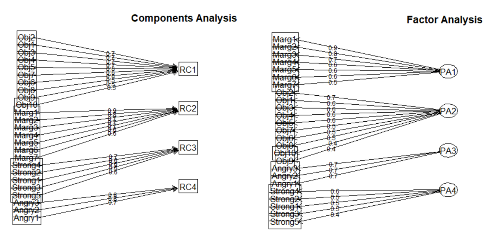
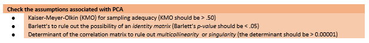
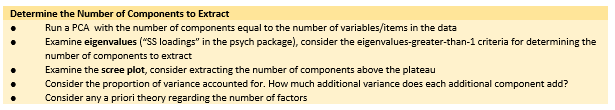
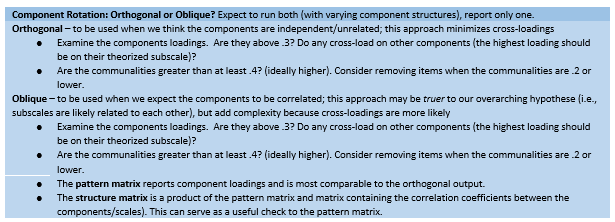
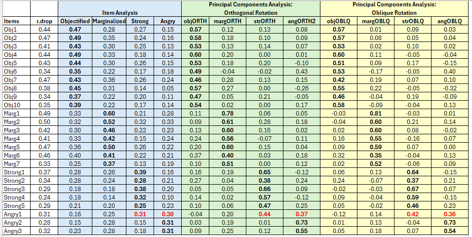
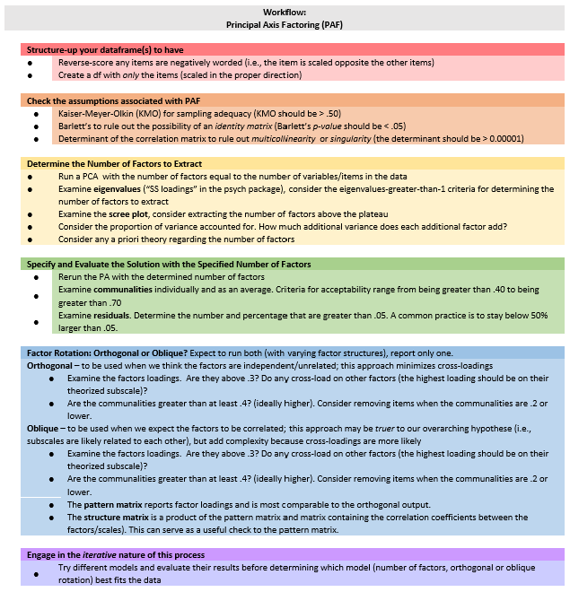
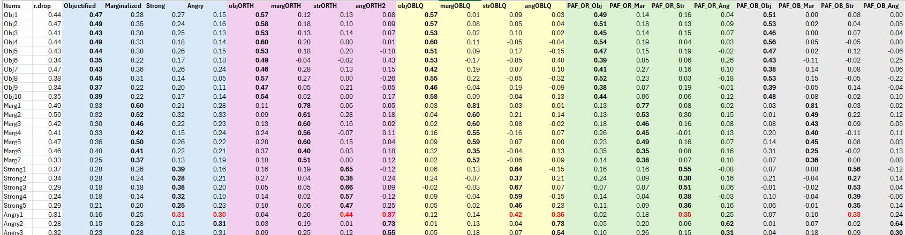
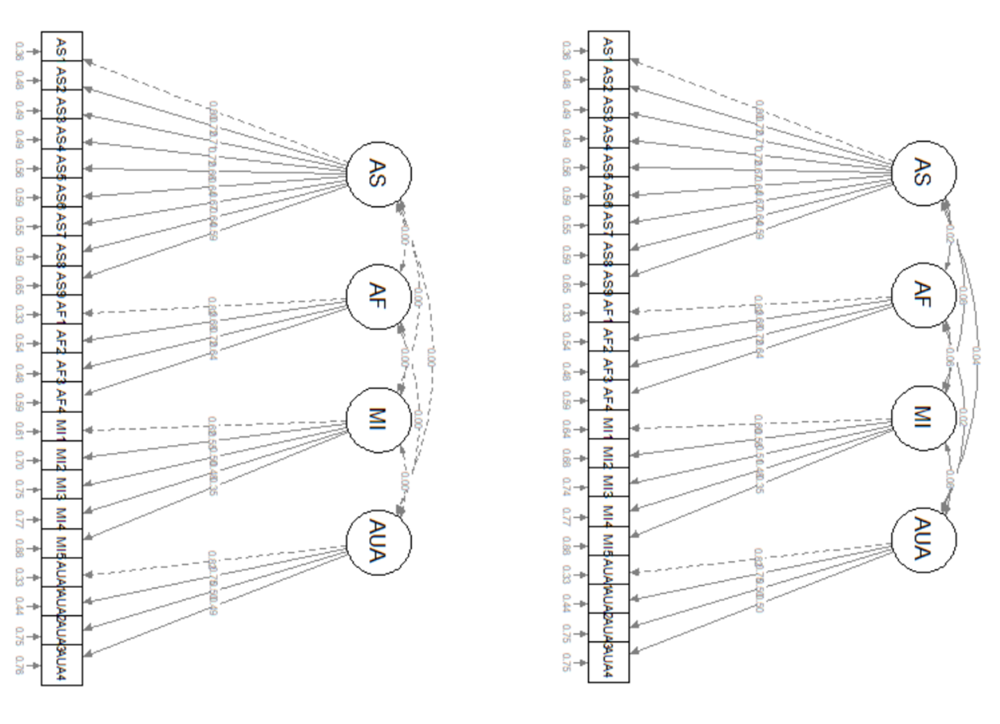
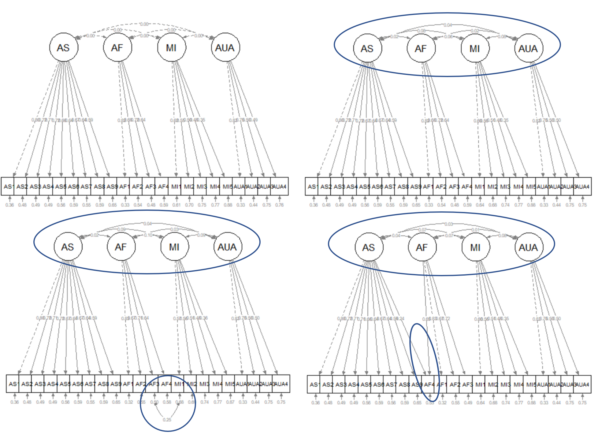

--- 
lang: "en"
title: "ReCentering Psych Stats:  Psychometrics"
author: "Lynette H Bikos, PhD, ABPP"
knit: "bookdown::render_book"
site:  bookdown::bookdown_site
documentclass: book
bibliography: STATSnMETH.bib
citation-style: apa-single-spaced.csl
link-citations: true

#url: 'http\://whateveritis
#github-repo: whatever it is

description: 'This is an open-access, book-in-progress. My goal in offering it is to re-center the materials used in training statistics and research methods in graduate and post-graduate psychology programs.'
#cover-image: "ReCenter_bookcover.jpg"

output:
  bookdown::gitbook:
    dev: svglite
    css: css/style.css
    #includes: 
        #in_header: [google-analytics-otl.html]
    toc_depth: 4
    split-by: section
    split_bib: true
    number_sections: true
    #pandoc_args: [ "--csl", "apa-single-spaced.csl" ]
    config:
      toc:
        scroll_highlight: yes
        collapse: section
        before: |
          <li><a href="./"><strong>ReCentering Psych Stats:  Psychometrics</strong><br>by Lynette H Bikos, PhD, ABPP</a></li>
        after: |
          #<li><a href="https:link" target="_blank">Open access book-in-progress</br>
          <li><a rel="license" href="http://creativecommons.org/licenses/by-nc-sa/4.0/"></a></li>
            <li><a href="https://bookdown.org" target="_blank">Built with Bookdown</a></li>
      download: [pdf]
      view: https://github.com/ontheline/otl-bookdown/blob/master/%s
      search: yes
      sharing:
        facebook: yes
        github: yes
        twitter: yes

  #bookdown::pdf_book:
    #citation_package: default
    #pandoc_args: [ "--csl", "apa-single-spaced.csl" ]

  bookdown::word_document2:
    default

  bookdown::markdown_document2:
    default
---

# BOOK COVER {-}


# Preface {-}

**If you are viewing this document, you should know that this is a book-in-progress.  Early drafts are released for the purpose teaching my classes and gaining formative feedback from a host of stakeholders. The document was last updated on `r format (Sys.Date(), '%d %b %Y')`**.  Emerging volumes on other statistics are posted on the [ReCentering Psych Stats](https://lhbikos.github.io/BikosRVT/ReCenter.html) page at my research team's website. 

[Screencasted Lecture Link](https://spu.hosted.panopto.com/Panopto/Pages/Viewer.aspx?id=c932455e-ef06-444a-bdca-acf7012d759a)

To *center* a variable in regression means to set its value at zero and interpret all other values in relation to this reference point. Regarding race and gender, researchers often center male and White at zero. Further, it is typical that research vignettes in statistics textbooks are similarly seated in a White, Western (frequently U.S.), heteronormative, framework. The purpose of this project is to create a set of open educational resources (OER) appropriate for doctoral and post-doctoral training that contribute to a socially responsive pedagogy -- that is, it contributes to justice, equity, diversity, and inclusion. 

Statistics training in doctoral programs are frequently taught with fee-for-use programs (e.g., SPSS/AMOS, SAS, MPlus) that may not be readily available to the post-doctoral professional. In recent years, there has been an increase and improvement in R packages (e.g., *psych*, *lavaan*) used for in analyses common to psychological research. Correspondingly, many graduate programs are transitioning to statistics training in R (free and open source).  This is a challenge for post-doctoral psychologists who were trained with other software. This OER will offer statistics training with R and be freely available (specifically in a GitHub respository and posted through GitHub Pages) under a Creative Commons Attribution - Non Commercial - Share Alike license [CC BY-NC-SA 4.0]. 

Training models for doctoral programs in HSP are commonly scholar-practitioner, scientist-practitioner, or clinical-scientist.  An emerging model, the *scientist-practitioner-advocacy* training model incorporates social justice advocacy so that graduates are equipped to recognize and address the sociocultural context of oppression and unjust distribution of resources and opportunities [@mallinckrodt_scientist-practitioner-advocate_2014]. In statistics textbooks, the use of research vignettes engages the learner around a tangible scenario for identifying independent variables, dependent variables, covariates, and potential mechanisms of change. Many students recall examples in Field's  [-@field_discovering_2012] popular statistics text:  Viagra to teach one-way ANOVA, beer goggles for two-way ANOVA, and bushtucker for repeated measures.  What if the research vignettes were more socially responsive? 

In this OER, research vignettes will be from recently published articles where: 

* the author’s identity is from a group where scholarship is historically marginalized (e.g., BIPOC, LGBTQ+, LMIC[low-middle income countries]), 
* the research is responsive to issues of justice, equity, inclusion, diversity, 
* the lesson’s statistic is used in the article, and 
* there is sufficient information in the article to simulate the data for the chapter example(s) and practice problem(s); or it is publicly available.  

In training for multicultural competence, the saying, "A fish doesn't know that it's wet" is often used to convey the notion that we are often unaware of our own cultural characteristics. In recent months and years, there has been an increased awakening to the institutional and systemic racism that our systems are perpetuating. Queuing from the water metaphor, I am hopeful that a text that is recentered in the ways I have described can contribute to *changing the water* in higher education and in the profession of psychology.


## Copyright with Open Access {-}
<a rel="license" href="http://creativecommons.org/licenses/by-nc-sa/4.0/"></a>

This book is published under a a <a rel="license" href="http://creativecommons.org/licenses/by-nc-sa/4.0/">Creative Commons Attribution-NonCommercial-ShareAlike 4.0 International License</a>. This means that this book can be reused, remixed, retained, revised and redistributed (including commercially) as long as appropriate credit is given to the authors. If you remix, or modify the original version of this open textbook, you must redistribute all versions of this open textbook under the same license - CC BY-SA.

A [GitHub open-source repository](https://github.com/lhbikos/ReC_Psychometrics) contains all of the text and source code for the book, including data and images. 

# ACKNOWLEDGEMENTS {-}

As a doctoral student at the University of Kansas (1992-2005), I learned that "a foreign language" was required for graduation. *Please note that as one who studies the intersections of global, vocational, and sustainable psychology, I regret that I do not have language skills beyond English.* This could have been met with credit from high school my rural, mid-Missouri high school did not offer such classes. This requirement would have typically been met with courses taken during an undergraduate program -- but my non-teaching degree in the University of Missouri's School of Education was exempt from this. The requirement could have also been met with a computer language (fortran, C++) -- I did not have any of those either. There was a tiny footnote on my doctoral degree plan that indicated that a 2-credit course, "SPSS for Windows" would substitute for the language requirement.  Given that it was taught by my one of my favorite professors, I readily signed up. As it turns out, Samuel B. Green, PhD, was using the course to draft chapters in the textbook [@green_using_2014] that has been so helpful for so many. Unfortunately, Drs. Green (1947 - 2018) and Salkind (2947 - 2017) are no longer with us. I have worn out numerous versions of their text. Another favorite text of mine was Dr. Barbara Byrne's [-@byrne_structural_2016], "Structural Equation Modeling with AMOS." I loved the way she worked through each problem and paired it with a published journal article, so that the user could see how the statistical evaluation fit within the larger project/article. I took my tea-stained text with me to a workshop she taught at APA and was proud of the signature she added to it (a little catfur might have fallen out).  Dr. Byrne created SEM texts for a number of statistical programs (e.g., LISREL, EQS, MPlus). As I was learning R, I wrote Dr. Byrne, asking if she had an edition teaching SEM/CFA with R. She promptly wrote back, saying that she did not have the bandwidth to learn a new statistics package.  We lost Dr. Byrne in December 2020. I am so grateful to these role models for their contributions to my statistical training.  I am also grateful for the doctoral students who have taken my courses and are continuing to provide input for how to improve the materials.

The inspiration for training materials that re*center statistics and research methods came from the [Academics for Black Survival and Wellness Initiative](https://www.academics4blacklives.com/). This project, co-founded by Della V. Mosley, Ph.D., and Pearis L. Bellamy, M.S., made clear the necessity and urgency for change in higher education and the profession of psychology. 

At very practical levels, I am indebted to SPU's Library, and more specifically, SPU's Education, Technology, and Media Department.  Assistant Dean for Instructional Design and Emerging Technologies, R. John Robertson, MSc, MCS, has offered unlimited consultation, support, and connection. Senior Instructional Designer in Graphics & Illustrations, Dominic Wilkinson, designed the logo and bookcover.  Psychology and Scholarly Communications Librarian, Kristin Hoffman, MLIS, has provided consultation on topics ranging from OERS to citations. I am alo indebted to Associate Vice President, Teaching and Learning at Kwantlen Polytechnic University, Rajiv Jhangiani, PhD. Dr. Jhangiani's text [-@jhangiani_research_2019] was the first OER I ever used and I was grateful for his encouraging conversation.

Financial support for this text has been provided from the *Call to Action on Equity, Inclusion, Diversity, Justice, and Social Responsivity
Request for Proposals* grant from the Association of Psychology Postdoctoral and Internship Centers (2021-2022). 


<!--chapter:end:index.Rmd-->

# Introduction {#ReCintro}

[Screencasted Lecture Link](https://spu.hosted.panopto.com/Panopto/Pages/Viewer.aspx?pid=cc9b7c0d-e5c3-4e4e-a469-acf7013ee761)

## What to expect in each chapter

This textbook is intended as *applied,* in that a primary goal is to help the scientist-practitioner-advocate use a variety of statistics in research problems and *writing them up* for a program evaluation, dissertation, or journal article. In support of that goal, I try to provide just enough conceptual information so that the researcher can select the appropriate statistic (i.e., distinguishing between when ANOVA is appropriate and when regression is appropriate) and assign variables to their proper role (e.g., covariate, moderator, mediator).

This conceptual approach does include occasional, step-by-step, *hand-calculations* (only we calculate them arithmetically in R) to provide a *visceral feeling* of what is happening within the statistical algorithm that may be invisible to the researcher.  Additionally, the conceptual review includes a review of the assumptions about the characteristics of the data and research design that are required for the statistic. Statistics can be daunting, so I have worked hard to establish a *workflow* through each analysis. When possible, I include a flowchart that is referenced frequently in each chapter and assists the the researcher keep track of their place in the many steps and choices that accompany even the simplest of analyses.

As with many statistics texts, each chapter includes a *research vignette.* Somewhat unique to this resource is that the vignettes are selected from recently published articles. Each vignette is chosen with the intent to meet as many of the following criteria as possible:

* the statistic that is the focus of the chapter was properly used in the article,
* the author’s identity is from a group where scholarship is historically marginalized (e.g., BIPOC, LGBTQ+, LMIC [low middle income countries]),
* the research has a justice, equity, inclusion, diversity, and social responsivity focus and will contribute positively to a social justice pedagogy, and 
* the data is available in a repository or there is sufficient  information in the article to simulate the data for the chapter example(s) and practice problem(s).  

In each chapter we employ *R* packages that will efficiently calculate the statistic and the dashboard of metrics (e.g., effect sizes, confidence intervals) that are typically reported in psychological science.

## Strategies for Accessing and Using this OER

There are a number of ways you can access this resource. You may wish to try several strategies and then select which works best for you.  I demonstrate these in the screencast that accompanies this chapter.

1. Simply follow along in the .html formatted document that is available on via GitHug Pages, and then
   * open a fresh .rmd file of your own, copying (or retyping) the script  and running it 
2. Locate the original documents at the [GitHub repository](https://github.com/lhbikos/ReC_Psychometrics) . You can
   * open them to simply take note of the "behind the scenes" script
   * copy/download individual documents that are of interest to you
   * fork a copy of the entire project to your own GitHub site and further download it (in its entirety) to your personal workspace. The [GitHub Desktop app](https://desktop.github.com/) makes this easy!
3. Listen to the accompanying lectures (I think sound best when the speed is 1.75). The lectures are being recorded in Panopto and should include the closed captioning.
4. Provide feedback to me!  If you fork a copy to your own GitHub repository, you can 
   * open up an editing tool and mark up the document with your edits,
   * start a discussion by leaving comments/questions, and then
   * sending them back to me by committing and saving.  I get an e-mail notiying me of this action.  I can then review (accepting or rejecting) them and, if a discussion is appropriate, reply back to you.

## If You are New to R

R can be oveRwhelming. Jumping right into advanced statistics might not be the easiest way to start. However, in these chapters, I provide complete code for every step of the process, starting with uploading the data. To help explain what R script is doing, I sometimes write it in the chapter text; sometimes leave hastagged-comments in the chunks; and, particularly in the accompanying screencasted lectures, try to take time to narrate what the R script is doing.  

I've found that, somewhere on the internet, there's almost always a solution to what I'm trying to do. I am frequently stuck and stumped and have spent hours searching the internet for even the tiniest of things.  When you watch my videos, you may notice that in my R studio, there is a "scRiptuRe" file. I takes notes on the solutions and scripts here -- using keywords that are meaningful to me so that when I need to repeat the task, I can hopefully search my own prior solutions and find a fix or a hint.

### Base R

The base program is free and is available here:  https://www.r-project.org/  

Because R is already on my machine (and because the instructions are sufficient), I will not walk through the instllation, but I will point out a few things.

* Follow the instructions for your operating system (Mac, Windows, Linux)
* The "cran" (I think "cranium") is the *Comprehensive R Archive Network.*  In order for R to run on your computer, you have to choose a location.  Because proximity is somewhat related to processing speed, select one that is geographically "close to you." 
* You will see the results of this download on your desktop (or elsewhere if you chose to not have it appear there) but you won't ever use R through this platform.

### R Studio

*R Studio* is the desktop application I work in R.  It's a separate download. Choose the free, desktop, option that is appropriate for your operating system:   https://www.rstudio.com/products/RStudio/

* Upper right window:  Includes several tabs; we frequently monitor the
  + Environment: it lists the *objects* that are available to you (e.g., dataframes)
* Lower right window: has a number of helpful tabs.
  + Files:  Displays the file structure in your computer's environment.  Make it a practice to (a) organize your work in small folders and (b) navigating to that small folder that is holding your project when you are working on it.
  + Packages:  Lists the packages that have been installed.  If you navigate to it, you can see if it is "on."  You can also access information about the package (e.g., available functions, examples of script used with the package) in this menu.  This information opens in the Help window.
  + Viewer and Plots are helpful, later, when we can simultaneously look at our output and still work on our script.
* Primary window
  + R Studio runs in the background(in the console).  Very occasionally, I can find useful troubleshooting information here.
  + More commonly, I open my R Markdown document so that it takes the whole screen and I work directly, right here.
* *R Markdown* is the way that many analysts write *script*, conduct analyses, and even write up results.  These are saved as .rmd files.
  + In R Studio, open an R Markdown document through File/New File/R Markdown
  + Specify the details of your document (title, author, desired ouput)
  + In a separate step, SAVE this document (File/Save] into a NEW FILE FOLDER that will contain anything else you need for your project (e.g., the data).
  + *Packages* are at the heart of working in R.  Installing and activating packages require writing script.

### R Hygiene

Many initial problems in R can be solved with good R hygiene. Here are some suggestions for basic practices.  It can be tempting to "skip this."  However, in the first few weeks of class, these are the solutions I am presenting to my students.

#### Everything is documented in the .rmd file

Although others do it differently, everything is in my .rmd file. That is, for uploading data and opening packages I write the code in my .rmd file.  Why?  Because when I read about what I did hours or years later, I have a permanent record of very critical things like (a) where my data is located, (b) what version I was using, and (c) what package was associated with the functions.

#### File organization

File organization is a critical key to this:

* Create a project file folder.
* Put the data file in it.
* Open an R Markdown file.
* Save it in the same file folder.
* When your data and .rmd files are in the same folder (not your desktop, but a shared folder), they can be connected.

#### Chunks

The R Markdown document is an incredible tool for integrating text, tables, and analyses.  This entire OER is written in R Markdown.  A central feature of this is "chunks."

The easiest way to insert a chunk is to use the INSERT/R command at the top of this editor box.  You can also insert a chunk with the keyboard shortcut:  CTRL/ALT/i

"Chunks" start and end with with those three tic marks and will show up in a shaded box, like this:

```{r title for the chunk contents}
#hashtags let me write comments to remind myself what I did
#here I am simply demonstrating arithmetic (but I would normally be running code)
2021 - 1966
```

Each chunk must open and close.  If one or more of your tic marks get deleted, your chunk won't be read as such and your script will not run.  The only thing in the chunks should be script for running R; you can hashtag-out script so it won't run.

Although unnecessary, you can add a brief title for the chunk in the opening row, after the "r."  These create something of a table of contents of all the chunks -- making it easier to find what you did.  You can access them in the "Chunks" tab at the bottom left of R Studio. If you wish to knit a document, you cannot have identical chunk titles.

You can put almost anything you want in the space outside of tics.  Syntax for simple formatting in the text areas (e.g,. using italics, making headings, bold, etc.) is found here:  https://rmarkdown.rstudio.com/authoring_basics.html


#### Packages

As scientist-practitioners (and not coders), we will rely on *packages* to do our work for us. At first you may feel overwhelmed about the large number of packages that are available. Soon, though, you will become accustomed to the ones most applicable to our work (e.g., psych, tidyverse, lavaan, apaTables).

Researchers treat packages differently. In these lectures, I list all the packages we will use in an opening chunk that asks R to check to see if the package is installed, and if not, installs it.  

```{r checking for packages}
if(!require(psych)){install.packages("psych")}
```

To make a package operable, you need to open it through the library.  This process must be repeated each time you restart R. I don't open the package (through the "library(package_name)") command until it is time to use it.  Especially for new users, I think it's important to connect the functions with the specific packages.

```{r opening psych, package, message=FALSE, warning=FALSE}
#install.packages ("psych")
library (psych)
```

If you type in your own "install.packages" code, hashtag it out once it's been installed.  It is problematic to continue to re-run this code .

#### Knitting

An incredible feature of R Markdown is its capacity to *knit* to HTML, powerpoint, or word. If you access the .rmd files for this OER, you can use annotate or revise them to suit your purposes.  If you redistribute them, though, please honor the Creative Commons Attribution-NonCommercial-ShareAlike 4.0 International License with a citation.

### tRoubleshooting in R maRkdown

Hiccups are normal.  Here are some ideas that I have found useful in getting unstuck.

* In an R script, you must have everything in order -- Every. Single. Time. 
  + All the packages have to be in your library and activated; if you restart R, you need to reload each package.
  + If you open an .rmd file and want a boxplot, you cannot just scroll down to that script.  You need to run any *prerequisite* script (like loading the package, importing data, putting the data in the global environment, etc.)
  + Do you feel lost?  clear your global environment (broom) and start at the top of the R script. Frequent, fresh starts are good.
* Your .rmd file and your data need to be stored in the same file folder.  These should be separate for separate projects, no matter how small.
* Type any warnings you get into a search engine.  Odds are, you'll get some decent hints in a manner of seconds.  Especially at first, these are common errors:
  + The package isn't loaded (if you restarted R, you need to reload your packages)
  + The .rmd file has been saved yet, or isn't saved in the same folder as the data
  + Errors of punctuation or spelling
* Restart R (it's quick -- not like restarting your computer)
* If you receive an error indicating that a function isn't working or recognized, and you have loaded the package, type the name of the package in front of the function with two colons (e.g., psych::describe(df). If multiple packages are loaded with functions that have the same name, R can get confused.

### stRategies for success

* Engage with R, but don't let it overwhelm you.
  + The *mechanical is also the conceptual*. Especially when it is *simpler*, do try to retype the script into your own .rmd file and run it. Track down the errors you are making and fix them.
  + If this stresses you out, move to simply copying the code into the .rmd file and running it.  If you continue to have errors, you may have violated one of the best practices above (Is the package loaded? Are the data and .rmd files in the same place? Is all the prerequisite script run?).
  + Still overwhelmed?  Keep moving forward by downloading a copy of the .rmd file that accompanies any given chapter and just "run it along" with the lecture. Spend your mental power trying to understand what each piece does. Then select a practice problem that is appropriate for your next level of growth. 
* Copy script that works elsewhere and replace it with your datafile, variables, etc.  
* The leaRning curve is steep, but not impossible.  Gladwell[-@gladwell_outliers_2008] reminds us that it takes about 10,000 hours to get GREAT at something (2,000 to get reasonably competent). Practice. Practice. Practice.
* Updates to R, R Studio, and the packages are NECESSARY, but can also be problematic.  It could very well be that updates cause programs/script to fail (e.g., "X has been deprecated for version X.XX").  Moreover, this very well could have happened between my distribution of these resources and your attempt to use it.  My personal practice is to update R, R Studio, and the packages a week or two before each academic term.
* Embrace your downward dog.  Also, walk away, then come back.
  

### Resources for getting staRted

R for Data Science:  https://r4ds.had.co.nz/

R Cookbook:  http://shop.oreilly.com/product/9780596809164.do

R Markdown homepage with tutorials:  https://rmarkdown.rstudio.com/index.html

R has cheatsheets for everything, here's one for R Markdown:  https://www.rstudio.com/wp-content/uploads/2015/02/rmarkdown-cheatsheet.pdf 

R Markdown Reference guide:  https://www.rstudio.com/wp-content/uploads/2015/03/rmarkdown-reference.pdf

Using R Markdown for writing reproducible scientific papers:  https://libscie.github.io/rmarkdown-workshop/handout.html 

LaTeX equation editor:  https://www.codecogs.com/latex/eqneditor.php

<!--chapter:end:01-Introduction.Rmd-->

# Questionnaire Construction: The Fundamentals {#QuestCon}

 [Screencasted Lecture Link](https://spu.hosted.panopto.com/Panopto/Pages/Viewer.aspx?pid=ec7c8795-a0af-4f23-9145-ad9a00355e3c) 
 
```{r  include=FALSE}
knitr::opts_chunk$set(echo = TRUE)
knitr::opts_chunk$set(comment = NA) #keeps out the hashtags in the knits
options(scipen=999)#eliminates scientific notation
```

I found this lesson to be more of a struggle to prepare than I expected. Why? There is a great deal of lore about what increases response rates and participation. Yet, research over the years had both supported and contradicted these claims. One example is where to include "sensitive items." Historically, textbook authors have recommended that these should come last so that respondents would be engaged in the process and be more willing to complete the survey [@krathwohl_methods_2009; @rowley_designing_2014]. Yet, research has shown that this has not held up in employee groups [@roberson_questionnaire_1990] nor among members of the National Association of Social Workers [@robert_g._green_should_2000]. 

Given these contradictions, this lecture starts with the overall structure of a survey. The core of the lecture focuses on recent, evidence-based support for item-level decisions. I briefly discuss construct-specific guidance and discuss specific considerations for the on-line environment. I then close by addressing some of the decisions that I routinely make in survey construction and provide my rationale for why. Because this lesson occurs at the beginning of a text on psychometrics -- this "skips over and around" the issue of reliability and validity.

## Navigating this Lesson

There is just under one hour of lecture. 

While the majority of R objects and data you will need are created within the R script that sources the chapter, occasionally there are some that cannot be created from within the R framework. Additionally, sometimes links fail.  All original materials are provided at the [Github site](https://github.com/lhbikos/ReC_Psychometrics) that hosts the book. More detailed guidelines for ways to access all these materials are provided in the OER's [introduction](#ReCintro)

### Learning Objectives

Focusing on this week's materials, make sure you can:

* Outline the overall structure/components of a questionnaire,
* Articulate test construction myths (e.g., location of sensitive items, “requirement” to have reverse scored items) and their evidence-based solutions (when they have them)
* List elements to consider when the questionnaire is administered online

### Planning for Practice

This is a two-part lesson on questionnaire construction. After the second lesson, a detailed suggestion for practice will be provided that lists criteria for creating and piloting a survey of your own.

### Readings & Resources

In preparing this chapter, I drew heavily from the following resource(s). Other resources are cited (when possible, linked) in the text with complete citations in the reference list.

* Chyung, S. Y., Roberts, K., Swanson, I., & Hankinson, A. (2017). Evidence-Based Survey Design: The Use of a Midpoint on the Likert Scale. Performance Improvement, 56(10), 15–23. https://doi.org/10.1002/pfi.21727
* Chyung, S. Y., Barkin, J. R., & Shamsy, J. A. (2018a). Evidence‐Based Survey Design: The Use of Negatively Worded Items in Surveys. Performance Improvement, 57(3), 16–25. https://doi.org/10.1002/pfi.21749
* Chung, S. Y., Kennedy, M., & Campbell, I (2018b). Evidence-based survey design: The use of ascending or descending order of Likert-type response options. Performance Improvement, 57(9), 9-16. https://doi.org/10.1002/pfi.21800 
* Chyung, S. Y., Swanson, I., Roberts, K., & Hankinson, A. (2018c). Evidence‐Based Survey Design: The Use of Continuous Rating Scales in Surveys. Performance Improvement, 57(5), 38–48. https://doi.org/10.1002/pfi.21763
  - Finding the Chyung et al. series was like finding a pot of gold! They provide empirical support for guiding choices about survey construction. And they are current! If you don't have time to read them in detail, I recommend you scan them and archive them for future reference.


## Components of the Questionnaire

Let's start by examining the components of a questionnaire and the general guidelines for their construction[@colton_designing_2015; @pershing_ineffective_2001]:

**Title**

* reflect the content of the instrument
* be concisely worded
* be written in language easily understood by the respondents
* should not be offensive or off-putting
* should be formatted clearly at the top/beginning of the document

**Introductory Statement**

* include a brief summary of the instrument's purpose
* contain an appropriate statement concerning the confidentiality of the respondent's information (informed consent)
* be motivating such that respondents are inspired/willing to complete the items
* specify the approximate amount of time required to complete the instrument

**Directions**

* complete, unambiguous, concise
* written at a language level appropriate to the respondents
* tell the respondents how to return the instrument once they have completed it (surprisingly, in Qualtrics, this is also important; submission requires hitting that last little "-->>")

**Items** (discussed in a later section)

**Closing Statement**

* thank the participants for their participation
* remind participants that their information is valuable and perhaps remind about 
  + next steps or follow-up
  + confidentiality

**Overall Structure/Look**

* should be coherent with an easy-to-follow layout
* not crowded
* professional appearance
  + not crowded, plenty of white space
  + avoiding a "slick look"
  + numbering and headings to provide a sense of progress
  + breaks between every 4-6 questions (or shading alternate items)
  + in a sense, inviting and "easy on the eye"

Pershing and Pershing [-@pershing_ineffective_2001] reviewed 50 *reactionnaires* that were used by training evaluators at a "prestigious medical school." Their purpose was to determine the degree to which the survey design adhered to the recommendations.  The results suggested that:

* 72% did not include an introductory statement; an additional 16% were "minimal"
* 78% had no closing statement
* 30% had no directions; another 54% of directions were "minimal"
* 8% were professional in appearance

In summary, the formatting of the reactionnaires were not designed in a way that would maximize respondent engagement. In turn, we might expect this to threaten the psychometric reliability and validity.

## What Improves (or Threatens) Response Rates and Bias?

It's not always clear, but well-designed studies and formal reviews of literature are revealing, sometimes surprising findings to old debates. When we design survey instruments based on our own preference rather than research-based evidence, we may get less than optimal data [@chyung_evidence-based_2018].

Chyung et al. (2018) reviewed the five steps [@schwarz_asking_2001] that survey respondents engage when answering structured, closed-ended survey items. 

1. Interpreting the question
2. Retrieving information from their memory
3. Integrating the information
4. Selecting one of the given response options
5. Editing the answer for reasons of social desirability

Chyung and colleagues appear to be starting such a systematic review. What follows are their evidence based evaluations regarding some of the most common questions about questionnaire construction.

### Should Likert-type scales include a midpoint? 

Chyung et al. [-@chyung_evidence-based_2017] reviewed the literature on whether/not to use a **midpoint** ("neutral" or "neither disagree nor agree").  Examining their article, we can see variants of Likert-style scaling for a scale of agreement.  They look something like this:


|Type
|:-----------------|:-----------------|:--------|:-------------------------|:--------|:---------------|
|No midpoint (4 pt)|Strongly Disagree |Disagree |*skipped*                 | Agree   |Strongly Agree |
|Midpoint (5 pt)   |Strongly Disagree |Disagree |Neither Disagree Nor Agree| Agree   |Strongly Agree |


Chyung and colleagues quickly suggest that the question is not "Should I use a midpoint?" but rather "When should I use a midpoint?"

The article is more detailed, but essentially, a midpoint is appropriate when:

* the measurement scale is interval (instead of ordinal; this is a good statistical property to have)
* the question content is such that the midpoint is a *true* midpoint and not a point for hedging or avoiding

If a true midpoint is impossible, then consider adding an option such as "I don't know" or "It depends."  Of course these introduce scoring dilemmas (e.g., needing to be recoded as missing; then having a plan for managing missingness) that will need to be addressed in preparing the data for analysis.

### Should *continuous rating scales* be used in surveys?  

First, let's consider the distinction between *discrete*, *continuous*, and *numerical* scales. Figure 4 in the Chyung, Swanson, Roberts, and Hankinson [-@chyung_evidencebased_2018-1] article illustrate the major differences and some variations.

* **Discrete** scales are Likert-type scales that range range between 2 and 11 *discrete* options. Clasically, respondents pick *words* (e.g., pain rated as *no pain*, *mild*, *moderate*, *severe*, *extreme*, *worst pain possible*).
  + 6-point discrete rating scales result in a collection of six *ordered values* 
  + thus they are on the ordinal measurement scale and (as discussed above)
  + they should be analyzed with non-parametric statistical procedures (parametric approaches can be used if the data are normally distributed and there is a mid-point)
* **Continuous** scales allow respondents to indicate a response anywhere within a given range -- usually by marking a place on a horizontal line on a continuum of a minimum of 100 points.  There are no discrete categories defined by words or numbers.  In Qualtrics there is a slider option.
  + Continuous scales result in precise numbers (e.g., 26 or 26.8 if the scale is 0 to 100) 
  + these are on an interval-level measurement scale AND 
  + they can be evaluated with parametric statistical analyses
  + *visual analog scales (VAS; aka graphic rating scales, GRS)* are another variant of continuous rating scales if they allow the participants to make "anywhere on the line."  Some VAS scales have verbal descriptors to guide the marking; some have numbers (hence, *numerical response scales*)
  
Which is better?  The mixed results are summarized in Chyung et al's [-@chyung_evidencebased_2018-1] Table 1.  With a focus on the types of research I encounter in my program, here is my take-away: 

* Continuous scales provide better data (more precise/full information, more likely to be normally distributed, better reliability) for statistical analysis.
  + *Caveat:* If the response scale on a Likert scale is increased to 11, there is a better chance to have normally distributed responses.
  + *Caveat:* When "simple descriptives" are desired (e.g., histograms, frequency distributions) the discrete scale may be the best choice.
* Both are easy to use, except in the case where respondents complete the surveys on mobile devices.
  + *Caveat:* there has been more missing data with sliders (compared to radio buttons)
  + *Caveat:* respondents are more likely to change their responses on sliders. If this means there is greater accuracy or more careful responding, this is desirable.
* In both circumstances adding "don't know," "prefer not to respond," or "not applicable" may improve the validity of the responses

### Should Likert-type response options use an ascending or descending order?  

Let's first look at the difference [@chyung_evidence-based_2018]:


|Type
|:--------------|:-----------------|:--------------|:--------------|:--------------|:---------------|
|Ascending |Strongly Disagree | Disagree |Neither Disagree Nor Agree| Agree        | Strongly Agree |
|Descending|Strongly Agree | Agree |Neither Agree Nor Disagree| Disagree        | Strongly Disagree |


In the consideration of the choice between ascending/descending, we are concerned with *response-order effects*.  Let's first examine these conceptually/theoretically.

**Recency effect** is the tendency of survey respondents to select the options that they see at the end of the response-option list. This is expected when options are presented orally (e.g., during interviews, people tend to choose from the last-offered options) 

**Primacy effect** is the survey respondents’ tendency to select the options that are presented at the beginning of the
response-option list. This is expected when options are presented visually.  For example, people tend to choose among the first-presented categories in self-administered written survey questionnaires.

* *left-sided selection bias* occurs when respondents read text from left-to-right and are more inclined to select options from the left.
* *satisficing theory* occurs when individuals seek solutions that are "simply satisfactory" so as to minimize psychological costs.  Thus, respondents may 
  - select the first option that seems "reasonable enough", 
  - select the "I don't know" response, or 
  - randomly select one of the options.
* *acquiesence bias* is the tendency for respondents to agree with the statement provided—aka yea-saying bias (e.g., being polite). 
  + Closely related is *social-desirability bias,* the tendency for respondents to select among the options they think are more socially acceptable or desirable (instead of true responses).
  + In surveys, this generally is selecting *agree* or *strongly agree*.

Considering these response biases together, Chyung et al. suggest that when the response options are presented in descending order (*Strongly agree, Agree, Neutral, Disagree, Strongly disagree*), respondents would (theoretically) see a positive option immediately on the left side of the response scale and perceive it to be socially desirable and satisfactory, resulting in their decision to select it without having to spend more time to choose a true response. However, the same effects may or may not happen when the response options are presented in ascending order (*Strongly disagree, Disagree, Neutral, Agree, Strongly agree*).

After reviewing 13 studies, Chyung et al. observed that many studies (paper and web based, with children and adults, in English and other language):

* revealed response-order effects in self administered surveys, especially the primacy effect, associated with left-side selection bias, acquiescence bias, and satisficing. 
* showed more positive average scores from descending-ordered scales

Recommendations:

* present response scales in ascending order
  + when a number line is used, lower and negative numbers should be on the left
* when using descended order scales
  + keep respondents motivated to complete items accurately
  + present half items with descended-ordered scales and the other half with ascended-ordered scales
  + assign half of participants with descended-ordered scales; half with ascended-ordered scales
  + present response options vertically rather than horizontally


### Should surveys include negatively worded items? 

In examining this question, Chyung et al. [@chyung_evidencebased_2018] made a distinction between (see Table 1 in the article):

* **Statement format** the same response scale such as a Likert scale
* **Question format** different response scales that are tailored to individual survey questions. A challenge with this format is the difficulty in calculating an average score of data obtained from multiple survey items.

The advent of negatively-worded items began with Rensis Likert in 1932.  He was an American social psychologist who, in attempt to mitigate aqcuiescence/yea-saying biases, recommended designing one half of survey items to be associated with agreement and the other half with disagreement. Although Likert recommended "straightforward statements," incorporating negative words can become quickly complicated. Table 2 in the Chyung paper shows that there are four ways of wording survey statements:

**Reverse-coding**, which is necessary when including negatively worded items in a scale, assumes that agreeing to a positively worded statement and disagreeing to its negatively worded counterpart are the same.  Tables 3 and 4 in the ms show how this assumption may be faulty.

A review of the negatively-worded-item literature suggested the following:

* scales with all positively worded items yielded greater accuracy when compared with all negatively worded items or mixed worded items
* scores on positively and negatively worded items are not the same (e.g., strongly disagreeing to a positively worded statement is differenf from strongly agreeing to a negatively worded statement)
* positively worded items produce higher means than negatively worded items. This may be due to
  + carelessness and fatigue in reading items
  + the cognitive processing of postive and negative items may be different
* a *method factor* has shown itself where in factor analyses of scales with factor structures unrelated to the wording, exploratory approaches to factor analysis have produced separate factors with the negatively worded (or otherwise ambiguous) items, this results in a threat to construct validity and reliability.

Chyung, Barkin, and Ramsey [-@chyung_evidencebased_2018] noted that resondent performance declines approximately 12 minutes after respondents start a survey. This relates to negatively worded items because it appeared that respondents increasingly failed to notice negatively worded statements even when there were efforts to draw their attention to them via bolding, underlining, or capitalizing the negated element (e.g., *not*).  Thus, when negatively worded items are used, they should probably be presented early in the protocol.

Chyung et al [-@chyung_evidencebased_2018] also cautioned about a response set bias that can occur when using all positively worded items. They recommended making design choices that enhance bias-free and accurate responding based on the research design.

  + For example, attributes to be measured in some constructs (e.g., depression, anxiety) are, themselves, negative and so a negatively worded item may be most clear and appropriate.
  + The inclusion (and subsequent analysis) of negatively phrased items may help *detect* acquiesence bias.
* Table 5 in the manuscript provides some guidelines that are more nuanced when negative items must be included. For example, 
  + ensure that negatively worded items are true polar opposites and symmetrical (so they can be analyzed with the positively worded items)
  + group negative items together (and forewarn/format so they are recognized as such)
  + administer the survey when respondents are not fatigued
  + analyze the effect of the negatively worded items

## Construct-specific guidance

Self-efficacy is domain-specific construct.  That is, even though there are some *general self-efficacy scales* Bandura's original definition suggests that it should be task specific (i.e., career decision-making self-efficacy, math self-efficacy).

This construct is an example where Bandura, himself [-@bandura_guide_2006], provided specific guidelines for creating these task-specific assessments.  Generally they included:

1. phrasing items as “can do” rather than “will do,” 
2. maintaining consistency with the self-efficacy construct definition (e.g., domain specific, a focus on capability rather than self-worth), 
3. including items that reflect gradations of challenge, 
4. asking individuals to rate their current (as opposed to future) operative capabilities
5. scaling should be on a 100 point scale

## Surveying in the Online Environment

Nearly a decade ago, a survey of human subjects review boards  suggested that 94% of the IRB applications reviewed involved online or Web-based surveys [@buchanan_online_2009]. Thus, it is important to give some specifical conceptual consideration to the online environment.  

A first set of considerations involve data security, identity, and permission (implicit and explicit).

The **IP address** as well as **longitude/latitude** has been a contentious issue for a number of years [@buchanan_online_2009].  EU data protection laws consider IP addresses as personally identifiable data; in the U.S., IP addresses typically fall outside the definition of "personal information."  In Qualtrics, the default is to collect and download the IP address (the "anonymize response" option can prevent this data from being collected).  On the one hand it is helpful to know geographically "from where" participants are responding; on the other, some consider its capture to be a violation of privacy.

Relatedly, what is considered to be **fully informed consent** [@conrad_survey_2007].  Is it ethical to capture paradata (e.g., typing speed, changed answers, response times) or metadata without explicitly saying so?

**The tool** being used to collect the data is concerning.  Buchanan and Hvizdak [-@buchanan_online_2009] argued that until each tool is vetted and its privacy policies and data security policies are understood, we cannot be 100% certain how security, consent, and privacy are instantiated within the individual tools. For example, it is possible that tool creators *could* gather respondent data and repurpose it for their own marketing, for sale to other researchers, and so forth

Online and web-based protocols increase our reach geographically and cross-culturally. For now, I will bracket out the issue of cultural translation, for the purpose of online the question is about **access** [@conrad_survey_2007].  Think about the decades of psychological research based on White, college-educated, males.  Are we creating another strata of privileged research with technology that may not be accessible in terms of both internet/technology as well as capacity/fluency with the tool? On the other hand, what are the risks of not adopting new technologies before everyone has them.

When paper/pencil measures were administered in face-to-face settings (individually or in auditoriums of students) there was some degree of **standardized protocol.**  This is lost when surveys are administered online and we cannot guarantee *who* is taking the survey.  To what degree does this matter?

When respondents are remote, what happens if they have a **negative reaction to the survey**?  In a face-to-face context, debriefings can occur and referrals can be made.  How is this managed remotely?

**Security of test items** might also be concerning.  It is not ok to use propietary items without the permission of the testmaker.  If the security of items is important (e.g., SAT/GRE, intelligence test items, inkblots) because they are central to administration, how can this be protected in the virtual environment?

Consequently, when students in our programs write doctoral dissertations they are to narrate the following in their Method section.

* Describe how informed consent will be obtained in the online environment.
* Describe the level of identification that is collected. If the claim of “anonymous” or “de-identified” indicate whether/not this includes capturing the IP address; some researchers believe that capturing a computer’s IP address threatens anonymity.
* Describe the steps to be taken to ensure that respondents met the inclusion/exclusion criteria of the study.
* Anticipate and describe how the online (e.g., uncontrolled, public, distractions) setting might affect responses. 
* Particularly if the survey contained sensitive materials, describe how respondents might access resources for debriefing or referral.
* Identify the permissions (from original authors or copyright holders) granted to reformat and post (on the internet) existing surveys. If items are considered to be secure (e.g., those on the MMPI or WAIS), identify steps taken to protect them. 

## In my Surveys

Because there isn't empirical data on every decision that we make in survey construction, I thought it might be useful for me to address some of the decisions that I find myself making in the online surveys I use in my own research.

### Demographics and Background Information

A core value that I hope to reflect in the *ReCentering Psych Stats* series is to promote socially and culturally responsive research. Correspondingly, the information we collect from participants should ensure that they feel that their identities are authentically reflected in the survey. Naively, when I first considered how to capture race/ethnicity in my surveys, I looked to the categories used in the U.S. Census.  Immediately, I learned that this is problematic. Rather than elaborating here, I invite you to take a listen to NPR's [Code Switch](https://www.npr.org/podcasts/510312/codeswitch) podcast had a series of episodes that included a discussion of the evolution of the race and ethnicity question. Two of the episodes review how the race/ethnicity question is used and and why it is problematic:   [Census Watch 2020](https://www.npr.org/transcripts/607553683) and [The U.S. Census and Our Sense of Us](https://www.npr.org/transcripts/540671012). As made clear in the Code Switch podcasts, the race/ethnicity question in the U.S. Census *erases* people when their identities are not included. 

My last few surveys have captured race/ethnicity data differently. Each time, I engage in several practices that (I hope) will continue to shape the item in a socially and culturally responsive way. Systematically, I:

* conduct a quick internet search to see if there is an emerging best practice (even though I may have also searched weeks or months prior), 
* consider who the intended research population is in relationship to the topic of investigation,
* look to recently published, similar, research to see what other researchers are doing, and
* ask for a colleagial, formative review from individuals who hold marginalized identities, whose data will be requested in the survey.

When I engage in research, I try to balance the need to quantify (with discrete categories) who is participating in the survey and inviting respondents to state (in their own words) their identity. This is consistent with my view that variables like race, ethnicity, and gender identity as socially constructed. In addition to this particular worldview, Parent [-@parent_handling_2013] has suggested that the worst possible kind of missing data pattern (MNAR -- missing not at random) may be caused when items are *unanswerable* to particular person. Therefore, it is essential that all individuals find their place in the items that assess demographic variables.

My last survey was directed toward community members (including students, alumni, staff, faculty) of my predominantly White, liberal arts, Christian institution. After reviewing recently published research articles and consulting with a handful of individuals, I chose to include the following categories -- *each with a text write-in box* so that individuals could select the category(ies) that fit best and have the opportunity to refine it(them). I am excited to review this data because such responses may inform my next survey. The categories included:

* Asian or Pacific Islander
* Black or African American
* Hispanic or Latino
* Native American or Alaskan Native
* White or Caucasian
* Biracial or multiracial
* An international/global identity that does not fit in the U.S. categorization of race/ethnicity
* A race/ethnicity not listed above

Note that individuals could select multiplecategories


The option to select multiple boxes will result in some extra coding when we prepare the data for analysis. I am taking approach that we will *listen* to the data and decide, based on the results, how to report the findings in a way that will efficiently fit into an APA style empirical paper and honor the participants.

The population of interest for this particular study are those who are engaged in protest activities regarding hiring practices and policies that result in discrimination to members of the LGBTQIA+ community. This means that questions of gender identity, pronouns, and relationship to the LGBTQIA+ community are important to the research, but needed to be asked sensitively and with great security of the data.

Regarding gender identity, I used a similar approach to the race/ethnicity question, allowing individuals to select multiple categories and offering write-in boxes for each.  The categories included:

* female
* male
* nonbinary
* transwoman
* transman
* something else
* prefer not to say

Additionally, I invited individuals to identify their pronouns. Again, write-in boxes were offered with each option.

* they/them/theirs
* she/her/hers
* he/him/his
* they/she/he
* neo pronouns (e.g., xe/xem/xyr, ze/hir/hirs, ey/em/eir)
* something else

Finally, we wanted individuals to indicate their relationship to the LGBTQIA+ community. We asked them to select all that apply. Only the "something else" box had a write-in option:

* Member
* Exploring/Questioning
* Ally
* Not related
* Something else (with a write-in box)

I expect that my future surveys may inquire about these variables differently. If you have found a different way to ask, please fconsider e-mailing me. I would love to provide different options and give credit to contributors.

### Survey Order

Historically, demographic information has been first or last in the survey. Although some research has reported no differences in response rates when demographic and sensitive data are at the beginning or end [@krathwohl_methods_2009; @rowley_designing_2014], I am inclined to open the survey with questionnaire items that are closely related to the topic listed on the recruitment materials and end the survey with the demographic information. Why? It makes sense to me that if someone has responded positively to the survey topic, they expect to answer questions (right away) about that topic.

In between that opening survey and closing demographic items, I consider if there are any *order effects* that would engage in undue *priming* of responses. If there are such concerns, I think through the order to minimize them. If there are no such concerns, I put my surveys in blocks and then ask my survey program to randomly present the blocks. This serves two purposes:

* counterbalancing possible order effects, and
* distributing missingness for individuals who do not complete the survey.

### Forced Responses

Programs like Qualtrics are able to engage in a variety of *content validation* procedures. If these are in place, they may require the person to enter a properly formatted response (e.g., phone number, e-mail address, numerical response between 0 and 100) before responding. These are extremely helpful tools in collecting data that will be closest-to-being-ready-for-analysis. These same procedures can *force* or *request* a response. 

*Requiring* a response is tempting. However, doing so violate IRB requirements that allow a person to skip or "quit at any time without penalty." They may also anger a person such that they stop responding. Some researchers get around this by *requiring* the response, but including a "Not applicable" or "Prefer to not answer" column. Because I worry that (a) the respondent may confuse that option with one extreme of the scale and/or (b) my research team and I will forget to code it as missing data, I prefer the *request* response alternative.

In Qualtrics in particular, I turn on the "Request response" feature for each of the questions. If an item is skipped, a simple warning is displayed that invites the respondent to review the page of answers to see if they would like to answer the question. If not, they can simply move forward.

## Practice Problems
   
In each of these lessons I provide suggestions for practice that allow you to select one or more problems that are graded in difficulty. With each of these options I encourage you to:

This is a two-part lesson on questionnaire construction. After the [second lesson](#qualTRIX), a detailed suggestion for practice will be provided that lists criteria for creating and piloting a survey of your own.


```{r include=FALSE}
sessionInfo()
```


<!--chapter:end:02-QuestCon.Rmd-->

# Be a QualTRIXter {#qualTRIX}

[Screencasted Lecture Link](https://spu.hosted.panopto.com/Panopto/Pages/Viewer.aspx?pid=422daef0-a158-48b3-a69d-ad9a00202939) 
 
```{r  include=FALSE}
knitr::opts_chunk$set(echo = TRUE)
knitr::opts_chunk$set(comment = NA) #keeps out the hashtags in the knits
options(scipen=999)#eliminates scientific notation
```

The focus of this lecture is on the technical and mechanical tools available in Qualtrics (and likely other survey platforms) to increase the effectiveness of your survey.

## Navigating this Lesson

This lecture is just under one hour.  Plan for another 30 minutes for *intRavenous qualtRics* practice.

While the majority of R objects and data you will need are created within the R script that sources the chapter, occasionally there are some that cannot be created from within the R framework. Additionally, sometimes links fail.  All original materials are provided at the [Github site](https://github.com/lhbikos/ReC_Psychometrics) that hosts the book. More detailed guidelines for ways to access all these materials are provided in the OER's [introduction](#ReCintro)

### Learning Objectives

Focusing on this week's materials, make sure you can: 

* Utilize basic Qualtrics tools (e.g,. question type, use of headers) so that surveys are present materials clearly to the respondent. 
* Incorporate more advanced tools (e.g., display logic, randomization) that may increase the respondent's ability to complete the survey and provide accurate responses.
* Provide a rationale for survey options that protect (or possibly reveal) an individual's identity.

### Planning for Practice

This is the second of a two-part lesson on questionnaire construction. At the end of this lesson is a detailed suggestion for practice that lists criteria for creating and piloting a survey of your own. There are four essential criteria for your survey:

* Adhere to the evidence-based practices identified in the lesson on [questionnaire construction](#QuestCon).
* Utilize four techniques (in the context of Qualtrics, I term these *qualTRIXter skills*) that increase the flow, effectiveness, and appearance of your survey.
* Pilot and consider feedback provided by those who took the survey.
* Import the data into the R environment.

### Readings & Resources

In preparing this chapter, I drew heavily from the tutorials available at the [Qualtrics support site](https://www.qualtrics.com/support/). I have tried to link them throughout the presentation. It is likely they could change at any time and/or they might not work on your particular browser (as I write this, half of them will not work on FireFox, but they do on Chrome and Edge).

### Packages

The packages used in this lesson are embedded in this code. When the hashtags are removed, the script below will (a) check to see if the following packages are installed on your computer and, if not (b) install them.
```{r }
#will install the package if not already installed
#if(!require(qualtRics)){install.packages("qualtRics")}
```

## Research Vignette

I will demonstrate the qual"TRIX" by using a Qualtrics account at my institution, Seattle Pacific University. The only surveys in this account are for the *Recentering Psych Stats* chapters and lessons. All surveys are designed to not capture personally identifying information and not collecting IP addresses nor longitude/latitude. I use this survey in several lessons in this OER. If you haven't taken the survey yet, [I invite you to do so, now](https://spupsych.az1.qualtrics.com/jfe/form/SV_b2cClqAlLGQ6nLU). 

As a teaching activity for the ReCentering Psych Stats OER, the topic of the survey was selected to be consistent with the overall theme of OER. Specifically, the purpose of this study is to understand the campus climate for students whose identities make them vulnerable to bias and discrimination. These include  students who are Black, non-Black students of color, LGBTQ+ students, international students, and students with disabilities. 

After consulting with a diverse group of stakeholders and subject matter experts (and revising the response options numerous times) I have attempted to center anti-Black racism in the U.S. [@mosley_critical_2021; @mosley_radical_2020; @singh_building_2020].  In fact, the display logic does not present the race items when the course is offered outside the U.S. There are only five options for race: *biracial/multiracial*, *Black*, *non-Black person(s) of color*, *White*, and *I did not notice* (intended to capture a color-blind response). One unintended negative consequence of this design is that the response options could contribute to *colorism* [@adames_fallacy_2021; @capielo_rosario_acculturation_2019]. Another possibility is that the limited options may erase, or make invisible, other identities. At the time that I wrote up the first description of this survey, the murder of six Asian American women in Atlanta had just occurred. The Center for the Study of Hate and Extremeism has documented that while overall hate drimes dropped by 7% in 2020, anti-Asian hate crimes reported to the police in America's largest cities increased by 149% [@noauthor_fact_nodate]. These incidents have occurred not only in cities, but in our neighborhoods and on our campusus [@kim_guest_2021; @kim_yes_2021; @noauthor_stop_nodate]. While this survey is intended to assess campus climate as a function of race, it unfortunately does not distinguish between many identities that experience marginalization. 

Although the dataset should provide the opportunity to test a number of statistical models, one working hypothesis that framed the study is that the there will be a greater sense of belonging and less bias and discrimination when there is similar representation (of identities that are often marginalized) in the instructional faculty and student body. Termed,  "structural diversity" [@lewis_black_2019] this is likely an oversimplification.  In fact, an increase in diverse representation without attention to interacting factors can increase hostility on campus [@hurtado_linking_2007]. Thus, the task of rating of a single course relates to the larger campus along the dimensions of belonging and bias/discrimination. For example, if a single class has higher ratings on issues of inclusivity, diversity, and respect, we would expect that sentiment to be echoed in the broader institution.

The survey design has notable limitations  You will likely notice that we ask about demographic characteristics of the instructional staff and classmates in the course rated, but we do not ask about the demographic characteristics of the respondent. In making this decision, we likely lose important information. For example, Iacovino and James [-@iacovino_retaining_2016] have noted that White students perceive campus more favorably than Black student counterparts. 

The decision to not collect demographic details about the respondent was about protecting their (your) identity. As you will see, you have the opportunity to download and analyze the data. If a faculty member asked an entire class to take the survey, the datestamp and a handful of demographic identifiers could very likely identify a student. In certain circumstances, this might be risky in that private information (i.e., gender nonconformity, disclosure of a disability) along with course evaluation data and a datestamp could be related back to the student.  

Further, the items that ask respondents to *guess* the identities of the instructional staff and classmates are limited, and contrary to best practices in survey construction that recommend providing the option of a "write-in" a response.  

In parallel, the items asking respondents to identity characteristics of the instructional staff along dimensions of gender, international status, and disability are "large buckets" and do not include "write-in" options. Similarly, there was no intent to cause harm by erasing or making invisible individuals whose identities are better defined by different descriptors.  Further, no write-in items were allowed.  This was also intentional to prevent potential harm caused by people who could leave inappropriate, racist, or otherwise harmful comments. 

As I review Qualtrics essentials and trix, I will their use (if used) in the ReCentering Psych Stats survey.

## Qualtrics Essentials

Qualtrics is a powerful program and I find that many of the surveys we distribute don’t capitalize on the features Qualtrics has to offer.  Qualtrics has detailed tutorials and instructions that are well worth the investment of a weekend to review them. 

In this lecture I will point you to the elements that I think are critical to constructing online surveys. Because Qualtrics tutorials are (a) clear and thorough and (b) frequently updated, I will (a)  point you to the tutorials that are available at the time of this lecture prep, (b) tell you why I think they are appropriate, and (c) show you how we have used them in some of our own surveys.  

Even if you think you know what you are doing, start here (and then always take the time to "look around" at all the options on each window):  

**Survey Basic Overview**: The link below will give you an overview.  From there, you can follow all kinds of leads, looking for things you want to do with your survey – and getting ideas for what will improve it. 
https://www.qualtrics.com/support/survey-platform/survey-module/survey-module-overview/ 

[**Blocks**](https://www.qualtrics.com/support/survey-platform/survey-module/block-options/block-options-overview/) are the basic organizational tool in Qualtrics surveys.  Blocks have two purposes: (a) grouping items shown on "one page," and (b) using the block for easy ordering and/or random selection/presentation.  

[**Question types**](https://www.qualtrics.com/support/survey-platform/survey-module/editing-questions/question-types-guide/question-types-overview/):  Take a time to look at ALL the options.  You might be surprised to learn that there is a better choice than you might have imagined.  

Let's take a look at super basic/helpful question types:

* [**Text/graphic**](https://www.qualtrics.com/support/survey-platform/survey-module/editing-questions/question-types-guide/static-content/descriptive-text-and-graphic/): These are the types you should use for providing information (e.g., informed consent) to the participants.  
* [**Matrix table**](https://www.qualtrics.com/support/survey-platform/survey-module/editing-questions/question-types-guide/standard-content/matrix-table/) :  A more efficient way to use the Likert-style items (than multiple choice).  There is some controversy about whether not to use matrix tables vs. multiple choice dropdowns...    
  + Make sure to select a reasonable amount of header repetition.  This allows the respondent the maximum opportunity to see the column descriptors while they are responding.
* [**Slider**](https://www.qualtrics.com/support/survey-platform/survey-module/editing-questions/question-types-guide/standard-content/slider/) : This gets you continuous data on that 1 to 100 scale.  If the scale you are using is already published, and has not been psychometrically evaluated for slider use, you should probably stick with the format recommended in the publication.  But if YOU are designing a survey, think about this option. 
* [**Text Entry Questions**](https://www.qualtrics.com/support/survey-platform/survey-module/editing-questions/question-types-guide/standard-content/text-entry/)  have multiple options for length of answer.  Don't miss the options that include forms and content validation   
* [**Validation**](https://www.qualtrics.com/support/survey-platform/survey-module/editing-questions/validation/): Allows the user to allow certain types of information and specify their formats (e.g., numbers, e-mail addresses, dates). There is a balancing between being overly restricting and ensuring that the data is entered in the most clear and consistent way possible. A validation option I frequently use is one that asks individuals if they intended to leave something blank. This is tool that helps prevent missingness without forcing an individual to respond to an item that (a) might not be clear to them, (b) might not be appropriate or them, and/or (c) might result in an answer that is untrue for their unique circumstance.

## Qual-TRIX

[**Collaborating**](https://www.qualtrics.com/support/survey-platform/my-projects/sharing-a-project/) with other Qualtrics users in your institution is easy!
Scroll down to “Collaborating Inside Your Organization” and follow the instructions for adding individuals to your survey (you must “own” the survey…your collaborators will not be able to add others).
 
The ability to **schedule survey distributions** is like having your very own GA! If you have a roster(contact list) you can schedule distributions, reminders, and thank yous. Qualtrics will keep track of who responds and send reminders to the non-responders.  Here are resources for

* [E-mail overview](https://www.qualtrics.com/support/survey-platform/distributions-module/email-distribution/emails/emails-overview/)  
* [E-mail distribution management](https://www.qualtrics.com/support/survey-platform/distributions-module/email-distribution/emails/email-distribution-management/)  
* [Contact lists](https://www.qualtrics.com/support/survey-platform/contacts/creating-a-contact-list/)  
 
**Personalizing** invitations and surveys.  [Piped text](https://www.qualtrics.com/support/survey-platform/survey-module/editing-questions/piped-text/piped-text-overview/) is a way to personalize invitations and/or “carry forward” prior responses into new questions.

[**Randomization** of blocks](https://www.qualtrics.com/support/survey-platform/survey-module/survey-flow/standard-elements/randomizer/) (or a subset of blocks) can be use for several purposes such as: (a) using random selection to display one or more blocks to respondents -- as in a random clinical trial, (b) to randomly display a percentage of blocks or items to shorten the survey in a planned missing design, and (c) randomly display some or all of the blocks of the survey to all respondents so that when respondents experience test fatigue, when they quit responding, "the last items/surveys" aren't always the same ones -- thus distributing the missingness across surveys.   

[**Randomization** of items](https://www.qualtrics.com/support/survey-platform/survey-module/block-options/question-randomization/) within a block can be used for similar purposes.  You can also use this to display only some of the items (e.g., planned missingness). 

[**File upload** from respondents](https://www.qualtrics.com/support/survey-platform/survey-module/editing-questions/question-types-guide/advanced/file-upload/) is an additional package that requires the institution to pay a higher fee.  If available, this allows respondents to upload some sort of file (photo, powerpoint, .pdf).  We use it for poster contests at professional contests (where students upload their poster for online judging in advance of the conference).  A colleague of mine uses this function to collect application elements (i.e., resumes, cover letters, reference letters) to a fellowship program.  

* As researchers, we can also upload files (e.g., hardcopy of informed consent, documents to be reviewed) for use by the respondent. 

[**Display, Skip, and/or Branch Logic**](https://www.qualtrics.com/support/survey-platform/survey-module/question-options/display-logic/) can be used to help display to respondents *only* the items that pertain to them.  There are multiple approaches to doing this.  Using a display logic approach may feel a bit *backward* where the logic is applied *from* the landing spot.  We did this extensively in as study that involved two language versions and three age options.  

Two other approaches for these issues are [skip logic](https://www.qualtrics.com/support/survey-platform/survey-module/question-options/skip-logic/) and [branch logic](https://www.qualtrics.com/support/survey-platform/survey-module/survey-flow/standard-elements/branch-logic/) 


## Even moRe, particularly relevant to iRb

We can use Qualtrics tools for purposes beyond collecting and downloading data. These tools are especially useful when I think about IRB applications and ethics related to data collection.

[**Exporting to Word**](https://www.qualtrics.com/support/survey-platform/survey-module/survey-tools/import-and-export-surveys/) Helpful for your IRB application (and perhaps in a cloud so that a team can use track changes to edit), it is super simple to export the survey to Microsoft Word.  PLUS!  You have options for including question numbers, recode values, logic, etc., so that it is essentially a codebook.

[**Anonymizing responses**](https://www.qualtrics.com/support/survey-platform/distributions-module/web-distribution/anonymous-link/)  Another step toward an anonymous response is to withhold the IP address.  This is accomplished in the  Survey Options menu.

[**Prevent ballot box stuffing**](https://www.qualtrics.com/support/survey-platform/survey-module/survey-options/survey-protection/#PreventingRespondentsFromTakingYourSurveyMoreThanOnce) Want to make sure that respondents only answer once?  In the same Survey Options window, you can prevent ballot box stuffing.  


Other security options include

* Password protection
* HTTP Referer verification

Look also at:

* **Progress bar** to provide particpants hope (or despair) for "how much longer."
* **Survey termination** to connect cutom endings and thank-you notes.
* [**Partial completion**](https://www.qualtrics.com/support/survey-platform/survey-module/survey-options/partial-completion/) to specify how long the respondent has to complete the survey (after opening it) and whether it is recorded or deleted if it is not completed. 
  +  Related to this, back on the Data & Analysis tab, you can see both #s of [recorded responses and responses in progress](https://www.qualtrics.com/support/survey-platform/data-and-analysis-module/data/responses-in-progress/).  You also have options to manually determine how you want to include/exclude the response in progress. 
  +  ARGHGHGHGHGH!!!!   That grubby little "-->" submit and progress symbol is often the reason that surveys that are > 90% complete aren't counted as "complete."  What to do? Options: (a) don't say "Thanks and goodbye" on a page that has any items, and (b) provide instructions to look for the "-->" symbol to continue.

Finally, **PREVIEW PREVIEW PREVIEW**! There is no better way check your work than with previews.  


## intRavenous Qualtrics

Access credentials for the institutional account, individual user's account, and survey are essential for getting the survey items and/or results to export into R. The Qualtrics website provides a tutorial for [generating an API token](https://www.qualtrics.com/support/integrations/api-integration/overview/#GeneratingAnAPIToken).     

We need two pieces of information:  the **root_url** and an **API token**.  

* Log into your respective qualtrics.com account.
* Select Account Settings
* Choose "Qualtrics IDs" from the user name dropdown


We need the  **root_url**.  This is the first part of the web address for the Qualtrics account.  For our institution it is: spupsych.az1.qualtrics.com 

The API token is in the box labeled, "API." If it is empty, select, "Generate Token." If you do not have this option, locate the *brand administrator* for your Qualtrics account. They will need to set up your account so that you have API privileges.

*BE CAREFUL WITH THE API TOKEN*  This is the key to your Qualtrics accounts.  If you leave it in an .rmd file that you forward to someone else, this key and the base URL gives access to every survey in your account. If you share it, you could be releasing survey data to others that would violate confidentiality promises in an IRB application.

If you mistakenly give out your API token you can generate a new one within your Qualtrics account and re-protect all its contents.

You do need to change the API key/token if you want to download data from a different Qualtrics account.  If your list of surveys generates the wrong set of surveys, restart R, make sure you have the correct API token and try again.

```{r API token, eval=FALSE}
#only have to run this ONCE to draw from the same Qualtrics account...but will need to get different token if you are changing between accounts 
library(qualtRics)
#qualtRics::qualtrics_api_credentials(api_key = "mUgPMySYkiWpMFkwHale1QE5HNmh5LRUaA8d9PDg",
              #base_url = "spupsych.az1.qualtrics.com", overwrite = TRUE, install = TRUE)
```

*all_surveys()* generates a dataframe containing information about all the surveys stored on your Qualtrics account.

```{r Show all surveys, eval=FALSE}
surveys <- all_surveys() 
#View this as an object (found in the right: Environment).  
#Get survey id # for the next command
#If this is showing you the WRONG list of surveys, you are pulling from the wrong Qualtrics account (i.e., maybe this one instead of your own). Go back and change your API token (it saves your old one). Changing the API likely requires a restart of R.
surveys
```

To retrieve the survey, use the *fetch_survey()* function.  

```{r }
#obtained with the survey ID 
#"surveyID" should be the ID from above
#"verbose" prints messages to the R console
#"label", when TRUE, imports data as text responses; if FALSE prints the data as numerical responses
#"convert", when TRUE, attempts to convert certain question types to the "proper" data type in R; because I don't like guessing, I want to set up my own factors.
#"force_request", when TRUE, always downloads the survey from the API instead of from a temporary directory (i.e., it always goes to the primary source)
# "import_id", when TRUE includes the unique Qualtrics-assigned ID; since I have provided labels, I want false

#Out of the blue, I started getting an error, that R couldn't find function "fetch_survey."  After trying a million things, adding qualtRics:: to the front of it solved the problem
QTRX_df <-qualtRics::fetch_survey(surveyID = "SV_b2cClqAlLGQ6nLU", time_zone = NULL, verbose = FALSE, label=FALSE, convert=FALSE, force_request = TRUE, import_id = FALSE)

#useLocalTime = TRUE,
```

The optional script below will let you save the simulated data to your computing environment as either a .csv file (think "Excel lite") or .rds object (preserves any formatting you might do).
```{r}
#write the simulated data  as a .csv
#write.table(QTRX_df, file="QTRX_df.csv", sep=",", col.names=TRUE, row.names=FALSE)
#bring back the simulated dat from a .csv file
#QTRX_df <- read.csv ("QTRX_df.csv", header = TRUE)
```

```{r}
#to save the df as an .rds (think "R object") file on your computer; it should save in the same file as the .rmd file you are working with
#saveRDS(QTRX_df, "QTRX_df.rds")
#bring back the simulated dat from an .rds file
#QTRX_df <- readRDS("QTRX_df.rds")
```


### The Codebook

In order to prepare data from a survey, it is critical to know about its content, scoring directions for scales/subscales, and its design. As I demonstrated above, we can export a [codebook](./Rate-a-Course_Codebook.pdf), that is, a Word (or PDF) version of the survey with all the coding.  In Qualtrics the protocol is: Survey/Tools/ImportExport/Export Survey to Word.  Then select all the options you want (especially "Show Coded Values"). A tutorial provided by Qualtrics can be found [here](https://www.qualtrics.com/support/survey-platform/survey-module/survey-tools/import-and-export-surveys/). This same process can be used to print the PDF example I used above.

I recommend providing custom variable names and recode values directly in Qualtrics before exporting them into R.  A Qualtrics tutorial for this is provided [here](https://www.qualtrics.com/support/survey-platform/survey-module/question-options/recode-values/). In general, consider these qualities when creating variable names:

*	Brevity: historically, SPSS variable names could be a maximum of 8 characters.
*	Intuitive: although variables can be renamed in R (e.g., for use in charts and tables), it is helpful when the name imported from  Qualtrics provides some indication of what the variable is.
*	Systematic: start items in a scale with the same stem, followed by the item number -- ITEM1, ITEM2, ITEM3.

More complete information about data preparation is covered in chapters in the [ReCentering Psych Stats: Multivariate Modeling](https://lhbikos.github.io/ReC_MultivariateModeling/) text.

### Using data from an exported Qualtrics .csv file

The lecture focused on the "intRavenous" import.  It is is also possible to download the Qualtrics data in a variety of formats (e.g., CSV, Excel, SPSS).  Since I got started using files with the CSV extension (think "Excel" lite), that is my preference.

In Qualtrics, these are the steps to download the data:  Projects/YOURsurvey/Data & Analysis/Export & Import/Export data/CSV/Use numeric values

I think that it is critical that to save this file in the same folder as the .rmd file that you will use with the data. 

R is sensitive to characters used filenames  As downloaded, my Qualtrics .csv file had a long name with spaces and symbols that are not allowed.  Therore, I gave it a simple, sensible, filename, "ReC_Download210319.csv".  An idiosyncracy of mine is to datestamp filenames. I use two-digit representations of the year, month, and date so that if the letters preceding the date are the same, the files would alphabetize automatically.

```{r }
#library(qualtRics)
#QTRX_csv <- read_survey("ReC_Download210319.csv", strip_html = TRUE, import_id = FALSE, time_zone=NULL, legacy = FALSE)
```

Although minor tweaking may be required, the same script above should be applicable to this version of the data.  


### Tweaking Data Format
Two general approaches:

1. Inside Qualtrics:  Use the recode values option (found in the item's gearbox, to the left of the block) to specify variable names and recode values.  These should be preserved on the download.   https://www.qualtrics.com/support/survey-platform/survey-module/question-options/recode-values/

2. In the R script: In another lecture I demonstrate how to change the formats of data (character, string), selecting only the variables in which we are interested (e.g., excluding the meta-data), and renaming variables sensibly.

Both work!  Just a preference -- and probably have an explicit process approach within your research team/collaborators.


## Practice Problems
   
The suggestion for practice is to develop a questionnaire, format it, pilot it, and download it. Essentially you will be

* Formatting a survey on Qualtrics using all the best practices identified in the lecture
  + these include having an introductory statement (to include statement of confidentiality), directions for each sub-survey (if more than one), and closing statement.
  + selecting the most appropriate question type for the items.  For example, matrix instead of multiple choice. 
  + within question type, using the appropriate options for proper formatting (e.g., the anchors in a matrix should be topically consistent and equal-interval)
* The survey should include minimum of 3 of the qualTRIXter skills (identified in lecture); choose from
  + establishing collaboration
  + scheduling e-mail distribution and follow-up
  + personalizing the survey in some way
  + randomization of blocks or items
  + integrating display, skip, or branch logic (e.g., having males and females take a different route)
  + exporting the survey to Word
  + recoding variables in the item controls
  + anonymize the responses
  + prevent ballot box stuffing
  + include a progress bar
  + create a custom ending, e-mail, or thank-you note
  + something else that YOU discovered that isn't in the lecture
* Piloting it, getting their feedback, and identifying what problems are (and how you might fix them)
  + with 3 folks from your RVT, cohort, or this class
  + with 3 additional folks who aren't quite as "research savvy"
  + collect their feedback (ideally in a text-item directly on the survey itself) and write a brief summary (3 paragraphs max) of their impressions and how you might improve the survey
* Import the Qualtrics data directly R 
  + preferably, directly from Qualtrics with the API token, base URL, and survey ID
  + alternatively (for the same # of points) from the exported CSV file *via the qualtRics package* (required)

|Assignment Component                    | Points Possible  | Points Earned|
|:-------------------------------------- |:----------------:|:------------:|
|1. Qualtrics survey best practices      |      5           |              |           
|2. QualTRIXter skills (at least 3)      |      5           |              |
|3. Minimum of 6 pilot respondents       |      5           |              |  
|4. Summary of pilot feedback            |      5           |              |               
|5. Import of Qualtrics data into R      |      5           |              |   
|6. Explanation to grader                |      5           |              |       
|**Totals**                              |     20           |              |          


```{r include=FALSE}
sessionInfo()
```


<!--chapter:end:03-QualTRIXter.Rmd-->

# Psychometric Validity:  Basic Concepts {#rxy}

 [Screencasted Lecture Link](https://spu.hosted.panopto.com/Panopto/Pages/Viewer.aspx?pid=d3b821d7-c182-435d-80ba-ad9e003dbc97) 
 
```{r  include=FALSE}
knitr::opts_chunk$set(echo = TRUE)
knitr::opts_chunk$set(comment = NA) #keeps out the hashtags in the knits
options(scipen=999)#eliminates scientific notation
```

The focus of this lecture is to provide an introduction to validity.  This includes understanding some of the concerns of validity, different aspects of validity, and factors as they affect validity coefficients. 


## Navigating this Lesson

There is just over one hour of lecture.  If you work through the materials with me it would be plan for an additional hour.

While the majority of R objects and data you will need are created within the R script that sources the chapter, occasionally there are some that cannot be created from within the R framework. Additionally, sometimes links fail.  All original materials are provided at the [Github site](https://github.com/lhbikos/ReC_Psychometrics) that hosts the book. More detailed guidelines for ways to access all these materials are provided in the OER's [introduction](#ReCintro)

### Learning Objectives

Focusing on this week's materials, make sure you can:

* Distinguish between different types of validity based on short descriptions.
* Compute and interpret validity coefficients.
* Evaluate the incremental validity of an instrument-of-interest.
* Define and interpret the standard error of estimate.
* Develop a rationale that defends importance of establishing the validity of a measuring instrument.

### Planning for Practice

In each of these lessons I provide suggestions for practice that allow you to select one or more problems that are graded in difficulty. With each of these options I encourage you to interpret examine aspects of the construct validity through the creation and interpretation of validity coefficients. Ideally, you will examine both convergent/discriminant as well as incremental validity.

### Readings & Resources

In preparing this chapter, I drew heavily from the following resource(s). Other resources are cited (when possible, linked) in the text with complete citations in the reference list.

* Jhangiani, R. S., Chiang, I.-C. A., Cuttler, C., & Leighton, D. C. (2019). Reliability and Validity. In *Research Methods in Psychology*. https://doi.org/10.17605/OSF.IO/HF7DQ
* Clark, L. A. & Watson, D. (1995). Constructing validity: Basic issues in objective scale development. Psychological Assessment, 7, 309-319.
  - In this manuscript, Clark and Watson (1995) create a beautiful blend of theoretical issues and practical suggestions for creating measures that evidence construct validity. From the practical perspective, the authors first guide potential scale constructors through the literature review and creating an item pool (including tips on writing items). The authors address structural validity by first beginning with strategies for constructing the test. In this section, the authors revisit the issue of dimensionality (i.e., alpha vs. factor analysis). Finally, the authors look at initial data collection (addressing sample size) and psychometric evaluation. 

### Packages

The packages used in this lesson are embedded in this code. When the hashtags are removed, the script below will (a) check to see if the following packages are installed on your computer and, if not (b) install them.
```{r }
#will install the package if not already installed
#if(!require(tidyverse)){install.packages("tidyverse")}
#if(!require(MASS)){install.packages("MASS")}
#if(!require(psych)){install.packages("psych")}

```

## Research Vignette

Explorations of validity are frequently correlational in nature. This lesson provides descriptions of numerous pathways for establishing an instrument's validity.  Best practices involving numerous demonstrations of validity. Across several lessons, we will rework several of the analyses reported in the research vignette. For this lesson in particular, the research vignette allows both convergent/discriminant validity as well as incremental validity.

The research vignette for this lesson is the development and psychometric evaluation of the Perceptions of the LGBTQ College Campus Climate Scale [@szymanski_perceptions_2020]. The scale is six items with responses rated on a 7-point Likert scale ranging from 1 (*strongly disagree*) to 7 (*strongly agree*). Higher scores indicate more negative perceptions of the LGBTQ campus climate. Szymanski and Bissonette have suggested that the psychometric evaluation supports using the scale in its entirety or as subscales composed of the following items:

* College response to LGBTQ students:  
  - My university/college is cold and uncaring toward LGBTQ students. 
  - My university/college is unresponsive to the needs of LGBTQ students. 
  - My university/college provides a supportive environment for LGBTQ students. 
* LGBTQ Stigma:  
  - Negative attitudes toward LGBTQ persons are openly expressed on my university/college campus. 
  - Heterosexism, homophobia, biphobia, transphobia, and cissexism are visible on my university/college campus. 
  - LGBTQ students are harassed on my university/college campus. 

A [preprint](https://www.researchgate.net/publication/332062781_Perceptions_of_the_LGBTQ_College_Campus_Climate_Scale_Development_and_Psychometric_Evaluation/link/5ca0bef945851506d7377da7/download) of the article is available at ResearchGate. 

In the [lesson](#rxx) on reliability, I simulate item-level data. However, this lesson we will be interested in the correlations between the total and subscale scores with five additional scales:

* LGBTQ victimization 
* Satisfaction with college
* Intention to persist in college
* Generalized anxiety disorder symptoms
* Symptoms of depression

```{r}
Szy_mu <- c(3.16, 2.71, 3.61, .11, 5.61, 4.41, 1.45, 1.29)
Szy_sd <- c(1.26, 1.33, 1.51, .23, 1.15, .53, .80, .78)
Szy_r_mat <- matrix(c(1,   .88, .90, .35, -.56, -.27, .25, .24,
                  .88,  1,  .58, .25, -.59, -.29, .17, .18,
                  .90, .58,  1,  .37, -.41, -.19, .27, .24,
                  .35, .25, .37,  1,  -.22, -.04, .23, .21,
                 -.56,-.59, -.41, -.22, 1,   .53, -.29, -.32,
                 -.27, -.29, -.19, -.04, .53, 1, -.22, -.26,
                  .25, .17,  .27,  .23,  -.29, -.22, 1, .76,
                  .24,  .18, .24, .21, -.32,  -.26, .76,  1), ncol = 8)
Szy_cov_mat <- Szy_sd %*% t(Szy_sd) * Szy_r_mat

set.seed(210907)
SzyDF <- round(as.data.frame(MASS::mvrnorm(n = 646, mu=Szy_mu, Sigma=Szy_cov_mat, tol=1e-3, empirical=TRUE)),2) #adding "tol=1e-3" fixed the not positive matrix error
SzyDF <- round(dplyr::rename(SzyDF, CClimate = V1, CResponse = V2, Stigma = V3, Victimization = V4, CollSat = V5, Persistence = V6, Anxiety = V7, Depression = V8),2)
#round(cor(SzyDF),2)
```

The optional script below will let you save the simulated data to your computing environment as either a .csv file (think "Excel lite") or .rds object (preserves any formatting you might do).
```{r}
#write the simulated data  as a .csv
#write.table(SzyDF, file="SzyDF.csv", sep=",", col.names=TRUE, row.names=FALSE)
#bring back the simulated dat from a .csv file
#SzyDF <- read.csv ("SzyDF.csv", header = TRUE)
```

```{r}
#to save the df as an .rds (think "R object") file on your computer; it should save in the same file as the .rmd file you are working with
#saveRDS(SzyDF, "SzyDF.rds")
#bring back the simulated dat from an .rds file
#SzyDF <- readRDS("SzyDF.rds")
```

## Fundamentals of Validity

**Validity** (the classic definition) is the ability of a test to measure what it purports to measure. Supporting that definition are these notions:

* Validity is extent of matching, congruence, or “goodness of fit” between the operational definition and concept it is supposed to measure.
* An instrument is said to be valid if it taps the concept it claims to measure.
* Validity is the appropriateness of the interpretation of the results of an assessment procedure for a given group of individuals, not to the procedure itself.
* Validity is a matter of degree; it does not exist on an all-or-none basis.
* Validity is always specific to some particular use or interpretation.
* Validity is a unitary concept.
* Validity involves an overall evaluative judgment.

Over the years (and, perhaps within each construct), validity has somewhat of an *evolutionary* path from a focus on content, to prediction, to theory and hypothesis testing.

When the focus is on **content**, we are concerned with the:

* assessment of what individuals had learned in specific content areas 
* relevance of its content (i.e., we compare the content to the content domain)

When the focus is on **prediction**, we are concerned with:

* how different persons respond in a given situation (now or later). 
* the correlation coefficient between test scores (predictor) and the assessment of a criterion (performance in a situation)

A focus on **theory and hypothesis testing** adds:

* a strengthened theoretical orientation
* a close linkage between psychological theory and verification through empirical and experimental hypothesis testing
* an emphasis on constructs in describing and understanding human behavior.

**Constructs** are broad categories, derived from the common features shared by directly observable behavioral variables. They are theoretical entities and not directly observable. **Construct validity** is at the heart of psychometric evaluation. We define **construct validity** as the fundamental and all-inclusive validity concept, insofar as it specifies what the test measures. Content and predictive validation procedures are among the many sources of information that contribute to the understanding of the constructs assessed by a test.

## Validity Criteria

We have just stated that validity is an overall, evaluative judgment. Within that umbrella are different criteria by which we judge the validity of a measure. We casually refer to them as *types*, but each speaks to that unitary concept.

### Content Validity

Content validity is concerned with the representativeness of the domain being assessed. Content validation procedures may differ depending on whether the test is in the educational/achievement context or if it is more of an attitude/behavioral survey.

In the educational/achievement context, content validation seeks to ensure the items on an exam are appropriate for the content domain being assessed.

A **table of specifications** is a two-way chart which indicates the instructionally relevant learning tasks to be measured. Percentages in the table indicate the relative degree of emphasis that each content area

Let's imagine that I was creating a table of specifications for items on a quiz for this very chapter. The columns represent the types of outcomes we might expect. The American Psychological Association often talks about *KSAs* (knowledge, skills, attitudes), so I will utilize those as a framework. You'll notice that the number of items and percentages do not align mathematically. Because, in the exam, I would likely weight application items (e.g., "work the problem") more highly than knowledge items (e.g., multiple choice), the relative weighting may differ.

**Table of Specifications**

|Learning Objectives                |Knowledge  |Skills     |Attitudes  |% of test |
|:----------------------------------|:---------:|:---------:|:---------:|:---------:|
|Distinguish between different types of validity based on short descriptions.| 6 items| | |30% |
|Compute and interpret validity coefficients.|  | 2 items   |           |       15%|
|Evaluate the incremental validity of an instrument-of-interest.| |1 item  |  |  20%|
|Define and interpret the standard error of estimate.|1 item |    |           |  15%|
|Develop a rationale that defends importance of establishing the validity of a measuring instrument.| | |1 item |20%  |   
|TOTALS                             |7 items    |3 items    |1 item     |100%  |  


**Subject matter experts** (SMEs) are individuals chosen to evaluate items based on their degree of knowledge of the subject being assessed.  If used:

*  report how many and professional qualifications; 
*  to classify items, report the directions they were given and the extent of agreement among judges. 
  
Empirical procedures for enhancing content validity of educational assessments may include:

*  comparing item-level and total scores with grades; lower grades should get lower scores;
*  analyzing individual errors; 
*  observing student work methods (have the students “think aloud” in front of an examiner);
*  evaluating the role of speed, noting how many do not complete the test in the time allowed;
*  correlating the scores with a reading comprehension test (if the exam is highly correlated, then it may be a test of reading and not another subject).  Alternatively, if it is a reading comprehension test, give the student the questions (without the passage) to see how well they answered the questions on the basis of prior knowledge.

For surveys and tests outside of educational settings, content validation procedures ask, "Does the test cover a representative sample of the specified skills and knowledge?" and "Is test performance reasonably free from the influence of irrelevant variables?" Naturally, SMEs might be used.

An example of content validation from Industrial-Organizational Psychology is the job analysis which precedes the development of test for employee selection and classification. 
Not all tests require content analysis. In aptitude and personality tests we are probably more interested in other types of validity evaluation.

### Face Validity:  The "Un"validity

Face validity is concerned with the question, “How does an assessment look on the ‘face of it’?” Let's imagine that on a qualification exam for electricians, a math item asks the electrician to estimate the amount of yarn needed to complete a project. The item may be more *face valid* if the calculation was with wire. Thus, face validity can often be improved by reformulating test items in terms that appear relevant and plausible for the context. 

Face validity should never be regarded as a substitute for objectively determined validity. In contrast, it should not be assumed that when a (valid and reliable) test has been modified to increase its face validity, that its objective validity and reliability is unaltered. That is, it must be reevaluated. 

### Criterion-Related Validity

Criterion-related validity has to do with the test's ability to *predict* an outcome (the criterion). If the criterion is something that occurs simultaneously, it is an assessment of **concurrent validity**; if it is in the future, it is an assessment of **predictive validity.**

A **criterion** is the "thing" that the test should, theoretically, be able to *predict*. That prediction could be occurring at the same time (*concurrent validity*) or at a future time (*predictive validity*). Regardless, the estimate of the criteria must be independent of the survey/assessment being evaluated. The table below provides examples of types of tests and concurrent and predictive validity criteria.	

|Type of Test                           |Concurrent Criteria Example         |Predictive Criteria Example        |
|:--------------------------------------|:-----------------------------------|:-----------------------------------
|A shorter (or cheaper) standardized achievement test|school grades, existing standardized tests|subsequent graduation/college admissions, cumulative GPA|         
|Employee selection tests|decision made by a search committee |subsequent retention or promotion of the selected employee| 
|Assessment of depression severity (shorter or cheaper)|diagnosis from a mental health professional; correlation with an established measure|inpatient hospitalization or act of self-harm|              
      
**Contrasted groups** is a specific type of criterion-related validity. Clearly differentiated groups (e.g., sales clerks versus excutives; engineers versus musicians) are chosen to see if exam performance or profiles differ in predictable ways.

**Criterion contamination** occurs when test scores, themselves, are used to make decisions about the criteria. To prevent this:

*	No person who participates in the assignment of criterion ratings can have any knowledge of the examinee’s test scores.  
*	the test scores must be kept strictly confidential. 

There are a number of issues related to criterion-related validity. 

* Is the criterion choice appropriate?
  - Criterion validity is only as good as the validity of the criterion to which one is making a comparison.
  –	In the 1980s and 1990s there was more attention in this area. That is critics questioned the quality of the criterion being used.
* To what degree can the results of criterion-related validity be generalized?
  - Most tests are developed (intentionally) for a local context, setting, or audience. Consequently, in the local context, the criterion-prediction sample is usually too small (i.e., 50 cases or less).
  - Those who want to generalize the test to a broader population should evaluate the test in relation to the new purpose.
* Is there a role for meta-analysis?
  - Repeated validation studies of our tests, on different samples, results in a number of small-scale studies, each with their own validity coefficients.
  - We can use meta-analytic procedures in reporting the results of validity coefficients when they are used for establishing criterion validity. 

### Construct Validity

**Construct validity** was introduced in 1954 in the first edition of APA's testing standards and is defined as the extent to which the test may be said to measure a theoretical construct or trait. The overarching focus is on the role of *psychological theory* in test construction and the ability to formulate hypotheses that canbe supported (or not) in the evaluation process. Construct validity is established by the accumulation of information from a variety of sources. 

There are a number of sources that can be used to support construct validity.  

### Internal Consistency

In the next [chapter](#rxx), you will learn that **internal consistency** is generally considered to be an index of reliability. In the context of criterion-related validity, a goal is to ensure that the criterion is the total score on the test itself. To that end, some of the following could also support this aspect of validity: 

* Comparing high and low scorers. Items that fail to show a significantly greater proportion of “passes” in the upper than the lower group are considered invalid, and are modified or eliminated.
* Computing a biserial correlation between the item and total score.  
* Correlating the subtest score with the total score. Any subtest whose correlation with the total score is too low is eliminated. 

Although some take issue with this notion, the degree of *homogeneity* (the degree to which items assess the same thing) has some bearing on construct validity. There is a tradeoff between items that measure a narrow slice of the construct definition (internal consistency estimates are likely to be higher) and those that sample the construct definition more broadly (internal consistency estimates are likely to be lower).

Admittedly, the contribution of internal consistency data is limited. In absence of external data, it tells us little about WHAT the test measures.

### Structural Validity

#### Exploratory Factor Analysis 

**Exploratory factor analysis** (EFA) is used to simplify the description of  behavior by reducing the number of categories (factors or dimensions) to as many as the numbers of the items to fewer. In instrument development, techniques like *principal components analysis* or *principal axis factoring* are used to identify clusters (latent factors) among items. We frequently treat these as scales and subscales.

Imagine the use of 20 tests to 300 people. There would be 190 correlations. 

* Irrespective of content, we can probably summarize the intercorrelations of tests with 5-6 factors.
* When the clustering of tests includes vocabulary, analogies, opposites, and sentence completions, we might suggest a "verbal comprehension factor."
* Factorial validity is the correlation of the test with whatever is common to a group of tests or other indices of behavior. If our single test has a correlation of .66 with the factor on which it loads, then the “factorial validity of the new test as a measure of the common trait is .66.”

When EFA is utilized, the items are "fed" into an iterative process that analyzes the relations and "reveals" (or suggests -- we are the ones who interpret the data) how many factors (think scales/subscales) and which items comprise them.

#### Confirmatory Factor Analysis

**Confirmatory factor analysis** (CFA) involves specifying, a priori, a proposed relationship of items, scales, and subscales and then testing its *goodness of fit.* In CFA (a form of structural equation modeling [SEM]), the latent variables (usually the higher order scales and total scale score) are positioned to cause the responses on the indicators/items.

Subsequent lessons provide examples of both EFA and CFA approaches to psychometrics.

### Experimental Interventions 

Construct validity is also supported by hypothesis testing and experimentation. If we expect that the construct assessed by the instrument is malleable (e.g., depression) and that an intervention could change it, then a random clinical trial that evaluated the effectiveness of an intervention (and it worked -- depression scores declined) would simultaneously provide support for the intervention as well as the instrument. 

### Convergent and Discriminant Validity 

In a psychometric evaluation, we will often administer our instrument-of-interest along with a battery of instruments that are more-and-less related. **Convergent validity** is supported when there are *moderately high* correlations between our tests and the instruments with which we expect moderately high correlations.  In contrast, **discriminant validity** is established by low and/or non-significant correlations between our instrument-of-interest and instruments that should be unrelated. For example, we want a low and non-significant correlation between a quantitative reasoning test and scores on a reading comprehension test.  Why?  Because if the correlation is too high, the test cannot discriminate between reading comprehension and math. 

There are no strict cut-offs to establish convergence or discrimination. We can even ask, "Could a correlation intended to support convergence be too high?"  It is possible!  Unless the instrument-of-interest offers advantages such as brevity or cost, then correlations that fall into the ranges of multicollinearity or singularity can indicate unnecessary duplication or redundancy.

In our research vignette, Szymanski and Bissonette [-@szymanski_perceptions_2020] conduct a correlation matrix that reports the bivariate relations between the LGBTQ Campus Climate full-scale as well as the College Response and Stigma subscales with measures that assess (a) LGBTQ victimization, (b) satisfaction with college, (c) persistence attitudes, and (d) anxiety, and (e) depression. 
```{r}
apaTables::apa.cor.table(SzyDF, filename = "SzyCor.doc", table.number = 1, show.sig.stars=TRUE, landscape=TRUE)
```
Examination of these values (which align well with the results in the table) follow the expected pattern.  That is, higher scores on the overall Campus Climate, College Response, and Stigma scales result in higher levels of victimization, anxiety, and depression. Conversely, they are associated with lower college satisfaction and persistence.

The College Response and Stigma subscales' relations with satisfaction with college (-.59, -.41, respectively) and persistence attitudes (-.29*, -.19, respectively) are examples of the convergent and discriminant patterns (College Response has higher relations with these than Stigma) that support construct validity.

The **multitrait-multimethod matrix** is a systematic experimental design for the dual approach of convergent and discriminant validation, which requires the assessment of two or more traits (classically, math, English, and reading scores) by two more methods (self, parent, and teacher). Conducting a web-based image search on this term will show a matrix of alpha coefficients and correlation coefficients that are interpreted in relationship to each other.  Roughly:

* alpha coefficients (internal consistency) should be the highest,
* validity coefficients (correlations of the same trait assessed by different methods) should be higher than correlations between different traits measured by different methods,
* validity coefficients (correlations of the same trait assessed by different methods) should be higher than different traits measured by the same method.

### Incremental Validity

**Incremental validity** is the increase in predictive validity attributable to the test. It indicates the contribution the test makes to the selection of individuals who will meet the minimum standards in criterion performance. There are different ways to assess this -- one of the most common is to first enter known predictors and then see if the instrument-of-interest continues to account variance over-and-above those that are entered.

In the Szymanski and Bissonette [-@szymanski_perceptions_2020] psychometric evaluation, the negative relations with satisfaction with college and intention to persist in college as well as positive relations with both anxiety and depression persisted even after controlling for LGBTQ victimization experiences.

I will demonstrate this procedure, predicting the contribution that the LGBTQ Campus Climate total scale scrore has on predicting intention to persist in college, over and above LGBTQ victimization. 

The process is to use hierarchical linear regression.  Two models are built.  In the first mode ("PfV" stands [in my mind] for "Persistence from Victimization"), persistence is predicted from victimization.  The second model adds the LGBTQ Campus Climate Scale.  I asked for summaries of each model.  Then the *anova()* function compares the model.

```{r}
PfV <- lm(Persistence ~ Victimization, data = SzyDF)
PfVC <- lm(Persistence ~ Victimization + CClimate, data = SzyDF)
summary(PfV)

```
From the PfVCmodel we learn that victimation has a non-significant effect on intentions to persist in college  Further, the $R^2$ is quite small (0.002).

```{r}
summary(PfVC)
```
In the PfVC model, we see that the LGBTQ Campus Climate full scale score has a significant impact on intentions to persist.  Specifically, foreach additional point higher on the Campus Climate Score, intentions to persist decrease by .13 points. Together, the model accounts for 7% of the variance (this is also an $R^2$ change of 7%).

```{r}
anova(PfV, PfVC)
```
We see that there is a statistically significant difference between the models.


Let's try another model.

```{r}
AfV <- lm(Anxiety ~ Victimization, data = SzyDF)
AfVC <- lm(Anxiety ~ Victimization + CClimate, data = SzyDF)
summary(AfV)
summary(AfVC)
anova(AfV, AfVC)
```
This model is a little more exciting in that our first model (AfV) is statistically significant. That is, victimization has a statistically significant effect on anxiety, accounting for 5% of the variance.  Even so, when added, the LGBTQ Campus Climate total scale score is also significant, and accounts for an additional 4% of variance ($\Delta{R^2}$),$R^2$ = 0.85. There is a statistically significant difference between models (*F*[1, 643] = 22.98, *p* < .001).

### Considering the Individual and Social Consequences of Testing 

Messick [@messick_consequences_2000] and others recommend that the “consequences of testing” be included in the concept of test validity. Messick's point was to consider the the unintended consequences of specific uses. That is, their use may be detrimental to individuals or to members of certain ethnic or other populations with diverse experiential backgrounds.  Examples of inappropriate use have included:
  
* The California Psychological Inventory (CPI) being used as a screening tool for employment as a security job. Two of its items inquired about same-sex activities and the employer was using this to screen out gay men.  Applicants were able to demonstrate, in court, a consistent rejection of gay applicants.
* While this is not a psychological test, urine samples are often collected as drug screening tools. In reality, urine can reveal a number of things, such as pregnancy.

The issue begs “conflicting goals.” In this case, the problem was not caused by the test but rather by its misuse. Studying the “consequences” of testing is one that is not necessarily answerable by empirical data/statistical analysis. It requires critical observation, human judgment, and systematic debate.

## Factors Affecting Validity Coefficients

Keeping in mind that a *validity coefficient* is merely the correlation between the test and some criteria, the same elements that impact the magnitude and significance of a correlation coefficient will similarly effect a validity coefficient.

**Nature of the group**.  A test that has high validity in predicting a particular criterion in one population,  may have little or no validity in predicting the same criterion in another population. If a test is designed for use in diverse populations, information about the population generalizability should be reported in the technical manuals. 

**Sample heterogeneity** Other things being equal, if there is a linear relationship between X and Y, it will have a greater magnitude when the sample is heterogeneous. 

**Pre-selection**. Just like internal and external validity in a research design can be threatened by selection issues, pre-selection can also impact the validity coefficients of a measure. For example, if we are evaluating a new test for job selection, we may select a group of newly hired employees. We plan to collect some measure of job performance at a later date. Our results may be limited by the criteria used to select the employees.  Were they volunteers? Were they only those hired? Were they ALL of the applicants? 

**Validity coefficients may change over time**. Consider the relationship between the college boards and grade point average at Yale University. Fifty years ago, $r_{xy} = .72$; today $r_{xy} = .52$.  Why?  The nature of the student body has become more diverse (50 years ago, the student body was predominantly White, high SES, and male).

The **form of the relationship** matters. The Pearson R assumes the relationship between the predictor and criterion variables is linear, uniform, and homoschedastistic (equal variability throughout the range of a bivariate distribution). When the variability is unequal throughout the range of the distribution the relationship is heteroscedastic.

```{r fig.cap="Illustration of heteroschedasticity", echo=FALSE}
n=rep(1:100,2)
a=0
b = 1
sigma2 = n^1.3
eps = rnorm(n,mean=0,sd=sqrt(sigma2))
y=a+b*n + eps
mod <- lm(y ~ n)
plot(n,y)
```

There could also be other factors involved in the relationship between the instrument and the criterion:

* curvilinearity
* an undetected mechanism, such as a moderator

Finally, what is our threshold for acceptability?

* Consider statistical signifance -- but also its limitations (e.g., power, Type I error, Type II error)
* Consider the magnitude of the correlation; and also $R^2$ (the proportion of variance accounted for)
* Consider error:
  - The standard error of the estimate shows the margin of error to be expected in the individuals predicted criterion score as the result of the imperfect validity of the instrument.

$$SE_{est} = SD_{y}\sqrt{1 - r_{xy}^{2}}$$
Where
$r_{xy}^{2}$ is the square of the validity coefficient
$SD_{y}$ is the standard deviation of the criterion scores 

If the validity were perfect ($r_{xy}^{2}$ = 1.00), the error of estimate would be 0.00. 
If the validity were zero, the error of estimate would equal $SD_{y}$.

Interpreting $SE_{est}$
 
If $r_{xy}$ = .80, then $\sqrt{1 - r_{xy}^{2}} = .60$            
Error is 60% as large as it would be by chance.Stated another way, predicting an individual’s criterion performance has a margin of error that is 40% smaller than it would be by chance.

To obtain the $SE_{est}$, we merely multiply by the $SD_{y}$. This puts error in the metric of the criterion variable.


Your Turn
If  $r_{xy}$ = .25, then   $\sqrt{1 - r_{xy}^{2}} =$ ??            

Make a statement about chance.
Make a statement about margin of error.

## Practice Problems
   
In each of these lessons, I provide suggestions for practice that allow you to select one or more problems that are graded in difficulty. With each of these options, I encourage you to interpret examine aspects of the construct validity through the creation and interpretation of validity coefficients. Ideally, you will examine both convergent/discriminant validity as well as incremental validity.

### Problem #1:  Play around with this simulation.

Copy the script for the simulation and then change (at least) one thing in the simulation to see how it impacts the results.  

If calculating  is new to you, perhaps you just change the number in "set.seed(210907)" from 210907 to something else. Your results should parallel those obtained in the lecture, making it easier for you to check your work as you go.

|Assignment Component                    | Points Possible   | Points Earned|
|:---------------------------------------|:-----------------:|:------------:|
|1. Check and, if needed, format data    |      5            |_____  |           
|2. Create a correlation matrix that includes the instrument-of-interest and the variables that will have varying degrees of relation|     5            |_____  |
|3. Interpret the validity coefficients  |     5             |_____  |  
|4. With at least three variables, evaluate the degree to which the instrument demonstrates incremental validity (this should involve two regression equations and their statistical comparison)                              |        5           |_____  |               
|5. Explanation to grader               |    5               |_____  |   
|**Totals**                             |      25            |_____  |          


### Problem #2:  Conduct the reliability analysis selecting different variables.

The Szymanski and Bissonette [-@szymanski_perceptions_2020] article conducted a handful of incremental validity assessments. Select different outcome variables (e.g., depression) and/or use the subscales as the instrument-of-interest.

|Assignment Component                    | Points Possible   | Points Earned|
|:---------------------------------------|:-----------------:|:------------:|
|1. Check and, if needed, format data    |      5            |_____  |           
|2. Create a correlation matrix that includes the instrument-of-interest and the variables that will have varying degrees of relation|     5            |_____  |
|3. Interpret the validity coefficients  |     5             |_____  |  
|4. With at least three variables, evaluate the degree to which the instrument demonstrates incremental validity (this should involve two regression equations and their statistical comparison)                              |        5           |_____  |               
|5. Explanation to grader               |    5               |_____  |   
|**Totals**                             |      25            |_____  |                 |        5           |_____  |               
|5. Explanation to grader               |    5               |_____  |   
|**Totals**                             |      25            |_____  |  

### Problem #3:  Try something entirely new.

Using data for which you have permission and access (e.g.,  IRB approved data you have collected or from your lab; data you simulate from a published article; data from an open science repository; data from other chapters in this OER), create validity coefficients and use three variables to estimate the incremental validity of the instrument-of-interest.

|Assignment Component                    | Points Possible   | Points Earned|
|:---------------------------------------|:-----------------:|:------------:|
|1. Check and, if needed, format data    |      5            |_____  |           
|2. Create a correlation matrix that includes the instrument-of-interest and the variables that will have varying degrees of relation|     5            |_____  |
|3. Interpret the validity coefficients  |     5             |_____  |  
|4. With at least three variables, evaluate the degree to which the instrument demonstrates incremental validity (this should involve two regression equations and their statistical comparison)                              |        5           |_____  |               
|5. Explanation to grader               |    5               |_____  |   
|**Totals**                             |      25            |_____  |       

```{r include=FALSE}
sessionInfo()
```


<!--chapter:end:04-Validity.Rmd-->

# Reliability {#rxx}

 [Screencasted Lecture Link](https://spu.hosted.panopto.com/Panopto/Pages/Viewer.aspx?pid=b53e4e6f-9c60-47cb-bae9-ad9e00393754) 
 
```{r  include=FALSE}
knitr::opts_chunk$set(echo = TRUE)
knitr::opts_chunk$set(comment = NA) #keeps out the hashtags in the knits
options(scipen=999)#eliminates scientific notation
```

The focus of this lecture is the assessment of reliability. We start by defining *classical test theory* and examing several forms of reliability. While the majority of our time is spent considering estimates of internal consistency, we also examine retest reliability and interrater reliability.

## Navigating this Lesson

There is one hour and twenty minutes of lecture.  If you work through the materials with me it would be plan for an additional hour.

While the majority of R objects and data you will need are created within the R script that sources the chapter, occasionally there are some that cannot be created from within the R framework. Additionally, sometimes links fail.  All original materials are provided at the [Github site](https://github.com/lhbikos/ReC_Psychometrics) that hosts the book. More detailed guidelines for ways to access all these materials are provided in the OER's [introduction](#ReCintro)

### Learning Objectives

Focusing on this week's materials, make sure you can:

* Define "reliability"
* Identify broad classes of reliability 
* Interpret reliability coefficients
* Describe the strengths and limitations of the alpha coefficient

### Planning for Practice

In each of these lessons, I provide suggestions for practice that allow you to select one or more problems that are graded in difficulty. The practice problems are the start of a larger project that spans multiple lessons. Therefore, if possible, please use a dataset that has item-level data for which there is a theorized total scale score as well as two or more subscales.  With each of these options I encourage you to:

* Format (i.e., rescore, if necessary) a dataset so that it is possible to calculates estimates of internal consistency
* Calculate and report the alpha coefficient for a total scale scores and subscales (if the scale has them)
* Calculate and report $\omega_{t}$ and $\omega_{h}$. With these two determine what proportion of the variance is due to all the factors, error, and *g*.
* Calculate total and subscale scores.
* Describe other reliability estimates that would be appropriate for the measure you are evaluating.

Again, I encourage you to use data that allows for the possibility of a total scale score as well as two or more subscales. This will allow you to continue using it in some of the lessons that follow.

### Readings & Resources

In preparing this chapter, I drew heavily from the following resource(s). Other resources are cited (and linked, when possible) in the text with complete citations in the reference list.

* Jhangiani, R. S., Chiang, I.-C. A., Cuttler, C., & Leighton, D. C. (2019). Reliability and Validity. In *Research Methods in Psychology*. https://doi.org/10.17605/OSF.IO/HF7DQ
* Revelle, W., & Condon, D. M. (2019a). Reliability from α to ω: A tutorial. Psychological Assessment. https://doi.org/10.1037/pas0000754
  - A full-text preprint is available [here](https://personality-project.org/revelle/publications/rc.pa.19.pdf). 
* Revelle, W., & Condon, D. M. (2019b). Reliability from α to ω: A tutorial. Online supplement. Psychological Assessment. https://doi.org/10.1037/pas0000754
* Revelle, William. (n.d.). Reliability. In An introduction to psychometric theory with applications in R. Retrieved from http://www.personality-project.org/dev/r/book/#chapter7
  - All three documents provide a practical integration of conceptual and mechanical.
* Szymanski, D. M., & Bissonette, D. (2020). Perceptions of the LGBTQ College Campus Climate Scale: Development and psychometric evaluation. *Journal of Homosexuality*, 67(10), 1412–1428. https://doi.org/10.1080/00918369.2019.1591788
  - The research vignette for this lesson.


### Packages

The packages used in this lesson are embedded in this code. When the hashtags are removed, the script below will (a) check to see if the following packages are installed on your computer and, if not (b) install them.
```{r }
#will install the package if not already installed
if(!require(psych)){install.packages("psych")}
if(!require(tidyverse)){install.packages("tidyverse")}
if(!require(MASS)){install.packages("MASS")}
if(!require(sjstats)){install.packages("sjstats")}
if(!require(apaTables)){install.packages("apaTables")}
if(!require(qualtRics)){install.packages("qualtRics")}
```

## Defining Reliability

### Begins with Classical Test Theory (CTT)

CTT is based on Spearman's (1904) *true-score model* where:

* an observed score consists of two components – a true component and an error component
* X = T + E
  + X = the fallible, observed/manifest score, obtained under ideal or perfect conditions of measurement (these conditions never exist);
  + T = the true/latent score (that will likely remain unknown); and
  + E = random error
* In CTT, we assume that the traits measured are constant and the errors random.
  + Therefore, the mean of measurement errors for any individual (upon numerous repeated testings) would be ????.
* That said, in CTT, the true score would be equal to the mean of the observed scores over an indefinite number of repeated measures.
  + Caveat: this is based on the assumption that when individuals are repeatedly measured, their true scores remain unchanged.
* In classic test theory, true score can be estimated over multiple trials.  However, if errors are systematically biased, the true score will remain unknown.


### Why are we concerned with reliability?  Error!

* Measurements are imperfect and every observation has some unknown amount of error associated with it.  Two components in error:
  + **random/unsystematic**: varies in unpredictable and inconsistent ways upon repeated measurements;  sources are unknown
  + **systematic**: recurs upon repeated measurements reflecting situational or individual effects that, theoretically, could be specified.
* Correlations are attenuated from the true correlation if the observations contain error.
* Knowing the reliability of an instruments allows us to:
  + estimate the degree to which measured at one time and place with one instrument predict scores at another time and/or place and perhaps measured with a different instrument
  +  estimate the consistency of scores 
  +  estimate “…the degree to which test scores are free from errors of measurement” (APA, 1985, p. 19)

Figure 7.1a in Revelle's chapter illustrates the *attentuation* of the correlation between the variables *p* and *q* as a function of reliabilty.  

* circles (latent variables) represent the *true score*
* observed/measured/manifest variables are represented by squares and each has an associated error; not illustrated are the *random* and *systematic* components of error
* a true score is composed of a measured variable and its error 
* the relationship between the true scores would be stronger than the one between the measured variables
* moving to 7.1b, the correlation between LV p and the observed '' can be estimated from the correlation of p' with a parallel test (this is the reliability piece)

Figure 7.2 in Revelle's Chapter 7 [-@revelle_introduction_nodate] illustrates the conceptual effect of reliability on the estimation of a true score.


### The Reliability Coefficient

The symbol for reliability, $r_{xx}$, sums up the big-picture definition that reliability is the correlation of a measure with itself. There are a number of ways to think about it:

* a “theoretical validity” of a measure because it refers to a relationship between observed scores and scores on a latent variable or construct,
* represents the fraction of an observed score variance that is not error,
* ranges from 0-1 
  + 1, when all observed variance is due to true-score variance; there are no random errors,
  + 0, when all observed variance is due to random errors of measurement,
* represents the squared correlation between observed scores and true scores,
* the ratio between true-score variance and observed-score variance (for a formulaic rendition see [@pedhazur_measurement_1991]),

$$r_{xt}^{2}=r_{xx} =\frac{\sigma_{2}^{t}}{\sigma_{2}^{x}}$$
where 
$r_{xt}^{2}$ is the proportion of variance between observed scores (*t* + *e*) and true scores (*t*); its square root is the correlation

$r_{xx}$ is the reliability of a measure

${\sigma_{2}^{t}}$ is the variance of true scores

${\sigma_{2}^{x}}$ is the variance of observed scores

* The reliability coefficient is interpreted as the proportion of systematic variance in the observed score. 
  + .8 means that 80% of the variance of the observed scores is systematic; 
  + .2  (e.g., 1.00 - .8)is the proportion of variance due to random errors;
  + the reliability coefficient is population specific.

To restate the first portion of the formula:  although reliability is expressed as a correlation between observed scores, it is also the ratio of reliable variance to total variance.


## Research Vignette

The research vignette for this lesson is the development and psychometric evaluation of the Perceptions of the LGBTQ College Campus Climate Scale [@szymanski_perceptions_2020]. The scale is six items with responses rated on a 7-point Likert scale ranging from 1 (*strongly disagree*) to 7 (*strongly agree*). Higher scores indicate more negative perceptions of the LGBTQ campus climate. Szymanski and Bissonette [-@szymanski_perceptions_2020] have suggested that the psychometric evaluation supports using the scale in its entirety or as subscales composed of the following items:

* College response to LGBTQ students:  
  - My university/college is cold and uncaring toward LGBTQ students. (cold)
  - My university/college is unresponsive to the needs of LGBTQ students. (unresponsive) 
  - My university/college provides a supportive environment for LGBTQ students. [un]supportive; must be reverse-scored
* LGBTQ Stigma:  
  - Negative attitudes toward LGBTQ persons are openly expressed on my university/college campus. (negative)
  - Heterosexism, homophobia, biphobia, transphobia, and cissexism are visible on my university/college campus. (heterosexism)
  - LGBTQ students are harassed on my university/college campus. (harassed)

A [preprint](https://www.researchgate.net/publication/332062781_Perceptions_of_the_LGBTQ_College_Campus_Climate_Scale_Development_and_Psychometric_Evaluation/link/5ca0bef945851506d7377da7/download) of the article is available at ResearchGate. Below is the script for simulating item-level data from the factor loadings, means, and sample size presented in the published article. 
```{r }
set.seed(210827)
SzyT1 <- matrix(c(.88, .73, .73, -.07,-.02, .16, -.03, .10, -.04, .86, .76, .71), ncol=2) #primary factor loadings for the two factors
rownames(SzyT1) <- c("cold", "unresponsive", "supportiveNR", "negative", "heterosexism", "harassed") #variable names for the six items
#rownames(Szyf2) <- paste("V", seq(1:6), sep=" ") #prior code I replaced with above
colnames(SzyT1) <- c("F1", "F2")
SzyCorMat <- SzyT1 %*% t(SzyT1) #create the correlation matrix
diag(SzyCorMat) <- 1
#SzyCorMat #prints the correlation matrix
SzyM <- c(2.31, 3.11, 2.40, 3.18, 4.44, 3.02) #item means
SzySD <- c(1.35, 1.46, 1.26, 1.60, 1.75, 1.50) #item standard deviations; turns out we won't need these since we have a covariance matrix
SzyCovMat <- SzySD %*% t(SzySD) * SzyCorMat #creates a covariance matrix from the correlation matrix
#SzyCovMat #displays the covariance matrix

dfSzyT1 <- as.data.frame(round(MASS::mvrnorm(n=646, mu = SzyM, Sigma = SzyCovMat, empirical = TRUE),0)) #creates the item level data from the sample size, mean, and covariance matrix
dfSzyT1[dfSzyT1>7]<-7 #restricts the upperbound of all variables to be 7 or less
dfSzyT1[dfSzyT1<1]<-1 #resticts the lowerbound of all variable to be 1 or greater
#colMeans(dfSzyT1) #displays column means

library(tidyverse)
library(dplyr)
dfSzyT1 <- dfSzyT1 %>% dplyr::mutate(ID = row_number()) #add ID to each row
dfSzyT1 <- dfSzyT1%>%dplyr::select(ID, everything())#moving the ID number to the first column; requires
dfSzyT1<- dfSzyT1 %>%
  dplyr::mutate(supportive = 8 - supportiveNR) #because the original scale had 1 reversed item, I reversed it so that we can re-reverse it for practice. Remember in reversals we subtract from a number 1 greater than our scaling
dfSzyT1 <- dfSzyT1%>%
  dplyr::select(-supportiveNR)
```

The optional script below will let you save the simulated data to your computing environment as either a .csv file (think "Excel lite") or .rds object (preserves any formatting you might do).
```{r}
#write the simulated data  as a .csv
#write.table(dfSzyT1, file="dfSzyT1.csv", sep=",", col.names=TRUE, row.names=FALSE)
#bring back the simulated dat from a .csv file
#dfSzyT1 <- read.csv ("dfSzyT1.csv", header = TRUE)
```

```{r}
#to save the df as an .rds (think "R object") file on your computer; it should save in the same file as the .rmd file you are working with
#saveRDS(dfSzyT1, "dfSzyT1.rds")
#bring back the simulated dat from an .rds file
#sdfSzyT1 <- readRDS("dfSzyT1.rds")
```

```{r}
psych::describe(dfSzyT1)
```

If we look at the information about this particular scale, we recognize that the *supportive* item is scaled in the opposite direction of the rest of the items.  That is, a higher score on *supportive* would indicate a positive perception of the campus climate for LGBTQ individuals, whereas higher scores on the remaining items indicate a more negative perception. Before moving forward, we must reverse score this item.

In doing this, I will briefly note that in this case I have given my variables one-word names that represent each item. Many researchers (including myself) will often give variable names that are alpha numerical:  LGBTQ1, LGBTQ2, LGBTQ*n*. Either is acceptable. In the psychometric case, the one-word names may be useful shortcuts as one begins to understand the inter-item relations.

In reverse-scoring the *supportive* item, I will rename it "unsupportive" as an indication of its reversed direction.

```{r}
library(tidyverse)

dfSzyT1<- dfSzyT1 %>%
  dplyr::mutate(unsupportive = 8 - supportive)#when reverse-coding, subtract the variable from one number higher than the scaling

psych::describe(dfSzyT1)
```

Next, I will create dfs that each contain the items of the total and subscales. These will be useful in the reliability estimates that follow.

```{r}
LGBTQT1 <- dplyr::select(dfSzyT1, cold, unresponsive, unsupportive, negative, heterosexism, harassed)
ResponseT1 <- dplyr::select(dfSzyT1, cold, unresponsive, unsupportive)
StigmaT1 <- dplyr::select(dfSzyT1, negative, heterosexism, harassed)
```


## The Big Parade of Reliability Coefficients

While I cluster the reliability coefficients into large groups, please understand that these are somewhat overlapping.

Table 1 in Revelle and Condon's [-@revelle_reliability_2019-1] article provides a summary of of the type of reliability tested, the findings, and the function used in the *psych* package. 


## Reliability Options for a Single Administration

If reliability is defined as the correlation between a test and a test just like it, how do we estimate the reliability of a single test, given only one time [@revelle_william_reliability_nodate]?  It may help to keep in mind that reliability is the ratio of true score variance to test score variance (or 1 - the ratio of error variance). Thus, the goal is to estimate the amount of error variance in the test. In this case we can investigate:

* a correlation between two random parts of the test
* internal consistency
* the internal structure of the test 


### Split-half reliability

*Split-half reliability* is splitting a test into two random halves, correlating the two halves, and adjusting the correlation with the *Spearman-Brown* prophecy formula. Abundant formulaic detail in Revelle's Chapter 7/Reliability [-@revelle_william_personality_nodate].

An important question to split-half is "How to split?"  Revelle terms it a "combinatorially difficult problem."  There are 126 possible splits for a 10 item scale, 6,345 possible splits for a 16 item scale, and over 4.5 billion for a 36 item scale!  The *psych* package's *splitHalf()* function will try all possible splits for scales of up to 16 items, then sample 10,000 splits for scales longer than that.

```{r }
split <- psych::splitHalf (LGBTQT1, raw = TRUE, brute = TRUE)
split #show the results of the analysis
hist(split$raw,breaks = 101, xlab = "Split-half reliability",
main = "Split-half reliabilities of 6 LGBTQ items")
```

Results of the split-half can provide some indication of whether not the scale is unidimensional.

In this case, the maximum reliability coefficient is .78, the average .64, and the lowest is .04.  Similarly, we can examine the quantiles:  .17, .71, .78.  

The split-half output also includes the classic Cronbach's (1951) alpha coefficient (.64; aka Guttman lambda 3) and average interitem correlations (.24). The figure plots the frequencies of the reliability coefficient values. 

While I did not find guidelines on what constitutes a "high enough lowerbound" to establish homogeneity, Revelle suggested that a scale with .85, 80, and .65 had "strong evidence for a relatively homogeneous scale."  When the values were .81, .73, .42, Revelle indicated that there was "strong evidence for non-homogeneity" [@revelle_reliability_2019, p. 11]. In making this declaration, Revelle was also looking at the strength of the inter-item correlation and for a rather tight, bell-shaped, distribution at the higher (> .73) end of the figure. *We don't quite have that.*

What happens when we examine the split-half estimates of the subscales?  With only three items,  there's not much of a split and so the associated histogram will not be helpful.

```{r }
splitRx <- psych::splitHalf (ResponseT1, raw = TRUE, brute = TRUE)
splitRx #show the results of the analysis
hist(splitRx$raw,breaks = 101, xlab = "Split-half reliability",
main = "Split-half reliabilities of 3 items of the College Response subscale")
```

The alpha is higher -- .79  The range of splits for max, ave, and low are .75, .96, and .69 and the quantiles are 0.69 0.72 0.75.  The inter-item correlations have an average of .57.    

Let's look at the split-half reliabilities for the Stigma subscale.

```{r }
splitSt <- psych::splitHalf (StigmaT1, raw = TRUE, brute = TRUE)
splitSt #show the results of the analysis
hist(splitRx$raw,breaks = 101, xlab = "Split-half reliability",
main = "Split-half reliabilities of 3 items of the Stigma subscale")
```
The maximum, average, and minimum split-half reliabilities were .74, .96, and .70; quantiles were at .70, .72, and .74. The average interitem correlation was .56.

Because the alpha coefficient can be defined as the "average of all possible split-half coefficients" for the groups tested, it is common for researchers to not provide split-half results in their papers -- this is true for our research vignette. I continue to teach the split-half because it can be a stepping stone in the conceptualization of internal consistency as an estimate of reliability.

### From alpha

The most common methods to assess internal consistency are the *KR20* (for dichotomous items) and $\alpha$ (for Likert scaling); alpha has an alias, $\lambda _{3}$ (the Guttman lambda 3).

Alpha and the Guttman 3 (used for scales with Likert-type scaling) may be thought of as:

* a function of the number of items and the average correlation between the items
* the correlation of a test with a non-existent test just like it
* average of all possible split-half coefficients for the groups tested

Although the *psych* package has an incredible and thorough *alpha()* function, Revelle is not a fan of alpha.  In fact, his alpha function reports a 95% CI around alpha as well as bootstrapped alpha results.

Let's grab alpha coefficients for our total and subscales.

```{r }
psych::alpha (LGBTQT1)
```
The second screen of output shows the information we are interested in:

* **raw_alpha**, .64 is based on the covariances
* **std.apha**, .64 is based on correlations
* **average_r**, .24 is the average inter-item correlation (i.e., all possible pairwise combinations of items)

```{r}
psych::alpha(ResponseT1)
```
In the case of the College Response subscale:

* **raw_alpha**, .79 is based on the covariances
* **std.apha**, .80 is based on correlations
* **average_r**, .57 is the average interitem correlation


```{r}
psych::alpha(StigmaT1)
```
In the case of the Stigma subscale:

* **raw_alpha**, .79 is based on the covariances
* **std.apha**, .79 is based on correlations
* **average_r**, .56 is the average interitem correlation

The documentation for this package is incredible. Scroll down near the bottom of the *alpha()* function to learn what these are.

Especially useful are item-level statistics:  

* **r.drop** is the corrected item-total correlation ([in the next lesson](#ItemAnalSurvey)) for this item against the scale without this item
*,**mean** and **sd** are the mean and standard deviation of each item across all individuals.

**But don't get too excited** the popularity of alpha emerged when tools available for calculation were less sophisticated -- alpha can be misleading:
  
* alpha inflates, somewhat artificially, even when inter-item correlations are low.
  - a 14-item scale will have an alpha of at least .70, even if it has two orthogonal (i.e., unrelated) scales [@cortina_what_1993]
* alpha assumes a unidimensional factor structure, 
* the same alpha can be obtained for dramatically different underlying factor structures (see graphs in Revelle's Chapter 7)

The proper use of alpha requires the following:

* *tau equivalence*, that is, equal covariances with the latent score represented by the test, and
* *unidimensionality*, equal factor loadings on the single factor of the test

When either of these is violated, alpha underestimates reliability and overestimates the fraction of test variance that is associated with the general variance in the test.  

It is curious that the subscale estimates are stronger than the total scale estimates. This early evidence supports the two-scale solution. 

Alpha and the split halves are *internal consistency* estimates.  Moving to *model-based* techniques allows us to take into consideration the factor structure of the scale. In the original  article [@szymanski_perceptions_2020], results were as follows (note that the alphas are stronger than in our simulation):

|Scale (*n*)  |Alpha   |Inter-item correlation range|Average inter-item correlation
|:-----------|:------:|:-----------:|:------:|
|Total (6)   |.85     |.27 to .66   |.49     |
|College Response (3)|.82 |.56 to .67   |.61     |
|Stigma (3)  |.83     |.60 to .66   |.63     |

In the article, we can see the boost that alpha gets (.85) when the number of items is double, even though the average inter-item correlation is lower (.49)

### To Omega

Assessing reliability with the *omega* ($\omega$)  statistics falls into a larger realm of *composite reliability* where reliability is assessed from a ratio of the variability explained by the items compared with the total variance of the entire scale [@mcneish_thanks_2018]. Members of the omega family of reliability estimates come from factor exploratory (i.e., EFA) and confirmatory (i.e., CFA; structural equation modeling [SEM]) factor analytic approaches. This lesson precedes the lessons on CFA and SEM. Therefore, my explanations and demonstrations will be somewhat brief. I intend to revisit omega output in the CFA and SEM lessons and encourage you to review this section now, then return to this section again after learning more about CFA and SEM. 

In the context of *psychometrics* it may be useful (albeit an oversimplification) to think of factors as scales/subscales where *g* refers to the amount of variance in the *general* factor (or total scale score) and subcales to be items that have something in common that is separate from what is *g*.

Model-based estimates examine the correlations or covariances of the items and decompose the test variance into that which is: 

* common to all items (**g**, a general factor), 
* specific to some items (**f**, orthogonal group factors), and 
* unique to each item (confounding **s** specific, and **e** error variance)

$\omega$ is something of a shapeshifter. In the *psych* package:

* $\omega_{t}$ represents the total reliability of the test ($\omega_{t}$)
  + In the *psych* package, this is calculated from a bifactor model where there is one general *g* factor (i.e., each item loads on the single general factor), one or more group factors (*f*), and an item-specific factor(*s*).
* $\omega_{h}$ extracts a higher-order factor from the correlation matrix of lower level factors, then applies the Schmid and Leiman (1957) transformation to find the general loadings on the original items. Stated another way, it is a measure of the general factor saturation (*g*; the amount of variance attributable to one comon factor). The subscript "h" acknowledges the hierarchical nature of the approach.
  +  the $\omega_{h}$ approach is exploratory and defined if there are three or more group factors (with only two group factors, the default is to assume they are equally important, hence the factor loadings of those subscales will be equal)
  + Najera Catalan [@najera_catalan_reliability_2019] suggests that $\omega_{h}$ is the best measure of reliability when dealing with multiple dimensions.
* $\omega_{g}$ is an estimate that uses a bifactor solution via the SEM package *lavaan* and tends to be a larger (because it forces all the cross loadings of lower level factors to be 0)
  +  the $\omega_{g}$ is confirmatory, requiring the specification of which variables load on each group factor


Two commands in *psych* get us the results:

* *omega()* reports only the EFA solution
* *omegaSem()* reports both EFA and CFA solutions
  - We will use the *omegaSem()* function

Note that in our specification, we indicate there are two factors. We do not tell it (anywhere!) what items belong to what factors (think, *subscales*). One test will be to see if the items align with their respective factors.
```{r}
psych::omegaSem(LGBTQT1, nfactors=2)
```


There's a ton of output!  How do we make sense of it?

First, our items aligned perfectly with their respective factors (subscales). That is, it would be problematic if the items switched factors.

Second, we can interpret our results. Like alpha, the omegas range from 0 to 1, where values closer to 1 represent good reliability [@najera_catalan_reliability_2019]. For unidimensional measures, * $\omega_{t}$ values above 0.80 seem to be an indicator of good reliability.  For multidimensional measures with well-defined dimensions, we strive for $\omega_{h}$ values above 0.65 (and $\omega_{t}$ > 0.8). These recommendations are based on a Monte Carlo study that examined a host of reliability indicators and how their values corresponded with accurate predictions of poverty status. With this in mind, let's examine the output related to our simulated research vignette.

Let's start with the output in the lower portion where the values are "from a confirmatory model using sem."

Omega is a reliability estimate for factor analysis that represents the proportion of variance in the LGBTQ scale attributable to common variance rather than error. The omega for the total reliability of the test ($\omega_{t}$; which included the general factors and the subscale factors) was .72, meaning that 72% of the variance in the total scale is due to the factors and 28% (100% - 72%) is attributable to error. 

Omega hierarchical ($\omega_{h}$) estimates are the proportion of variance in the LGBTQ score attributable to the general factor, which in effect treats the subscales as error.  $\omega_{h}$ for the the LGBTQ total scale was .40. A quick calculation with $\omega_{h}$ (.37) and $\omega_{t}$ (.72; .40/.72 = .56) lets us know that that 56% of the reliable variance in the LGBTQ total scale is attributable to the general factor. 

```{r}
.4/.72
```

Amongst the output is the Cronbach's alpha coefficient (.66). Szymanski and Bissonette [-@szymanski_perceptions_2020] did not report omega results; this may be because there were only two subfactors and/or they did not feel like a bifactor analysis would be appropriate.

### Some summary statements about reliability from single administrations

* With the exception of the worst split-half reliability and $\omega_{g}$ or $\omega_{h}$, all of the reliability estimates are functions of test length and will tend asymptotically towards 1 as the number of items increases
* the omega output provides a great deal more information about reliability than a simple alpha
  +  Figure 7.5 in Revelle's chapter shows four different structural representations of measures that have equal alphas (all .72)
* $\omega_{(h)}$, $\beta$, and the worst split-half reliability are estimates of the amount of general factor variance in the test scores
* in the case of low general factor saturation, the EFA based $\omega_{(h)}$ is positively biased, so the CFA-based estimate, $\omega_{(g)}$, should be used
* $\omega_{(t)}$ is the model-based estimate of the greatest lower bound of the total reliability of the test; so is the best split-half reliability

Revelle and Condon's [-@revelle_reliability_2019] recommendations to researchers:

* report at least two coefficients (e.g., $\omega_{(h)}$ and $\omega_{(t)}$) and discuss why each is appropriate for the inference that is being made,
* report more than "just alpha" unless you can demonstrate that the measure is tau equivalent and unidimensional


## Reliability Options for Two or more Administrations 

### Test-retest of total scores

The purpose of test-retest reliability is to understand the stability of the measure over time.  With two time points, T1 and T2, the test-retest correlation is an unknown mixture of trait, state, and specific variance, and is a function of the length of time between two measures.

* With two time points we cannot distinguish between trait and state effects, that said
  - we would expect a high degree of stability if the retest is (relatively) immediate
* With three time points we can leverage some SEM tools to distinguish between trait and state components
* A large test-retest correlation over a long period of time indicates temporal stability; 
  + expected if we are assessing something trait like (e.g., cognitive ability, personality trait) 
  + not expected if we are assessing something state like (e.g., emotional state, mood)
  + not expected if there was an intervention (or condition) and the T1 and T2 administrations are part of a pre- and post-test design.
  
There are some *methodological* concerns about test-retest reliability.  For example, owing to memory and learning effects, the average response time to a second administration of identical items is about 80% the time of the first administration.

Szymanski and Bissonette [-@szymanski_perceptions_2020] did not assess retest reliability. We can, though, imagine how this might work. Let's imagine that both waves were taken in the same academic term, approximately two weeks apart.

With both sets of data we need to create scores for the total scale score and the two subscales. We would also need to join the two datasets into a single dataframe. We could do either first.  I think I would create the scale scores in each df, separately. 

In preparing this lesson, I considered several options. While I could (and actually did, but then deleted it) simulate item-level T2 data, I don't have an easy way to correlate it with the T1 data. The resulting test-retest is absurdly low. So, I will quickly demonstrate how you would score the item-level data for the total and subscale scores, then resimulate scale-level data that is correlated to demonstrate the retest reliability.

The code below presumes that you would have missing data in your raw dataset. Using an available information approach (AIA; [@parent_handling_2013]) where is common to allow 20-25% missingness, we might allow the total scale score to calculate if there is 1 variable missing; but none for the subscale scores.
```{r}
LGBTQvars <- c('cold', 'unresponsive', 'negative', 'heterosexism', 'harassed', 'unsupportive')
ResponseVars <- c('cold', 'unresponsive', 'unsupportive')
Stigmavars <- c('negative', 'heterosexism', 'harassed')

dfSzyT1$TotalT1 <- sjstats::mean_n(dfSzyT1[,LGBTQvars], .80)#will create the mean for each individual if 80% of variables are present (this means there must be at least 5 of 6)
dfSzyT1$ResponseT1 <- sjstats::mean_n(dfSzyT1[,ResponseVars], .80)#will create the mean for each individual if 80% of variables are present (in this case all variables must be present)
dfSzyT1$StigmaT1 <- sjstats::mean_n(dfSzyT1[,Stigmavars], .80)#will create the mean for each individual if 80% of variables are present (in this case all variables must be present)
```

We would need to repeat this process with our retest (T2) data, save baby dfs with our scale and total scale scores, and then join them. 

To demonstrate the retest reliability, I have taken a different path.  In order for us to get sensible answers, I went ahead and simulated a new dataset with total and subscale scores for our variables for both waves. This next script is simply that simulation (i.e., you can skip over it).

```{r}
SimCor_mu <- c(3.13, 2.68, 3.58, 3.16, 2.66, 2.76)
SimCor_sd <- c(0.82, 1.04, 1.26, 0.83, 1.05, .99)
simCor <- matrix (c(1,	0.64,	0.77,	0.44,	0.33,	0.29,
                    0.64,	1,	0.53,	0.35,	0.46,	0.34,
                    0.77,	0.53,	1,	0.27,	0.4,	0.47,
                    0.44,	0.35,	0.27,	1,	0.63,	0.62,
                    0.33,	0.46,	0.4,	0.63,	1,	0.57,
                    0.29,	0.34,	0.47,	0.62,	0.57,	1),
                  ncol = 6)
scovMat <- SimCor_sd %*% t(SimCor_sd)*simCor
set.seed(210829)
retest_df <- MASS::mvrnorm(n = 646, mu = SimCor_mu, Sigma = scovMat, empirical = TRUE)
colnames(retest_df) <- c("TotalT1", "ResponseT1", "StigmaT1", "TotalT2", "ResponseT2", "StigmaT2")
retest_df  <- as.data.frame(retest_df) #converts to a df so we can use in R
library(dplyr)
retest_df <- retest_df %>% dplyr::mutate(ID = row_number()) #add ID to each row
retest_df <- retest_df %>%dplyr::select(ID, everything())#moving the ID number to the first column; requires
```

Examing our df, we can see the ID variable and the three sets of scores for each wave of analysis. Now we simply ask for their correlations. There are a number of ways to do this -- the *apaTables* package can do the calculations and pop it into a manuscript-ready table.

We won't want the ID variable to be in the table.

```{r}
retest_df2 <- retest_df %>%
  dplyr::select (c(-ID))
```


```{r}
apaTables::apa.cor.table(data = retest_df2, landscape=TRUE, table.number = 1, filename="Table_1_Retest.doc")
```

As expected in this simulation, 

* the strongest correlations are within each scale at their respective time, that is t
  - the T1 variables correlate with each other; 
  - the T2 variables correlate with each other. 
* the next strongest correlations are with the same scale/subscale configuration across time, for example
  - TotalT1 with TotalT2
  - ResponseT1 with ResponseT2
  - StigmaT1 with StigmaT2
* the lowest correlations are different scales at T1 and T2
  - ResponseT1 with StigmaT2


### Test Retest Recap

Here are some summary notions for retest reliability:

* increases in the interval will lower the reliability coefficient,
* an experimental intervention that is designed to impact the retest assessment will lower the reliability coefficient,
* state measures will have lower retest coefficients than trait measures,
* and those all interact with each other

Note:  there are numerous demonstrations in the Revelle and Condon [-@revelle_reliability_2019; -@revelle_reliability_2019-1] materials (Table 1).  In addition to the myriad of vignettes used to illustrate foci on state, trait, items, whole scale, etc., there were demos on duplicated items, assessing for consistency, and parallel/alternate forms.

If you are asking, "Hey, is parallel/alternate forms really a variant of test retest?"  Great question!  In fact, split-half could be seen as test-retest! Once you get in the weeds, the distinctions become less clear.

## Interrater Reliability

### Cohen's kappa

Cohen's kappa coefficient is used to calculate proportions of agreement corrected for chance. This type of analysis occurs in research designs where there is some kind of (usually) categorical designation of a response. I don't have a research vignette for this. In the past, I was involved in research where members of the research team coded counselor utterances according to Hill's *helping skills* system designed by Clara Hill [@hill_helping_2020]. In the helping skills system, 15 different helping skills are divided into three larger groups that generally reflect the counseling trajectory: *exploration*, *insight*, *action.* One of our analyses divided counselor utterances into these categories. Let's look at a fabricated (not based on any real data) simulation where four raters each evaluated 12 counselor utterances (that represent the arch of a nonsensically speedy counseling session).

```{r}
Rater1 <- c("exploration","exploration","exploration","exploration","exploration","exploration","insight","insight","action","action","action","action" )
Rater2 <- c("exploration","exploration","exploration","insight","exploration","insight","exploration","exploration","exploration","action","exploration","action" )
Rater3 <- c("exploration","insight","exploration","exploration","exploration","exploration","exploration","insight","insight","insight","action","action" )
Rater4 <- c("exploration","exploration","exploration","exploration","exploration","exploration","exploration","exploration","exploration","action","action","action" )
ratings <- data.frame(Rater1, Rater2, Rater3, Rater4)
```

Historically, kappa could only be calculated for 2 raters at a time.  Presently, though, it appears there can be any number of raters and the average agreement is reported.  

Let's take a look at the data, then run the analysis, and interpret the results.

```{r }
psych::cohen.kappa(ratings)
```

Kappa can range from -1.00 to 1.00. 

* K = .00 indicates that the observed agreement is exactly equal to the agreement that could be observed by chance.
* Negative kappa indicates that observed kappa is less than the expected chance agreement.
* K = 1.00 equals perfect agreement between judges.

On using kappa:

* research teams set a standard (maybe .85) and "train up" until kappa is achieved
  + then periodically reassess and retrain
* really difficult to obtain an adequate kappa level when the number of categories achieve
  + example is Hill's *Helping Skills System* when all 15 categories (not just the big three) are used
* really difficult to obtain an adequate kappa when *infrequent* categories (e.g., "insight") exist

Our kappa of .35 indicates that this rating team has a 35% chance of agreement, corrected for by chance.  This is substantially below the standard. Let's imagine that the team spends time with their dictionaries, examines common errors, and makes some decision rules.  

Here's the resimulation...
```{r}
Rater1b <- c("exploration","exploration","exploration","exploration","exploration","exploration","insight","insight","insight","action","action","action" )
Rater2b <- c("exploration","exploration","exploration","exploration","exploration","insight","insight","insight","exploration","action","action","action" )
Rater3b <- c("exploration","exploration","exploration","exploration","exploration","exploration","exploration","insight","insight","insight","action","action" )
Rater4b <- c("exploration","exploration","exploration","exploration","exploration","exploration","exploration","exploration","insight","action","action","action" )
after_training <- data.frame(Rater1b, Rater2b, Rater3b, Rater4b)
```
Now run it again.
```{r}
psych::cohen.kappa(after_training)
```
Hmmm.  There was improvement, but this team needs more training!


### Intraclass correlation (ICC)

Yes!  This is the same ICC we used in multilevel modeling!  The ICC is used when we have numerical ratings.

In our fabricated vignette below, five raters are evaluating the campus climate for LGBTQIA+ individuals for 10 units/departments on a college campus. Using the ICC can help us determine the degree of leniency and variability within judges.

Here's the resimulation (you can ignore this)...
```{r}
Rater1 <- c(1, 1, 1, 4, 2, 3, 1, 3, 3, 5)
Rater2 <- c(1, 1, 2, 1, 4, 4, 4, 4, 5, 5)
Rater3 <- c(3, 3, 3, 2, 3, 3, 6, 4, 4, 5)
Rater4 <- c(3, 5, 4, 2, 3, 6, 6, 6, 5, 5)
Rater5 <- c(2, 3, 3, 3, 4, 4, 4, 4, 5, 5)
ICC_df <- data.frame(Rater1, Rater2, Rater3, Rater4, Rater5)
```

```{r }
psych::ICC(ICC_df [1:10,1:5], lmer = TRUE) #find the ICCs for the 10 campus units and 5 judges
```
In the output, reliability for a single judge $ICC_1$ is the ratio of person variance to total variance.  Reliability for multiple judges $ICC_1k$ adjusts the residual variance by the number of judges.

The ICC function reports six reliability coefficients:  3 for the case of single judges and 3 for the case of multiple judges.  It also reports the results in terms of a traditional ANOVA as well as a mixed effects linear model, and CIs for each coefficient.

Like most correlation coefficients, the ICC ranges from 0 to 1.

* An ICC close to 1 indicates high similarity between values from the same group.
* An ICC close to zero means that values from the same group are not similar.

## What do we do with these coefficients?

### Corrections for attenuation

Circa 1904, Spearman created the reliability coeffient  out of a need to adjust observed correlations between related constructs for the error of measurement in each construct.  This is only appropriate if the measure is seen as the expected value of a single underlying construct.  However, "under the hood," SEM programs model the pattern of observed correlations in terms of a measurement (reliability) model as well as a structural (validity) model.

### Predicting true scores (and their CIs)

True scores remain unknown and so the reliability coefficient is used in a couple of ways to estimate the true score (and the CI around that true score).

Take a quick look at the formula for predicting a true score and observe that the reliability coefficient is used within.  It generally serves to nudge the observed score a bit closer to the mean: $T'=(1-r_{xx})\bar{X}+r_{xx}X$ 

The CI around that true score includes some estimate of standard error:  $CI_{95}=T'+/-z_{cv}(s_{e})$

Whether that term is the standard error of estimate
 $s_{e}=s_{x}\sqrt{r_{xx}(1-r_{xx})}$; standard deviation of predicted true scores for a given observed score),
 
OR, the standard error of measurement ($s_{m}=s_{x}\sqrt{(1-r_{xx})}$; an estimate of the amount of variation to be expected in test scores; aka, the standard deviation of the errors of measurement),

the reliability coefficient is also a player.

*I can hear you asking* What is the difference between $s_{e}$ and $s_{m}$?

* Because $r_{xx}$ is almost always a fraction, $s_{e}$ is smaller than $s_{m}$
* When the reliability is high, the two standard errors are fairly similar to each other.
* Using $s_{m}$ will result in wider confidence intervals.


### How do I keep it all straight?

Table 1 in Revelle and Condon's [@revelle_reliability_2019] article helps us connect the the type of reliability we are seeking with the statistic(s) and the R function within the *psych* package.

## Practice Problems
   
In each of these lessons I provide suggestions for practice that allow you to select one or more problems that are graded in difficulty. The practice problems are the start of a larger project that spans multiple lessons. Therefore,if possible, please use a dataset that has item-level data for which there is a theorized total scale score as well as two or more subscales.  With each of these options I encourage you to:

* Format (i.e., rescore if necessary) a dataset so that it is possible to calculates estimates of internal consistency
* Calculate and report the alpha coefficient for a total scale scores and subscales (if the scale has them)
* Calculate and report $\omega_{t}$ and $\omega_{h}$. With these two determine what proportion of the variance is due to all the factors, error, and *g*.
* Calculate total and subscale scores.
* Describe other reliability estimates that would be appropriate for the measure you are evaluating.

### Problem #1:  Play around with this simulation.

If evaluating internal consistency is new to you, copy the script for the simulation and then change (at least) one thing in the simulation to see how it impacts the results. Perhaps you just change the number in "set.seed(210827)" from 210827 to something else. Your results should parallel those obtained in the lecture, making it easier for you to check your work as you go. 


|Assignment Component                    | Points Possible   | Points Earned|
|:-------------------------------------- |:----------------: |:------------:|
|1. Check and, if needed, format data    |      5            |_____  |           
|2. Calculate and report the alpha coefficient for a total scale scores and subscales (if the scale has them)|5|_____|
|3.Calculate and report $\omega_{t}$ and $\omega_{h}$. With these two determine what proportion of the variance is due to all the factors, error, and *g*.| 5| _____|  
|4. Calculate total and subscale scores. | 5 |_____  |               
|5.Describe other reliability estimates that would be appropriate for the measure you are evaluating.| 5 |_____ |   
|6. Explanation to grader                |    5        |_____  |       
|**Totals**                               |      30       |_____  |          


### Problem #2: Use the data from the live ReCentering Psych Stats survey.

The script below pulls live data directly from the ReCentering Psych Stats survey on Qualtrics. As described in the [Scrubbing and Scoring chapters](https://lhbikos.github.io/ReC_MultivariateModeling/) of the ReCentering Psych Stats Multivariate Modeling volume, the Perceptions o the LGBTQ College Campus Climate Scale [@szymanski_perceptions_2020] was included (LGBTQ) and further adapted to assess perceptions of campus climate for Black students (BLst), non-Black students of color (nBSoC), international students (INTst), and students disabilities (wDIS). Consider conducting the analyses on one of these scales or merging them together.

|Assignment Component                    | Points Possible   | Points Earned|
|:-------------------------------------- |:----------------: |:------------:|
|1. Check and, if needed, format data    |      5            |_____  |           
|2. Calculate and report the alpha coefficient for a total scale scores and subscales (if the scale has them)|5|_____|
|3.Calculate and report $\omega_{t}$ and $\omega_{h}$. With these two determine what proportion of the variance is due to all the factors, error, and *g*.| 5| _____|  
|4. Calculate total and subscale scores. | 5 |_____  |               
|5.Describe other reliability estimates that would be appropriate for the measure you are evaluating.| 5 |_____ |   
|6. Explanation to grader                |    5        |_____  |       
|**Totals**                               |      30       |_____  |                                 

```{r  eval=FALSE}
library(tidyverse)
#only have to run this ONCE to draw from the same Qualtrics account...but will need to get different token if you are changing between accounts 
library(qualtRics)
#qualtrics_api_credentials(api_key = "mUgPMySYkiWpMFkwHale1QE5HNmh5LRUaA8d9PDg",
              #base_url = "spupsych.az1.qualtrics.com", overwrite = TRUE, install = TRUE)
QTRX_df <-qualtRics::fetch_survey(surveyID = "SV_b2cClqAlLGQ6nLU", time_zone = NULL, verbose = FALSE, label=FALSE, convert=FALSE, force_request = TRUE, import_id = FALSE)
climate_df <- QTRX_df%>%
  select('Blst_1', 'Blst_2','Blst_3','Blst_4','Blst_5','Blst_6',
         'nBSoC_1', 'nBSoC_2','nBSoC_3','nBSoC_4','nBSoC_5','nBSoC_6',
         'INTst_1', 'INTst_2','INTst_3','INTst_4','INTst_5','INTst_6',
         'wDIS_1', 'wDIS_2','wDIS_3','wDIS_4','wDIS_5','wDIS_6',
         'LGBTQ_1', 'LGBTQ_2','LGBTQ_3','LGBTQ_4','LGBTQ_5','LGBTQ_6')
#Item numbers are supported with the following items:
#_1 "My campus unit provides a supportive environment for ___ students"
#_2 "________ is visible in my campus unit"
#_3 "Negative attitudes toward persons who are ____ are openly expressed in my campus unit."
#_4 "My campus unit is unresponsive to the needs of ____ students."
#_5 "Students who are_____ are harassed in my campus unit."
#_6 "My campus unit is cold and uncaring toward ____ students."

#Item 1 on each subscale should be reverse coded.
#The College Response scale is composed of items 1, 4, 6, 
#The Stigma scale is composed of items 2,3, 5
```

The optional script below will let you save the simulated data to your computing environment as either a .csv file (think "Excel lite") or .rds object (preserves any formatting you might do).
```{r}
#write the simulated data  as a .csv
#write.table(climate_df, file="climate_df.csv", sep=",", col.names=TRUE, row.names=FALSE)
#bring back the simulated dat from a .csv file
#climate_df <- read.csv ("climate_df.csv", header = TRUE)
```

```{r}
#to save the df as an .rds (think "R object") file on your computer; it should save in the same file as the .rmd file you are working with
#saveRDS(climate_df, "climate_df.rds")
#bring back the simulated dat from an .rds file
#climate_df <- readRDS("climate_df.rds")
```


### Problem #3:  Try something entirely new.

Complete the same steps using data for which you have permission and access.  This might be data of your own, from your lab, simulated from an article, or located on an open repository.

|Assignment Component                    | Points Possible   | Points Earned|
|:-------------------------------------- |:----------------: |:------------:|
|1. Check and, if needed, format data    |      5            |_____  |           
|2. Calculate and report the alpha coefficient for a total scale scores and subscales (if the scale has them)|5|_____|
|3.Calculate and report $\omega_{t}$ and $\omega_{h}$. With these two determine what proportion of the variance is due to all the factors, error, and *g*.| 5| _____|  
|4. Calculate total and subscale scores. | 5 |_____  |               
|5.Describe other reliability estimates that would be appropriate for the measure you are evaluating.| 5 |_____ |   
|6. Explanation to grader                |    5        |_____  |       
|**Totals**                               |      30       |_____  |                                 
                            

```{r include=FALSE}
sessionInfo()
```


<!--chapter:end:05-Reliability.Rmd-->

# Item Analysis for Educational Achievement Tests (Exams) {#ItemAnalExam}

 [Screencasted Lecture Link](https://spu.hosted.panopto.com/Panopto/Pages/Viewer.aspx?pid=e7edfd08-439c-4170-be8a-ad9e0167af17) 
 
```{r  include=FALSE}
knitr::opts_chunk$set(echo = TRUE)
knitr::opts_chunk$set(comment = NA) #keeps out the hashtags in the knits
options(scipen=999)#eliminates scientific notation
```

In this lecture I walk through some procedures for analyzing the quality of multiple choice (including true/false) exam items. We look at item difficulty and item discrimination. We also look at item coverage as it relates to the learning objectives for an educational endeavor.

## Navigating this Lesson

There is about one hour of lecture.  If you work through the materials with me it would be plan for an additional 30 minutes.

While the majority of R objects and data you will need are created within the R script that sources the chapter, occasionally there are some that cannot be created from within the R framework. Additionally, sometimes links fail.  All original materials are provided at the [Github site](https://github.com/lhbikos/ReC_Psychometrics) that hosts the book. More detailed guidelines for ways to access all these materials are provided in the OER's [introduction](#ReCintro)

### Learning Objectives

Focusing on this week's materials, make sure you can:

* Provide a rationale for why having a *test bank* might be a good idea.
* Describe the effects of skewness on the interpretation of exam results.
* Evaluate the the quality of a multiple choice item on the basis of item difficulty, correlation, and discrimination.
* Discuss the challenges of identifying an *ideal* difficulty level for test items. Further elaborate how guessing, speeded tests, interitem correlations, and the purposes of the test influence the *ideal difficulty.*

### Planning for Practice

Practice suggestions for this lesson encourage you to think about the exams in your life:  those you might be taking; those you might be writing or proctoring.

### Readings & Resources

Classic psychometric texts tend to not cover item analysis for achievement tests and/or they skip over these fundamentals and move straight to item response theory/Rasch modeling (IRT).  After scouring the internet, I landed on these two resources as concise, accessible, summaries. 

* Understanding item analysis.  Office of Educational Assessment, University of Washington.  Retrieved September 20, 2019.  Retrieved from https://www.washington.edu/assessment/scanning-scoring/scoring/reports/item-analysis/
  + It is common for excellent instructions/descriptions to accompany the scoring software used by institutions.  UW appears to use ScorePak and this resource provides both conceptual and interpretive information.
* Revelle, W. (2017). An overview of the psych package.  Retrieved from http://personality-project.org/r/overview.pdf 
  + Pages 85-85 provide a vignette for conducting item analysis on multiple choice items.

### Packages

The packages used in this lesson are embedded in this code. When the hashtags are removed, the script below will (a) check to see if the following packages are installed on your computer and, if not (b) install them.
```{r }
#will install the package if not already installed
#if(!require(psych)){install.packages("psych")}
```

## Research Vignette

This lesson's research vignette is from my own class. Especially in the early years of my teaching, I gave high(er) stakes mid-term and final exams. There were usually 40 (or so) multiple choice or true/false items, 2-3 applied problems or short essays, and 1 longer essay. Today's vignette are an array of exam items from a statistics exam that demonstrate the desirable and undesirable elements we want in objective items.

## Item Analysis in the Educational/Achievement Context

Multiple choice, true/false, and other *objectively* formatted/scored items are part-n-parcel to educational/achievement assessment.  But how do we know if the items are performing the way they should?  This lecture focuses on item analysis in the context of multiple choice and true/false items.  Using these practices can help you identify what selection of items you'd like for your exams.  These can be critical tools in helping you improve your ability to assess student performance.  In-so-doing, we walk through a bit of "what we used to do," to current common practices, to a glimpse of our future. We owe much of this to rapid advances in technology.

*Test banks* are instructor-created resources for developing/storing/protecting items for use in future exams.  We create test banks when we carefully distribute/collect/protect items "that work" (from statistical perspective). Why would we want to do this?

* Once a test is "out" it's out. Instructors can presume that resourceful students are using it to study; yet all students won't have equal access to it.
* Developing "good" items takes a good deal of time; does the instructor want to redo this each term?
* Should we be piloting *all new items* on students each term and then having the debates about whether the item should be rescored? 
  + Better is to introduce a proportion of new items each year and evaluate them for inclusion in the test bank;  EPPP, SAT, GRE do this.
* A challenge is providing students appropriate study tools -- old exams are favorites of students (but maybe there are other ways -- worksheets, Jeopardy).

The conceptual portions of this lecture, particularly the interpretation of the difficulty and discrimination statistics are based in Anastasi's work [@anastasi_psychological_1997]


### And now a quiz! Please take it.
Let's start with some items from an early version of the exam I gave when I taught CPY7020/Statistical Methods.

**Item 5** A grouping variable such as men or women that uses dummy coding of 1 and 0 to categorize the groups is an example of _____ scaling.

* a)	Nominal
* b)	Ordinal
* c)	Interval
* d)	Ratio

**Item 11**  The term “grade inflation” has frequently been applied to describe the distribution of grades in graduate school.  Which of the following best describes this distribution.

* a)	negatively skewed 
* b)	uniform/rectangular
* c)	positively skewed and leptokurtic
* d)	uniform and platykurtic

**Item 19**	 All distributions of Z-scores will have the identical

* a)	Mean
* b)	Variance
* c)	Standard deviation
* d)	All of the above

**Item 21**  The most appropriate score for comparing scores across two or more distributions (e.g., exam scores in math and art classes) is the:

* a)	mean
* b)	percentile rank
* c)	raw score
* d)	z-score

**Item 37 **  Of the following, what statement best describes $r^2$ = .49

* a)	strong positive correlation
* b)	strong positive or negative correlation
* c)	weak positive or negative correlation
* d)	weak negative correlation

**Item 38**   When there are no ties among ranks, what is the relationship between the Spearman rho ($\rho$) and the Pearson ($r$)?

* a)	$\rho$ = $r$
* ii)	$\rho$ > $r$
* a)	$\rho$ < $r$
* b)	no relationship

## Item Difficulty 

### Percent passing

**Item difficulty index** is the proportion of test takers who answer an item correctly.  It is calculated by dividing the number of people who passed the item (e.g., 55) by the total number of people (e.g., 100).

* If 55% pass an item, we write $p$ = .55
* The easier the item, the larger the percentage will be. 

What is an ideal pass rate (and this "ideal" is the *statistical ideal* mostly for norm-referenced tests like the ACT, SAT, GRE)?

* The closer the difficulty of an item approaches 1.00 or 0, the less differential information about test takers it contributes. 
  + If, out of 100 people, 50 pass an item and 50 fail ($p$ = .50)…we have 50 X 50 or 2,500 paired comparisons or differential bits of information.
* How much information would we have for an item passed by:
  + 70% of the people (70 * 30 = ???)
  + 90% of the people (90 * 10 = ???)
* For maximum differentiation, one would choose all items at the .50 level (but hold up...)

### Several factors prevent .50 from being the ideal difficulty level

**Speeded tests** complicate the interpretation of item difficulty because items are usually of equivalent difficulty and there are so many that no one could complete them all.  Thus later items should be considered to be more difficult -- but item difficulty is probably not the best assessment of item/scale quality.

**Guessing** the correct answer in true/false and multiple choice contexts interferes with the goal of $p$ - .50. In a 1952 issue of *Psychometrika*, Lord provided this guide for optimal $p$ values based on the number of choices in the objective context:

|Optimal *p* values
|:------------------------------|

|Number of Choices|Optimal Mean Difficulty Level
|:-------------:|:-------------:|
|2 (T/F)        |0.85           |
|3              |0.77           |
|4              |0.74           |
|5              |0.69           |
|Constructed response essay |0.5|

**The purpose** of the testing changes the ideal difficulty level.

* If the test is *norm-referenced* (ACT, SAT, GRE), .50 is very useful.
* If the test is mastery oriented, $p$ values may be be as high as 0.90 since student performance is a function of repeated attempts with feedback.

**Item intercorrelations** impacts interpretation of item difficulty.

* The more homogeneous the test, the higher these intercorrelations will be. If all items were perfectly intercorrelated and all were of the .50 difficulty level: 
  + the same 50 persons out of 100 would pass each item, that is,
  + half of the test takers would obtain perfect scores, the other half zero scores
* It is best to select items with a moderate spread of difficulty but whose AVERAGE difficulty level is .50
* The percentage of persons passing an item expresses the item difficulty in terms of which statistical scale of measurement?  Is it nominal, ordinal, interval, or ratio?
  + Because of this issue, we can correctly indicate the rank order or relative difficulty of the items 
  + However, we cannot infer that the difference in difficulty between Items 1 and 2 is equal to the difference between Items 2 and 3.
* We can make an *equal-interval inference* with the table of normal curve frequencies (i.e., translating the proportion to z-scores). Z-scores would be used as the units if an equal interval inference was required in the analysis. For example,
  + *p* = .84 is equal to -1 *SD*
  + *p* = .16 is equal to +1 *SD*
  
*Seem a little upside down?  Recall that we are calculating the percent passing and starting the count "from the top." So a relatively easy item where 84% passed, would have an standard deviation of -1.*


## Item Discrimination

The degree to which an item differentiates correctly among test takers in the behavior that the test is designed to measure.

* the *criterion* can be internal or external to the test itself
  + under some conditions, the two approaches lead to opposite results because (a) items chosen to maximize the validity of the test tend to be the ones rejected on the basis of internal consistency, and (b) rejecting items with low correlations with the total score tends to homogenize the test (we are more likely to keep items with the highest average intercorrelations)
* *internal* criteria maximizes internal consistency or homogeneity of the test. 
  + Example: achievement test, where criteria is total score itself
* *external* criteria maximize the validity of an external criterion.
  + Example:  a different assessment of the same ability being assessed
  
  
### Index of Discrimination

* Compare the proportion of cases that pass an item in contrasting criterion groups
  + upper (U) and lower (L) criterion groups are selected from the extremes of the distribution
  + traditionally these groups are created from the 27% from each of those sides of the distribution
 
* This *index of discrimination (D)* can be expressed as a difference of raw frequencies (U - L), or (more conventionally) as the difference of percentages of those who scored it correctly in the upper 27% and lower 27% groups
  + when all members of the U group and none of the members of the L group pass, D = 100
  + when all members of the L group and none of the members of the U group pass, D = 0
  + optimum point at which these two conditions reach balance is with the upper and lower 27% 

|Optimal Discrimination
|:------------------------------|

|Difficulty      |Discrimination
|:--------------:|:------------:|
|0.40 and larger |Excellent     |
|0.30 - 0.39     |Good          |
|0.11 - 0.29     |Fair          |
|0.00 -0.10      |Poor          |
|Negative values |Mis-keyed or other major flaw|


### Application of Item Difficulty and Discrimination

Earlier I asked you to "take the quiz." To keep it engaging, I encourage you to look at your own answers and compare them to "what happened" from in this actual exam administration. I will demonstrate how to evaluate my exam items with these indices of difficulty and discrimination.  I have intentionally selected items with a variety of desirable (and undesirable) characteristics.

{#id .class width=400 height=300px}
  
**Item 5**  A grouping variable such as men or women that uses dummy coding of 1 and 0 to categorize the groups is an example of _____ scaling.

* a)	Nominal
* b)	Ordinal
* c)	Interval
* d)	Ratio

If we wanted to hand-calculate the index of discrimination for Item #5, we find that 3 people (100%) in the upper group selected the correct answer and 3 people (100%) in the lower group selected the correct answer:  3 - 3 = 0.  If you prefer percentages:  100% - 100% = 0%.  This means there is no discrimination in performance of the upper and lower performing groupings.

Older scoring systems (e.g., Scantron) used to provide this information.

{#id .class width=1000 height=250}

Considering what we have learned already, Item #5 is:

* too easy
* does not discriminate between upper and lower performance
* *Yes, there is more data on here, but we will save it for the next level of review...just a few moments.*


**Item 11** The term “grade inflation” has frequently been applied to describe the distribution of grades in graduate school.  Which of the following best describes this distribution.

* a)	negatively skewed 
* b)	uniform/rectangular
* c)	positively skewed and leptokurtic
* d)	uniform and platykurtic

For Item #11, 2 people (~66%) from the upper group selected the correct answer, 1 person (~33%) from the lower group selected the correct answer.  Thus, the U-L was +1 (+33%) and the item is working in the proper direction.


Considering what we have learned already, Item #11 is:

* difficult (50% overall selected the correct item)
* does discriminate between upper and lower performance, with more individuals in the upper groups selecting the correct answer than in the lower group

**Item 19**  All distributions of Z-scores will have the identical

* a)	Mean
* b)	Variance
* c)	Standard deviation
* d)	All of the above

Hand calculation:  Upper = 3 (100%), Lower = 3 (100%).  Difference = 0.  


Considering what we have learned already, Item #19 is:

* somewhat easy (92% overall selected the correct item)
* using the U - L discrimination index, it does not discriminate between upper and lower performance

**Item 21** The most appropriate score for comparing scores across two or more distributions (e.g., exam scores in math and art classes) is the:

* a)	mean
* b)	percentile rank
* c)	raw score
* d)	z-score

Hand calculation:  Upper = 2 (66%), Lower = 3 (100%).  Difference = -33%. This item is upside down.   This is different than the Scantron snip below because uppers and lowers were likely calculated on exam total that included subjectively scored items (essays; and I no longer have that data). 


Considering what we have learned already, Item #21 is:

* somewhat difficult (58% overall selected the correct item)
* on the basis of the hand-calculations it does not discriminate between uppers and lowers


**Item 37** Of the following, what statement best describes $r^2$ = .49

* a)	strong positive correlation
* b)	strong positive or negative correlation
* c)	weak positive or negative correlation
* d)	weak negative correlation

Hand calculation:  Upper = 2 (66%), Lower = 0 (0%).  Difference = 66%.  


Considering what we have learned already, Item #37 is:

* very difficult (33% overall selected the correct item)
* on the basis of the hand-calculations, this completely discriminates the uppers from the lowers)


**Item 38** When there are no ties among ranks, what is the relationship between the Spearman rho ($\rho$) and the Pearson r ($r$)?

* a)	$\rho$ = $r$
* ii)	$\rho$ > $r$
* a)	$\rho$ < $r$
* b)	no relationship

Hand calculation:  Upper = 1 (33%), Lower = 1 (33%).  Difference = 0%.  


Considering what we have learned already, Item #21 is:

* very difficult (25% overall selected the correct item)
* on the basis of the hand-calculations, this does not discrimniate the uppers from the lowers

## In the *psych* Package

Using the *score.multiple.choice()* function in the *psych* package.  Documentation is pp. 85-86 in http://personality-project.org/r/overview.pdf

A multiple choice exam presumes that there is one correct response.  We start with a dataset that records the students' responses. It *appears* that the psych package requires these responses to be numerical (rather than A, B, C, D).

```{r}
#For portability of the lesson, I hand-entered the exam score data. 
#Variables are items (not students), so the entry is the 41 items for the 12 students
Item1 <- c(1,1,4,1,1,1,1,1,1,1,1,1)
Item2 <- c(4,4,1,4,4,4,4,4,4,4,4,4)
Item3 <- c(1,1,4,1,1,1,1,3,1,1,1,1)
Item4 <- c(2,3,2,2,2,2,2,2,2,2,2,2)
Item5 <- c(1,1,1,1,1,1,1,1,1,1,1,1)
Item6 <- c(1,1,1,1,1,1,1,1,1,1,1,1)
Item7 <- c(3,3,4,4,4,3,3,3,3,3,3,2)
Item8 <- c(1,2,2,4,2,2,2,2,1,4,2,2)
Item9 <- c(1,1,4,4,1,4,1,1,1,1,1,4)
Item10 <- c(3,3,3,2,3,2,3,2,2,3,3,3)
Item11 <- c(1,1,4,1,1,3,4,1,3,3,1,3)
Item12 <- c(2,1,2,4,2,2,2,2,2,2,2,2)
Item13 <- c(2,2,3,3,2,2,2,2,2,2,2,1)
Item14 <- c(2,2,2,2,2,2,3,2,2,2,2,2)
Item15 <- c(2,1,1,3,2,4,2,2,2,2,4,2)
Item16 <- c(2,2,2,4,4,2,2,2,4,2,2,1)
Item17 <- c(1,1,1,1,1,1,1,1,1,1,1,1)
Item18 <- c(3,3,3,3,3,3,3,3,3,3,3,3)
Item19 <- c(4,4,4,4,4,1,4,4,4,4,4,4)
Item20 <- c(1,1,1,1,1,1,1,1,1,1,1,1)
Item21 <- c(2,4,4,4,2,2,2,4,2,4,4,4)
Item22 <- c(3,3,3,3,3,3,3,3,3,3,3,1)
Item23 <- c(3,3,2,3,3,3,3,3,2,3,3,2)
Item24 <- c(3,3,1,3,3,3,2,3,3,3,3,1)
Item25 <- c(2,2,2,2,3,2,2,2,2,2,2,2)
Item26 <- c(4,4,4,4,4,4,4,4,1,4,4,1)
Item27 <- c(4,4,1,4,4,4,4,4,4,4,4,4)
Item28 <- c(1,1,1,1,1,1,1,1,1,1,1,1)
Item29 <- c(1,3,1,1,1,1,1,1,1,1,1,1)
Item30 <- c(2,2,2,2,2,2,2,2,2,2,2,2)
Item31 <- c(1,1,1,2,1,1,3,1,1,1,1,2)
Item32 <- c(1,1,3,1,1,1,3,1,1,1,1,1)
Item33 <- c(3,3,3,3,3,3,3,3,3,3,3,3)
Item34 <- c(3,3,3,3,3,3,3,3,3,3,3,3)
Item35 <- c(3,3,3,3,3,3,3,3,3,3,3,3)
Item36 <- c(2,2,2,2,2,2,2,2,2,2,2,2)
Item37 <- c(2,2,1,3,3,1,2,3,3,2,3,1)
Item38 <- c(1,4,4,4,NA,4,4,4,1,4,4,1)
Item39 <- c(3,3,3,3,3,3,3,3,3,3,3,3)
Item40 <- c(3,3,4,3,3,3,3,3,3,3,3,3)
Item41 <- c(2,1,2,2,2,4,4,2,2,4,4,2)

exam <- data.frame(Item1, Item2, Item3, Item4, Item5, Item6, Item7, Item8, Item9, Item10, Item11,Item12, Item13, Item14, Item15, Item16, Item17, Item18, Item19, Item20, Item21, Item22, Item23, Item24,Item25, Item26, Item27, Item28, Item29, Item30, Item31, Item32, Item33, Item34, Item35, Item36, Item37, Item38, Item39, Item40, Item41)
```

The optional script below will let you save the simulated data to your computing environment as either a .csv file (think "Excel lite") or .rds object (preserves any formatting you might do).
```{r}
#write the simulated data  as a .csv
#write.table(exam, file="exam.csv", sep=",", col.names=TRUE, row.names=FALSE)
#bring back the simulated dat from a .csv file
#exam <- read.csv ("exam.csv", header = TRUE)
```

```{r}
#to save the df as an .rds (think "R object") file on your computer; it should save in the same file as the .rmd file you are working with
#saveRDS(exam, "exam.rds")
#bring back the simulated dat from an .rds file
#exam <- readRDS("exam.rds")
```
We create a key of the correct answers.
```{r Item analysis for a multiple choice test, message=TRUE, warning=FALSE}
exam.keys <- c(1,4,1,2,1,1,3,2,1,3,1,2,2,2,2,2,1,3,4,1,4,3,3,3,1,4,4,1,1,2,1,1,3,3,3,2,2,1,3,3,4)  
```

We then insert that key into the *psych* package's *score.multiple.choice()* function.
```{r}
results <- psych::score.multiple.choice(exam.keys, exam, score = TRUE, short = FALSE, skew = TRUE)
results
#short=FALSE allows us to produce scores; we will use these later in some IRT analyses
#names(results)
```


The first screen of output provides an alpha. In this context, *alpha* should tell us the consistency of getting answers right or wrong. Technically, the alpha is reduced to a KR-20 (Kuder Richardson 20). We interpret it the same. Alpha is directly effected by:

* *interitem correlations* among the items -- a large number of positive correlations between items increases alpha
* test length -- more items produce higher reliability (all things else equal)
* test content -- the more diverse/broad, the lower the reliability coefficient

In the context of the classroom, reliabilities above .70 are probably adequate and above .80 are good.  Reliabilities below .60 suggest that items should be investigated and additional measures (tests, homework assignments) should be included in assigning grades.
 
Focus instead on the second screen of output.

**key** indicates which answer was correct.

**1, 2, 3, 4** (there would be as many as there are options in the multiple choice exam) provide a *distractor analysis* by indicating the percentage of time that answer was chosen. For item 1, option 1 was correct, and it was chosen 92% of the time.  No individuals chose options 2 or 3.  Option 4 was chosen 8% of the time.  

**miss** indicates how many times the item was skipped.

*r* is a point-biserial correlation with a dichotomous correct/incorrect correlated with the continuously scaled total scale score.  Positively scored items let us know that the item is working in the proper direction; the students who got the item correct, did better on the overall total score and vice versa. 

* one of the best indicators of an items ability to *discriminate* (hence, **item discrimination**) among the criterion assessed on the test
* it is important to investigate those with values close to zero (no relation between item performance with overall test performance) and those with negative values (meaning that those who had the correct answer on the item were those who scored lower on the exam).

*n* tells us how many participants completed the item (this would necessarily be the inverse of "miss").

*mean* repeats the proportion of individuals who scored correctly; it would be the same as the percentage in the item keyed as the correct one.  This is an indication of **item dificulty**.

*sd* gives an indication of the variability around that mean

It is mportant to look at the *r* and *mean* columns, together to understand the degree of difficulty and how well each item is discriminating between performance levels.

*skew* can provide an indication of ceiling and floor effects.

{#id .class width=600 height=200px}

If a score has a significant negative skew (long tail to the left), then there may be a piling up of items at the upper end of the scale.  This would indicate an *insufficient ceiling* and make it more difficult to discriminate among differences among the higher performers.

If a score has a significant positive skew (long tail to the right), then there may be a piling up of items at the low end, indicating an *insufficient floor.*  That is, it lacks the ability to discriminate between poorer performers.

How do you tell what is significant?

A general rule of thumb says that anything greater or less than the absolute value of 1.0 is significantly skewed.  A formal z-test can be conducted this way: $z_{skewness}= \frac{S-0}{SE_{skewness}}$ 

In our exam dataset, -2.65 is the most extremely negatively skewed item and its *se* = 0.08.

```{r z-score high skew}
-2.65/0.08
```

Considering that anything greater than +/- 1.96 is statistically significant, it is safe to say that this item has an insufficient ceiling.

What about the items with -0.30 (*se* = 0.15)?

```{r z-score low skew}
-.30/.15
```

This is not as extreme (and recall my *N* = 12, so I should probably look up a critical *t* value), but there is still some question about whether my exam items can discriminate among high performers.

Please note, because these distributions are *dichotomous* (correct/incorrect) they will never be normally distributed, but, like the difficulty index, they give another glimpse of the ability to discriminate.

Before we look at the specific exam items and their output from the scoring function, let me introduce you to the features of the psych package that draw from *item response theory* (IRT).

### A Mini-Introduction to IRT

To recap -- at the instructional level, the combination of percent passing (mean) and point-biserial correlation (discrimination index) is status quo for evaluating/improving the items.

The *psych* package draws from its IRT capacity to conduct distractor analysis.  IRT models individual responses to items by estimating individual ability (theta) and item difficulty (diff) parameters.  

In these graphs, theta is on the X axis.  Theta is the standard unit of the IRT model that represents the level of the domain being measured.  Like a z-score, a theta unit of "1" is the SD of the calibrated sample.

The pattern of responses to multiple choice ability items can show that some items have poor distractors. This may be done by using the the irt.responses function. A good distractor is one that is negatively related to ability.

As we look at each of the exam items, we will look at the psych input from the scoring function as well as use the *results* objects to create the IRT graphs. 

**Item 5** A grouping variable such as men or women that uses dummy coding of 1 and 0 to categorize the groups is an example of _____ scaling.

* a)	Nominal
* b)	Ordinal
* c)	Interval
* d)	Ratio

Mean = 1.0 (much too easy), *r* = NA, Distractors:  1.00	0.00	0.00	0.00, skew = -2.65 

```{r graph item5}
#irt.responses(scores$scores, exam[5], breaks = 2)
psych::irt.responses(results$scores, exam[5], breaks = 2)
```

With Item #5, 100% responded correctly (the flat, solid line at the top); there is not much to see.


**Item 11** The term “grade inflation” has frequently been applied to describe the distribution of grades in graduate school.  Which of the following best describes this distribution.

* a)	negatively skewed 
* b)	uniform/rectangular
* c)	positively skewed and leptokurtic
* d)	uniform and platykurtic

Mean = .50, *r* = .42, Distractors: 0.50	0.00	0.33	0.17, skew = 0.00

```{r graph item11}
psych::irt.responses(results$scores, exam[11], breaks = 2)
```

With Item #11, there is a positive relationship between 1/A (correct answer) and ability (theta), no relationship between 3/C and ability, and a negative relationship between 4/D and ability (indicating that 4/D is a good distractor).  These map onto each of the point-biserial correlations associated with the distractors in the Scantron output.


**Item 19** All distributions of Z-scores will have the identical

* a)	Mean
* b)	Variance
* c)	Standard deviation
* d)	All of the above

Mean = .92, *r* = .04, Distractors: 0.08	0.00	0.00	0.92	, skew = -2.65

```{r graph item19}
psych::irt.responses(results$scores, exam[19], breaks = 2)
```

Item #19 shows rather flat (no relationship) relations with ability for the correct item and the lone distractor.


**Item 21** The most appropriate score for comparing scores across two or more distributions (e.g., exam scores in math and art classes) is the:

* a)	mean
* b)	percentile rank
* c)	raw score
* d)	z-score

Mean = .58, *r* = -.19, Distractors:  0.00	0.42	0.00	0.58, skew = -0.30

```{r graph item21}
psych::irt.responses(results$scores, exam[21], breaks = 2)
```

For Item #21, a positive relationship between the WRONG answer (2/B) and ability (theta) and a negative relationship between 4/D (incorrect answer) and ability.  This makes sense as the point biserial for the overall item was 0-.13.


**Item 37** Of the following, what statement best describes $r^2$ = .49

* a)	strong positive correlation
* b)	strong positive or negative correlation
* c)	weak positive or negative correlation
* d)	weak negative correlation

Mean = .33, *r* = .49, Distractors:  0.25	0.33	0.42	0.00, skew = .62

```{r }
psych::irt.responses(results$scores, exam[37], breaks = 2)
```

For Item #37, a negative relation between endorsing 1/A and ability (a good distractor).  No relationshp with ability for endorsing 3/C.  A positive relation with ability for those endorsing 2/B 9correct answer).

**Item 38** When there are no ties among ranks, what is the relationship between the Spearman rho ($\rho$) and the Pearson r ($r$)?

* a)	$\rho$ = $r$
* ii)	$\rho$ > $r$
* a)	$\rho$ < $r$
* b)	no relationship

Mean = .27, *r* = -.07, Distractors:  0.27	0.00	0.00	0.73, skew = .68     
*Notice anything else that's funky about Item #38?*

```{r graph item38}
psych::irt.responses(results$scores, exam[38], breaks = 2)
```

For Item #38, there is a positive relationship with ability for endorsing 1/A (correct answer) and a negative relationship with ability for 4/D (incorrect answer).


**Regarding overall test characteristics**


## Closing Thoughts on Developing Measures in the Education/Achievement Context

Item analysis tends to be an assessment of *reliability*.  However, in the context of educational assessment and achievement exams, there are also *validity* issues.  

**Content validity** is concerned with whether or not the scale adequately represents the entirety of the *domain* to be assessed.

In educational and achievement contexts, this is often accomplished with a *table of specifications.* I introduced this in the [Validity lesson](#rxy). As a refresher, I will include another example -- imagining that I am going to write a quiz or short exam based on the learning objectives of this, single, lesson.  There are a number of different ways to organize the types of knowledge that is being assessed.  Since the American Psychological Association (and others) work in "KSAs" (knowledge, skills, attitudes) in their accreditation standards, I will use those.
 
In creating a table of specifications, we start with the learning objectives. Then we decide what type of items to write and what type of performance level they satisfy. This helps us ensure that all learning objectives are proportionately covered, using a variety of assessment approaches. Otherwise, we might be tempted to include the items that come easily to us or that are from our favorite topics. Personally, I find that when I work on the exam, and am informed by the learning objectives and table of specifications, I find myself tinkering with all three. I am inclined to believe that this results in an ever-increasingly-improved pedagogy.

**Table of Specifications**

|Learning Objectives                |Knowledge  |Skills     |Attitudes  |% of test |
|:----------------------------------|:---------:|:---------:|:---------:|:---------:|
|Provide a rationale for why having a *test bank* might be a good idea.| | |1 item |30% |
|Describe the effects of skewness on the interpretation of exam results.|2 items|   |           |       10%|
|Evaluate the the quality of a multiple choice item on the basis of item difficulty, correlation, and discrimination.| |5 items  |  |  25%|
|Discuss the challenges of identifying an *ideal* difficulty level for test items. Further elaborate how guessing, speeded tests, interitem correlations, and the purposes of the test influence the *ideal difficulty.*|2 items |    | 1 item   |  35%|
|TOTALS                             |4 items    |5 items    |2 items     |100%  |  

There are a variety of free resources that help with this process. Below are some that I find helpful:

* [Bloom's Taxonomy Verbs](https://www.fractuslearning.com/blooms-taxonomy-verbs-free-chart/), freely available from Fractus Learning.
* [The Bloom's Taxonomy Verbs Poster for Teachers](https://wabisabilearning.com/blogs/literacy-numeracy/download-blooms-digital-taxonomy-verbs-poster)
* If you have "writer's block" for writing objectives, here is a [learning outcome generator](https://elearn.sitehost.iu.edu/courses/tos/gen2/) that may help get you started.
* From APA's Education Directorate, [Guidance for Writing Behavioral Learning Objectives](https://www.apa.org/ed/sponsor/resources/objectives.pdf). The APA Guidance really emphasizes key components of well-written behavioral leaning objectives.  These include:
  - **observable and measurable**, using action verbs that describe measureable behaviors. The APA CE office disallows the use of "understand" as an action verb,
  - statements that clearly describe what the learner will know or be able to do **as a result** of having participated,
  - focused on the learner and learning (as opposed to what the trainer is doing or leading),
  - appropriate in breadth (not too few or too many)

**Takeaway message**:  Together, mapping out  exam coverage in a table of specifications PLUS item analysis (difficulty/discrimination) can be powerful tools in educational assessment.

## Practice Problems
   
For this particular lesson, I think some of the most meaningful practice comes from multiple choice and true/false exams that occur in your life. If you are in a class, see if your instructor is willing to share item analysis information that they have received. Learning management systems like Canvas, automatically calculate these.

If you are an instructor, calculate and review item analysis data on your own items. Think about how you might improve items between exams and cconsider how the dificulty and discrimination capacity of the item changes.


```{r include=FALSE}
sessionInfo()
```


<!--chapter:end:06-ItemAnalExam.Rmd-->

# Item Analysis for Likert Type Scale Construction {#ItemAnalSurvey}

 [Screencasted Lecture Link](https://spu.hosted.panopto.com/Panopto/Pages/Viewer.aspx?pid=09cc7469-de42-4288-ad39-ad9e01650656) 
 
```{r  include=FALSE}
knitr::opts_chunk$set(echo = TRUE)
knitr::opts_chunk$set(comment = NA) #keeps out the hashtags in the knits
options(scipen=999)#eliminates scientific notation
```

The focus of this lecture is on item analysis for surveys. We use information about alpha coefficients and item-total correlations (within and across subscales) to help assess what we might consider to be *within-scale convergent and discriminant validity* (although we tend to think of it as an assessment of reliability).

## Navigating this Lesson

There is about 45 minutes of lecture.  If you work through the materials with me it would be plan for an additional hour.

While the majority of R objects and data you will need are created within the R script that sources the chapter, occasionally there are some that cannot be created from within the R framework. Additionally, sometimes links fail.  All original materials are provided at the [Github site](https://github.com/lhbikos/ReC_Psychometrics) that hosts the book. More detailed guidelines for ways to access all these materials are provided in the OER's [introduction](#ReCintro)

### Learning Objectives

Focusing on this week's materials, make sure you can:

* Define the corrected item-total correlation and compare it to an item-total correlation.
* List the preliminary steps essential for scale construction, beginning with item development.
* Name the type(s; e.g., reliability, validity) of psychometric evaluation that item analytic procedures assess..
* Identify threats to the interpretation of item-total correlations and alpha coefficients.
* Make decisions about item retention, deletion, and revision that balances statistical output with construct definitions.

### Planning for Practice

In each of these lessons I provide suggestions for practice that allow you to select one or more problems that are graded in difficulty. For this lesson, please locate item-level data for a scale that has the potential for at least two subscales  and a total-scale score. Ideally, the data you utilized in one or more of the prior lessons (e.g., changing the random seed in the lesson data, downloading the data from the *ReCentering Psych Stats* survey, or data you found elsewhere) will allow you to continue with these analyses.  Then, please examine the following:

* produce alpha coefficients, average inter-item correlations, and corrected item-total correlations for the total and subscales, separately
* produce correlations between the individual items of one subscale and the subscale scores of all other scales
* draft an APA style results section with an accompanying table.

In my example there were only two subscales. If you have more, you will need to compare each subscale with all the others. For example, if you had three subscales:  A, B, C, you would need to compare A/B, B/C, and A/C.

### Readings & Resources

In preparing this chapter, I drew heavily from the following resource(s). Other resources are cited (when possible, linked) in the text with complete citations in the reference list.

* Green & Salkind (2018). Lesson 38: Item analysis using the reliability Procedure. In S.B. Green and N.J. Salkind's, "Using SPSS for Windows and Macintosh: Analyzing and understanding data (8th ed). New York: Pearson.
  - Even though the operation of the chapter uses SPSS, the narration of the "what" and "why" of item analysis is clear and concise. Further, I have not found another chapter (not even in psychometrics texts) that addresses this as completely.
* Lewis, J. A., & Neville, H. A. (2015). Construction and initial validation of the Gendered Racial Microaggressions Scale for Black women. *Journal of Counseling Psychology, 62*(2), 289–302. https://doi.org/10.1037/cou0000062
  - Our research vignette for this lesson.

### Packages

The packages used in this lesson are embedded in this code. When the hashtags are removed, the script below will (a) check to see if the following packages are installed on your computer and, if not (b) install them.
```{r }
#will install the package if not already installed
#if(!require(tidyverse)){install.packages("tidyverse")}
#if(!require(MASS)){install.packages("MASS")}
#if(!require(psych)){install.packages("psych")}
#if(!require(apaTables)){install.packages("apaTables")}
#if(!require(sjstats)){install.packages("sjstats")}
#if(!require(qualtRics)){install.packages("qualtRics")}
```

## Intro to Item Analysis for Survey Development

Item analysis can be used to decide which items to include and exclude from a scale or subscale.  The goal is to select a set of items that yields a summary score (total or mean) that is strongly related to the construct identified and defined in the scale. 

* Item analysis is somewhat limiting because we usually cannot relate our items to a direct (external) measure of a construct to select our items.
* Instead, we *trust* (term used lightly) that the items we have chosen, together, represent the construct and we make decisions about the relative strength of each item's correlation to the total score.
* This makes it imperative that we look to both statistics and our construct definition (e.g., how well does each item map onto the construct definition)

## Research Vignette

This lesson will also use the research vignette that presented the development and psychometric evaluation of the Perceptions of the LGBTQ College Campus Climate Scale [@szymanski_perceptions_2020]. 

The scale is six items with responses rated on a 7-point Likert scale ranging from 1 (*strongly disagree*) to 7 (*strongly agree*). Higher scores indicate more negative perceptions of the LGBTQ campus climate. Szymanski and Bissonette [-@szymanski_perceptions_2020] have suggested that the psychometric evaluation supports using the scale in its entirety or as subscales composed of the following items:

* College response to LGBTQ students:  
  - My university/college is cold and uncaring toward LGBTQ students. (cold)
  - My university/college is unresponsive to the needs of LGBTQ students. (unresponsive) 
  - My university/colleg provides a supportive environment for LGBTQ students. [un]supportive; must be reverse-scored
* LGBTQ Stigma:  
  - Negative attitudes toward LGBTQ persons are openly expressed on my university/college campus. (negative)
  - Heterosexism, homophobia, biphobia, transphobia, and cissexism are visible on my university/college campus. (heterosexism)
  - LGBTQ students are harassed on my university/college campus. (harassed)

A [preprint](https://www.researchgate.net/publication/332062781_Perceptions_of_the_LGBTQ_College_Campus_Climate_Scale_Development_and_Psychometric_Evaluation/link/5ca0bef945851506d7377da7/download) of the article is available at ResearchGate.Below is the script for simulating item-level data from the factor loadings, means, and sample size presented in the published article. 

```{r }
set.seed(210827)
SzyT1 <- matrix(c(.88, .73, .73, -.07,-.02, .16, -.03, .10, -.04, .86, .76, .71), ncol=2) #primary factor loadings for the two factors
rownames(SzyT1) <- c("cold", "unresponsive", "supportiveNR", "negative", "heterosexism", "harassed") #variable names for the six items
#rownames(Szyf2) <- paste("V", seq(1:6), sep=" ") #prior code I replaced with above
colnames(SzyT1) <- c("F1", "F2")
SzyCorMat <- SzyT1 %*% t(SzyT1) #create the correlation matrix
diag(SzyCorMat) <- 1
#SzyCorMat #prints the correlation matrix
SzyM <- c(2.31, 3.11, 2.40, 3.18, 4.44, 3.02) #item means
SzySD <- c(1.35, 1.46, 1.26, 1.60, 1.75, 1.50) #item standard deviations; turns out we won't need these since we have a covariance matrix
SzyCovMat <- SzySD %*% t(SzySD) * SzyCorMat #creates a covariance matrix from the correlation matrix
#SzyCovMat #displays the covariance matrix

dfSzyT1 <- as.data.frame(round(MASS::mvrnorm(n=646, mu = SzyM, Sigma = SzyCovMat, empirical = TRUE),0)) #creates the item level data from the sample size, mean, and covariance matrix
dfSzyT1[dfSzyT1>7]<-7 #restricts the upperbound of all variables to be 7 or less
dfSzyT1[dfSzyT1<1]<-1 #resticts the lowerbound of all variable to be 1 or greater
#colMeans(dfSzy) #displays column means

library(tidyverse)
dfSzyT1 <- dfSzyT1 %>% dplyr::mutate(ID = row_number()) #add ID to each row
dfSzyT1 <- dfSzyT1%>%dplyr::select(ID, everything())#moving the ID number to the first column; requires
dfSzyT1<- dfSzyT1 %>%
  dplyr::mutate(supportive = 8 - supportiveNR) #because the original scale had 1 reversed item, I reversed it so that we can re-reverse it for practice; reversing means subracting from 1 greater than the scaling of the scale (in our case 1 to 7, so we subtract from 8)
dfSzyT1 <- dfSzyT1%>%
  dplyr::select(-supportiveNR)
```

The optional script below will let you save the simulated data to your computing environment as either a .csv file (think "Excel lite") or .rds object (preserves any formatting you might do).
```{r}
#write the simulated data  as a .csv
#write.table(dfSzyT1, file="dfSzyT1.csv", sep=",", col.names=TRUE, row.names=FALSE)
#bring back the simulated dat from a .csv file
#dfSzyT1 <- read.csv ("dfSzyT1.csv", header = TRUE)
```

```{r}
#to save the df as an .rds (think "R object") file on your computer; it should save in the same file as the .rmd file you are working with
#saveRDS(dfSzyT1, "dfSzyT1.rds")
#bring back the simulated dat from an .rds file
#dfSzyT1 <- readRDS("dfSzyT1.rds")
```

```{r}
psych::describe(dfSzyT1)
```

Although Szymanski and Bissonette report inter-item correlations, it does not appear that they used item analysis to guide their selection of items. In fact, it is not necessary to do so.  I like to teach item analysis because I think it provides a conceptual grounding for future lessons on exploratory and confirmatory factor analysis.

## Steps to Item Analysis

If this is initial scale development, the researcher(s) are wise to write more items than needed so that there is flexibility in selecting items with optimal functioning. Szymaski and Bissonette [-@szymanski_perceptions_2020] do this. Their article narrates how they began with 36 items, narrowed it to 24, and -- on the basis of subject matter expertise and peer review --  further narrowed it to 10. The reduction of additional items happened on the basis of exploratory factor analysis.  

### Step I:  Corrected item-total correlations** 

*A within-scale version of convergent validity.*

* If needed, transform any items (i.e., reverse-coding) and calculate a total score.
* Calculate *corrected item-total correlations* by correlating each item to the total score LESS the item being evaluated.
  + to the degree that the item total represents the construct of interest, the items should be strongly correlated with the corrected total score
* Make decisions about items and scales.  For items that have low or negative correlations
  + consider deletion
  + consider revision (requires readministering the scale)
* Each time an item is deleted, the process needs to be run again because it changes the total-scale score.  
  + In fact, it's a very iterative process.  It could be that you "add back" a previously deleted item (once others are deleted) because with each deletion/addition the statistical construct definition is evolving.
* In multidimensional scales, if the total-scale score is ever used, researchers should conduct these separately for both the total-scale score and the subscales scores.
  
There are reasons to not "blindly follow the results of an item analysis" [@green_using_2010].

* **Method factors** (aka *method effects*) are common methods (e.g., negatively word items, common phrasing such as "My supervisor tells me" versus "I receive feedback") that are irrelevant to the characteristics or traits being measured -- yet when analyzed they share variance [@chyung_evidencebased_2018]. 
* Adequacy of construct representation. That is, how broad is the construct and to what degree do the items represent the entire construct? If the construct is broad, but there may be a tendency to:
  + write items on a particular, narrow, aspect of the construct, ignoring others
  + one or more items to strongly correlate, tempting us to delete items that are not as strongly correlated (although they represent the construct)

This means we should think carefully and simultaneously about:

* statistical properties of the item and overall scale
* construct definition
* scale structure (unidimensional?  multidimensional?  hierarchical?)

**Step II:  Correlation of each subscale's items with other subscale totals**

This provides a within-scale version of discriminant validity.

* Calculate scale scores for each of the subscales of a measure.
* Focusing on one subscale at a time, correlate each of the subscale's items with the total scores of all the other subscales.
* Comparing to the results of Step I's corrected item-total process, each item should have stronger correlations with its own items (i.e., the corrected item-total correlation) than with the other subscale total scores.


### Data Prep

Let's do the operational work to get all the pieces we need:

1. Reverse-code the *supportive* variable
2. Raw data for each of the scales
   * total-scale score
   * campus response subscale
   * stigma subscale
2. Mean scale scores for total and subscale scores
3. A merged dataset with the raw, item-level, data PLUS the three mean scores (total, college response, stigma)

If we look at the information about this particular scale, we recognize that the *supportive* item is scaled in the opposite direction of the rest of the items.  That is, a higher score on *supportive* would indicate a positive perception of the campus climate for LGBTQ individuals whereas higher scores on the remaining items indicate a more negative perception. Before moving forward, we must reverse score this item.

In doing this, I will briefly note that in this case I have given my variables one-word names that represent each item. Many researchers (including myself) will often give variable names that are alpha numerical:  LGBTQ1, LGBTQ2, LGBTQ*n*. Either is acceptable. In the psychometrics case, the one-word names may be useful shortcuts as one begins to understand the inter-item relations.

In reverse-scoring the *supportive* item, I will rename it "unsupportive" as an indication of its reversed direction.

```{r}
dfSzyT1<- dfSzyT1 %>%
  dplyr::mutate(unsupportive = 8 - supportive) #scaling 1 to 7; so we subtract from 8

psych::describe(dfSzyT1)
```

Next, we score the items. In our simulation, we have no missing data. Using an available information approach (AIA; [@parent_handling_2013]) where it is common to allow 20-25% missingness, we might allow the total-scale score to calculate if there is 1 variable missing; but none for the subscale scores. The *mean_n()* function in the *sjstats* packages is especially helpul for this. 

```{r}
LGBTQvars <- c('cold', 'unresponsive', 'negative', 'heterosexism', 'harassed', 'unsupportive')
ResponseVars <- c('cold', 'unresponsive', 'unsupportive')
Stigmavars <- c('negative', 'heterosexism', 'harassed')

dfSzyT1$TotalT1 <- sjstats::mean_n(dfSzyT1[,LGBTQvars], .80)#will create the mean for each individual if 80% of variables are present (this means there must be at least 5 of 6)
dfSzyT1$ResponseT1 <- sjstats::mean_n(dfSzyT1[,ResponseVars], .80)#will create the mean for each individual if 80% of variables are present (in this case all variables must be present)
dfSzyT1$StigmaT1 <- sjstats::mean_n(dfSzyT1[,Stigmavars], .80)#will create the mean for each individual if 80% of variables are present (in this case all variables must be present)
```

While we are at it, let's just create tiny dfs with just our variables of interest.
```{r}
LGBTQT1 <- dplyr::select(dfSzyT1, cold, unresponsive, unsupportive, negative, heterosexism, harassed)
ResponseT1 <- dplyr::select(dfSzyT1, cold, unresponsive, unsupportive)
StigmaT1 <- dplyr::select(dfSzyT1, negative, heterosexism, harassed)
```


## Calculating Item-Total Correlation Coefficients

Let's first ask, "Is there support for this instrument as a unidimensional measure?"  To do that, we get an alpha for the whole scale score.

The easiest way to do this is apply the *alpha()* function to a tiny df with the variables in that particular scale or subscale. Any variables should be pre-reversed.

```{r }
LGBTQalpha <- psych::alpha(LGBTQT1)#Although unnecessary, I have saved the output as objects because I will use the objects to create a table 
LGBTQalpha
```

Examining our list, the overall alpha is 0.64. Further, the average inter-item correlation (*average_r*) is .23.  
*And just hold up a minute, I thought you told us alpha was bad!*  

* While it is less than ideal, we still use it all the time, 
  + keeping in mind its relative value (does it increase/decrease, holding other things [like sample size] constant) and
  + also looking at alpha alternatives (such as we obtained from the omega output)
* Why alpha in this context?  Its information about *consistency* is essential.  In evaluating a scale's reliability we do want to know if items (unidimensionally or across subscales) are responding consistently high/middle/low.

We take note of two columns: 

* *r.cor* is the correlation between the item and the total-scale score WITH THIS ITEM INCLUDED. When our focus is on the contribution of a specific item, this information is not helpful since this column gets "extra credit" for the redundancy of the duplicated item.
* *r.drop* is the corrected item-total correlation. This is the better choice because it deletes the individual item being evaluated (eliminating the redundancy) prior to conducting the correlation.
  + Looking at the two columns, notice that the *r.drop* correlations are lower. This is the more honest correlation of the item with the *other* items.
  + In item analysis, we look for items that have relatively high (assessing redundancy or duplication) of items and relatively low (indicating they are unlike the other items) values. 
  
If we thought an item was problematic, we could eliminate it and rerun the analysis. Because we are looking at a list of items that "made the cut," we don't have any items that are concerningly high or low. For demonstration purposes, though, the corrected item-total correlation (*r.drop*) of the *unresponsive* variable was the lowest (.28). Let's re-run the analysis excluding this item.

```{r }
minus_unresponsive <- dplyr::select(dfSzyT1, cold,  unsupportive, negative, heterosexism, harassed)
```

```{r }
psych::alpha(minus_unresponsive) 
```

Both alpha (.58) and the overall inter-item correlations (*average_r*; .22) decrease. This decrease in alpha is an example of how sample size can effect the result.

Examining item-level statistics, we do see greater variability (.15 to .55) in the corrected item-total correlations (*r.drop*).  What might this mean?  

* The item we dropped (*unresponsive*) may be clustering with *cold* and *unsupportive* in a subordinate factor (think subscale).
* Although item analysis is more of a tool in assessing reliability, the statistical information that *unresponsive* provided may broaden the construct definition (definitions are a concern of *validity*) of perceptions of campus climate such that it is necessary to ground/anchor *cold* and *unsupportive*.

Tentative conclusion: there is evidence that this is not a unidimensional measure.

```{r }
RESPalpha <- psych::alpha(ResponseT1)
RESPalpha
```

The alpha for the College Response subscale is .79 much higher than the .64 of the total-scale. Similarly the average inter-item correlation (*average_r*) is higher (.56 versus .23). 

Examining the corrected item-total correlations indicates a strong correlation with the item (excluded) with the remaining variables (.59 to .69).

Let's look at the Stigma subscale.

```{r }
STIGalpha <- psych::alpha(StigmaT1)
STIGalpha
```

The alpha for the Stigma subscale is also much higher (.79) than the alpha for the total-scale (.64). Similarly the average inter-item correlation (*average_r*) is higher (.56 versus .23). 

Examining the corrected item-total correlations indicates a strong correlation with the item (excluded) with the remaining variables (.59 to .69).

In addition to needing strong inter-item correlations (which we just assessed) we want the individual items to correlate more strongly with themselves than with the other scale. Let's do that next.

## Correlating Items with Other Scale Totals

In this first analysis, we will correlate the individual items of the College Response scale to the Stigma subscale score.

```{r}
apaTables::apa.cor.table(dfSzyT1[c("cold", "unresponsive", "unsupportive", "StigmaT1")])
```

We want the items to have higher correlations with each other (.48 to .61) than with the StigmaT1 scale (-.02 to .09) with all three items). These are uncharacteristically low and are influenced by the simulation of raw data from factor loadings and the authors' excellent work in developing, evaluating, and retaining items that reflect two distinct factors.

Let's examine the individual items from the Stigma scale with the College Response subscale score.

```{r}
apaTables::apa.cor.table(dfSzyT1[c("negative", "heterosexism", "harassed", "ResponseT1")])
```

Again, the inter-item correlations are strong (.49 to .62) while their correlation with the College Response scale is 0.00

## Interpreting and Writing up the Results

Tabling these results can be really useful to present them effectively. As is customary in APA style tables, when the item is in bold, the value represents its relationship with its own factor. These values come from the corrected item-total (*r.drop*) values where the item is singled out and correlated with the remaining items in its subscale.

|Item-Total Correlations of Items with their Own and Other Subscales
|:-------------------------------------|

|Variables     |College Response |Stigma
|:-------------|:---------:|:---------:|
|cold          |**.69**    |-.02       |
|unresponsive  |**.61**    |.09        |
|unsupportive  |**.59**    |-.02       |
|negative      |-.05       |**.69**    |
|heterosexism  |-.01       |**.63**    |
|harassed      |.13        |**.59**    |

Although I pitched this type of item-analysis as *reliability*, to some degree it assesses within-scale **convergent and discriminant validity** because we can see the item relates more strongly to members of its own scale (higher correlation coefficients indicate *convergence*) than to the subscale scores of the other scales. When this pattern occurs, we can argue that the items *discriminate* well.

**Results**

Item analyses were conducted on the six items hypothesized to assess perceptions of campus climate for members of the LGBTQ community. To assess the within-scale convergent and discrimninant validity of the College Response and Stigma subscales, each item was correlated with its own scale (with the item removed) and with the other coping scale (see Table 1). In all cases, items were more highly correlated with their own scale than with the other scale. Coefficient alphas were .79, .79, and .64 for the College Response, Stigma, and total-scale scores, respectively. We concluded that the within-scale convergent and discriminant validity of this measure is strong.

For your consideration:
You are at your dissertation defense.  For one of your measures, the Cronbach’s alpha is .45.  A committee member asks, “So why was the alpha coefficient so low?”  On the basis of what you have learned in this lesson, how do you respond?


## Practice Problems
   
In each of these lessons I provide suggestions for practice that allow you to select one or more problems that are graded in difficulty. For this lesson, please locate item-level data for a scale that has the potential for at least two subscales  and a total-scale score. Ideally, you selected such data for practice from the prior lesson. Then, please examine the following:

* produce alpha coefficients, average inter-item correlations, and corrected item-total correlations for the total and subscales, separately
* produce correlations between the individual items of one subscale and the subscale scores of all other scales
* draft an APA style results section with an accompanying table.

In my example, there were only two subscales. If you have more, you will need to compare each subscale with all the others. For example, if you had three subscales:  A, B, C, you would need to compare A/B, B/C, and A/C.

### Problem #1:  Play around with this simulation.

Copy the script for the simulation and then change (at least) one thing in the simulation to see how it impacts the results.  

If item analysis is new to you, copy the script for the simulation and then change (at least) one thing in the simulation to see how it impacts the results. Perhaps you just change the number in "set.seed(210827)" from 210827 to something else. Your results should parallel those obtained in the lecture, making it easier for you to check your work as you go. 

|Assignment Component                    | Points Possible   | Points Earned|
|:-------------------------------------- |:----------------: |:------------:|
|1. Check and, if needed, format data |      5            |_____  |           
|2. Report alpha coefficients and average inter-item correlations for the total and subscales|5  |_____  |
|3. Produce and interpret corrected item-total correlations for total and subscales, separately|5| _____  |  
|4. Produce and interpret correlations between the individual items of a given subscale and the subscale scores of all other subscales| 5 |_____  |               
|5. APA style results section with table        |    5        |_____  |   
|6. Explanation to grader                 |    5        |_____  |       
|**Totals**                               |      30       |_____  |          


### Problem #2: Use raw data from the ReCentering Psych Stats survey on Qualtrics.

The script below pulls live data directly from the ReCentering Psych Stats survey on Qualtrics. As described in the [Scrubbing and Scoring chapters](https://lhbikos.github.io/ReC_MultivariateModeling/) of the ReCentering Psych Stats Multivariate Modeling volume, the Perceptions of the LGBTQ College Campus Climate Scale [@szymanski_perceptions_2020] was included (LGBTQ) and further adapted to assess perceptions of campus climate for Black students (BLst), non-Black students of color (nBSoC), international students (INTst), and students with disabilities (wDIS). Consider conducting the analyses on one of these scales or merging them together and imagining subscales according to identity/group (LGBTQ, Black, non-Black, disability, international) or College Response and Stigma across the different groups.

|Assignment Component                    | Points Possible   | Points Earned|
|:-------------------------------------- |:----------------: |:------------:|
|1. Check and, if needed, format data |      5            |_____  |           
|2. Report alpha coefficients and average inter-item correlations for the total and subscales|5  |_____  |
|3. Produce and interpret corrected item-total correlations for total and subscales, separately|5| _____  |  
|4. Produce and interpret correlations between the individual items of a given subscale and the subscale scores of all other subscales| 5 |_____  |               
|5. APA style results section with table        |    5        |_____  |   
|6. Explanation to grader                 |    5        |_____  |       
|**Totals**                               |      30       |_____  |    


```{r  eval=FALSE}
library(tidyverse)
#only have to run this ONCE to draw from the same Qualtrics account...but will need to get different token if you are changing between accounts 
library(qualtRics)
#qualtrics_api_credentials(api_key = "mUgPMySYkiWpMFkwHale1QE5HNmh5LRUaA8d9PDg",
              #base_url = "spupsych.az1.qualtrics.com", overwrite = TRUE, install = TRUE)
QTRX_df <-qualtRics::fetch_survey(surveyID = "SV_b2cClqAlLGQ6nLU", time_zone = NULL, verbose = FALSE, label=FALSE, convert=FALSE, force_request = TRUE, import_id = FALSE)
climate_df <- QTRX_df%>%
  select('Blst_1', 'Blst_2','Blst_3','Blst_4','Blst_5','Blst_6',
         'nBSoC_1', 'nBSoC_2','nBSoC_3','nBSoC_4','nBSoC_5','nBSoC_6',
         'INTst_1', 'INTst_2','INTst_3','INTst_4','INTst_5','INTst_6',
         'wDIS_1', 'wDIS_2','wDIS_3','wDIS_4','wDIS_5','wDIS_6',
         'LGBTQ_1', 'LGBTQ_2','LGBTQ_3','LGBTQ_4','LGBTQ_5','LGBTQ_6')
#Item numbers are supported with the following items:
#_1 "My campus unit provides a supportive environment for ___ students"
#_2 "________ is visible in my campus unit"
#_3 "Negative attitudes toward persons who are ____ are openly expressed in my campus unit."
#_4 "My campus unit is unresponsive to the needs of ____ students."
#_5 "Students who are_____ are harassed in my campus unit."
#_6 "My campus unit is cold and uncaring toward ____ students."

#Item 1 on each subscale should be reverse coded.
#The College Response scale is composed of items 1, 4, 6, 
#The Stigma scale is composed of items 2,3, 5
```


The optional script below will let you save the simulated data to your computing environment as either a .csv file (think "Excel lite") or .rds object (preserves any formatting you might do).
```{r}
#write the simulated data  as a .csv
#write.table(climate_df, file="climate_df.csv", sep=",", col.names=TRUE, row.names=FALSE)
#bring back the simulated dat from a .csv file
#climate_df <- read.csv ("climate_df.csv", header = TRUE)
```

```{r}
#to save the df as an .rds (think "R object") file on your computer; it should save in the same file as the .rmd file you are working with
#saveRDS(climate_df, "climate_df.rds")
#bring back the simulated dat from an .rds file
#climate_df <- readRDS("climate_df.rds")
```

### Problem #3:  Try something entirely new.

Complete the same steps using data for which you have permission and access.  This might be data of your own, from your lab, simulated from an article, or located on an open repository.

Using the lecture and workflow (chart) as a guide, please work through all the steps listed in the proposed assignment/grading rubric.

|Assignment Component                    | Points Possible   | Points Earned|
|:-------------------------------------- |:----------------: |:------------:|
|1. Check and, if needed, format data |      5            |_____  |           
|2. Report alpha coefficients and average inter-item correlations for the total and subscales|5  |_____  |
|3. Produce and interpret corrected item-total correlations for total and subscales, separately|5| _____  |  
|4. Produce and interpret correlations between the individual items of a given subscale and the subscale scores of all other subscales| 5 |_____  |               
|5. APA style results section with table        |    5        |_____  |   
|6. Explanation to grader                 |    5        |_____  |       
|**Totals**                               |      30       |_____  |           


## Bonus Reel: 


For our interpretation and results, I created the table by manually typing in the results. Since there were only two subscales, this was easy. However, it can be a very useful skill (and prevent typing errors) by leveraging R's capabilities to build a table.

The script below

* Creates a correlation matrix of the items of each scale and correlates them with the "other" subscale, separately for both subscales.
* Extracts the r.drop from each subscale
* Joins (adds more variables) the analyses across the corrected item-total and item-other subscale analyses
* Binds (adds more cases) the two sets of items together

```{r}
Resp_othR <- psych::corr.test(dfSzyT1[c("negative", "heterosexism", "harassed", "ResponseT1")])#Run the correlation of the subscale and the items that are *not* on the subscale
Resp_othR <- as.data.frame(Resp_othR$r)#extracts the "r" matrix and makes it a df
Resp_othR$Items <- c("negative", "heterosexism", "harassed", "ResponseT1")#Assigning names to the items
Resp_othR <- Resp_othR[!Resp_othR$Items == "ResponseT1",]#Removing the subscale score as a a row in the df
Resp_othR[, 'StigmaT1'] <- NA #We need a column for this to bind the items later
Resp_othR <- dplyr::select(Resp_othR, Items, ResponseT1, StigmaT1) #All we need is the item name and the correlations with the subscales
RESPalpha <- as.data.frame(RESPalpha$item.stats)#Grabbing the alpha objet we created earlier and making it a df  
RESPalpha$Items <- c("cold", "unresponsive", "unsupportive")

Stig_othR <- psych::corr.test(dfSzyT1[c("cold", "unresponsive", "unsupportive", "StigmaT1")])#Run the correlation of the subscale and the items that are *not* on the subscale
Stig_othR <- as.data.frame(Stig_othR$r)#extracts the "r" matrix and makes it a df
Stig_othR$Items <- c("cold", "unresponsive", "unsupportive", "StigmaT1")#Assigning names to the items
Stig_othR <- Stig_othR[!Stig_othR$Items == "StigmaT1",]#Removing the subscale score as a a row in the df
Stig_othR[, 'ResponseT1'] <- NA #We need a column for this to bind the items later
Stig_othR <- dplyr::select(Stig_othR, Items, ResponseT1, StigmaT1) #All we need is the item name and the correlations with the subscales
STIGalpha <- as.data.frame(STIGalpha$item.stats)#Grabbing the alpha objet we created earlier and making it a df  
STIGalpha$Items <- c("negative", "heterosexism", "harassed")

#Combining these four dfs
ResponseStats <- full_join(RESPalpha, Stig_othR, by = "Items")
ResponseStats$ResponseT1 <- ResponseStats$r.drop
ResponseStats <- dplyr::select(ResponseStats, Items, ResponseT1, StigmaT1)
StigmaStats <- full_join(STIGalpha, Resp_othR, by = "Items")
StigmaStats$StigmaT1 <- StigmaStats$r.drop
StigmaStats <- dplyr::select(StigmaStats, Items, ResponseT1, StigmaT1)
ItemAnalyses <- rbind(ResponseStats, StigmaStats)
ItemAnalyses

#Writing them to a .csv file allows post-r formatting
write.csv(ItemAnalyses, file = "LGBTQ_Climate_ItemAnalyses.csv", sep = ",", row.names=TRUE, col.names=TRUE)
```


```{r include=FALSE}
sessionInfo()
```


<!--chapter:end:07-ItemAnalSurvey.Rmd-->

# EXPLORATORY *FACTOR* ANALYSIS {-}

The next two lessons are devoted to  exploratory *factor* analysis. The two approaches are principal components analysis (PCA) and principal axis factoring (PAF).  In truth, only PAF is considered factor analysis.  I will explain why in the lesson.

These approaches are loosely termed *exploratory* because the statistical process (not the researcher) produces the factor (think scale or subscale) and identifies which items belong to it.  This is contrasted with *confirmatory* approaches (which use structural equation modeling) where the researcher assigns items to factors and analyzes the goodness of fit. 

# Principal Components Analysis {#PCA}

[Screencasted Lecture Link](https://spu.hosted.panopto.com/Panopto/Pages/Viewer.aspx?pid=46cdce66-0d08-4c9c-ab41-adab000d18c4)

```{r  include=FALSE}
knitr::opts_chunk$set(echo = TRUE)
knitr::opts_chunk$set(comment = NA) #keeps out the hashtags in the knits
options(scipen=999)#eliminates scientific notation
```

In this lesson on principal components analysis (PCA) I provide an introduction to the exploratory factor analysis (EFA) arena.  We will review the theoretical and technical aspects of PCA, we will work through a research vignette, and then consider the relationship of PCA to item analysis and reliability coefficients.

Please note, although PCA is frequently grouped into EFA techniques, it is *exploratory* but it is not *factor analysis*.  We'll discuss the difference in the lecture.

## Navigating this Lesson

There is about two hours of lecture.  If you work through the materials with me, I would be plan for an additional hour-and-a-half.

While the majority of R objects and data you will need are created within the R script that sources the chapter, occasionally there are some that cannot be created from within the R framework. Additionally, sometimes links fail.  All original materials are provided at the [Github site](https://github.com/lhbikos/ReC_Psychometrics) that hosts the book. More detailed guidelines for ways to access all these materials are provided in the OER's [introduction](#ReCintro)

### Learning Objectives

Focusing on this week's materials, make sure you can:

* Distinguish between PCA and PAF on several levels:  
  - which path diagram represents each best
  - keywords associated with each:  factor loadings, linear components, describe versus explain.
* Recognize/define an identity matrix -- what test would you use to diagnose it?
* Recognize/define multicollinearity and singularity -- what test would you use to diagnose it?
* Describe the pattern of "loadings" (i.e., the relative weights of an item on its own scale compared to other scales)that supports the structure of the instrument.
* Compare the results from item analysis and PCA.

### Planning for Practice

In each of these lessons I provide suggestions for practice that allow you to select one or more problems that are graded in difficulty. The least complex is to change the random seed in the research and rework the problem demonstrated in the lesson. The results *should* map onto the ones obtained in the lecture. 

The second option involves utilizing one of the simulated datasets available in this OER. Szymanski and Bissonette's [-@szymanski_perceptions_2020]Perceptions of the LGBTQ College Campus Climate Scale: Development and psychometric evaluation was used as the research vignette for the validity, reliability, and item analysis lessons. Although I switched vignettes, the Szymanski and Bissonette example is ready for PCA.

As a third option, you are welcome to use data to which you have access and is suitable for PCA. These could include other vignettes from this OER, other simualated data, or your own data (presuming you have permissoin to use it). In either case, please plan to:

* Properly format and prepare the data.
* Conduct diagnostic tests to determine the suitability of the data for PCA.
* Conducting tests to guide the decisions about number of components to extract.
* Conducting orthogonal and oblique extractions (at least two each with different numbers of components).
* Selecting one solution and preparing an APA style results section (with table and figure).
* Compare your results in light of any other psychometrics lessons where you have used this data.

### Readings & Resources

In preparing this chapter, I drew heavily from the following resource(s). Other resources are cited (when possible, linked) in the text with complete citations in the reference list.

* Revelle, William. (n.d.). Chapter 6: Constructs, components, and factor models. In *An introduction to psychometric theory with applications in R*. Retrieved from https://personality-project.org/r/book/#chapter6
  - pp. 145 to 150 (we'll continue with the rest in the next lecture).  Stop at "6.2  Exploratory Factor Analysis."
  - A simultaneously theoretical review of psychometric theory while working with R and data to understand the concepts.
* Revelle, W. (2019). *How To: Use the psych package for Factor Analysis and data reduction*.
  - pp. 13 throuh 24 provide technical information about what we are doing
* Dekay, Nicole (2021). Quick Reference Guide: The statistics for psychometrics  https://www.humanalysts.com/quick-reference-guide-the-statistics-for-psychometrics
* Lewis, J. A., & Neville, H. A. (2015). Construction and initial validation of the Gendered Racial Microaggressions Scale for Black women. *Journal of Counseling Psychology, 62*(2), 289–302. https://doi.org/10.1037/cou0000062
  - Our research vignette for this lesson.

### Packages

The packages used in this lesson are embedded in this code. When the hashtags are removed, the script below will (a) check to see if the following packages are installed on your computer and, if not (b) install them.
```{r }
#will install the package if not already installed
#if(!require(psych)){install.packages("psych")}
#if(!require(tidyverse)){install.packages("tidyverse")}
#if(!require(MASS)){install.packages("MASS")}
#if(!require(sjstats)){install.packages("sjstats")}
#if(!require(apaTables)){install.packages("apaTables")}
#if(!require(qualtRics)){install.packages("qualtRics")}
```

## Exploratory Principal Components Analysis

The psychometric version of *parsimony* is seen in our attempt to *describe* (components) or to *explain* (factors) in the relationships between many observed variables in terms of a more limited set of components or latent factors.

That is, we are trying to: 

* understand the structure of a set of variables,
* construct a questionnaire to measure an underlying latent variable, and
* reduce a data set to a more manageable size (think fewer columns...scale scores) while retaining as much of the information as possible

### Some Framing Ideas (in very lay terms)

*Exploratory* versus *confirmatory* factor analysis.  

* Both exploratory and confirmatory approaches to components/factor analysis are used in scale construction.  Think of "scales" as being interchangeable with "factors" and "components."
  +  That said,  "factors" and "components" are not interchangeable terms.

* **Exploratory**: Even though we may have an a priori model in mind, we *explore* the structure of the items by using diagnostics (KMO, Barlett's, determinant), factor extraction, and rotation to determine the number of scales (i.e., components or factors) that exist within the raw data or correlation matrix. The algorithms (including matrix algebra) determine the relationship of each item to its respective scales (i.e., components or factors).

* **Confirmatory**:  Starting with an a priori theory, we specify the structure (i.e., number and levels of factors) and which items belong to factors.  We use structural equation modeling as the framework.  And we only work with "factors."  We evaluate the quality of the model with a number of fit indices.

Within the *exploratory* category we will focus on two further distinctions (there are even more):  component analysis (principal components, or PCA) and principal axis factoring (PAF; one of the approaches that is commonly termed exploratory factor analysis, or EFA).  In this first lecturette we focus on the differences between PCA and EFA.

* **Option #1/Component model**:  PCA approximates the correlation matrix in terms of the product of components where each is a weighted linear sum of the variables. In the figure below, note how the arrows in the Components Analysis (a *path* model) point from variables to the component. Perhaps an oversimplification, think of each of these as a predictor variable contributing to an outcome.

* **Option #2/Factor model**:  EFA (and in the next lesson, PAF/principal axis factoring) approximates the correlation matrix by the product of the two factors; this approach presumes that the factors are the causes (rather than as consequences). In the figure below, note how the arrows in the Factor Analysis model (a *structural* model) point from latent variable (or factor) to the observed variables (items). Factor analysis has been termed *causal modeling* because the latent variables are theorized to cause the responses to the individual items. There are other popular approaches, including parallel analysis (which is what the authors used in this lesson's research vignette).

Well-crafted figures provide important clues to the analyses. In structural models, rectangles and squares indicate the presence of *observed* (also called *manifest*) variables.  These are variables that have a column in the dataset. In our particular case, they are the responses to the 25 items in the GRMS.

Circles or ovals represent latent variables or factors. These were never raw data, but are composed of the relations of variables that were collected. They are more complex than mean or sum scores. Rather, they represent what the variables that represent them share in common.



Our focus today is on the principal component analysis (PCA) approach to scale construction.

## PCA Workflow

Below is a screenshot of the workflow. The original document is located in the [Github site](https://github.com/lhbikos/ReC_Psychometrics) that hosts the ReCentering Psych Stats:  Psychometrics OER.


Steps in the process include:

* Creating an items only dataframe where any items are scaled in the same direction (e.g., negatively worded items are reverse-scored).
* Conducting tests that assess the statistical assumptions of PCA to ensure that the data is appropriate for PCA.
* Determining the number of components (think "subscales") to extract. 
* Conducting the component extraction -- this process will likely occur iteratively,
  - exploring orthogonal (uncorrelated/independent) and oblique (correlated)components, and
  - changing the number of components to extract

Because the intended audience for the ReCentering Psych Stats OER is the scientist-practitioner-advocate, this lesson focuses on the workflow and decisions. As you might guess, the details of PCA can be quite complex. Some important notions to consider that may not be obvious from lesson, are these:

* The values of component loadings are directly related to the correlation matrix.
  - Although I do not explain this in detail, nearly every analytic step attempts to convey this notion by presenting equivalent analytic options using the raw data and correlation matrix.
* PCA is about *dimension reduction* -- our goal is fewer components (think subscales) than there are items.
  - In this lesson's vignette there are 25 items on the scale and we will have 4 subscales.
* Principal component analysis is *exploratory*, but it is not "factor analysis."
* Matrix algebra (e.g., using the transpose of a matrix, multiplying matrices together) plays a critical role in the analytic solution.

## Research Vignette

This lesson's research vignette emerges from Lewis and Neville's Gendered Racial Microaggressions Scale for Black Women [-@lewis_construction_2015]. The article reports on two separate studies that comprised the development, refinement, and psychometric evaluation of two parallel versions (stress appraisal, frequency) of the scale. We simulate data from the final construction of the stress appraisal version as the basis of the lecture.

Lewis and Neville [-@lewis_construction_2015] reported support for a total scale score (25 items) and four subscales. Below, I list the four subscales, their number of items, and a single example item. At the outset, let me provide a content warning. For those who hold this particular identity (or related identities) the content in the items may be upsetting. In other lessons, I often provide a variable name that gives an indication of the primary content of the item. In the case of the GRMS, I will simply provide an abbreviation of the subscale name and its respective item number. This will allow us to easily inspect the alignment of the item with its intended factor, and hopefully minimize discomfort. If you are not a member of this particular identity, I encourage you to learn about these microaggressions by reading the article in its entirety. Please do not ask members of this group to explain why these microaggressions are harmful or ask if they have encountered them.  The four factors, number of items, and sample item are as follows:

* Assumptions of Beauty and Sexual Objectification
  - 10 items
  - "Objectified me based on physical features."
  - Abbreviated in the simulated data as "Obj#"
* Silenced and Marginalized
  - 7 items
  - "Someone has tried to 'put me in my place.'"
  - Abbreviated in the simulated data as "Marg#"
* Strong Black Woman Stereotype
  - 5 items
  - "I have been told that I am too assertive."
  - Abbreviated in the simulated data as "Strong#"
* Angry Black Woman Stereotype
  - 3 items
  - "Someone accused me of being angry when speaking calm."
  - Abbreviated in the simulated data as "Angry#"

Below, I walk through the data simulation. This is not an essential portion of the lesson, but I will lecture it in case you are interested. None of the items are negatively worded (relative to the other items), so there is no need to reverse-score any items.

```{r }
set.seed(210921)
GRMSmat <- matrix(c(.69, .69, .60, .59, .55, .55, .54, .50, .41, .41, .04, -.15, .06, .12, .20, -.01, -.22, -.02, .02, .12, -.09, .06, .19, -.03, -.13,
                  .07, -.07, .00, .07, -.18, .22, .23, -.01, .03, .02, .93, .81, .69, .67, .61, .58, .54, -.04, -.07, -.04, .00, .19, .00, .04, .08,
                  -.08, -.08, 00, .06, .16, -.06, .08, .16, .22, .23, -.04, .01, -.05, -.11, -.16, .25, .16, .59, .55, .54, .54, .51, -.12, .08, .03,
                  -.06, .03, .16, .01, .05, .09, -.08, -.06, .07, -.03, -.08, .18, .03, .06, .06, -.21, .21, .21, .03, -.06, .26, -.14, .70, .69, .68), ncol=4) #primary factor loadings for the four factors taken from the stress appraisal (left hand) factor loadings in Table 1 of the manuscript
rownames(GRMSmat) <- c("Obj1", "Obj2", "Obj3", "Obj4", "Obj5", "Obj6", "Obj7", "Obj8", "Obj9", "Obj10", "Marg1", "Marg2", "Marg3", "Marg4", "Marg5", "Marg6", "Marg7", "Strong1", "Strong2", "Strong3", "Strong4", "Strong5", "Angry1", "Angry2", "Angry3") #variable names for the 25 items
colnames(GRMSmat) <- c("Objectified", "Marginalized", "Strong", "Angry") #component (subscale) names
GRMSCorMat <- GRMSmat %*% t(GRMSmat) #create the correlation matrix via some matrix algebra
diag(GRMSCorMat) <- 1
#SzyCorMat #prints the correlation matrix
GRMS_M <- c(1.78,	1.85,	1.97,	1.93,	2.01,	1.76,	1.91,	2.22,	1.83,	1.88, 2,	3.5,	2.43,	3.44,	2.39,	2.89,	2.7, 1.28,	2.25,	1.45,	1.57,	1.4, 2.02,	2.53,	2.39) #item means; I made these up based on the M and SDs for the factors
GRMS_SD <- c(1.11,	1.23,	0.97,	0.85,	1.19,	1.32,	1.04,	0.98,	1.01,	1.03, 1.01,	0.97,	1.32,	1.24,	1.31,	1.42,	1.2, 0.85,	0.94,	0.78,	1.11,	0.84, 1.14,	1.2,	1.21) #item standard deviations; I made these up based on the M and SDs for the factors
GRMSCovMat <- GRMS_SD %*% t(GRMS_SD) * GRMSCorMat #creates a covariance matrix (with more matrix algebra) from the correlation matrix
dfGRMS <- as.data.frame(round(MASS::mvrnorm(n=259, mu = GRMS_M, Sigma = GRMSCovMat, empirical = TRUE),0)) #creates the item level data from the sample size, mean, and covariance matrix; wrapped in commands to round to 0 decimal places and format as a df
dfGRMS[dfGRMS>5]<-5 #restricts the upperbound of all variables to be 5 or less
dfGRMS[dfGRMS<0]<-0 #resticts the lowerbound of all variable to be 0 or greater
#colMeans(GRMS) #displays column means

#Below is code if you would like an ID number for each case. Expecially at first, the ID number would just need to be removed, so I will not include it in the original simulation. We will add it later.
#library(tidyverse)
#dfGRMS <- dfGRMS %>% dplyr::mutate(ID = row_number()) #add ID to each row
#dfGRMS <- dfGRMS%>%dplyr::select(ID, everything())#moving the ID number to the first column; requires
```

Let's take a quick peek at the data to see if everthing looks right.
```{r}
psych::describe(dfGRMS)
```

The optional script below will let you save the simulated data to your computing environment as either a .csv file (think "Excel lite") or .rds object (preserves any formatting you might do). If you save the .csv file and bring it back in, you will lose any formatting (e.g., ordered factors will be interpreted as character variables).
```{r}
#write the simulated data  as a .csv
#write.table(dfGRMS, file="dfGRMS.csv", sep=",", col.names=TRUE, row.names=FALSE)
#bring back the simulated dat from a .csv file
#dfGRMS <- read.csv ("dfGRMS.csv", header = TRUE)
```

An .rds file preserves all formatting to variables prior to the export and re-import.  For the purpose of this chapter, you don't need to do either. That is, you can re-simulate the data each time you work the problem.
```{r}
#to save the df as an .rds (think "R object") file on your computer; it should save in the same file as the .rmd file you are working with
#saveRDS(dfGRMS, "dfGRMS.rds")
#bring back the simulated dat from an .rds file
#dfGRMS <- readRDS("dfGRMS.rds")
```

## Working the Vignette

Below we will create a correlation matrix of our items. Whether we are conducting PCA or PAF, the *dimension-reduction* we are seeking is looking for clusters of correlated items in the $R$-matrix. Essentially, these are [@field_discovering_2012]:  

* statistical entities that can be plotted as classification axes where coordinates of variables along each axis represent the strength of the relationship between that variable to each component/factor.
* mathematical equations, resembling regression equations, where each variable is represented according to its relative weight

PCA in particular establishes which linear components exist within the data and how a particular variable might contribute to that component.

Here is the correlation matrix of our items.  It would be quite a daunting exercise to visually inspect this and manually cluster the correlations of items.

```{r }
GRMSmatrix<-cor(dfGRMS) #correlation matrix created and saved as object
round(GRMSmatrix, 2)
```

This correlation matrix is so big that you might wish to write code so that you can examine it in sections 

```{r split correlation matrix}
#round(GRMSmatrix[,1:8], 2)
#round(GRMSmatrix[,9:16], 2)
#round(GRMSmatrix[,17:25], 2)
```

With component and factor analytic procedures we can analyze the data with either raw data or correlation matrix.  Producing the matrix helps us see how this is a "structural" analysis.  That is, we are trying to see if our more parsimonious extraction "reproduces" this original correlation matrix.

### Three Diagnostic Tests to Evaluate the Appropriateness of the Data for Component-or-Factor Analysis

Below is a snip from the workflow to remind us where we are in the steps to PCA.



#### Is my sample adequate for PCA?

There have been a number of generic guidelines (some supported by analyses, some not) about "how big" the sample size should be:

* 10-15 participants per variable
* 10 times as many participants as variables (Nunnally, 1978)
* 5 and 10 participants per variable up to 300 (Kass & Tinsley, 1979)
* 300 (Tabachnick & Fidell, 2007)
* 1000 = excellent, 300 = good, 100 = poor (Comrey & Lee, 1992)

Of course it is more complicated.  Monte Carlo studies have shown that: 

* if factor loadings are large (~.6), the solution is reliable regardless of size
* if communalities are large (~.6), relatively small samples (~100) are sufficient, but when they are lower (well below .5), then larger samples (>500 are indicated).

The **Kaiser-Meyer-Olkin** index (KMO) is an index of *sampling adequacy* that can  be used with the actual sample to let us know if the sample size is sufficient relative to the statistical characteristics of the data. If it is below the threshold, we should probably collect more data to see if it can achieve a satisfactory value.

Kaiser's 1974 recommendations were:

* bare minimum of .5
* values between .5 and .7 as mediocre
* values between .7 and .8 as good
* values above .9 are superb

Revelle has included a KMO test in the psych package.  The function can use either raw or matrix data. Either way, the only variables in the matrix should be the items of interest. This means that everything else (e.g., total or subscale scores, ID numbers) should be removed.

```{r }
psych::KMO(dfGRMS)
#psych::KMO(GRMSmatrix)
```

We examine the KMO values for both the overall matrix and the individual items.

At the matrix level, our $KMO = .86$, which falls into Kaiser's definition of *good*.  

At the item level, the KMO should be > .50.  Variables with values below .50 should be evaluated for exclusion from the analysis (or run the analysis with and without the variable and compare the difference).  Because removing and adding variables impacts the KMO, be sure to re-evaluate the sampling adequacy if changes are made to the items (and/or sample size).

At the item level, our KMO values range between .72 (Angry1) and .92 (Obj6, Obj7).  

Considering both item and matrix levels, we conclude that the sample size and the data are adequate for component (or factor) analysis.

#### Are there correlations among the variables that are large enough to be analyzed?

**Bartlett's test** lets us know if a matrix is an *identity matrix.* In an identity matrix all correlation coefficients (everything on the off-diagonal) would be 0.0 (and everything on the diagonal would be 1.0.  

A signifcant Barlett's (i.e., $p < .05$) tells that the $R$-matrix is not an identity matrix.  That is, there are some relationships between variables that can be analyzed.

The *cortest.bartlett()* function is in the *psych* package and can be run either from the raw data or R matrix formats.

```{r }
psych::cortest.bartlett(dfGRMS) #from the raw data
#raw data produces the warning "R was not square, finding R from data." This means nothing other than we fed it raw data and the function is creating a matrix from which to do the analysis.

#psych::cortest.bartlett(GRMSmatrix, n = 259) #if using the matrix, must specify sample
```
Our Bartlett's test is significant:  $\chi ^{1}(300)=1683.76, p < .001$. This supports a component-or-factor analytic approach for investigating the data.

#### Is there multicollinearity or singularity in my data?

The **determinant of the correlation matrix** should be greater than 0.00001 (that would be 4 zeros, then the 1).  If it is smaller than 0.00001 then we may have an issue with *multicollinearity* (i.e., variables that are too highly correlated) or *singularity* (variables that are perfectly correlated).

The determinant function we use comes from base R.  It is easiest to compute when the correlation matrix is the object.  However, it is also possible to specify the command to work with the raw data.

```{r }
det(GRMSmatrix) 
#det(cor(dfGRMS))#if using the raw data
```

With a value of 0.00115, our determinant is greater than the 0.00001 requirement.  If it were not, then we could identify problematic variables (i.e., those correlating too highly with others; those not correlating sufficiently with others) and re-run the diagnostic statitics.

**Summary:**  Data screening were conducted to determine the suitability of the data for this analyses. The Kaiser-Meyer-Olkin measure of sampling adequacy (KMO; Kaiser, 1970) represents the ratio of the squared correlation between variables to the squared partial correlation between variables. KMO ranges from 0.00 to 1.00; values closer to 1.00 indicate that the patterns of correlations are relatively compact and that component analysis should yield distinct and reliable components (Field, 2012). In our dataset, the KMO value was .86, indicating acceptable sampling adequacy. The Barlett’s Test of Sphericity examines whether the population correlation matrix resembles an identity matrix (Field, 2012). When the *p* value for the Bartlett’s test is < .05, we are fairly certain we have clusters of correlated variables. In our dataset, $\chi ^{1}(300)=1683.76, p < .001$, indicating the correlations between items are sufficiently large enough for principal components analysis.  The determinant of the correlation matrix alerts us to any issues of multicollinearity or singularity and should be larger than 0.00001. Our determinant was 0.00115 and, again, indicated that our data was suitable for the analysis.

### Principal Components Analysis

Below is a snip from the workflow to remind us where we are in the steps to PCA.



We can use the *principal()* function from the *psych* package with raw or matrix data.

We start by creating a principal components model that has the same number of components as there are variables in the data.  This allows us to inspect the component's eigenvalues and make decisions about which to extract.

* Note, this is different than actual *factor* analysis where you *must* extract fewer factors than variables (e.g., extracting 18 [an arbitray number] instead of 25).

```{r }
#The numerous codes all result in the same. They simply swap out using the df or r-matrix, and whether I specify the number of factors or write code to instruct R to calculate it.

#pca1 <- psych::principal(GRMSmatrix, nfactors=25, rotate = "none") #using the matrix form of the data and specifying the # factors

#pca1 <- psych::principal(GRMSmatrix, nfactors=length(GRMSmatrix[,1]), rotate = "none") #using the matrix form of the data and letting the length function automatically calculate the # factors as a function of how many columns in the matrix

#pca1 <- psych::principal(dfGRMS, nfactors=25, rotate="none") #using raw data and specifying # factors

pca1 <- psych::principal(dfGRMS, nfactors=length(dfGRMS), rotate="none")# using raw data and letting the length function automatically calculate the # factors as a function of how many columns in the raw data
pca1
```

*The total variance for a particular variable will have two components: some of it will be share with other variables (common variance, h2) and some of it will be specific to that measure (unique variance, u2).  Random variance is also specific to one item, but not reliably so.*

We can examine this most easily by examining the matrix (second screen).  

The columns PC1 thru PC25 are the (uninteresting at this point) unrotated loadings. PC stands for "principal component." Although these don't align with the specific items, at this point in the procedure, there are as many components as variables.

**Communalities** are represented as $h^2$. These are the proportions of common variance present in the variables.  A variable that has no specific (or random) variance would have a communality of 1.0.  If a variable shares none of its variance with any other variable its communality would be 0.0.   

Because we extracted the same number components as variables, they all equal 1.0.  That is we have explained all the variance in each variable.  When we specify fewer components, the value of the communalities will decrease.

**Uniquenesses* are represented as $u2$.  These are the amount of unique variance for each variable.  They are calculated as $1 - h^2$ (or 1 minus the communality).  Technically (at this point in the analysis where we have an equal number of components as items), they should all be zero, but the *psych* package is very quantsy and decimals are reported to the 15th and 16th decimal places!  (hence the u2 for Q1 is -0.0000000000000028865799).

The final column, *com*, represents *item complexity.*  This is an indication of how well an item reflects a single construct. If it is 1.0 then the item loads only on one component, if it is 2.0, it loads evenly on two components, and so forth. For now, we can ignore this. *I mostly wanted to reassure you that "com" is not "communality"; h2 is communality*.

Let's switch to the first screen of output.

**Eigenvalues** are displayed in the row called *SS loadings* (i.e., the sum of squared loadings).  They represent the variance explained by the particular linear component. PC1 explains 4.04 units of variance (out of a possible 25, the total  of components).  As a proportion, this is 4.04/25 = 0.16 (reported in the *Proportion Var* row).

```{r}
4.04/25
```

Note:

* *Cumulative Var* is helpful in determining how many components we would like to retain to balance parsimony (few as possible) with the amount of variance we want to explain
* The eigenvalues are in descending order.  If we were to use the *eigenvalue > 1.0* (aka, "Kaiser's") criteria to determine how many components to extract, we would select 4.  Joliffe's critera was 0.7 (thus, we would select 10 components). Eigenvalues are only one criteria, let's look at he scree plot.

*Scree plot*:  We can gain another view of how many components to extract by creating a scree plot.

Eigenvalues are stored in the pca1 object's variable, "values". We can see all the values captured by this object with the *names()* function:

```{r}
names(pca1)
```

Plotting the eigen*values* produces a scree plot. We can use this to further guage the number of factors we should extract.

```{r }
plot(pca1$values, type="b") #type = "b" gives us "both" lines and points;  type = "l" gives lines and is relatively worthless
```

We look for the point of *inflexion*.  That is, where the baseline levels out into a plateau.  There are four components above the plateau. 

### Specifying the Number of Components

Below is a snip from the workflow to remind us where we are in the steps to PCA.


Having determined the number of components, we re-run the analysis with this specification. Especially when researchers may not have a clear theoretical structure that guides the process, researchers may do this iteratively with varying numbers of factors. Lewis and Neville [@lewis_construction_2015] examined solutions with 2, 3, 4, and 5 factors (they did a parallel *factor* analysis -- we are still examining components).

```{r }
#pca2 <- psych::principal(GRMSmatrix, nfactors=4, rotate="none")
pca2 <- psych::principal(dfGRMS, nfactors=4, rotate="none") #can copy prior script, but change nfactors and object name
pca2
```

Our eigenvalues/SS loadings remain the same.  With 4 components, we explain 49% of the variance (we can see this in the "Cumulative Var" row.

*Communality* is the proportion of common variance within a variable.  Principal components analysis assumes that all variance is common. Before extraction, all variance was set at 1.0, therefore, changing from 25 to 4 components will change this value ($h2$) as well as its associated *uniqueness* ($u2$), which is calculated as "1.0 minus the communality." 

The *communalities* ($h2$) and *uniquenesses* ($u2$) have changed.  

Now we see that 50% of the variance associate with Obj1 is common/shared (the $h2$ value).  

Recall that we could represent this scale with all 25 items as components, but we want a more *parsimonious* explanation. By respecifying a smaller number of components, we lose some information.  That is, the retained components (now 4) cannot explain all of the variance present in the data (as we saw, it explains about 50%, cumulatively). The amount of variance explained in each variable is represented by the communalities after extraction.

We can examine the communalities through the lens of Kaiser's criterion (the eigenvalue > 1 criteria) to see if we think that "four" was a good number of components to extract.

Kaiser's criterion is believed to be accurate if:

* when there are fewer than 30 variables (we had 25) and, after extraction, the communalities are greater than .70
  + looking at our data, only 1 communality (Marg1) is > .70, so, this does not support extracting four components
* when the sample size is greater than 250 (ours was 259) and the average communality is > .60
  + we can extract the communalities from our object and calculate the mean the average communality

Using the *names()* function again, we see that "communality" is available. Thus, we can easily calculate their mean. To get this value let's first examine the possible contents of the object we created from this PCA analysis by asking for its names.
```{r}
names(pca2)
```

We see that it includes communalities. Thus, we can easily calculate their mean.
```{r}
mean(pca2$communality)
#sum(pca2$communality) #checking my work by calculating the sum and dividing by 25
#12.14492/25
```
  
We see that the average communality is 0.48. These two criteria would suggest that we may not have the best solution.  That said (in our defense):  

*  We used the scree plot as a guide and it was very clear.
*  We have an adequate sample size and that was supported with the KMO.
*  Are the number of components consistent with theory?  We have not yet inspected the component loadings. This will provide us with more information.

We could do several things:

* re-run with a different number of components (recall Lewis and Neville [-@lewis_construction_2015] ran models with 2, 3, 4, and 5 factors)
* conduct more diagnostics
  + reproduced correlation matrix
  + the difference between the reproduced correlation matrix and the correlation matrix in the data
  
The *factor.model()* function in *psych* produces the *reproduced correlation matrix* by using the *loadings* in our extracted object.  Conceptually, this matrix is the correlations that should be produced if we did not have the raw data but we only had the component loadings.  We could do fancy matrix algebra and produce these.

The questions, though, is:  How close did we get?  How different is the *reproduced correlation matrix* from *GRMSmatrix* -- the $R$-matrix produced from our raw data.

```{r }
round(psych::factor.model(pca2$loadings),3)#produces the reproduced correlation matrix
```

We're not really interested in this matrix.  We just need it to compare it to the *GRMSmatrix* to produce the residuals.  We do that next.

**Residuals** are the difference between the reproduced (i.e., those created from our component loadings) and $R$-matrix produced by the raw data.  

If we look at the $r_{_{Obj1Obj2}}$ in our original correlation matrix (theoreticaly from the raw data [although we simulated data]), the value is 0.41  The reproduced correlation that we just calculated for this pair is 0.50.  The diffference is -0.09.  

```{r}
.41 - .50
```

By using the *factor.residuals()* function we can calculate the residuals.  Here we will see this difference calculated for us, for all the elements in the matrix.
```{r residuals}
round(psych::factor.residuals(GRMSmatrix, pca2$loadings), 3)
```

There are several strategies to evaluate this matrix:

* see how large the residuals are compared to the original correlations
  + the worst possible model would occur if we extracted no components and would be the size of the original correlations
  + if the correlations were small to start with, we expect small residuals
  + if the correlations were large to start with, the residuals will be relatively larger (this is not terribly problematic)
* comparing residuals requires squaring them first (because residuals can be both positive and negative)
  + the sum of the squared residuals divided by the sum of the squared correlations is an estimate of model fit.  Subtracting this from 1.0 means that it ranges from 0 to 1.  Values > .95 are an indication of good fit.

Analyzing the residuals means we need to extract only the upper right of the triangle of the matrix into an object. We can do this in steps.

```{r }
pca2_resids <- psych::factor.residuals(GRMSmatrix, pca2$loadings)#first extract the resids
pca2_resids <- as.matrix(pca2_resids[upper.tri(pca2_resids)])#the object has the residuals in a single column
head(pca2_resids)
```

One criteria of residual analysis is to see how many residuals there are that are greater than an absolute value of 0.05. The result will be a single column with TRUE if it is > |0.05| and false if it is smaller. The sum function will tell us how many TRUE responses are in the matrix.  Further, we can write script to obtain the proportion of total number of residuals. 

```{r }
large.resid <- abs(pca2_resids) > 0.05
#large.resid
sum(large.resid)
round(sum(large.resid)/nrow(pca2_resids),3)
```

We learn that there are 85 residuals greater than the absolute value of 0.05.  This represents 28% of the total number of residuals.

There are no hard rules about what proportion of residuals can be greater than 0.05. A common practice is to stay below 50% [@field_discovering_2012].

Another approach to analyzing residuals is to look at their mean.  Because of the +/- valences, we need to square them (to eliminate the negative), take the average, then take the square root.

```{r }
round(sqrt(mean(pca2_resids^2)),3)
```

While there are no clear guidelines to interpret these, one recommendation is to consider extracting more components if the value is higher than 0.08 [@field_discovering_2012]. 

Finally, we expect our residuals to be normally distributed.  A histogram can help us inspect the distribution.

```{r }
hist(pca2_resids)
```

Not bad!  Looks reasonably normal.  No outliers.

####  Quick recap of how to evaluate the # of components we extracted

* If fewer than 30 variables, the eigenvalue > 1 (Kaiser's) critera is fine, so long as communalities are all > .70.
* If sample size > 250 and the average communalitie are .6 or greater, this is fine.
* When *N* > 200, the scree plot can be used.
* Regarding residuals
  + fewer than 50% should have absolute values > 0.05
  + model fit should be > 0.90
  
### Component Rotation  

Below is a snip from the workflow to remind us where we are in the steps to PCA.



Rotation improves the interpretation of the components by maximizing the loading on each variable on one of the extracted components while minimizing the loading on all other components.  Rotation works by changing the absolute values of the variables while keeping their differential values constant.

There are two big choices and we need to make them on theoretical grounds:

* Orthogonal rotation if you think that the components are independent/unrelated.
  + varimax is the most common orthogonal rotation
* Oblique rotation if you think that the components are related correlated.
  + oblimin and promax are common oblique rotations
  
Which to do?

* Orthogonal is "easy" because it minimizes cross-loadings, but
* Can you think of a measure where the subscales would *not* be correlated?

#### Orthogonal rotation

```{r }
#pcaORTH <- psych::principal(GRMSmatrix, nfactors = 4, rotate = "varimax")
pcaORTH <- psych::principal(dfGRMS, nfactors = 4, rotate = "varimax")
pcaORTH
```

Essentially, we have the same information as before, except that loadings are calculated after rotation (which adjusts the absolute values of the component loadings while keeping their differential values constant).  Our communality and uniqueness values remain the same. The eigenvalues (SS loadings) should even out, but the proportion of variance explained and cumulative variance will remain the same.
  
The *print.psych()* function facilitates interpretation and prioritizes the information about which we care most:

* "cut" will display loadings above .3
  - if some items load on no factors
  - if some items have cross-loadings (and their relative weights)
* "sort" will reorder the loadings to make it clearer (to the best of its ability...in the case of ties) to which component/scale it belongs

```{r }
pca_table <- psych::print.psych(pcaORTH, cut = 0.3, sort=TRUE)
```

In the unrotated solution, most variables loaded on the first component.  After rotation, there are four clear components/scales.  Further, there is clear (or at least reasonable) component/scale membership for each item. The item Marg6 was the only one that included cross-loadings. However, the difference was so great (.61 on its primary factor; .32 on the secondary factor) that the item's membership is clearly on the second component.

If this were a new scale and we had not yet established ideas for subscales, the next step would be to examine the items, themselves, and try to name the scales/components. If our scale construction included a priori/planned subscales, this is where we hope that the items fall where they were hypothesized to do so. Our simulated data worked perfectly and replicated the four scales that Lewis and Neville [-@lewis_construction_2015] reported in the article.

* Assumptions of Beauty and Sexual Objectification
* Silenced and Marginalized
* Strong Woman Stereotype
* Angry Woman Stereotype

We can also create a figure of the result.

```{r }
psych::fa.diagram(pcaORTH)
```

We can extract the component loadings and write them to a table. This can be useful in preparing an APA style table for a manuscript or presentation.
```{r}
names(pcaORTH)
pcaORTH_table <- round(pcaORTH$loadings,3)
write.table(pcaORTH_table, file="pcaORTH_table.csv", sep=",", col.names=TRUE, row.names=FALSE)
pcaORTH_table
```

#### Oblique rotation

Whereas the orthogonal rotation sought to maximize the independence/unrelatedness of the components, an oblique rotation will allow them to be correlated. Researchers often explore both solutions but then only report one.

```{r }
#pcaOBL <- psych::principal(GRMSmatrix, nfactors = 4, rotate = "oblimin")
pcaOBL <- psych::principal(dfGRMS, nfactors = 4, rotate = "oblimin")
pcaOBL
```

We can make it a little easier to interpret by removing all factor loadings below .30.

```{r }
psych::print.psych(pcaOBL, cut = 0.3, sort=TRUE)
```

All of the items stayed in their respective components. Note, though, that because our specification included "sort=TRUE" that the relative weights wiggled around and so the items are listed in a different order than in the orthogonal rotation.

Let's create a table and write it to our file.

```{r}
pcaOBL_table <- round(pcaOBL$loadings,3)
write.table(pcaOBL_table, file="pcaOBL_table.csv", sep=",", col.names=TRUE, row.names=FALSE)
pcaOBL_table
```
The same four components/scales have emerged, but they are in different order.  

The oblique rotation allows us to see the correlation between the components/scales.  This was not available in the orthogonal rotation because the assumption of the orthogonal/varimax rotation is that the scales/components are uncorrelated; hence in the analysis they were fixed to 0.0.

We can see that all the scales have almost no relation with each other. That is the the correlations range between -0.03 to 0.03.  This is unusual and likely a biproduct of simulating data. It does, though, support the orthogonal rotation as the preferred one.

Of course, there is always a little complexity.  In oblique rotations, there is a distinction between the *pattern* matrix (which reports component loadings and is comparable to the matrix we interpreted for the orthogonal rotation) and the *structure* matrix (takes into account the relationship between the components/scales -- it is a product of the pattern matrix and the matrix containing the correlation coefficients between the components/scales).  Most interpret the pattern matrix because it is simpler; however, it could be that values in the pattern matrix are suppressed because of relations between the components.  Therefore, the structure matrix can be a useful check and some editors will request it.

Obtaining the structure matrix requires two steps. First, multiply the factor loadings with the phi matrix.

```{r }
#names(pcaOBL)
pcaOBL$loadings %*% pcaOBL$Phi
```

Then use Field's [-@field_discovering_2012] function to produce the matrix.
```{r }
#Field's function to produce the structure matrix
factor.structure <- function(fa, cut = 0.2, decimals = 2){
	structure.matrix <- psych::fa.sort(fa$loadings %*% fa$Phi)
	structure.matrix <- data.frame(ifelse(abs(structure.matrix) < cut, "", round(structure.matrix, decimals)))
	return(structure.matrix)
	}
	
factor.structure(pcaOBL, cut = 0.3)
```
Although some of the relative values changed, our items were stable regarding their component membership.

### Component Scores

Component *scores* (PC scores) can be created for each case (row) on each component (column). These can be used to assess the relative standing of one person on the construct/variable to another.  We can also use them in regression (in place of means or sums) when groups of predictors correlate so highly that there is multicollinearity.

Computation involves multiplying an individual's item-level responses by the component loadings we obtained through the PCA process.  The results will be one score per component for each row/case.

```{r }
pcaOBL <- psych::principal(dfGRMS, nfactors=4, rotate="oblimin", scores=TRUE)
head(pcaOBL$scores, 10) #shows us only the first 10 (of N = 2571)
dfGRMS <- cbind(dfGRMS, pcaOBL$scores) #adds them to our raw dataset

```

To bring this full circle, we can see the correlation of the component scores; the pattern maps onto what we saw previously.

```{r }
psych::corr.test(dfGRMS [c("TC1", "TC4", "TC3", "TC2")])
```


```{r Oblique diagram}
psych::fa.diagram (pcaOBL, error=TRUE, side=3)
```

## APA Style Results

**Results**

The dimensionality of the 25 items from the Gendered Racial Microagressions Scale for Black Women was analyzed using principal components analysis. First, data were screened to determine the suitability of the data for this analyses. The Kaiser-Meyer- Olkin measure of sampling adequacy (KMO; Kaiser, 1970) represents the ratio of the squared correlation between variables to the squared partial correlation between variables. KMO ranges from 0.00 to 1.00; values closer to 1.00 indicate that the patterns of correlations are relatively compact and that component analysis should yield distinct and reliable components (Field, 2012). In our dataset, the KMO value was .86, indicating acceptable sampling adequacy. The Barlett’s Test of Sphericity examines whether the population correlation matrix resembles an identity matrix (Field, 2012). When the p value for the Bartlett’s test is < .05, we are fairly certain we have clusters of correlated variables. In our dataset, $\chi ^{1}(300)=1683.76, p < .001$, indicating the correlations between items are sufficiently large enough for principal components analysis.  The determinant of the correlation matrix alerts us to any issues of multicollinearity or singularity and should be larger than 0.00001. Our determinant was 0.00115 and, again, indicated that our data was suitable for the analysis.

Four criteria were used to determine the number of components to extract: a priori theory, the scree test, the eigenvalue-greater-than-one criteria, and the interpretability of the solution. Kaiser's eigenvalue-greater-than-one criteria suggested four components, and, in combination explained 49% of the variance. The inflexion in the scree plot justified retaining four components.  Based on the convergence of these decisions, four components were extracted.  We investigated each with orthogonal (varimax) and oblique (oblimin) procedures.  Given the non-significant correlations (ranging from -0.03 to 0.03) and the clear component loadings in the orthogonal rotation, we determined that an orthogonal solution was most appropriate.  

The rotated solution, as shown in Table 1 and Figure 1, yielded four interpretable components, each listed with the proportion of variance accounted for: assumptions of beauty and sexual objectification (15%), silenced and marginalized (15%), strong woman stereotype (9%), and angry woman stereotype (15%). 

Regarding the Table 1, I would include a table with ALL the values, bolding those with component membership. This is easy, though, because it is how the table was exported when we wrote it to a .csv file. 

## Back to the FutuRe:  The relationship between PCA and item analysis

I included the lesson on item analysis because I find it to be a useful stepping stone into principal components and principal factor analyses. How do the results we obtained from PCA compare to those found in item analysis?

First, we score the total and subscales using the dataset we simulated above (dfGRMS).
```{r}
library(tidyverse)
GRMSVars <- c("Obj1", "Obj2", "Obj3", "Obj4", "Obj5", "Obj6", "Obj7", "Obj8", "Obj9", "Obj10","Marg1", "Marg2", "Marg3", "Marg4", "Marg5", "Marg6", "Marg7", "Strong1", "Strong2", "Strong3", "Strong4", "Strong5", "Angry1", "Angry2", "Angry3")
ObjectifiedVars <- c("Obj1", "Obj2", "Obj3", "Obj4", "Obj5", "Obj6", "Obj7", "Obj8", "Obj9", "Obj10")
MarginalizedVars <- c("Marg1", "Marg2", "Marg3", "Marg4", "Marg5", "Marg6", "Marg7")
StrongVars <- c("Strong1", "Strong2", "Strong3", "Strong4", "Strong5")
AngryVars <- c("Angry1", "Angry2", "Angry3")

dfGRMS$GRMStot <- sjstats::mean_n(dfGRMS[,GRMSVars], .80)#will create the mean for each individual if 80% of variables are present 
dfGRMS$Objectified <- sjstats::mean_n(dfGRMS[,ObjectifiedVars], .80)#will create the mean for each individual if 80% of variables are present 
dfGRMS$Marginalized <- sjstats::mean_n(dfGRMS[,MarginalizedVars], .80)#will create the mean for each individual if 80% of variables are present 
dfGRMS$Strong <- sjstats::mean_n(dfGRMS[,StrongVars], .80)#will create the mean for each individual if 80% of variables are present (in this case all variables must be present)
dfGRMS$Angry <- sjstats::mean_n(dfGRMS[,AngryVars], .80)#will create the mean for each individual if 80% of variables are present (in this case all variables must be present)
```

While we are at it, let's just create tiny dfs with just our variables of interest.
```{r}
GRMStotal <- dplyr::select(dfGRMS, Obj1:Angry3)
Objectification <- dplyr::select(dfGRMS, Obj1:Obj10)
Marginalization <- dplyr::select(dfGRMS, Marg1:Marg7)
Strong <- dplyr::select(dfGRMS, Strong1:Strong5)
Angry <- dplyr::select(dfGRMS, Angry1:Angry3)
```


### Calculating and Extracting Item-Total Correlation Coefficients

#### Corrected item-total correlations from the *psych::alpha()* 

Let's first ask, "Is there support for this instrument as a unidimensional measure?"  To do that, we get an alpha for the whole scale score.

```{r }
GRMSalpha <- psych::alpha(GRMStotal) #creating an object from this analysis so I can extract and manipulate the item statistics (specifically the r.drop)
GRMSalpha
```

And now each of the subscales:

```{r }
ObjAlpha <- psych::alpha(Objectification) #creating an object from this analysis so I can extract and manipulate the item statistics (specifically the r.drop)
ObjAlpha
```

```{r }
MargAlpha <- psych::alpha(Marginalization) #creating an object from this analysis so I can extract and manipulate the item statistics (specifically the r.drop)
MargAlpha
```

```{r }
StrongAlpha <- psych::alpha(Strong) #creating an object from this analysis so I can extract and manipulate the item statistics (specifically the r.drop)
StrongAlpha
```

```{r }
AngryAlpha <- psych::alpha(Angry) #creating an object from this analysis so I can extract and manipulate the item statistics (specifically the r.drop)
AngryAlpha
```

#### Correlating items with other subscale totals

```{r }
Obj_othR <- psych::corr.test(dfGRMS[c("Obj1", "Obj2", "Obj3", "Obj4", "Obj5", "Obj6", "Obj7", "Obj8", "Obj9", "Obj10", "Marginalized", "Strong", "Angry")])
```

```{r }
Marg_othR <- psych::corr.test(dfGRMS[c("Marg1", "Marg2", "Marg3", "Marg4", "Marg5", "Marg6", "Marg7", "Objectified", "Strong", "Angry")])
```

```{r }
Str_othR <- psych::corr.test(dfGRMS[c("Strong1", "Strong2", "Strong3", "Strong4", "Strong5", "Objectified", "Marginalized", "Angry")])
```

```{r }
Ang_othR <- psych::corr.test(dfGRMS[c("Angry1", "Angry2", "Angry3",  "Objectified", "Marginalized", "Strong")])
```

#### Exctracting values, binding them together, and joining the files

```{r}
#names(Obj_other)
#Extracting the item-level statistics from the alpha object
Obj_othR <- as.data.frame(Obj_othR$r)#Makes the item-total(other) correlation matrix a df
#Adding variable names so we don't get lost
Obj_othR$Items <- c("Obj1", "Obj2", "Obj3", "Obj4", "Obj5", "Obj6", "Obj7", "Obj8", "Obj9", "Obj10", "Marginalized", "Strong", "Angry")
#deleting the rows with the total scale scores
Obj_othR <- Obj_othR[!Obj_othR$Items == "Marginalized",]
Obj_othR <- Obj_othR[!Obj_othR$Items == "Strong",]
Obj_othR <- Obj_othR[!Obj_othR$Items == "Angry",]
Obj_othR[ , 'Objectified'] <- NA #We need a column for this to bind the items, later.
Obj_othR <- dplyr::select(Obj_othR, Items, Objectified, Marginalized, Strong, Angry) #Putting items in order
#Item Corrected Total Correlations 
ObjAlpha <- as.data.frame(ObjAlpha$item.stats)#Grabbing the alpha objet we created earlier and making it a df 
ObjAlpha$Items <- c("Obj1", "Obj2", "Obj3", "Obj4", "Obj5", "Obj6", "Obj7", "Obj8", "Obj9", "Obj10")
#Joining the two and selecting the vars of interest
ObjStats <- full_join(ObjAlpha, Obj_othR, by = "Items")
ObjStats$Objectified <- ObjStats$r.drop #Copy the item-corrected total (r.drop) into the Objectified variable
ObjStats <- dplyr::select(ObjStats, Items, Objectified, Marginalized, Strong, Angry)
#rm(ObjAlpha, Obj_othR) #It's messay, dropping all the no-longer-necessary objects from the Global Environment


#Extracting the item-level statistics from the alpha object
Marg_othR <- as.data.frame(Marg_othR$r)#Makes the item-total(other) correlation matrix a df
#Adding variable names so we don't get lost
Marg_othR$Items <- c("Marg1", "Marg2", "Marg3", "Marg4", "Marg5", "Marg6", "Marg7", "Objectified", "Strong", "Angry")
#deleting the rows with the total scale scores
Marg_othR <- Marg_othR[!Marg_othR$Items == "Objectified",]
Marg_othR <- Marg_othR[!Marg_othR$Items == "Strong",]
Marg_othR <- Marg_othR[!Marg_othR$Items == "Angry",]
Marg_othR[ , 'Marginalized'] <- NA #We need a column for this to bind the items, later.
Marg_othR <- dplyr::select(Marg_othR, Items, Objectified, Marginalized, Strong, Angry)
#Item Corrected Total Correlations
MargAlpha <- as.data.frame(MargAlpha$item.stats)#Grabbing the alpha objet we created earlier and making it a df  
MargAlpha$Items <- c("Marg1", "Marg2", "Marg3", "Marg4", "Marg5", "Marg6", "Marg7")
#Joining the two and selecting the vars of interest
MargStats <- full_join(MargAlpha, Marg_othR, by = "Items")
MargStats$Marginalized <- MargStats$r.drop #Copy the item-corrected total (r.drop) into the Marginalized variable
MargStats <- dplyr::select(MargStats, Items, Objectified, Marginalized, Strong, Angry)
#rm(MargAlpha, Marg_othR) #It's messay, dropping all the no-longer-necessary objects from the Global Environment

Str_othR <- as.data.frame(Str_othR$r)#Makes the item-total(other) correlation matrix a df
#Adding variable names so we don't get lost
Str_othR$Items <- c("Strong1", "Strong2", "Strong3", "Strong4", "Strong5", "Objectified", "Marginalized", "Angry")
#deleting the rows with the total scale scores
Str_othR <- Str_othR[!Str_othR$Items == "Objectified",]
Str_othR <- Str_othR[!Str_othR$Items == "Marginalized",]
Str_othR <- Str_othR[!Str_othR$Items == "Angry",]
Str_othR[ , 'Strong'] <- NA
Str_othR <- dplyr::select(Str_othR, Items, Objectified, Marginalized, Strong, Angry)
#Item Corrected Total Correlations
StrongAlpha <- as.data.frame(StrongAlpha$item.stats) #Grabbing the alpha objet we created earlier and making it a df  
StrongAlpha$Items <- c("Strong1", "Strong2", "Strong3", "Strong4", "Strong5")
#Joining the two and selecting the vars of interest
StrStats <- full_join(StrongAlpha, Str_othR, by = "Items")
StrStats$Strong <- StrStats$r.drop #Copy the item-corrected total (r.drop) into the Strong variable
StrStats <- dplyr::select(StrStats, Items, Objectified, Marginalized, Strong, Angry)
rm(StrongAlpha, Str_othR) #It's messay, dropping all the no-longer-necessary objects from the Global Environment

Ang_othR <- as.data.frame(Ang_othR$r)#Makes the item-total(other) correlation matrix a df
#Adding variable names so we don't get lost
Ang_othR$Items <- c("Angry1", "Angry2", "Angry3", "Objectified", "Marginalized", "Strong")
#deleting the rows with the total scale scores
Ang_othR <- Ang_othR[!Ang_othR$Items == "Objectified",]
Ang_othR <- Ang_othR[!Ang_othR$Items == "Marginalized",]
Ang_othR <- Ang_othR[!Ang_othR$Items == "Strong",]
Ang_othR[ , 'Angry'] <- NA
Ang_othR <- dplyr::select(Ang_othR, Items, Objectified, Marginalized, Strong, Angry)
#Item Corrected Total Correlations
AngryAlpha <- as.data.frame(AngryAlpha$item.stats) #Grabbing the alpha objet we created earlier and making it a df  
AngryAlpha$Items <- c("Angry1", "Angry2", "Angry3")
#Joining the two and selecting the vars of interest
AngStats <- full_join(AngryAlpha, Ang_othR, by = "Items")
AngStats$Angry <- AngStats$r.drop #Copy the item-corrected total (r.drop) into the Angry variable
AngStats <- dplyr::select(AngStats, Items, Objectified, Marginalized, Strong, Angry)
rm(AngryAlpha, Ang_othR) #It's messay, dropping all the no-longer-necessary objects from the Global Environment

#Adding all the variables into a single table
ItemAnalysis <- rbind(ObjStats, MargStats, StrStats, AngStats)

#Preparing and adding the r.drop for total scale score
TotAlpha <- as.data.frame(GRMSalpha$item.stats)
TotAlpha$Items <- c("Obj1", "Obj2", "Obj3", "Obj4", "Obj5", "Obj6", "Obj7", "Obj8", "Obj9", "Obj10","Marg1", "Marg2", "Marg3", "Marg4", "Marg5", "Marg6", "Marg7", "Strong1", "Strong2", "Strong3", "Strong4", "Strong5", "Angry1", "Angry2", "Angry3")
TotAlpha <- dplyr::select(TotAlpha, Items, r.drop) #deleting the rows with the total scale scores


#Adding the r.drop for the total scale score
ItemAnalysis <- full_join(TotAlpha, ItemAnalysis, by = "Items")

#Adding the values from the Othogonal rotation
pcaORTH_loadings <- data.frame(unclass(pcaORTH$loadings)) #I had to add "unclass" to the loadings to render them into a df
pcaORTH_loadings$Items <- c("Obj1", "Obj2", "Obj3", "Obj4", "Obj5", "Obj6", "Obj7", "Obj8", "Obj9", "Obj10","Marg1", "Marg2", "Marg3", "Marg4", "Marg5", "Marg6", "Marg7", "Strong1", "Strong2", "Strong3", "Strong4", "Strong5", "Angry1", "Angry2", "Angry3") #Item names for joining (and to make sure we know which variable is which)
#Deleting those lower rows
#pcaORTH_loadings <- pcaORTH_loadings[!pcaORTH_loadings$Items == "GRMSTot",]
#pcaORTH_loadings <- pcaORTH_loadings[!pcaORTH_loadings$Items == "Objectified",]
#pcaORTH_loadings <- pcaORTH_loadings[!pcaORTH_loadings$Items == "Marginalized",]
#pcaORTH_loadings <- pcaORTH_loadings[!pcaORTH_loadings$Items == "Strong",]
#pcaORTH_loadings <- pcaORTH_loadings[!pcaORTH_loadings$Items == "Angry",]
pcaORTH_loadings <- rename(pcaORTH_loadings, objORTH = RC1, margORTH = RC2, strORTH = RC3, angORTH2 = RC4)

#Joining with the Item Stats
Comparisons <- full_join(ItemAnalysis, pcaORTH_loadings, by = "Items")#I had to add "unclass" to the loadings to render them into a df

#Adding the oblique loadings
pcaOBLQ_loadings <- data.frame(unclass(pcaOBL$loadings)) #I had to add "unclass" to the loadings to render them into a df
pcaOBLQ_loadings$Items <- c("Obj1", "Obj2", "Obj3", "Obj4", "Obj5", "Obj6", "Obj7", "Obj8", "Obj9", "Obj10","Marg1", "Marg2", "Marg3", "Marg4", "Marg5", "Marg6", "Marg7", "Strong1", "Strong2", "Strong3", "Strong4", "Strong5", "Angry1", "Angry2", "Angry3") #Item names for joining (and to make sure we know which variable is which)
#Deleting those lower rows
#pcaOBLQ_loadings <- pcaOBLQ_loadings[!pcaORTH_loadings$Items == "GRMSTot",]
#pcaOBLQ_loadings <- pcaOBLQ_loadings[!pcaORTH_loadings$Items == "Objectified",]
#pcaOBLQ_loadings <- pcaOBLQ_loadings[!pcaORTH_loadings$Items == "Marginalized",]
#pcaOBLQ_loadings <- pcaOBLQ_loadings[!pcaORTH_loadings$Items == "Strong",]
#pcaOBLQ_loadings <- pcaOBLQ_loadings[!pcaORTH_loadings$Items == "Angry",]
pcaOBLQ_loadings <- rename(pcaOBLQ_loadings, objOBLQ = TC1, margOBLQ = TC2, strOBLQ = TC3, angOBLQ = TC4)

#Joining with the Item Stats
Comparisons <- full_join(Comparisons, pcaOBLQ_loadings, by = "Items")#I had to add "unclass" to the loadings to render them into a df

write.csv(Comparisons, file = "GRMS_Comparisons.csv", sep = ",", row.names=FALSE, col.names=TRUE)#Writes the table to a .csv file where you can open it with Excel and format
saveRDS(Comparisons, "GRMS_Comparisons.rds")#Writes the file as an .rds so that if anything is specially formatted, it is retained
```

#### Interpreting the result

The result of this work is a table that includes:

* **r.drop** Corrected item-total (entire GRMS) coefficients 
* **Item-total correlations** of the items correlated with their own subscale (bold; correlation does not include the item being correlated) and the other subscales
* **PCA: Orthogonal rotation** factor loadings of the four-scales with a rotation that maximizes the independents (uncorrelatedness) of the scales
* **PCA:  Oblique rotation** factor loadings of the four-scales with a rotation that permits correlation between subscales

{#id .class width=600 height=400px}

We are looking for:

* items that *load* higher on their own scales than they do on other scales
* when they are "close" or have a number of strong loadings, it means that it's not going to discriminate well (think within-in scale discriminant validity).
  + if there are a number of these, there will likely be stronger correlations between subscales (indicating that the oblique rotation was an appropriate choice).
  + with low/no cross-loadings, this supports the choices of an orthogonal (uncorrelated) solution
* when the item has a strong, positive loading on its own scale, it supports within-scale convergent validity.
* similarities and differences across the item-analysis, PCA orthogonal, and PCA oblique solutions. Our biggest interest is in whether items change scale membership and/or have cross-loadings. This scale is performing extremely well with a great deal of stability
  + This, in part, is likely facilitated by the data simulation where we had the benefit of factors "telling" items where to load.
     
## Practice Problems
   
In each of these lessons I provide suggestions for practice that allow you to select one or more problems that are graded in difficulty The least complex is to change the random seed in the research and rework the problem demonstrated in the lesson. The most complex is to use data of your own. In either case, please plan to:

* Properly format and prepare the data.
* Conduct diagnostic tests to determine the suitability of the data for PCA.
* Conducting tests to guide the decisions about number of components to extract.
* Conducting orthogonal and oblique extractions (at least two each with different numbers of components).
* Selecting one solution and preparing an APA style results section (with table and figure).

### Problem #1:  Play around with this simulation.

Copy the script for the simulation and then change (at least) one thing in the simulation to see how it impacts the results.  If PCA is new to you, perhaps you just change the number in "set.seed(210921)" from 210921 to something else. Your results should parallel those obtained in the lecture, making it easier for you to check your work as you go.

Using the lecture and workflow (chart) as a guide, please work through all the steps listed in the proposed assignment/grading rubric.

|Assignment Component                    | Points Possible   | Points Earned|
|:-------------------------------------- |:----------------: |:------------:|
|1. Check and, if needed, format data    |      5            |_____  |           
|2. Conduct and interpret the three diagnostic tests to determine if PCA is appropriate as an analysis (KMO, Bartlett's, determinant).                |      5            |_____  |  
|3. Determine how many components to extract (e.g., scree plot, eigenvalues, theory). |5  |_____  | 
|4. Conduct an orthogonal extraction and rotation. |5        |_____  |
|5. Conduct an oblique extraction and rotation. |5           |_____  |  
|6. Repeat the orthogonal and oblique extractions/rotations with a different number of specified factors. | 5 |_____  |               
|7. APA style results section with table and figure of one of the solutions.|    5        |_____  |   
|8. Explanation to grader                 |    5        |_____  |       
|**Totals**                               |    40       |_____  |           


### Problem #2:  Conduct a PCA with the Szymanski and Bissonette [-@szymanski_perceptions_2020] research vignette that was used in prior lessons.

The second option involves utilizing one of the simulated datasets available in this OER. Szymanski and Bissonette's [-@szymanski_perceptions_2020]Perceptions of the LGBTQ College Campus Climate Scale: Development and psychometric evaluation was used as the research vignette for the validity, reliability, and item analysis lessons. Although I switched vignettes, the Szymanski and Bissonette example is ready for PCA.

Using the lecture and workflow (chart) as a guide, please work through all the steps listed in the proposed assignment/grading rubric.

|Assignment Component                    | Points Possible   | Points Earned|
|:-------------------------------------- |:----------------: |:------------:|
|1. Check and, if needed, format data    |      5            |_____  |           
|2. Conduct and interpret the three diagnostic tests to determine if PCA is appropriate as an analysis (KMO, Bartlett's, determinant).                |      5            |_____  |  
|3. Determine how many components to extract (e.g., scree plot, eigenvalues, theory). |5  |_____  | 
|4. Conduct an orthogonal extraction and rotation. |5        |_____  |
|5. Conduct an oblique extraction and rotation. |5           |_____  |  
|6. Repeat the orthogonal and oblique extractions/rotations with a different number of specified factors. | 5 |_____  |               
|7. APA style results section with table and figure of one of the solutions.|    5        |_____  |   
|8. Explanation to grader                 |    5        |_____  |       
|**Totals**                               |    40       |_____  |  

### Problem #3:  Try something entirely new.

Using data for which you have permission and access (e.g.,  IRB approved data you have collected or from your lab; data you simulate from a published article; data from an open science repository; data from other chapters in this OER), complete PCA. The data should allow for at least two (ideally three) components/subscales.

Using the lecture and workflow (chart) as a guide, please work through all the steps listed in the proposed assignment/grading rubric.

|Assignment Component                    | Points Possible   | Points Earned|
|:-------------------------------------- |:----------------: |:------------:|
|1. Check and, if needed, format data    |      5            |_____  |           
|2. Conduct and interpret the three diagnostic tests to determine if PCA is appropriate as an analysis (KMO, Bartlett's, determinant).                |      5            |_____  |  
|3. Determine how many components to extract (e.g., scree plot, eigenvalues, theory). |5  |_____  | 
|4. Conduct an orthogonal extraction and rotation. |5        |_____  |
|5. Conduct an oblique extraction and rotation. |5           |_____  |  
|6. Repeat the orthogonal and oblique extractions/rotations with a different number of specified factors. | 5 |_____  |               
|7. APA style results section with table and figure of one of the solutions.|    5        |_____  |   
|8. Explanation to grader                 |    5        |_____  |       
|**Totals**                               |    40       |_____  |  

```{r include=FALSE}
sessionInfo()
```


<!--chapter:end:08-EFA_PCA.Rmd-->

# Principal Axis Factoring {#PAF}

[Screencasted Lecture Link](https://spu.hosted.panopto.com/Panopto/Pages/Viewer.aspx?pid=04c108ff-257e-4893-b6c3-adad0038666b) 
 
```{r  include=FALSE}
knitr::opts_chunk$set(echo = TRUE)
knitr::opts_chunk$set(comment = NA) #keeps out the hashtags in the knits
options(scipen=999)#eliminates scientific notation
```

This is the second week of *exploratory* principal components analysis (PCA) and factor analysis (EFA).  This time the focus is on actual *factor analysis*. There are numerous approaches. I will be demonstrating principal axis factoring (PAF).

## Navigating this Lesson

There is about an hour-and-a-half of lecture.  If you work through the materials with me it would be plan for an additional two hours.

While the majority of R objects and data you will need are created within the R script that sources the chapter, occasionally there are some that cannot be created from within the R framework. Additionally, sometimes links fail.  All original materials are provided at the [Github site](https://github.com/lhbikos/ReC_Psychometrics) that hosts the book. More detailed guidelines for ways to access all these materials are provided in the OER's [introduction](#ReCintro)

### Learning Objectives

Focusing on this week's materials, make sure you can:

* Distinguish between PCA and EFA on several levels:  
  + recognize PCA and EFA from a path diagram
  + define keywords associated with each:  factor loadings, linear components, describe v. explain.  
* Recognize/define an identity matrix -- what test would you use to diagnose it?
* Recognize/define multicollinearity and singularity -- what test would you use to diagnose it?
* Describe the desired pattern of "loadings" (i.e., the relative weights of an item on its own scale compared to other scales)
* Compare the results from item analysis, PCA, PAF, and omega.

### Planning for Practice

In each of these lessons I provide suggestions for practice that allow you to select one or more problems that are graded in difficulty. Whichever you choose, it would be terrific if you used the same dataframe across as many psychometrics lessons as possible so you can compare the results.

The least complex is to change the random seed and rework the problem demonstrated in the lesson. The results *should* map onto the ones obtained in the lecture. 

The second option involves utilizing one of the simulated datasets available in this OER. Szymanski and Bissonette's [-@szymanski_perceptions_2020] Perceptions of the LGBTQ College Campus Climate Scale: Development and Psychometric Evaluation was used as the research vignette for the validity, reliability, and item analysis lessons. Although I switched vignettes, the Szymanski and Bissonette example is ready for PCA.

As a third option, you are welcome to use data to which you have access and is suitable for PCA. These could include other vignettes from this OER, other simualated data, or your own data (presuming you have permissoin to use it). In either case, please plan to:

* Properly format and prepare the data.
* Conduct diagnostic tests to determine the suitability of the data for PCA.
* Conducting tests to guide the decisions about number of components to extract.
* Conducting orthogonal and oblique extractions (at least two each with different numbers of components).
* Selecting one solution and preparing an APA style results section (with table and figure).
* Compare your results in light of any other psychometrics lessons where you have used this data (especially the [item analysis](#ItemAnalSurvey) and [PCA](#PCA) lessons).

### Readings & Resources

In preparing this chapter, I drew heavily from the following resource(s). Other resources are cited (when possible, linked) in the text with complete citations in the reference list.

* Revelle, William. (n.d.). Chapter 6: Constructs, components, and factor models. In *An introduction to psychometric theory with applications in R*. Retrieved from https://personality-project.org/r/book/#chapter6
  - pp. 150 to 167.  Stop at "Non-Simple Structure Solutions:  The Simplex and Circumplex."
  - A simultaneously theoretical review of psychometric theory while working with R and data to understand the concepts.
* Revelle, W. (2019). *How To: Use the psych package for Factor Analysis and data reduction*.
  - Treat as reference.  Pages 13 through 24 provide technical information about what we are doing.

### Packages

The packages used in this lesson are embedded in this code. When the hashtags are removed, the script below will (a) check to see if the following packages are installed on your computer and, if not (b) install them.
```{r }
#will install the package if not already installed
#if(!require(psych)){install.packages("psych")}
#if(!require(tidyverse)){install.packages("tidyverse")}
#if(!require(MASS)){install.packages("MASS")}
#if(!require(sjstats)){install.packages("sjstats")}
#if(!require(apaTables)){install.packages("apaTables")}
#if(!require(qualtRics)){install.packages("qualtRics")}
```

## Exploratory Factor Analysis (with a quick contrast to PCA)

Whereas principal components analysis (PCA) is a regression analysis technique, principal factor analysis is "...a latent variable model" [@revelle_william_chapter_nodate].

Exploratory factor analysis has a rich history.  In 1904, Spearman used it for a single factor.  In 1947, Thurstone generalized it to multiple factors.  Factor analysis is frequently used and controversial.

Factor analysis and principal components are commonly confused:

**Principal components** 

* linear sums of variables, 
* solved with an eigenvalue or singular decomposition
* represents a $n*n$ matrix in terms of the first *k* components and attempts to reproduce all of the $R$ matrix.
* paths point from the items to a total scale score -- all represented as observed/manifest (square) variables

**Factor analysis** 

* linear sums of unknown factors 
* estimated as best fitting solutions, normally through iterative procedures.
* Controversial because
  + at the *structural* level (i.e., covariance or correlation matrix), there are normally more observed variables than parameters to estimate them and the procedure seeks to find the best fitting solution using ordinary least squares, weighted least squares, or maximum likelihood
  + at the *data* level, the model is indeterminate, although scores can be extimated
  + this leads some to argue for using principal components; but fans of factor analysis suggest that it is useful for theory construction and evaluation
* attempts to model only the *common* part of the matrix, which means all of the off-diagonal elements and the common part of the diagonal (the *communalities*); the *uniquenesses* are the non-common (leftover) part
* Stated another way, the factor model partitions the correlation or covariance matrix into
  +  *common factors*, $FF'$, and
  + that which is *unique*, $U^2$ (the diagonal matrix of *uniquenesses*)
* paths point from the latent variable (LV) representing the factor (oval) to the items (squares) illustrating that the factor/LV "causes" the item's score


Our focus today is on the PAF approach to scale construction. By utilizing the same research vignette as in the [PCA lesson](#PCA), we can identify similarities in differences in the approach, results, and interpretation.  Let's first take a look at the workflow for PAF.

## PAF Workflow

Below is a screenshot of the workflow. The original document is located in the [Github site](https://github.com/lhbikos/ReC_Psychometrics) that hosts the ReCentering Psych Stats:  Psychometrics OER. You may find it refreshing that, with the exception of the change from "components" to "factors," the workflow for PCA and PAF are quite similar.



Steps in the process include:

* Creating an items only dataframe where all items are scaled in the same direction (i.e., negatively worded items are reverse-scored).
* Conducting tests that assess the statistical assumptions of PAF to ensure that the data is appropriate for PAF.
* Determining the number of factors (think "subscales") to extract. 
* Conducting the factor extraction -- this process will likely occur iteratively,
  - exploring orthogonal (uncorrelated/independent) and oblique (correlated) factors, and
  - changing the number of factors to extract

Because the intended audience for the ReCentering Psych Stats OER is the scientist-practitioner-advocate, this lesson focuses on the workflow and decisions. As you might guess, the details of PAF can be quite complex. Some important notions to consider that may not be obvious from lesson, are these:

* The values of factor loadings are directly related to the correlation matrix.
  - Although I do not explain this in detail, nearly every analytic step attempts to convey this notion by presenting equivalent analytic options using the raw data and correlation matrix.
* PAF (like PCA and related EFA procecures) is about *dimension reduction* -- our goal is fewer factors (think subscales) than there are items.
  - In this lesson's vignette there are 25 items on the scale and we will have 4 subscales.
* As a latent variable procedure, PAF is both *exploratory* and *factor analysis.*  This is in contrast to our prior [PCA lesson](#PCA). Recall that PCA is a regression-based model and therefore not "factor analysis."
* Matrix algebra (e.g., using the transpose of a matrix, multiplying matrices together) plays a critical role in the analytic solution.

## Research Vignette

This lesson's research vignette emerges from Lewis and Neville's, Gendered Racial Microaggressions Scale for Black Women [-@lewis_construction_2015]. The article reports on two separate studies that comprised the development, refinement, and psychometric evaluation of two, parallel, versions (stress appraisal, frequency) of themselves. We simulate data from the final construction of the stress appraisal version as the basis of the lecture.

Lewis and Neville [-@lewis_construction_2015] reported support for a total scale score (25 items) and four subscales. Below, I list the four subscales, their number of items, and a single example item. At the outset, let me provide a content warning. For those who hold this particular identity (or related identities) the content in the items may be upsetting. In other lessons, I often provide a variable name that gives an indication of the primary content of the item. In the case of the GRMS, I will simply provide an abbreviation of the subscale name and its respective item number. This will allow us to easily inspect the alignment of the item with its intended factor/subscale, and hopefully minimize discomfort. If you are not a member of this particular identity, I encourage you to learn about these microaggressions by reading the article in its entirety.  Please do not ask members of this group to explain why these microaggressions are harmful or ask if they have encountered them.  The four factors, number of items, and sample item are as follows:

* Assumptions of Beauty and Sexual Objectification
  - 10 items
  - "Objectified me based on physical features."
  - Abbreviated in the simulated data as "Obj#"
* Silenced and Marginalized
  - 7 items
  - "Someone has tried to 'put me in my place.'"
  - Abbreviated in the simulated data as "Marg#"
* Strong Black Woman Stereotype
  - 5 items
  - "I have been told that I am too assertive."
  - Abbreviated in the simulated data as "Strong#"
* Angry Black Woman Stereotype
  - 3 items
  - "Someone accused me of being angry when speaking calm."
  - Abbreviated in the simulated data as "Angry#"

Below, I walk through the data simulation. This is not an essential portion of the lesson, but I will lecture it in case you are interested. None of the items are negatively worded (relative to the other items), so there is no need to reverse-score any items. This is the same data used in the [PCA lesson](#PCA). If you have already simulated and exported it, you only need to import it.

```{r }
set.seed(210921)
GRMSmat <- matrix(c(.69, .69, .60, .59, .55, .55, .54, .50, .41, .41, .04, -.15, .06, .12, .20, -.01, -.22, -.02, .02, .12, -.09, .06, .19, -.03, -.13,
                  .07, -.07, .00, .07, -.18, .22, .23, -.01, .03, .02, .93, .81, .69, .67, .61, .58, .54, -.04, -.07, -.04, .00, .19, .00, .04, .08,
                  -.08, -.08, 00, .06, .16, -.06, .08, .16, .22, .23, -.04, .01, -.05, -.11, -.16, .25, .16, .59, .55, .54, .54, .51, -.12, .08, .03,
                  -.06, .03, .16, .01, .05, .09, -.08, -.06, .07, -.03, -.08, .18, .03, .06, .06, -.21, .21, .21, .03, -.06, .26, -.14, .70, .69, .68), ncol=4) #primary factor loadings for the four factors
rownames(GRMSmat) <- c("Obj1", "Obj2", "Obj3", "Obj4", "Obj5", "Obj6", "Obj7", "Obj8", "Obj9", "Obj10", "Marg1", "Marg2", "Marg3", "Marg4", "Marg5", "Marg6", "Marg7", "Strong1", "Strong2", "Strong3", "Strong4", "Strong5", "Angry1", "Angry2", "Angry3") #variable names for the six items
#rownames(Szyf2) <- paste("V", seq(1:6), sep=" ") #prior code I replaced with above
colnames(GRMSmat) <- c("Objectified", "Marginalized", "Strong", "Angry")
GRMSCorMat <- GRMSmat %*% t(GRMSmat) #create the correlation matrix
diag(GRMSCorMat) <- 1
#SzyCorMat #prints the correlation matrix
GRMS_M <- c(1.78,	1.85,	1.97,	1.93,	2.01,	1.76,	1.91,	2.22,	1.83,	1.88, 2,	3.5,	2.43,	3.44,	2.39,	2.89,	2.7, 1.28,	2.25,	1.45,	1.57,	1.4, 2.02,	2.53,	2.39) #item means; I made these up based on the M and SDs for the factors
GRMS_SD <- c(1.11,	1.23,	0.97,	0.85,	1.19,	1.32,	1.04,	0.98,	1.01,	1.03, 1.01,	0.97,	1.32,	1.24,	1.31,	1.42,	1.2, 0.85,	0.94,	0.78,	1.11,	0.84, 1.14,	1.2,	1.21) #item standard deviations; I made these up based on the M and SDs for the factors
GRMSCovMat <- GRMS_SD %*% t(GRMS_SD) * GRMSCorMat #creates a covariance matrix from the correlation matrix
#SzyCovMat #displays the covariance matrix

dfGRMS <- as.data.frame(round(MASS::mvrnorm(n=259, mu = GRMS_M, Sigma = GRMSCovMat, empirical = TRUE),0)) #creates the item level data from the sample size, mean, and covariance matrix
dfGRMS[dfGRMS>5]<-5 #restricts the upperbound of all variables to be 5 or less
dfGRMS[dfGRMS<0]<-0 #resticts the lowerbound of all variable to be 0 or greater
#colMeans(GRMS) #displays column means

#Below is code if you would like and ID number. For this lesson's purposes and ID number would just need to be removed, so I will not include it in the original simulation.
#library(tidyverse)
#dfGRMS <- dfGRMS %>% dplyr::mutate(ID = row_number()) #add ID to each row
#dfGRMS <- dfGRMS%>%dplyr::select(ID, everything())#moving the ID number to the first column; requires
```

Let's take a quick peek at the data to see if everthing looks right.
```{r}
psych::describe(dfGRMS)
```

The optional script below will let you save the simulated data to your computing environment as either a .csv file (think "Excel lite") or .rds object (preserves any formatting you might do).
```{r}
#write the simulated data  as a .csv
#write.table(dfGRMS, file="dfGRMS.csv", sep=",", col.names=TRUE, row.names=FALSE)
#bring back the simulated dat from a .csv file
#dfGRMS <- read.csv ("dfGRMS.csv", header = TRUE)
```

```{r}
#to save the df as an .rds (think "R object") file on your computer; it should save in the same file as the .rmd file you are working with
#saveRDS(dfGRMS, "dfGRMS.rds")
#bring back the simulated dat from an .rds file
#dfGRMS <- readRDS("dfGRMS.rds")
```

## Working the Vignette

It may be useful to recall how we might understand factors in the psychometric sense:  

* clusters of correlated items in an $R$-matrix
* statistical entities that can be plotted as classification axes where coordinates of variables along each axis represen the strength of the relationship between that variable to each factor.
* mathematical equations, resembling regression equations, where each variable is represented according to its relative weight

### Data Prep      

Since the first step is data preparation, let's start by:

* reverse coding any items that are phrased in the opposite direction 
* creating a *df* (as an object) that only contains the items in their properly scored direction (i.e., you might need to replace the original item with the reverse-coded item); there shoud be no other variables (e.g., ID, demographic variables, other scales) in this df
  - because the GRMS has no items like this we can skip these two steps

Our example today requires no reverse coding and the dataset I simulated only has item-level data (with no ID and no other variables). This means we are ready to start the PAF process.

```{r }
psych::describe(dfGRMS) 
```


Let's take a look at (and make an object of) the correlation matrix.  

```{r }
GRMSr <- cor(dfGRMS) #correlation matrix (with the negatively scored item already reversed) created and saved as object
round(GRMSr, 2)
```

In case you want to examine it in sections (easier to view):

```{r }
#round(GRMSr[,1:8], 2)
#round(GRMSr[,9:16], 2)
#round(GRMSr[,17:25], 2)
```

As with PCA, we can analyze the data with either raw data or correlation matrix.  I will do both to demonstrate (a) that it's possible and to (b) continue emphasizing that this is a *structural* analysis.  That is, we are trying to see if our more parsimonious extraction *reproduces* this original correlation matrix.

#### Three Diagnostic Tests to Evaluate the Appropriateness of the Data for Component (or Factor)Analysis      

#### Is my sample adequate for PAF?      

We return to the **KMO** (Kaiser-Meyer-Olkin), an index of *sampling adequacy* that can  be used with the actual sample to let us know if the sample size is sufficient (or if we should collect more data).

Kaiser's 1974 recommendations were:

* bare minimum of .5
* values between .5 and .7 are mediocre
* values between .7 and .8 are good
* values above .9 are superb

We use the *KMO()* function from the *psych* package with either raw or matrix dat.

```{r }
psych::KMO(dfGRMS)
#psych::KMO(GRMSr) #for the KMO function, do not specify sample size if using the matrix form of the data
```

We examine the KMO values for both the overall matrix and the individual items.

At the matrix level, our $KMO = .86$, which falls in between Kaiser's definitions of *good* and *superb*.  

At the item level, the KMO should be > .50.  Variables with values below .5 should be evaluated for exclusion from the analysis (or run the analysis with and without the variable and compare the difference).  Because removing/adding variables impacts the KMO, be sure to re-evaluate.

At the item level, our KMO values range between .72 (Angry1) and .92 (Obj6, Obj7). 

Considering both item- and matrix- levels, we conclude that the sample size and the data are adequate for component (or factor) analysis.

#### Are there correlations among the variables that are big enough to be analyzed?      

**Bartlett's** lets us know if a matrix is an *identity matrix.* In an identity matrix all correlation coefficients (everything on the off-diagonal) would be 0.0 (and everything on the diagonal would be 1.0).  

A significant Barlett's (i.e., $p < .05$) tells that the $R$-matrix is not an identity matrix.  That is, there are some relationships between variables that can be analyzed.

The *cortest.bartlett()* function in the *psych* package and can be run either from the raw data or R matrix formats.

```{r }
psych::cortest.bartlett(dfGRMS) #from the raw data
#raw data produces the warning "R was not square, finding R from data." This means nothing other than we fed it raw data and the function is creating a matrix from which to do the analysis.

#psych::cortest.bartlett(GRMSr, n = 259) #if using the matrix, must specify sample size
```

Our Bartlett's test is significant:  $\chi ^{1}(300)=1683.76, p < .001$. This supports a component (or factor) analytic approach for investigating the data.

#### Is there multicollinearity or singularity in my data?      

The **determinant of the correlation matrix** should be greater than 0.00001 (that would be 4 zeros before the 1).  If it is smaller than 0.00001 then we may have an issue with *multicollinearity* (i.e., variables that are too highly correlated) or *singularity* (variables that are perfectly correlated).

The determinant function comes from base R.  It is easiest to compute when the correlation matrix is the object.  However, it is also possible to specify the command to work with the raw data.

```{r }
#det(GRMSr) 
det(cor(dfGRMS))#if using the raw data
```

With a value of 0.00115, our determinant is greater than the 0.00001 requirement.  If it were not, then we could identify problematic variables (i.e., those correlating too highly with others and those not correlating sufficiently with others) and re-run the diagnostic statistics.

**Summary:**  Data screening were conducted to determine the suitability of the data for this analyses. The Kaiser-Meyer-Olkin measure of sampling adequacy (KMO; Kaiser, 1970) represents the ratio of the squared correlation between variables to the squared partial correlation between variables. KMO ranges from 0.00 to 1.00 -- values closer to 1.00 indicate that the patterns of correlations are relatively compact and that component analysis should yield distinct and reliable components (Field, 2012). In our dataset, the KMO value was .86, indicating acceptable sampling adequacy. The Barlett’s Test of Sphericity examines whether the population correlation matrix resembles an identity matrix (Field, 2012). When the *p* value for the Bartlett’s test is < .05, we are fairly certain we have clusters of correlated variables. In our dataset, $\chi ^{1}(300)=1683.76, p < .001$, indicating the correlations between items are sufficiently large enough for principal axis factoring.  The determinant of the correlation matrix alerts us to any issues of multicollinearity or singularity and should be larger than 0.00001. Our determinant was 0.00115 and, again, indicated that our data was suitable for the analysis.

*Note*:  If this looks familiar,  it is!  The same diagnostics are used in PAF and [PCA](#PCA).

### Principal Axis Factoring (PAF)      

We can use the *fa()* function, specifying *fm = "pa"* from the *psych* package with raw or matrix data.

One difference from PCA is that factor analysis will not (cannot) calculate as many factors as there are items.  This means that we should select a reasonable number, like 20 (since there are 25 items).  However, I received a number of errors/warnings and 10 is the first number that would run. I also received the warning, "maximum iteration exceeded."  Therefore I increased "max.iter" to 100.

Our goal is to begin to get an idea of the cumulative variance explained and number of factors to extract. If we think there are four factors, we simply need to specify more than four factors on the *nfactors = ##* command. As long as that number is less than the total number of items, it does not matter what that number is.

```{r }
#grmsPAF1 <- psych::fa(GRMSr, nfactors=10, fm = "pa", max.iter = 100, rotate="none")# using the matrix data and specifying the # of factors.

grmsPAF1 <- psych::fa(dfGRMS, nfactors = 10, fm = "pa", max.iter = 100, rotate = "none")# using raw data and specifying the max number of factors

#I received the warning "maximum iteration exceeded". It gave output, but it's best if we don't get that warning, so I increased it to 100. 

grmsPAF1 #this object holds a great deal of information 
```
*The total variance for a particular variable will have two factors:some variance will be shared with other variables (common variance) and some variance will be specific to that measure (unique variance).  Random variance is also specific to one item, but not reliably so.*

We can examine this most easily by examining the matrix (second screen). 

The columns PA1 thru PA10 are the (uninteresting at this point) unrotated loadings.  These are the loading from each factor to each variable. PA stands for "principal axis."

Scrolling to the far right we are interested in:

**Communalities** are represented as $h^2$. These are the proportions of common variance present in the variables.  A variable that has no specific (or random) variance would have a communality of 1.0.  If a variable shares none of its variance with any other variable, its communality would be 0.0. As a point of comparison, in PCA these started as 1.0 because we extracted the same number of components as items. In PAF, because we must extract fewer factors than items, these will have some value.

**Uniquenesses* are represented as $u2$.  These are the amount of unique variance for each variable.  They are calculated as $1 - h^2$ (or 1 minus the communality).  

The final column, *com* represents *item complexity.*  This is an indication of how well an item reflects a single construct. If it is 1.0 then the item loads only on one component, if it is 2.0, it loads evenly on two components, and so forth. For now, we can ignore this. *I mostly wanted to reassure you that "com" is not "communality" -- h2 is communality*.

Let's switch to the first screen of output.

**Eigenvalues** are displayed in the row called, *SS loadings* (i.e., the sum of squared loadings).  They represent the variance explained by the particular linear component. PA1 explains 3.51 units of variance (out of a possible 25; the # of potential factors).  As a proportion, this is 3.51/25 = 0.1404 (reported in the *Proportion Var* row).

```{r}
3.51/25
```
Note.

We look at the eigenvalues to see how many are > 1.0 (Kaiser's eigenvalue > 1 criteria criteria).  We see there are 4 that meet Kaiser's critera and 4 that meet Joliffe's criteria (eigenvalues > .77). 

**Cumulative Var** is helpful to determine how many factors we'd like to retain to balance parsimony (few as possible) with the amount of variance we want to explain.  The eigenvalues are in descending order.  Using both Kaiser's (eigenvalue > 1.0) and Joiliffe's (eigenvalue > 0.7) criteria, we landed on a four-factor solution.  Extracting four factors (like we did with PCA will) will explain 40% of the variance. Eigenvalues are only one criteria, let's look at the scree plot.

**Scree plot**:  
Eigenvalues are stored in the *grmsPAF1* object's variable, "values".  We can see all the values captured by this object with the *names()* function:

```{r}
names(grmsPAF1)
```

Plotting the eigen*values* produces a scree plot. We can use this to further guage the number of factors we should extract.
```{r }
plot(grmsPAF1$values, type = "b") #type = "b" gives us "both" lines and points;  type = "l" gives lines and is relatively worthless
```

We look for the point of *inflexion*.  That is, where the baseline levels out into a plateau.  As noted in the PCA lesson, this is one of the most clear scree plots (suggesting 4 factors) I've seen. We are benefitting from having created the simulated data from the factor results.

#### Specifying the number of factors      

Having determined the number of components, we must rerun the analysis with this specification. Especially when researchers may not have a clear theoretical structure that guides the process, researchers may do this iteratively with varying numbers of factors. Lewis and Neville [@lewis_construction_2015] examined solutions with 2, 3, 4, and 5 factors (they conducted a parallel *factor* analysis; in contrast this lesson demonstrates principal axis factoring).

```{r }
#grmsPAF2 <- psych::fa(GRMSr, nfactors=4, fm = "pa", rotate="none")
grmsPAF2 <- psych::fa(dfGRMS, nfactors = 4, fm = "pa", rotate = "none") #can copy prior script, but change nfactors and object name
grmsPAF2
```

Our eigenvalues/SS loadings wiggle around a bit from the initial run. With four factors, we now, cumulatively, explain 30% of the variance.  

*Communality* is the proportion of common variance within a variable.  Changing from 10 to 4 factors will change this value ($h2$) as well as its associated *uniqueness* ($u2$), which is calculated as "1.0 minus the communality." 

Now we see that 43% of the variance associated with Obj1 is common/shared (the $h2$ value).

As a reminder of what we are doing, recall that we are looking for a more *parsimonious* explanation than 25 items on the GRMS. By respecifying a smaller number of factors, we lose some information.  That is, the retained factors (now 4) cannot explain all of the variance present in the data (as we saw, it explains about 39%, cumulatively). The amount of variance explained in each variable is represented by the communalities after extraction.

We can also inspect the communalities through the lens of Kaiser's criterion (the eigenvalue > 1 criteria) to see if we think that four was a good number of factors to extract.

Kaiser's criterion is believed to be accurate if:

* when there are fewer than 30 variables (we had 25) and, after extraction, the communalities are greater than .70
  + looking at our data, only 1 communality (Marg1) is > .70, so, this does not support extracting four components
* when the sample size is greater than 250 (ours was 259) and the average communality is > .60
  + we can extract the communalities from our object and calculate the mean the average communality

Using the *names()* function again, we see that "communality" is available for manipulation. 
```{r}
names(grmsPAF2)
```

We can use this value to calculate their mean.

```{r}
mean(grmsPAF2$communality)
#sum(grmsPAF2$communality) #checking my work by calculating the sum and dividing by 25
#9.836131/25
```

We see that our average communality is 0.39. These two criteria suggest that we may not have the best solution. That said (in our defense):

*  We used the scree plot as a guide and it was very clear.
*  We have an adequate sample size and that was supported with the KMO.
*  Are the number of factors consistent with theory?  We have not yet inspected the factor loadings. This will provide us with more information.

We could do several things:

* rerun with a different number of factors (recall Lewis and Neville [-@lewis_construction_2015] ran models with 2, 3, 4, and 5 factors)
* conduct more diagnostics tests
  + reproduced correlation matrix
  + the difference between the reproduced correlation matrix and the correlation matrix in the data
  
The *factor.model()* function in *psych* produces the *reproduced correlation matrix* by using the *loadings* in our extracted object.  Conceptually, this matrix is the correlations that should be produced if we did not have the raw data but we only had the factor loadings.  We could do fancy matrix algebra and produce these.

The questions, though, is:  How close did we get?  How different is the *reproduced correlation matrix* from *GRMSmatrix* -- the $R$-matrix produced from our raw data.

```{r }
round(psych::factor.model(grmsPAF2$loadings), 3)#produces the reproduced correlation matrix
```

We're not really interested in this matrix.  We just need it to compare it to the *GRMSmatrix* to produce the residuals.  We do that next.

**Residuals** are the difference between the reproduced (i.e., those created from our factor loadings) and $R$-matrix produced by the raw data.  

If we look at the $r_{_{Obj1Obj2}}$ in our original correlation matrix (theoreticallky fro the raw data [although we simulated data]), the value is 0.41.  The reproduced correlation for this pair is 0.426.  The diffference is -0.016.  Our table shows -0.013 because of rounding error.

```{r}
.41 - .426
```

By using the *factor.residuals()* function we can calculate the residuals.  Here we will see this difference calculated for us, for all the elements in the matrix.
```{r }
round(psych::factor.residuals(GRMSr, grmsPAF2$loadings), 3)
```

There are several strategies to evaluate this matrix:

* see how large the residuals are, compared to the original correlations
  + the worst possible model would occur if we extracted no factors and would be the size of the original correlations
  + if the correlations were small to start with, we expect small residuals
  + if the correlations were large to start with, the residuals will be relatively larger (this is not terribly problematic)
* comparing residuals requires squaring them first (because residuals can be both positive and negative)
  + the sum of the squared residuals divided by the sum of the squared correlations is an estimate of model fit.  Subtracting this from 1.0 means that it ranges from 0 to 1.  Values > .95 are an indication of good fit.

Analyzing the residuals means we need to extract only the upper right of the triangle them into an object. We can do this in steps.

```{r }
grmsPAF2_resids <- psych::factor.residuals(GRMSr, grmsPAF2$loadings)#first extract the resids
grmsPAF2_resids <- as.matrix(grmsPAF2_resids[upper.tri(grmsPAF2_resids)])#the object has the residuals in a single column
head(grmsPAF2_resids)
```

One criteria of residual analysis is to see how many residuals there are that are greater than an absolute value of 0.05. The result will be a single column with TRUE if it is > |0.05| and false if it is smaller. The sum function will tell us how many TRUE repsonses are in the matrix.  Further, we can write script to obtain the proportion of total number of residuals. 

```{r }
large.resid <- abs(grmsPAF2_resids) > 0.05
#large.resid
sum(large.resid)
round(sum(large.resid) / nrow(grmsPAF2_resids),3)
```

We learn that there are 2 residuals greater than the absolute value of 0.05.  This represents less than 1% of the total number of residuals.

There are no hard rules about what proportion of residuals can be greater than 0.05. Field recommends that it stay below 50% [@field_discovering_2012].

Another approach to analyzing residuals is to look at their mean.  Because of the +/- valences, we need to square them (to eliminate the negative), take the average, then take the square root.

```{r }
round(sqrt(mean(grmsPAF2_resids^2)), 3)
```

While there are no clear guidelines to interpret these, one recommendation is to consider extracting more components if the value is higher than 0.08 [@field_discovering_2012]. 

Finally, we expect our residuals to be normally distributed.  A histogram can help us inspect the distribution.

```{r }
hist(grmsPAF2_resids)
```

Not bad!  It looks reasonably normal.  No outliers.

####  Quick recap of how to evaluate the # of factors we extracted      

* If fewer than 30 variables, the eigenvalue > 1 (Kaiser's) critera is fine, so long as communalities are all > .70.
* If sample size > 250 and the average communalitie are .6 or greater, this is fine.
* When *N* > 200, the scree plot can be used.
* Regarding residuals
  + fewer than 50% should have absolute values > 0.05
  + model fit should be > 0.90
  
### Factor Rotation        

The original solution of a principal components or principal axis factor analysis is a set of vectors that best account for the observed covariance or correlation matrix.  Each additional component or factor accounts for progressively less and less variance.  The solution is efficient (yay) but difficult to interpret (boo).

Thanks to Thurstone's five rules toward a simple structure (circa 1947), interpretation of a matrix is facilitaed by *rotation* (multiplying a matrix by a matrix of orthogonal vectors that preserve the communalities of each variable).  Both the original matrix and the solution will be orthogonal. 

*Parsimony* becomes a statistical consideration (an equation, in fact) and goal and is maximized when each variable has a 1.0 loading on one factor and the rest are zero.

Different rotation strategies emphasize different goals related to parsimony:

*Quartimax* seeks to maximize the notion of variable parsimony (each variable is associated with one factor) and permits the rotation toward a general factor (ignoring smaller factors).
*Varimax* maximizes the variance of squared loadings taken over items instead of over factors and *avoids* a general factor.

Rotation improves the interpretation of the factor by maximizing the loading on each variable on one of the extracted factors while minimizing the loading on all other factors  Rotation works by changing the absolute values of the variables while keeping their differential values constant.

There are two big choices (to be made on theoretical grounds):

* Orthogonal rotation if you think that the factors are independent/unrelated.
  + varimax is the most common orthogonal rotation
* Oblique rotation if you think that the factors are related/correlated.
  + oblimin and promax are common oblique rotations

#### Orthogonal rotation

```{r }
#grmsPAF2ORTH <- psych::fa(GRMSr, nfactors = 4, fm = "pa", rotate = "varimax")
grmsPAF2ORTH <- psych::fa(dfGRMS, nfactors = 4, fm = "pa", rotate = "varimax")
grmsPAF2ORTH
```

Essentially, we have the same information as before, except that loadings are calculated after rotation (which adjusts the absolute values of the factor loadings while keeping their differential vales constant).  Our communality and uniqueness values remain the same. The eigenvalues (SS loadings) should even out, but the proportion of variance explained and cumulative variance (39%) will remain the same.
  
The *print.psych()* function facilitates interpretation and prioritizes the information about which we care most:

* "cut" will display loadings above .3, this allows us to see
  - if some items load on no factors
  - if some items have cross-loadings (and their relative weights)
* "sort" will reorder the loadings to make it clearer (to the best of its ability...in the case of ties) to which factor/scale it belongs

```{r }
grmsPAF2_table <- psych::print.psych(grmsPAF2ORTH, cut = 0.3, sort = TRUE)
```

In the unrotated solution, most variables loaded on the first component.  After rotation, there are four clear components/scales.  Further, there is clear (or at least reasonable) component/scale membership for each item and no cross-loadings. This is a bit different than the PCA orthogonal rotation where the Marg7 item had a cross-loading.  

If this were a new scale and we had not yet established ideas for subscales, the next step is to look back at the items, themselves, and try to name the scales/components. If our scale construction included a priori/planned subscales, here's where we hope the items fall where they were hypothesized to do so. Our simulated data worked perfectly and replicated the four scales that Lewis and Neville [@lewis_construction_2015] reported in the article.

* Assumptions of Beauty and Sexual Objectification
* Silenced and Marginalized
* Strong Woman Stereotype
* Angry Woman Stereotype

We can also create a figure of the result. Note the direction of the arrows from the factor (latent variable) to the items in PAF -- in PCA the arrows went from item to component.

```{r }
psych::fa.diagram(grmsPAF2ORTH)
```

We can extract the factor loadings and write them to a table. This can be useful in preparing an APA style table for a manuscript or presentation.

```{r}
#names(grmsPAF2ORTH)
pafORTH_table <- round(grmsPAF2ORTH$loadings,3)
write.table(pafORTH_table, file="pafORTH_table.csv", sep=",", col.names=TRUE, row.names=FALSE)
pafORTH_table
```

#### Oblique rotation

Whereas the orthogonal rotation sought to maximize the independence/unrelatedness of the coponents, an oblique rotation will allow them to be correlated. Researchers often explore both solutions but only report one.

```{r }
#grmsPAF2obl <- psych::fa(GRMSr, nfactors = 4, fm = "pa", rotate = "oblimin")
grmsPAF2obl <- psych::fa(dfGRMS, nfactors = 4, fm = "pa", rotate = "oblimin")
grmsPAF2obl
```

We can make it a little easier to interpret by removing all factor loadings below .30.

```{r }
psych::print.psych(grmsPAF2obl, cut = 0.3, sort=TRUE)
```
All of the items stayed in their respective factors Note, though, that because our specification included "sort=TRUE", the relative weights wiggled around and so the items are listed in a different order than in the orthogonal rotation.

The oblique rotation allows us to see the correlation between the factors/scales.  This was not available in the orthogonal rotation because the assumption of the orthogonal/varimax rotation is that the scales/factors are uncorrelated; hence in the analysis they were fixed to 0.0.

We can see that all the scales have almost no relation with each other. That is, the the correlations range between -0.04 to 0.05.  This is unusual and likely a biproduct of simulating data. It does, though, support the orthogonal rotation as the preferred one.

Of course there is always a little complexity.  In oblique rotations, there is a distinction between the *pattern* matrix (which reports factor loadings and is comparable to the matrix we interpreted for the orthogonal rotation) and the *structure* matrix (takes into account the relationship between the factors/scales -- it is a product of the pattern matrix and the matrix containing the correlation coefficients between the factors/scales).  Most interpret the pattern matrix because it is simpler; however it could be that values in the pattern matrix are suppressed because of relations between the factors.  Therefore, the structure matrix can be a useful check and some editors will request it.

Obtaining the structure matrix requires two steps. First, multiply the factor loadings with the phi matrix.

```{r }
grmsPAF2obl$loadings %*% grmsPAF2obl$Phi
```

Then use Field's [-@field_discovering_2012] function to produce the matrix.
```{r }
#Field's function to produce the structure matrix
factor.structure <- function(fa, cut = 0.2, decimals = 2){
	structure.matrix <- psych::fa.sort(fa$loadings %*% fa$Phi)
	structure.matrix <- data.frame(ifelse(abs(structure.matrix) < cut, "", round(structure.matrix, decimals)))
	return(structure.matrix)
	}
	
factor.structure(grmsPAF2obl, cut = 0.3)
```
Although some of the relative values changed, our items were stable regarding their component membership.

### Factor Scores

Factor *scores* (PA scores) can be created for each case (row) on each component (column). These can be used to assess the relative standing of one person on the construct/variable to another.  We can also use them in regression (in place of means or sums) when groups of predictors correlate so highly that there is multicolliearity.

Computation involves multiplying an individual's item-level response by the component loadings we obtained through the PAF process. The results will be one score per component for each row/case.
 
```{r }
#in all of this, don't forget to be specifiying the datset that has the reverse-coded item replaced 
grmsPAF2obl <- psych::fa(dfGRMS, nfactors = 4, fm = "pa", rotate = "oblimin", scores = TRUE)
head(grmsPAF2obl$scores, 10) #shows us only the first 10 (of N = 2571)
dfGRMS <- cbind(dfGRMS, grmsPAF2obl$scores) #adds them to our raw dataset
```

To bring this full circle, we can see the correlation of the component scores; the pattern maps onto what we saw previously in the correlations between factors in the oblique rotation.

```{r }
psych::corr.test(dfGRMS [c("PA1", "PA2", "PA3", "PA4")])
```

We can extract the factor loadings and write them to a table. This can be useful in preparing an APA style table for a manuscript or presentation.

```{r}
#names(grmsPAF2obl)
pafOBL_table <- round(grmsPAF2obl$loadings,3)
write.table(pafOBL_table, file="pafOBL_table.csv", sep=",", col.names=TRUE, row.names=FALSE)
pafOBL_table
```

We can also obtain a figure of this PAF with oblique rotation.
```{r }
psych::fa.diagram(grmsPAF2obl)
```

## APA Style Results

**Results**

The dimensionality of the 25 items from the Gendered Racial Microagressions Scale for Black Women was analyzed using principal axis factoring. First, data were screened to determine the suitability of the data for this analyses. The Kaiser-Meyer- Olkin measure of sampling adequacy (KMO; Kaiser, 1970) represents the ratio of the squared correlation between variables to the squared partial correlation between variables. KMO ranges from 0.00 to 1.00 -- values closer to 1.00 indicate that the patterns of correlations are relatively compact and that component analysis should yield distinct and reliable components (Field, 2012). In our dataset, the KMO value was .86, indicating acceptable sampling adequacy. The Barlett’s Test of Sphericity examines whether the population correlation matrix resembles an identity matrix (Field, 2012). When the p value for the Bartlett’s test is < .05, we are fairly certain we have clusters of correlated variables. In our dataset, $\chi ^{1}(300)=1683.76, p < .001$, indicating the correlations between items are sufficiently large enough for principal components analysis.  The determinant of the correlation matrix alerts us to any issues of multicollinearity or singularity and should be larger than 0.00001. Our determinant was 0.00115 and, again, indicated that our data was suitable for the analysis.

Four criteria were used to determine the number of factors to rotate: a priori theory, the scree test, the Eigenvalue-greater-than-one criteria, and the interpretability of the solution. Kaiser's eigenvalue-greater-than-one criteria suggested four components, and, in combination explained 39% of the variance. The scree plot was showed an inflexion that would justified retaining four components.  Based on the convergence of these decisions, four components were extracted.  We investigated each with orthogonal (varimax) and oblique (oblimin) procedures.  Given the non-significant correlations (ranging from -0.04 to 0.05) and the clear component loadings in the orthogonal rotation, we determined that an orthogonal solution was most appropriate.  

The rotated solution, as shown in Table 1 and Figure 1, yielded four interpretable components, each listed with the proportion of variance accounted for: assumptions of beauty and sexual objectification (13%), silenced and marginalized (13%), strong woman stereotype (7%), and angry woman stereotype (7%). 

Regarding the Table 1, I would include a table with ALL the values, bolding those with component membership. This will be easy because we exported all those values to a .csv file. 
  
### Comparing FA and PCA

* FA drives a mathematical solution from which factors are estimated
  + Only FA can estimate underlying factors, but it relies on the various assumptions to be met
* PCA decomposes the original data into a set of linear variates
  + This limits its concern to establishing which linear components exist within the data and how a particular variable might contribute to that component
  
* Generally, FA and PCA result in similar solutions
  + When there are 30 or more variables and communalities are > .7 for all variables, different solutions are unlikely (Stevens, 2002)
  + When there are < 20 variables and low communalities (< .4) different solutions are likely to emerge
  + Both are inferential statistics

* Critics of PCA suggest
  + "at best it is a common factor analysis with some error added and at worst an unrecognizable hodgepodge of things from which nothing can be determined" (Cliff, 1987, p. 349)
  + PCA should never be described as FA and the resulting components should not be treated as reverently as true, latent variable, *factors*
  + To most of us (i.e., scientist-practitioners), the difference is largely from the algorithm used to  drive the solutions.  This is true for Field [@field_discovering_2012] also, who uses the terms interchangeably.  My take:  use whichever you like, just be precise in the language describing what you did.
  
## Going Back to the Future:  What, then, is Omega?

Now that we've had an introduction to factor analysis, let's revisit the $\omega$ grouping of reliability estimates.  In the context of *psychometrics*, it may be useful to think of factors as scales/subscales where *g* refers to the amount of variance in the *general* factor (or total scale score) and subcales to be items that have something in common that is separate from what is *g*.

Model-based estimates examine the correlations or covariances of the items and decompose the test variance into that which is: 

* common to all items (**g**, a general factor), 
* specific to some items (**f**, orthogonal group factors), and 
* unique to each item (confounding **s** specific, and **e** error variance)

In the *psych* package

* $\omega_{t}$ represents the total reliability of the test ($\omega_{t}$)
  + In the *psych* package, this is calculated from a bifactor model where there is one general *g* factor (i.e., each item loads on the single general factor), one or more group factors (*f*), and an item-specific factor (*s*).
* $\omega_{h}$ extracts a higher order factor from the correlation matrix of lower level factors, then applies the Schmid and Leiman (1957) transformation to find the general loadings on the original items. Stated another way, it is a measure o f the general factor saturation (*g*; the amount of variance attributable to one comon factor). The subscript "h" acknowledges the hierarchical nature of the approach.
  +  the $\omega_{h}$ approach is exploratory and defined if there are three or more group factors (with only two group factors, the default is to assume they are equally important, hence the factor loadings of those subscales will be equal)
  + Najera Catalan [@najera_catalan_reliability_2019] suggests that $\omega_{h}$ is the best measure of reliability when dealing with multiple dimensions.
* $\omega_{g}$ is an estimate that uses a bifactor solution via the SEM package *lavaan* and tends to be a larger (because it forces all the cross loadings of lower level factors to be 0)
  +  the $\omega_{g}$ is confirmatory, requiring the specification of which variables load on each group factor
* *psych::omegaSem()* reports both EFA and CFA solutions
  - We will use the *psych::omegaSem()* function

Note that in our specification, we indicate there are two factors. We do not tell it (anywhere!) what items belong to what factors (think, *subscales*). One test will be to see if the items align with their respective factors.

```{r}
#Because we added the component scores to our df (and now it has more variables than just our items), I will estimate omegaSem with the correlation matrix; I will need to tell it the n.obs

psych::omegaSem(GRMSr, nfactors = 4, n.obs=259)
```


There's a ton of output!  How do we make sense of it?

First, our items aligned perfectly with their respective factors (subscales). That is, it would be problematic if the items switched factors.

Second, we can interpret our results. Like alpha, the omegas range from 0 to 1, where values closer to 1 represent good reliability [@najera_catalan_reliability_2019]. For unidimensional measures, $\omega_{t}$ values above 0.80 seem to be an indicator of good reliability.  For multidimensional measures with well-defined dimensions we strive for $\omega_{h}$ values above 0.65 (and $\omega_{t}$ > 0.8). These recommendations are based on a Monte Carlo study that examined a host of reliability indicators and how their values corresponded with accurate predictions of poverty status. With this in mind, let's examine the output related to our simulated research vignette.

Let's examine the output in the lower portion where the values are "from a confirmatory model using sem."

Omega is a reliability estimate for factor analysis that represents the proportion of variance in the GRMS scale attributable to common variance (rather than error). The omega for the total reliability of the test ($\omega_{t}$; which included the general factors and the subscale factors) was .73, meaning that 73% of the variance in the total scale is due to the factors and 27% (100% - 73%) is attributable to error. 

Omega hierarchical ($\omega_{h}$) estimates are the proportion of variance in the GRMS score attributable to the general factor, which in effect treats the subscales as error.  $\omega_{h}$ for the the GRMS total scale was .40 A quick calculation with $\omega_{h}$ (.40) and $\omega_{t}$ (.73; .40/.73 = .55) lets us know that that 55% of the reliable variance in the GRMS total scale is attributable to the general factor. 

```{r}
.4/.73
```

Amongst the output is the Cronbach's alpha coefficient (.60). Lewis and Neville [-@lewis_construction_2015] did not report omega results. They reported an alpha of .92 for the version of the GRMS that assessed stress appraisal. 

## Comparing PFA to Item Analysis and PCA

In the lesson on PCA, we began a table that compared our item analysis (item corrected-total correlations with item-other scale correlations) and PCA results (both orthogonal and oblique). Let's now add our PAF results (both orthogonal and oblique).

In the prior lecture, I saved the file as both .rds and .csv objects. I will bring back in the .rds object and add to it.

```{r}
GRMScomps <- readRDS("GRMS_Comparisons.rds")
grmsPAF2ORTH
#names(grmsPAF2ORTH)
pafORTH_loadings <- data.frame(unclass(grmsPAF2ORTH$loadings))#I had to add "unclass" to the loadings to render them into a df
pafORTH_loadings$Items <- c("Obj1", "Obj2", "Obj3", "Obj4", "Obj5", "Obj6", "Obj7", "Obj8", "Obj9", "Obj10","Marg1", "Marg2", "Marg3", "Marg4", "Marg5", "Marg6", "Marg7", "Strong1", "Strong2", "Strong3", "Strong4", "Strong5", "Angry1", "Angry2", "Angry3") #Item names for joining (and to make sure we know which variable is which)
pafORTH_loadings <- dplyr::rename (pafORTH_loadings, PAF_OR_Mar = PA1, PAF_OR_Obj = PA2, PAF_OR_Ang = PA3, PAF_OR_Str = PA4)
GRMScomps <- dplyr::full_join(GRMScomps, pafORTH_loadings, by = "Items")#I had to add "unclass" to the loadings to render them into a df

#Now adding the PAF oblique loadings
pafOBLQ_loadings <- data.frame(unclass(grmsPAF2obl$loadings))#I had to add "unclass" to the loadings to render them into a df
pafOBLQ_loadings$Items <- c("Obj1", "Obj2", "Obj3", "Obj4", "Obj5", "Obj6", "Obj7", "Obj8", "Obj9", "Obj10","Marg1", "Marg2", "Marg3", "Marg4", "Marg5", "Marg6", "Marg7", "Strong1", "Strong2", "Strong3", "Strong4", "Strong5", "Angry1", "Angry2", "Angry3") #Item names for joining (and to make sure we know which variable is which)
pafOBLQ_loadings <- dplyr::rename (pafOBLQ_loadings, PAF_OB_Mar = PA1, PAF_OB_Obj = PA2, PAF_OB_Ang = PA3, PAF_OB_Str = PA4)
GRMScomps <- dplyr::full_join(GRMScomps, pafOBLQ_loadings, by = "Items")#I had to add "unclass" to the loadings to render them into a df

write.csv(GRMScomps, file = "GRMS_Comps.csv", sep = ",", row.names=FALSE, col.names=TRUE)#Writes the table to a .csv file where you can open it with Excel and format )
```

As a research vignette, this has worked extremely well, modeling consistency across the item analysis, principal components analysis (PCA), and principal axis factoring (PAF). That is, items load highest on their own scale (whether it is a component or factor), have no cross-loadings, and do not switch scale memberships from analysis to analysis.



## Practice Problems
   
In each of these lessons I provide suggestions for practice that allow you to select one or more problems that are graded in difficulty. In the *ReCentering Psych Stats:  Psychometrics* OER, it would be ideal if you have selected a dataset you can utilize across the lessons. The least complex is to change the random seed in the research and rework the problem demonstrated in the lesson. The most complex is to use data of your own. In either case, please plan to:

* Properly format and prepare the data.
* Conduct diagnostic tests to determine the suitability of the data for PCA.
* Conducting tests to guide the decisions about number of components to extract.
* Conducting orthogonal and oblique extractions (at least two each with different numbers of components).
* Selecting one solution and preparing an APA style results section (with table and figure).
* Compare your results in light of any other psychometrics lessons where you have used this data (especially the [item analysis](#ItemAnalSurvey) and [PCA](#PCA) lessons).

### Problem #1:  Play around with this simulation.

Copy the script for the simulation and then change (at least) one thing in the simulation to see how it impacts the results.  If PAF is new to you, perhaps you just change the number in "set.seed(210921)" from 210921 to something else. Your results should parallel those obtained in the lecture, making it easier for you to check your work as you go.

Using the lecture and workflow (chart) as a guide, please work through all the steps listed in the proposed assignment/grading rubric.

|Assignment Component                    | Points Possible   | Points Earned|
|:-------------------------------------- |:----------------: |:------------:|
|1. Check and, if needed, format data    |      5            |_____  |           
|2. Conduct and interpret the three diagnostic tests to determine if PCA is appropriate as an analysis (KMO, Bartlett's, determinant).                |      5            |_____  |  
|3. Determine how many components to extract (e.g., scree plot, eigenvalues, theory). |5  |_____  | 
|4. Conduct an orthogonal extraction and rotation. |5        |_____  |
|5. Conduct an oblique extraction and rotation. |5           |_____  |  
|6. Repeat the orthogonal and oblique extractions/rotations with a different number of specified factors. | 5 |_____  |               
|7. APA style results section with table and figure of one of the solutions.|    5        |_____  |   
|8. Explanation to grader                 |    5        |_____  |       
|**Totals**                               |    40       |_____  |           


### Problem #2:  Conduct a PCA with the Szymanski and Bissonette [-@szymanski_perceptions_2020] research vignette that was used in prior lessons.

The second option involves utilizing one of the simulated datasets available in this OER. Szymanski and Bissonette's [-@szymanski_perceptions_2020]Perceptions of the LGBTQ College Campus Climate Scale: Development and psychometric evaluation was used as the research vignette for the validity, reliability, and item analysis lessons. Although I switched vignettes, the Szymanski and Bissonette example is ready for PAF

Using the lecture and workflow (chart) as a guide, please work through all the steps listed in the proposed assignment/grading rubric.

|Assignment Component                    | Points Possible   | Points Earned|
|:-------------------------------------- |:----------------: |:------------:|
|1. Check and, if needed, format data    |      5            |_____  |           
|2. Conduct and interpret the three diagnostic tests to determine if PCA is appropriate as an analysis (KMO, Bartlett's, determinant).                |      5            |_____  |  
|3. Determine how many components to extract (e.g., scree plot, eigenvalues, theory). |5  |_____  | 
|4. Conduct an orthogonal extraction and rotation. |5        |_____  |
|5. Conduct an oblique extraction and rotation. |5           |_____  |  
|6. Repeat the orthogonal and oblique extractions/rotations with a different number of specified factors. | 5 |_____  |               
|7. APA style results section with table and figure of one of the solutions.|    5        |_____  |   
|8. Explanation to grader                 |    5        |_____  |       
|**Totals**                               |    40       |_____  |  

### Problem #3:  Try something entirely new.

Using data for which you have permission and access (e.g.,  IRB approved data you have collected or from your lab; data you simulate from a published article; data from an open science repository; data from other chapters in this OER), complete PAF. The data should allow for at least two (ideally three) components/subscales.

Using the lecture and workflow (chart) as a guide, please work through all the steps listed in the proposed assignment/grading rubric.

|Assignment Component                    | Points Possible   | Points Earned|
|:-------------------------------------- |:----------------: |:------------:|
|1. Check and, if needed, format data    |      5            |_____  |           
|2. Conduct and interpret the three diagnostic tests to determine if PCA is appropriate as an analysis (KMO, Bartlett's, determinant).                |      5            |_____  |  
|3. Determine how many components to extract (e.g., scree plot, eigenvalues, theory). |5  |_____  | 
|4. Conduct an orthogonal extraction and rotation. |5        |_____  |
|5. Conduct an oblique extraction and rotation. |5           |_____  |  
|6. Repeat the orthogonal and oblique extractions/rotations with a different number of specified factors. | 5 |_____  |               
|7. APA style results section with table and figure of one of the solutions.|    5        |_____  |   
|8. Explanation to grader                 |    5        |_____  |       
|**Totals**                               |    40       |_____  |  
      

```{r include=FALSE}
sessionInfo()
```

<!--chapter:end:09-EFA_PAF.Rmd-->

# Confirmatory Factor Analysis {-}

# CFA: First Order Models {#CFA1st}

[Screencasted Lecture Link](https://spu.hosted.panopto.com/Panopto/Pages/Viewer.aspx?pid=121320e4-e934-42c6-80dd-adc4015b944e) 
 
```{r  include=FALSE}
knitr::opts_chunk$set(echo = TRUE)
knitr::opts_chunk$set(comment = NA) #keeps out the hashtags in the knits
options(scipen=999)#eliminates scientific notation
```

This is the first in our series on confirmatory factor analysis (CFA).  

Our goal is:

* Comparison of CFA and EFA/PCA
* Identify issues in specifying models
* First order models -- specification and running
  + unidimensional
  + multidimensional
* Interpreting output
* Comparing two versions (unidimensional, multidimensional) of a first-order model

## Navigating this Lesson

This lesson is just over two hours.  I would add another two hours to work through and digest the materials.

While the majority of R objects and data you will need are created within the R script that sources the chapter, occasionally there are some that cannot be created from within the R framework. Additionally, sometimes links fail.  All original materials are provided at the [Github site](https://github.com/lhbikos/ReC_Psychometrics) that hosts the book. More detailed guidelines for ways to access all these materials are provided in the OER's [introduction](#ReCintro)

### Learning Objectives

Focusing on this week's materials, make sure you can:

* Compare and contrast EFA and CFA
* Identify the components of item-level variance in CFA
* Specify CFA measurement models 
* Interpret fit indices (e.g., Chi-square, CFI, RMSEA)
* Interpret statistics used do compare two CFA models

### Planning for Practice

In each of these lessons I provide suggestions for practice that allow you to select one or more problems that are graded in difficulty. The least complex is to change the random seed and rework the problem demonstrated in the lesson. The results *should* map onto the ones obtained in the lecture. 

The second option comes from the "the back of the book" where a [chapter](#sims) contains simulated data for all of the examples worked in this volume. Any of these is available for CFA.

As a third option, you are welcome to use data to which you have access and is suitable for CFA. These could include other simualated data, data available through open science repositories, or your own data (presuming you have permissoin to use it). 

The suggestion for practice spans this chapter and the [next](#CFA2nd). From this assignment, you should plan to:

* Prepare the data frame for CFA. 
* Specify and run unidimensional and single order (with correlated factors) models.
  - In the next chapter, you will add the specification, evaluation, and write-up of second-order and bifactor models.
* Narrate the adequacy of fit with $\chi ^{2}$, CFI, RMSEA, SRMR 
  - Write a mini-results section for each
* Compare model fit with $\chi ^{2}\Delta$, AIC, and BIC.
* Write an APA style results sections with table(s) and figures.

### Readings & Resources

In preparing this chapter, I drew heavily from the following resource(s). Other resources are cited (when possible, linked) in the text with complete citations in the reference list.

Byrne, B. M. (2016). Structural equation modeling with AMOS: Basic concepts, applications, and programming (3rd ed.). Routledge. http://ebookcentral.proquest.com/lib/spu/detail.action?docID=4556523

  * Chapter 1, Structural Equation Modeling: The basics
  * Chapter 3, Application 1:  Testing the Factorial Validity of a Theoretical Construct (First-Order CFA Model)
  * Chapter 4, Application 2:  Testing the Factorial Validity of a Measurement Scale (First-Order CFA Model)

Dekay, Nicole (2021). Quick Reference Guide: The statistics for psychometrics  https://www.humanalysts.com/quick-reference-guide-the-statistics-for-psychometrics

Kline, R. (2016). Principles and practice of structural equation modeling (Fourth ed., Methodology in the social sciences). New York: The Guilford Press.

* Chapter 9:  Specification and Identification of Confirmatory Factor Analysis Models
* Chapter 13:  Analysis of Confirmatory Factor Analysis Models
* Chapter 12:  Global Fit Testing

Rosseel, Y. (2019). The *lavaan* tutorial. Belgium:  Department of Data Analysis, Ghent University. http://lavaan.ugent.be/tutorial/tutorial.pdf 

* "The model syntax" pp. 3 - 4
* "A first example:  confirmatory factor analysis (CFA)" pp. 4-8.

### Packages

The packages used in this lesson are embedded in this code. When the hashtags are removed, the script below will (a) check to see if the following packages are installed on your computer and, if not (b) install them.
```{r }
#will install the package if not already installed
#if(!require(lavaan)){install.packages("lavaan")}
#if(!require(lavaanPlot)){install.packages("lavaanPlot")}
#if(!require(psych)){install.packages("psych")}
#if(!require(semTable)){install.packages("semTable")}
```


## Two Broad Categories of Factor Analysis: Exploratory and Confirmatory

Kline [-@kline_principles_2016] described confirmatory factor analysis as "exactly half that of SEM -- the other half comes from regression analysis" (p. 189).

### Common to Both Exploratory and Confirmatory Approaches

In both exploratory and confirmatory approaches, the variance of each indicator/item is divided into **common** and **unique** variance. When we assume that variance is 1.0, the common variance becomes the communality.  If we have 8 items, we will have 8 communalities and this represents the common variance explained by the factors or components.

* **Common variance** is shared among the indicators and serves as a basis for observed covariances among them that depart, meaningfully, from zero.  We generally assume that
  + common variance is due to the factors, and
  + there will be fewer factors than the number of indicators/items (after all, there is no point in retaining as many factors [explanatory entities] as there are entities to be explained [indicators/items])
  + the proportion of total variance that is shared is the **communality** (estimated by $h^2$); if $h^2$ =.70, then 70% of the total indicator variance is common and potentially explained by the factors
* **Unique variance** consists of 
  + **specific variance**:  systematic variance that is not explained by any factor in the model
  * **random measurement error**
  * **method variance** is not pictured, but could be another source of unique variance
* In factor analysis, summing the communalities represents the total common variance (a portion of the total variance), but not the total variance. 
  + Factor analysis, then, aligns well with classic test theory and classic approaches to understanding reliability (observed score = true score + error).
  + The inclusion of error is illustrated well in the classic illustrations of CFA and SEM where each item/indicator includes common variance (from the factor) and error variance.
  
*Recall that principal components analysis (PCA is not factor analysis) one of the key distinctions is that all variance is common variance (there is no unique variance).  Total common variance is equal to the total variance explained, which in turn is equal to the total variance.*


### Differences between EFA and CFA

* **A priori specification of the number of factors**
  + EFA requires no a priori specification; prior to extraction an EFA program will extract as many factors as indicators.  Typically, in subsequent analyses, the researchers specifies how many factors to extract.
  + CFA requires researchers to specify the exact number of factors.
* **The degree of "exact correspondence" between indicators/items and factors/scales**
  + EFA is an **unrestricted measurement model**  That is, indicators/items  depend on (theoretically, measure) all factors. The direct effects from factors to indicators are *pattern coefficients*. Kline [-@kline_principles_2016] says that most refer to these as *factor loadings* or just *loadings* but because he believes these terms are ambiguous, he refers to the direct effects as *pattern coefficients*. We assign them to factors based on their highest loadings (and hopefully no cross-loadings).  Depending on whether we select an orthogonal or oblique relationship, there may be an identified correlation between factors.
  + CFA is a **restricted measurement model**. The researcher specifies the factor(s) on which each indicator/item(s) depends (recall, the causal direction in CFA is from factor to indicators/items.)
* **Identification status**  The *identification* of a model has to do with whether it is theoretically possible for a computer to derive a unique set of model parameter estimates. Identification is related to model *degrees of freedom*; we will later explore under-, just-, and over-identified models.  For now...
  + EFA models with multiple factors are *unidentified* because they will have more free parameters than observations.  Thus, there is no unique set of statistical estimates for the multifactor EFA model, consequently this requires the rotation phase in EFA.
  + CFA models must be identified before they can be analyzed so there is only one unique set of parmeter estimates.  Correspondingly, there is no rotation phase in CFA.
* **Sharing variances**
  + In EFA the specific variance of each indicator is not shared with that of any other indicator.
  + In CFA, the researchers can specify if variance is shared between certain pairs of indicators (i.e., error covariances).
  
### On the relationship between EFA and CFA

Kline [-@kline_principles_2016] admonishes us to not overinterpret the labels "exploratory" and "confirmatory".  Why?

  * EFA requires no a priori hypotheses about the relationship between indicators/items and factors, but researchers often expect to specify a predetermined number of factors.
  * CFA is not strictly confirmatory.  After initial runs, many researchers modify models and hypotheses. 

CFA is not a verification or confirmation of EFA results for the same data and number of factors.  Kline [-@kline_principles_2016] does not recommend that researchers follow a model retained from EFA.  Why?

  * It is possible that the CFA model will be rejected.  Oftentimes this is because the secondary coefficients (i.e., non-primary pattern coefficients) accounted for a signifciant proportion of variance in the model.  When they are constrained to 0.0 in the CFA model, the model fit will suffer.
  * If the CFA model is retained, then it is possible that both EFA and CFA capitalized on chance variation. Thus, if verification via CFA is desired, it should be evaluated through a replication sample.


## Exploring a Standard CFA Model

The research vignette for today is a fairly standard CFA model.


The image represents represents the hypothesis that $AS_1 - AS_9$, $AF_1 - AF_4$, $MI_1 - MI_5$, and $AUA_1 - AUA_4$ measure, respectively, the AS, AF, MI, and AUA factors, which are assumed to covary.  Specifically,in this model:

1. Each indicator is continuous with two causes:  $AS$ --> $AS_1$ <-- $E_1$
   * a single factor that the indicator is supposed to measure, and
   * all unique sources of influence represented by the error term
2. The error terms are independent of each other and of the factors
3. All associations are linear and the factors covary.
   * hence, the symbol for an unanalyzed association is a solid line (upgraded from the dashed one in the EFA)
4. Each item has a single *pattern coefficient* (i.e., often more casually termed as a "factor loading")
   * All other potential pattern coeficients are set to "0.00."  These are *hard hypotheses* and are specified by their absence (i.e., not specified in the code or in the diagram).
5. *Structure coefficents* are the Pearson correlations between factors and continuous indicators.  They reflect any source of association, causal or noncausal. Sometimes the association is an undirected, back-door path.  There is no pattern coefficient for $AS_2$ <-> $AF$.  BUT, there is a connection from $AS_2$ to $AF$ via the $AS$ <--> $AF$ covariance.
6.  *Scaling constants* (aka *unit loading identification [ULI] constraints*) are necessary to scale the factors in a metric related to that of the explained (common) variance of the corresponding indicator, or *reference (marker) variable*. In the figure these are the dashed-line paths from $AS$ --> $AS_1$,  $AF$ --> $AF1$,  $MI$ --> $MI1$ and  $AUA$ --> $AUA1$.
   * Selecting the reference marker variable is usually aribtrary and selected by the computer program as the first (or last) variable in the code/path.  So long as all the indicator variables of the same factor have equally reliable scores, this works satisfactorily.
   * Additional scaling constants are found for each of the errors and indicators.
   
### Model Identification for CFA

SEM, in general, requires that all models be *identified.*  Measurement models analyzed in CFA share this requirement, but identification is more straightforward than in other models.  

Standard CFA models are sufficiently identifed when:

1. A single factor model has at least three indicators, or
2. In a model with two or more factors, each factor has two or more indicators.
   * Note:  It is better to have at least three to five indicators per factor to prevent technical problems with statistical identification.
   
Identification becomes much more complicated than this, but for today's models this instruction is sufficent.

### Selecting Indicators/Items for a Reflective Measurement

*Reflective measurement* is another term to describe the circumstance where latent variables are assumed to cause observed variables.  Observed variables in reflective measurement are called *effect (reflective) indicators*.

* At least three for a unidimensional model; at least two per factor for a multidimensional model (but more is safer).
* The items/indicators should have reasonable internal consistency, they should correlate with each other, and correlate more with themselves than with items on other factors (if multidimensional).
* Negative correlations reduce the reliability of factor measurement, so they should be reverse coded pior to analysis.
* Do not be tempted to specify a factor with indicators that do not measure something.  A common mistake is to create a "background " factor and include indicators such as gender, ethnicity, and level of education.  *Just what is the predicted relationship between gender and ethnicity?*


## CFA Workflow

Below is a screenshot of a CFA workflow. The original document is located in the [Github site](https://github.com/lhbikos/ReC_Psychometrics) that hosts the ReCentering Psych Stats:  Psychometrics OER.


Because the intended audience for the ReCentering Psych Stats OER is the scientist-practitioner-advocate, this lesson focuses on the workflow and decisions. As you might guess, the details of CFA can be quite complex and require more investigation and decision-making in models that pose more complexity or empirical challenges. 

* Creating an items only dataframe where any items are scaled in the same direction (e.g., negatively worded items are reverse-scored).
* Determining a factor structure that is *identified*, that is
  - A single factor (unidimensional) model has at least three items/indicators
  - Multidimensional models have at least two items per factor
* Specify a series of models, these typicallyinclude
  - A unidimensional model (all items on a single factor)
  - A single order structure with correlated factors
  - A second orer structure
  - A bifactor structure
* Evaluate model fit with a variety of indicators
  - factor loadings
  - fit indices
* Compare models
* In the event of poor model fit, investigate modification indices and consider respecification
  - eliminating items
  - changing factor membership
  - allowing errors to covary

### CFA in *lavaan* Requires Fluency with the Syntax

* It's really just regression
  + tilda (~, *is regressed on*) is regression operator 
  + place DV (y) on left of operator
  + place IVs, separate by + on the right
* f is a latent variable (LV)
* Example:  y ~ f1 + f2 + x1 + x2

* LVs must be *defined* by their manifest or latent indicators.  
  + the special operator (=~, *is measured/defined by*) is used for this
  + Example:  f1 =~ y1 + y2 + y3
  
* Variances and covariances are specified with a double tilde operator (~~, *is correlated with*)
  + Example of variance:  y1 ~~ y1 (the relationship with itself)
  + Example of covariance:  y1 ~~ y2 (relationship with another variable)
  + Example of covariance of a factor:  f1 ~~ f2
  
*Intercepts (~ 1) for observed and LVs are simple, intercept-only regression formulas
  + Example of variable intercept:  y1 ~ 1
  + Example of factor intercept:  f1 ~ 1
  
A complete lavaan model is a combination of these formula types, enclosed between single quotation models. Readibility of model syntax is improved by:

* splitting formulas over multiple lines
* using blank lines within single quote
* labeling with the hashtag

myModel <- '# regressions
            y1 + y2 ~ f1 + f2 + x1 + x2
            f1 ~ f2 + f3
            f2 ~ f3 + x1 + x2
            
            # latent variable definitions
            f1 =~ y1 + y2 + y3
            f2 =~ y4 + y5 + y6
            f3 =~ y7 + y8 + y9 + y10
            
            # variances and covariances
            y1 ~~ y1
            y2 ~~ y2
            f1 ~~ f2
            
            # intercepts
            y1 ~ 1
            fa ~ 1

### Differing Factor Structures

All models worked in this lesson are *first-order* (or single-order) models; in the next lesson we extend to hierarchical and bifactor models. To provide an advanced cognitive organizer, let's take a look across the models.  


Models A and B are first-order models.  Note that all factors are on a single plane.

* Model A is undimensional, each item is influenced by a single common factor and a term that includes systematic and random error. Note that there is only one *systematic* source of variance for each item and it is from a single source.
* Model B is often referred to as a "correlated traits" model.  Here, the larger construct is separated into distinct-yet-correlated elements.  The variance of each item is assumed to be a weighted linear function of two or more common factors.  
* Models C is a second-order factor structure.  Rather than merely being correlated, factors are related because they share a common cause.  In this model, the second order factor *explains* why three or more traits are correlated.  Note that here is no direct relationship between the item and the target construct.  Rather, the relationship between the second-order factor and each item is mediated through the primary factor (yes, an indirect effect!).
* Model D is a bifactor structure.  Here each item loads on a general factor.  This general factor (bottom row) reflects what is common among the items and represents the individual differences on the target dimension that a researcher is most interested in. Group factors (top row) are now specified as *orthogonal*.  The group factors represent common factors measured by the items that explain item response variation not accounted for by the general factor.  In some research scenarios, the group factors are termed "nuisance" dimensions.  That is, that which they have in common interferes with measuring the primary target of interest.

## Research Vignette

This lesson's research vignette emerges from Keum et al's Gendered Racial Microaggressions Scale for Asian American Women (GRMSAAW; [@keum_gendered_2018]). The article reports on two separate studies that comprised the development, refinement, and psychometric evaluation of two, parallel, versions (stress appraisal, frequency) of scale. We simulate data from the final construction of the frequency version as the basis of the lecture.  If the scale looks somewhat familiar it is because the authors used the Gendered Racial Microaggressions Scale for Black Women [@lewis_construction_2015] as a model. 

Keum et al. [-@keum_gendered_2018] reported support for a total scale score (22 items) and four subscales. Below, I list the four subscales, their number of items, and a single example item. At the outset, let me provide a content warning. For those who hold this particular identity (or related identities) the content in the items may be upsetting. In other lessons, I often provide a variable name that gives an indication of the primary content of the item. In the case of the GRMSAAW, I will simply provide an abbreviation of the subscale name and its respective item number. This will allow us to easily inspect the alignment of the item with its intended factor, and hopefully minimize discomfort. If you are not a member of this particular identity, I encourage you to learn about these microaggressions by reading the article in its entirety.  Please do not ask members of this group to explain why these microaggressions are harmful or ask if they have encountered them.  

There are 22 items on the GRMSAAW scale. The frequency scaling ranged included: 0(*never*), 1 (*rarely*), 2(*sometimes*), 3(*often*), 4(*very frequently*), and 5(*always*).

The four factors, number of items, and sample item are as follows:

* Ascribed Submissiveness
  - 9 items
  - "Others have been surprised when I disagree with them."
  - Abbreviated in the simulated data as "AS#"
* Asian Fetishism
  - 4 items
  - "Others have treated me as if I am always open to sexual advances.'"
  - Abbreviated in the simulated data as "AF#"
* Media Invalidation
  - 5 items
  - "I see AAW playing the same type of characters (e.g., Kung Fu woman, sidekick, mistress, tiger mom) in the media."
  - Abbreviated in the simulated data as "MI#"
* Assumptions of Universal Appearance
  - 4 items
  - "Others have pointed out physical traits in AAW that do not look 'Asian'."
  - Abbreviated in the simulated data as "UA#"

Below I walk through the data simulation. This is not an essential portion of the lesson, but I will lecture it in case you are interested. None of the items are negatively worded (relative to the other items), so there is no need to reverse-score any items.

```{r }
#The GRMSAAW has two scales:  frequency and stress appraisal. This simulation is for the frequency scale.
set.seed(210927)
GRMSAAWmat <- matrix(c(.83, .79, .75, .72, .70, .69, .69, .69, .63, -.06, -.01, -.02, .21, -.03, -.04, .02, .05, .17, .05, .01, .00, -.06,
                       .07, -.03, -.06, -.02, .08, -.06, -.01, -.03, .13, .85, .76, .75, .70, .10, -.12, -.06, .01, .06, -.06, -.04, .07, .18,
                       -.11, -.06, .04, .02, -.03, .04, .15, .08, -.03, -.10, .11, .13, -.13, .69, .63, .61, .54, .46, -.05, -.02, .14, .14,
                       .03, .05, -.01, -.06, .04, .08, -.13, .03, .02, .07, .06, -.11, -.02, -.08, .13, .09, -.04, -.03, .90, .79, .62, .51), ncol=4) #primary factor loadings for the four factors taken from Table 2 of the manuscript
rownames(GRMSAAWmat) <- c("AS1", "AS2", "AS3", "AS4", "AS5", "AS6", "AS7", "AS8", "AS9", "AF1", "AF2", "AF3", "AF4", "MI1", "MI2", "MI3", "MI4", "MI5", "AUA1", "AUA2", "AUA3", "AUA4") #variable names for the items
colnames(GRMSAAWmat) <- c("Submissiveness", "Fetishism", "Media", "Appearance") #component (subscale) names
GRMSAAWCorMat <- GRMSAAWmat %*% t(GRMSAAWmat) #create the correlation matrix via some matrix algebra
diag(GRMSAAWCorMat) <- 1
#GRMSAAWCorMat  #prints the correlation matrix
GRMSAAW_M <- c(2.91,	3.3,	3.45,	2.85,	3.89,	3.11,	3.83,	3.07,	2.88, 3.3, 3.64,	3.21,	3.21, 4.2,	4.8,	4.7,	4.5,	4.89, 4.47,	4.69,	4.47,	4.45) #Means estimated from the information in Table 4. I divided the M by the number of items in each scale then "jittered" the number of values I needed around that mean.
GRMSAAW_SD <- c(1.21,	0.81,	1.34,	1.62,	1.89,	0.93,	1.01,	1.17,	1.22, 1.28,	1.47,	1.45,	1.34, 0.78,	0.93,	0.96,	0.88,	0.91, 1.13,	1.15,	1.11,	1.09) #SDs estimated from the information in Table 4. I divided the SD by the number of items in each scale then "jittered" the number of values I needed around that SD
GRMSAAWCovMat <- GRMSAAW_SD %*% t(GRMSAAW_SD) * GRMSAAWCorMat #creates a covariance matrix (with more matrix algebra) from the correlation matrix
dfGRMSAAW <- as.data.frame(round(MASS::mvrnorm(n=304, mu = GRMSAAW_M, Sigma = GRMSAAWCovMat,  empirical = TRUE),0)) #creates the item level data from the sample size, mean, and covariance matrix; wrapped in commands to round to 0 decimal places and format as a df
dfGRMSAAW[dfGRMSAAW>5]<-5 #restricts the upperbound of all variables to be 5 or less
dfGRMSAAW[dfGRMSAAW<0]<-0 #resticts the lowerbound of all variable to be 0 or greater

#Below is code if you would like an ID number for each case. Expecially at first, the ID number would just need to be removed, so I will not include it in the original simulation. We will add it later.
#library(tidyverse)
#dfGRMSAAW <- dfGRMSAAW %>% dplyr::mutate(ID = row_number()) #add ID to each row
#dfGRMSAAW <- dfGRMSAAW %>%dplyr::select(ID, everything())#moving the ID number to the first column; requires
```

Let's take a quick peek at the data to see if everthing looks correct.
```{r}
psych::describe(dfGRMSAAW)
```

The optional script below will let you save the simulated data to your computing environment as either a .csv file (think "Excel lite") or .rds object (preserves any formatting you might do). If you save the .csv file and bring it back in, you will lose any formatting (e.g., ordered factors will be interpreted as character variables).
```{r}
#write the simulated data  as a .csv
#write.table(dfGRMSAAW, file="dfGRMSAAW.csv", sep=",", col.names=TRUE, row.names=FALSE)
#bring back the simulated dat from a .csv file
#dfGRMSAAW <- read.csv ("dfGRMSAAW.csv", header = TRUE)
```
An .rds file preserves all formatting to variables prior to the export and re-import.  For the purpose of this chapter, you don't need to do either. That is, you can re-simulate the data each time you work the problem.
```{r}
#to save the df as an .rds (think "R object") file on your computer; it should save in the same file as the .rmd file you are working with
#saveRDS(dfGRMSAAW, "dfGRMSAAW.rds")
#bring back the simulated dat from an .rds file
#dfGRMSAAW <- readRDS("dfGRMSAAW.rds")
```


### Modeling the GRMSAAW as Unidimensional

Let's start simply, taking the GRMSAAW data and seeing about its fit as a unidimensional instrument. First evaluating multi-dimensional measures as unidimensional is a common pratice.  And there are two reasons:

*  Operationally, it's a check to see that data, script, and so forth. are all working.
*  If you can't reject a single-factor model (e.g., if there is a strong support for such), then it makes little sense to evaluate models with more factors [@kline_principles_2016].

With a single factor model:

* GRMSAAW is a latent variable and can be named anything.  We know this because it is followed by: =~
* All the items follow and are "added" with the plus sign
  +  Don't let this fool you...the assumption behind SEM/CFA is that the LV *causes* the score on the item/indicator.  Recall, item/indicator scores are influenced by the LV and error.
* The entire model is enclosed in tic marks (' and ')

```{r}
grmsAAWmod1  <- 'GRMSAAW =~ AS1 + AS2 + AS3 + AS4 + AS5 + AS6 + AS7 + AS8 + AS9 + AF1 + AF2 + AF3 + AF4 + MI1 + MI2 + MI3 + MI4 + MI5 + AUA1 + AUA2 + AUA3 + AUA4'
grmsAAWmod1
```

The object representing the model is then included in the *lavaan::cfa()* along with the dataset.

We can ask for a summary of the object representing the results.
```{r}
grmsAAW1fit <- lavaan::cfa (grmsAAWmod1, data = dfGRMSAAW)
lavaan::summary(grmsAAW1fit, fit.measures=TRUE, standardized=TRUE, rsquare = TRUE)
```

I find it helpful to immediately plot what we did.  A quick look alerts me to errors.  
```{r}
semPlot::semPaths(grmsAAW1fit, layout = "tree", style = "lisrel", what = "col", whatLabels = "stand")
```


#### Interpreting the Output

With a quick look at the plot, let's work through the results.  Rosseel's (2019) *lavaan* tutorial is a useful resource in walking through the output.

The *header* is the first few lines of the information. It contains:

* the *lavaan* version number (0.6-9 that I'm using on 10/4/2021)
* maximum likelihood (ML) was used as the estimator
* confirmation that the specification converged normally after 28 iterations
* 304 cases were used in this analysis (would be less if some were skipped because of missing data)
* the model user test statistic, df, and corresponding p value:  $\chi ^{2}(209) = 1004.136, p < .001$

**Fit statistics** are included in the second section.  They are only shown when the argument "fit.measures = TRUE" is in the script. Standardized values are not the default, they require the argument, "standardized = TRUE".  We'll come back to these shortly...

*Parameter estimates* is the last section.

For now we are interested in the Latent Variables section.

* *Estimate* contains the estimated or fixed parameter value for each model parameter;
* *Std. err* is the standard error for each estimated parameter;
* *Z-value* is the Wald statistic (the parameter divided by its SE)
* *P(>|z|)* is the p value for testing the null hypothesis that the parameter equals zero in the population
* *Std.lv* standardizes only the LVs
* *Std.all* both latent and observed variables are standardized; this is considered the "completely standardized solution"

Note that item AS1 might seem incomplete -- there is only a 1.000 and a value for the Std.lv.  Recall we used this to scale the single factor by fixing its value to 1.000.  Coefficients that are fixed to 1.0 to scale a factor have no standard errors and therefore no significance test.

The SE and associated $p$ values are associated with the unstandardized estimates. Intuitively, it is easiest for me to understand the relative magnitude of the pattern coefficients by looking at the *Std.all* column. We can see that the items associated with what we will soon define as the AS factor are all strong and positive. The remaining items have variable loadings with many of the being quite low, non-significant, and even negatively valenced.

Let's examine to the middle set metrics which assess *global fit*.

CFA falls into a *modeling* approach to evaluating results.  While it provides some flexibility (we get away from the strict, NHST appproach of $p$ < .05) there is greater interpretive ambiguity.

Fit statistics tend to be clustered together based on their approach to summarizing the *goodness* or *badness* of fit.

#### Model Test *User* Model: 

The chi-square statistic that evaluates the *exact-fit hypothesis* that there is no difference between the covariances predicted by the model, given the parameter estimates, and the population covariance matrix.  Rejecting the hypothesis says that, 

* the data contain covariance information that speak against the model, and
* the researcher should explain model-data discrepancies that exceed those expected by sampling error.

Traditional interpretion of the chi-square is an *accept-support test* where the null hypothesis represents the researchers' believe that the model is correct.  This means that the absence of statistical significance ($p$ > .05) that supports the model.  This is backwards from our usual *reject-support test* approach.

The $\chi^2$ is frequently criticized:

* *accept-support test* approaches are logically weaker because the failure to disprove an assertation (the exact-fit hypothesis) does not prove that the assertion is true;
* too small a sample size (low power) makes it more likely that the model will be retained;
* CFA/SEM, though, requires large samples and so the $\chi^2$ is frequently statistically significant -- which rejects the researchers' model;

Kline [-@kline_principles_2016] recommends that we treat the $\chi^2$ like a smoke alarm -- if the alarm sounds, there may or may not be a fire (a serious model-data discrepancy), but we should treat the alarm seriously and further inspect issues of fit.

For our unidimensional GRMSAAW CFA  $\chi ^{2}(209)=1004.136, p < .001$, this significant value is not what we want because it says that our specified model is different than the covariances in the model.


#### Model Test *Baseline* Model

This model is the *independence* model.  That is, there is complete independence of of all variables in the model (i.e., in which all correlations among variables are zero).  This is the most restricted model.  It is typical for chi-quare values to be quite high (as it is in our example:  2114.899).  On its own, this model is not useful to us.  It is used, though, in comparisons of *incremental fit*.  


#### Incremental Fit Indices (User versus Baseline Models)  

Incremental fit indices ask the question, how much better is the fit of our specified model to the data then the baseline model (where it is assumed no relations between the variables).

The Comparative Fit Index (CFI) and Tucker-Lewis Index (TLI) are *goodness of fit* statistics, ranging from 0 to 1.0 where 1.0 is best.

**CFI**:  compares the amount of departure from close fit for the researcher's model against that of the independence/baseline (null) model. 

$$CFI = 1-\frac{\hat{\Delta_{M}}}{\hat{\Delta_{B}}}$$

We can actually calculate this using the baseline and chi-square values from our own data:

```{r}
1 - (1004.136/2114.899)
```

Where there is no departure from close fit, then CFI will equal 1.0.  We interpret the value of the CFI as a percent of how much better the researcher's model is than the baseline model.  While 58% sounds like an improvement -- Hu and Bentler (1999) stated that "acceptable fit" is achieved when the $CFI \geq .95$ and $SRMR \leq .08$; the **combination rule**.  It is important to note that later simulation studies have not supported those thresholds.

**TLI**:  aka the **non-normed fit index (NNFI)** controls for $df_M$ from the researcher's model and $df_B$ from the baseline model.  As such, it imposes a greater relative penalty for model complexity than the CFI. The TLI is a bit unstable in that the values can exceed 1.0.  

Because the two measures are so related, only one should be reported (I typically see the CFI).

For our unidimensional GRMSAAW CFA, CFI = .578 and TLI = .534.  While these predict around 58% better than the baseline/independence model, it does not come close to the standard of $\geq .95$.

*I note that our hand calcuation of user and baseline models did not result in the exact CFI. I do not know why.*

#### Loglikelihood and Information Criteria

The **Aikaike Information Criterion (AIC)** and the **Bayesian Information Criterion (BIC)** utilize an information theory approach to data analysis by combing statistical estimation and model selection into a single framework. The BIC augments the AIC by taking sample size into consideration.

The AIC and BIC are usually used to select among competing nonhierarchical models and are only used in comparison with each other.  Thus our current values of 17755.028 (AIC) and 17918.577 (BIC) are meaningless on their own.  The model with the smallest value of the predictive fit index is chosen as the one that is most likely to replicate.  It means that this model has relatively better fit and fewer free parameters than competing models.

For our unidimensional GRMSAAW CFA we'll return to these values to compare a correlated, four-factor solution.

#### Root Mean Square Error of Approximation

The RMSEA is an absolute fit index scaled as a *badness-of-fit* statistic where a value of 0.00 is the best fit. The RMSEA favors models with more degrees of freedom and larger sample sizes.  A unique aspect of the RMSEA is its 90% confidence interval. 

While there is chatter/controversy about what constitutes an acceptable value, there is general consensus that $RMSEA \geq .10$ points to serious problems.  An $RMSEA\leq .05$ is desired.  Watching the upper bound of the confidence interval is important to see that it isn't sneaking into the danger zone.

For our unidimensional GRMSAAW CFA, RMSEA = .112, 90% CI(.105, .119). Unfortuantely this value points to serious problems.

#### Standardized Root Mean Square Residual

The SRMR is an absolute fit index that is a *badness-of-fit* statistic (i.e., perfect model fit is when the value = 0.00 and increasingly higher values indicate the "badness").

The SRMR is a standardized version of the **root mean square residual (RMR)**, which is a measure of the mean absolute covariance residual.  Standardizing the value facilitates interpretation.

Poor fit is indicated when $SRMR \geq .10$. 

Recall, Hu and Bentler's **combination rule** (which is somewhat contested) suggested that the SRMR be interpreted along with the CFI such that:   $CFI \geqslant .95$ and $SRMR \leq .05$.

For our unidimensional GRMSAAW CFA, SRMR = .124.  Not good.

Inspecting the residuals (we look for relatively large values) may help understand the source of poor fit, so let's do that.  

```{r}
lavaan::fitted(grmsAAW1fit)
#lavaan::residuals(grmsAAW1fit, type = "raw")
#lavaan::residuals(grmsAAW1fit, type = "standardized")

#will hashtag out for knitted file
lavaan::residuals(grmsAAW1fit, type = "cor")
lavaan::modindices(grmsAAW1fit)
```

Kline recommends evaluating the "cor" residuals.  In our output, these seem to be the "cor.bollen" and are near the bottom.  He recommends that residuals > .10 may be possible sources for misfit.  He also indicated that patterns may be helpful (is there an item that has consistently high residuals).

Kline also cautions that there is no dependable or trustworthy connection between the size of the residual and the type or degree of model misspecification.  

My first read of our results is that the items in the AS# factor were well-defined. I suspect that a multi-factor solution will improve the fit.

The *semTable* package can help us extract the values into a .csv file which will make it easier to create an APA style table.  It takes some tinkering...

```{r}
#library(semTable)
v1 <- c(AS1 = "Others expect me to be submissive", AS2 = "Others have been surprised when I disagree with them", AS3 = "Others take my silence as a sign of compliance", AS4 = "Others have been surprised when I do things independent of my family", AS5 = "Others have implied that AAW seem content for being a subordinate", AS6 = "Others treat me as if I will always comply with their requests", AS7 = "Others expect me to sacrifice my own needs to take care of others (e.g., family, partner) ecause I am an AAW", AS8 = "Others have hinted that AAW are not assertive enough to be leaders", AS9 = "Others have hinted that AAW seem to have no desire for leadership", AF1 = "Others express sexual interest in me because of my Asian appearance", AF2 = "Others take sexual interest in AAW to fulfill their fantasy", AF3 = "Others take romantic interest in AAW just because they never had sex with an AAW before", AF4 = "Others have treated me as if I am always open to sexual advances", MI1 = "I see non-Asian women being casted to play female Asian characters", MI2 = "I rarely see AAW playing the lead role in the media", MI3 = "I rarely see AAW in the media", MI4 = "I see AAW playing the same type of characters (e.g., Kung Fu woman, sidekick, mistress, tiger mom) in the media", MI5 = "I see AAW charaters being portrayed as emotionally distanct (e.g., cold-hearted, lack of empathy) in the media", AUA1 = "Others have talked about AAW as if they all have the same facial features (e.g., eye shape, skin tone)", AUA2 = "Others have suggested that all AAW look alike", AUA3 = "Others have talked about AAW as if they all have the same body type (e.g., petite, tiny, small-chested", AUA4 = "Others have pointed out physical traits in AAW that do not look 'Asian'")

grmsAAW1table <- semTable::semTable(grmsAAW1fit, columns = c("eststars", "se", "p"), columnLabels = c(eststars = "Estimate", se = "SE", p = "p-value"), fits = c("chisq", "df", "pvalue", "cfi", "rmsea", "rmsea.ci.lower", "rmsea.ci.upper", "srmr", "aic", "bic"),  varLabels = v1, file = "grmsAAW1table", type = "csv", print.results = FALSE )
#Can change "print.results" to TRUE if you want to see the (messy) output in the .rmd file (it's easier to read the lavaan output).
```
Cool, but it doesn't contain standardized estimates. One way to get them is to create an updated model with the standardized output:

```{r}
grmsAAW1stdzd <- update (grmsAAW1fit, std.lv = TRUE, std.ov = TRUE, meanstructure = TRUE)
```

Now request both models in the semTable

```{r}
grmsAAW1table <- semTable::semTable(list ("Ordinary" = grmsAAW1fit, "Standardized" = grmsAAW1stdzd), columns = list ("Ordinary" = c("eststars", "se", "p"), "Standardized" = c("est")), columnLabels = c(eststars = "Estimate", se = "SE", p = "p-value"), fits = c("chisq", "df", "pvalue", "cfi", "rmsea", "rmsea.ci.lower", "rmsea.ci.upper", "srmr", "aic", "bic"),  varLabels = v1, file = "grmsAAW1table", type = "csv", print.results = FALSE )
#Can change "print.results" to TRUE if you want to see the (messy) output in the .rmd file (it's easier to read the lavaan output).
```

*Troubleshooting*  If, while working with this function you get the error, "Error in file(file, ifelse(append, "a", "w")) : cannot open the connection" it's because the .csv file that received your table is still open.  R is just trying to write over it.  A similar error happens when knitting, or updating any spreadsheet or word document.

**APA Style Results from the Unidimensional model**

**Model testing**.  To evaluate the models we, we used confirmatory factor analysis (CFA) in the R package, *lavaan* (v.0-6.9) with maximum likelihood estimation. Our sample size was 304.  We selected fit criteria for their capacity to assess different aspects of the statistical analysis.  As is common among SEM researchers, we reported the Chi-square goodness of fit ($\chi^2$).  This evaluates the discrepancy between the unrestricted sample matrix and the restricted covariance matrix.  Although the associated $p$ value indicates adequate fit when the value is non-significant, it is widely recognized that large sample size can result in a statistically significant p value [@byrne_structural_2016].  The comparative fit index (CFI) is an incremental index, comparing the hypothesized modelat least .90 and perhaps higher than .95 [@kline_principles_2016].  The root mean square error of approximation (RMSEA) takes into account the error of approximation in the population and expresses it per degree of freedom.  As such, the fit indicator considers the complexity of the model. Ideal values are equal to or less than .05, values less than .08 represent reasonable fit, and values between .08 and .10 represent mediocre fit. The standardized root mean residual is a standardized measure of the mean absolute covariance residual -- the overall difference between the observed and predicted correlations. Values greater than .10 may indicate poor fit and inspection of residuals is then advised. Kline [-@kline_principles_2016] advised researchers to be cautious when using these criteria as strict cut-offs.  Elements such as sample size and model complexity should be considered when evaluating fit.

Our first model was unidimensional where each of the 24 items loaded onto a single factor representing overall, gendered racial microaggressions towards Asian American women. The Chi-square index was statistically signficant ($\chi ^{2}(209)=1004.136, p < .001$) indicating likely misfit. The CFI value of .58 indicated poor fit. The RMSEA = .11 (90% CI [.11, .20]) suggested serious problems.  The SRMR value of .12 exceeded the warning criteria of .10.  The AIC and BIC values were 17755.028 and 17918.577, respectively, and will become useful in comparing subsequent models.

### Modeling the GRMSAAW as a First-Order, 4-factor model

#### Specifying and Running the Model

As we know from the article, the GRMSAAW has four subscales. Therefore, let's respecify it as a first-order, four-factor model, allowing the factors to correlate.

**Model identification** is always a consideration.  In a multi-dimensional model, each factor requires a minimum of two items/indicators.  Our shortest scales are the AF and AUA scales, each with 4 items, so we are OK!

We will be using the *cfa()* function in lavaan.  When we do this, it does three things by default:

1. The factor loading of the first indicator of a latent variable is fixed to 1.0; this fixes the scale of the LV
2. Residual variances are added automatically.
3. All exogenous LVs are correlated.  
  - If you are specifying an orthogonal model you will want to to switch off the default behavior by including the statement: auto.cov.lv.x=FALSE

```{r}
grmsAAW4mod  <- 'AS =~ AS1 + AS2 + AS3 + AS4 + AS5 + AS6 + AS7 + AS8 + AS9
             AF =~ AF1 + AF2 + AF3 + AF4 
             MI =~ MI1 + MI2 + MI3 + MI4 + MI5
             AUA =~ AUA1 + AUA2 + AUA3 + AUA4'
grmsAAW4mod
```

```{r eval=FALSE}
#This code is identical to the one we ran above -- in this code below, we are just clearly specifying the covariances -- but the default of lavaan is to correlate latent variables when the cfa() function is used.

grmsAAW4mod  <- 'AS =~ AS1 + AS2 + AS3 + AS4 + AS5 + AS6 + AS7 + AS8 + AS9
             AF =~ AF1 + AF2 + AF3 + AF4 
             MI =~ MI1 + MI2 + MI3 + MI4 + MI5
             AUA =~ AUA1 + AUA2 + AUA3 + AUA4'
#covariances in our oblique model
  AS ~~ AF
  AS ~~ MI
  AS ~~ AUA
  AF ~~ MI
  AF ~~ AUA
  MI ~~ AUA
```

```{r}
grmsAAW4fit <- lavaan::cfa (grmsAAW4mod, data = dfGRMSAAW)
lavaan::summary(grmsAAW4fit, fit.measures=TRUE, standardized=TRUE, rsquare = TRUE)
```

```{r}
semPlot::semPaths(grmsAAW4fit, layout = "tree", style = "lisrel", what = "col", whatLabels = "stand")
```


The table

First an update to get the standardized results:
```{r}
grmsAAW4stdzd <- update (grmsAAW4fit, std.lv = TRUE, std.ov = TRUE, meanstructure = TRUE)
```

```{r eval = FALSE}
grmsAAW4table <- semTable::semTable(list ("Ordinary" =grmsAAW4fit, "Standardized" = grmsAAW4stdzd), columns = list ("Ordinary" = c("eststars", "se", "p"), "Standardized" = c("est")), columnLabels = c(eststars = "Estimate", se = "SE", p = "p-value"), fits = c("chisq", "df", "pvalue", "cfi", "rmsea", "rmsea.ci.lower", "rmsea.ci.upper", "srmr", "aic", "bic"), varLabels = v1, file = "grmsAAW4table", type = "csv", print.results = FALSE )

#Can change "print.results" to TRUE if you want to see the (messy) output in the .rmd file (it's easier to read the lavaan output).
```

#### Interpretation

Our model converged, normally, with 37 iterations.  The estimator was the lavaan default, maximum likelihood (ML).  All 304 cases were used in the analysis.

I mapped our pattern coefficients into the GRMSAAW tables.  Most pattern coefficients are strong, signifciant, and stably connected to their respective factor. The lowest factor loading was .220 (MI5).

A multidimensional factor structure also includes correlations/covariances between factors.  We can see that the correlation (look at the Std.all column) shows the following correlations (none are statistically significant):

AF & AS:  0.017
AF & MI: -0.060
AF & AUA: 0.035
AS & MI:  0.082
AS & AUA: 0.035
MI & AUA: 0.077

For our multi-dimensional GRMSAAW4 CFA  $\chi ^{2}(203)=220.858, p < .186$, this significant value is not what we want because it says that our specified model is not statistically significantly different than the covariances in the model. That is, our more parsimonious model is a reasonable explanation (simplification).

The CFI and TLI compare user (the 4-dimensional model we specified) and baseline (where no relations would exist between variables) models.  These values will always be close together because the only difference is that the TLI imposes a penalty for any model complexity.  The CFI seems to be more commonly reported and its value is 0.991.  This means our model performed 99% better than a model with no relations. It well-exceeds the traditional cutoffs of .90 and the more strict cutoff of .95. The TLI imposes a greater relative penalty for model complexity, consequently it is a smidge lower at .989.

The RMSEA one of the *badness of fit*, absolute fit index, statistics where a value of 0.00 is the best fit. Our RMSEA = 0.017 (90%CI[.000, .031]). As a quick reminder, an there is general consensus that $RMSEA\leq .05$ is desired and an $RMSEA \geq .10$ points to serious problems.  We watch the upper bound of the confidence interval to see that it isn't sneaking into the danger zone.

The SRMR is another absolute, *badness of fit* index (i.e., perfect model fit is when the value = 0.00 and increasingly higher values indicate the "badness"). The SRMR is a measure of the mean absolute covariance residual.  Standardizing the value facilitates interpretation. Poor fit is indicated when $SRMR \geq .10$. The GRMSAAW SRMR = .058.

Recall, Hu and Bentler's **combination rule** (which is somewhat contested) suggested that the SRMR be interpreted along with the CFI such that:   $CFI \geq .95$ and $SRMR \leq .08$.

For our unidimensional GRMSAAW CFA, the CFI = .99 and the SRMR = .058.  We are close!

The AIC and BIC utilize an information theory approach to data analysis by combing statistical estimation and model selection into a single framework. The BIC augments the AIC by taking sample size into consideration. We can compare the values from our current model to the former one.  The model with the smallest value of the predictive fit index is chosen as the one that is most likely to replicate.  It means that this model has relatively better fit and fewer free parameters than competing models. We will do that in the next section.

Before moving to model comparison, it is a good practice for locating sources of misfit (we look for relatively large values) is to inspect the residuals, so let's do that.  

```{r}
lavaan::fitted(grmsAAW4fit)
#lavaan::residuals(grmsAAW4fit, type = "raw")
#lavaan::residuals(grmsAAW4fit, type = "standardized")
lavaan::residuals(grmsAAW4fit, type = "cor")
#lavaan::modindices(grmsAAW4fit)
```

## Model Comparison

We evaluated two models (i.e., a unidimensional model and four-factor correlated model), which one is better? While, we have the narrative comparison (and would create a table with the comparisons) where the four-dimensional fit values (CFI = 0.99, RMSEA = 0.02 (90%CI[.00, .03], and SRMR = .058) outperformed the unidimensional ones (CFI = 0.58, RMSEA = .11 (90%CI[.11, .20]), and SRMR = .12). We can formally compare them with statistical comparisons.

Easy are AIC and BIC comparisons where "smaller value wins."

AIC GRMSAAW1: 17755.028
AIC GRMSAAW4: 16983.750

BIC GRMSAAW1: 17918.577
BIC GRMSAAW4: 17169.602

In both cases, the smaller values are for the more complex, 4-dimensional model.  The interpretation is that the model with the smaller AIC/BIC values is most likely to replicate.

Additionally, the **chi-square difference test**, $\chi_{D}^{2}$ can be used to compare nested models. Single-factor CFA models are nested under any other CFA model with two or more factors *for the same indicators*.  This is because a one-factor model is a restricted version of any model with multiple factors.  Our unidimensional GRMSAAW was nested under the 4-factor GRMSAAW model.

To calculate the chi-square difference test, we first grab the chi-square test values:

GRMSAAW1: $\chi ^{2}(209)=1004.136, p < .001$
GRMSAAW4:$\chi ^{2}(203)=220.858, p < .186$

Given both sets of results we calculate: $\chi ^{2}(6)= 783.278, p < .05$ and determine that the two models are statistically significantly different. Given that the fit statistics are better for the single-order, correlated, four-factor model, we prefer that one.

How did I do that?  

* Subtract the df
* Subtract the chi-square values
* Use a chi-square difference table to look up the chi-square critical value for a 6 df test
  + https://www.itl.nist.gov/div898/handbook/eda/section3/eda3674.htm, or
  + use this code to look it up *qchisq(p, df, lower.tail=FALSE)*
  + the critical value for our test is 12.592
* We conclude that the two models are statistically significantly different; our 4-factor model is preferred.


```{r}
209-203 #subtract df
1004.136 - 220.858 #subtract chi-square values
qchisq(.05, 6, lower.tail=FALSE)
```

Of course, there is a function for something this easy:

```{r}
lavaan::lavTestLRT(grmsAAW1fit, grmsAAW4fit)
```

And we get the same result:  $\chi ^{2}(6)= 783.28, p < .001$ 

And now a table with estimates and fit indices from both models.

```{r eval = FALSE}
#All the requested data gets transferred over, but the pattern coefficients do not end up side-by-side.  This is because one is unidimensional, the other multidimensional. More instructions here:  http://www.crmda.dept.ku.edu/timeline/archives/193

grmsAAWtables <- semTable::semTable(list("Single Dimension" = grmsAAW1fit, "Multidimensional" = grmsAAW4fit), columns = c("eststars", "se", "p"),  columnLabels = c(eststars = "Estimate", se = "SE", p = "p-value"), fits = c("chisq", "df", "pvalue", "cfi", "rmsea", "rmsea.ci.lower", "rmsea.ci.upper", "srmr", "aic", "bic"), varLabels = v1, file = "grmsAAWtables", type = "csv", print.results = FALSE )
#Can change "print.results" to TRUE if you want to see the (messy) output in the .rmd file (it's easier to read the lavaan output).)
```
Let's try it with standardized output:

```{r}
GRMSAAWstdzd <- semTable::semTable(list("Single Dimension" = grmsAAW1stdzd, "Multidimensional" = grmsAAW4stdzd), columns = c("eststars"),  columnLabels = c(eststars = "Estimate"), fits = c("chisq", "df", "pvalue", "cfi", "rmsea", "rmsea.ci.lower", "rmsea.ci.upper", "srmr", "aic", "bic"), varLabels = v1, file = "GRMSAAWstzd", type = "csv", print.results = FALSE )
#Can change "print.results" to TRUE if you want to see the (messy) output in the .rmd file (it's easier to read the lavaan output).
```


```{r include=FALSE, eval=FALSE}
#Can we get all 4 columns?  Not yet...a work in progress.
grmsAAW4cols <- semTable::semTable(list("Undimensional" = grmsAAW1fit, "Uni Standardized" = grmsAAW1stdzd, "Multidimensional" = grmsAAW4fit, "Mult Standardized" = grmsAAW4stdzd), columns = list ("Unidimensional" =c("eststars", "se", "p"), "Uni Standardized" = c("est"), "Multidimensional" = c("eststars", "se", "p"), "Mult Standardized" =c("est")),  columnLabels = c(eststars = "Estimate", se = "SE", p = "p-value", est = "Standardized"), fits = c("chisq", "df", "pvalue", "cfi", "rmsea", "rmsea.ci.lower", "rmsea.ci.upper", "srmr", "aic", "bic"), varLabels = v1, file = "GRMSAAW4cols", type = "csv", print.results = FALSE )
#Can change "print.results" to TRUE if you want to see the (messy) output in the .rmd file (it's easier to read the lavaan output).
```


**(Placeholder, more to come!)APA Results Section:**  

**Model testing**.  To evaluate the models we, we used confirmatory factor analysis (CFA) in the R package, *lavaan* (v.0.6-9) with maximum likelihood estimation. Our sample size was 304.  We selected fit criteria for their capacity to assess different aspects of the statistical analysis.  As is common among SEM researchers, we reported the Chi-square goodness of fit ($\chi^2$).  This evaluates the discrepancy between the unrestricted sample matrix and the restricted covariance matrix.  Although the associated $p$ value indicates adequate fit when the value is non-significant, it is widely recognized that large sample size can result in a statistically significant p value [@byrne_structural_2016].  The comparative fit index (CFI) is an incremental index, comparing the hypothesized modelat least .90 and perhaps higher than .95 [@kline_principles_2016].  The root mean square error of approximation (RMSEA) takes into account the error of approximation in the population and expresses it per degree of freedom.  As such, the fit indicator considers the complexity of the model. Ideal values are equal to or less than .05, values less than .08 represent reasonable fit, and values between .08 and .10 represent mediocre fit. The standardized root mean residual is a standardized measure of the mean absolute covariance residual -- the overall difference between the observed and predicted correlations. Values greater than .10 may indicate poor fit and inspection of residuals is then advised. Because we were interested in comparing nested models we used the Chi-square difference test where a significant chi-square indicates statistically significant differences in models.  Additionally we used Akaike’s Information Criterion (AIC) and the Bayesian Information Criterion (BIC) that take model complexity and sample size into consideration. Models with lower values on each are considered to be superior. Kline (2016) advised researchers to be cautious when using these criteria as strict cut-offs.  Elements such as sample size and model complexity should be considered when evaluating fit. Table 1 provides a side-by-side comparison of the resulting parameter estimates and fit statistics; Figures 1 and 2 provide a graphic representation of the models tested.

Our first model was unidimensional where each of the 22 items loaded onto a single factor representing overall gendered racial microaggressions for Asian American women. Standardized pattern coefficients ranged between -.030 and .799 and were not all statistically significant.  The Chi-square index was statistically signficant ($\chi ^{2}(209)=1004.136, p < .001$) indicating likely misfit. The CFI value of .58 indicated poor fit. The RMSEA = .11 (90% CI [.11, .20]) suggested serious problems.  The SRMR value of .12 exceeded the warning criteria of .10.  The AIC and BIC values were 17755.028 and 17918.577, respectively, and will become useful in comparing subsequent models.

Our second model was a single-order, multidimensional model where each of the 22 items loaded onto one of four factors. Standardized pattern coefficients ranged between .59 and .80 on the AF factor, between .64 and .82 on the AS factor, between .35 and .60 on the MI factor, and between .59 and .82 on the AUA factor.  The Chi-square index was statistically signficant ($\chi ^{2}(203)=220.858, p < .186$) indicating reasonable fit. The CFI value of .99 exceeded the recommendation of .95. The RMSEA = .017 (90% CI [.000, .031]) was satisfactory.  The SRMR value of .058 remained below the warning criteria of .10.  The AIC and BIC values were 16983.750 and 17169.602, respectively.

The Chi-square difference test ($\chi ^{2}(6)= 783.28, p < .001$) was statistically significant and AIC and BIC values of the multidimensional value were lowest.  Thus, we conclude the multidimensional model (i.e., the first-order, correlated factors model) is superior and acceptable for use in preliminary research and evaluation.

*We will continue to create, evaluate, and compare models in the next lesson.*

## A concluding thought

Much like the children's game *Don't Break the Ice* we start with a full, saturated, matrix of sample data where every indicator/item is allowed to correlate/covary with every other.

As researchers, we specify a more parsimonious model where we fix some relations to zero and allow others to relate.  In our GRMSAAW example, we allowed 

* the AF items to relate via their relationship to the AF factor; 
* the AS items to relate via their relationship to the AS factor; 
* the MI items to relate via their relationship to the MI factor; and
* the AUA items to relate via their relationship to the AUA factor.
* we did not allow any of the items on any given factor to relate to the items on any other factor; these are *hard hypotheses* where we fix the relation to zero.

Our goal (especially via the chi-square test) is that we account for as much variance as possible through the specified relations that remain.  Harkening to the *Don't Break the Ice* metaphor, we want the ice matrix to remain stable with as many ice cubes deleted as possible.


Source:  https://www.flickr.com/photos/arfsb/4407495674

## Practice Problems

In each of these lessons I provide suggestions for practice that allow you to select one or more problems that are graded in difficulty The least complex is to change the random seed in the research and rework the problem demonstrated in the lesson. The most complex is to use data of your own. In either case, please plan to:

### Problem #1:  Play around with this simulation.

Copy the script for the simulation and then change (at least) one thing in the simulation to see how it impacts the results.  

Using the lecture and workflow (chart) as a guide, please work through all the steps listed in the proposed assignment/grading rubric.

|Assignment Component                    | Points Possible   | Points Earned|
|:-------------------------------------- |:----------------: |:------------:|
|1. Prepare data for CFA (items only df, reverse-scored) |5  |_____  |           
|2. Specify and run a unidimensional model       |      5            |_____  |
|3. Narrate adequacy of fit with $\chi ^{2}$, CFI, RMSEA, SRMR (write a mini-results section)|5| _____  |  
|4. Specify and run a single-order model with correlated factors | 5 |_____  |               
|5. Narrate adequacy of fit with $\chi ^{2}$, CFI, RMSEA, SRMR (write a mini-results section)|5| _____  |  
|6. Compare model fit with $\chi ^{2}\Delta$, AIC, BIC|    5        |_____  |   
|7. APA style results with table(s) and figure|    5        |_____  |       
|8. Explanation to grader                 |      5        |_____  |
|**Totals**                               |      40       |_____  |          


### Problem #2:  Use simulated data from other lessons.

The second option comes from the "the back of the book" where a [chapter](#sims) contains simulated data for all of the examples worked in this volume. Any of these is available for CFA.

|Assignment Component                    | Points Possible   | Points Earned|
|:-------------------------------------- |:----------------: |:------------:|
|1. Prepare data for CFA (items only df, reverse-scored) |5  |_____  |           
|2. Specify and run a unidimensional model       |      5            |_____  |
|3. Narrate adequacy of fit with $\chi ^{2}$, CFI, RMSEA, SRMR (write a mini-results section)|5| _____  |  
|4. Specify and run a single-order model with correlated factors | 5 |_____  |               
|5. Narrate adequacy of fit with $\chi ^{2}$, CFI, RMSEA, SRMR (write a mini-results section)|5| _____  |  
|6. Compare model fit with $\chi ^{2}\Delta$, AIC, BIC|    5        |_____  |   
|7. APA style results with table(s) and figure|    5        |_____  |       
|8. Explanation to grader                 |      5        |_____  |
|**Totals**                               |      40       |_____  |  

### Problem #3:  Try something entirely new.

As a third option, you are welcome to use data to which you have access and is suitable for CFA. These could include other simualated data, data available through open science repositories, or your own data (presuming you have permissoin to use it). In either case, please plan to:

Using the lecture and workflow (chart) as a guide, please work through all the steps listed in the proposed assignment/grading rubric.

|Assignment Component                    | Points Possible   | Points Earned|
|:-------------------------------------- |:----------------: |:------------:|
|1. Prepare data for CFA (items only df, reverse-scored) |5  |_____  |           
|2. Specify and run a unidimensional model       |      5            |_____  |
|3. Narrate adequacy of fit with $\chi ^{2}$, CFI, RMSEA, SRMR (write a mini-results section)|5| _____  |  
|4. Specify and run a single-order model with correlated factors | 5 |_____  |               
|5. Narrate adequacy of fit with $\chi ^{2}$, CFI, RMSEA, SRMR (write a mini-results section)|5| _____  |  
|6. Compare model fit with $\chi ^{2}\Delta$, AIC, BIC|    5        |_____  |   
|7. APA style results with table(s) and figure|    5        |_____  |       
|8. Explanation to grader                 |      5        |_____  |
|**Totals**                               |      40       |_____  |        

```{r include=FALSE}
sessionInfo()
```


<!--chapter:end:10-CFA_1stOrder.Rmd-->

# CFA: Hierarchical and Nested Models {#CFA2nd}

[Screencasted Lecture Link](https://spu.hosted.panopto.com/Panopto/Pages/Viewer.aspx?pid=7194c746-7fe5-4102-a9e0-adc40167ab18) 
 
```{r  include=FALSE}
knitr::opts_chunk$set(echo = TRUE)
knitr::opts_chunk$set(comment = NA) #keeps out the hashtags in the knits
options(scipen=999)#eliminates scientific notation
```

This is the second lecture in our series on confirmatory factor analysis (CFA).  

Our goal is:

* The systematic and sequential modeling and comparing of:
    + first-order structures (correlated v. uncorrelated factors) 
    + second-order structures
    + bifactor structures
* Using modification indices to tweak each model's fit (e.g., by freeing error covariances)
* Determining and tracking the identification status of models, including:
    + nested/nesting models, how that impacts fit, and how comparisons are completed relative to nesting status
    + issues of equivalent models

## Navigating this Lesson

The lecture is just under two hours. I would add another two-to-three hours to work through and digest the materials.

While the majority of R objects and data you will need are created within the R script that sources the chapter, occasionally there are some that cannot be created from within the R framework. Additionally, sometimes links fail.  All original materials are provided at the [Github site](https://github.com/lhbikos/ReC_Psychometrics) that hosts the book. More detailed guidelines for ways to access all these materials are provided in the OER's [introduction](#ReCintro)

### Learning Objectives

Focusing on this week's materials, make sure you can:

* Specify single order (correlated and uncorrelated), second order, and bifactor models.
* Interpret model adequacy and fit.
* Compare models on the basis of statistical criteria.
* Determine which (among models) is the nested model.
* Memorize which model (nested or nesting) will have better fit (without looking at the results).
* Determine whether or not models (or alterations to their specification) remain statistically identified.

### Planning for Practice

In each of these lessons I provide suggestions for practice that allow you to select one or more problems that are graded in difficulty. The least complex is to change the random seed and rework the problem demonstrated in the lesson. The results *should* map onto the ones obtained in the lecture. 

The second option comes from the "the back of the book" where a [chapter](#sims) contains simulated data for all of the examples worked in this volume. Any of these is available for CFA.

As a third option, you are welcome to use data to which you have access and is suitable for CFA. These could include other simualated data, data available through open science repositories, or your own data (presuming you have permissoin to use it). 

The suggestion for practice spans the [prior chapter]{#CFA1st} and this one . For this combination assignment, you should plan to:

* Prepare the data frame for CFA. 
* Specify and run unidimensional, single order (with correlated facrors), second-order, and bifactor models.
* Narrate the adequacy of fit with $\chi ^{2}$, CFI, RMSEA, SRMR 
  - Write a mini-results section for each
* Compare model fit with $\chi ^{2}\Delta$, AIC, and BIC.
* Write an APA style results sections with table(s) and figures.

In preparing this chapter, I drew heavily from the following resource(s). Other resources are cited (when possible, linked) in the text with complete citations in the reference list.

* Byrne, B. M. (2016). Application 3: Testing the Factorial Validity of Scores from a Measurement Scale (Second-Order CFA model). Chapter 5. In Structural Equation Modeling with AMOS: Basic Concepts, Applications, and Programming, Third Edition. Taylor & Francis Group. http://ebookcentral.proquest.com/lib/spu/detail.action?docID=4556523

* Dekay, Nicole (2021). Quick Reference Guide: The statistics for psychometrics  https://www.humanalysts.com/quick-reference-guide-the-statistics-for-psychometrics

* Flora, D. B. (2020). Your Coefficient Alpha Is Probably Wrong, but Which Coefficient Omega Is Right? A Tutorial on Using R to Obtain Better Reliability Estimates. Advances in Methods and Practices in Psychological Science, 3(4), 484–501. https://doi.org/10.1177/2515245920951747

* Kline, R. (2016). Principles and practice of structural equation modeling (Fourth ed., Methodology in the social sciences). New York: The Guilford Press.
  - Chapter 6:  Specification of Observed-Variable (Path Models) 
  - Chapter 7:  Identification of Observed-Variable (Path) Models *
  - Chapter 9:  Specification and Identification of Confirmatory Factor Analysis Models
  - Chapter 13:  Analysis of Confirmatory Factor Analysis Models
    
* Rosseel, Y. (2019). The *lavaan* tutorial. Belgium: Department of Data Analysis, Ghent University. http://lavaan.ugent.be/tutorial/tutorial.pdf 

### Packages

The packages used in this lesson are embedded in this code. When the hashtags are removed, the script below will (a) check to see if the following packages are installed on your computer and, if not (b) install them.
```{r }
#will install the package if not already installed
#if(!require(lavaan)){install.packages("lavaan")}
#if(!require(semPlot)){install.packages("semPlot")}
#if(!require(psych)){install.packages("psych")}
#if(!require(semTable)){install.packages("semTable")}
#if(!require(semTools)){install.packages("semTools")}
```

## CFA Workflow

Below is a screenshot of a CFA workflow. The original document is located in the [Github site](https://github.com/lhbikos/ReC_Psychometrics) that hosts the ReCentering Psych Stats:  Psychometrics OER.


Because the intended audience for the ReCentering Psych Stats OER is the scientist-practitioner-advocate, this lesson focuses on the workflow and decisions. As you might guess, the details of CFA can be quite complex and require more investigation and decision-making in models that pose more complexity or empirical challenges. 

* Creating an items only dataframe where any items are scaled in the same direction (e.g., negatively worded items are reverse-scored).
* Determining a factor structure that is *identified*, that is
  - A single factor (unidimensional) model has at least three items/indicators
  - Multidimensional models have at least two items per factor
* Specify a series of models, these typicallyinclude
  - A unidimensional model (all items on a single factor)
  - A single order structure with correlated factors
  - A second orer structure
  - A bifactor structure
* Evaluate model fit with a variety of indicators
  - factor loadings
  - fit indices
* Compare models
* In the event of poor model fit, investigate modification indices and consider respecification
  - eliminating items
  - changing factor membership
  - allowing errors to covary

## Another Look at Varying Factor Structures

In this lecture we move into second-order and bifactor models, let's look again factor structures, considering unidimensional, first-order, and second-order variations.


Models A and B are **first-order models**.  Note that all factors are on a single plane.

* Model A is undimensional: each item is influenced by a single common factor, and defined by a single term that includes systematic and random error.  Note that there is only one *systematic* source of variance for each item AND it is from a single source: F1.

* Model B is often referred to as a "correlated traits" model.  Here, the larger construct is separated into distinct-yet-correlated elements.  The variance of each item is assumed to be a weighted linear function of two or more common factors.  

* Model C is a second-order factor structure.  Rather than merely being correlated, factors are related because they share a common cause.  In this model, the second-order factor *explains* why three or more traits are correlated.  Note that here is no direct relationship between the item and the target construct.  Rather, the relationship between the second-order factor and each item is mediated through the primary factor (yes, an indirect effect!).

* Model D is a bifactor structure.  Here, each item loads on a general factor.  This general factor (bottom row) reflects what is common among the items and represents the individual differences on the target dimension that a researcher is most interested in.  Group factors (top row) are now specified as *orthogonal*.  The group factors represent common factors measured by the items that explain item response variation not accounted for by the general factor.  In some research scenarios, the group factors are termed "nuisance" dimensions.  That is, that which they have in common interferes with measuring the primary target of interest.

## Revisiting Model Identification

Model identification means it is *theoretically possible* for a statistical analysis to derive a unique estimate of every model parameter.  

*Theoretical* is emphasizes that identification is a property of the model and not the data; that is, it doesn't matter if the sample size is 100 or 10,000.  

CFA has the same general requirements for identification as other forms of SEM:

1. Every latent variable (including errors) must be scaled; and
2. Model degrees of freedom must be at least zero $(df_{M}\leq 0)$ (aka "the counting rule"; this means that there must be at least as many observations as there are free parameters)


### Identification Status 

**Underidentified** (or underdetermined) models violate the counting rule because there are more free parameters than observations.  

For example, solve this equation:  

$a + b = 6$.  

There are an infinite number of solutions:  4 + 2, 3 + 3, 2.5 + 3.5...and so on to $\infty$.  When the computing algorithm tries to solve this problem, it will fail to converge.

The parallel scenario in an SEM/CFA model with more free parameters than observations would have *negative df*.


**Just-identified** (or just-determined) models have a single unique solution: $(df_{M} = 0)$  

For example, for this set of equations:

$a + b = 6$  
$2a + b = 10$

The only answer is: $a = 4, b = 2$


**Overidentified** (or overdetermined) models have more observations than free parameters.  That is: $(df_{M}\gt 0)$.

For example, sovle for this set of equations:

$a + b = 6$  
$2a + b = 10$  
$3a + b = 12$

There is no single solution that satisfies all three formulas, but there is a way to find a unique solution.  We can impose a statistical criterion that leads to the *overidentified/overdetermined* circumstance with more observations than free parameters.  For example, we could impose the *least squares criterion* (from regression, but with no intercept/constant in the prediction equation).  The constraint (instruction) would read:

*Find values of a and b that yield total scores such that the sum of squared differences between the observations (6, 10, 12) and these total scores is as small as possible (and also unique).*

In this case, answers are $a = 3.00, b = 3.33$ and the solutions are 6.44, 9.33, 12.33.  While the solution doesn't perfectly reproduce the data, it facilitates model testing.

**The bad news** is that SEM/CFA computer tools are generally not helpful in determining whether a model is identified or not.  Why?  Computers are great a numerical processing, but not symbolic processing (needed for determining identification status).  This means that we, the researchers, must learn the *identification heuristics* to determine the model's degree of identification.

*Need a break already?*  My [favorite scene](https://www.youtube.com/watch?v=_C25CwNlVjA) during **The Imitation Game** parallels issues of identification, iterations, and convergence. The Turing machine runs and runs until its users can feed it proper start values so that it finally converges on a solution.

Kenny [@kenny_sem_2012] provides some helpful guidelines in determining model identification with the calculation of *knowns* and *unknowns*.  In in a standard CFA/SEM specification, *knowns* are the number of covariances between all the variables in the model, $(k(k+1))/2$, where $k$ is the number of variables in the model.  *Unknowns* are the *free parameters* that must be calculated.  These include: paths; covariances between exogenous variables, between disturbances (error terms), and between exogenous variables and disturbances (error terms); variances of the exogenous variables; and disturbances (error terms) of the endogenous variables (minus the number of linear constraints).  

    * If $knowns \lt unknowns$ then the model is *under-identified*
    * If $knowns = unknowns$ then the model is *just-identified*
    * If $knowns \gt unknowns$ then the model is *overidentified*

### Identification of CFA Models

Quick reminder:

1. Every latent variable (including errors) must be scaled such that the  
2. $(df_{M} \geq 0)$

Operationally, in a standard CFA model:

1. A single factor model needs at least 3 indicators for the single factor.
2. Factor models with more than one factor require at least two or more indicators per factor.
    + for purposes of identification, more is better with 3-5 being recommended.
   
(Among other things) *nonstandard* models occur when:

* errors are allowed to correlate/covary
* *complex indicators* are defined by more than one factor

We will return to these as we encounter them later in today's lecture.  Essentially, we will need to "subtract" 1 df for every parameter we "free" to covary, because we then need to estimate it and it becomes "unknown."

**Empirical underidentification** is also a threat.  This means, the model fails to converge because of the characteristics of the data. For example, perhaps we specified model on the cusp of identification: 2 factors, correlated, with 2 indicators each.  If in fact, the data did not support the correlation between the two factors...because of the "just barely" identified circumstance, you may receive an "empirically underidentfied" solution.

Today we are going to specify second-order and bifactor models.  As we do each, we will address these issues of model identification.

## Research Vignette

In this lesson we continue using Keum et al's Gendered Racial Microaggressions Scale for Asian American Women (GRMSAAW; [@keum_gendered_2018]). The article reports on separate studies that comprised the development, refinement, and psychometric evaluation of two, parallel, versions (stress appraisal, frequency) of the GRMSAAW We simulate data from the final construction of the frequency version as the basis of the lecture.  If the scale looks somewhat familiar it is because the authors used the Gendered Racial Microaggressions Scale for Black Women [@lewis_construction_2015] as a model. 

Keum et al. [-@keum_gendered_2018] reported support for a total scale score (22 items) and four subscales. Below, I list the four subscales, their number of items, and a single example item. At the outset, let me provide a content warning. For those who hold this particular identity (or related identities) the content in the items may be upsetting. In other lessons, I often provide a variable name that gives an indication of the primary content of the item. In the case of the GRMSAAW, I will simply provide an abbreviation of the subscale name and its respective item number. This will allow us to easily inspect the alignment of the item with its intended factor, and hopefully minimize discomfort. If you are not a member of this particular identity, I encourage you to learn about these microaggressions by reading the article in its entirety.  Please do not ask members of this group to explain why these microaggressions are harmful or ask if they have encountered them.  

There are 22 items on the GRMSAAW scale. The frequency scaling ranged included: 0(*never*), 1 (*rarely*), 2(*sometimes*), 3(*often*), 4(*very frequently*), and 5(*always*).

The four factors, number of items, and sample item are as follows:

* Ascribed Submissiveness
  - 9 items
  - "Others have been surprised when I disagree with them."
  - Abbreviated in the simulated data as "AS#"
* Asian Fetishism
  - 4 items
  - "Others have treated me as if I am always open to sexual advances.'"
  - Abbreviated in the simulated data as "AF#"
* Media Invalidation
  - 5 items
  - "I see AAW playing the same type of characters (e.g., Kung Fu woman, sidekick, mistress, tiger mom) in the media."
  - Abbreviated in the simulated data as "MI#"
* Assumptions of Universal Appearance
  - 4 items
  - "Others have pointed out physical traits in AAW that do not look 'Asian'."
  - Abbreviated in the simulated data as "UA#"

Below I walk through the data simulation. This is not an essential portion of the lesson, but I will lecture it in case you are interested. None of the items are negatively worded (relative to the other items), so there is no need to reverse-score any items.

```{r }
#The GRMSAAW has two scales:  frequency and stress appraisal. This simulation is for the frequency scale.
set.seed(210927)
GRMSAAWmat <- matrix(c(.83, .79, .75, .72, .70, .69, .69, .69, .63, -.06, -.01, -.02, .21, -.03, -.04, .02, .05, .17, .05, .01, .00, -.06,
                       .07, -.03, -.06, -.02, .08, -.06, -.01, -.03, .13, .85, .76, .75, .70, .10, -.12, -.06, .01, .06, -.06, -.04, .07, .18,
                       -.11, -.06, .04, .02, -.03, .04, .15, .08, -.03, -.10, .11, .13, -.13, .69, .63, .61, .54, .46, -.05, -.02, .14, .14,
                       .03, .05, -.01, -.06, .04, .08, -.13, .03, .02, .07, .06, -.11, -.02, -.08, .13, .09, -.04, -.03, .90, .79, .62, .51), ncol=4) #primary factor loadings for the four factors taken from Table 2 of the manuscript
rownames(GRMSAAWmat) <- c("AS1", "AS2", "AS3", "AS4", "AS5", "AS6", "AS7", "AS8", "AS9", "AF1", "AF2", "AF3", "AF4", "MI1", "MI2", "MI3", "MI4", "MI5", "AUA1", "AUA2", "AUA3", "AUA4") #variable names for the items
colnames(GRMSAAWmat) <- c("Submissiveness", "Fetishism", "Media", "Appearance") #component (subscale) names
GRMSAAWCorMat <- GRMSAAWmat %*% t(GRMSAAWmat) #create the correlation matrix via some matrix algebra
diag(GRMSAAWCorMat) <- 1
#SzyCorMat #prints the correlation matrix
GRMSAAW_M <- c(2.91,	3.3,	3.45,	2.85,	3.89,	3.11,	3.83,	3.07,	2.88, 3.3, 3.64,	3.21,	3.21, 4.2,	4.8,	4.7,	4.5,	4.89, 4.47,	4.69,	4.47,	4.45) #Means estimated from the information in Table 4. I divided the M by the number of items in each scale then "jittered" the number of values I needed around that mean.
GRMSAAW_SD <- c(1.21,	0.81,	1.34,	1.62,	1.89,	0.93,	1.01,	1.17,	1.22, 1.28,	1.47,	1.45,	1.34, 0.78,	0.93,	0.96,	0.88,	0.91, 1.13,	1.15,	1.11,	1.09) #SDs estimated from the information in Table 4. I divided the SD by the number of items in each scale then "jittered" the number of values I needed around that SD
GRMSAAWCovMat <- GRMSAAW_SD %*% t(GRMSAAW_SD) * GRMSAAWCorMat #creates a covariance matrix (with more matrix algebra) from the correlation matrix
dfGRMSAAW <- as.data.frame(round(MASS::mvrnorm(n=304, mu = GRMSAAW_M, Sigma = GRMSAAWCovMat,  empirical = TRUE),0)) #creates the item level data from the sample size, mean, and covariance matrix; wrapped in commands to round to 0 decimal places and format as a df
dfGRMSAAW[dfGRMSAAW>5]<-5 #restricts the upperbound of all variables to be 5 or less
dfGRMSAAW[dfGRMSAAW<0]<-0 #resticts the lowerbound of all variable to be 0 or greater

#Below is code if you would like an ID number for each case. Expecially at first, the ID number would just need to be removed, so I will not include it in the original simulation. We will add it later.
#library(tidyverse)
#dfGRMSAAW <- dfGRMSAAW %>% dplyr::mutate(ID = row_number()) #add ID to each row
#dfGRMSAAW <- dfGRMSAAW %>%dplyr::select(ID, everything())#moving the ID number to the first column; requires
```

Let's take a quick peek at the data to see if everthing looks correct.
```{r}
psych::describe(dfGRMSAAW)
```

The optional script below will let you save the simulated data to your computing environment as either a .csv file (think "Excel lite") or .rds object (preserves any formatting you might do). If you save the .csv file and bring it back in, you will lose any formatting (e.g., ordered factors will be interpreted as character variables). 
```{r}
#write the simulated data  as a .csv
#write.table(dfGRMSAAW, file="dfGRMSAAW.csv", sep=",", col.names=TRUE, row.names=FALSE)
#bring back the simulated dat from a .csv file
#dfGRMSAAW <- read.csv ("dfGRMSAAW.csv", header = TRUE)
```

An .rds file preserves all formatting to variables prior to the export and re-import.  For the purpose of this chapter, you don't need to do either. That is, you can re-simulate the data each time you work the problem.
```{r}
#to save the df as an .rds (think "R object") file on your computer; it should save in the same file as the .rmd file you are working with
#saveRDS(dfGRMSAAW, "dfGRMSAAW.rds")
#bring back the simulated dat from an .rds file
#dfGRMSAAW <- readRDS("dfGRMSAAW.rds")
```

## A Quick *lavaan* Syntax Recap

* It's really just regression
    + tilda (~, *is regressed on*) is the regression operator 
    + place DV (y) on left side of the regression operator
    + place IVs, separated by +, on the right of the regression operator  

* f is a latent variable (LV)  

* Example:  y ~ f1 + f2 + x1 + x2  

* LVs must be *defined* by their manifest or latent indicators.  
    + the special operator (=~, *is measured/defined by*) is used for this
    + Example:  f1 =~ y1 + y2 + y3  
  
* Variances and covariances are specified with a double tilde operator (~~, *is correlated with*)
    + Example of variance:  y1 ~~ y1 (variable's relationship with itself)
    + Example of covariance:  y1 ~~ y2 (relationship with another variable)
    + Example of covariance of a factor:  f1 ~~ f2  
  
* Intercepts (~ 1) for observed variables and LVs are simple, intercept-only regression formulas.  
    + Example of variable intercept:  y1 ~ 1
    + Example of factor intercept:  f1 ~ 1  
  
* A complete lavaan model is a combination of these formula types, enclosed between single quotation marks.  Readability of model syntax is improved by:  
    + splitting formulas over multiple lines
    + using blank lines within single quote
    + labeling with the hashtag

CFAmodel <- '  
f1 =~ y1 + y2 + y3  
f2 =~ y4 + y5 + y6  
f3 =~ y7 + y8 + y9 + y10  
'  
Behind the scenes the *cfa()* function:

* fixes the factor loading of the first indicator of an LV to 1 (setting the scale)
* automatically adds residual variances (required)
* correlates all exogenous LVs; to turn these off add the following statement to the *cfa()* function statement: *orthogonal = TRUE*

## Comparing and Tweaking Multidimensional First-Order Models

In the prior lesson we examined unidimensional and multidimensional variants of the GRMSAAW.  Our work determined that the first-order structure that included four correlated factors was superior to a unidimensional measure. Starting with the multidimensional model (four factors), let's specify both correlated and uncorrelated options and compare them.  We'll choose the best and see if we can further "tweak"" it into acceptable fit.

## An Uncorrelated Factors Model

### Specifying the Model

In the absence of a more complex (e.g,. second-order) structure, *lavaan's* *cfa()* function automatically correlates first-order factors.  However, the more parsimonious model is one with uncorrelated factors.  We'll run it first.  To do so, we need to turn off the default so that factors will be uncorrelated.  This is accomplished in the *cfa()* function script with *orthogonal = TRUE*

```{r}
grmsAAW4mod  <- 'AS =~ AS1 + AS2 + AS3 + AS4 + AS5 + AS6 + AS7 + AS8 + AS9
             AF =~ AF1 + AF2 + AF3 + AF4 
             MI =~ MI1 + MI2 + MI3 + MI4 + MI5
             AUA =~ AUA1 + AUA2 + AUA3 + AUA4'
grmsAAW4mod
```

```{r}
#next, use the cfa function to apply the model to the data
uncorrF <- lavaan::cfa(grmsAAW4mod, data = dfGRMSAAW, orthogonal = TRUE)
lavaan::summary(uncorrF, fit.measures = TRUE, standardized = TRUE, rsquare = TRUE)
```

### Interpreting the Output

|Criteria                       | Our Results                         | Criteria met?|
|:------------------------------|:-----------------------------------:|:------------:|
|Factor loadings significant, strong, proper valence |AS: .59 to .80; AF: .64 to .82; MI: .35 to .62; AUA: .49 to .82 |Yes           | 
|Non-significant chi-square     |$\chi ^{2}(209) = 223.70, p = .231$  |Yes           |  
|$CFI\geq .95$                  |CFI = .992                           |Yes           |  
|$RMSEA\leq .05$ (but definitely < .10)|RMSEA = .015, 90%CI(.000, .029)|Yes         |  
|$SRMR\leq .08$ (but definitely < .10) |SRMS = .062                   |Yes(with caution)| 
|Combination rule: $CFI \geq .95$ and $SRMR \leq .08$|CFI = .992, SRS = .072|Yes     |

### Partial Write-up

**Uncorrelated factors model**. The model where factors were fixed to remain uncorrelated demonstrated adequate fit to the data: $\chi ^{2}(209) = 223.70, p = .231$, CFI = .99, RMSEA = .015, 90%CI(.000, .029), SRMR = .062.  Factor loadings ranged from .59 to .80 for the AS scale, .64 to .82 for the AF scale, .35 to .62 for the MI scale, and .49 to .82 for the fear of AUA scale.

Producing a figure can be useful to represent what we did to others as well as checking our own work. That is, "Did we think we did what we intended?"  When the *what = "col", whatLabels = "stand") combination is shown, paths that are "fixed" are represented by dashed lines. Below, we expect to see each the four factors predicting only the items associated with their factor, one item for each factor (the first on the left) should be specified as the indicator variable (and represented with a dashed line), and the factors/latent variables should not be freed to covary (i.e., an uncorrelated traits or orthogonal model). Because they are "fixed" to be 0.00, they will be represented with dashed curves with double-headed arrows.

```{r}
semPlot::semPaths(uncorrF, layout = "tree", style = "lisrel", what = "col", whatLabels = "stand")
```

Although this fit is reasonable, the correlated factors model should have a better fit. Instead of "tweaking" this one, let's move onto the correlated factors model.

## A Correlated Factors Model

Let's revisit the statement I just made: *...the correlated factors model should have a better fit.*  Why did I make this statement?  It's all about degrees of freedom and whether the model is the nested or nesting model.

### Nested Models

When we specify (i.e., draw) models in SEM/CFA, we often think that the paths (single headed arrows/paths, double-headed arrows/covariances) between the parameters are our hypotheses.  They are, but they are "soft" hypotheses in that we are *freeing* the elements to covary. The "hard" hypotheses (i.e., no paths, no covariances) are that the parameters are unrelated. We are trying to explain the covariance matrix (where all parameters are freed to covary) with the fewest paths possible: freeing the relations between our hypothesized parameters and restricting all others to be zero.

Two models are **nested** (aka **hierarchical**) if one is a proper subset of the other.  The **nesting** model is the one with the most parameters freed to covary.  That is, it has more paths/covariances drawn on it.  Almost always, the **nesting model** (i.e., most sticks, fewer degrees of freedom) will have better fit than the **nested** model (i.e., fewer sticks, more degrees of freedom).  

In our example, uncorrF has four uncorrelated factors and its degrees of freedom was 209.

Our new model will *add covariances* (making it the *nesting model* with presumed better fit) to all possible combinations of the four factors (we end up with 6 covariance paths).  Freeing these additional factors to covary in the corrF model (recall they were fixed to 0.0 in the uncorrF model) leads to a model with 203 degrees of freedom.  The degrees of freedom are lower because the algorithm now needs to estimate 6 additional covariances/parameters (i.e., $209 - 6 = 203$).

Model fit (generally) improves when paths/covariances are added (and degrees of freedom decreases). The model with the *most paths* (I think of "sticks" in a nest) and the *fewest df* is the *nesting model* and it (almost) always has superior fit.

Let's try.

```{r}
#in our 4-factor models we can use the same baseM, the difference here is that we deleted "orthogonal = TRUE"
#uncorrF <- lavaan::cfa(grmsAAW4mod, data = dfGRMSAAW, orthogonal = TRUE) #for comparison, this was the uncorrelated model
corrF <- lavaan::cfa (grmsAAW4mod, data = dfGRMSAAW)
lavaan::summary(corrF, fit.measures = TRUE, standardized = TRUE, rsquare = TRUE)

```
 
### Interpreting the Output

|Criteria                       | Our Results                         | Criteria met?|
|:------------------------------|:-----------------------------------:|:------------:|
|Factor loadings significant, strong, proper valence|59 to .80; AF: .64 to .82; MI: .35 to .60; AUA: .50 to .82
 |Yes           | 
|Non-significant chi-square     |$\chi ^{2}(203) = 220.86, p = .186$  |Yes           |  
|$CFI\geq .95$                  |CFI = .991                           |Yes           |  
|$RMSEA\leq .05$ (but definitely < .10)|RMSEA = .017, 90%CI(.000, .031)|Yes          |  
|$SRMR\leq .08$ (but definitely < .10) |SRMR = .058                   |Yes           | 
|Combination rule: $CFI \geq .95$ and $SRMR \leq .08$|CFI = .991, SRS = .058|Yes     |

### Partial Write-up

**Uncorrelated factors model**. The model where factors were fixed to remain uncorrelated demonstrated adequate fit to the data: $\chi ^{2}(203) = 220.86, p = .186$, CFI = .99, RMSEA = .017, 90%CI(.000, .031), SRMR = .058.  Factor loadings ranged from .59 to .80 for the AS scale, .64 to .82 for the AF scale, .35 to .60 for the MI scale, and .50 to .82 for the fear of AUA scale.

As we plot this model we expect to see each of the four factors predicting only the items associated with their factor, one item for each factor (the first on the left) specified as the indicator variable, and double-headed arrows between the factors/latent variables, indicating that they are free to covary (i.e., a correlated traits model).
```{r}
semPlot::semPaths(corrF, layout = "tree", style = "lisrel", what = "col", whatLabels = "stand")
```

Recall that we can formally compare these models with the $\chi_{D}^{2}$, AIC, and BIC.

```{r}
lavaan::lavTestLRT(uncorrF, corrF)
```

The AIC and BIC are flexible to compare nested and non-nested models.  Models with the lower values are superior.  Curiously, and contrary to what we expect (i.e., the nesting model [the model with the most parameters and fewest degrees of freedom] should be superior), the AIC and BIC favor the uncorrelated factors model.

The $\chi_{D}^{2}$ can only be used for nested models (where items/indicators are identical -- the only difference is the presence/absence of parameters).  If it is statistically significant, the better model is the one with the lower chi-square value (and better fit indices). In this particular comparison there is not a statistically significant difference.

These findings are atypical and likely due to data I simulated from Keum et al. [-@keum_gendered_2018]. Specifically, the data was simulated from pattern coefficients (e.g., factor loadings) from the parallel analysis (EFA). This factor analytic process would have created factor loadings that were as distinct (orthogonal, uncorrelated) as possible.  Thus, our simulation creates a rather pristine set of data for re-analysis. 

To recap the highlights of nesting, the *nesting* model will usually have the best fit.  The *nesting* model has:

* the most free parameters 
    + (the most "sticks")
* the fewest degrees of freedom



Examining the two models we compared side-by-side (uncorrelated on left; correlated on right), we can visualize the additional "sticks" (i.e., the covariances that were freed) in the correlated factors model and guess (without looking) that it because it has (a) fewer degrees of freedom, it will have (b) better fit.

How to keep them straight: "the nested is within (or 'sits in' or 'fits in') the nesting model."  Just keep saying it until it "sticks" (bad pun intended).

## Model Respecification

Our uncorrelated and correlated factors models have excellent fit, but this is not always the case. One way to improve model fit is to add parameters to simpler models -- this is called **model building**.  This can only occur for models that are **overidentified** (i.e., they have positive degrees of freedom).  

In the CFA/psychometric case, an overidentified model is one that has at least 3 items per scale for a unidimensional factor structure and at least 2 items per scale in a multidimensional factor structure.  

As we "free" each parameter (i.e., add paths or covariances), we correspondingly decrease the df.  So we must be diligent when engaging in model building.

In the CFA/psychometric case, freeing parameters usually means one of two things.

* Allowing cross-loadings.  
  - This would mean that an item belongs to two factors/scales.  While this might be theoretically defensible, items that belong to more than one scale cause scoring difficulties when the scale is put into practice.
* Allowing the error variances of indicators to correlate.  
  - This would mean that there is something in common about the two items that is not explained/caused by the items' relationship(s) with their respective factor(s). There are a variety of reasons this could occur, perhaps they have a content element that is in common, but different than the factor to which they belong. Methods factors (e.g., reverse scored items) can also contribute to items being correlated.

We use **modification indices** as a guide to determine if an error covariance is worth freeing.  Modification indices tell you the degree to which your chi-square value will drop if the relationship between the two parameters are freed to relate (either a path or a covariance). Generally, a 1 degree of freedom change in a model will be a statistically significant difference if the chi-square value drops by 4 points. This is purely a statistical test that you have to then discern:

* if allowing the two elements to relate is theoretically defensible;; 
* if there is truly something reasonably in common that is different from the theorized relations with the factors

Although many psychometricians frown on this, I think it, minimally, makes good diagnostic sense to take a look.

```{r}
lavaan::modindices(corrF, sort=TRUE, minimum.value = 4)
```

### Respecifying a Cross-Loading

When we inspect the modification indices output, we are: 

* inspecting (and perhaps acting on) at the highest *mi* value, one at a time 
* seeing if that value seems a substantially higher than the next highest value

In our dataset, allowing AF4 to crossload on the AF and AS factors will reduce the $\chi_^{2}$ by 23 points; the next highest modification indices are 12. Recall, a 1 degree of freedom change in a model will be a statistically significant difference if the chi-square value drops by 4 points, so we can expect this to make a statistically significant difference.

Next, we must inspect the relationship to see if we could justify connecting them through a path or covariance. The item in question is AF4: Others have treated me as if I am always open to sexual advances. The modification index tells us that model fit will be incrementally improved if we free this to crossload on the Ascribed Submissiveness factor (it is presently on the Asian Fetishism factor). Statistical indices like these often help researchers understand their items in new ways.

Were this my data, I would be happy with these results and not respecify the model. However, because this is a teaching lesson, I will demonstrate the respecification and evaluation. 

```{r}
ModInd_M1  <- 'AS =~ AS1 + AS2 + AS3 + AS4 + AS5 + AS6 + AS7 + AS8 + AS9 + AF4
             AF =~ AF1 + AF2 + AF3 + AF4 
             MI =~ MI1 + MI2 + MI3 + MI4 + MI5
             AUA =~ AUA1 + AUA2 + AUA3 + AUA4'
ModInd_M1
```

We'll give our respecified model a new object name and run it. Because we have added a path (allowing the cross-loading), this becomes the nesting model (it has the most paths and the fewest degrees of freedom).
```{r}
ModInd_M1f <- lavaan::cfa(ModInd_M1, data = dfGRMSAAW)
lavaan::summary(ModInd_M1f, fit.measures = TRUE, standardized = TRUE)
```

#### Interpreting the Output

|Criteria                       | Our Results                         | Criteria met?|
|:------------------------------|:-----------------------------------:|:------------:|
|Factor loadings significant, strong, proper valence|AS: .24 to .80; AF: .65 to .83; MI: .35 to .60; AUA: .50 to .82 |The cross-loaded item is really low (.24)           | 
|Non-significant chi-square     |$\chi ^{2} (202) = 196.883, p = .588$ |Yes          |  
|$CFI\geq .95$                  |CFI = 1.000                           |Yes          |  
|$RMSEA\leq .05$ (but definitely < .10)|RMSEA = .000, 90%CI(.000, .023)|Yes          |  
|$SRMR\leq .08$ (but definitely < .10) |SRMR = .051                    |Yes          | 
|Combination rule: $CFI \geq .95$ and $SRMR \leq .08$|CFI = 1.000, SRMR = .051|Yes   |

We can formally test the difference in models:

```{r}
lavaan::lavTestLRT(uncorrF, corrF, ModInd_M1f)
```

We see that the difference between ModInd_M1f and corrF is statistically significant and that the AIC and BIC are lower (more favorable) for the respecified model. Because our fit indices were already strong, the cross-loading value is low, and it "makes a mess" of scoring and interpretation, we will not retain this model and I will not write it up. However, we can learn some things from it:

* The cross-loading is not strong. 
* As predicted freeing one parameter improved model fit. The respecified model with the additional parameter is the *nesting model.*
* Just because there is statistical support for freeing a parameter, there must be strong rationale for doing so.

Although a little tough to see, AF4 is cross-loaded onto two factors, AS and AF.

```{r}
semPlot::semPaths(ModInd_M1f, layout = "tree", style = "lisrel", what = "col", whatLabels = "stand")
```

### Respecifying Correlated Errors

Another route to improving model fit is to allow error covariances. Let's return to those original modification indices from the corrF specification.

```{r}
lavaan::modindices(corrF, sort=TRUE, minimum.value = 4)
```

The highest "item to item" (as opposed to "factor to item") modification index is AF3 and MI1. If we allow these to covary the overall chi-square will be reduced by 12 points. Generally, a 1 degree of freedom change in a model will be a statistically significant difference if the chi-square value drops by 4 points, so we can expect this to make a statistically significant difference.

In CFA models, freeing the errors of the items to covary means that there is something in common between the items that is not explained by their relationship to the factor (or, factors, if they are assigned to different factors). It is important to consider (theoretically, rationally) what might be shared between the items. It could be content; it could be a methods factor (e.g., reverse-scored items).

* AF3: Others take romantic interest in AAW just because they never had sex with an AAW before.
* MI1: I see non-Asian women being casted to play female Asian characters.

In the context of this instrument whose CFA properties are already strong, I find it difficult to justify allowing these errors to covary, but I want to demonstrate the technique. We respecify it by adding 

```{r}
ModInd_M2  <- 'AS =~ AS1 + AS2 + AS3 + AS4 + AS5 + AS6 + AS7 + AS8 + AS9
             AF =~ AF1 + AF2 + AF3 + AF4 
             MI =~ MI1 + MI2 + MI3 + MI4 + MI5
             AUA =~ AUA1 + AUA2 + AUA3 + AUA4 
             
             #freeing errors to covary by specifying a covariance
             AF3~~MI1

              '
ModInd_M2
```

```{r}
ModInd_M2f <- lavaan::cfa(ModInd_M2, data = dfGRMSAAW)
lavaan::summary(ModInd_M2f, fit.measures = TRUE, standardized = TRUE)
```
#### Interpreting the Output

|Criteria                       | Our Results                         | Criteria met?|
|:------------------------------|:-----------------------------------:|:------------:|
|Factor loadings significant, strong, proper valence|AS: .59 to .80; AF: .64 to .83; MI: .36 to .57; AUA: 50 to .82 |Yes           | 
|Non-significant chi-square     |$\chi ^{2}(202) = 207.790, p = .375$ |Yes          |  
|$CFI\geq .95$                  |CFI = .997                           |Yes          |  
|$RMSEA\leq .05$ (but definitely < .10)|RMSEA = .010, 90%CI(.000, .027)|Yes          |  
|$SRMR\leq .08$ (but definitely < .10) |SRMR = .057                    |Yes          | 
|Combination rule: $CFI \geq .95$ and $SRMR \leq .08$|CFI = .997, SRMR = .057|Yes   |

We can formally test the difference in models.  I do not include the earlier respecification because (a) it wasn't justifiable and (b) unless I added this error covariance (to the factor loading), it would have the same degrees of freedom and no difference could be tested with the chi-square difference test.

```{r}
lavaan::lavTestLRT(uncorrF, corrF, ModInd_M2f)
```

AIC and BIC are flexible to compare nested and non-nested models.  Models with the lower values are superior.  They both favor the the model that allows the errors to covary.

The $\chi_{D}^{2}$ can only be used for nested models (where items/indicators are identical -- the only difference is the presence/absence of parameters).  If it is statistically significant, the better model is the one with the lower chi-square value. This, too, favors the correlated factors model, $(202) = 207.790, p = .375$.

Diagramming this model helps further clarify how, by freeing the errors to covary, that we have allowed the items to be related outside of their relationship with the rest of the model.
```{r}
semPlot::semPaths(ModInd_M2f, layout = "tree", style = "lisrel", what = "col", whatLabels = "stand")
```
After each step, we should look again for modification indices. 

```{r}
lavaan::modindices(ModInd_M2f, sort = TRUE, minimum.value = 4)
```
Not surprisingly, it points us back to the AS =~AF4 relationship. We have already respecified this and, upon evaluation, decided to reject it.



Looking at the models side-by-side, we can continue to thinking about the nested-to-nesting continum.  The *uncorrF* (upper left) model is *nested* (fewer specified parameters, higher degrees of freedom) is nested in the *corrF* model (upper right) is nested. Our initial comparison was of these two models.  We expected *corrF* to have superior fit, however, the unique characteristics of the simulated data surprised us!

We then compared the *corrF* model to the two models below. In these comparisons *corrF* was nested in each of the lower models which had one parameter freed (the cross-loading on the lower left; the error covariance on the lower right). As is common, each of these nesting models (more parameters, fewer degrees of freedom) had better fit. However, because the additions were not theoretically justifiable (and the fit for *corrF* and *uncorrF* was satisfatory), we did not retain these respecifications.

Think back to the don't break the ice analogy -- freeing all those parameters gets closer to the just-identified circumstance where all the relations in the sample covariance matrix are allowed to relate to each other (none are set to 0.0 or knocked out of the ice frame).   


Source:  https://www.flickr.com/photos/arfsb/4407495674

## Modeling the GRMSAAW as a Second-Order Structure

Another approach to model building is to explore alternative factor structures.  Let's investigate a second-order model.

A **second-order model** represents the hypothesis that a second-order factor, *g*, causes each of the identified **first-order factors**.  Note that:

* the first-order factors have indicators, but the general factor has none; that is, the second-order factor is measured only indirectly through the indicators of the first-order factors
* the specification of *g* as a common cause of the lower order factors implies that any additional association between the first-order factors is spurious
* there must be at least three first-order factors or their disturbance variances may be underidentified;
    + each first-order factor should have at least two indicators; more is better
* two options for scaling *g*
    + fixing the direct of effect of *g* on one factor (usually the first or last) to 1.0; or
    + fixing the variance of *g* to 1.0 (standardizing it); this leaves all direct effects of *g* on the first-order factors as free parameters
  
In our second-order model, we will add an the overall GRMS factor as our *g* below the four existing factors.

```{r}
secondM  <- 'AS =~ AS1 + AS2 + AS3 + AS4 + AS5 + AS6 + AS7 + AS8 + AS9
             AF =~ AF1 + AF2 + AF3 + AF4 
             MI =~ MI1 + MI2 + MI3 + MI4 + MI5
             AUA =~ AUA1 + AUA2 + AUA3 + AUA4
             GRMS =~ AS + AF + MI + AUA'
secondM
```

```{r}
secondF <- lavaan::cfa (secondM, data = dfGRMSAAW)
lavaan::summary(secondF, fit.measures = TRUE, standardized = TRUE, rsquare = TRUE)
```

### Interpreting the Output

|Criteria                       | Our Results                         | Criteria met?|
|:------------------------------|:-----------------------------------:|:------------:|
|Factor loadings significant, strong, proper valence|59 to .80; AF: .64 to .83; MI: .36 to .57; AUA: .50 to .82; GRMS: -.054 to 1.097)
 |Yes           | 
|Non-significant chi-square     |$\chi ^{2}(205) = 221.237, p = .208$  |Yes           |  
|$CFI\geq .95$                  |CFI = .991                           |Yes           |  
|$RMSEA\leq .05$ (but definitely < .10)|RMSEA = .016, 90%CI(.000, .030)|Yes          |  
|$SRMR\leq .08$ (but definitely < .10) |SRMR = .059                   |Yes           | 
|Combination rule: $CFI \geq .95$ and $SRMR \leq .08$|CFI = .991, SRS = .059|Yes     |

### Partial Write-up

**Second-order factor model**. Our next model represented a second order structure. Specifically, four first-order factors loaded onto a second factor model demonstrated adequate fit to the data: $\chi ^{2}(205) = 221.237, p = .208, RMSEA = .016, 90%CI(.000, .030), SRMR = .059.  Factor loadings ranged from .59 to .80 for the AS scale, .64 to .83 for the AF scale, .35 to .57 for the MI scale, .50 to .82 for the fear of AUA scale, and -.054 to 1.097 for the GRMS total scale. 

As we plot this model we expect to see a "second level" factor predicting each of the "first order" factors. The indicator was set on GRM --> AS. Each of the four factors predicts only the items associated with their factor with one item for each factor (the first on the left) specified as the indicator variable. 

```{r}
semPlot::semPaths(secondF, layout = "tree", style = "lisrel", what = "col", whatLabels = "stand")
```

Determining if models are nested vs. hierarchically-arranged can be confusing, especially when it comes to adding in second-order structures.  That is, replacing the six correlations (in the correlated factors model) with the second-order factor (fixing the first of the first-order factors to 1.0, so adding only 3 paths to be estimated) is not a clear fixing or freeing of paths.  We need to know if they are so that we know if it is appropriate to apply/interpret the $\chi_{D}^{2}$ difference test.  

Luckily, the Muthen's (creators of Mplus) have a [discussion](http://www.statmodel.com/discussion/messages/9/344.html?1518742498) post devoted to this and it appears that our correlated factors model is the nesting model for the second-order structure.  If there is a statistically significant difference in models, then the correlated factors model is superior.

```{r}
lavaan::lavTestLRT(uncorrF, corrF, secondF)
```

Although there is not a statistically significant chi-square difference test ($\chi^{2}(2) = .37923, p = .827$, the AIC and BIC favor the second-order model.  

If our model fit was poor, we would want to inspect the modification indices and see if it would be justifiable to allow error covariances.

```{r}
lavaan::modindices(secondF, sort=TRUE, minimum.value = 4)
```

The same AF4 --> AS relationship is showing as the item that has a larger modification index than the others. As we saw earlier, freeing it to covary would improve the fit. However, three of our more parsimonious models (uncorrelated factors, correlated factors, seond-order) have excellent fit. Therefore, we will not respecify at this time.


## Modeling the GRMSAAW as a Bifactor Model

**Bifactor models** are also known as **nested-factor** and **general-specific** models.  Like the second-order model, they involve several specific, correlated constructs that make up a more general construct of interest.  The big difference:

* *g* in the bifactor model directly affects the indicators but is *orthogonal*/unrelated to the specific factors
* bifactor models where *g* covaries with the specific factors may not be identified
* bifactor models partition variance into three nonoverlapping sources:
    + specific factors
    + the general factor (*g*)
    + error
  
If we peek back at Figure ??????, the disturbances in a second-order model resemble the specific factors in a bifactor model, in that both sets of variables are independent of *g*.

Second-order and bifactor models make very different assumptions about whether *g* is unrelated to the other factors (bifactor model) or covaries with/mediates those other factors (second-order model).

Take note that the base factor structure for the bifactor model is identical to the second-order structure.  The difference is in the next set of script that fixes the relations between *g* and each of the factors to 0.0; and the relations between each of the factors to each other as 0.0.


```{r}
bifacM  <- ' GRMS =~ AS1 + AS2 + AS3 + AS4 + AS5 + AS6 + AS7 + AS8 + AS9 + AF1 + AF2 + AF3 + AF4 + MI1 + MI2 + MI3 + MI4 + MI5 + AUA1 + AUA2 + AUA3 + AUA4

             AS =~ AS1 + AS2 + AS3 + AS4 + AS5 + AS6 + AS7 + AS8 + AS9
             AF =~ AF1 + AF2 + AF3 + AF4 
             MI =~ MI1 + MI2 + MI3 + MI4 + MI5
             AUA =~ AUA1 + AUA2 + AUA3 + AUA4
             
            #fixes the relations between g and each of the factors to 0.0 
            GRMS ~~ 0*AS
            GRMS ~~ 0*AF
            GRMS ~~ 0*MI
            GRMS ~~ 0*AUA
            
            #fixes the relations (covariances) between each of the factors to 0.0
            AS ~~ 0*AF
            AS ~~ 0*MI
            AS ~~ 0*AUA
            AF ~~ 0*MI
            AF ~~ 0*AUA
            MI ~~ 0*AUA
'
bifacM
```

```{r}
#On the first run I received a warning; it is not uncommon to add the statement "check.gradient=FALSE" to force a solution. Then it is important to closely inspect the results to see if things look ok.
#If you get really stuck it is possible to change optimizers through control statements
bifacF <- lavaan::cfa(bifacM, data = dfGRMSAAW, check.gradient=FALSE)
lavaan::summary(bifacF, fit.measures = TRUE, standardized = TRUE, rsquare = TRUE)
```

### Interpreting the Output

|Criteria                       | Our Results                         | Criteria met?|
|:------------------------------|:-----------------------------------:|:------------:|
|Factor loadings significant, strong, proper valence|GRS:  -.185 to .60; AS: 59 to .81; AF: .63 to .81; MI: .006 to 11.33; AUA: .49 to .82
 |MI goes wonky           | 
|Non-significant chi-square     |$\chi ^{2}(187) = 164.080, p = .885$  |Yes           |  
|$CFI\geq .95$                  |CFI = 1.000                           |Yes           |  
|$RMSEA\leq .05$ (but definitely < .10)|RMSEA = .000, 90%CI(.000, .013|Yes     |
|$SRMR\leq .08$ (but definitely < .10) |SRMR = .055                   |Yes           | 
|Combination rule: $CFI \geq .95$ and $SRMR \leq .08$|CFI = 1.000, SRS = .055|Yes     |

As promised, even in spite of the wiggly factor loadings, the model fit improves. This is another example of the nesting model generally having the best fit.

### Partial Write-up 

**Bifactor model**. The bifactor model regressed each item on its respective factor while simultaneously regressing each indicator onto an overall GRMS scale.  This model had the best fit of those compared thus far: $\chi ^{2}(187) = 164.080, p = .885$, CFI = 1.000, RMSEA = .000, 90%CI [.000, .013], SRMR = .055.  Factor loadings for the four factors ranged from  59 to .81 for the AS scale, .63 to .81 for the AF scale, .006 to 11.33 for the MI scale, and .49 to .82 for the AUA scale.  Factor loadings for the overall GRMSAAW (*g*) ranged from -.185 to .60.

Providing a traditional diagram of the bifactor model requires some extra steps. The default from semPlot's *semPaths()* function produces this:

```{r}
semPlot::semPaths(bifacF, layout = "tree", style = "lisrel", what = "col", whatLabels = "stand")
```
While it is an accurate depiction, I was seeking the traditional illustration. I found some cool at a discussion on SachaEpskamp's *semPlot* [repo](https://github.com/SachaEpskamp/semPlot/issues/4) on Github.

We can think of the variables in our model as numbered.  The items take the first numbers, followed by *g*, and then each of the factors. We need to represent them in a matrix of 0s and numbers. Let's start by mapping them out. The top row is the the factors (4), the second row is items (22), the bottom row is g (1)
 
 [1, ] 0 0 0 24 0 0 0 0 25 0 0  0  0  0  26  0  0  0 0  0  27 0  0
 [2, ] 1 2 3 4  5 6 7 8 9 10 11 12 13 14 15 16 17 18 19 20 21 22 
 [3, ] 0 0 0 0  0 0 0 0 0  0  0  0 28  0  0  0  0  0  0  0  0  0  0
 
```{r}
m = matrix (nrow = 3, ncol = 22)
m[1, ] = c(0,0,0,0,24,0,0,0,0,0,25,0,0,0,0,26,0,0,0,0,27,0)
m[2, ] = 1:22
m[3, ] = c(0,0,0,0,0,0,0,0,0,0,0,23,0,0,0,0,0,0,0,0,0,0)
m
```

 
```{r}
semPlot::semPaths(bifacF, "model", "std", layout = m, residuals = FALSE, exoCov = FALSE)
```

On the basis of this evaluation we are finding all four models to be satisfactory (in terms of fit):  the single-order uncorrelated factors (uncorrF), the single-order correlated factors model (corrF), the second order factor (secondF), and the bifactor model (bifacF). We can use *lavaan's* *lavTest()* function to compare them. No matter the order that we enter them, the function orders them according to their degrees of freedom.

```{r}
lavaan::lavTestLRT(uncorrF, corrF, secondF, bifacF)
```

We see that the bifactor outperforms the corrF model. However, we may be interested in knowing how it compares to the secondF model. The two models are statistically significantly different.  The lower values of the AIC and Chi square favor the bifactor model; the lower value of the BIC favors the second-order model.

```{r}
lavaan::lavTestLRT(secondF, bifacF)
```

In the article, Keum et al. [-@keum_gendered_2018] reported the best fit for the bifactor model. They reported strong, significant, and properly valenced loadings for the *g* factor as well as for each of the group factors. Our wiggly factor loadings on *g* and the MI scale are likely an artifact of simulating the data from the EFA factor loadings.

### Table(s)

The *semTable* package can help us extract the values into a .csv file which will make it easier to create an APA-style table.  It takes some tinkering...

```{r}
v1 <- c(AS1 = "Others expect me to be submissive", AS2 = "Others have been surprised when I disagree with them", AS3 = "Others take my silence as a sign of compliance", AS4 = "Others have been surprised when I do things independent of my family", AS5 = "Others have implied that AAW seem content for being a subordinate", AS6 = "Others treat me as if I will always comply with their requests", AS7 = "Others expect me to sacrifice my own needs to take care of others (e.g., family, partner) ecause I am an AAW", AS8 = "Others have hinted that AAW are not assertive enough to be leaders", AS9 = "Others have hinted that AAW seem to have no desire for leadership", AF1 = "Others express sexual interest in me because of my Asian appearance", AF2 = "Others take sexual interest in AAW to fulfill their fantasy", AF3 = "Others take romantic interest in AAW just because they never had sex with an AAW before", AF4 = "Others have treated me as if I am always open to sexual advances", MI1 = "I see non-Asian women being casted to play female Asian characters", MI2 = "I rarely see AAW playing the lead role in the media", MI3 = "I rarely see AAW in the media", MI4 = "I see AAW playing the same type of characters (e.g., Kung Fu woman, sidekick, mistress, tiger mom) in the media", MI5 = "I see AAW charaters being portrayed as emotionally distanct (e.g., cold-hearted, lack of empathy) in the media", AUA1 = "Others have talked about AAW as if they all have the same facial features (e.g., eye shape, skin tone)", AUA2 = "Others have suggested that all AAW look alike", AUA3 = "Others have talked about AAW as if they all have the same body type (e.g., petite, tiny, small-chested", AUA4 = "Others have pointed out physical traits in AAW that do not look 'Asian'")

grmsAAW_Nested1table <- semTable::semTable(list("Uncorrelated" = uncorrF, "Correlated" = corrF, "second-order" = secondF, "Bifactor" = bifacF),columns = c("eststars"),  columnLabels = c(eststars = "Estimate"), fits = c("chisq", "df", "pvalue", "cfi", "rmsea", "rmsea.ci.lower", "rmsea.ci.upper", "srmr", "aic", "bic"), varLabels = v1, file = "grmsAAWNested", type = "csv", print.results = FALSE )
#Can change "print.results" to TRUE if you want to see the (messy) output in the .rmd file (it's easier to read the lavaan output).
```

*Lifesaver*  If, while working with this function you get the error: "Error in file(file, ifelse(append, "a", "w")) : cannot open the connection", it's because the .csv file that received your table is still open.  R is just trying to write over it.  A similar error happens when knitting.

## Another Look at Omega

Now that we've had an introduction to CFA/SEM -- and the second-order and bifactor models in particular -- let's look again the $\omega$ grouping of reliability estimates.  

In prior lessons we used the *psych* package's *omegaSem()* function with raw data. The package estimated a family of model based estimates that examine the correlations or covariances of the items and decomposed the test variance into that which is 

* common to all items (**g**, a general factor), 
* specific to some items (**f**, orthogonal group factors), and 
* unique to each item (confounding **s** specific, and **e** error variance).

When using raw data or a correlation matrix as the object for the omega analysis, it is possible to specify the number of factors, but the procedure is *exploratory* and there is no guarantee that the items will associate with the intended factor. When we are concerned with the omega reliability estimates for clearly specified factor structure we can feed our *lavaan::cfa* models to the *psych::omegaFromSem()* function and/or the *semTools::reliability()* function.

### Omega *h* for Bifactor Models

In bifactor models the general factor captures the variance common across all items and the specific factors account for what is left over. Specific factors represent what is common across members of that factor, separate from what is claimed by *g*. 

In the context of a bifactor model, the reliability measure, $\omega_{h}$, represents the proportion of total-score variance due to a single, general construct that influences all items, despite the multidimensional nature of the item set [@flora_supplemental_2020; @flora_your_2020].

Stated in terms of the GRMSAAW, $\omega_{h}$ represents the extent to which the GRMSAAW total score provides a reliable measure of a construct represented by a general factor that influences all items in a multidimensional scale over and above the AS, AF, MI, and AUA subscales. 

If we use the *psych* package, we pass our *lavaan::cfa* model to the *omegaFromSem()* function.

```{r}
psych::omegaFromSem(bifacF)
```

I would expect to get omega values that are similar to the alpha coefficient (0 to < 1.0). Likely owing to the simulated data (data was simulated from pattern matrix coefficients from the EFA where the algorithm maximized the loadings onto the single factor and minimized cross-loadings), these results aren't making a lot of sense. This is somewhat consistent with the factor loadings we received when we ran the bifactor model. None-the-less, I wanted to at least demonstrate the procedure for obtaining these values. Here are the definitions associated with the values:

* $\omega_{h}$ extracts a higher order factor from the correlation matrix of lower level factors, then applies the Schmid and Leiman (1957) transformation to find the general loadings on the original items. Stated another way, it is a measure of the general factor saturation (*g*; the amount of variance attributable to one comon factor). The subscript "h" acknowledges the hierarchical nature of the approach.
  - Our result for the overall (*g*) test is the nonsensical, $\omega{h} = 4677803$
* $\omega_{t}$ represents the total reliability of the test ($\omega_{t}$). In the *psych* package, this is calculated from a bifactor model where there is one general *g* factor (i.e., each item loads on the single general factor), one or more group factors (*f*), and an item-specific factor (*s*).

Flora's article and supplementary materials [@flora_supplemental_2020; @flora_your_2020] provide an excellent description and review of how to specify and interpret $\omega_{h}$ with *semTools::reliability()*. 
```{r}
semTools::reliability(bifacF, return.total=TRUE)
```

In the case of the bifactor model, the omega2 and omega3 values are the $\omega_{h}$ estimates. Flora [-@flora_supplemental_2020] indicates that *omega2* is calculated using the model-implied variance of the total score in its denominator and *omega3* is calculated using the observed sample variance of *X*. To the degree that these two values are different from each other, we may have concerns. In our data, omega2 = *.067* and *omega3* = .063. These are quite low. 

The next columns provide values associated with *omega-hierarchical-subscale* [@flora_your_2020]. These analyses indicate how well a given subscale reliably measures a narrower construct that is *independent* from the broader higher-order construct that also influences the other subscales. Flora [-@flora_your_2020] notates these as $\omega_{h-ss}$ (omega-higherarchical-subscale). Specifically, $\omega_{h-ss}$ represents the proportion of variance in a subscale that is due to the coresponding specific factor, over and above the influence of the general factor. Comparing the relative values to each other can provide some indication of the source of reliable variance. We see that the AS, AF, and AUA factors are considerably higher than the GRMS.  Again, likely owing to our manufactured data, the MI value is nonsensible.

In bifactor models, the multidimensionality of items (i.e., the existence of factors) is considered to be a "nuisance" [@flora_your_2020] for the measurement of a broad, general construct. This is different from hierarchical models such as the second-order factor structure. Since we can calculate $\omega_{h}$ for it, let's look at it, next.

### $\omega_{h}$ for Second Order Models

In the second-order structure, the researcher hypothesizes that there is a broad, overarching construct indirectly influencing all items in a test through more conceptually narrow constructs that directly influence different groupings of items. This hypothesis implies that item-level data arise from a higher order model, in which the second-order factor, causes individual differences in the first-order factor, which directly influences the observed item responses.

In this case, $\omega_{ho}$ (ho = higher order) [@flora_your_2020] represents the proportion of total-score variance that is due to the higher-order factor. As such, it represents the reliability of a total score for measuring a single construct that influences all items.

```{r}
psych::omegaFromSem(secondF)
```

To use *semTools* we switch functions to *reliabilityL2*. The specification 
```{r}
semTools::reliabilityL2(secondF, 'GRMS')
```

Yikes! Whereas we saw an improvement in $\omega_{h}$ in the *psych* package, these values stay relatively horrible.  Specifically, *omegaL1* represents $\omega_{ho}$, the proportion of GRMSAAW total score variance due to the higher-order factor.

We can apply the *semTools::reliability()* function to the second-order factor to obtain omega values for the subscales. Below the alpha coefficients, the omega values indicate how reliably each subscale measures its lower order factor. For example, 88% of the total variance of a total score comprised of only the 9 items in the AS scale is explained by the AS lower order factor.

```{r}
semTools::reliability(secondF)
```


## Preparing an APA Style Results Section

**Model testing**.  To evaluate the models we, we used confirmatory factor analysis (CFA) in the R package, *lavaan* (v.0.6-9) with maximum likelihood estimation. Our sample size was 304.  We selected fit criteria for their capacity to assess different aspects of the statistical analysis.  As is common among SEM researchers, we reported the Chi-square goodness of fit ($\chi^2$).  This evaluates the discrepancy between the unrestricted sample matrix and the restricted covariance matrix.  Although the associated $p$ value indicates adequate fit when the value is non-significant, it is widely recognized that large sample size can result in a statistically significant p value [@byrne_structural_2016].  The comparative fit index (CFI) is an incremental index, comparing the hypothesized modelat least .90 and perhaps higher than .95 [@kline_principles_2016].  The root mean square error of approximation (RMSEA) takes into account the error of approximation in the population and expresses it per degree of freedom.  As such, the fit indicator considers the complexity of the model. Ideal values are equal to or less than .05, values less than .08 represent reasonable fit, and values between .08 and .10 represent mediocre fit. The standardized root mean residual (SRMR) is a standardized measure of the mean absolute covariance residual -- the overall difference between the observed and predicted correlations. Values greater than .10 may indicate poor fit and inspection of residuals is then advised. Because we were interested in comparing nested models we used the Chi-square difference test where a significant chi-square indicates statistically significant differences in models.  Additionally we used Akaike’s Information Criterion (AIC) and the Bayesian Information Criterion (BIC) that take model complexity and sample size into consideration. Models with lower values on each are considered to be superior. Kline [-@kline_principles_2016] advised researchers to be cautious when using these criteria as strict cut-offs.  Elements such as sample size and model complexity should be considered when evaluating fit. Table 1 provides a side-by-side comparison of the resulting parameter estimates and fit statistics; Figures 1 and 2 provide a graphic representation of the models tested.

To assess the factor structure of the GRMSAAW we examined five separate models: a unidimensional model, an uncorrelated factors model, a correlated factors model, a second-order model, and two bifactor models. Support for a unidimensional model would suggest that the model is best presented by a total scale score with no subfactors. Support for an uncorrelated factors model would suggest that the the factors are largely independent.  Support for a correlated factors model would suggest that the factors are related.  Support for a second-order GRMS factor would suggest that the AS, AF, MI, and AUA subfactors represent facets of the higher order factor, GRMS.  In the bifactor models, items for each scale are loaded onto both their respective subscale and the overall GRMS scale (*g*).  Support for this model would suggest that each subscale has both independent variance, and common variance that belongs to an underlying GRMS factor.  If a bifactor model is the best representation of fit to the data, researchers can utilize bifactor indices to determine the proportion of variance accounted for by the subscales and the general factor, respectively.

Our first model was unidimensional where each of the 22 items loaded onto a single factor representing overall gendered racial microaggressions for Asian American women. Standardized pattern coefficients ranged between -.030 and .799 and were not all statistically significant.  The Chi-square index was statistically signficant ($\chi ^{2}(209)=1004.136, p < .001$) indicating likely misfit. The CFI value of .58 indicated poor fit. The RMSEA = .11 (90% CI [.11, .20]) suggested serious problems.  The SRMR value of .12 exceeded the warning criteria of .10.  The AIC and BIC values were 17755.028 and 17918.577, respectively, and will become useful in comparing subsequent models.

Our second model was a single-order, multidimensional model where the factors were constrained to be uncorrelated (i.e., orthogonal). This model demonstrated adequate fit to the data: $\chi ^{2}(209) = 223.70, p = .231$, CFI = .99, RMSEA = .015, 90%CI(.000, .029), SRMR = .062.  Factor loadings ranged from .59 to .80 for the AS scale, .64 to .82 for the AF scale, .35 to .62 for the MI scale, and .49 to .82 for the fear of AUA scale.

Our third model was a single-order, multidimensional, correlated factors, model where each of the 22 items loaded onto one of four factors. Standardized pattern coefficients ranged between .59 and .80 on the AF factor, between .64 and .82 on the AS factor, between .35 and .60 on the MI factor, and between .59 and .82 on the AUA factor.  The Chi-square index was statistically signficant ($\chi ^{2}(203)=220.858, p < .186$) indicating reasonable fit. The CFI value of .99 exceeded the recommendation of .95. The RMSEA = .017 (90% CI [.000, .031]) was satisfactory.  The SRMR value of .058 remained below the warning criteria of .10.  The AIC and BIC values were 16983.750 and 17169.602, respectively.

Our fourth model represented a second order structure. Specifically, four first-order factors loaded onto a second factor modeldemonstrated adequate fit to the data: $\chi ^{2}(205) = 221.237, p = .208, RMSEA = .016, 90%CI(.000, .030), SRMR = .059.  Factor loadings ranged from .59 to .80 for the AS scale, .64 to .83 for the AF scale, .35 to .57 for the MI scale, Our third model represented a second order structure. Specifically, four first-order factors loaded onto a second factor model demonstrated adequate fit to the data: $\chi ^{2}(205) = 221.237, p = .208, RMSEA = .016, 90%CI(.000, .030), SRMR = .059.  Factor loadings ranged from .59 to .80 for the AS scale, .64 to .83 for the AF scale, .35 to .57 for the MI scale, .50 to .82 for the fear of AUA scale, and -.054 to 1.097 for the GRMS total scale. 

The fifth model, a bifactor model, regressed each item on its respective factor while simultaneously regressing each indicator onto an overall GRMS scale.  This model had the best fit of those compared thus far: $\chi ^{2}(187) = 164.080, p = .885$, CFI = 1.000, RMSEA = .000, 90%CI [.000, .013], SRMR = .055.  Factor loadings for the four factors ranged from  59 to .81 for the AS scale, .63 to .81 for the AF scale, .006 to 11.33 for the MI scale, and .49 to .82 for the AUA scale.  Factor loadings for the overall GRMSAAW (*g*) ranged from -.185 to .60.

As shown in our table of model comparison, the Chi-square difference test ($\chi ^{2}((187) = 164.08, p < .001$) was statistically significant and AIC value of the bifactor model lowest.  Thus, while all of the multidimensional models demonstrated adequate fit, we conclude the bifactor model is superior and acceptable for use in research and evaluation.

*Although I demonstrated how to obtain and interpret omega hierarchical, total, and subscales, because the results are nonsensical, I refer you to the Keum article for an example of how to write it up.* 

## Practice Problems

In each of these lessons I provide suggestions for practice that allow you to select one or more problems that are graded in difficulty. The least complex is to change the random seed and rework the problem demonstrated in the lesson. The results *should* map onto the ones obtained in the lecture. 

The second option comes from the "the back of the book" where a [chapter](#sims) contains simulated data for all of the examples worked in this volume. Any of these is available for CFA.

As a third option, you are welcome to use data to which you have access and is suitable for CFA. These could include other simualated data, data available through open science repositories, or your own data (presuming you have permissoin to use it). 

The suggestion for practice spans the [prior chapter]{#CFA1st} and this one. For this combination assignment, you should plan to:

* Prepare the data frame for CFA. 
* Specify and run unidimensional, single order (with correlated factors), second-order, and bifactor models.
* Narrate the adequacy of fit with $\chi ^{2}$, CFI, RMSEA, SRMR 
  - Write a mini-results section for each
* Compare model fit with $\chi ^{2}\Delta$, AIC, and BIC.
* Write an APA style results sections with table(s) and figures.

### Problem #1:  Play around with this simulation.

Copy the script for the simulation and then change (at least) one thing in the simulation to see how it impacts the results.  

Using the lecture and workflow (chart) as a guide, please work through all the steps listed in the proposed assignment/grading rubric.

|Assignment Component                    | Points Possible   | Points Earned|
|:-------------------------------------- |:----------------: |:------------:|
|1. Prepare data for CFA (items only df, reverse-scored) |5  |_____         |           
|2. Specify and run a unidimensional model|      5           |_____         |
|3. Narrate adequacy of fit with $\chi ^{2}$, CFI, RMSEA, SRMR (write a mini-results section)|5| _____  |  
|4. Specify and run a single-order model with correlated factors | 5 |_____ |               
|5. Narrate adequacy of fit with $\chi ^{2}$, CFI, RMSEA, SRMR (write a mini-results section)|5| _____  |
|6. Specify and run a second-order model |      5            |_____         |
|7. Narrate adequacy of fit with $\chi ^{2}$, CFI, RMSEA, SRMR (write a mini-results section)|5| _____  |  
|8. Specify and run a bifactor model with correlated factors                                 |5|_____   |       
|9. Narrate adequacy of fit with $\chi ^{2}$, CFI, RMSEA, SRMR (write a mini-results section)|5| _____  |
|10. Compare model fit with $\chi ^{2}\Delta$, AIC, BIC|  5        |_____   |   
|11. APA style results with table(s) and figures|    5       |_____         |       
|12. Explanation to grader                 |      5          |_____         |
|**Totals**                               |      60          |_____         |    

### Readings & Resources       


### Problem #2:  Use simulated data from other lessons.

The second option comes from the "the back of the book" where a [chapter](#sims) contains simulated data for all of the examples worked in this volume. Any of these is available for CFA.

|Assignment Component                    | Points Possible   | Points Earned|
|:-------------------------------------- |:----------------: |:------------:|
|1. Prepare data for CFA (items only df, reverse-scored) |5  |_____         |           
|2. Specify and run a unidimensional model|      5           |_____         |
|3. Narrate adequacy of fit with $\chi ^{2}$, CFI, RMSEA, SRMR (write a mini-results section)|5| _____  |  
|4. Specify and run a single-order model with correlated factors | 5 |_____ |               
|5. Narrate adequacy of fit with $\chi ^{2}$, CFI, RMSEA, SRMR (write a mini-results section)|5| _____  |
|6. Specify and run a second-order model |      5            |_____         |
|7. Narrate adequacy of fit with $\chi ^{2}$, CFI, RMSEA, SRMR (write a mini-results section)|5| _____  |  
|8. Specify and run a bifactor model with correlated factors                                 |5|_____   |       
|9. Narrate adequacy of fit with $\chi ^{2}$, CFI, RMSEA, SRMR (write a mini-results section)|5| _____  |
|10. Compare model fit with $\chi ^{2}\Delta$, AIC, BIC|  5        |_____   |   
|11. APA style results with table(s) and figures|    5       |_____         |       
|12. Explanation to grader                 |      5          |_____         |
|**Totals**                               |      60          |_____         |    

### Problem #3:  Try something entirely new.

As a third option, you are welcome to use data to which you have access and is suitable for CFA. These could include other simulated data, data available through open science repositories, or your own data (presuming you have permissoin to use it). In either case, please plan to:

Using the lecture and workflow (chart) as a guide, please work through all the steps listed in the proposed assignment/grading rubric.

|Assignment Component                    | Points Possible   | Points Earned|
|:-------------------------------------- |:----------------: |:------------:|
|1. Prepare data for CFA (items only df, reverse-scored) |5  |_____         |           
|2. Specify and run a unidimensional model|      5           |_____         |
|3. Narrate adequacy of fit with $\chi ^{2}$, CFI, RMSEA, SRMR (write a mini-results section)|5| _____  |  
|4. Specify and run a single-order model with correlated factors | 5 |_____ |               
|5. Narrate adequacy of fit with $\chi ^{2}$, CFI, RMSEA, SRMR (write a mini-results section)|5| _____  |
|6. Specify and run a second-order model |      5            |_____         |
|7. Narrate adequacy of fit with $\chi ^{2}$, CFI, RMSEA, SRMR (write a mini-results section)|5| _____  |  
|8. Specify and run a bifactor model with correlated factors                                 |5|_____   |       
|9. Narrate adequacy of fit with $\chi ^{2}$, CFI, RMSEA, SRMR (write a mini-results section)|5| _____  |
|10. Compare model fit with $\chi ^{2}\Delta$, AIC, BIC|  5        |_____   |   
|11. APA style results with table(s) and figures|    5       |_____         |       
|12. Explanation to grader                 |      5          |_____         |
|**Totals**                               |      60          |_____         |    
    

```{r include=FALSE}
sessionInfo()
```


<!--chapter:end:11-CFA_2ndOrder.Rmd-->

# Simulations {#sims}

```{r  include=FALSE}
knitr::opts_chunk$set(echo = TRUE)
knitr::opts_chunk$set(comment = NA) #keeps out the hashtags in the knits
options(scipen=999)#eliminates scientific notation
```

In this section I provide the code used to simulate the data in each of the chapters. You may wish to select one of these scales as the practice option for other lessons.

I have added the code, "eval = FALSE" in each of the chunks. This prevents the chunk from executing when the OER is *building*. If you copy the script you will probably want to remove that code.

## Perceptions of the LGBTQ College Campus Climate Scale

The Perceptions of the LGBTQ College Campus Climate Scale [@szymanski_perceptions_2020] is six items with responses rated on a 7-point Likert scale ranging from 1 (*strongly disagree*) to 7 (*strongly agree*). Higher scores indicate more negative perceptions of the LGBTQ campus climate. Szymanski and Bissonette  have suggested that the psychometric evaluation supports using the scale in its entirety or as subscales composed of the following items:

* College response to LGBTQ students:  
  - My university/college is cold and uncaring toward LGBTQ students. (cold)
  - My university/college is unresponsive to the needs of LGBTQ students. (unresponsive) 
  - My university/college provides a supportive environment for LGBTQ students. ([un]supportive; must be reverse-scored)
* LGBTQ Stigma:  
  - Negative attitudes toward LGBTQ persons are openly expressed on my university/college campus. (negative)
  - Heterosexism, homophobia, biphobia, transphobia, and cissexism are visible on my university/college campus. (heterosexism)
  - LGBTQ students are harassed on my university/college campus. (harassed)

A [preprint](https://www.researchgate.net/publication/332062781_Perceptions_of_the_LGBTQ_College_Campus_Climate_Scale_Development_and_Psychometric_Evaluation/link/5ca0bef945851506d7377da7/download) of the article is available at ResearchGate.Below is the script for simulating item-level data from the factor loadings, means, and sample size presented in the published article. 

### Simulating Item Level Data

This first script simulates "raw" item-level data for the entire scale as if individuals had just taken it. This means that any negatively worded items (i.e., supportive) must be reverse-scored.
```{r eval = FALSE}
set.seed(210827)
SzyT1 <- matrix(c(.88, .73, .73, -.07,-.02, .16, -.03, .10, -.04, .86, .76, .71), ncol=2) #primary factor loadings for the two factors
rownames(SzyT1) <- c("cold", "unresponsive", "supportiveNR", "negative", "heterosexism", "harassed") #variable names for the six items
#rownames(Szyf2) <- paste("V", seq(1:6), sep=" ") #prior code I replaced with above
colnames(SzyT1) <- c("F1", "F2")
SzyCorMat <- SzyT1 %*% t(SzyT1) #create the correlation matrix
diag(SzyCorMat) <- 1
#SzyCorMat #prints the correlation matrix
SzyM <- c(2.31, 3.11, 2.40, 3.18, 4.44, 3.02) #item means
SzySD <- c(1.35, 1.46, 1.26, 1.60, 1.75, 1.50) #item standard deviations; turns out we won't need these since we have a covariance matrix
SzyCovMat <- SzySD %*% t(SzySD) * SzyCorMat #creates a covariance matrix from the correlation matrix
#SzyCovMat #displays the covariance matrix

dfSzyT1 <- as.data.frame(round(MASS::mvrnorm(n=646, mu = SzyM, Sigma = SzyCovMat, empirical = TRUE),0)) #creates the item level data from the sample size, mean, and covariance matrix
dfSzyT1[dfSzyT1>7]<-7 #restricts the upperbound of all variables to be 7 or less
dfSzyT1[dfSzyT1<1]<-1 #resticts the lowerbound of all variable to be 1 or greater
#colMeans(dfSzyT1) #displays column means

library(tidyverse)
library(dplyr)
dfSzyT1 <- dfSzyT1 %>% dplyr::mutate(ID = row_number()) #add ID to each row
dfSzyT1 <- dfSzyT1%>%dplyr::select(ID, everything())#moving the ID number to the first column; requires
dfSzyT1<- dfSzyT1 %>%
  dplyr::mutate(supportive = 8 - supportiveNR) #because the original scale had 1 reversed item, I reversed it so that we can re-reverse it for practice. Remember in reversals we subtract from a number 1 greater than our scaling
dfSzyT1 <- dfSzyT1%>%
  dplyr::select(-supportiveNR)
```

The optional script below will let you save the simulated data to your computing environment as either a .csv file (think "Excel lite") or .rds object (preserves any formatting you might do).
```{r eval = FALSE}
#write the simulated data  as a .csv
write.table(dfSzyT1, file="dfSzyT1.csv", sep=",", col.names=TRUE, row.names=FALSE)
#bring back the simulated dat from a .csv file
dfSzyT1 <- read.csv ("dfSzyT1.csv", header = TRUE)
```

```{r eval = FALSE}
#to save the df as an .rds (think "R object") file on your computer; it should save in the same file as the .rmd file you are working with
saveRDS(dfSzyT1, "dfSzyT1.rds")
#bring back the simulated dat from an .rds file
sdfSzyT1 <- readRDS("dfSzyT1.rds")
```

### Simulating Scale Level Data (for Validity Coefficients)

The following script simulates scale-level data (e.g., total and subscale scores for the Perceptions of Campus Climate Scale) and total scale scores for the following measures used to evaluate the convergent and discriminant validity. More complete descriptions of these measures are in the Szymanski and Bissonette article [-@szymanski_perceptions_2020].

* LGBTQ victimization (Victimization)
* Satisfaction with college (CollSat)
* Intention to persist in college (Persistence)
* Generalized anxiety disorder symptoms (Anxiety)
* Symptoms of depression (Depression)

```{r eval = FALSE}
Szy_mu <- c(3.16, 2.71, 3.61, .11, 5.61, 4.41, 1.45, 1.29)
Szy_sd <- c(1.26, 1.33, 1.51, .23, 1.15, .53, .80, .78)
Szy_r_mat <- matrix(c(1,   .88, .90, .35, -.56, -.27, .25, .24,
                  .88,  1,  .58, .25, -.59, -.29, .17, .18,
                  .90, .58,  1,  .37, -.41, -.19, .27, .24,
                  .35, .25, .37,  1,  -.22, -.04, .23, .21,
                 -.56,-.59, -.41, -.22, 1,   .53, -.29, -.32,
                 -.27, -.29, -.19, -.04, .53, 1, -.22, -.26,
                  .25, .17,  .27,  .23,  -.29, -.22, 1, .76,
                  .24,  .18, .24, .21, -.32,  -.26, .76,  1), ncol = 8)
Szy_cov_mat <- Szy_sd %*% t(Szy_sd) * Szy_r_mat

set.seed(210907)
SzyDF <- round(as.data.frame(MASS::mvrnorm(n = 646, mu=Szy_mu, Sigma=Szy_cov_mat, tol=1e-3, empirical=TRUE)),2) #adding "tol=1e-3" fixed the not positive matrix error
SzyDF <- round(dplyr::rename(SzyDF, CClimate = V1, CResponse = V2, Stigma = V3, Victimization = V4, CollSat = V5, Persistence = V6, Anxiety = V7, Depression = V8),2)
#round(cor(SzyDF),2)
```

The optional script below will let you save the simulated data to your computing environment as either a .csv file (think "Excel lite") or .rds object (preserves any formatting you might do).
```{r eval = FALSE}
#write the simulated data  as a .csv
write.table(SzyDF, file="SzyDF.csv", sep=",", col.names=TRUE, row.names=FALSE)
#bring back the simulated dat from a .csv file
SzyDF <- read.csv ("SzyDF.csv", header = TRUE)
```

```{r eval = FALSE}
#to save the df as an .rds (think "R object") file on your computer; it should save in the same file as the .rmd file you are working with
saveRDS(SzyDF, "SzyDF.rds")
#bring back the simulated dat from an .rds file
SzyDF <- readRDS("SzyDF.rds")
```

## Trans Discrimination Scale 21

### Simulating Item Level Data

```{r eval = FALSE }
set.seed(210927)
TDSmat <- matrix(c(.75, .74, .74, .70, .62, .62, .55, .46, .01, -.06, .10, .03, .07, .04, .08, -.14, .13, .01, -.00, .18, .02,
                   .06, -.18, -.00, .06, .00, .12, .06, -.10, .77, .70, .53, -.04, .01, .11, -.04, .06, .10, -.04, .08, .12, .05,
                   .09, .02, -.06, -.03, .03, .02, -.04, .11, .12, .12, -.10, .83, .74, .61, -.08, .04, .19, -.00, -.02, .02, .21,
                   .01, .04, .03, -.12, .06, .09, -.03, .03, -.03, .09, .05, -.06, .00, .10, .70, .70, .52, .04, .07, -.09, .09,
                   -.02, .02, -.13, .05, .10, -.01, .09, .13, .01, .09, .09, .10, .05, -.05, .02, .09, -.03, .89, .70, .65, .54), ncol=5) #primary factor loadings for the four factors taken from Table 2 of the manuscript
rownames(TDSmat) <- c("Micro1", "Micro2", "Micro3", "Micro4", "Micro5", "Micro6", "Micro7", "Micro8", "Work1", "Work2", "Work3", "Health1", "Health2", "Health3", "Law1", "Law2", "Law3", "Educ1", "Educ2",  "Educ3", "Educ4") #variable names for the items
colnames(TDSmat) <- c("Microaggressions", "Employment", "Healthcare", "LawEnf", "Education") #component (subscale) names
TDSCorMat <- TDSmat %*% t(TDSmat) #create the correlation matrix via some matrix algebra
diag(TDSCorMat) <- 1
#SzyCorMat #prints the correlation matrix
TDS_M <- c(3.18, 2.98, 3.22, 3.53, 2.93, 2.54, 4.38, 2.47, 1.47, 1.49, 1.48, 1.86, 1.80, 2.77, 1.49, 1.30, 1.38, 2.35, 1.69, 2.26, 1.63) #item means from Table 2
TDS_SD <- c(1.80, 1.46, 1.43, 1.44, 1.28, 1.22, 1.46, 1.41, .96, .87, .86, 1.25, 1.23, 1.75, .81, .65, .71, 1.39, 1.17, 1.45, .97) #item standard deviations from Table 2
TDSCovMat <- TDS_SD %*% t(TDS_SD) * TDSCorMat #creates a covariance matrix (with more matrix algebra) from the correlation matrix
dfTDS <- as.data.frame(round(MASS::mvrnorm(n=220, mu = TDS_M, Sigma = TDSCovMat, empirical = TRUE),0)) #creates the item level data from the sample size, mean, and covariance matrix; wrapped in commands to round to 0 decimal places and format as a df
dfTDS[dfTDS>6]<-6 #restricts the upperbound of all variables to be 6 or less
dfTDS[dfTDS<1]<-1 #resticts the lowerbound of all variable to be 0 or greater
#colMeans(GRMS) #displays column means

#Below is code if you would like an ID number for each case. Expecially at first, the ID number would just need to be removed, so I will not include it in the original simulation. We will add it later.
#library(tidyverse)
#dfTDS <- dfTDS %>% dplyr::mutate(ID = row_number()) #add ID to each row
#dfTDS <- dfTDS%>%dplyr::select(ID, everything())#moving the ID number to the first column; requires
```

### Simulating Scale Level Data (for Validity Coefficients)

The following script simulates scale-level data (e.g., total and subscale scores for the Perceptions of Campus Climate Scale) and total scale scores for the following measures used to evaluate the convergent and discriminant validity. More complete descriptions of these measures are in the Szymanski and Bissonette article [-@szymanski_perceptions_2020].

* Trans discrimination scale total (TDS21)
* Heterosexist harassment, rejection, and discrimination (HHRDS)
* Proximal minority stressors to include
  - Nondiclosure (Nondisclosure)
  - Negative expectations for the future (NegExp)
  - Internalized transphobia (Intern)
* General psychological disgress (Distress)
* General life stress (Stress)

```{r eval = FALSE}
TDS_mu <- c(2.12, 2.13, 13.98, 23.57, 16.32, 27.97, 8.62)
TDS_sd <- c(.66, .76, 4.87, 6.86, 8.50, 8.49, 3.43)
TDS_r_mat <- matrix(c(1, .83, .19, .32, .13, .29, .26,
                  .83,  1,  .20, .32, .11, .33, .28,
                  .19, .20,  1,  .38, .41, .19, .12,
                  .32, .32, .38,  1,  .46, .36, .36,
                 .13, .11, .41, .46, 1,  .46, .35,
                 .29, .33, .19, .36, .46, 1, .35,
                  .26, .28, .12, .36, .35, .72, 1), ncol = 7)
TDS_cov_mat <- TDS_sd %*% t(TDS_sd) * TDS_r_mat

set.seed(210927)
tdsDF <- round(as.data.frame(MASS::mvrnorm(n = 369, mu=TDS_mu, Sigma=TDS_cov_mat, tol=1e-3, empirical=TRUE)),2) #adding "tol=1e-3" fixed the not positive matrix error
tdsDF <- round(dplyr::rename(tdsDF, TDS21 = V1, HHRDS = V2, Nondisclosure = V3, NegExp = V4, Intern = V5, Distress = V6, Stress = V7),2)
#round(cor(tdsDF),2) #Checking the work
```

## Ableist Microaggression Scale

### Simulating Item Level Data

```{r eval = FALSE }
set.seed(210927)
AMSmat <- matrix(c(.74, .75, .65, .58, .62, .01, .05, -.08, .00, .03, .01, .04, .25, -.06, -.02, .11, .18, .25, .26, .14,
                   -.03, .00, .20, -.07, .15, .71, .52, .47, .02, .04, .00, -.01, .01, -.18, .07, .14, -.17, .05, -.12,.16,
                   .11, -.07, -.03, .20, .03, .00, .07, .15, .91, .85, .64, .56, .42, .04, .04, -.15, .03, .13, .07, .14,
                   -.12, .06, .16, -.01, .02, -.07, .05, .20, -.01, .01, .19, .16, .21, .89, .73, .70, .46, .41, .40, .32), ncol=4) #primary factor loadings for the four factors taken from Table 2 of the manuscript
rownames(AMSmat) <- c("Help1", "Help2", "Help3", "Help4", "Help5", "Min1", "Min2", "Min3", "Pers1", "Pers2", "Pers3", "Pers4", "Pers5", "Oth1", "Oth2", "Oth3", "Oth4", "Oth5","Oth6", "Oth7") #variable names for the items
colnames(AMSmat) <- c("Helplessness", "Minimization", "Personhood", "Otherization") #component (subscale) names
AMSCorMat <- AMSmat %*% t(AMSmat) #create the correlation matrix via some matrix algebra
diag(AMSCorMat) <- 1
#SzyCorMat #prints the correlation matrix
AMS_M <- c(1.95, 1.74, 2.11, 1.61, 2.13, 3.28, 3.02, 2.09, 1.63, 1.43, 1.48, 1.44, 1.71, .89, 1.35, 1.06, 1.39, 1.15, .91, 1.42) #item means from Table 2
AMS_SD <- c(1.54, 1.56, 1.52, 1.61, 1.64, 1.85, 1.54, 1.82, 1.56, 1.51, 1.60, 1.64, 1.55, 1.34, 1.46, 1.50, 1.63, 1.42, 1.29, 1.52) #item standard deviations from Table 2
AMSCovMat <- AMS_SD %*% t(AMS_SD) * AMSCorMat #creates a covariance matrix (with more matrix algebra) from the correlation matrix
dfAMS <- as.data.frame(round(MASS::mvrnorm(n=559, mu = AMS_M, Sigma = AMSCovMat, empirical = TRUE),0)) #creates the item level data from the sample size, mean, and covariance matrix; wrapped in commands to round to 0 decimal places and format as a df
dfAMS[dfAMS>5]<-5 #restricts the upperbound of all variables to be 5 or less
dfAMS[dfAMS<0]<-0 #resticts the lowerbound of all variable to be 0 or greater

#Below is code if you would like an ID number for each case. Expecially at first, the ID number would just need to be removed, so I will not include it in the original simulation. We will add it later.
#library(tidyverse)
#dfAMS <- dfAMS %>% dplyr::mutate(ID = row_number()) #add ID to each row
#dfAMS <- dfAMS %>%dplyr::select(ID, everything())#moving the ID number to the first column; requires
```

```{r eval = FALSE}
#quick check to see if it works
#amsPAF1 <- psych::fa(dfAMS, nfactors = 4, fm = "pa", max.iter = 100, rotate = "varimax")# using raw data and specifying the max number of factors
#amsPAF1
```

### Simulating Scale Level Data (for Validity Coefficients)

```{r eval = FALSE}
AMS_mu <- c(1.96, 2.76, 1.51, 1.17, 1.69, 1.93, 1.26, 1.21)
AMS_sd <- c(1.18, 1.34, 1.28, 1.03, .96, 1.08, .99, .40)
AMS_r_mat <- matrix(c(1, .27, .66, .68, .84, .11, .14, -.08,
                  .27,  1,  .36, .30, .52, .28, .34, -.09,
                  .66, .36,  1,  .76, .89, .22, .25, -.09,
                  .68, .30, .76,  1,  .90, .21, .24, -.15,
                 .84, .52, .89, .90, 1,  .24, .29, .13,
                 .11, .28, .22, .21, .24,  1, .75, -.16,
                  .14, .34, .25, .24, .29, .75,  1, -.16,
                 -.08, -.09, -.09, -.15, -.13, -.16, -.13, 1), ncol = 8)
AMS_cov_mat <- AMS_sd %*% t(AMS_sd) * AMS_r_mat

set.seed(210927)
amsDF <- round(as.data.frame(MASS::mvrnorm(n = 833, mu=AMS_mu, Sigma=AMS_cov_mat, tol=1e-2, empirical=TRUE)),2) #adding "tol=1e-#" fixed the not positive matrix error -- but had to wiggle it around until a number (2) worked
amsDF <- round(dplyr::rename(amsDF, Helplessness = V1, Minimization = V2, Personhood = V3, Otherization = V4, AMS = V5, PSS4 = V6, CESD10 = V7, SDRS5 = V8),2)
#round(cor(tdsDF),2) #Checking the work
```


## Gendered Racial Microaggressions Scale for Black Women (Stress Appraisal)

The GRMS has two scales:  frequency and stress appraisal. This simulation is for the stress appraisal scale.

### Simulating Item Level Data

```{r }
set.seed(210921)
GRMSmat <- matrix(c(.69, .69, .60, .59, .55, .55, .54, .50, .41, .41, .04, -.15, .06, .12, .20, -.01, -.22, -.02, .02, .12, -.09, .06, .19, -.03, -.13,
                  .07, -.07, .00, .07, -.18, .22, .23, -.01, .03, .02, .93, .81, .69, .67, .61, .58, .54, -.04, -.07, -.04, .00, .19, .00, .04, .08,
                  -.08, -.08, 00, .06, .16, -.06, .08, .16, .22, .23, -.04, .01, -.05, -.11, -.16, .25, .16, .59, .55, .54, .54, .51, -.12, .08, .03,
                  -.06, .03, .16, .01, .05, .09, -.08, -.06, .07, -.03, -.08, .18, .03, .06, .06, -.21, .21, .21, .03, -.06, .26, -.14, .70, .69, .68), ncol=4) #primary factor loadings for the four factors taken from the stress appraisal (left hand) factor loadings in Table 1 of the manuscript
rownames(GRMSmat) <- c("Obj1", "Obj2", "Obj3", "Obj4", "Obj5", "Obj6", "Obj7", "Obj8", "Obj9", "Obj10", "Marg1", "Marg2", "Marg3", "Marg4", "Marg5", "Marg6", "Marg7", "Strong1", "Strong2", "Strong3", "Strong4", "Strong5", "Angry1", "Angry2", "Angry3") #variable names for the 25 items
colnames(GRMSmat) <- c("Objectified", "Marginalized", "Strong", "Angry") #component (subscale) names
GRMSCorMat <- GRMSmat %*% t(GRMSmat) #create the correlation matrix via some matrix algebra
diag(GRMSCorMat) <- 1
#SzyCorMat #prints the correlation matrix
GRMS_M <- c(1.78,	1.85,	1.97,	1.93,	2.01,	1.76,	1.91,	2.22,	1.83,	1.88, 2,	3.5,	2.43,	3.44,	2.39,	2.89,	2.7, 1.28,	2.25,	1.45,	1.57,	1.4, 2.02,	2.53,	2.39) #item means; I made these up based on the M and SDs for the factors
GRMS_SD <- c(1.11,	1.23,	0.97,	0.85,	1.19,	1.32,	1.04,	0.98,	1.01,	1.03, 1.01,	0.97,	1.32,	1.24,	1.31,	1.42,	1.2, 0.85,	0.94,	0.78,	1.11,	0.84, 1.14,	1.2,	1.21) #item standard deviations; I made these up based on the M and SDs for the factors
GRMSCovMat <- GRMS_SD %*% t(GRMS_SD) * GRMSCorMat #creates a covariance matrix (with more matrix algebra) from the correlation matrix
dfGRMS <- as.data.frame(round(MASS::mvrnorm(n=259, mu = GRMS_M, Sigma = GRMSCovMat, empirical = TRUE),0)) #creates the item level data from the sample size, mean, and covariance matrix; wrapped in commands to round to 0 decimal places and format as a df
dfGRMS[dfGRMS>5]<-5 #restricts the upperbound of all variables to be 5 or less
dfGRMS[dfGRMS<0]<-0 #resticts the lowerbound of all variable to be 0 or greater
#colMeans(GRMS) #displays column means

#Below is code if you would like an ID number for each case. Expecially at first, the ID number would just need to be removed, so I will not include it in the original simulation. We will add it later.
#library(tidyverse)
#dfGRMS <- dfGRMS %>% dplyr::mutate(ID = row_number()) #add ID to each row
#dfGRMS <- dfGRMS%>%dplyr::select(ID, everything())#moving the ID number to the first column; requires
```

The table of validity coefficients only included the coefficients between the GRMS subscales and scales with the scales used to assess convergent and discriminant validity and not the correlations between the non-GRMS scales. At this time, I do not know how to simulate data without the entire matrix.

## Gendered Racial Microaggressions Scale for Asian American Women (Frequency)

The GRMSAAW has two scales:  frequency and stress appraisal. This simulation is for the frequency scale.

### Simulating Item Level Data

Frequency scaling: 0(*never*), 1 (*rarely*), 2(*sometimes*), 3(*often*), 4(*very frequently*), 5(*always*)


```{r eval = FALSE }
set.seed(210927)
GRMSAAWmat <- matrix(c(.83, .79, .75, .72, .70, .69, .69, .69, .63, -.06, -.01, -.02, .21, -.03, -.04, .02, .05, .17, .05, .01, .00, -.06,
                       .07, -.03, -.06, -.02, .08, -.06, -.01, -.03, .13, .85, .76, .75, .70, .10, -.12, -.06, .01, .06, -.06, -.04, .07, .18,
                       -.11, -.06, .04, .02, -.03, .04, .15, .08, -.03, -.10, .11, .13, -.13, .69, .63, .61, .54, .46, -.05, -.02, .14, .14,
                       .03, .05, -.01, -.06, .04, .08, -.13, .03, .02, .07, .06, -.11, -.02, -.08, .13, .09, -.04, -.03, .90, .79, .62, .51), ncol=4) #primary factor loadings for the four factors taken from Table 2 of the manuscript
rownames(GRMSAAWmat) <- c("AS1", "AS2", "AS3", "AS4", "AS5", "AS6", "AS7", "AS8", "AS9", "AF1", "AF2", "AF3", "AF4", "MI1", "MI2", "MI3", "MI4", "MI5", "AUA1", "AUA2", "AUA3", "AUA4") #variable names for the items
colnames(GRMSAAWmat) <- c("Submissiveness", "Fetishism", "Media", "Appearance") #component (subscale) names
GRMSAAWCorMat <- GRMSAAWmat %*% t(GRMSAAWmat) #create the correlation matrix via some matrix algebra
diag(GRMSAAWCorMat) <- 1
#SzyCorMat #prints the correlation matrix
GRMSAAW_M <- c(2.91,	3.3,	3.45,	2.85,	3.89,	3.11,	3.83,	3.07,	2.88, 3.3, 3.64,	3.21,	3.21, 4.2,	4.8,	4.7,	4.5,	4.89, 4.47,	4.69,	4.47,	4.45) #Means estimated from the information in Table 4. I divided the M by the number of items in each scale then "jittered" the number of values I needed around that mean.
GRMSAAW_SD <- c(1.21,	0.81,	1.34,	1.62,	1.89,	0.93,	1.01,	1.17,	1.22, 1.28,	1.47,	1.45,	1.34, 0.78,	0.93,	0.96,	0.88,	0.91, 1.13,	1.15,	1.11,	1.09) #SDs estimated from the information in Table 4. I divided the SD by the number of items in each scale then "jittered" the number of values I needed around that SD
GRMSAAWCovMat <- GRMSAAW_SD %*% t(GRMSAAW_SD) * GRMSAAWCorMat #creates a covariance matrix (with more matrix algebra) from the correlation matrix
dfGRMSAAW <- as.data.frame(round(MASS::mvrnorm(n=304, mu = GRMSAAW_M, Sigma = GRMSAAWCovMat,  empirical = TRUE),0)) #creates the item level data from the sample size, mean, and covariance matrix; wrapped in commands to round to 0 decimal places and format as a df
dfGRMSAAW[dfGRMSAAW>5]<-5 #restricts the upperbound of all variables to be 5 or less
dfGRMSAAW[dfGRMSAAW<0]<-0 #resticts the lowerbound of all variable to be 0 or greater

#Below is code if you would like an ID number for each case. Expecially at first, the ID number would just need to be removed, so I will not include it in the original simulation. We will add it later.
#library(tidyverse)
#dfGRMSAAW <- dfGRMSAAW %>% dplyr::mutate(ID = row_number()) #add ID to each row
#dfGRMSAAW <- dfGRMSAAW %>%dplyr::select(ID, everything())#moving the ID number to the first column; requires
```

```{r include=FALSE}
#quick check to see if it works
#grmsaawPAF1 <- psych::fa(dfGRMSAAW, nfactors = 4, fm = "pa", max.iter = 100, rotate = "oblimin")# using raw data and specifying the max number of factors
#grmsaawPAF1
```

The optional script below will let you save the simulated data to your computing environment as either a .csv file (think "Excel lite") or .rds object (preserves any formatting you might do).
```{r}
#write the simulated data  as a .csv
#write.table(dfGRMSAAW, file="dfGRMSAAW.csv", sep=",", col.names=TRUE, row.names=FALSE)
#bring back the simulated dat from a .csv file
#dfGRMSAAW <- read.csv ("dfGRMSAAW.csv", header = TRUE)
```

```{r}
#to save the df as an .rds (think "R object") file on your computer; it should save in the same file as the .rmd file you are working with
#saveRDS(dfGRMSAAW, "dfGRMSAAW.rds")
#bring back the simulated dat from an .rds file
#dfGRMSAAW <- readRDS("dfGRMSAAW.rds")
```

### Simulating Scale Level Data (for Validity Coefficients)

```{r eval = FALSE}
GRMSAAW_mu <- c(29.26, 13.36, 18.08, 23.09, 83.80, 9.16, 23.40, 16.84, 15.63, 56.49, 49.75, 16.52, 31.44)
GRMSAAW_sd <- c(11.17, 5.54, 4.49, 4.51, 20.81, 2.30, 5.79, 5.85, 3.56, 20.30, 21.51, 6.06, 11.64)
GRMSAAW_r_mat <- matrix(c(1, .00, .00, .00, .00, .28, .24, .46, .16, .4, .29, .15, .13,
                          .00, 1, .00, .0, .00, .02, .05, .11, .07, .34, .27, -.04, .21,
                          .0, .0, 1, .0, .0, .18, .2, .01, -.04, .02, .09, .02, .17,
                          .0, .0, .0, 1, .0, -.02, .08, .31, .36, .15, .08, -.05, -.03,
                          .0, .0, .0, .0, 1, .34, .63, .44, .45, .54, .46, .31, -.06, 
                          .28, .02, .18, -.02, .34, 1, .57, .56, .37, .33, .25, .10, .02,
                          .24, .05, .20, .08, .63, .57, 1, .69, .48, .67, .57, .30, .16,
                          .46, .11, .01, .31, .44, .56, .69, 1, .59, .63, .52, .32, .23,
                          .16, .07, -.04, .36, .45, .37, .48, .59, 1, .46, .31, .11, .07,
                          .4, .34, .02, .15, .54, .33, .67, .63, .46, 1, .83, .3, .14,
                          .29, .27, .09, .08, .46, .25, .57, .52, .31, .83, 1, .3, .2, 
                          .15, -.04, .02, -.05, .31, .10, .30, .32, .11, .3, .3, 1,.18,
                          .13, .21, .17, -.03, -.06, .02, .16, .23, .07, .14, .20, .18, 1), ncol = 13)
GRMSAAW_cov_mat <- GRMSAAW_sd %*% t(GRMSAAW_sd) * GRMSAAW_r_mat

set.seed(210927)
grmsaawDF <- round(as.data.frame(MASS::mvrnorm(n = 260, mu=GRMSAAW_mu, Sigma=GRMSAAW_cov_mat, tol=1e-3, empirical=TRUE)),2) #adding "tol=1e-#" fixed the not positive matrix error -- but had to wiggle it around until a number (2) worked
grmsaawDF <- round(dplyr::rename(grmsaawDF, AS = V1, AF = V2, AUA = V3, MI = V4, General = V5, RMAS_F = V6, RMAS_L = V7, RMAS_I = V8, RMAS_E = V9, SSE_L = V10, SSE_R = V11, PHQ9 = V12, IRAAS = V13),2)
#round(cor(tdsDF),2) #Checking the work
```

```{r include=FALSE}
#quickcheck
#round(cor(grmsaawDF),2)
```


<!--chapter:end:15-Simulations.Rmd-->

