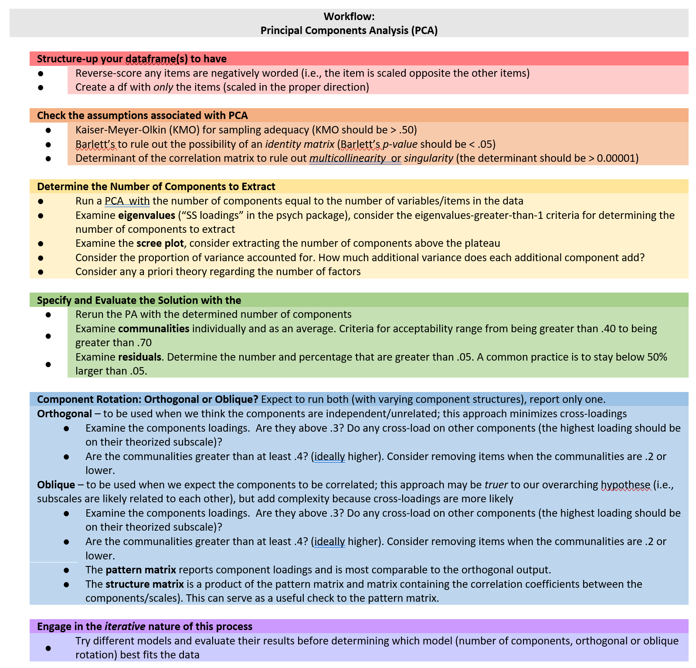
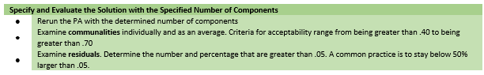
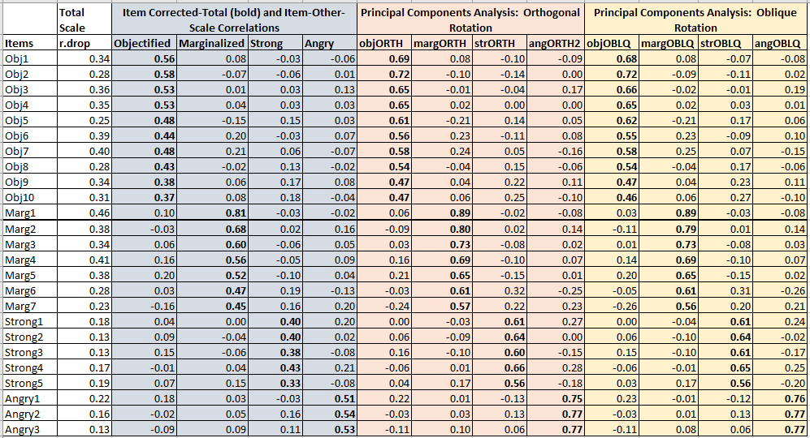

# EXPLORATORY *FACTOR* ANALYSIS {-}

The next two lessons are devoted to  exploratory *factor* analysis. The two approaches are principal components analysis (PCA) and principal axis factoring (PAF).  In truth, only PAF is considered *factor* analysis.  I will explain why in the lesson.

These approaches are loosely termed *exploratory* because the statistical process (not the researcher) produces the factor (think scale or subscale) and identifies which items belong to it.  This is contrasted with *confirmatory* approaches (which use structural equation modeling) where the researcher assigns items to factors and analyzes the goodness of fit. 

# Principal Components Analysis {#PCA}

[Screencasted Lecture Link](https://youtube.com/playlist?list=PLtz5cFLQl4KNzmApvhfVE7gNpZOQL1OVR&si=JYXzT9v4oNTbM8Rk)


In this lesson on principal components analysis (PCA) I provide an introduction to the exploratory factor analysis (EFA) arena.  We will review the theoretical and technical aspects of PCA, we will work through a research vignette, and then consider the relationship of PCA to item analysis and reliability coefficients.

Please note, although PCA is frequently grouped into EFA techniques, it is *exploratory* but it is not *factor analysis*.  We'll discuss the difference in the lecture.

## Navigating this Lesson

There are about two hours of lecture.  If you work through the materials with me, I would be plan for an additional hour-and-a-half.

While the majority of R objects and data you will need are created within the R script that sources the chapter, occasionally there are some that cannot be created from within the R framework. Additionally, sometimes links fail.  All original materials are provided at the [Github site](https://github.com/lhbikos/ReC_Psychometrics) that hosts the book. More detailed guidelines for ways to access all these materials are provided in the OER's [introduction](#ReCintro)

### Learning Objectives

Focusing on this week's materials, make sure you can:

* Distinguish between PCA and PAF on several levels:  
  - which path diagram represents each best, and
  - keywords associated with each:  factor loadings, linear components, describe versus explain.
* Recognize/define an identity matrix -- what test would you use to diagnose it?
* Recognize/define multicollinearity and singularity -- what test would you use to diagnose it?
* Describe the pattern of "loadings" (i.e., the relative weights of an item on its own scale compared to other scales)that supports the structure of the instrument.
* Compare the results from item analysis and PCA.

### Planning for Practice

In each of these lessons I provide suggestions for practice that allow you to select one or more problems that are graded in difficulty. The least complex is to change the random seed in the research and rework the problem demonstrated in the lesson. The results *should* map onto the ones obtained in the lecture. 

The second option involves utilizing one of the simulated datasets available in this OER. The [last lesson](#sims) in the OER contains three simulations that could be used for all of the statistics-based practice suggestions. Especially if you started with one of these examples in an earlier lesson, I highly recommend you continue with that.

Alternatively, Szymanski and Bissonette's [-@szymanski_perceptions_2020]Perceptions of the LGBTQ College Campus Climate Scale: Development and Psychometric Evaluation was used as the research vignette for the validity, reliability, and item analysis lesson. Keum et al.'s Gendered Racial Microaggressions Scale for Asian American Women [@keum_gendered_2018] will be used in the lessons on confirmatory factor analysis. Both of these would be suitable for the PCA and PAF homework assignments.

As a third option, you are welcome to use data to which you have access and is suitable for PCA. These could include other vignettes from this OER, other simualated data, or your own data (presuming you have permission to use it). In any case, please plan to:

* Properly format and prepare the data.
* Conduct diagnostic tests to determine the suitability of the data for PCA.
* Conducting tests to guide the decisions about number of components to extract.
* Conducting orthogonal and oblique extractions (at least two each with different numbers of components).
* Selecting one solution and preparing an APA style results section (with table and figure).
* Compare your results in light of any other psychometrics lessons where you have used this data.

### Readings & Resources

In preparing this chapter, I drew heavily from the following resource(s). Other resources are cited (when possible, linked) in the text with complete citations in the reference list.

* Revelle, William. (n.d.). Chapter 6: Constructs, components, and factor models. In *An introduction to psychometric theory with applications in R*. Retrieved from https://personality-project.org/r/book/#chapter6
  - pp. 145 to 150 (we'll continue with the rest in the next lecture).  Stop at "6.2  Exploratory Factor Analysis."
  - A simultaneously theoretical review of psychometric theory while working with R and data to understand the concepts.
* Revelle, W. (2019). *How To: Use the psych package for Factor Analysis and data reduction*.
  - pp. 13 throuh 24 provide technical information about what we are doing
* Dekay, Nicole (2021). Quick Reference Guide: The statistics for psychometrics  https://www.humanalysts.com/quick-reference-guide-the-statistics-for-psychometrics
* Lewis, J. A., & Neville, H. A. (2015). Construction and initial validation of the Gendered Racial Microaggressions Scale for Black Women. *Journal of Counseling Psychology, 62*(2), 289–302. https://doi.org/10.1037/cou0000062
  - Our research vignette for this lesson.

### Packages

The packages used in this lesson are embedded in this code. When the hashtags are removed, the script below will (a) check to see if the following packages are installed on your computer and, if not (b) install them.

```r
# will install the package if not already installed
# if(!require(psych)){install.packages('psych')}
# if(!require(tidyverse)){install.packages('tidyverse')}
# if(!require(MASS)){install.packages('MASS')}
# if(!require(sjstats)){install.packages('sjstats')}
# if(!require(apaTables)){install.packages('apaTables')}
# if(!require(qualtRics)){install.packages('qualtRics')}
```

## Exploratory Principal Components Analysis

The psychometric version of *parsimony* is seen in our attempt to *describe* (components) or to *explain* (factors) in the relationships between many observed variables in terms of a more limited set of components, latent factors, or dimensions.

That is, we are trying to: 

* understand the structure of a set of variables,
* construct a questionnaire to measure an underlying latent variable, and
* reduce a data set to a more manageable size (e.g., representing bundles of items as subscale scores) while retaining as much of the information as possible

### Some Framing Ideas (in very lay terms)

*Exploratory* versus *confirmatory* factor analysis.  

* Both exploratory and confirmatory approaches to components/factor analysis are used in scale construction. Think of "scales" as being interchangeable with "factors" and "components."
  +  That said,  "factors" and "components" are not interchangeable terms.

* **Exploratory**: Even though we may have an a priori model in mind, we *explore* the structure of the items by using diagnostics (KMO, Barlett's, determinant), factor extraction, and rotation to determine the number of scales (i.e., components or factors) that exist within the raw data or correlation matrix. The algorithms (including matrix algebra) determine the relationship of each item to its respective scales (i.e., components or factors).

* **Confirmatory**: Starting with an a priori theory, we specify the structure (i.e., number and levels of factors) and which items belong to factors.  We use structural equation modeling as the framework. We evaluate the quality of the model with a number of fit indices.

Within the *exploratory* category we will focus on two further distinctions (there are even more). The first is principal components analysis (PCA). The second is principal axis factoring (PAF). PAF is one of the approaches that is commonly termed "exploratory factor analysis" (EFA).  In this first lesson we focus on the differences between PCA and EFA.

* **Option #1/Component model**:  PCA approximates the correlation matrix in terms of the product of components where each is a weighted linear sum of the variables. In the figure below, note how the arrows in the components analysis (a *path* model) point from variables to the component. Perhaps an oversimplification, think of each of these as a predictor variable contributing to an outcome.

* **Option #2/Factor model**:  EFA (and in the next lesson, PAF/principal axis factoring) approximates the correlation matrix by the product of the two factors; this approach presumes that the factors are the causes (rather than as consequences). In the figure below, note how the arrows in the factor analysis model (a *structural* model) point from latent variable (or factor) to the observed variables (items). Factor analysis has been termed *causal modeling* because the latent variables are theorized to cause the responses to the individual items. There are other popular approaches, including parallel analysis (which is what the authors used in this lesson's research vignette).

Well-crafted figures provide important clues to the analyses. In structural models, rectangles and squares indicate the presence of *observed* (also called *manifest*) variables.  These are variables that have a column in the dataset. In our particular case, they are the responses to the 25 items in the GRMS.

Circles or ovals represent latent variables or factors. These were never raw data, but are composed of the relations of variables that were collected. They are more complex than mean or sum scores. Rather, they represent what the variables that represent them share in common.


Our focus today is on the principal component analysis (PCA) approach to scale construction.

## PCA Workflow

Below is a screenshot of the workflow. The original document is located in the [Github site](https://github.com/lhbikos/ReC_Psychometrics) that hosts the ReCentering Psych Stats:  Psychometrics OER.



Steps in the process include:

* Creating an *items only* dataframe where any items are scaled in the same direction (e.g., negatively worded items are reverse-scored).
* Conducting tests that assess the statistical assumptions of PCA to ensure that the data is appropriate for PCA.
* Determining the number of components (think "subscales") to extract. 
* Conducting the component extraction -- this process will likely occur iteratively,
  - exploring orthogonal (uncorrelated/independent) and oblique (correlated)components, and
  - changing the number of components to extract

Because the intended audience for the ReCentering Psych Stats OER is the scientist-practitioner-advocate, this lesson focuses on the workflow and decisions. As you might guess, the details of PCA can be quite complex. Some important notions to consider that may not be obvious from lesson, are these:

* The values of component loadings are directly related to the correlation (similarly, the covariance) matrix between the items.
  - Although I do not explain this in detail, nearly every analytic step attempts to convey this notion by presenting equivalent analytic options using the raw data and correlation matrix.
* PCA is about *dimension reduction* -- our goal is fewer components (i.e., subscales) than there are items.
  - In this lesson's vignette there are 25 items on the scale and we will end up with 4 subscales.
* Principal component analysis is *exploratory*, but it is not "factor analysis."
* Matrix algebra (e.g., using the transpose of a matrix, multiplying matrices together) plays a critical role in the analytic solution.

## Research Vignette

This lesson's research vignette emerges from Lewis and Neville's Gendered Racial Microaggressions Scale for Black Women [-@lewis_construction_2015]. The article reports on two separate studies that comprised the development, refinement, and psychometric evaluation of two parallel versions (stress appraisal, frequency) of the scale. Below, I simulate data from the final construction of the stress appraisal version as the basis of the lecture. Items were on a 6-point Likert scale ranging from 0 (*not at all stressful*) to 5 (*extremely stressful*).

Lewis and Neville [-@lewis_construction_2015] reported support for a total scale score (25 items) and four subscales.  Below, I list the four subscales along with the items and their abbreviation. At the outset, let me provide a content advisory. For those who hold this particular identity (or related identities) the content in the items may be upsetting. In other lessons, I often provide a variable name that gives an indication of the primary content of the item. In the case of the GRMS, I will simply provide an abbreviation of the subscale name and its respective item number. This will allow us to easily inspect the alignment of the item with its intended factor, and hopefully minimize discomfort. 

If you are not a member of this particular identity, I encourage you to learn about these microaggressions by reading the article in its entirety. Please do not ask members of this group to explain why these microaggressions are harmful or ask if they have encountered them.  The four factors, number of items, and sample item are as follows:

* Assumptions of Beauty and Sexual Objectification (10 items)
  - Unattractive because of size of butt (Obj1)
  - Negative comments about size of facial features (Obj2)
  - Imitated the way they think Black women speak (Obj3)
  - Someone made me feel unattractive (Obj4)
  - Negative comment about skin tone (Obj5)
  - Someone assumed I speak a certain way (Obj6)
  - Objectified me based on physical features(Obj7)
  - Someone assumed I have a certain body type (Obj8; stress only)
  - Made a sexually inappropriate comment (Obj9)
  - Negative comments about my hair when natural (Obj10)
  - Assumed I was sexually promiscuous (frequency only; not used in this simulation)
* Silenced and Marginalized (7 items)
  - I have felt unheard (Marg1)
  - My comments have been ignored (Marg2)
  - Someone challenged my authority (Marg3)
  - I have been disrespected in workplace (Marg4)
  - Someone has tried to “put me in my place” (Marg5)
  - Felt excluded from networking opportunities (Marg6)
  - Assumed I did not have much to contribute to the conversation (Marg7)
* Strong Black Woman Stereotype (5 items)
  - Someone assumed I was sassy and straightforward (Str1; stress only)
  - I have been told that I am too independent (Str2)
  - Someone made me feel exotic as a Black woman (Str2; stress only)
  - I have been told that I am too assertive
  - Assumed to be a strong Black woman
* Angry Black Woman Stereotype (3 items)
  - Someone has told me to calm down (Ang1)
  - Perceived to be “angry Black woman" (Ang2)
  - Someone accused me of being angry when speaking calm (Ang3)

Three additional scales were reported in the Lewis and Neville article [-@lewis_construction_2015]. 
Because (a) the focus of this lesson is on exploratory factor analytic approaches and, therefore, only requires item-level data for the scale, and (b) the article does not include correlations between the subscales/scales of all involved measures, I only simulated item-level data for the GRMS items.

Below, I walk through the data simulation. This is not an essential portion of the lesson, but I will lecture it in case you are interested. None of the items are negatively worded (relative to the other items), so there is no need to reverse-score any items.

Simulating the data involved using factor loadings, means, standard deviations, and correlations between the scales. Because the simulation will produce "out-of-bounds" values, the code below rescales the scores into the range of the Likert-type scaling and rounds them to whole values.


```r
# Entering the intercorrelations, means, and standard deviations from
# the journal article

LewisGRMS_generating_model <- "
        #measurement model
        Objectification =~ .69*Obj1 + .69*Obj2 + .60*Obj3 + .59*Obj4 + .55*Obj5 + .55*Obj6 + .54*Obj7 + .50*Obj8 + .41*Obj9 + .41*Obj10
        Marginalized =~ .93*Marg1 + .81*Marg2 +.69*Marg3 + .67*Marg4 + .61*Marg5 + .58*Marg6 +.54*Marg7
        Strong =~ .59*Str1 + .55*Str2 + .54*Str3 + .54*Str4 + .51*Str5
        Angry =~ .70*Ang1 + .69*Ang2 + .68*Ang3
        
        #Means
         Objectification ~ 1.85*1
         Marginalized ~ 2.67*1
         Strong ~ 1.61*1
         Angry ~ 2.29*1
         
        #Correlations
         Objectification ~~ .63*Marginalized
         Objectification ~~ .66*Strong
         Objectification ~~ .51*Angry
         
         Marginalized ~~ .59*Strong
         Marginalized ~~ .62*Angry

         Strong ~~ .61*Angry
 
        "

set.seed(240311)
dfGRMS <- lavaan::simulateData(model = LewisGRMS_generating_model, model.type = "sem",
    meanstructure = T, sample.nobs = 259, standardized = FALSE)

# used to retrieve column indices used in the rescaling script below
col_index <- as.data.frame(colnames(dfGRMS))

# The code below loops through each column of the dataframe and
# assigns the scaling accordingly Rows 1 thru 26 are the GRMS items

for (i in 1:ncol(dfGRMS)) {
    if (i >= 1 & i <= 25) {
        dfGRMS[, i] <- scales::rescale(dfGRMS[, i], c(0, 5))
    }
}

# rounding to integers so that the data resembles that which was
# collected
library(tidyverse)
dfGRMS <- dfGRMS %>%
    round(0)

# quick check of my work psych::describe(dfGRMS)
```

The optional script below will let you save the simulated data to your computing environment as either an .rds object (preserves any formatting you might do) or a .csv file (think "Excel lite"). 

An .rds file preserves all formatting to variables prior to the export and re-import.  For the purpose of this chapter, you don't need to do either. That is, you can re-simulate the data each time you work the problem.

```r
# to save the df as an .rds (think 'R object') file on your computer;
# it should save in the same file as the .rmd file you are working
# with saveRDS(dfGRMS, 'dfGRMS.rds') bring back the simulated dat
# from an .rds file dfGRMS <- readRDS('dfGRMS.rds')
```

If you save the .csv file and bring it back in, you will lose any formatting (e.g., ordered factors will be interpreted as character variables).

```r
# write the simulated data as a .csv write.table(dfGRMS,
# file='dfGRMS.csv', sep=',', col.names=TRUE, row.names=FALSE) bring
# back the simulated dat from a .csv file dfGRMS <- read.csv
# ('dfGRMS.csv', header = TRUE)
```

Before moving on, I want to acknowledge that (at their first drafting), I try to select research vignettes that have been published within the prior 5 years. With a publication date of 2015, this article clearly falls outside that range. I have continued to include it because (a) the scholarship is superior -- especially as the measure captures an intersectional identity, (b) the article has been a model for research that follows (e.g., Keum et al's [-@keum_gendered_2018] Gendered Racial Microaggression Scale for Asian American Women), and (c) there is often a time lag between the initial publication of a psychometric scale and it's use. A key reason I have retained the GRMS as a psychometrics research vignette is that in [ReCentering Psych Stats: Multivariate Modeling](https://lhbikos.github.io/ReC_MultivModel/), GRMS scales are used in a couple of more recently published research vignettes.

## Working the Vignette

Below we will create a correlation matrix of our items. Whether we are conducting PCA or PAF, the *dimension-reduction* we are looking for clusters of correlated items in the $R$-matrix. Essentially, these are [@field_discovering_2012]:  

* Statistical entities that can be plotted as classification axes where coordinates of variables along each axis represent the strength of the relationship between that variable to each component (later, factor).
* Mathematical equations, resembling regression equations, where each variable is represented according to its relative weight.

PCA in particular establishes which linear components exist within the data and how a particular variable might contribute to that component.

Below is the correlation matrix of our items. I have saved it as an object so that I can show you that PCA (and later, PAF) can also be conducted with just correlation data.  It would be quite a daunting exercise to visually inspect this and manually cluster the correlations of items.


```r
GRMSmatrix <- cor(dfGRMS)  #correlation matrix created and saved as object
round(GRMSmatrix, 2)
```

```
      Obj1 Obj2 Obj3 Obj4 Obj5 Obj6 Obj7  Obj8 Obj9 Obj10 Marg1 Marg2 Marg3
Obj1  1.00 0.35 0.25 0.27 0.28 0.25 0.28  0.35 0.15  0.24  0.19  0.25  0.17
Obj2  0.35 1.00 0.31 0.25 0.27 0.23 0.31  0.28 0.26  0.24  0.22  0.21  0.25
Obj3  0.25 0.31 1.00 0.24 0.28 0.28 0.20  0.25 0.21  0.22  0.17  0.23  0.17
Obj4  0.27 0.25 0.24 1.00 0.39 0.23 0.28  0.30 0.26  0.28  0.22  0.18  0.14
Obj5  0.28 0.27 0.28 0.39 1.00 0.15 0.18  0.29 0.25  0.20  0.17  0.20  0.23
Obj6  0.25 0.23 0.28 0.23 0.15 1.00 0.20  0.14 0.21  0.12  0.10  0.14  0.05
Obj7  0.28 0.31 0.20 0.28 0.18 0.20 1.00  0.31 0.19  0.28  0.30  0.21  0.20
Obj8  0.35 0.28 0.25 0.30 0.29 0.14 0.31  1.00 0.19  0.23  0.27  0.14  0.14
Obj9  0.15 0.26 0.21 0.26 0.25 0.21 0.19  0.19 1.00  0.20  0.10  0.12  0.21
Obj10 0.24 0.24 0.22 0.28 0.20 0.12 0.28  0.23 0.20  1.00  0.09  0.12  0.17
Marg1 0.19 0.22 0.17 0.22 0.17 0.10 0.30  0.27 0.10  0.09  1.00  0.43  0.41
Marg2 0.25 0.21 0.23 0.18 0.20 0.14 0.21  0.14 0.12  0.12  0.43  1.00  0.35
Marg3 0.17 0.25 0.17 0.14 0.23 0.05 0.20  0.14 0.21  0.17  0.41  0.35  1.00
Marg4 0.19 0.18 0.24 0.26 0.20 0.10 0.25  0.24 0.07  0.12  0.38  0.23  0.32
Marg5 0.17 0.22 0.21 0.27 0.25 0.16 0.23  0.19 0.19  0.11  0.41  0.40  0.25
Marg6 0.18 0.27 0.16 0.23 0.22 0.26 0.28  0.26 0.15  0.26  0.35  0.27  0.25
Marg7 0.13 0.19 0.14 0.19 0.06 0.17 0.16  0.14 0.10  0.11  0.31  0.33  0.20
Str1  0.22 0.18 0.14 0.06 0.23 0.07 0.25  0.17 0.19  0.10  0.19  0.25  0.20
Str2  0.19 0.18 0.19 0.19 0.12 0.15 0.13  0.06 0.18  0.19  0.12  0.18  0.17
Str3  0.10 0.09 0.09 0.08 0.11 0.09 0.19  0.05 0.12  0.10  0.13  0.18  0.10
Str4  0.09 0.14 0.18 0.15 0.12 0.08 0.07  0.13 0.05  0.02  0.08  0.12  0.08
Str5  0.20 0.15 0.15 0.08 0.19 0.11 0.15  0.04 0.07  0.09  0.10  0.23  0.12
Ang1  0.06 0.07 0.07 0.09 0.12 0.04 0.15  0.07 0.17  0.06  0.16  0.23  0.18
Ang2  0.06 0.15 0.08 0.06 0.09 0.20 0.13 -0.03 0.00  0.14  0.17  0.19  0.19
Ang3  0.21 0.13 0.11 0.14 0.11 0.16 0.23  0.07 0.06  0.08  0.28  0.28  0.11
      Marg4 Marg5 Marg6 Marg7 Str1 Str2 Str3 Str4 Str5 Ang1  Ang2 Ang3
Obj1   0.19  0.17  0.18  0.13 0.22 0.19 0.10 0.09 0.20 0.06  0.06 0.21
Obj2   0.18  0.22  0.27  0.19 0.18 0.18 0.09 0.14 0.15 0.07  0.15 0.13
Obj3   0.24  0.21  0.16  0.14 0.14 0.19 0.09 0.18 0.15 0.07  0.08 0.11
Obj4   0.26  0.27  0.23  0.19 0.06 0.19 0.08 0.15 0.08 0.09  0.06 0.14
Obj5   0.20  0.25  0.22  0.06 0.23 0.12 0.11 0.12 0.19 0.12  0.09 0.11
Obj6   0.10  0.16  0.26  0.17 0.07 0.15 0.09 0.08 0.11 0.04  0.20 0.16
Obj7   0.25  0.23  0.28  0.16 0.25 0.13 0.19 0.07 0.15 0.15  0.13 0.23
Obj8   0.24  0.19  0.26  0.14 0.17 0.06 0.05 0.13 0.04 0.07 -0.03 0.07
Obj9   0.07  0.19  0.15  0.10 0.19 0.18 0.12 0.05 0.07 0.17  0.00 0.06
Obj10  0.12  0.11  0.26  0.11 0.10 0.19 0.10 0.02 0.09 0.06  0.14 0.08
Marg1  0.38  0.41  0.35  0.31 0.19 0.12 0.13 0.08 0.10 0.16  0.17 0.28
Marg2  0.23  0.40  0.27  0.33 0.25 0.18 0.18 0.12 0.23 0.23  0.19 0.28
Marg3  0.32  0.25  0.25  0.20 0.20 0.17 0.10 0.08 0.12 0.18  0.19 0.11
Marg4  1.00  0.30  0.26  0.16 0.10 0.21 0.05 0.06 0.03 0.12  0.22 0.17
Marg5  0.30  1.00  0.29  0.28 0.16 0.13 0.16 0.14 0.18 0.12  0.14 0.21
Marg6  0.26  0.29  1.00  0.20 0.13 0.18 0.15 0.13 0.08 0.11  0.21 0.12
Marg7  0.16  0.28  0.20  1.00 0.14 0.05 0.04 0.02 0.12 0.17  0.13 0.09
Str1   0.10  0.16  0.13  0.14 1.00 0.21 0.30 0.23 0.23 0.18  0.05 0.10
Str2   0.21  0.13  0.18  0.05 0.21 1.00 0.20 0.20 0.12 0.16  0.12 0.16
Str3   0.05  0.16  0.15  0.04 0.30 0.20 1.00 0.27 0.18 0.20  0.07 0.15
Str4   0.06  0.14  0.13  0.02 0.23 0.20 0.27 1.00 0.12 0.15  0.03 0.02
Str5   0.03  0.18  0.08  0.12 0.23 0.12 0.18 0.12 1.00 0.22  0.15 0.11
Ang1   0.12  0.12  0.11  0.17 0.18 0.16 0.20 0.15 0.22 1.00  0.24 0.23
Ang2   0.22  0.14  0.21  0.13 0.05 0.12 0.07 0.03 0.15 0.24  1.00 0.25
Ang3   0.17  0.21  0.12  0.09 0.10 0.16 0.15 0.02 0.11 0.23  0.25 1.00
```

This correlation matrix is so big that you might wish to write code so that you can examine it in sections 


```r
# round(GRMSmatrix[,1:8], 2) round(GRMSmatrix[,9:16], 2)
# round(GRMSmatrix[,17:25], 2)
```

With component and factor analytic procedures we can analyze the data with either raw data or correlation matrix.  Using the correlation matrix helps us perceive how this is a *structural* analysis. That is, we are trying to see if our more parsimonious extraction (i.e., our *dimension reduction*) reproduces this original correlation matrix. In each of the analyses I will include code for running the analyses with raw data and the *r*-matrix.

### Three Diagnostic Tests to Evaluate the Appropriateness of the Data for Component-or-Factor Analysis

Below is a snip from the workflow to remind us where we are in the steps to PCA.


#### Is my sample adequate for PCA?

There have been a number of generic guidelines (some supported with empirical evidence, some not) about "how big" the sample size should be:

* 10-15 participants per variable
* 10 times as many participants as variables (Nunnally, 1978)
* 5 and 10 participants per variable up to 300 (Kass & Tinsley, 1979)
* 300 (Tabachnick & Fidell, 2007)
* 1000 = excellent, 300 = good, 100 = poor (Comrey & Lee, 1992)

Of course it is more complicated.  Monte Carlo studies have shown that: 

* if factor loadings are large (~.6), the solution is reliable regardless of size
* if communalities are large (~.6), relatively small samples (~100) are sufficient, but when they are lower (well below .5), then larger samples (>500 are indicated).

The **Kaiser-Meyer-Olkin** index (KMO) is an index of *sampling adequacy* that can  be used with the actual sample to let us know if the sample size is sufficient relative to the statistical characteristics of the data. If the KMO is below the recommendations, we should probably collect more data to see if it can achieve a satisfactory value.

Kaiser's 1974 recommendations were:

* bare minimum of .5
* values between .5 and .7 as mediocre
* values between .7 and .8 as good
* values above .9 are superb

Revelle has included a KMO test in the psych package.  The function can use either raw or matrix data. Either way, the only variables in the matrix should be the items of interest. This means that everything else (e.g., total or subscale scores, ID numbers) should be removed.


```r
psych::KMO(dfGRMS)
```

```
Kaiser-Meyer-Olkin factor adequacy
Call: psych::KMO(r = dfGRMS)
Overall MSA =  0.85
MSA for each item = 
 Obj1  Obj2  Obj3  Obj4  Obj5  Obj6  Obj7  Obj8  Obj9 Obj10 Marg1 Marg2 Marg3 
 0.87  0.91  0.88  0.85  0.85  0.80  0.90  0.85  0.81  0.85  0.86  0.89  0.86 
Marg4 Marg5 Marg6 Marg7  Str1  Str2  Str3  Str4  Str5  Ang1  Ang2  Ang3 
 0.86  0.90  0.89  0.84  0.83  0.85  0.82  0.74  0.84  0.78  0.76  0.81 
```

```r
# psych::KMO(GRMSmatrix)
```

We examine the KMO values for both the overall matrix and the individual items.

At the matrix level, our $KMO = .85$, which falls into Kaiser's definition of *good*. You can locate this value as the "Overall MSA." 

At the item level, the KMO should be > .50.  Variables with values below .50 should be evaluated for exclusion from the analysis (or run the analysis with and without the variable and compare the difference).  Because removing and adding variables impacts the KMO, be sure to re-evaluate the sampling adequacy if changes are made to the items (and/or sample size).

At the item level, our KMO values range between .74 (Str4) and .91 (Obj2).  

Considering both item and matrix levels, we conclude that the sample size and the data are adequate for component (or factor) analysis.

#### Are the correlations among the variables large enough to be analyzed?

**Bartlett's test** lets us know if a matrix is an *identity matrix.* In an identity matrix all correlation coefficients (everything on the off-diagonal) would be 0.0 (and everything on the diagonal would be 1.0.  

A significant Barlett's (i.e., $p < .05$) tells that the $R$-matrix is not an identity matrix.  That is, there are some relationships between variables that can be analyzed.

The *cortest.bartlett()* function is in the *psych* package and can be run either from the raw data or R matrix formats.


```r
psych::cortest.bartlett(dfGRMS)  #from the raw data
```

```
R was not square, finding R from data
```

```
$chisq
[1] 1217.508

$p.value
[1] 0.00000000000000000000000000000000000000000000000000000000000000000000000000000000000000000000000000000000000001107085

$df
[1] 300
```

```r
# raw data produces the warning 'R was not square, finding R from
# data.' This means nothing other than we fed it raw data and the
# function is creating a matrix from which to do the analysis.

# psych::cortest.bartlett(GRMSmatrix, n = 259) #if using the matrix,
# must specify sample
```
Our Bartlett's test is significant:  $\chi^{2}(300)=1217.508, p < .001$. This means that our sample correlation matrix is statistically significantly different than an identity matrix and, therefore, supports a component-or-factor analytic approach for investigating the data.

#### Is there multicollinearity or singularity in my data?

The **determinant of the correlation matrix** should be greater than 0.00001 (that would be 4 zeros, then the 1).  If it is smaller than 0.00001 then we may have an issue with *multicollinearity* (i.e., variables that are too highly correlated) or *singularity* (variables that are perfectly correlated).

The determinant function we use comes from base R.  It is easiest to compute when the correlation matrix is the object.  However, it is also possible to specify the command to work with the raw data.


```r
det(GRMSmatrix)
```

```
[1] 0.007499909
```

```r
# det(cor(dfGRMS))#if using the raw data
```

With a value of 0.0075, our determinant is greater than the 0.00001 requirement.  If it were not, then we could identify problematic variables (i.e., those correlating too highly with others; those not correlating sufficiently with others) and re-run the diagnostic statistics.

#### APA Style Summary So Far

>Data screening were conducted to determine the suitability of the data for this analyses. The Kaiser-Meyer-Olkin measure of sampling adequacy (KMO; Kaiser, 1970) represents the ratio of the squared correlation between variables to the squared partial correlation between variables. KMO ranges from 0.00 to 1.00; values closer to 1.00 indicate that the patterns of correlations are relatively compact and that component analysis should yield distinct and reliable components (Field, 2012). In our dataset, the KMO value was .85, indicating acceptable sampling adequacy. The Barlett’s Test of Sphericity examines whether the population correlation matrix resembles an identity matrix (Field, 2012). When the *p* value for the Bartlett’s test is < .05, we are fairly certain we have clusters of correlated variables. In our dataset, $\chi^{2}(300)=1217.508, p < .001$, indicating the correlations between items are sufficiently large enough for principal components analysis. The determinant of the correlation matrix alerts us to any issues of multicollinearity or singularity and should be larger than 0.00001. Our determinant was 0.0075, supporting the suitability of our data for analysis.

### Principal Components Analysis

Below is a snip from the workflow to remind us where we are in the steps to PCA.


We can use the *principal()* function from the *psych* package with raw or matrix data.

We start by creating a principal components model that has the same number of components as there are variables in the data. This allows us to inspect the component's eigenvalues and make decisions about which to extract.

* Note, this is different than actual *factor* analysis where you *must* extract fewer factors than variables (e.g., extracting 18 [an arbitray number] instead of 25).


```r
# All of the code sets below are functionally identical. They simply
# swap out using the df or r-matrix, and whether I specify the number
# of factors or write code to instruct R to calculate it.

# pca1 <- psych::principal(GRMSmatrix, nfactors=25, rotate = 'none')
# #using the matrix form of the data and specifying the # factors

# pca1 <- psych::principal(GRMSmatrix,
# nfactors=length(GRMSmatrix[,1]), rotate = 'none') #using the matrix
# form of the data and letting the length function automatically
# calculate the # factors as a function of how many columns in the
# matrix

# pca1 <- psych::principal(dfGRMS, nfactors=25, rotate='none') #using
# raw data and specifying # factors

pca1 <- psych::principal(dfGRMS, nfactors = length(dfGRMS), rotate = "none")  # using raw data and letting the length function automatically calculate the # factors as a function of how many columns in the raw data
pca1
```

```
Principal Components Analysis
Call: psych::principal(r = dfGRMS, nfactors = length(dfGRMS), rotate = "none")
Standardized loadings (pattern matrix) based upon correlation matrix
       PC1   PC2   PC3   PC4   PC5   PC6   PC7   PC8   PC9  PC10  PC11  PC12
Obj1  0.52 -0.29  0.06  0.08 -0.23 -0.12 -0.33 -0.15 -0.19 -0.18  0.04  0.09
Obj2  0.55 -0.28  0.00  0.07 -0.11  0.00  0.03  0.09 -0.28 -0.12  0.14 -0.16
Obj3  0.49 -0.26  0.06  0.06 -0.04  0.32  0.06 -0.24 -0.17 -0.13  0.15  0.01
Obj4  0.52 -0.35 -0.09  0.02  0.08  0.09  0.04 -0.15  0.40  0.18 -0.08  0.28
Obj5  0.51 -0.29  0.09 -0.12 -0.08 -0.04  0.14 -0.42  0.11  0.27 -0.23 -0.20
Obj6  0.40 -0.20  0.01  0.47 -0.14  0.44 -0.03  0.22  0.05 -0.12  0.00 -0.24
Obj7  0.56 -0.11 -0.03  0.06  0.02 -0.33 -0.28  0.26  0.07  0.01  0.04 -0.06
Obj8  0.48 -0.40 -0.13 -0.25  0.00 -0.14 -0.26  0.01  0.07  0.14  0.33 -0.05
Obj9  0.40 -0.28  0.16 -0.04 -0.07 -0.11  0.53  0.12  0.33 -0.29  0.00 -0.23
Obj10 0.42 -0.32  0.00  0.23  0.12 -0.35  0.14  0.21 -0.13  0.19 -0.18  0.39
Marg1 0.58  0.31 -0.36 -0.26  0.06 -0.02 -0.13  0.05  0.04 -0.06 -0.01 -0.07
Marg2 0.58  0.38 -0.08 -0.13 -0.21  0.09 -0.02 -0.03 -0.04 -0.13 -0.14  0.14
Marg3 0.51  0.23 -0.18 -0.23  0.11 -0.18  0.36 -0.08 -0.28 -0.10 -0.02 -0.16
Marg4 0.50  0.10 -0.35 -0.07  0.38  0.01 -0.05 -0.28 -0.10 -0.01  0.11  0.02
Marg5 0.56  0.19 -0.19 -0.20 -0.08  0.27 -0.01 -0.03  0.20  0.03 -0.31  0.01
Marg6 0.54 -0.01 -0.19  0.05  0.24  0.09  0.00  0.37 -0.09  0.27 -0.16 -0.17
Marg7 0.41  0.21 -0.27 -0.08 -0.38  0.20  0.16  0.34  0.04  0.01  0.25  0.36
Str1  0.43  0.12  0.45 -0.30 -0.11 -0.19 -0.06  0.11 -0.16 -0.13  0.00 -0.12
Str2  0.40  0.03  0.31  0.15  0.43  0.07  0.15 -0.05 -0.13 -0.37 -0.07  0.37
Str3  0.33  0.22  0.54 -0.08  0.17  0.00 -0.18  0.26  0.15  0.04 -0.22 -0.07
Str4  0.29  0.03  0.48 -0.23  0.31  0.41 -0.14 -0.01 -0.02  0.21  0.26  0.02
Str5  0.34  0.20  0.37  0.10 -0.46 -0.01  0.01 -0.19 -0.23  0.28 -0.16  0.11
Ang1  0.35  0.40  0.27  0.14 -0.04 -0.23  0.22 -0.10  0.30  0.17  0.47  0.04
Ang2  0.33  0.37 -0.10  0.57  0.13 -0.02  0.11 -0.06 -0.18  0.28  0.07 -0.19
Ang3  0.38  0.31 -0.04  0.37  0.00 -0.16 -0.35 -0.21  0.32 -0.29 -0.05 -0.05
       PC13  PC14  PC15  PC16  PC17  PC18  PC19  PC20  PC21  PC22  PC23  PC24
Obj1  -0.30 -0.09  0.04 -0.02  0.24  0.14  0.20 -0.19  0.14 -0.06  0.14 -0.24
Obj2   0.03 -0.28 -0.38  0.25 -0.05  0.21 -0.27 -0.01 -0.01  0.00 -0.22  0.07
Obj3   0.54  0.01  0.22 -0.15 -0.08 -0.03 -0.15  0.01  0.00 -0.03  0.11 -0.18
Obj4  -0.10  0.06 -0.10  0.23  0.18 -0.19 -0.08  0.02 -0.12 -0.17 -0.10 -0.09
Obj5  -0.14 -0.02  0.21  0.15 -0.07  0.00 -0.22 -0.03  0.03  0.18  0.09  0.05
Obj6  -0.12  0.20  0.15 -0.08  0.17 -0.15  0.10 -0.01  0.00  0.18 -0.23  0.10
Obj7   0.25  0.25 -0.26  0.05 -0.01 -0.29 -0.06 -0.23 -0.08  0.11  0.20  0.02
Obj8  -0.09  0.01  0.12 -0.22 -0.11  0.19  0.13  0.19 -0.29  0.07  0.03  0.19
Obj9   0.03  0.01 -0.11 -0.08 -0.04  0.06  0.21  0.07  0.02 -0.26  0.11  0.00
Obj10  0.22 -0.21  0.18 -0.03 -0.04 -0.02  0.20  0.06  0.12  0.07 -0.19  0.03
Marg1  0.00 -0.03 -0.02 -0.09  0.06 -0.09 -0.05  0.26 -0.12 -0.02 -0.20 -0.35
Marg2  0.00 -0.22  0.16 -0.11 -0.02 -0.10 -0.02 -0.33 -0.24 -0.23 -0.07  0.24
Marg3 -0.01 -0.10  0.01 -0.01  0.37 -0.19  0.07  0.08  0.01  0.21  0.10  0.09
Marg4  0.08  0.41 -0.02  0.05  0.06  0.17  0.06 -0.07  0.25 -0.18 -0.12  0.19
Marg5  0.11 -0.02 -0.22  0.00 -0.23  0.22  0.28 -0.14  0.05  0.27 -0.01 -0.08
Marg6 -0.24 -0.08  0.04 -0.30 -0.15 -0.02 -0.22 -0.04  0.21 -0.16  0.13 -0.05
Marg7 -0.06  0.08  0.12  0.25  0.02  0.09 -0.10  0.14  0.12  0.05  0.21  0.06
Str1  -0.10  0.23  0.25  0.27 -0.31 -0.16  0.07  0.02  0.08 -0.05 -0.15 -0.07
Str2  -0.26  0.13 -0.10 -0.10 -0.16  0.04 -0.12  0.05 -0.18  0.15  0.08 -0.01
Str3   0.19  0.04  0.14  0.07  0.35  0.36 -0.11  0.04 -0.07 -0.02  0.03  0.02
Str4   0.00 -0.28 -0.14  0.08  0.02 -0.22  0.21  0.03  0.11 -0.03  0.06  0.06
Str5   0.01  0.22 -0.30 -0.26  0.04 -0.04  0.01  0.24  0.02 -0.09 -0.01  0.07
Ang1  -0.05 -0.03  0.01 -0.20  0.02  0.07 -0.11 -0.22  0.09  0.13 -0.16 -0.10
Ang2  -0.02 -0.01  0.06  0.27 -0.10  0.10  0.20  0.02 -0.26 -0.10  0.13 -0.10
Ang3   0.04 -0.24  0.04  0.03 -0.11 -0.08 -0.05  0.26  0.19  0.00  0.08  0.15
       PC25 h2                   u2  com
Obj1   0.02  1 -0.00000000000000044  8.5
Obj2  -0.02  1 -0.00000000000000178  6.8
Obj3  -0.11  1  0.00000000000000056  6.0
Obj4  -0.26  1  0.00000000000000078  7.4
Obj5   0.26  1  0.00000000000000000  7.9
Obj6   0.05  1  0.00000000000000067  7.8
Obj7   0.11  1 -0.00000000000000022  7.0
Obj8  -0.10  1 -0.00000000000000089  8.8
Obj9   0.12  1  0.00000000000000022  6.9
Obj10  0.09  1  0.00000000000000289 10.6
Marg1  0.25  1  0.00000000000000011  5.8
Marg2  0.07  1  0.00000000000000022  6.2
Marg3 -0.21  1  0.00000000000000000  8.0
Marg4  0.09  1  0.00000000000000044  7.2
Marg5 -0.13  1 -0.00000000000000022  7.2
Marg6 -0.13  1  0.00000000000000078  7.5
Marg7  0.08  1 -0.00000000000000178 10.2
Str1  -0.17  1  0.00000000000000122  9.1
Str2   0.05  1  0.00000000000000133  8.8
Str3  -0.01  1  0.00000000000000000  7.1
Str4   0.13  1  0.00000000000000056  8.4
Str5   0.00  1  0.00000000000000100  9.2
Ang1  -0.04  1  0.00000000000000067  8.7
Ang2  -0.01  1  0.00000000000000022  6.5
Ang3  -0.08  1  0.00000000000000056 10.3

                       PC1  PC2  PC3  PC4  PC5  PC6  PC7  PC8  PC9 PC10 PC11
SS loadings           5.37 1.71 1.54 1.22 1.08 1.04 1.02 0.98 0.95 0.90 0.84
Proportion Var        0.21 0.07 0.06 0.05 0.04 0.04 0.04 0.04 0.04 0.04 0.03
Cumulative Var        0.21 0.28 0.34 0.39 0.44 0.48 0.52 0.56 0.60 0.63 0.67
Proportion Explained  0.21 0.07 0.06 0.05 0.04 0.04 0.04 0.04 0.04 0.04 0.03
Cumulative Proportion 0.21 0.28 0.34 0.39 0.44 0.48 0.52 0.56 0.60 0.63 0.67
                      PC12 PC13 PC14 PC15 PC16 PC17 PC18 PC19 PC20 PC21 PC22
SS loadings           0.83 0.75 0.73 0.69 0.68 0.64 0.61 0.58 0.55 0.51 0.48
Proportion Var        0.03 0.03 0.03 0.03 0.03 0.03 0.02 0.02 0.02 0.02 0.02
Cumulative Var        0.70 0.73 0.76 0.79 0.81 0.84 0.86 0.89 0.91 0.93 0.95
Proportion Explained  0.03 0.03 0.03 0.03 0.03 0.03 0.02 0.02 0.02 0.02 0.02
Cumulative Proportion 0.70 0.73 0.76 0.79 0.81 0.84 0.86 0.89 0.91 0.93 0.95
                      PC23 PC24 PC25
SS loadings           0.45 0.45 0.41
Proportion Var        0.02 0.02 0.02
Cumulative Var        0.97 0.98 1.00
Proportion Explained  0.02 0.02 0.02
Cumulative Proportion 0.97 0.98 1.00

Mean item complexity =  7.9
Test of the hypothesis that 25 components are sufficient.

The root mean square of the residuals (RMSR) is  0 
 with the empirical chi square  0  with prob <  NA 

Fit based upon off diagonal values = 1
```

The total variance for a particular variable will have two components: some of it will be share with other variables (common variance, h2) and some of it will be specific to that measure (unique variance, u2).  Random variance is also specific to one item, but not reliably so.

We can examine this most easily by examining the matrix (second screen).  

The columns PC1 thru PC25 are the (uninteresting at this point) unrotated loadings. PC stands for "principal component." Although these don't align with the specific items, at this point in the procedure, there are as many components as variables.

**Communalities** are represented as $h^2$. These are the proportions of common variance present in the variables.  A variable that has no specific (or random) variance would have a communality of 1.0.  If a variable shares none of its variance with any other variable its communality would be 0.0.   

Because we extracted the same number components as variables, they all equal 1.0.  That is we have explained all the variance in each variable.  When we specify fewer components, the value of the communalities will decrease.

**Uniquenesses* are represented as $u2$.  These are the amount of unique variance for each variable.  They are calculated as $1 - h^2$ (or 1 minus the communality).  Technically (at this point in the analysis where we have an equal number of components as items), they should all be zero, but the *psych* package is very "quantsy" and decimals are reported to the 15th and 16th decimal places!  (hence the u2 for Q1 is -0.0000000000000006661338).

The final column, *com*, represents *item complexity.*  This is an indication of how well an item reflects a single construct. If it is 1.0 then the item loads only on one component, if it is 2.0, it loads evenly on two components, and so forth. For now, we can ignore this. *I mostly wanted to reassure you that "com" is not "communality"; h2 is communality*.

Let's switch to the first screen of output.

**Eigenvalues** are displayed in the row called *SS loadings* (i.e., the sum of squared loadings).  They represent the variance explained by the particular linear component. PC1 explains 5.37 units of variance (out of a possible 25, the total  of components).  As a proportion, this is 5.37/25 = 0.21 (reported in the *Proportion Var* row).


```r
5.37/25
```

```
[1] 0.2148
```

Note:

* *Cumulative Var* is helpful in determining how many components we would like to retain to balance parsimony (where the goal is frequently "as few as possible") with the amount of variance we want to explain.
* The eigenvalues are in descending order.  If we were to use the *eigenvalue > 1.0* (i.e., "Kaiser's") criteria to determine how many components to extract, we would select 7.  Joliffe's critera was 0.7 (thus, we would select 14 components). Eigenvalues are only one criteria, let's look at he scree plot.

*Scree plot*:  We can gain another view of how many components to extract by creating a scree plot.

Eigenvalues are stored in the pca1 object's variable, "values". We can see all the values captured by this object with the *names()* function:


```r
names(pca1)
```

```
 [1] "values"       "rotation"     "n.obs"        "communality"  "loadings"    
 [6] "fit"          "fit.off"      "fn"           "Call"         "uniquenesses"
[11] "complexity"   "valid"        "chi"          "EPVAL"        "R2"          
[16] "objective"    "residual"     "rms"          "factors"      "dof"         
[21] "null.dof"     "null.model"   "criteria"     "STATISTIC"    "PVAL"        
[26] "weights"      "r.scores"     "Vaccounted"   "Structure"    "scores"      
```

Plotting the eigen*values* produces a scree plot. We can use this to further guage the number of factors we should extract.


```r
plot(pca1$values, type = "b")  #type = 'b' gives us 'both' lines and points;  type = 'l' gives lines and is relatively worthless
```

<!-- -->

We look for the point of *inflexion*.  That is, where the baseline levels out into a plateau.  It seems to me that there is only one clear component above the plateau. However, we see that components #5 and 5 flatten out, and then there is another drop. So it could be 1, 2, or 4.

### Specifying the Number of Components

Below is a snip from the workflow to remind us where we are in the steps to PCA.



Having determined the number of components, we re-run the analysis with this specification. Especially when researchers may not have a clear theoretical structure that guides the process, researchers may do this iteratively with varying numbers of factors. Lewis and Neville [@lewis_construction_2015] examined solutions with 2, 3, 4, and 5 factors. Further, they used a parallel *factor* analysis, whereas we used a principal components analysis).


```r
# pca2 <- psych::principal(GRMSmatrix, nfactors=4, rotate='none')
pca2 <- psych::principal(dfGRMS, nfactors = 4, rotate = "none")  #can copy prior script, but change nfactors and object name
pca2
```

```
Principal Components Analysis
Call: psych::principal(r = dfGRMS, nfactors = 4, rotate = "none")
Standardized loadings (pattern matrix) based upon correlation matrix
       PC1   PC2   PC3   PC4   h2   u2 com
Obj1  0.52 -0.29  0.06  0.08 0.37 0.63 1.7
Obj2  0.55 -0.28  0.00  0.07 0.39 0.61 1.5
Obj3  0.49 -0.26  0.06  0.06 0.32 0.68 1.6
Obj4  0.52 -0.35 -0.09  0.02 0.40 0.60 1.8
Obj5  0.51 -0.29  0.09 -0.12 0.36 0.64 1.8
Obj6  0.40 -0.20  0.01  0.47 0.42 0.58 2.3
Obj7  0.56 -0.11 -0.03  0.06 0.32 0.68 1.1
Obj8  0.48 -0.40 -0.13 -0.25 0.47 0.53 2.6
Obj9  0.40 -0.28  0.16 -0.04 0.27 0.73 2.2
Obj10 0.42 -0.32  0.00  0.23 0.33 0.67 2.5
Marg1 0.58  0.31 -0.36 -0.26 0.63 0.37 2.7
Marg2 0.58  0.38 -0.08 -0.13 0.50 0.50 1.9
Marg3 0.51  0.23 -0.18 -0.23 0.40 0.60 2.1
Marg4 0.50  0.10 -0.35 -0.07 0.39 0.61 2.0
Marg5 0.56  0.19 -0.19 -0.20 0.43 0.57 1.8
Marg6 0.54 -0.01 -0.19  0.05 0.33 0.67 1.2
Marg7 0.41  0.21 -0.27 -0.08 0.29 0.71 2.4
Str1  0.43  0.12  0.45 -0.30 0.50 0.50 2.9
Str2  0.40  0.03  0.31  0.15 0.28 0.72 2.2
Str3  0.33  0.22  0.54 -0.08 0.45 0.55 2.1
Str4  0.29  0.03  0.48 -0.23 0.37 0.63 2.1
Str5  0.34  0.20  0.37  0.10 0.30 0.70 2.7
Ang1  0.35  0.40  0.27  0.14 0.37 0.63 3.0
Ang2  0.33  0.37 -0.10  0.57 0.57 0.43 2.5
Ang3  0.38  0.31 -0.04  0.37 0.38 0.62 2.9

                       PC1  PC2  PC3  PC4
SS loadings           5.37 1.71 1.54 1.22
Proportion Var        0.21 0.07 0.06 0.05
Cumulative Var        0.21 0.28 0.34 0.39
Proportion Explained  0.55 0.17 0.16 0.12
Cumulative Proportion 0.55 0.72 0.88 1.00

Mean item complexity =  2.1
Test of the hypothesis that 4 components are sufficient.

The root mean square of the residuals (RMSR) is  0.06 
 with the empirical chi square  639.9  with prob <  0.00000000000000000000000000000000000000000000056 

Fit based upon off diagonal values = 0.89
```

Our eigenvalues/SS loadings remain the same.  With 4 components, we explain 39% of the variance (we can see this in the "Cumulative Var" row.

*Communality* is the proportion of common variance within a variable.  Principal components analysis assumes that all variance is common. Before extraction, all variance was set at 1.0, therefore, changing from 25 to 4 components will change this value ($h2$) as well as its associated *uniqueness* ($u2$), which is calculated as "1.0 minus the communality." 

The *communalities* ($h2$) and *uniquenesses* ($u2$) have changed.  

Now we see that 37% of the variance associate with Obj1 is common/shared (the $h2$ value).  

Recall that we could represent this scale with all 25 items as components, but we want a more *parsimonious* explanation. By respecifying a smaller number of components, we lose some information.  That is, the retained components (now 4) cannot explain all of the variance present in the data (as we saw, it explains about 39%, cumulatively). The amount of variance explained in each variable is represented by the communalities after extraction.

We can examine the communalities through the lens of Kaiser's criterion (the eigenvalue > 1 criteria) to see if we think that "four" was a good number of components to extract.

Kaiser's criterion is believed to be accurate if:

* when there are fewer than 30 variables (we had 25) and, after extraction, the communalities are greater than .70
  + looking at our data, none are > .70, so, this does not support extracting four components
* when the sample size is greater than 250 (ours was 259) and the average communality is > .60
  + we can extract the communalities from our object and calculate the mean the average communality

Using the *names()* function again, we see that "communality" is available. Thus, we can easily calculate their mean. To get this value let's first examine the possible contents of the object we created from this PCA analysis by asking for its names.

```r
names(pca2)
```

```
 [1] "values"       "rotation"     "n.obs"        "communality"  "loadings"    
 [6] "fit"          "fit.off"      "fn"           "Call"         "uniquenesses"
[11] "complexity"   "valid"        "chi"          "EPVAL"        "R2"          
[16] "objective"    "residual"     "rms"          "factors"      "dof"         
[21] "null.dof"     "null.model"   "criteria"     "STATISTIC"    "PVAL"        
[26] "weights"      "r.scores"     "Vaccounted"   "Structure"    "scores"      
```

We see that it includes communalities. Thus, we can easily calculate their mean.

```r
mean(pca2$communality)
```

```
[1] 0.3932201
```
  
We see that the average communality is 0.39. These two criteria would suggest that we may not have the best solution.  That said (in our defense):  

*  We used the scree plot as a guide and there was support for four dimensions.
*  We have an adequate sample size and that was supported with the KMO.
*  Are the number of components consistent with theory?  We have not yet inspected the component loadings. This will provide us with more information.

We could do several things:

* re-run with a different number of components (recall Lewis and Neville [-@lewis_construction_2015] ran models with 2, 3, 4, and 5 factors)
* conduct more diagnostics
  + reproduced correlation matrix
  + the difference between the reproduced correlation matrix and the correlation matrix in the data
  
The *factor.model()* function in *psych* produces the *reproduced correlation matrix* by using the *loadings* from our extracted object.  Conceptually, this matrix is the correlations that should be produced if we did not have the raw data but we only had the component loadings.  We could do fancy matrix algebra and produce these.

The questions, though, is:  How close did we get?  How different is the *reproduced correlation matrix* from *GRMSmatrix* -- the $R$-matrix produced from our raw data.


```r
# produces the reproduced correlation matrix
round(psych::factor.model(pca2$loadings), 3)
```

```
       Obj1  Obj2  Obj3  Obj4   Obj5  Obj6  Obj7   Obj8   Obj9 Obj10 Marg1
Obj1  0.368 0.375 0.343 0.372  0.346 0.308 0.324  0.340  0.298 0.329 0.171
Obj2  0.375 0.387 0.350 0.388  0.352 0.313 0.341  0.358  0.297 0.335 0.217
Obj3  0.343 0.350 0.321 0.346  0.326 0.281 0.305  0.320  0.280 0.303 0.169
Obj4  0.372 0.388 0.346 0.404  0.356 0.291 0.333  0.397  0.292 0.335 0.224
Obj5  0.346 0.352 0.326 0.356  0.365 0.208 0.303  0.377  0.305 0.277 0.205
Obj6  0.308 0.313 0.281 0.291  0.208 0.424 0.274  0.157  0.202 0.338 0.044
Obj7  0.324 0.341 0.305 0.333  0.303 0.274 0.325  0.298  0.247 0.280 0.285
Obj8  0.340 0.358 0.320 0.397  0.377 0.157 0.298  0.469  0.294 0.273 0.264
Obj9  0.298 0.297 0.280 0.292  0.305 0.202 0.247  0.294  0.268 0.247 0.101
Obj10 0.329 0.335 0.303 0.335  0.277 0.338 0.280  0.273  0.247 0.326 0.085
Marg1 0.171 0.217 0.169 0.224  0.205 0.044 0.285  0.264  0.101 0.085 0.633
Marg2 0.177 0.207 0.175 0.179  0.195 0.093 0.276  0.170  0.122 0.092 0.519
Marg3 0.171 0.203 0.169 0.201  0.206 0.047 0.250  0.234  0.124 0.088 0.493
Marg4 0.203 0.242 0.194 0.256  0.199 0.143 0.272  0.259  0.118 0.159 0.465
Marg5 0.211 0.244 0.205 0.242  0.238 0.090 0.284  0.268  0.152 0.129 0.505
Marg6 0.277 0.305 0.261 0.304  0.255 0.238 0.310  0.275  0.189 0.238 0.368
Marg7 0.130 0.163 0.127 0.165  0.133 0.081 0.207  0.166  0.068 0.086 0.418
Str1  0.189 0.180 0.188 0.133  0.260 0.009 0.191  0.172  0.225 0.070 0.203
Str2  0.229 0.222 0.216 0.174  0.204 0.227 0.218  0.103  0.197 0.189 0.095
Str3  0.130 0.113 0.131 0.044  0.162 0.052 0.135  0.020  0.162 0.045 0.088
Str4  0.150 0.132 0.148 0.089  0.207 0.006 0.125  0.119  0.194 0.057 0.061
Str5  0.148 0.140 0.144 0.078  0.136 0.148 0.162  0.010  0.138 0.100 0.101
Ang1  0.088 0.089 0.089 0.020  0.068 0.123 0.148 -0.065  0.066 0.045 0.197
Ang2  0.101 0.119 0.092 0.065 -0.017 0.321 0.180 -0.119 -0.009 0.145 0.196
Ang3  0.138 0.154 0.129 0.107  0.059 0.265 0.205 -0.027  0.050 0.145 0.238
      Marg2 Marg3  Marg4 Marg5 Marg6 Marg7   Str1  Str2  Str3   Str4  Str5
Obj1  0.177 0.171  0.203 0.211 0.277 0.130  0.189 0.229 0.130  0.150 0.148
Obj2  0.207 0.203  0.242 0.244 0.305 0.163  0.180 0.222 0.113  0.132 0.140
Obj3  0.175 0.169  0.194 0.205 0.261 0.127  0.188 0.216 0.131  0.148 0.144
Obj4  0.179 0.201  0.256 0.242 0.304 0.165  0.133 0.174 0.044  0.089 0.078
Obj5  0.195 0.206  0.199 0.238 0.255 0.133  0.260 0.204 0.162  0.207 0.136
Obj6  0.093 0.047  0.143 0.090 0.238 0.081  0.009 0.227 0.052  0.006 0.148
Obj7  0.276 0.250  0.272 0.284 0.310 0.207  0.191 0.218 0.135  0.125 0.162
Obj8  0.170 0.234  0.259 0.268 0.275 0.166  0.172 0.103 0.020  0.119 0.010
Obj9  0.122 0.124  0.118 0.152 0.189 0.068  0.225 0.197 0.162  0.194 0.138
Obj10 0.092 0.088  0.159 0.129 0.238 0.086  0.070 0.189 0.045  0.057 0.100
Marg1 0.519 0.493  0.465 0.505 0.368 0.418  0.203 0.095 0.088  0.061 0.101
Marg2 0.501 0.426  0.365 0.437 0.321 0.347  0.295 0.198 0.237  0.165 0.226
Marg3 0.426 0.398  0.356 0.409 0.298 0.321  0.234 0.122 0.139  0.118 0.128
Marg4 0.365 0.356  0.386 0.378 0.331 0.323  0.085 0.084 0.001 -0.011 0.052
Marg5 0.437 0.409  0.378 0.425 0.328 0.334  0.237 0.142 0.139  0.119 0.136
Marg6 0.321 0.298  0.331 0.328 0.329 0.265  0.132 0.166 0.072  0.054 0.119
Marg7 0.347 0.321  0.323 0.334 0.265 0.286  0.103 0.076 0.043  0.012 0.074
Str1  0.295 0.234  0.085 0.237 0.132 0.103  0.495 0.269 0.435  0.413 0.303
Str2  0.198 0.122  0.084 0.142 0.166 0.076  0.269 0.276 0.289  0.229 0.269
Str3  0.237 0.139  0.001 0.139 0.072 0.043  0.435 0.289 0.449  0.377 0.341
Str4  0.165 0.118 -0.011 0.119 0.054 0.012  0.413 0.229 0.377  0.366 0.255
Str5  0.226 0.128  0.052 0.136 0.119 0.074  0.303 0.269 0.341  0.255 0.298
Ang1  0.311 0.188  0.110 0.191 0.141 0.143  0.277 0.253 0.333  0.208 0.309
Ang2  0.262 0.138  0.198 0.157 0.219 0.192 -0.034 0.195 0.085 -0.074 0.205
Ang3  0.293 0.187  0.211 0.206 0.230 0.201  0.073 0.207 0.143  0.016 0.216
        Ang1   Ang2   Ang3
Obj1   0.088  0.101  0.138
Obj2   0.089  0.119  0.154
Obj3   0.089  0.092  0.129
Obj4   0.020  0.065  0.107
Obj5   0.068 -0.017  0.059
Obj6   0.123  0.321  0.265
Obj7   0.148  0.180  0.205
Obj8  -0.065 -0.119 -0.027
Obj9   0.066 -0.009  0.050
Obj10  0.045  0.145  0.145
Marg1  0.197  0.196  0.238
Marg2  0.311  0.262  0.293
Marg3  0.188  0.138  0.187
Marg4  0.110  0.198  0.211
Marg5  0.191  0.157  0.206
Marg6  0.141  0.219  0.230
Marg7  0.143  0.192  0.201
Str1   0.277 -0.034  0.073
Str2   0.253  0.195  0.207
Str3   0.333  0.085  0.143
Str4   0.208 -0.074  0.016
Str5   0.309  0.205  0.216
Ang1   0.372  0.312  0.299
Ang2   0.312  0.575  0.454
Ang3   0.299  0.454  0.383
```

We're not really interested in this matrix.  We just need it to compare it to the *GRMSmatrix* to produce the residuals.  We do that next.

**Residuals** are the difference between the reproduced (i.e., those created from our component loadings) and $R$-matrix produced by the raw data.  

If we look at the $r_{_{Obj1Obj2}}$ in our original correlation matrix (theoretically from the raw data [although we simulated data]), the value is 0.35  The reproduced correlation that we just calculated for this pair is 0.375.  The diffference is -0.025.  


```r
0.35 - 0.375
```

```
[1] -0.025
```

By using the *factor.residuals()* function R will calculate the residuals for each pair.  

```r
round(psych::factor.residuals(GRMSmatrix, pca2$loadings), 3)
```

```
        Obj1   Obj2   Obj3   Obj4   Obj5   Obj6   Obj7   Obj8   Obj9  Obj10
Obj1   0.632 -0.020 -0.093 -0.101 -0.063 -0.057 -0.044  0.006 -0.145 -0.088
Obj2  -0.020  0.613 -0.038 -0.140 -0.085 -0.079 -0.029 -0.076 -0.035 -0.090
Obj3  -0.093 -0.038  0.679 -0.105 -0.043 -0.002 -0.103 -0.072 -0.070 -0.088
Obj4  -0.101 -0.140 -0.105  0.596  0.031 -0.060 -0.048 -0.100 -0.036 -0.055
Obj5  -0.063 -0.085 -0.043  0.031  0.635 -0.055 -0.126 -0.086 -0.053 -0.072
Obj6  -0.057 -0.079 -0.002 -0.060 -0.055  0.576 -0.075 -0.015  0.004 -0.217
Obj7  -0.044 -0.029 -0.103 -0.048 -0.126 -0.075  0.675  0.009 -0.054  0.004
Obj8   0.006 -0.076 -0.072 -0.100 -0.086 -0.015  0.009  0.531 -0.101 -0.043
Obj9  -0.145 -0.035 -0.070 -0.036 -0.053  0.004 -0.054 -0.101  0.732 -0.049
Obj10 -0.088 -0.090 -0.088 -0.055 -0.072 -0.217  0.004 -0.043 -0.049  0.674
Marg1  0.014 -0.002  0.000 -0.005 -0.039  0.058  0.011  0.004  0.000  0.009
Marg2  0.068  0.000  0.055 -0.002  0.002  0.045 -0.061 -0.034 -0.004  0.031
Marg3 -0.002  0.042  0.005 -0.064  0.020  0.005 -0.052 -0.095  0.091  0.077
Marg4 -0.015 -0.061  0.048  0.000 -0.002 -0.041 -0.021 -0.020 -0.051 -0.038
Marg5 -0.039 -0.025  0.007  0.026  0.014  0.072 -0.053 -0.081  0.037 -0.020
Marg6 -0.099 -0.036 -0.102 -0.076 -0.030  0.024 -0.025 -0.014 -0.039  0.018
Marg7 -0.001  0.028  0.015  0.029 -0.076  0.093 -0.052 -0.025  0.037  0.023
Str1   0.026  0.005 -0.046 -0.071 -0.029  0.057  0.056 -0.006 -0.034  0.031
Str2  -0.041 -0.038 -0.027  0.016 -0.088 -0.075 -0.083 -0.040 -0.014 -0.002
Str3  -0.033 -0.025 -0.040  0.036 -0.052  0.042  0.052  0.026 -0.046  0.053
Str4  -0.056  0.008  0.036  0.061 -0.087  0.077 -0.055  0.009 -0.141 -0.034
Str5   0.049  0.006  0.009  0.002  0.054 -0.035 -0.013  0.027 -0.072 -0.009
Ang1  -0.025 -0.021 -0.016  0.072  0.050 -0.083  0.003  0.138  0.103  0.018
Ang2  -0.043  0.026 -0.009 -0.005  0.104 -0.124 -0.050  0.093  0.005 -0.007
Ang3   0.068 -0.027 -0.017  0.033  0.046 -0.110  0.021  0.092  0.012 -0.062
       Marg1  Marg2  Marg3  Marg4  Marg5  Marg6  Marg7   Str1   Str2   Str3
Obj1   0.014  0.068 -0.002 -0.015 -0.039 -0.099 -0.001  0.026 -0.041 -0.033
Obj2  -0.002  0.000  0.042 -0.061 -0.025 -0.036  0.028  0.005 -0.038 -0.025
Obj3   0.000  0.055  0.005  0.048  0.007 -0.102  0.015 -0.046 -0.027 -0.040
Obj4  -0.005 -0.002 -0.064  0.000  0.026 -0.076  0.029 -0.071  0.016  0.036
Obj5  -0.039  0.002  0.020 -0.002  0.014 -0.030 -0.076 -0.029 -0.088 -0.052
Obj6   0.058  0.045  0.005 -0.041  0.072  0.024  0.093  0.057 -0.075  0.042
Obj7   0.011 -0.061 -0.052 -0.021 -0.053 -0.025 -0.052  0.056 -0.083  0.052
Obj8   0.004 -0.034 -0.095 -0.020 -0.081 -0.014 -0.025 -0.006 -0.040  0.026
Obj9   0.000 -0.004  0.091 -0.051  0.037 -0.039  0.037 -0.034 -0.014 -0.046
Obj10  0.009  0.031  0.077 -0.038 -0.020  0.018  0.023  0.031 -0.002  0.053
Marg1  0.367 -0.094 -0.086 -0.089 -0.098 -0.020 -0.110 -0.012  0.026  0.043
Marg2 -0.094  0.499 -0.078 -0.134 -0.034 -0.053 -0.022 -0.041 -0.016 -0.057
Marg3 -0.086 -0.078  0.602 -0.033 -0.158 -0.044 -0.117 -0.031  0.051 -0.043
Marg4 -0.089 -0.134 -0.033  0.614 -0.079 -0.073 -0.159  0.015  0.128  0.048
Marg5 -0.098 -0.034 -0.158 -0.079  0.575 -0.038 -0.052 -0.079 -0.009  0.019
Marg6 -0.020 -0.053 -0.044 -0.073 -0.038  0.671 -0.066 -0.003  0.018  0.075
Marg7 -0.110 -0.022 -0.117 -0.159 -0.052 -0.066  0.714  0.037 -0.024 -0.002
Str1  -0.012 -0.041 -0.031  0.015 -0.079 -0.003  0.037  0.505 -0.054 -0.133
Str2   0.026 -0.016  0.051  0.128 -0.009  0.018 -0.024 -0.054  0.724 -0.091
Str3   0.043 -0.057 -0.043  0.048  0.019  0.075 -0.002 -0.133 -0.091  0.551
Str4   0.023 -0.048 -0.039  0.073  0.021  0.080  0.005 -0.187 -0.026 -0.109
Str5  -0.001  0.003 -0.005 -0.020  0.040 -0.035  0.049 -0.073 -0.148 -0.161
Ang1  -0.034 -0.079 -0.006  0.008 -0.076 -0.036  0.028 -0.096 -0.093 -0.134
Ang2  -0.026 -0.077  0.054  0.024 -0.015 -0.006 -0.059  0.084 -0.074 -0.011
Ang3   0.041 -0.015 -0.077 -0.038  0.003 -0.114 -0.115  0.029 -0.052  0.004
        Str4   Str5   Ang1   Ang2   Ang3
Obj1  -0.056  0.049 -0.025 -0.043  0.068
Obj2   0.008  0.006 -0.021  0.026 -0.027
Obj3   0.036  0.009 -0.016 -0.009 -0.017
Obj4   0.061  0.002  0.072 -0.005  0.033
Obj5  -0.087  0.054  0.050  0.104  0.046
Obj6   0.077 -0.035 -0.083 -0.124 -0.110
Obj7  -0.055 -0.013  0.003 -0.050  0.021
Obj8   0.009  0.027  0.138  0.093  0.092
Obj9  -0.141 -0.072  0.103  0.005  0.012
Obj10 -0.034 -0.009  0.018 -0.007 -0.062
Marg1  0.023 -0.001 -0.034 -0.026  0.041
Marg2 -0.048  0.003 -0.079 -0.077 -0.015
Marg3 -0.039 -0.005 -0.006  0.054 -0.077
Marg4  0.073 -0.020  0.008  0.024 -0.038
Marg5  0.021  0.040 -0.076 -0.015  0.003
Marg6  0.080 -0.035 -0.036 -0.006 -0.114
Marg7  0.005  0.049  0.028 -0.059 -0.115
Str1  -0.187 -0.073 -0.096  0.084  0.029
Str2  -0.026 -0.148 -0.093 -0.074 -0.052
Str3  -0.109 -0.161 -0.134 -0.011  0.004
Str4   0.634 -0.136 -0.054  0.105  0.006
Str5  -0.136  0.702 -0.085 -0.051 -0.110
Ang1  -0.054 -0.085  0.628 -0.072 -0.067
Ang2   0.105 -0.051 -0.072  0.425 -0.204
Ang3   0.006 -0.110 -0.067 -0.204  0.617
```
Their calculated difference (-0.20) is quite close to our hand calculation (-0.25). 
There are several strategies to evaluate this matrix:

* See how large the residuals are compared to the original correlations.
  + The worst possible model would occur if we extracted no components and would be the size of the original correlations.
  + If the correlations were small to start with, we expect small residuals.
  + If the correlations were large to start with, the residuals will be relatively larger (this is not terribly problematic).
* Comparing residuals requires squaring them first (because residuals can be both positive and negative).
  + The sum of the squared residuals divided by the sum of the squared correlations is an estimate of model fit.Subtracting this from 1.0 means that it ranges from 0 to 1.  Values > .95 are an indication of good fit.

Analyzing the residuals means we need to extract only the upper right of the triangle of the matrix into an object. We can do this in steps.


```r
# first extract the residuals
pca2_resids <- psych::factor.residuals(GRMSmatrix, pca2$loadings)
# the object has the residuals in a single column
pca2_resids <- as.matrix(pca2_resids[upper.tri(pca2_resids)])
# display the first 6 rows of the residuals
head(pca2_resids)
```

```
            [,1]
[1,] -0.02024211
[2,] -0.09293107
[3,] -0.03803285
[4,] -0.10123779
[5,] -0.14040791
[6,] -0.10510587
```

One criteria of residual analysis is to see how many residuals there are that are greater than an absolute value of 0.05. The result will be a single column with TRUE if it is > |0.05| and false if it is smaller. The sum function will tell us how many TRUE responses are in the matrix.  Further, we can write script to obtain the proportion of total number of residuals. 


```r
large.resid <- abs(pca2_resids) > 0.05
# large.resid
sum(large.resid)
```

```
[1] 129
```

```r
round(sum(large.resid)/nrow(pca2_resids), 3)
```

```
[1] 0.43
```

We learn that there are 129 residuals greater than the absolute value of 0.05.  This represents 43% of the total number of residuals.

There are no hard rules about what proportion of residuals can be greater than 0.05. A common practice is to stay below 50% [@field_discovering_2012].

Another approach to analyzing residuals is to look at their mean.  Because of the +/- valences, we need to square them (to eliminate the negative), take the average, then take the square root.


```r
round(sqrt(mean(pca2_resids^2)), 3)
```

```
[1] 0.064
```

While there are no clear guidelines to interpret these, one recommendation is to consider extracting more components if the value is higher than 0.08 [@field_discovering_2012]. Our value of 0.064 is < 0.08.

Finally, we expect our residuals to be normally distributed.  A histogram can help us inspect the distribution.


```r
hist(pca2_resids)
```

<!-- -->
This looks reasonably normal to me and I do not see an indication of outliers. 

####  Quick recap of how to evaluate the # of components we extracted

* If fewer than 30 variables, the eigenvalue > 1 (Kaiser's) critera is fine, so long as communalities are all > .70.
* If sample size > 250 and the average communalities are .6 or greater, this is acceptable.
* When *N* > 200, the scree plot can be used.
* Regarding residuals:
  + Fewer than 50% should have absolute values > 0.05.
  + Model fit should be > 0.90.
  
### Component Rotation  

Below is a snip from the workflow to remind us where we are in the steps to PCA.


Rotation improves the interpretation of the components by maximizing the loading on each variable on one of the extracted components while minimizing the loading on all other components.  Rotation works by changing the absolute values of the variables while keeping their differential values constant.

There are two big choices and we need to make them on theoretical grounds:

* Orthogonal rotation if you think that the components are independent/unrelated.
  + Varimax is the most common orthogonal rotation.
* Oblique rotation if you think that the components are related correlated.
  + Oblimin and promax are common oblique rotations.
  
Which to do?

* Orthogonal is sometimes considered to be "easier" because it minimizes cross-loadings, but
* Can you think of a measure where the subscales would *not* be correlated?

#### Orthogonal rotation


```r
# pcaORTH <- psych::principal(GRMSmatrix, nfactors = 4, rotate =
# 'varimax')
pcaORTH <- psych::principal(dfGRMS, nfactors = 4, rotate = "varimax")
pcaORTH
```

```
Principal Components Analysis
Call: psych::principal(r = dfGRMS, nfactors = 4, rotate = "varimax")
Standardized loadings (pattern matrix) based upon correlation matrix
        RC1   RC2   RC3   RC4   h2   u2 com
Obj1   0.57  0.12  0.13  0.08 0.37 0.63 1.2
Obj2   0.58  0.18  0.10  0.09 0.39 0.61 1.3
Obj3   0.53  0.13  0.14  0.07 0.32 0.68 1.3
Obj4   0.60  0.20  0.00  0.01 0.40 0.60 1.2
Obj5   0.53  0.18  0.20 -0.10 0.36 0.64 1.6
Obj6   0.49 -0.04 -0.02  0.43 0.42 0.58 2.0
Obj7   0.46  0.28  0.13  0.15 0.32 0.68 2.1
Obj8   0.57  0.27  0.00 -0.26 0.47 0.53 1.9
Obj9   0.47  0.05  0.21 -0.05 0.27 0.73 1.4
Obj10  0.54  0.02  0.00  0.17 0.33 0.67 1.2
Marg1  0.11  0.78  0.06  0.05 0.63 0.37 1.1
Marg2  0.09  0.61  0.28  0.18 0.50 0.50 1.7
Marg3  0.13  0.60  0.16  0.02 0.40 0.60 1.2
Marg4  0.24  0.56 -0.07  0.11 0.39 0.61 1.5
Marg5  0.20  0.60  0.15  0.04 0.43 0.57 1.4
Marg6  0.37  0.40  0.03  0.18 0.33 0.67 2.4
Marg7  0.10  0.51  0.00  0.12 0.29 0.71 1.2
Str1   0.16  0.19  0.65 -0.12 0.50 0.50 1.4
Str2   0.27  0.04  0.38  0.24 0.28 0.72 2.6
Str3   0.05  0.05  0.66  0.09 0.45 0.55 1.1
Str4   0.14  0.02  0.57 -0.12 0.37 0.63 1.2
Str5   0.10  0.06  0.47  0.25 0.30 0.70 1.7
Ang1  -0.04  0.20  0.44  0.37 0.37 0.63 2.4
Ang2   0.03  0.19  0.01  0.73 0.57 0.43 1.1
Ang3   0.09  0.25  0.12  0.55 0.38 0.62 1.5

                       RC1  RC2  RC3  RC4
SS loadings           3.31 2.92 2.05 1.56
Proportion Var        0.13 0.12 0.08 0.06
Cumulative Var        0.13 0.25 0.33 0.39
Proportion Explained  0.34 0.30 0.21 0.16
Cumulative Proportion 0.34 0.63 0.84 1.00

Mean item complexity =  1.5
Test of the hypothesis that 4 components are sufficient.

The root mean square of the residuals (RMSR) is  0.06 
 with the empirical chi square  639.9  with prob <  0.00000000000000000000000000000000000000000000056 

Fit based upon off diagonal values = 0.89
```

Essentially, we have the same information as before, except that loadings are calculated after rotation (which adjusts the absolute values of the component loadings while keeping their differential values constant). Our communality and uniqueness values remain the same. The eigenvalues (SS loadings) should even out, but the proportion of variance explained and cumulative variance will remain the same (39%).
  
The *print.psych()* function facilitates interpretation and prioritizes the information about which we care most:

* "cut" will display loadings above .3
  - if some items load on no factors
  - if some items have cross-loadings (and their relative weights)
* "sort" will reorder the loadings to make it clearer (to the best of its ability...in the case of ties) to which component/scale it belongs


```r
pca_table <- psych::print.psych(pcaORTH, cut = 0.3, sort = TRUE)
```

```
Principal Components Analysis
Call: psych::principal(r = dfGRMS, nfactors = 4, rotate = "varimax")
Standardized loadings (pattern matrix) based upon correlation matrix
      item   RC1   RC2   RC3   RC4   h2   u2 com
Obj4     4  0.60                   0.40 0.60 1.2
Obj2     2  0.58                   0.39 0.61 1.3
Obj1     1  0.57                   0.37 0.63 1.2
Obj8     8  0.57                   0.47 0.53 1.9
Obj10   10  0.54                   0.33 0.67 1.2
Obj5     5  0.53                   0.36 0.64 1.6
Obj3     3  0.53                   0.32 0.68 1.3
Obj6     6  0.49              0.43 0.42 0.58 2.0
Obj9     9  0.47                   0.27 0.73 1.4
Obj7     7  0.46                   0.32 0.68 2.1
Marg1   11        0.78             0.63 0.37 1.1
Marg2   12        0.61             0.50 0.50 1.7
Marg5   15        0.60             0.43 0.57 1.4
Marg3   13        0.60             0.40 0.60 1.2
Marg4   14        0.56             0.39 0.61 1.5
Marg7   17        0.51             0.29 0.71 1.2
Marg6   16  0.37  0.40             0.33 0.67 2.4
Str3    20              0.66       0.45 0.55 1.1
Str1    18              0.65       0.50 0.50 1.4
Str4    21              0.57       0.37 0.63 1.2
Str5    22              0.47       0.30 0.70 1.7
Ang1    23              0.44  0.37 0.37 0.63 2.4
Str2    19              0.38       0.28 0.72 2.6
Ang2    24                    0.73 0.57 0.43 1.1
Ang3    25                    0.55 0.38 0.62 1.5

                       RC1  RC2  RC3  RC4
SS loadings           3.31 2.92 2.05 1.56
Proportion Var        0.13 0.12 0.08 0.06
Cumulative Var        0.13 0.25 0.33 0.39
Proportion Explained  0.34 0.30 0.21 0.16
Cumulative Proportion 0.34 0.63 0.84 1.00

Mean item complexity =  1.5
Test of the hypothesis that 4 components are sufficient.

The root mean square of the residuals (RMSR) is  0.06 
 with the empirical chi square  639.9  with prob <  0.00000000000000000000000000000000000000000000056 

Fit based upon off diagonal values = 0.89
```

In the unrotated solution, most variables loaded on the first component.  After rotation, there are four clear components/scales.  Further, there is clear (or at least reasonable) component/scale membership for each item. This table lists all factor loadings that are greater than 0.30. When an item has multiple factor loadings listed, we inspect it for "cross-loading."  We observe cross-loadings with the following items:  Obj6, Marg6, Ang1.

If this were a new scale and we had not yet established ideas for subscales, the next step would be to examine the items, themselves, and try to name the scales/components. If our scale construction included a priori/planned subscales, this is where we hope that the items fall where they were hypothesized to do so. Our simulated data worked pretty well, and with the exception of one item (i.e., Ang1) replicated the four scales that Lewis and Neville [-@lewis_construction_2015] reported in the article.

* Assumptions of Beauty and Sexual Objectification
* Silenced and Marginalized
* Strong Woman Stereotype
* Angry Woman Stereotype

We can also create a figure of the result.


```r
psych::fa.diagram(pcaORTH)
```

<!-- -->

We can extract the component loadings and write them to a table. This can be useful in preparing an APA style table for a manuscript or presentation.

```r
names(pcaORTH)
```

```
 [1] "values"       "rotation"     "n.obs"        "communality"  "loadings"    
 [6] "fit"          "fit.off"      "fn"           "Call"         "uniquenesses"
[11] "complexity"   "valid"        "chi"          "EPVAL"        "R2"          
[16] "objective"    "residual"     "rms"          "factors"      "dof"         
[21] "null.dof"     "null.model"   "criteria"     "STATISTIC"    "PVAL"        
[26] "weights"      "r.scores"     "rot.mat"      "Vaccounted"   "Structure"   
[31] "scores"      
```

```r
pcaORTH_table <- round(pcaORTH$loadings, 3)
write.table(pcaORTH_table, file = "pcaORTH_table.csv", sep = ",", col.names = TRUE,
    row.names = FALSE)
pcaORTH_table
```

```

Loadings:
      RC1    RC2    RC3    RC4   
Obj1   0.574  0.121  0.131       
Obj2   0.581  0.181              
Obj3   0.531  0.125  0.137       
Obj4   0.604  0.200              
Obj5   0.532  0.176  0.202       
Obj6   0.489                0.428
Obj7   0.457  0.278  0.128  0.150
Obj8   0.572  0.273        -0.260
Obj9   0.468         0.210       
Obj10  0.545                0.170
Marg1  0.111  0.784              
Marg2         0.615  0.284  0.185
Marg3  0.134  0.596  0.155       
Marg4  0.237  0.559         0.113
Marg5  0.201  0.601  0.146       
Marg6  0.368  0.403         0.176
Marg7  0.102  0.511         0.121
Str1   0.157  0.192  0.648 -0.117
Str2   0.271         0.381  0.238
Str3                 0.660       
Str4   0.142         0.574 -0.124
Str5   0.104         0.470  0.250
Ang1          0.196  0.444  0.367
Ang2          0.195         0.732
Ang3          0.245  0.118  0.549

                 RC1   RC2   RC3   RC4
SS loadings    3.310 2.916 2.045 1.559
Proportion Var 0.132 0.117 0.082 0.062
Cumulative Var 0.132 0.249 0.331 0.393
```

#### Oblique rotation

Whereas the orthogonal rotation sought to maximize the independence/unrelatedness of the components, an oblique rotation will allow them to be correlated. Researchers often explore both solutions but then only report one.


```r
# pcaOBL <- psych::principal(GRMSmatrix, nfactors = 4, rotate =
# 'oblimin')
pcaOBL <- psych::principal(dfGRMS, nfactors = 4, rotate = "oblimin")
```

```
Loading required namespace: GPArotation
```

```r
pcaOBL
```

```
Principal Components Analysis
Call: psych::principal(r = dfGRMS, nfactors = 4, rotate = "oblimin")
Standardized loadings (pattern matrix) based upon correlation matrix
        TC2   TC1   TC3   TC4   h2   u2 com
Obj1   0.57  0.01  0.09  0.03 0.37 0.63 1.1
Obj2   0.57  0.08  0.05  0.04 0.39 0.61 1.1
Obj3   0.53  0.02  0.10  0.02 0.32 0.68 1.1
Obj4   0.60  0.11 -0.05 -0.04 0.40 0.60 1.1
Obj5   0.51  0.09  0.17 -0.15 0.36 0.64 1.5
Obj6   0.53 -0.17 -0.05  0.40 0.42 0.58 2.1
Obj7   0.42  0.19  0.07  0.10 0.32 0.68 1.6
Obj8   0.55  0.22 -0.05 -0.32 0.47 0.53 2.0
Obj9   0.46 -0.04  0.19 -0.09 0.27 0.73 1.4
Obj10  0.58 -0.09 -0.04  0.13 0.33 0.67 1.2
Marg1 -0.03  0.81 -0.03  0.01 0.63 0.37 1.0
Marg2 -0.04  0.60  0.21  0.14 0.50 0.50 1.4
Marg3  0.02  0.60  0.08 -0.02 0.40 0.60 1.0
Marg4  0.16  0.55 -0.16  0.07 0.39 0.61 1.4
Marg5  0.09  0.59  0.07  0.00 0.43 0.57 1.1
Marg6  0.32  0.35 -0.04  0.13 0.33 0.67 2.3
Marg7  0.02  0.52 -0.06  0.09 0.29 0.71 1.1
Str1   0.06  0.13  0.64 -0.15 0.50 0.50 1.2
Str2   0.24 -0.07  0.37  0.21 0.28 0.72 2.5
Str3  -0.02 -0.03  0.67  0.07 0.45 0.55 1.0
Str4   0.09 -0.04  0.59 -0.15 0.37 0.63 1.2
Str5   0.05 -0.02  0.46  0.23 0.30 0.70 1.5
Ang1  -0.12  0.14  0.42  0.36 0.37 0.63 2.4
Ang2   0.01  0.13 -0.04  0.73 0.57 0.43 1.1
Ang3   0.05  0.18  0.07  0.54 0.38 0.62 1.3

                       TC2  TC1  TC3  TC4
SS loadings           3.34 2.90 2.05 1.55
Proportion Var        0.13 0.12 0.08 0.06
Cumulative Var        0.13 0.25 0.33 0.39
Proportion Explained  0.34 0.29 0.21 0.16
Cumulative Proportion 0.34 0.63 0.84 1.00

 With component correlations of 
     TC2  TC1  TC3  TC4
TC2 1.00 0.35 0.20 0.10
TC1 0.35 1.00 0.24 0.16
TC3 0.20 0.24 1.00 0.09
TC4 0.10 0.16 0.09 1.00

Mean item complexity =  1.4
Test of the hypothesis that 4 components are sufficient.

The root mean square of the residuals (RMSR) is  0.06 
 with the empirical chi square  639.9  with prob <  0.00000000000000000000000000000000000000000000056 

Fit based upon off diagonal values = 0.89
```

We can make it a little easier to interpret by removing all factor loadings below .30.


```r
psych::print.psych(pcaOBL, cut = 0.3, sort = TRUE)
```

```
Principal Components Analysis
Call: psych::principal(r = dfGRMS, nfactors = 4, rotate = "oblimin")
Standardized loadings (pattern matrix) based upon correlation matrix
      item   TC2   TC1   TC3   TC4   h2   u2 com
Obj4     4  0.60                   0.40 0.60 1.1
Obj10   10  0.58                   0.33 0.67 1.2
Obj1     1  0.57                   0.37 0.63 1.1
Obj2     2  0.57                   0.39 0.61 1.1
Obj8     8  0.55             -0.32 0.47 0.53 2.0
Obj6     6  0.53              0.40 0.42 0.58 2.1
Obj3     3  0.53                   0.32 0.68 1.1
Obj5     5  0.51                   0.36 0.64 1.5
Obj9     9  0.46                   0.27 0.73 1.4
Obj7     7  0.42                   0.32 0.68 1.6
Marg1   11        0.81             0.63 0.37 1.0
Marg3   13        0.60             0.40 0.60 1.0
Marg2   12        0.60             0.50 0.50 1.4
Marg5   15        0.59             0.43 0.57 1.1
Marg4   14        0.55             0.39 0.61 1.4
Marg7   17        0.52             0.29 0.71 1.1
Marg6   16  0.32  0.35             0.33 0.67 2.3
Str3    20              0.67       0.45 0.55 1.0
Str1    18              0.64       0.50 0.50 1.2
Str4    21              0.59       0.37 0.63 1.2
Str5    22              0.46       0.30 0.70 1.5
Ang1    23              0.42  0.36 0.37 0.63 2.4
Str2    19              0.37       0.28 0.72 2.5
Ang2    24                    0.73 0.57 0.43 1.1
Ang3    25                    0.54 0.38 0.62 1.3

                       TC2  TC1  TC3  TC4
SS loadings           3.34 2.90 2.05 1.55
Proportion Var        0.13 0.12 0.08 0.06
Cumulative Var        0.13 0.25 0.33 0.39
Proportion Explained  0.34 0.29 0.21 0.16
Cumulative Proportion 0.34 0.63 0.84 1.00

 With component correlations of 
     TC2  TC1  TC3  TC4
TC2 1.00 0.35 0.20 0.10
TC1 0.35 1.00 0.24 0.16
TC3 0.20 0.24 1.00 0.09
TC4 0.10 0.16 0.09 1.00

Mean item complexity =  1.4
Test of the hypothesis that 4 components are sufficient.

The root mean square of the residuals (RMSR) is  0.06 
 with the empirical chi square  639.9  with prob <  0.00000000000000000000000000000000000000000000056 

Fit based upon off diagonal values = 0.89
```

The solution from the oblique rotation was similar to the orthogonal one. Note, though, that because our specification included "sort=TRUE" that the relative weights wiggled around and so the items are listed in a little different order.

Let's create a table and write it to a file.


```r
pcaOBL_table <- round(pcaOBL$loadings, 3)
write.table(pcaOBL_table, file = "pcaOBL_table.csv", sep = ",", col.names = TRUE,
    row.names = FALSE)
pcaOBL_table
```

```

Loadings:
      TC2    TC1    TC3    TC4   
Obj1   0.574                     
Obj2   0.574                     
Obj3   0.526                     
Obj4   0.604  0.108              
Obj5   0.509         0.166 -0.149
Obj6   0.533 -0.170         0.401
Obj7   0.424  0.192         0.103
Obj8   0.553  0.219        -0.318
Obj9   0.464         0.190       
Obj10  0.576                0.132
Marg1         0.810              
Marg2         0.600  0.211  0.145
Marg3         0.600              
Marg4  0.163  0.554 -0.155       
Marg5         0.592              
Marg6  0.319  0.349         0.131
Marg7         0.518              
Str1          0.129  0.644 -0.152
Str2   0.245         0.366  0.212
Str3                 0.670       
Str4                 0.589 -0.148
Str5                 0.463  0.234
Ang1  -0.116  0.140  0.423  0.356
Ang2          0.131         0.729
Ang3          0.183         0.535

                 TC2   TC1   TC3   TC4
SS loadings    3.107 2.668 1.930 1.471
Proportion Var 0.124 0.107 0.077 0.059
Cumulative Var 0.124 0.231 0.308 0.367
```
The same four components/scales have emerged, but they are in different order.  

The oblique rotation allows us to see the correlation between the components/scales.  This was not available in the orthogonal rotation because the assumption of the orthogonal/varimax rotation is that the scales/components are uncorrelated; hence in the analysis they were fixed to 0.0.

We can see that all the scales have low to moderate (i.e, 0.09 to 0.35) correlations with each other. 

Of course, there is always a little complexity.  In oblique rotations, there is a distinction between the *pattern* matrix (which reports component loadings and is comparable to the matrix we interpreted for the orthogonal rotation) and the *structure* matrix (takes into account the relationship between the components/scales -- it is a product of the pattern matrix and the matrix containing the correlation coefficients between the components/scales).  Most interpret the pattern matrix because it is simpler; however, it could be that values in the pattern matrix are suppressed because of relations between the components.  Therefore, the structure matrix can be a useful check and some editors will request it.

Obtaining the structure matrix requires two steps. First, we multiply the factor loadings with the phi matrix.


```r
# names(pcaOBL)
pcaOBL$loadings %*% pcaOBL$Phi
```

```
             TC2       TC1        TC3         TC4
Obj1  0.59854109 0.2370854 0.21076193  0.10026056
Obj2  0.61370763 0.2936877 0.18613777  0.11300577
Obj3  0.55625886 0.2340806 0.21133177  0.08838322
Obj4  0.62653372 0.2994708 0.09212284  0.03271529
Obj5  0.55782211 0.2813705 0.27627677 -0.06671857
Obj6  0.50436458 0.0686600 0.04959170  0.42362055
Obj7  0.51583784 0.3746086 0.21323217  0.18475919
Obj8  0.58631883 0.3483430 0.08569629 -0.22925474
Obj9  0.47739175 0.1500764 0.26407686 -0.03124475
Obj10 0.55033661 0.1232499 0.06974955  0.17330360
Marg1 0.25202377 0.7945638 0.16105543  0.13171661
Marg2 0.22669221 0.6607073 0.36285145  0.25811600
Marg3 0.24653097 0.6246027 0.23339896  0.08632620
Marg4 0.33257030 0.5843225 0.01980084  0.16383648
Marg5 0.31382840 0.6413860 0.23355689  0.10932345
Marg6 0.44535049 0.4708617 0.11768477  0.21681782
Marg7 0.19733852 0.5242792 0.07531732  0.17048225
Str1  0.22295271 0.2846102 0.67447904 -0.06303143
Str2  0.31665124 0.1416729 0.41881452  0.26069989
Str3  0.11375939 0.1383416 0.66583221  0.12771942
Str4  0.17266253 0.1046982 0.58122385 -0.09110045
Str5  0.16426964 0.1477531 0.49084330  0.27949111
Ang1  0.05479887 0.2604643 0.46720892  0.40679247
Ang2  0.12294975 0.2431195 0.06259901  0.74708242
Ang3  0.17778840 0.3025083 0.17023961  0.57585722
```

Next, we can use Field's [-@field_discovering_2012] function to produce the matrix.

```r
# Field's function to produce the structure matrix
factor.structure <- function(fa, cut = 0.2, decimals = 2) {
    structure.matrix <- psych::fa.sort(fa$loadings %*% fa$Phi)
    structure.matrix <- data.frame(ifelse(abs(structure.matrix) < cut,
        "", round(structure.matrix, decimals)))
    return(structure.matrix)
}

factor.structure(pcaOBL, cut = 0.3)
```

```
       TC2  TC1  TC3  TC4
Obj4  0.63               
Obj2  0.61               
Obj1   0.6               
Obj8  0.59 0.35          
Obj5  0.56               
Obj3  0.56               
Obj10 0.55               
Obj7  0.52 0.37          
Obj6   0.5           0.42
Obj9  0.48               
Marg1      0.79          
Marg2      0.66 0.36     
Marg5 0.31 0.64          
Marg3      0.62          
Marg4 0.33 0.58          
Marg7      0.52          
Marg6 0.45 0.47          
Str1            0.67     
Str3            0.67     
Str4            0.58     
Str5            0.49     
Ang1            0.47 0.41
Str2  0.32      0.42     
Ang2                 0.75
Ang3        0.3      0.58
```
Although some of the relative values changed, our items were stable regarding their component membership.

### Component Scores

Component *scores* (PC scores) can be created for each case (row) on each component (column). These can be used to assess the relative standing of one person on the construct/variable to another.  We can also use them in regression (in place of means or sums) when groups of predictors correlate so highly that there is multicollinearity.

Computation involves multiplying an individual's item-level responses by the component loadings we obtained through the PCA process.  The results will be one score per component for each row/case.


```r
pcaOBL <- psych::principal(dfGRMS, nfactors = 4, rotate = "oblimin", scores = TRUE)
head(pcaOBL$scores, 10)  #shows us only the first 10 (of N = 2571)
```

```
             TC2        TC1         TC3         TC4
 [1,] -0.6458500 -1.5519979  0.73544246 -0.76005053
 [2,]  0.5116784 -1.0097579  0.74427743  0.29538913
 [3,]  0.5825763  0.1327654 -0.03596272  1.40125523
 [4,] -1.1296840 -1.0820066  0.46203018 -2.08203840
 [5,] -0.3066491  0.7020903 -1.15731968 -0.08696116
 [6,] -0.6165563  0.5443947 -0.37332546  1.06336132
 [7,]  0.3100935  0.7005788 -1.12949607 -0.99349900
 [8,] -1.7404874 -0.6389406  0.51456794  1.23689663
 [9,] -0.4801252 -1.0772976 -0.71350564  0.77814794
[10,]  0.3986271 -0.5906088 -0.71507356  0.80831256
```

```r
dfGRMS <- cbind(dfGRMS, pcaOBL$scores)  #adds them to our raw dataset
```

To bring this full circle, we can see the correlation of the component scores; the pattern maps onto what we saw previously.


```r
psych::corr.test(dfGRMS[c("TC1", "TC4", "TC3", "TC2")])
```

```
Call:psych::corr.test(x = dfGRMS[c("TC1", "TC4", "TC3", "TC2")])
Correlation matrix 
     TC1  TC4  TC3  TC2
TC1 1.00 0.16 0.24 0.35
TC4 0.16 1.00 0.09 0.10
TC3 0.24 0.09 1.00 0.20
TC2 0.35 0.10 0.20 1.00
Sample Size 
[1] 259
Probability values (Entries above the diagonal are adjusted for multiple tests.) 
     TC1  TC4  TC3  TC2
TC1 0.00 0.03 0.00 0.00
TC4 0.01 0.00 0.19 0.19
TC3 0.00 0.13 0.00 0.00
TC2 0.00 0.10 0.00 0.00

 To see confidence intervals of the correlations, print with the short=FALSE option
```
And now for a figure of the oblique rotation. Note that figure includes semi-circles between TC1/TC2 and TC1/TC4. These represent significant correlation coefficients between the components that are named. In contrast, the orthogonal rotation required the components to be uncorrelated.


```r
psych::fa.diagram(pcaOBL, error = TRUE, side = 3)
```

<!-- -->

## APA Style Results

**Results**

>The dimensionality of the 25 items from the Gendered Racial Microagressions Scale for Black Women was analyzed using principal components analysis. Data screening were conducted to determine the suitability of the data for this analyses. The Kaiser-Meyer-Olkin measure of sampling adequacy (KMO; Kaiser, 1970) represents the ratio of the squared correlation between variables to the squared partial correlation between variables. KMO ranges from 0.00 to 1.00; values closer to 1.00 indicate that the patterns of correlations are relatively compact and that component analysis should yield distinct and reliable components (Field, 2012). In our dataset, the KMO value was .85, indicating acceptable sampling adequacy. The Barlett’s Test of Sphericity examines whether the population correlation matrix resembles an identity matrix (Field, 2012). When the *p* value for the Bartlett’s test is < .05, we are fairly certain we have clusters of correlated variables. In our dataset, $\chi^{2}(300)=1217.508, p < .001$, indicating the correlations between items are sufficiently large enough for principal components analysis.  The determinant of the correlation matrix alerts us to any issues of multicollinearity or singularity and should be larger than 0.00001. Our determinant was 0.0075, supporting the suitability of our data for analysis.

>Four criteria were used to determine the number of components to extract: a priori theory, the scree test, the eigenvalue-greater-than-one criteria, and the interpretability of the solution. Kaiser's eigenvalue-greater-than-one criteria suggested seven components, and, in combination explained 39% of the variance. The inflexion in the scree plot suggested retaining between one and four components. Considering the a priori theory obtained from the original psychometric article [@lewis_construction_2015], four components were extracted.  We investigated each with orthogonal (varimax) and oblique (oblimin) procedures. Given the low-to-moderate correlations (ranging from 0.09 to 0.35) and the clear component loadings, we determined that an oblique solution was most appropriate.  

>The rotated solution, as shown in Table 1 and Figure 1, yielded four interpretable components, each listed with the proportion of variance accounted for: assumptions of beauty and sexual objectification (13%), silenced and marginalized (12%), strong woman stereotype (8%), and angry woman stereotype (6%). 

Regarding the Table 1, I would include a table with all the values, bolding those with component membership. This is easy, though, because it is how the table was exported when we wrote it to a .csv file. 

## Back to the FutuRe:  The relationship between PCA and item analysis

I included the lesson on item analysis because I find it to be a useful stepping stone into principal components and principal factor analyses. How do the results we obtained from PCA compare to those found in item analysis?

First, we score the total and subscales using the dataset we simulated above (dfGRMS).

```r
library(tidyverse)
GRMSVars <- c("Obj1", "Obj2", "Obj3", "Obj4", "Obj5", "Obj6", "Obj7", "Obj8",
    "Obj9", "Obj10", "Marg1", "Marg2", "Marg3", "Marg4", "Marg5", "Marg6",
    "Marg7", "Str1", "Str2", "Str3", "Str4", "Str5", "Ang1", "Ang2", "Ang3")
ObjectifiedVars <- c("Obj1", "Obj2", "Obj3", "Obj4", "Obj5", "Obj6", "Obj7",
    "Obj8", "Obj9", "Obj10")
MarginalizedVars <- c("Marg1", "Marg2", "Marg3", "Marg4", "Marg5", "Marg6",
    "Marg7")
StrongVars <- c("Str1", "Str2", "Str3", "Str4", "Str5")
AngryVars <- c("Ang1", "Ang2", "Ang3")

dfGRMS$GRMStot <- sjstats::mean_n(dfGRMS[, GRMSVars], 0.8)  #will create the mean for each individual if 80% of variables are present 
dfGRMS$Objectified <- sjstats::mean_n(dfGRMS[, ObjectifiedVars], 0.8)  #will create the mean for each individual if 80% of variables are present 
dfGRMS$Marginalized <- sjstats::mean_n(dfGRMS[, MarginalizedVars], 0.8)  #will create the mean for each individual if 80% of variables are present 
dfGRMS$Strong <- sjstats::mean_n(dfGRMS[, StrongVars], 0.8)  #will create the mean for each individual if 80% of variables are present (in this case all variables must be present)
dfGRMS$Angry <- sjstats::mean_n(dfGRMS[, AngryVars], 0.8)  #will create the mean for each individual if 80% of variables are present (in this case all variables must be present)
```

While we are at it, let's just create tiny dfs with just our variables of interest.

```r
GRMStotal <- dplyr::select(dfGRMS, Obj1:Ang3)
Objectification <- dplyr::select(dfGRMS, Obj1:Obj10)
Marginalization <- dplyr::select(dfGRMS, Marg1:Marg7)
Strong <- dplyr::select(dfGRMS, Str1:Str5)
Angry <- dplyr::select(dfGRMS, Ang1:Ang3)
```


### Calculating and Extracting Item-Total Correlation Coefficients

#### Corrected item-total correlations from the *psych::alpha()* 

Let's first ask, "Is there support for this instrument as a unidimensional measure?"  To do that, we get an alpha for the whole scale score.


```r
GRMSalpha <- psych::alpha(GRMStotal)  #creating an object from this analysis so I can extract and manipulate the item statistics (specifically the r.drop)
GRMSalpha
```

```

Reliability analysis   
Call: psych::alpha(x = GRMStotal)

  raw_alpha std.alpha G6(smc) average_r S/N   ase mean   sd median_r
      0.84      0.84    0.86      0.18 5.3 0.014  2.5 0.44     0.18

    95% confidence boundaries 
         lower alpha upper
Feldt     0.81  0.84  0.87
Duhachek  0.81  0.84  0.87

 Reliability if an item is dropped:
      raw_alpha std.alpha G6(smc) average_r S/N alpha se  var.r med.r
Obj1       0.83      0.83    0.85      0.17 5.0    0.015 0.0066  0.17
Obj2       0.83      0.83    0.85      0.17 5.0    0.015 0.0066  0.17
Obj3       0.83      0.84    0.85      0.17 5.1    0.015 0.0068  0.17
Obj4       0.83      0.83    0.85      0.17 5.0    0.015 0.0065  0.17
Obj5       0.83      0.83    0.85      0.17 5.0    0.015 0.0066  0.17
Obj6       0.84      0.84    0.85      0.18 5.2    0.015 0.0067  0.18
Obj7       0.83      0.83    0.85      0.17 5.0    0.015 0.0066  0.17
Obj8       0.84      0.84    0.85      0.18 5.1    0.015 0.0063  0.18
Obj9       0.84      0.84    0.85      0.18 5.2    0.015 0.0067  0.18
Obj10      0.84      0.84    0.85      0.18 5.2    0.015 0.0067  0.18
Marg1      0.83      0.83    0.85      0.17 5.0    0.015 0.0059  0.17
Marg2      0.83      0.83    0.85      0.17 5.0    0.015 0.0063  0.17
Marg3      0.83      0.83    0.85      0.17 5.1    0.015 0.0065  0.17
Marg4      0.83      0.84    0.85      0.17 5.1    0.015 0.0064  0.17
Marg5      0.83      0.83    0.85      0.17 5.0    0.015 0.0065  0.17
Marg6      0.83      0.83    0.85      0.17 5.0    0.015 0.0066  0.17
Marg7      0.84      0.84    0.85      0.18 5.2    0.015 0.0066  0.18
Str1       0.84      0.84    0.85      0.18 5.1    0.015 0.0068  0.17
Str2       0.84      0.84    0.85      0.18 5.2    0.015 0.0070  0.18
Str3       0.84      0.84    0.86      0.18 5.2    0.014 0.0066  0.18
Str4       0.84      0.84    0.86      0.18 5.3    0.014 0.0064  0.18
Str5       0.84      0.84    0.86      0.18 5.2    0.014 0.0067  0.18
Ang1       0.84      0.84    0.85      0.18 5.2    0.014 0.0067  0.18
Ang2       0.84      0.84    0.86      0.18 5.3    0.014 0.0064  0.18
Ang3       0.84      0.84    0.85      0.18 5.2    0.015 0.0067  0.18

 Item statistics 
        n raw.r std.r r.cor r.drop mean   sd
Obj1  259  0.50  0.51  0.48   0.44  2.8 0.87
Obj2  259  0.53  0.54  0.51   0.47  2.6 0.91
Obj3  259  0.49  0.49  0.46   0.41  2.6 0.99
Obj4  259  0.51  0.51  0.49   0.44  2.6 1.05
Obj5  259  0.50  0.50  0.47   0.43  2.3 0.94
Obj6  259  0.41  0.41  0.37   0.34  2.4 0.93
Obj7  259  0.55  0.54  0.52   0.47  2.5 1.20
Obj8  259  0.45  0.46  0.43   0.38  2.5 0.90
Obj9  259  0.41  0.41  0.37   0.34  2.7 0.97
Obj10 259  0.41  0.42  0.38   0.35  2.2 0.83
Marg1 259  0.55  0.55  0.54   0.49  2.7 0.91
Marg2 259  0.56  0.56  0.55   0.50  2.8 0.89
Marg3 259  0.50  0.50  0.47   0.42  2.4 1.05
Marg4 259  0.47  0.48  0.45   0.41  2.5 0.87
Marg5 259  0.54  0.54  0.52   0.47  2.3 0.92
Marg6 259  0.52  0.53  0.50   0.46  2.7 0.94
Marg7 259  0.41  0.41  0.36   0.33  2.5 1.04
Str1  259  0.44  0.45  0.41   0.37  2.7 0.93
Str2  259  0.42  0.42  0.38   0.34  2.6 0.91
Str3  259  0.37  0.37  0.32   0.29  2.3 0.98
Str4  259  0.31  0.32  0.27   0.24  2.2 0.80
Str5  259  0.38  0.37  0.32   0.29  2.5 1.05
Ang1  259  0.39  0.38  0.34   0.31  2.6 1.04
Ang2  259  0.36  0.35  0.31   0.28  2.3 1.05
Ang3  259  0.40  0.40  0.36   0.32  2.4 0.91

Non missing response frequency for each item
         0    1    2    3    4    5 miss
Obj1  0.01 0.07 0.27 0.49 0.16 0.01    0
Obj2  0.01 0.07 0.36 0.41 0.12 0.03    0
Obj3  0.02 0.11 0.32 0.39 0.14 0.02    0
Obj4  0.01 0.14 0.32 0.33 0.16 0.04    0
Obj5  0.02 0.16 0.39 0.33 0.09 0.01    0
Obj6  0.01 0.15 0.37 0.36 0.09 0.01    0
Obj7  0.04 0.16 0.31 0.29 0.13 0.06    0
Obj8  0.02 0.11 0.36 0.42 0.09 0.01    0
Obj9  0.01 0.10 0.33 0.37 0.17 0.02    0
Obj10 0.02 0.15 0.47 0.31 0.04 0.00    0
Marg1 0.00 0.07 0.34 0.39 0.17 0.02    0
Marg2 0.00 0.07 0.29 0.44 0.18 0.01    0
Marg3 0.03 0.16 0.32 0.34 0.12 0.02    0
Marg4 0.01 0.11 0.39 0.39 0.10 0.00    0
Marg5 0.01 0.18 0.39 0.33 0.08 0.01    0
Marg6 0.01 0.09 0.31 0.40 0.18 0.02    0
Marg7 0.02 0.16 0.28 0.39 0.13 0.03    0
Str1  0.01 0.06 0.36 0.37 0.17 0.03    0
Str2  0.01 0.08 0.36 0.40 0.14 0.02    0
Str3  0.02 0.17 0.42 0.27 0.12 0.01    0
Str4  0.01 0.14 0.52 0.28 0.05 0.00    0
Str5  0.02 0.15 0.31 0.32 0.20 0.00    0
Ang1  0.02 0.14 0.31 0.36 0.15 0.03    0
Ang2  0.03 0.22 0.32 0.33 0.08 0.02    0
Ang3  0.02 0.13 0.39 0.38 0.07 0.01    0
```
Alpha for the total scale score is 0.84.

And now each of the subscales:


```r
ObjAlpha <- psych::alpha(Objectification)  #creating an object from this analysis so I can extract and manipulate the item statistics (specifically the r.drop)
ObjAlpha
```

```

Reliability analysis   
Call: psych::alpha(x = Objectification)

  raw_alpha std.alpha G6(smc) average_r S/N   ase mean   sd median_r
      0.76      0.77    0.76      0.25 3.3 0.022  2.5 0.55     0.25

    95% confidence boundaries 
         lower alpha upper
Feldt     0.72  0.76  0.81
Duhachek  0.72  0.76  0.81

 Reliability if an item is dropped:
      raw_alpha std.alpha G6(smc) average_r S/N alpha se  var.r med.r
Obj1       0.74      0.74    0.73      0.24 2.9    0.024 0.0030  0.25
Obj2       0.74      0.74    0.73      0.24 2.8    0.024 0.0032  0.24
Obj3       0.75      0.75    0.73      0.25 3.0    0.024 0.0036  0.25
Obj4       0.74      0.74    0.72      0.24 2.9    0.024 0.0032  0.25
Obj5       0.74      0.75    0.73      0.25 2.9    0.024 0.0028  0.25
Obj6       0.76      0.76    0.74      0.26 3.2    0.023 0.0026  0.26
Obj7       0.75      0.75    0.73      0.25 3.0    0.023 0.0032  0.25
Obj8       0.74      0.74    0.73      0.24 2.9    0.024 0.0030  0.25
Obj9       0.75      0.76    0.74      0.26 3.1    0.023 0.0033  0.26
Obj10      0.75      0.75    0.74      0.25 3.1    0.023 0.0032  0.25

 Item statistics 
        n raw.r std.r r.cor r.drop mean   sd
Obj1  259  0.59  0.60  0.54   0.47  2.8 0.87
Obj2  259  0.61  0.62  0.56   0.49  2.6 0.91
Obj3  259  0.57  0.57  0.49   0.43  2.6 0.99
Obj4  259  0.63  0.61  0.56   0.49  2.6 1.05
Obj5  259  0.58  0.58  0.51   0.44  2.3 0.94
Obj6  259  0.49  0.50  0.40   0.35  2.4 0.93
Obj7  259  0.60  0.57  0.50   0.43  2.5 1.20
Obj8  259  0.58  0.59  0.52   0.45  2.5 0.90
Obj9  259  0.52  0.51  0.42   0.37  2.7 0.97
Obj10 259  0.52  0.53  0.44   0.39  2.2 0.83

Non missing response frequency for each item
         0    1    2    3    4    5 miss
Obj1  0.01 0.07 0.27 0.49 0.16 0.01    0
Obj2  0.01 0.07 0.36 0.41 0.12 0.03    0
Obj3  0.02 0.11 0.32 0.39 0.14 0.02    0
Obj4  0.01 0.14 0.32 0.33 0.16 0.04    0
Obj5  0.02 0.16 0.39 0.33 0.09 0.01    0
Obj6  0.01 0.15 0.37 0.36 0.09 0.01    0
Obj7  0.04 0.16 0.31 0.29 0.13 0.06    0
Obj8  0.02 0.11 0.36 0.42 0.09 0.01    0
Obj9  0.01 0.10 0.33 0.37 0.17 0.02    0
Obj10 0.02 0.15 0.47 0.31 0.04 0.00    0
```
Alpha for the Assumptions of Beauty and Sexual Objectification scale is 0.77.


```r
MargAlpha <- psych::alpha(Marginalization)  #creating an object from this analysis so I can extract and manipulate the item statistics (specifically the r.drop)
MargAlpha
```

```

Reliability analysis   
Call: psych::alpha(x = Marginalization)

  raw_alpha std.alpha G6(smc) average_r S/N   ase mean  sd median_r
      0.75      0.75    0.73       0.3   3 0.024  2.6 0.6      0.3

    95% confidence boundaries 
         lower alpha upper
Feldt      0.7  0.75  0.79
Duhachek   0.7  0.75  0.80

 Reliability if an item is dropped:
      raw_alpha std.alpha G6(smc) average_r S/N alpha se  var.r med.r
Marg1      0.69      0.69    0.66      0.27 2.3    0.030 0.0038  0.27
Marg2      0.71      0.71    0.68      0.29 2.5    0.028 0.0054  0.29
Marg3      0.72      0.73    0.70      0.31 2.6    0.027 0.0059  0.30
Marg4      0.73      0.73    0.70      0.31 2.8    0.026 0.0055  0.31
Marg5      0.71      0.72    0.69      0.30 2.5    0.028 0.0062  0.31
Marg6      0.73      0.74    0.71      0.32 2.8    0.026 0.0064  0.32
Marg7      0.74      0.74    0.72      0.33 2.9    0.025 0.0045  0.32

 Item statistics 
        n raw.r std.r r.cor r.drop mean   sd
Marg1 259  0.73  0.74  0.69   0.60  2.7 0.91
Marg2 259  0.67  0.68  0.60   0.52  2.8 0.89
Marg3 259  0.64  0.63  0.53   0.46  2.4 1.05
Marg4 259  0.58  0.60  0.49   0.42  2.5 0.87
Marg5 259  0.65  0.66  0.58   0.50  2.3 0.92
Marg6 259  0.59  0.59  0.47   0.41  2.7 0.94
Marg7 259  0.58  0.56  0.43   0.37  2.5 1.04

Non missing response frequency for each item
         0    1    2    3    4    5 miss
Marg1 0.00 0.07 0.34 0.39 0.17 0.02    0
Marg2 0.00 0.07 0.29 0.44 0.18 0.01    0
Marg3 0.03 0.16 0.32 0.34 0.12 0.02    0
Marg4 0.01 0.11 0.39 0.39 0.10 0.00    0
Marg5 0.01 0.18 0.39 0.33 0.08 0.01    0
Marg6 0.01 0.09 0.31 0.40 0.18 0.02    0
Marg7 0.02 0.16 0.28 0.39 0.13 0.03    0
```
Alpha for the Silenced and Marginalized Scale is 0.75.


```r
StrongAlpha <- psych::alpha(Strong)  #creating an object from this analysis so I can extract and manipulate the item statistics (specifically the r.drop)
StrongAlpha
```

```

Reliability analysis   
Call: psych::alpha(x = Strong)

  raw_alpha std.alpha G6(smc) average_r S/N   ase mean   sd median_r
      0.56      0.57    0.52      0.21 1.3 0.043  2.5 0.56     0.21

    95% confidence boundaries 
         lower alpha upper
Feldt     0.47  0.56  0.64
Duhachek  0.48  0.56  0.64

 Reliability if an item is dropped:
     raw_alpha std.alpha G6(smc) average_r  S/N alpha se  var.r med.r
Str1      0.46      0.47    0.40      0.18 0.89    0.054 0.0032  0.19
Str2      0.53      0.53    0.47      0.22 1.13    0.048 0.0042  0.23
Str3      0.47      0.48    0.41      0.19 0.91    0.053 0.0027  0.21
Str4      0.51      0.51    0.45      0.21 1.05    0.050 0.0035  0.21
Str5      0.55      0.55    0.48      0.24 1.23    0.045 0.0017  0.22

 Item statistics 
       n raw.r std.r r.cor r.drop mean   sd
Str1 259  0.65  0.65  0.52   0.39  2.7 0.93
Str2 259  0.57  0.58  0.38   0.28  2.6 0.91
Str3 259  0.65  0.64  0.51   0.38  2.3 0.98
Str4 259  0.56  0.60  0.43   0.32  2.2 0.80
Str5 259  0.58  0.55  0.33   0.25  2.5 1.05

Non missing response frequency for each item
        0    1    2    3    4    5 miss
Str1 0.01 0.06 0.36 0.37 0.17 0.03    0
Str2 0.01 0.08 0.36 0.40 0.14 0.02    0
Str3 0.02 0.17 0.42 0.27 0.12 0.01    0
Str4 0.01 0.14 0.52 0.28 0.05 0.00    0
Str5 0.02 0.15 0.31 0.32 0.20 0.00    0
```
Alpha for the Strong Black Woman Stereotype is 0.57.


```r
AngryAlpha <- psych::alpha(Angry)  #creating an object from this analysis so I can extract and manipulate the item statistics (specifically the r.drop)
AngryAlpha
```

```

Reliability analysis   
Call: psych::alpha(x = Angry)

  raw_alpha std.alpha G6(smc) average_r  S/N   ase mean  sd median_r
      0.49      0.49    0.39      0.24 0.95 0.055  2.4 0.7     0.24

    95% confidence boundaries 
         lower alpha upper
Feldt     0.37  0.49  0.59
Duhachek  0.38  0.49  0.59

 Reliability if an item is dropped:
     raw_alpha std.alpha G6(smc) average_r  S/N alpha se var.r med.r
Ang1      0.40      0.40    0.25      0.25 0.67    0.074    NA  0.25
Ang2      0.37      0.38    0.23      0.23 0.60    0.077    NA  0.23
Ang3      0.39      0.39    0.24      0.24 0.63    0.076    NA  0.24

 Item statistics 
       n raw.r std.r r.cor r.drop mean   sd
Ang1 259  0.71  0.70  0.43   0.30  2.6 1.04
Ang2 259  0.72  0.71  0.45   0.31  2.3 1.05
Ang3 259  0.67  0.70  0.44   0.31  2.4 0.91

Non missing response frequency for each item
        0    1    2    3    4    5 miss
Ang1 0.02 0.14 0.31 0.36 0.15 0.03    0
Ang2 0.03 0.22 0.32 0.33 0.08 0.02    0
Ang3 0.02 0.13 0.39 0.38 0.07 0.01    0
```
Alpha for the Angry Black Woman Stereotyps is 0.49.

#### Correlating items with other subscale totals


```r
Obj_othR <- psych::corr.test(dfGRMS[c("Obj1", "Obj2", "Obj3", "Obj4", "Obj5",
    "Obj6", "Obj7", "Obj8", "Obj9", "Obj10", "Marginalized", "Strong",
    "Angry")])
```


```r
Marg_othR <- psych::corr.test(dfGRMS[c("Marg1", "Marg2", "Marg3", "Marg4",
    "Marg5", "Marg6", "Marg7", "Objectified", "Strong", "Angry")])
```


```r
Str_othR <- psych::corr.test(dfGRMS[c("Str1", "Str2", "Str3", "Str4", "Str5",
    "Objectified", "Marginalized", "Angry")])
```


```r
Ang_othR <- psych::corr.test(dfGRMS[c("Ang1", "Ang2", "Ang3", "Objectified",
    "Marginalized", "Strong")])
```

#### Exctracting values, binding them together, and joining the files


```r
# names(Obj_other) Extracting the item-level statistics from the
# alpha object
Obj_othR <- as.data.frame(Obj_othR$r)  #Makes the item-total(other) correlation matrix a df
# Adding variable names so we don't get lost
Obj_othR$Items <- c("Obj1", "Obj2", "Obj3", "Obj4", "Obj5", "Obj6", "Obj7",
    "Obj8", "Obj9", "Obj10", "Marginalized", "Strong", "Angry")
# deleting the rows with the total scale scores
Obj_othR <- Obj_othR[!Obj_othR$Items == "Marginalized", ]
Obj_othR <- Obj_othR[!Obj_othR$Items == "Strong", ]
Obj_othR <- Obj_othR[!Obj_othR$Items == "Angry", ]
Obj_othR[, "Objectified"] <- NA  #We need a column for this to bind the items, later.
Obj_othR <- dplyr::select(Obj_othR, Items, Objectified, Marginalized, Strong,
    Angry)  #Putting items in order
# Item Corrected Total Correlations
ObjAlpha <- as.data.frame(ObjAlpha$item.stats)  #Grabbing the alpha object we created earlier and making it a df 
ObjAlpha$Items <- c("Obj1", "Obj2", "Obj3", "Obj4", "Obj5", "Obj6", "Obj7",
    "Obj8", "Obj9", "Obj10")
# Joining the two and selecting the vars of interest
ObjStats <- full_join(ObjAlpha, Obj_othR, by = "Items")
ObjStats$Objectified <- ObjStats$r.drop  #Copy the item-corrected total (r.drop) into the Objectified variable
ObjStats <- dplyr::select(ObjStats, Items, Objectified, Marginalized, Strong,
    Angry)
# rm(ObjAlpha, Obj_othR) #It's messay, dropping all the
# no-longer-necessary objects from the Global Environment


# Extracting the item-level statistics from the alpha object
Marg_othR <- as.data.frame(Marg_othR$r)  #Makes the item-total(other) correlation matrix a df
# Adding variable names so we don't get lost
Marg_othR$Items <- c("Marg1", "Marg2", "Marg3", "Marg4", "Marg5", "Marg6",
    "Marg7", "Objectified", "Strong", "Angry")
# deleting the rows with the total scale scores
Marg_othR <- Marg_othR[!Marg_othR$Items == "Objectified", ]
Marg_othR <- Marg_othR[!Marg_othR$Items == "Strong", ]
Marg_othR <- Marg_othR[!Marg_othR$Items == "Angry", ]
Marg_othR[, "Marginalized"] <- NA  #We need a column for this to bind the items, later.
Marg_othR <- dplyr::select(Marg_othR, Items, Objectified, Marginalized,
    Strong, Angry)
# Item Corrected Total Correlations
MargAlpha <- as.data.frame(MargAlpha$item.stats)  #Grabbing the alpha objet we created earlier and making it a df  
MargAlpha$Items <- c("Marg1", "Marg2", "Marg3", "Marg4", "Marg5", "Marg6",
    "Marg7")
# Joining the two and selecting the vars of interest
MargStats <- full_join(MargAlpha, Marg_othR, by = "Items")
MargStats$Marginalized <- MargStats$r.drop  #Copy the item-corrected total (r.drop) into the Marginalized variable
MargStats <- dplyr::select(MargStats, Items, Objectified, Marginalized,
    Strong, Angry)
# rm(MargAlpha, Marg_othR) #It's messay, dropping all the
# no-longer-necessary objects from the Global Environment

Str_othR <- as.data.frame(Str_othR$r)  #Makes the item-total(other) correlation matrix a df
# Adding variable names so we don't get lost
Str_othR$Items <- c("Strong1", "Strong2", "Strong3", "Strong4", "Strong5",
    "Objectified", "Marginalized", "Angry")
# deleting the rows with the total scale scores
Str_othR <- Str_othR[!Str_othR$Items == "Objectified", ]
Str_othR <- Str_othR[!Str_othR$Items == "Marginalized", ]
Str_othR <- Str_othR[!Str_othR$Items == "Angry", ]
Str_othR[, "Strong"] <- NA
Str_othR <- dplyr::select(Str_othR, Items, Objectified, Marginalized, Strong,
    Angry)
# Item Corrected Total Correlations
StrongAlpha <- as.data.frame(StrongAlpha$item.stats)  #Grabbing the alpha objet we created earlier and making it a df  
StrongAlpha$Items <- c("Strong1", "Strong2", "Strong3", "Strong4", "Strong5")
# Joining the two and selecting the vars of interest
StrStats <- full_join(StrongAlpha, Str_othR, by = "Items")
StrStats$Strong <- StrStats$r.drop  #Copy the item-corrected total (r.drop) into the Strong variable
StrStats <- dplyr::select(StrStats, Items, Objectified, Marginalized, Strong,
    Angry)
rm(StrongAlpha, Str_othR)  #It's messay, dropping all the no-longer-necessary objects from the Global Environment

Ang_othR <- as.data.frame(Ang_othR$r)  #Makes the item-total(other) correlation matrix a df
# Adding variable names so we don't get lost
Ang_othR$Items <- c("Angry1", "Angry2", "Angry3", "Objectified", "Marginalized",
    "Strong")
# deleting the rows with the total scale scores
Ang_othR <- Ang_othR[!Ang_othR$Items == "Objectified", ]
Ang_othR <- Ang_othR[!Ang_othR$Items == "Marginalized", ]
Ang_othR <- Ang_othR[!Ang_othR$Items == "Strong", ]
Ang_othR[, "Angry"] <- NA
Ang_othR <- dplyr::select(Ang_othR, Items, Objectified, Marginalized, Strong,
    Angry)
# Item Corrected Total Correlations
AngryAlpha <- as.data.frame(AngryAlpha$item.stats)  #Grabbing the alpha objet we created earlier and making it a df  
AngryAlpha$Items <- c("Angry1", "Angry2", "Angry3")
# Joining the two and selecting the vars of interest
AngStats <- full_join(AngryAlpha, Ang_othR, by = "Items")
AngStats$Angry <- AngStats$r.drop  #Copy the item-corrected total (r.drop) into the Angry variable
AngStats <- dplyr::select(AngStats, Items, Objectified, Marginalized, Strong,
    Angry)
rm(AngryAlpha, Ang_othR)  #It's messay, dropping all the no-longer-necessary objects from the Global Environment

# Adding all the variables into a single table
ItemAnalysis <- rbind(ObjStats, MargStats, StrStats, AngStats)

# Preparing and adding the r.drop for total scale score
TotAlpha <- as.data.frame(GRMSalpha$item.stats)
TotAlpha$Items <- c("Obj1", "Obj2", "Obj3", "Obj4", "Obj5", "Obj6", "Obj7",
    "Obj8", "Obj9", "Obj10", "Marg1", "Marg2", "Marg3", "Marg4", "Marg5",
    "Marg6", "Marg7", "Strong1", "Strong2", "Strong3", "Strong4", "Strong5",
    "Angry1", "Angry2", "Angry3")
TotAlpha <- dplyr::select(TotAlpha, Items, r.drop)  #deleting the rows with the total scale scores


# Adding the r.drop for the total scale score
ItemAnalysis <- full_join(TotAlpha, ItemAnalysis, by = "Items")

# Adding the values from the Othogonal rotation
pcaORTH_loadings <- data.frame(unclass(pcaORTH$loadings))  #I had to add 'unclass' to the loadings to render them into a df
pcaORTH_loadings$Items <- c("Obj1", "Obj2", "Obj3", "Obj4", "Obj5", "Obj6",
    "Obj7", "Obj8", "Obj9", "Obj10", "Marg1", "Marg2", "Marg3", "Marg4",
    "Marg5", "Marg6", "Marg7", "Strong1", "Strong2", "Strong3", "Strong4",
    "Strong5", "Angry1", "Angry2", "Angry3")  #Item names for joining (and to make sure we know which variable is which)
# Deleting those lower rows pcaORTH_loadings <-
# pcaORTH_loadings[!pcaORTH_loadings$Items == 'GRMSTot',]
# pcaORTH_loadings <- pcaORTH_loadings[!pcaORTH_loadings$Items ==
# 'Objectified',] pcaORTH_loadings <-
# pcaORTH_loadings[!pcaORTH_loadings$Items == 'Marginalized',]
# pcaORTH_loadings <- pcaORTH_loadings[!pcaORTH_loadings$Items ==
# 'Strong',] pcaORTH_loadings <-
# pcaORTH_loadings[!pcaORTH_loadings$Items == 'Angry',]
pcaORTH_loadings <- rename(pcaORTH_loadings, objORTH = RC1, margORTH = RC2,
    strORTH = RC3, angORTH2 = RC4)

# Joining with the Item Stats
Comparisons <- full_join(ItemAnalysis, pcaORTH_loadings, by = "Items")  #I had to add 'unclass' to the loadings to render them into a df

# Adding the oblique loadings
pcaOBLQ_loadings <- data.frame(unclass(pcaOBL$loadings))  #I had to add 'unclass' to the loadings to render them into a df
pcaOBLQ_loadings$Items <- c("Obj1", "Obj2", "Obj3", "Obj4", "Obj5", "Obj6",
    "Obj7", "Obj8", "Obj9", "Obj10", "Marg1", "Marg2", "Marg3", "Marg4",
    "Marg5", "Marg6", "Marg7", "Strong1", "Strong2", "Strong3", "Strong4",
    "Strong5", "Angry1", "Angry2", "Angry3")  #Item names for joining (and to make sure we know which variable is which)
# Deleting those lower rows pcaOBLQ_loadings <-
# pcaOBLQ_loadings[!pcaORTH_loadings$Items == 'GRMSTot',]
# pcaOBLQ_loadings <- pcaOBLQ_loadings[!pcaORTH_loadings$Items ==
# 'Objectified',] pcaOBLQ_loadings <-
# pcaOBLQ_loadings[!pcaORTH_loadings$Items == 'Marginalized',]
# pcaOBLQ_loadings <- pcaOBLQ_loadings[!pcaORTH_loadings$Items ==
# 'Strong',] pcaOBLQ_loadings <-
# pcaOBLQ_loadings[!pcaORTH_loadings$Items == 'Angry',]
pcaOBLQ_loadings <- rename(pcaOBLQ_loadings, margOBLQ = TC1, objOBLQ = TC2,
    strOBLQ = TC3, angOBLQ = TC4)

# Joining with the Item Stats
Comparisons <- full_join(Comparisons, pcaOBLQ_loadings, by = "Items")  #I had to add 'unclass' to the loadings to render them into a df

write.csv(Comparisons, file = "GRMS_Comparisons.csv", sep = ",", row.names = FALSE,
    col.names = TRUE)  #Writes the table to a .csv file where you can open it with Excel and format
```

```
Warning in write.csv(Comparisons, file = "GRMS_Comparisons.csv", sep = ",", :
attempt to set 'col.names' ignored
```

```
Warning in write.csv(Comparisons, file = "GRMS_Comparisons.csv", sep = ",", :
attempt to set 'sep' ignored
```

```r
saveRDS(Comparisons, "GRMS_Comparisons.rds")  #Writes the file as an .rds so that if anything is specially formatted, it is retained
```

#### Interpreting the result

The result of this work is a table that includes:

* **r.drop** Corrected item-total (entire GRMS) coefficients 
* **Item-total correlations** of the items correlated with their own subscale (bold; correlation does not include the item being correlated) and the other subscales
* **PCA: Orthogonal rotation** factor loadings of the four-scales with a rotation that maximizes the independents (uncorrelatedness) of the scales
* **PCA:  Oblique rotation** factor loadings of the four-scales with a rotation that permits correlation between subscales

{#id .class width=600 height=400px}

We expect to see similar results across the item-analysis, PCA orthogonal, and PCA oblique solutions. Our biggest interest is in whether items change scale membership and/or have cross-loadings. Overall, we are looking for items that *load* higher on their own scales than they do on other scales. 

* When there are a number of cross-loadings, it means that the item will not discriminate well (think within-in scale discriminant validity).
* If there are a number of cross-loadings, there will likely be stronger correlations between subscales (indicating that an oblique rotation is/was an appropriate choice).
* Low/no cross-loadings, supports the choices of an orthogonal (uncorrelated) solution.
* Within-scale convergent validity is supported when an item has a strong, positive loading on its own scale and low/zero loadings on the other scales..

Our simulation from the Lewis and Neville's [-@lewis_construction_2015] GRMS produced slightly different results from their original data. Specifically, our "Angry1" item cross-loaded on both the Strong Angry subscales with slightly stronger loadings on the Strong (incorrect) subscale.The items behaved much better in the original article. 
     
## Practice Problems
   
In each of these lessons I provide suggestions for practice that allow you to select one or more problems that are graded in difficulty The least complex is to change the random seed in the research and rework the problem demonstrated in the lesson. The most complex is to use data of your own. In either case, please plan to:

* Properly format and prepare the data.
* Conduct diagnostic tests to determine the suitability of the data for PCA.
* Conducting tests to guide the decisions about number of components to extract.
* Conducting orthogonal and oblique extractions (at least two each with different numbers of components).
* Selecting one solution and preparing an APA style results section (with table and figure).

### Problem #1:  Play around with this simulation.

Copy the script for the simulation and then change (at least) one thing in the simulation to see how it impacts the results.  If PCA is new to you, perhaps you just change the number in "set.seed(240311)" from 240311 to something else. Your results should *parallel* those obtained in the lecture, making it easier for you to check your work as you go. Don't be surprised if the factor loadings wiggle around a little. Do try to make sense of them.

### Problem #2:  Conduct a PCA with another simulated set of data in the OER.

The second option involves utilizing one of the simulated datasets available in this OER. The [last lesson](#sims) in the OER contains three simulations that could be used for all of the statistics-based practice suggestions. Especially if you started with one of these examples in an earlier lesson, I highly recommend you continue with that.

Alternatively, Szymanski and Bissonette's [-@szymanski_perceptions_2020]Perceptions of the LGBTQ College Campus Climate Scale: Development and Psychometric Evaluation was used as the research vignette for the validity, reliability, and item analysis lesson. Keum et al.'s Gendered Racial Microaggressions Scale for Asian American Women [@keum_gendered_2018] will be used in the lessons on confirmatory factor analysis. Both of these would be suitable for the PCA and PAF homework assignments.


### Problem #3:  Try something entirely new.

Using data for which you have permission and access (e.g.,  IRB approved data you have collected or from your lab; data you simulate from a published article; data from an open science repository; data from other chapters in this OER), complete PCA. The data should allow for at least two (ideally three) components/subscales.


### Grading Rubric

Using the lecture and workflow (chart) as a guide, please work through all the steps listed in the proposed assignment/grading rubric.

|Assignment Component                    | Points Possible   | Points Earned|
|:-------------------------------------- |:----------------: |:------------:|
|1. Check and, if needed, format data    |      5            |_____  |           
|2. Conduct and interpret the three diagnostic tests to determine if PCA is appropriate as an analysis (KMO, Bartlett's, determinant).                |      5            |_____  |  
|3. Determine how many components to extract (e.g., scree plot, eigenvalues, theory). |5  |_____  | 
|4. Conduct an orthogonal extraction and rotation with a minimum of two different factor extractions. |5        |_____  |
|5. Conduct an oblique extraction and rotation with a minimum of two different factor extractions. |5           |_____  |  
|6. Determine which factor solution (e.g., orthogonal or oblique; which number of factors) you will suggest. | 5 |_____  |               
|7. APA style results section with table and figure of one of the solutions.|    5        |_____  |   
|8. Explanation to grader                 |    5        |_____  |       
|**Totals**                               |    40       |_____  |  


## Homeworked Example
[Screencast Link](https://youtu.be/LPtAwkICR0w)

For more information about the data used in this homeworked example, please refer to the description and codebook located at the end of the [introduction](https://lhbikos.github.io/ReCenterPsychStats/ReCintro.html#introduction-to-the-data-set-used-for-homeworked-examples) in first volume of ReCentering Psych Stats.

As a brief review, this data is part of an IRB-approved study, with consent to use in teaching demonstrations and to be made available to the general public via the open science framework. Hence, it is appropriate to use in this context.  You will notice there are student- and teacher- IDs. These numbers are not actual student and teacher IDs, rather they were further re-identified so that they could not be connected to actual people. 

Because this is an actual dataset, if you wish to work the problem along with me, you will need to download the [ReC.rds](https://github.com/lhbikos/ReC_Psychometrics/blob/main/Worked_Examples/ReC.rds) data file from the Worked_Examples folder in the ReC_Psychometrics project on the GitHub.

The course evaluation items can be divided into three subscales:

* **Valued by the student** includes the items: ValObjectives, IncrUnderstanding, IncrInterest
* **Traditional pedagogy** includes the items: ClearResponsibilities, EffectiveAnswers, Feedback, ClearOrganization, ClearPresentation
* **Socially responsive pedagogy** includes the items: InclusvClassrm, EquitableEval, MultPerspectives, DEIintegration

In this homewoRked example I will conduct a principal components analysis. My hope is that the results will support my solution of three dimensions: valued-by-the-student, traditional pedagogy, socially responsive pedagogy.

### Check and, if needed, format data


```r
big <- readRDS("ReC.rds")
```

With the next code I will create an item-level df with only the items used in the three scales. 


```r
library(tidyverse)
items <- big %>%
    dplyr::select(ValObjectives, IncrUnderstanding, IncrInterest, ClearResponsibilities,
        EffectiveAnswers, Feedback, ClearOrganization, ClearPresentation,
        MultPerspectives, InclusvClassrm, DEIintegration, EquitableEval)
```

Some of the analyses require non-missing data in the df.


```r
items <- na.omit(items)
```

Let's check the structure of the data.


```r
str(items)
```

```
Classes 'data.table' and 'data.frame':	267 obs. of  12 variables:
 $ ValObjectives        : int  5 5 4 4 5 5 5 4 5 3 ...
 $ IncrUnderstanding    : int  2 3 4 3 4 5 2 4 5 4 ...
 $ IncrInterest         : int  5 3 4 2 4 5 3 2 5 1 ...
 $ ClearResponsibilities: int  5 5 4 4 5 5 4 4 5 3 ...
 $ EffectiveAnswers     : int  5 3 5 3 5 4 3 2 3 3 ...
 $ Feedback             : int  5 3 4 2 5 5 4 4 5 2 ...
 $ ClearOrganization    : int  3 4 3 4 4 5 4 4 5 2 ...
 $ ClearPresentation    : int  4 4 4 2 5 4 4 4 5 2 ...
 $ MultPerspectives     : int  5 5 4 5 5 5 5 5 5 1 ...
 $ InclusvClassrm       : int  5 5 5 5 5 5 5 4 5 3 ...
 $ DEIintegration       : int  5 5 5 5 5 5 5 5 5 2 ...
 $ EquitableEval        : int  5 5 3 5 5 5 5 3 5 3 ...
 - attr(*, ".internal.selfref")=<externalptr> 
 - attr(*, "na.action")= 'omit' Named int [1:43] 6 20 106 109 112 113 114 117 122 128 ...
  ..- attr(*, "names")= chr [1:43] "6" "20" "106" "109" ...
```

### Conduct and interpret the three diagnostic tests to determine if PCA is appropriate as an analysis (KMO, Bartlett's, determinant)

#### KMO

The Kaiser-Meyer-Olkin (KMO) index is an index of *sampling adequacy* to let us know if the sample size is sufficient relative to the statistical characteristics of the data.

General crieria (1974, Kaiser):

* bare minimum of .5
* values between .5 and .7 as mediocre
* values between .7 and .8 are good
* values above .9 are superb


```r
psych::KMO(items)
```

```
Kaiser-Meyer-Olkin factor adequacy
Call: psych::KMO(r = items)
Overall MSA =  0.91
MSA for each item = 
        ValObjectives     IncrUnderstanding          IncrInterest 
                 0.94                  0.89                  0.89 
ClearResponsibilities      EffectiveAnswers              Feedback 
                 0.91                  0.93                  0.94 
    ClearOrganization     ClearPresentation      MultPerspectives 
                 0.94                  0.91                  0.93 
       InclusvClassrm        DEIintegration         EquitableEval 
                 0.86                  0.78                  0.95 
```

With a KMO of 0.91, the data seems appropriate to continue with the PCA.

#### Bartlett's

Barlett's test let's us know if the matrix is an *identity matrix* (i.e., where elements on the off-diagonal would be 0.0 and elements on the diagonal would be 1.0).  Stated another way -- items only correlate with "themselves" and not other variables.

When $p < 0.05$ the matrix is not an identity matrix. That is, there are some relationships between variables that can be analyzed.


```r
psych::cortest.bartlett(items)
```

```
R was not square, finding R from data
```

```
$chisq
[1] 1897.769

$p.value
[1] 0

$df
[1] 66
```

The Barlett's test, $\chi^2(66) = 1897.77, p < 0.001$, indicating that the correlation matrix is not an identity matrix and, on that dimension, is suitable for analysis.

#### Determinant

Multicollinearity or singularity is diagnosed by the determinant.  The determinant should be greater than 0.00001.  If smaller, then there may be an issue with multicollinearity (variables that are too highly correlated) or singularity (variables that are perfectly correlated).


```r
items <- na.omit(items)
det(cor(items)) 
```

```
[1] 0.0006985496
```
The value of the determinant is 0.0007; greater than 0.00001. We are not concerned with multicollinearity or singularity.

Summary from data screening:  

>Data screening were conducted to determine the suitability of the data for this analyses. The Kaiser-Meyer-Olkin measure of sampling adequacy (KMO; Kaiser, 1970) represents the ratio of the squared correlation between variables to the squared partial correlation between variables. KMO ranges from 0.00 to 1.00; values closer to 1.00 indicate that the patterns of correlations are relatively compact and that component analysis should yield distinct and reliable components (Field, 2012). In our dataset, the KMO value was 0.91, indicating acceptable sampling adequacy. The Barlett’s Test of Sphericity examines whether the population correlation matrix resembles an identity matrix (Field, 2012). When the *p* value for the Bartlett’s test is < .05, we are fairly certain we have clusters of correlated variables. In our dataset, $\chi^2(66) = 1897.77, p < 0.001$ indicating the correlations between items are sufficiently large enough for principal components analysis. The determinant of the correlation matrix alerts us to any issues of multicollinearity or singularity and should be larger than 0.00001. Our determinant was 0.0007 and, again, indicated that our data was suitable for the analysis.


### Determine how many components to extract (e.g., scree plot, eigenvalues, theory)

Step #1:  creating a principal components model with the same number of components as items

```r
pca1 <- psych::principal(items, nfactors = length(items), rotate = "none")  # using raw data and letting the length function automatically calculate the # factors as a function of how many columns in the raw data
pca1
```

```
Principal Components Analysis
Call: psych::principal(r = items, nfactors = length(items), rotate = "none")
Standardized loadings (pattern matrix) based upon correlation matrix
                       PC1   PC2   PC3   PC4   PC5   PC6   PC7   PC8   PC9
ValObjectives         0.57 -0.13  0.42  0.68 -0.08  0.03  0.03 -0.06 -0.04
IncrUnderstanding     0.68 -0.37  0.39 -0.28  0.08  0.09 -0.12  0.25 -0.04
IncrInterest          0.73 -0.19  0.41 -0.17  0.32 -0.05  0.06 -0.12  0.03
ClearResponsibilities 0.81 -0.08 -0.37  0.04 -0.20  0.02 -0.03  0.09 -0.10
EffectiveAnswers      0.80 -0.16 -0.20 -0.09 -0.03  0.05  0.48 -0.05  0.07
Feedback              0.77  0.06 -0.28  0.11  0.32 -0.29  0.01  0.09 -0.31
ClearOrganization     0.79 -0.27 -0.12  0.04 -0.22 -0.22 -0.20  0.19  0.20
ClearPresentation     0.85 -0.21  0.00 -0.11 -0.24  0.01  0.05 -0.18  0.04
MultPerspectives      0.79  0.26 -0.11 -0.05  0.13 -0.14 -0.23 -0.35  0.17
InclusvClassrm        0.66  0.50  0.24 -0.20 -0.30  0.11 -0.06 -0.07 -0.28
DEIintegration        0.50  0.75  0.19  0.03  0.02 -0.12  0.14  0.25  0.21
EquitableEval         0.73  0.13 -0.27  0.13  0.22  0.52 -0.12  0.07  0.07
                       PC10  PC11  PC12 h2                   u2 com
ValObjectives          0.05  0.02  0.04  1 -0.00000000000000022 2.9
IncrUnderstanding      0.27  0.00  0.07  1  0.00000000000000389 3.7
IncrInterest          -0.28  0.15 -0.09  1  0.00000000000000111 3.0
ClearResponsibilities  0.05  0.36 -0.11  1  0.00000000000000089 2.2
EffectiveAnswers       0.03 -0.01  0.19  1  0.00000000000000078 2.1
Feedback               0.02 -0.14 -0.02  1  0.00000000000000089 2.6
ClearOrganization     -0.23 -0.09  0.11  1  0.00000000000000033 2.5
ClearPresentation      0.08 -0.21 -0.28  1  0.00000000000000122 1.9
MultPerspectives       0.18  0.06  0.12  1  0.00000000000000100 2.4
InclusvClassrm        -0.13 -0.03  0.12  1  0.00000000000000056 3.7
DEIintegration         0.06  0.01 -0.11  1  0.00000000000000033 2.6
EquitableEval         -0.08 -0.09 -0.02  1  0.00000000000000011 2.7

                       PC1  PC2  PC3  PC4  PC5  PC6  PC7  PC8  PC9 PC10 PC11
SS loadings           6.38 1.23 0.95 0.67 0.52 0.47 0.39 0.37 0.32 0.27 0.24
Proportion Var        0.53 0.10 0.08 0.06 0.04 0.04 0.03 0.03 0.03 0.02 0.02
Cumulative Var        0.53 0.63 0.71 0.77 0.81 0.85 0.88 0.91 0.94 0.96 0.98
Proportion Explained  0.53 0.10 0.08 0.06 0.04 0.04 0.03 0.03 0.03 0.02 0.02
Cumulative Proportion 0.53 0.63 0.71 0.77 0.81 0.85 0.88 0.91 0.94 0.96 0.98
                      PC12
SS loadings           0.20
Proportion Var        0.02
Cumulative Var        1.00
Proportion Explained  0.02
Cumulative Proportion 1.00

Mean item complexity =  2.7
Test of the hypothesis that 12 components are sufficient.

The root mean square of the residuals (RMSR) is  0 
 with the empirical chi square  0  with prob <  NA 

Fit based upon off diagonal values = 1
```

The eigenvalue-greater-than-one criteria suggests 2 factors (but the third component has an SSloading of .95 -- it's close to three).


```r
plot(pca1$values, type = "b")
```

<!-- -->
The scree plot looks like one factor.

Ugh.

* I want 3 factors (we could think of this as a priori theory); would account for 71% of variance.
* Eigenvalues-greater-than-one criteria suggests two; could account for 63% of variance.
* Scree plot suggests 1 (would account for 53% of variance)

*Note*:  The lecture has more on evaluating communalities and uniquenesses and how this information can also inform the number of components we want to extract. Because it is easy to get lost (very lost) I will skip over this for now. If you were to create a measure and use PCA as an exploratory approach to understanding the dimensionality of an instrument, you would likely want to investigate further and report on these.


### Conduct an orthogonal extraction and rotation with a minimum of two different factor extractions

**An orthogonal two factor solution**


```r
pcaORTH2f <- psych::principal(items, nfactors = 2, rotate = "varimax")
pcaORTH2f
```

```
Principal Components Analysis
Call: psych::principal(r = items, nfactors = 2, rotate = "varimax")
Standardized loadings (pattern matrix) based upon correlation matrix
                       RC1  RC2   h2   u2 com
ValObjectives         0.55 0.19 0.34 0.66 1.2
IncrUnderstanding     0.77 0.05 0.59 0.41 1.0
IncrInterest          0.72 0.23 0.57 0.43 1.2
ClearResponsibilities 0.73 0.36 0.66 0.34 1.5
EffectiveAnswers      0.76 0.29 0.67 0.33 1.3
Feedback              0.62 0.46 0.59 0.41 1.8
ClearOrganization     0.81 0.18 0.69 0.31 1.1
ClearPresentation     0.83 0.27 0.76 0.24 1.2
MultPerspectives      0.53 0.64 0.70 0.30 1.9
InclusvClassrm        0.29 0.77 0.68 0.32 1.3
DEIintegration        0.03 0.90 0.80 0.20 1.0
EquitableEval         0.55 0.50 0.55 0.45 2.0

                       RC1  RC2
SS loadings           4.93 2.68
Proportion Var        0.41 0.22
Cumulative Var        0.41 0.63
Proportion Explained  0.65 0.35
Cumulative Proportion 0.65 1.00

Mean item complexity =  1.4
Test of the hypothesis that 2 components are sufficient.

The root mean square of the residuals (RMSR) is  0.07 
 with the empirical chi square  170.34  with prob <  0.000000000000000045 

Fit based upon off diagonal values = 0.98
```

Sorting the scores into a table can help see the results more clearly. The "cut = #" command will not show the factor scores for factor loading < .30.  I would do this "to see", but I would include all the values in an APA style table.


```r
pca_tableOR2f <- psych::print.psych(pcaORTH2f, cut = 0.3, sort = TRUE)
```

```
Principal Components Analysis
Call: psych::principal(r = items, nfactors = 2, rotate = "varimax")
Standardized loadings (pattern matrix) based upon correlation matrix
                      item  RC1  RC2   h2   u2 com
ClearPresentation        8 0.83      0.76 0.24 1.2
ClearOrganization        7 0.81      0.69 0.31 1.1
IncrUnderstanding        2 0.77      0.59 0.41 1.0
EffectiveAnswers         5 0.76      0.67 0.33 1.3
ClearResponsibilities    4 0.73 0.36 0.66 0.34 1.5
IncrInterest             3 0.72      0.57 0.43 1.2
Feedback                 6 0.62 0.46 0.59 0.41 1.8
ValObjectives            1 0.55      0.34 0.66 1.2
EquitableEval           12 0.55 0.50 0.55 0.45 2.0
DEIintegration          11      0.90 0.80 0.20 1.0
InclusvClassrm          10      0.77 0.68 0.32 1.3
MultPerspectives         9 0.53 0.64 0.70 0.30 1.9

                       RC1  RC2
SS loadings           4.93 2.68
Proportion Var        0.41 0.22
Cumulative Var        0.41 0.63
Proportion Explained  0.65 0.35
Cumulative Proportion 0.65 1.00

Mean item complexity =  1.4
Test of the hypothesis that 2 components are sufficient.

The root mean square of the residuals (RMSR) is  0.07 
 with the empirical chi square  170.34  with prob <  0.000000000000000045 

Fit based upon off diagonal values = 0.98
```
F1:  Includes everything else.
F2:  Includes the SCR items (although MultPerspectives cross-loads onto F1; Similarly, EquitableEval is on F1)


```r
psych::fa.diagram(pcaORTH2f)
```

<!-- -->
Plotting these figures from the program can facilitate conceptual understanding of what is going on -- and can be a "check" to your work.

In the lecture I made a "biggish deal" about PCA being *components* (not *factor*) analysis. Although the two approaches can lead to similar results/conclusions, there are some significant differences "under the hood." PCA can be thought of more as regression where the items predict the component. Consequently, the arrows go *from* the item, *to* the component.  Starting with the next lesson, the arrows will go from the factor to the item -- because the factors (or latent variables) are assumed to predict the scores on the items (i.e., "depression" would predict how someone rates items that assess hopelessness, sleep, anhedonia, and so forth).


**An orthogonal three factor solution**


```r
pcaORTH3f <- psych::principal(items, nfactors = 3, rotate = "varimax")
pcaORTH3f
```

```
Principal Components Analysis
Call: psych::principal(r = items, nfactors = 3, rotate = "varimax")
Standardized loadings (pattern matrix) based upon correlation matrix
                       RC1  RC3  RC2   h2   u2 com
ValObjectives         0.16 0.67 0.21 0.52 0.48 1.3
IncrUnderstanding     0.29 0.81 0.04 0.75 0.25 1.3
IncrInterest          0.30 0.78 0.23 0.74 0.26 1.5
ClearResponsibilities 0.85 0.22 0.14 0.80 0.20 1.2
EffectiveAnswers      0.75 0.37 0.12 0.71 0.29 1.5
Feedback              0.75 0.19 0.28 0.67 0.33 1.4
ClearOrganization     0.70 0.47 0.03 0.71 0.29 1.8
ClearPresentation     0.65 0.56 0.14 0.76 0.24 2.1
MultPerspectives      0.63 0.24 0.51 0.71 0.29 2.2
InclusvClassrm        0.26 0.30 0.76 0.74 0.26 1.6
DEIintegration        0.15 0.07 0.90 0.84 0.16 1.1
EquitableEval         0.70 0.15 0.33 0.62 0.38 1.5

                       RC1  RC3  RC2
SS loadings           3.93 2.64 1.99
Proportion Var        0.33 0.22 0.17
Cumulative Var        0.33 0.55 0.71
Proportion Explained  0.46 0.31 0.23
Cumulative Proportion 0.46 0.77 1.00

Mean item complexity =  1.5
Test of the hypothesis that 3 components are sufficient.

The root mean square of the residuals (RMSR) is  0.06 
 with the empirical chi square  115.69  with prob <  0.000000000041 

Fit based upon off diagonal values = 0.99
```


```r
pca_tableOR3f <- psych::print.psych(pcaORTH3f, cut = 0.3, sort = TRUE)
```

```
Principal Components Analysis
Call: psych::principal(r = items, nfactors = 3, rotate = "varimax")
Standardized loadings (pattern matrix) based upon correlation matrix
                      item  RC1  RC3  RC2   h2   u2 com
ClearResponsibilities    4 0.85           0.80 0.20 1.2
EffectiveAnswers         5 0.75 0.37      0.71 0.29 1.5
Feedback                 6 0.75           0.67 0.33 1.4
EquitableEval           12 0.70      0.33 0.62 0.38 1.5
ClearOrganization        7 0.70 0.47      0.71 0.29 1.8
ClearPresentation        8 0.65 0.56      0.76 0.24 2.1
MultPerspectives         9 0.63      0.51 0.71 0.29 2.2
IncrUnderstanding        2      0.81      0.75 0.25 1.3
IncrInterest             3      0.78      0.74 0.26 1.5
ValObjectives            1      0.67      0.52 0.48 1.3
DEIintegration          11           0.90 0.84 0.16 1.1
InclusvClassrm          10      0.30 0.76 0.74 0.26 1.6

                       RC1  RC3  RC2
SS loadings           3.93 2.64 1.99
Proportion Var        0.33 0.22 0.17
Cumulative Var        0.33 0.55 0.71
Proportion Explained  0.46 0.31 0.23
Cumulative Proportion 0.46 0.77 1.00

Mean item complexity =  1.5
Test of the hypothesis that 3 components are sufficient.

The root mean square of the residuals (RMSR) is  0.06 
 with the empirical chi square  115.69  with prob <  0.000000000041 

Fit based upon off diagonal values = 0.99
```
F1: Traditional Pedagogy
F2: Valued-by-Me
F3: SCRPed--except Equitable Eval * MultPerspectives are on TradPed; MultPerspectives cross-load


```r
psych::fa.diagram(pcaORTH3f)
```

<!-- -->
The three factor solution gets really close to my goals of (a) traditional pedagogy, (b) valued by the student, and (c) socially responsive pedagogy. The trouble is that I would prefer "multiple perspectives" to load with the socially responsive pedagogy factor.

### Conduct an oblique extraction and rotation with a minimum of two different factor extractions

**An oblique two factor solution**


```r
pcaOBL2f <- psych::principal(items, nfactors = 2, rotate = "oblimin")
pcaOBL2f
```

```
Principal Components Analysis
Call: psych::principal(r = items, nfactors = 2, rotate = "oblimin")
Standardized loadings (pattern matrix) based upon correlation matrix
                        TC1   TC2   h2   u2 com
ValObjectives          0.58  0.01 0.34 0.66 1.0
IncrUnderstanding      0.84 -0.21 0.59 0.41 1.1
IncrInterest           0.76  0.00 0.57 0.43 1.0
ClearResponsibilities  0.75  0.13 0.66 0.34 1.1
EffectiveAnswers       0.80  0.05 0.67 0.33 1.0
Feedback               0.61  0.27 0.59 0.41 1.4
ClearOrganization      0.86 -0.08 0.69 0.31 1.0
ClearPresentation      0.87  0.00 0.76 0.24 1.0
MultPerspectives       0.50  0.49 0.70 0.30 2.0
InclusvClassrm         0.21  0.71 0.68 0.32 1.2
DEIintegration        -0.10  0.93 0.80 0.20 1.0
EquitableEval          0.53  0.34 0.55 0.45 1.7

                       TC1  TC2
SS loadings           5.50 2.11
Proportion Var        0.46 0.18
Cumulative Var        0.46 0.63
Proportion Explained  0.72 0.28
Cumulative Proportion 0.72 1.00

 With component correlations of 
     TC1  TC2
TC1 1.00 0.43
TC2 0.43 1.00

Mean item complexity =  1.2
Test of the hypothesis that 2 components are sufficient.

The root mean square of the residuals (RMSR) is  0.07 
 with the empirical chi square  170.34  with prob <  0.000000000000000045 

Fit based upon off diagonal values = 0.98
```


```r
pca_tableOBL2f <- psych::print.psych(pcaOBL2f, cut = 0.3, sort = TRUE)
```

```
Principal Components Analysis
Call: psych::principal(r = items, nfactors = 2, rotate = "oblimin")
Standardized loadings (pattern matrix) based upon correlation matrix
                      item   TC1   TC2   h2   u2 com
ClearPresentation        8  0.87       0.76 0.24 1.0
ClearOrganization        7  0.86       0.69 0.31 1.0
IncrUnderstanding        2  0.84       0.59 0.41 1.1
EffectiveAnswers         5  0.80       0.67 0.33 1.0
IncrInterest             3  0.76       0.57 0.43 1.0
ClearResponsibilities    4  0.75       0.66 0.34 1.1
Feedback                 6  0.61       0.59 0.41 1.4
ValObjectives            1  0.58       0.34 0.66 1.0
EquitableEval           12  0.53  0.34 0.55 0.45 1.7
MultPerspectives         9  0.50  0.49 0.70 0.30 2.0
DEIintegration          11        0.93 0.80 0.20 1.0
InclusvClassrm          10        0.71 0.68 0.32 1.2

                       TC1  TC2
SS loadings           5.50 2.11
Proportion Var        0.46 0.18
Cumulative Var        0.46 0.63
Proportion Explained  0.72 0.28
Cumulative Proportion 0.72 1.00

 With component correlations of 
     TC1  TC2
TC1 1.00 0.43
TC2 0.43 1.00

Mean item complexity =  1.2
Test of the hypothesis that 2 components are sufficient.

The root mean square of the residuals (RMSR) is  0.07 
 with the empirical chi square  170.34  with prob <  0.000000000000000045 

Fit based upon off diagonal values = 0.98
```
Fairly similar results to the orthogonal variation of this -- with EquitableEval and MultPerspectives cross-loading, with stronger loadings on the TradPed/Valued dimension.


```r
psych::fa.diagram(pcaOBL2f)
```

<!-- -->
The curved curved line and value between TC1 and TC2 illustrates that in the oblique solution the components are allowed to correlate. There was no such path on the orthogonal figures. This is because the rotation required the components to be uncorrelated.


**An oblique three factor solution**


```r
pcaOBL3f <- psych::principal(items, nfactors = 3, rotate = "oblimin")
pcaOBL3f
```

```
Principal Components Analysis
Call: psych::principal(r = items, nfactors = 3, rotate = "oblimin")
Standardized loadings (pattern matrix) based upon correlation matrix
                        TC1   TC3   TC2   h2   u2 com
ValObjectives         -0.08  0.71  0.15 0.52 0.48 1.1
IncrUnderstanding      0.06  0.84 -0.07 0.75 0.25 1.0
IncrInterest           0.05  0.79  0.13 0.74 0.26 1.1
ClearResponsibilities  0.95 -0.06 -0.05 0.80 0.20 1.0
EffectiveAnswers       0.76  0.15 -0.06 0.71 0.29 1.1
Feedback               0.80 -0.06  0.12 0.67 0.33 1.1
ClearOrganization      0.68  0.29 -0.15 0.71 0.29 1.5
ClearPresentation      0.57  0.41 -0.02 0.76 0.24 1.8
MultPerspectives       0.59  0.03  0.39 0.71 0.29 1.7
InclusvClassrm         0.08  0.22  0.73 0.74 0.26 1.2
DEIintegration         0.00 -0.02  0.92 0.84 0.16 1.0
EquitableEval          0.75 -0.10  0.18 0.62 0.38 1.2

                       TC1  TC3  TC2
SS loadings           4.23 2.50 1.83
Proportion Var        0.35 0.21 0.15
Cumulative Var        0.35 0.56 0.71
Proportion Explained  0.49 0.29 0.21
Cumulative Proportion 0.49 0.79 1.00

 With component correlations of 
     TC1  TC3  TC2
TC1 1.00 0.58 0.39
TC3 0.58 1.00 0.25
TC2 0.39 0.25 1.00

Mean item complexity =  1.2
Test of the hypothesis that 3 components are sufficient.

The root mean square of the residuals (RMSR) is  0.06 
 with the empirical chi square  115.69  with prob <  0.000000000041 

Fit based upon off diagonal values = 0.99
```


```r
pca_tableOBL3f <- psych::print.psych(pcaOBL3f, cut = 0.3, sort = TRUE)
```

```
Principal Components Analysis
Call: psych::principal(r = items, nfactors = 3, rotate = "oblimin")
Standardized loadings (pattern matrix) based upon correlation matrix
                      item   TC1   TC3   TC2   h2   u2 com
ClearResponsibilities    4  0.95             0.80 0.20 1.0
Feedback                 6  0.80             0.67 0.33 1.1
EffectiveAnswers         5  0.76             0.71 0.29 1.1
EquitableEval           12  0.75             0.62 0.38 1.2
ClearOrganization        7  0.68             0.71 0.29 1.5
MultPerspectives         9  0.59        0.39 0.71 0.29 1.7
ClearPresentation        8  0.57  0.41       0.76 0.24 1.8
IncrUnderstanding        2        0.84       0.75 0.25 1.0
IncrInterest             3        0.79       0.74 0.26 1.1
ValObjectives            1        0.71       0.52 0.48 1.1
DEIintegration          11              0.92 0.84 0.16 1.0
InclusvClassrm          10              0.73 0.74 0.26 1.2

                       TC1  TC3  TC2
SS loadings           4.23 2.50 1.83
Proportion Var        0.35 0.21 0.15
Cumulative Var        0.35 0.56 0.71
Proportion Explained  0.49 0.29 0.21
Cumulative Proportion 0.49 0.79 1.00

 With component correlations of 
     TC1  TC3  TC2
TC1 1.00 0.58 0.39
TC3 0.58 1.00 0.25
TC2 0.39 0.25 1.00

Mean item complexity =  1.2
Test of the hypothesis that 3 components are sufficient.

The root mean square of the residuals (RMSR) is  0.06 
 with the empirical chi square  115.69  with prob <  0.000000000041 

Fit based upon off diagonal values = 0.99
```


```r
psych::fa.diagram(pcaOBL3f)
```

<!-- -->
The results are quite similar to the orthogonal solution.


### Determine which factor solution (e.g., orthogonal or oblique; which number of factors) you will suggest

From the oblique output we see that the correlations between the three subscales range from 0.25 to 0.58. These are high. Therefore, I will choose a 3-component, oblique, solution.

### APA style results section with table and figure of one of the solutions

>The dimensionality of the 12 course evaluation items was analyzed using principal components analysis. First, data were screened to determine the suitability of the data for this analyses. Data screening were conducted to determine the suitability of the data for this analyses. The Kaiser-Meyer-Olkin measure of sampling adequacy (KMO; Kaiser, 1970) represents the ratio of the squared correlation between variables to the squared partial correlation between variables. KMO ranges from 0.00 to 1.00; values closer to 1.00 indicate that the patterns of correlations are relatively compact and that component analysis should yield distinct and reliable components (Field, 2012). In our dataset, the KMO value was 0.91, indicating acceptable sampling adequacy. The Barlett’s Test of Sphericity examines whether the population correlation matrix resembles an identity matrix (Field, 2012). When the *p* value for the Bartlett’s test is < .05, we are fairly certain we have clusters of correlated variables. In our dataset, $\chi^2(66) = 1897.77, p < 0.001$ indicating the correlations between items are sufficiently large enough for principal components analysis. The determinant of the correlation matrix alerts us to any issues of multicollinearity or singularity and should be larger than 0.00001. Our determinant was 0.0007 and, again, indicated that our data was suitable for the analysis.

>Four criteria were used to determine the number of components to extract: a priori theory, the scree test, the eigenvalue-greater-than-one criteria, and the interpretability of the solution. Kaiser’s eigenvalue-greater-than-one criteria suggested two components, and, in combination explained 63% of the variance. The inflexion in the scree plot justified retaining one component. A priorily, we researchers were expecting three components -- which would explain 71% of the variance. Correspondingly, we investigated two and three component solutions with orthogonal (varimax) and oblique (oblimin) procedures. Given the significant correlations (ranging from .25 to .58) and the correspondence of items loading on the a priorili hypothesized components, we determined that an oblique, three-component, solution was most appropriate.

>The rotated solution, as shown in Table 1 and Figure 1, yielded three interpretable components, each listed with the proportion of variance accounted for: traditional pedagogy (35%), valued-by-me (21%), and socially and culturally responsive pedagogy (15%).

Regarding the Table 1, I would include a table with ALL the values, bolding those with component membership. This is easy, though, because we can export it to a .csv file and 


```r
pcaOBL3fb <- psych::principal(items, nfactors = 3, rotate = "oblimin")
pca_tableOBL3fb <- psych::print.psych(pcaOBL3fb, sort = TRUE)
```

```
Principal Components Analysis
Call: psych::principal(r = items, nfactors = 3, rotate = "oblimin")
Standardized loadings (pattern matrix) based upon correlation matrix
                      item   TC1   TC3   TC2   h2   u2 com
ClearResponsibilities    4  0.95 -0.06 -0.05 0.80 0.20 1.0
Feedback                 6  0.80 -0.06  0.12 0.67 0.33 1.1
EffectiveAnswers         5  0.76  0.15 -0.06 0.71 0.29 1.1
EquitableEval           12  0.75 -0.10  0.18 0.62 0.38 1.2
ClearOrganization        7  0.68  0.29 -0.15 0.71 0.29 1.5
MultPerspectives         9  0.59  0.03  0.39 0.71 0.29 1.7
ClearPresentation        8  0.57  0.41 -0.02 0.76 0.24 1.8
IncrUnderstanding        2  0.06  0.84 -0.07 0.75 0.25 1.0
IncrInterest             3  0.05  0.79  0.13 0.74 0.26 1.1
ValObjectives            1 -0.08  0.71  0.15 0.52 0.48 1.1
DEIintegration          11  0.00 -0.02  0.92 0.84 0.16 1.0
InclusvClassrm          10  0.08  0.22  0.73 0.74 0.26 1.2

                       TC1  TC3  TC2
SS loadings           4.23 2.50 1.83
Proportion Var        0.35 0.21 0.15
Cumulative Var        0.35 0.56 0.71
Proportion Explained  0.49 0.29 0.21
Cumulative Proportion 0.49 0.79 1.00

 With component correlations of 
     TC1  TC3  TC2
TC1 1.00 0.58 0.39
TC3 0.58 1.00 0.25
TC2 0.39 0.25 1.00

Mean item complexity =  1.2
Test of the hypothesis that 3 components are sufficient.

The root mean square of the residuals (RMSR) is  0.06 
 with the empirical chi square  115.69  with prob <  0.000000000041 

Fit based upon off diagonal values = 0.99
```

```r
pcaOBL3fb_table <- round(pcaOBL3fb$loadings, 3)
write.table(pcaOBL3fb_table, file = "pcaOBL3f_table.csv", sep = ",", col.names = TRUE,
    row.names = TRUE)
pcaOBL3fb_table
```

```

Loadings:
                      TC1    TC3    TC2   
ValObjectives                 0.712  0.151
IncrUnderstanding             0.844       
IncrInterest                  0.787  0.132
ClearResponsibilities  0.947              
EffectiveAnswers       0.764  0.154       
Feedback               0.800         0.119
ClearOrganization      0.685  0.293 -0.149
ClearPresentation      0.574  0.413       
MultPerspectives       0.593         0.391
InclusvClassrm                0.218  0.730
DEIintegration                       0.921
EquitableEval          0.751         0.184

                 TC1   TC3   TC2
SS loadings    3.854 2.185 1.655
Proportion Var 0.321 0.182 0.138
Cumulative Var 0.321 0.503 0.641
```

### Explanation to grader


