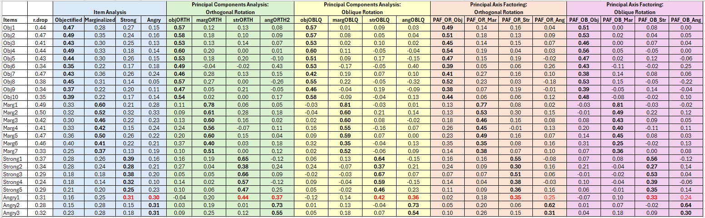

---
output:
  word_document: default
  html_document: default
---
# Principal Axis Factoring {#PAF}

[Screencasted Lecture Link](https://spu.hosted.panopto.com/Panopto/Pages/Viewer.aspx?pid=04c108ff-257e-4893-b6c3-adad0038666b) 
 


This is the second week of *exploratory* principal components analysis (PCA) and factor analysis (EFA).  This time the focus is on actual *factor analysis*. There are numerous approaches. I will be demonstrating principal axis factoring (PAF).

## Navigating this Lesson

There is about an hour-and-a-half of lecture.  If you work through the materials with me it would be plan for an additional two hours.

While the majority of R objects and data you will need are created within the R script that sources the chapter, occasionally there are some that cannot be created from within the R framework. Additionally, sometimes links fail.  All original materials are provided at the [Github site](https://github.com/lhbikos/ReC_Psychometrics) that hosts the book. More detailed guidelines for ways to access all these materials are provided in the OER's [introduction](#ReCintro)

### Learning Objectives

Focusing on this week's materials, make sure you can:

* Distinguish between PCA and EFA on several levels:  
  + recognize PCA and EFA from a path diagram
  + define keywords associated with each:  factor loadings, linear components, describe v. explain.  
* Recognize/define an identity matrix -- what test would you use to diagnose it?
* Recognize/define multicollinearity and singularity -- what test would you use to diagnose it?
* Describe the desired pattern of "loadings" (i.e., the relative weights of an item on its own scale compared to other scales)
* Compare the results from item analysis, PCA, PAF, and omega.

### Planning for Practice

In each of these lessons I provide suggestions for practice that allow you to select one or more problems that are graded in difficulty. Whichever you choose, it would be terrific if you used the same dataframe across as many psychometrics lessons as possible so you can compare the results.

The least complex is to change the random seed and rework the problem demonstrated in the lesson. The results *should* map onto the ones obtained in the lecture. 

The second option involves utilizing one of the simulated datasets available in this OER. Szymanski and Bissonette's [-@szymanski_perceptions_2020] Perceptions of the LGBTQ College Campus Climate Scale: Development and Psychometric Evaluation was used as the research vignette for the validity, reliability, and item analysis lessons. Although I switched vignettes, the Szymanski and Bissonette example is ready for PCA.

As a third option, you are welcome to use data to which you have access and is suitable for PCA. These could include other vignettes from this OER, other simualated data, or your own data (presuming you have permissoin to use it). In either case, please plan to:

* Properly format and prepare the data.
* Conduct diagnostic tests to determine the suitability of the data for PCA.
* Conducting tests to guide the decisions about number of components to extract.
* Conducting orthogonal and oblique extractions (at least two each with different numbers of components).
* Selecting one solution and preparing an APA style results section (with table and figure).
* Compare your results in light of any other psychometrics lessons where you have used this data (especially the [item analysis](#ItemAnalSurvey) and [PCA](#PCA) lessons).

### Readings & Resources

In preparing this chapter, I drew heavily from the following resource(s). Other resources are cited (when possible, linked) in the text with complete citations in the reference list.

* Revelle, William. (n.d.). Chapter 6: Constructs, components, and factor models. In *An introduction to psychometric theory with applications in R*. Retrieved from https://personality-project.org/r/book/#chapter6
  - pp. 150 to 167.  Stop at "Non-Simple Structure Solutions:  The Simplex and Circumplex."
  - A simultaneously theoretical review of psychometric theory while working with R and data to understand the concepts.
* Revelle, W. (2019). *How To: Use the psych package for Factor Analysis and data reduction*.
  - Treat as reference.  Pages 13 through 24 provide technical information about what we are doing.

### Packages

The packages used in this lesson are embedded in this code. When the hashtags are removed, the script below will (a) check to see if the following packages are installed on your computer and, if not (b) install them.

```r
# will install the package if not already installed
# if(!require(psych)){install.packages('psych')}
# if(!require(tidyverse)){install.packages('tidyverse')}
# if(!require(MASS)){install.packages('MASS')}
# if(!require(sjstats)){install.packages('sjstats')}
# if(!require(apaTables)){install.packages('apaTables')}
# if(!require(qualtRics)){install.packages('qualtRics')}
```

## Exploratory Factor Analysis (with a quick contrast to PCA)

Whereas principal components analysis (PCA) is a regression analysis technique, principal factor analysis is "...a latent variable model" [@revelle_william_chapter_nodate].

Exploratory factor analysis has a rich history.  In 1904, Spearman used it for a single factor.  In 1947, Thurstone generalized it to multiple factors.  Factor analysis is frequently used and controversial.

Factor analysis and principal components are commonly confused:

**Principal components** 

* linear sums of variables, 
* solved with an eigenvalue or singular decomposition
* represents a $n*n$ matrix in terms of the first *k* components and attempts to reproduce all of the $R$ matrix.
* paths point from the items to a total scale score -- all represented as observed/manifest (square) variables

**Factor analysis** 

* linear sums of unknown factors 
* estimated as best fitting solutions, normally through iterative procedures.
* Controversial because
  + at the *structural* level (i.e., covariance or correlation matrix), there are normally more observed variables than parameters to estimate them and the procedure seeks to find the best fitting solution using ordinary least squares, weighted least squares, or maximum likelihood
  + at the *data* level, the model is indeterminate, although scores can be extimated
  + this leads some to argue for using principal components; but fans of factor analysis suggest that it is useful for theory construction and evaluation
* attempts to model only the *common* part of the matrix, which means all of the off-diagonal elements and the common part of the diagonal (the *communalities*); the *uniquenesses* are the non-common (leftover) part
* Stated another way, the factor model partitions the correlation or covariance matrix into
  +  *common factors*, $FF'$, and
  + that which is *unique*, $U^2$ (the diagonal matrix of *uniquenesses*)
* paths point from the latent variable (LV) representing the factor (oval) to the items (squares) illustrating that the factor/LV "causes" the item's score


Our focus today is on the PAF approach to scale construction. By utilizing the same research vignette as in the [PCA lesson](#PCA), we can identify similarities in differences in the approach, results, and interpretation.  Let's first take a look at the workflow for PAF.

## PAF Workflow

Below is a screenshot of the workflow. The original document is located in the [Github site](https://github.com/lhbikos/ReC_Psychometrics) that hosts the ReCentering Psych Stats:  Psychometrics OER. You may find it refreshing that, with the exception of the change from "components" to "factors," the workflow for PCA and PAF are quite similar.


Steps in the process include:

* Creating an items only dataframe where all items are scaled in the same direction (i.e., negatively worded items are reverse-scored).
* Conducting tests that assess the statistical assumptions of PAF to ensure that the data is appropriate for PAF.
* Determining the number of factors (think "subscales") to extract. 
* Conducting the factor extraction -- this process will likely occur iteratively,
  - exploring orthogonal (uncorrelated/independent) and oblique (correlated) factors, and
  - changing the number of factors to extract

Because the intended audience for the ReCentering Psych Stats OER is the scientist-practitioner-advocate, this lesson focuses on the workflow and decisions. As you might guess, the details of PAF can be quite complex. Some important notions to consider that may not be obvious from lesson, are these:

* The values of factor loadings are directly related to the correlation matrix.
  - Although I do not explain this in detail, nearly every analytic step attempts to convey this notion by presenting equivalent analytic options using the raw data and correlation matrix.
* PAF (like PCA and related EFA procecures) is about *dimension reduction* -- our goal is fewer factors (think subscales) than there are items.
  - In this lesson's vignette there are 25 items on the scale and we will have 4 subscales.
* As a latent variable procedure, PAF is both *exploratory* and *factor analysis.*  This is in contrast to our prior [PCA lesson](#PCA). Recall that PCA is a regression-based model and therefore not "factor analysis."
* Matrix algebra (e.g., using the transpose of a matrix, multiplying matrices together) plays a critical role in the analytic solution.

## Research Vignette

This lesson's research vignette emerges from Lewis and Neville's Gendered Racial Microaggressions Scale for Black Women [-@lewis_construction_2015]. The article reports on two separate studies that comprised the development, refinement, and psychometric evaluation of two parallel versions (stress appraisal, frequency) of the scale. Below, I simulate data from the final construction of the stress appraisal version as the basis of the lecture. Items were on a 6-point Likert scale ranging from 0 (*not at all stressful*) to 5 (*extremely stressful*).

Lewis and Neville [-@lewis_construction_2015] reported support for a total scale score (25 items) and four subscales.  Below, I list the four subscales, their number of items, and a single example item. At the outset, let me provide a content advisory. For those who hold this particular identity (or related identities) the content in the items may be upsetting. In other lessons, I often provide a variable name that gives an indication of the primary content of the item. In the case of the GRMS, I will simply provide an abbreviation of the subscale name and its respective item number. This will allow us to easily inspect the alignment of the item with its intended factor, and hopefully minimize discomfort. If you are not a member of this particular identity, I encourage you to learn about these microaggressions by reading the article in its entirety. Please do not ask members of this group to explain why these microaggressions are harmful or ask if they have encountered them.  The four factors, number of items, and sample item are as follows:

* Assumptions of Beauty and Sexual Objectification
  - 10 items
  - "Objectified me based on physical features."
  - Abbreviated in the simulated data as "Obj#"
* Silenced and Marginalized
  - 7 items
  - "Someone has tried to 'put me in my place.'"
  - Abbreviated in the simulated data as "Marg#"
* Strong Black Woman Stereotype
  - 5 items
  - "I have been told that I am too assertive."
  - Abbreviated in the simulated data as "Str#"
* Angry Black Woman Stereotype
  - 3 items
  - "Someone accused me of being angry when speaking calm."
  - Abbreviated in the simulated data as "Ang#"

Three additional scales were reported in the Lewis and Neville article [-@lewis_construction_2015]. 
Because (a) the focus of this lesson is on exploratory factor analytic approaches and, therefore, only requires item-level data for the scale, and (b) the article does not include correlations between the subscales/scales of all involved measures, I only simulated item-level data for the GRMS items.

Below, I walk through the data simulation. This is not an essential portion of the lesson, but I will lecture it in case you are interested. None of the items are negatively worded (relative to the other items), so there is no need to reverse-score any items.

Simulating the data involved using factor loadings, means, standard deviations, and correlations between the scales. Because the simulation will produce "out-of-bounds" values, the code below rescales the scores into the range of the Likert-type scaling and rounds them to whole values.


```r
# Entering the intercorrelations, means, and standard deviations from
# the journal article

LewisGRMS_generating_model <- "
        #measurement model
        Objectification =~ .69*Obj1 + .69*Obj2 + .60*Obj3 + .59*Obj4 + .55*Obj5 + .55*Obj6 + .54*Obj7 + .50*Obj8 + .41*Obj9 + .41*Obj10
        Marginalized =~ .93*Marg1 + .81*Marg2 +.69*Marg3 + .67*Marg4 + .61*Marg5 + .58*Marg6 +.54*Marg7
        Strong =~ .59*Str1 + .55*Str2 + .54*Str3 + .54*Str4 + .51*Str5
        Angry =~ .70*Ang1 + .69*Ang2 + .68*Ang3
        
        #Means
         Objectification ~ 1.85*1
         Marginalized ~ 2.67*1
         Strong ~ 1.61*1
         Angry ~ 2.29*1
         
        #Correlations
         Objectification ~~ .63*Marginalized
         Objectification ~~ .66*Strong
         Objectification ~~ .51*Angry
         
         Marginalized ~~ .59*Strong
         Marginalized ~~ .62*Angry

         Strong ~~ .61*Angry
 
        "

set.seed(240311)
items <- lavaan::simulateData(model = LewisGRMS_generating_model, model.type = "sem",
    meanstructure = T, sample.nobs = 259, standardized = FALSE)

# used to retrieve column indices used in the rescaling script below
col_index <- as.data.frame(colnames(items))

# The code below loops through each column of the dataframe and
# assigns the scaling accordingly Rows 1 thru 26 are the GRMS items

for (i in 1:ncol(items)) {
    if (i >= 1 & i <= 26) {
        items[, i] <- scales::rescale(items[, i], c(1, 5))
    }
}

# rounding to integers so that the data resembles that which was
# collected
library(tidyverse)
items <- items %>%
    round(0)

# quick check of my work psych::describe(items)
```

The optional script below will let you save the simulated data to your computing environment as either a .csv file (think "Excel lite") or .rds object (preserves any formatting you might do).

```r
#write the simulated data  as a .csv
#write.table(items, file="items.csv", sep=",", col.names=TRUE, row.names=FALSE)
#bring back the simulated dat from a .csv file
#items <- read.csv ("items.csv", header = TRUE)
```


```r
#to save the df as an .rds (think "R object") file on your computer; it should save in the same file as the .rmd file you are working with
#saveRDS(items, "items.rds")
#bring back the simulated dat from an .rds file
#items <- readRDS("items.rds")
```

## Working the Vignette

It may be useful to recall how we might understand factors in the psychometric sense:  

* clusters of correlated items in an $R$-matrix
* statistical entities that can be plotted as classification axes where coordinates of variables along each axis represen the strength of the relationship between that variable to each factor.
* mathematical equations, resembling regression equations, where each variable is represented according to its relative weight

### Data Prep      

Since the first step is data preparation, let's start by:

* reverse coding any items that are phrased in the opposite direction 
* creating a *df* (as an object) that only contains the items in their properly scored direction (i.e., you might need to replace the original item with the reverse-coded item); there shoud be no other variables (e.g., ID, demographic variables, other scales) in this df
  - because the GRMS has no items like this we can skip these two steps

Our example today requires no reverse coding and the dataset I simulated only has item-level data (with no ID and no other variables). This means we are ready to start the PAF process.

Let's take a look at (and make an object of) the correlation matrix.  


```r
GRMSr <- cor(items)  #correlation matrix (with the negatively scored item already reversed) created and saved as object
round(GRMSr, 2)
```

```
      Obj1 Obj2 Obj3 Obj4 Obj5 Obj6 Obj7 Obj8  Obj9 Obj10 Marg1 Marg2 Marg3
Obj1  1.00 0.30 0.24 0.20 0.27 0.18 0.25 0.32  0.12  0.26  0.17  0.21  0.19
Obj2  0.30 1.00 0.32 0.24 0.27 0.21 0.24 0.29  0.26  0.19  0.08  0.19  0.14
Obj3  0.24 0.32 1.00 0.21 0.22 0.19 0.25 0.21  0.17  0.23  0.25  0.19  0.15
Obj4  0.20 0.24 0.21 1.00 0.36 0.19 0.27 0.27  0.23  0.26  0.16  0.13  0.17
Obj5  0.27 0.27 0.22 0.36 1.00 0.16 0.16 0.25  0.14  0.19  0.26  0.23  0.22
Obj6  0.18 0.21 0.19 0.19 0.16 1.00 0.16 0.19  0.14  0.10  0.16  0.06  0.05
Obj7  0.25 0.24 0.25 0.27 0.16 0.16 1.00 0.33  0.21  0.25  0.31  0.18  0.20
Obj8  0.32 0.29 0.21 0.27 0.25 0.19 0.33 1.00  0.16  0.26  0.12  0.10  0.12
Obj9  0.12 0.26 0.17 0.23 0.14 0.14 0.21 0.16  1.00  0.14  0.03  0.08  0.18
Obj10 0.26 0.19 0.23 0.26 0.19 0.10 0.25 0.26  0.14  1.00  0.10  0.10  0.20
Marg1 0.17 0.08 0.25 0.16 0.26 0.16 0.31 0.12  0.03  0.10  1.00  0.33  0.36
Marg2 0.21 0.19 0.19 0.13 0.23 0.06 0.18 0.10  0.08  0.10  0.33  1.00  0.35
Marg3 0.19 0.14 0.15 0.17 0.22 0.05 0.20 0.12  0.18  0.20  0.36  0.35  1.00
Marg4 0.21 0.15 0.20 0.24 0.21 0.13 0.21 0.17  0.07  0.17  0.41  0.20  0.37
Marg5 0.09 0.17 0.13 0.20 0.25 0.12 0.18 0.18  0.20  0.06  0.35  0.31  0.24
Marg6 0.22 0.21 0.11 0.22 0.24 0.22 0.31 0.20  0.12  0.14  0.34  0.28  0.31
Marg7 0.08 0.18 0.11 0.19 0.18 0.12 0.13 0.13  0.09  0.07  0.28  0.29  0.23
Str1  0.19 0.19 0.19 0.13 0.23 0.06 0.26 0.14  0.13  0.21  0.17  0.18  0.15
Str2  0.23 0.15 0.18 0.14 0.11 0.14 0.18 0.10  0.07  0.16  0.11  0.15  0.21
Str3  0.18 0.06 0.15 0.10 0.13 0.06 0.15 0.05  0.05  0.17  0.14  0.18  0.15
Str4  0.03 0.14 0.17 0.13 0.07 0.08 0.12 0.03  0.00  0.06  0.10  0.07  0.06
Str5  0.13 0.11 0.17 0.01 0.09 0.05 0.15 0.06  0.02  0.03  0.07  0.15  0.05
Ang1  0.06 0.01 0.15 0.14 0.11 0.04 0.25 0.08  0.12  0.06  0.21  0.19  0.13
Ang2  0.05 0.05 0.09 0.07 0.09 0.14 0.09 0.03 -0.01  0.13  0.13  0.21  0.14
Ang3  0.21 0.10 0.18 0.19 0.11 0.11 0.23 0.08  0.08  0.14  0.25  0.20  0.14
      Marg4 Marg5 Marg6 Marg7 Str1  Str2 Str3 Str4  Str5 Ang1  Ang2 Ang3
Obj1   0.21  0.09  0.22  0.08 0.19  0.23 0.18 0.03  0.13 0.06  0.05 0.21
Obj2   0.15  0.17  0.21  0.18 0.19  0.15 0.06 0.14  0.11 0.01  0.05 0.10
Obj3   0.20  0.13  0.11  0.11 0.19  0.18 0.15 0.17  0.17 0.15  0.09 0.18
Obj4   0.24  0.20  0.22  0.19 0.13  0.14 0.10 0.13  0.01 0.14  0.07 0.19
Obj5   0.21  0.25  0.24  0.18 0.23  0.11 0.13 0.07  0.09 0.11  0.09 0.11
Obj6   0.13  0.12  0.22  0.12 0.06  0.14 0.06 0.08  0.05 0.04  0.14 0.11
Obj7   0.21  0.18  0.31  0.13 0.26  0.18 0.15 0.12  0.15 0.25  0.09 0.23
Obj8   0.17  0.18  0.20  0.13 0.14  0.10 0.05 0.03  0.06 0.08  0.03 0.08
Obj9   0.07  0.20  0.12  0.09 0.13  0.07 0.05 0.00  0.02 0.12 -0.01 0.08
Obj10  0.17  0.06  0.14  0.07 0.21  0.16 0.17 0.06  0.03 0.06  0.13 0.14
Marg1  0.41  0.35  0.34  0.28 0.17  0.11 0.14 0.10  0.07 0.21  0.13 0.25
Marg2  0.20  0.31  0.28  0.29 0.18  0.15 0.18 0.07  0.15 0.19  0.21 0.20
Marg3  0.37  0.24  0.31  0.23 0.15  0.21 0.15 0.06  0.05 0.13  0.14 0.14
Marg4  1.00  0.27  0.28  0.24 0.13  0.17 0.13 0.16 -0.01 0.11  0.17 0.20
Marg5  0.27  1.00  0.27  0.23 0.13  0.06 0.20 0.11  0.08 0.04  0.10 0.22
Marg6  0.28  0.27  1.00  0.26 0.12  0.28 0.17 0.14  0.09 0.13  0.21 0.16
Marg7  0.24  0.23  0.26  1.00 0.12 -0.01 0.05 0.05  0.03 0.18  0.12 0.08
Str1   0.13  0.13  0.12  0.12 1.00  0.16 0.22 0.14  0.18 0.18  0.05 0.06
Str2   0.17  0.06  0.28 -0.01 0.16  1.00 0.19 0.17  0.18 0.11  0.16 0.12
Str3   0.13  0.20  0.17  0.05 0.22  0.19 1.00 0.27  0.19 0.27  0.13 0.22
Str4   0.16  0.11  0.14  0.05 0.14  0.17 0.27 1.00  0.11 0.12  0.04 0.04
Str5  -0.01  0.08  0.09  0.03 0.18  0.18 0.19 0.11  1.00 0.15  0.11 0.12
Ang1   0.11  0.04  0.13  0.18 0.18  0.11 0.27 0.12  0.15 1.00  0.23 0.26
Ang2   0.17  0.10  0.21  0.12 0.05  0.16 0.13 0.04  0.11 0.23  1.00 0.27
Ang3   0.20  0.22  0.16  0.08 0.06  0.12 0.22 0.04  0.12 0.26  0.27 1.00
```

In case you want to examine it in sections (easier to view):


```r
# round(GRMSr[,1:8], 2) round(GRMSr[,9:16], 2) round(GRMSr[,17:25],
# 2)
```

As with PCA, we can analyze the data with either raw data or correlation matrix.  I will do both to demonstrate (a) that it's possible and to (b) continue emphasizing that this is a *structural* analysis.  That is, we are trying to see if our more parsimonious extraction *reproduces* this original correlation matrix.

#### Three Diagnostic Tests to Evaluate the Appropriateness of the Data for Component (or Factor)Analysis      

#### Is my sample adequate for PAF?      

We return to the **KMO** (Kaiser-Meyer-Olkin), an index of *sampling adequacy* that can  be used with the actual sample to let us know if the sample size is sufficient (or if we should collect more data).

Kaiser's 1974 recommendations were:

* bare minimum of .5
* values between .5 and .7 are mediocre
* values between .7 and .8 are good
* values above .9 are superb

We use the *KMO()* function from the *psych* package with either raw or matrix dat.


```r
psych::KMO(items)
```

```
Kaiser-Meyer-Olkin factor adequacy
Call: psych::KMO(r = items)
Overall MSA =  0.84
MSA for each item = 
 Obj1  Obj2  Obj3  Obj4  Obj5  Obj6  Obj7  Obj8  Obj9 Obj10 Marg1 Marg2 Marg3 
 0.85  0.85  0.88  0.86  0.87  0.86  0.87  0.85  0.76  0.85  0.83  0.87  0.87 
Marg4 Marg5 Marg6 Marg7  Str1  Str2  Str3  Str4  Str5  Ang1  Ang2  Ang3 
 0.87  0.82  0.88  0.84  0.87  0.84  0.79  0.74  0.81  0.74  0.75  0.82 
```

```r
# psych::KMO(GRMSr) #for the KMO function, do not specify sample size
# if using the matrix form of the data
```

We examine the KMO values for both the overall matrix and the individual items.

At the matrix level, our $KMO = .84$, which falls in between Kaiser's definitions of *good* and *superb*.  

At the item level, the KMO should be > .50.  Variables with values below .5 should be evaluated for exclusion from the analysis (or run the analysis with and without the variable and compare the difference).  Because removing/adding variables impacts the KMO, be sure to re-evaluate.

At the item level, our KMO values range between .71 (Ang1, Ang2) and .88 (Obj3, Marg6). 

Considering both item- and matrix- levels, we conclude that the sample size and the data are adequate for component (or factor) analysis.

#### Are there correlations among the variables that are big enough to be analyzed?      

**Bartlett's** lets us know if a matrix is an *identity matrix.* In an identity matrix all correlation coefficients (everything on the off-diagonal) would be 0.0 (and everything on the diagonal would be 1.0).  

A significant Barlett's (i.e., $p < .05$) tells that the $R$-matrix is not an identity matrix.  That is, there are some relationships between variables that can be analyzed.

The *cortest.bartlett()* function in the *psych* package and can be run either from the raw data or R matrix formats.


```r
psych::cortest.bartlett(items)  #from the raw data
```

```
R was not square, finding R from data
```

```
$chisq
[1] 1113.299

$p.value
[1] 0.0000000000000000000000000000000000000000000000000000000000000000000000000000000000000000000007869186

$df
[1] 300
```

```r
# raw data produces the warning 'R was not square, finding R from
# data.' This means nothing other than we fed it raw data and the
# function is creating a matrix from which to do the analysis.

# psych::cortest.bartlett(GRMSr, n = 259) #if using the matrix, must
# specify sample size
```

Our Bartlett's test is significant:  $\chi ^{1}(300)=1113.30, p < .001$. This supports a component (or factor) analytic approach for investigating the data.

#### Is there multicollinearity or singularity in my data?      

The **determinant of the correlation matrix** should be greater than 0.00001 (that would be 4 zeros before the 1).  If it is smaller than 0.00001 then we may have an issue with *multicollinearity* (i.e., variables that are too highly correlated) or *singularity* (variables that are perfectly correlated).

The determinant function comes from base R.  It is easiest to compute when the correlation matrix is the object.  However, it is also possible to specify the command to work with the raw data.


```r
# det(GRMSr)
det(cor(items))  #if using the raw data
```

```
[1] 0.01140074
```

With a value of 0.00115, our determinant is greater than the 0.00001 requirement.  If it were not, then we could identify problematic variables (i.e., those correlating too highly with others and those not correlating sufficiently with others) and re-run the diagnostic statistics.

#### APA Style Summary So Far

>Data screening were conducted to determine the suitability of the data for this analyses. The Kaiser-Meyer-Olkin measure of sampling adequacy (KMO; Kaiser, 1970) represents the ratio of the squared correlation between variables to the squared partial correlation between variables. KMO ranges from 0.00 to 1.00 -- values closer to 1.00 indicate that the patterns of correlations are relatively compact and that component analysis should yield distinct and reliable components (Field, 2012). In our dataset, the KMO value was .84, indicating acceptable sampling adequacy. The Barlett’s Test of Sphericity examines whether the population correlation matrix resembles an identity matrix (Field, 2012). When the *p* value for the Bartlett’s test is < .05, we are fairly certain we have clusters of correlated variables. In our dataset, $\chi ^{1}(300)=1113.30, p < .001$, indicating the correlations between items are sufficiently large enough for principal axis factoring.  The determinant of the correlation matrix alerts us to any issues of multicollinearity or singularity and should be larger than 0.00001. Our determinant was 0.01140 and, again, indicated that our data was suitable for the analysis.

*Note*:  If this looks familiar,  it is!  The same diagnostics are used in PAF and [PCA](#PCA).

### Principal Axis Factoring (PAF)      

We can use the *fa()* function, specifying *fm = "pa"* from the *psych* package with raw or matrix data.

One difference from PCA is that factor analysis will not (cannot) calculate as many factors as there are items.  This means that we should select a reasonable number, like 20 (since there are 25 items).  However, I received a number of errors/warnings and 13 is the first number that would run. I also received the warning, "maximum iteration exceeded."  Therefore I increased "max.iter" to 100.

Our goal is to begin to get an idea of the cumulative variance explained and number of factors to extract. If we think there are four factors, we simply need to specify more than four factors on the *nfactors = ##* command. As long as that number is less than the total number of items, it does not matter what that number is.


```r
# grmsPAF1 <- psych::fa(GRMSr, nfactors=10, fm = 'pa', max.iter =
# 100, rotate='none')# using the matrix data and specifying the # of
# factors.

grmsPAF1 <- psych::fa(items, nfactors = 13, fm = "pa", max.iter = 100,
    rotate = "none")  # using raw data and specifying the max number of factors
```

```
maximum iteration exceeded
```

```r
# I received the warning 'maximum iteration exceeded'. It gave
# output, but it's best if we don't get that warning, so I increased
# it to 100.

grmsPAF1  #this object holds a great deal of information 
```

```
Factor Analysis using method =  pa
Call: psych::fa(r = items, nfactors = 13, rotate = "none", max.iter = 100, 
    fm = "pa")
Standardized loadings (pattern matrix) based upon correlation matrix
       PA1   PA2   PA3   PA4   PA5   PA6   PA7   PA8   PA9  PA10  PA11  PA12
Obj1  0.50  0.37  0.08 -0.33 -0.27 -0.03 -0.29 -0.10  0.01  0.06 -0.02  0.18
Obj2  0.45  0.34 -0.08  0.04  0.10  0.12 -0.06  0.11  0.13  0.14  0.14 -0.05
Obj3  0.46  0.17  0.12  0.04  0.06  0.07  0.00 -0.09 -0.07  0.12  0.29 -0.19
Obj4  0.46  0.19 -0.10  0.10  0.12 -0.10  0.15  0.08 -0.11 -0.08  0.00  0.11
Obj5  0.54  0.21 -0.32  0.41 -0.44 -0.21  0.09  0.02 -0.06 -0.01 -0.07 -0.08
Obj6  0.31  0.12 -0.03 -0.05  0.09  0.00  0.02  0.21 -0.10  0.14  0.02 -0.05
Obj7  0.54  0.11  0.13 -0.07  0.26 -0.04  0.02 -0.15 -0.10  0.06 -0.25 -0.07
Obj8  0.41  0.31 -0.09 -0.06  0.12 -0.06 -0.02 -0.01 -0.07  0.04 -0.07  0.08
Obj9  0.30  0.22 -0.09  0.13  0.34  0.00 -0.07  0.01  0.18 -0.19 -0.03 -0.12
Obj10 0.39  0.27  0.10 -0.14  0.02 -0.10  0.18 -0.05  0.01 -0.26  0.12  0.08
Marg1 0.56 -0.38 -0.16 -0.11 -0.02  0.00  0.01 -0.26 -0.23  0.14  0.00 -0.14
Marg2 0.48 -0.24 -0.04  0.00 -0.10  0.00 -0.17 -0.01  0.23  0.03  0.06 -0.03
Marg3 0.50 -0.22 -0.15 -0.19 -0.07  0.05  0.13 -0.13  0.26 -0.22  0.02 -0.10
Marg4 0.50 -0.18 -0.14 -0.17 -0.02  0.05  0.19 -0.05 -0.13 -0.04  0.12  0.06
Marg5 0.48 -0.24 -0.28  0.17  0.11  0.27 -0.30  0.11 -0.15 -0.20 -0.02  0.05
Marg6 0.54 -0.14 -0.08 -0.16 -0.01  0.07  0.10  0.24  0.06  0.10 -0.28  0.01
Marg7 0.39 -0.22 -0.25  0.05  0.14 -0.10  0.02  0.01  0.23  0.24  0.11  0.26
Str1  0.37  0.09  0.15  0.15 -0.04  0.06  0.02 -0.18  0.12 -0.01 -0.04 -0.01
Str2  0.35  0.05  0.25 -0.13 -0.13  0.15  0.12  0.15  0.07 -0.02 -0.09 -0.13
Str3  0.36 -0.11  0.36  0.16 -0.11  0.16 -0.03 -0.03 -0.01 -0.15 -0.02  0.17
Str4  0.25 -0.04  0.24  0.18 -0.01  0.36  0.23  0.03 -0.08  0.10  0.06  0.14
Str5  0.23 -0.01  0.27  0.12 -0.09  0.09 -0.15  0.01  0.09  0.12 -0.03 -0.12
Ang1  0.35 -0.23  0.37  0.22  0.15 -0.32  0.01 -0.12  0.06  0.05 -0.07  0.07
Ang2  0.29 -0.24  0.20 -0.08 -0.05 -0.24  0.02  0.35  0.01 -0.03  0.12 -0.06
Ang3  0.39 -0.15  0.20 -0.05  0.04 -0.19 -0.20  0.09 -0.21 -0.11  0.09 -0.01
       PA13   h2   u2 com
Obj1   0.15 0.74 0.26 5.0
Obj2   0.01 0.42 0.58 3.3
Obj3   0.01 0.42 0.58 3.2
Obj4   0.07 0.36 0.64 2.6
Obj5   0.02 0.87 0.13 4.6
Obj6   0.05 0.20 0.80 3.4
Obj7  -0.13 0.51 0.49 2.8
Obj8  -0.10 0.32 0.68 2.7
Obj9   0.21 0.40 0.60 5.9
Obj10 -0.25 0.45 0.55 5.2
Marg1  0.00 0.65 0.35 3.4
Marg2 -0.09 0.40 0.60 2.6
Marg3  0.09 0.54 0.46 3.8
Marg4  0.10 0.41 0.59 2.6
Marg5 -0.08 0.66 0.34 5.4
Marg6 -0.01 0.51 0.49 2.7
Marg7 -0.06 0.49 0.51 5.9
Str1  -0.13 0.26 0.74 3.1
Str2   0.05 0.31 0.69 4.5
Str3   0.01 0.39 0.61 4.2
Str4   0.08 0.38 0.62 5.2
Str5  -0.10 0.22 0.78 5.2
Ang1   0.15 0.54 0.46 5.7
Ang2  -0.09 0.40 0.60 5.2
Ang3   0.07 0.37 0.63 4.5

                       PA1  PA2  PA3  PA4  PA5  PA6  PA7  PA8  PA9 PA10 PA11
SS loadings           4.54 1.17 0.97 0.64 0.60 0.56 0.47 0.47 0.44 0.42 0.35
Proportion Var        0.18 0.05 0.04 0.03 0.02 0.02 0.02 0.02 0.02 0.02 0.01
Cumulative Var        0.18 0.23 0.27 0.29 0.32 0.34 0.36 0.38 0.39 0.41 0.43
Proportion Explained  0.40 0.10 0.09 0.06 0.05 0.05 0.04 0.04 0.04 0.04 0.03
Cumulative Proportion 0.40 0.51 0.60 0.65 0.71 0.76 0.80 0.84 0.88 0.92 0.95
                      PA12 PA13
SS loadings           0.31 0.27
Proportion Var        0.01 0.01
Cumulative Var        0.44 0.45
Proportion Explained  0.03 0.02
Cumulative Proportion 0.98 1.00

Mean item complexity =  4.1
Test of the hypothesis that 13 factors are sufficient.

df null model =  300  with the objective function =  4.47 with Chi Square =  1113.3
df of  the model are 53  and the objective function was  0.09 

The root mean square of the residuals (RMSR) is  0.01 
The df corrected root mean square of the residuals is  0.02 

The harmonic n.obs is  259 with the empirical chi square  16.54  with prob <  1 
The total n.obs was  259  with Likelihood Chi Square =  22.09  with prob <  1 

Tucker Lewis Index of factoring reliability =  1.226
RMSEA index =  0  and the 90 % confidence intervals are  0 0
BIC =  -272.42
Fit based upon off diagonal values = 1
Measures of factor score adequacy             
                                                   PA1  PA2  PA3  PA4  PA5  PA6
Correlation of (regression) scores with factors   0.95 0.85 0.82 0.81 0.79 0.73
Multiple R square of scores with factors          0.91 0.72 0.67 0.66 0.63 0.54
Minimum correlation of possible factor scores     0.81 0.44 0.34 0.32 0.26 0.07
                                                   PA7   PA8   PA9  PA10  PA11
Correlation of (regression) scores with factors   0.72  0.68  0.68  0.67  0.63
Multiple R square of scores with factors          0.51  0.47  0.46  0.45  0.39
Minimum correlation of possible factor scores     0.03 -0.06 -0.09 -0.10 -0.21
                                                   PA12  PA13
Correlation of (regression) scores with factors    0.62  0.58
Multiple R square of scores with factors           0.38  0.34
Minimum correlation of possible factor scores     -0.24 -0.33
```
*The total variance for a particular variable will have two factors:some variance will be shared with other variables (common variance) and some variance will be specific to that measure (unique variance).  Random variance is also specific to one item, but not reliably so.*

We can examine this most easily by examining the matrix (second screen). 

The columns PA1 thru PA10 are the (uninteresting at this point) unrotated loadings.  These are the loading from each factor to each variable. PA stands for "principal axis."

Scrolling to the far right we are interested in:

**Communalities** are represented as $h^2$. These are the proportions of common variance present in the variables.  A variable that has no specific (or random) variance would have a communality of 1.0.  If a variable shares none of its variance with any other variable, its communality would be 0.0. As a point of comparison, in PCA these started as 1.0 because we extracted the same number of components as items. In PAF, because we must extract fewer factors than items, these will have unique values.

**Uniquenesses* are represented as $u2$.  These are the amount of unique variance for each variable.  They are calculated as $1 - h^2$ (or 1 minus the communality).  

The final column, *com* represents *item complexity.*  This is an indication of how well an item reflects a single construct. If it is 1.0 then the item loads only on one component, if it is 2.0, it loads evenly on two components, and so forth. For now, we can ignore this. *I mostly wanted to reassure you that "com" is not "communality" -- h2 is communality*.

Let's switch to the first screen of output.

**Eigenvalues** are displayed in the row called, *SS loadings* (i.e., the sum of squared loadings).  They represent the variance explained by the particular linear component. PA1 explains 4.54 units of variance (out of a possible 25; the # of potential factors).  As a proportion, this is 4.54/25 = 0.1816 (reported in the *Proportion Var* row).


```r
4.54/25
```

```
[1] 0.1816
```

We inspect the eigenvalues to see how many are > 1.0 (Kaiser's eigenvalue > 1 criteria criteria).  We see there are two that meet Kaiser's critera and three that meet Joliffe's criteria (eigenvalues > .77). 

**Cumulative Var** is helpful to determine how many factors we'd like to retain to balance parsimony (few as possible) with the amount of variance we want to explain.  The eigenvalues are in descending order.  Using both Kaiser's criteria (eigenvalue > 1.0), Joiliffe's criteria (eigenvalue > 0.7) criteria, and the a priori theory related to the Lewis and Neville [-@lewis_construction_2015] article, we landed on a four-factor solution.  Extracting four factors (like we did with PCA will) will explain 29% of the variance. Eigenvalues are only one criteria, let's look at the scree plot.

**Scree plot**:  
Eigenvalues are stored in the *grmsPAF1* object's variable, "values".  We can see all the values captured by this object with the *names()* function:


```r
names(grmsPAF1)
```

```
 [1] "residual"               "dof"                    "chi"                   
 [4] "nh"                     "rms"                    "EPVAL"                 
 [7] "crms"                   "EBIC"                   "ESABIC"                
[10] "fit"                    "fit.off"                "sd"                    
[13] "factors"                "complexity"             "n.obs"                 
[16] "objective"              "criteria"               "STATISTIC"             
[19] "PVAL"                   "Call"                   "null.model"            
[22] "null.dof"               "null.chisq"             "TLI"                   
[25] "F0"                     "RMSEA"                  "BIC"                   
[28] "SABIC"                  "r.scores"               "R2"                    
[31] "valid"                  "score.cor"              "weights"               
[34] "rotation"               "hyperplane"             "communality"           
[37] "communalities"          "uniquenesses"           "values"                
[40] "e.values"               "loadings"               "model"                 
[43] "fm"                     "Structure"              "communality.iterations"
[46] "method"                 "scores"                 "R2.scores"             
[49] "r"                      "np.obs"                 "fn"                    
[52] "Vaccounted"            
```

Plotting the eigen*values* produces a scree plot. We can use this to further guage the number of factors we should extract.

```r
plot(grmsPAF1$values, type = "b") #type = "b" gives us "both" lines and points;  type = "l" gives lines and is relatively worthless
```

<!-- -->

We look for the point of *inflexion*.  That is, where the baseline levels out into a plateau. I can see inflections after 1, 2, 3, and 4.

#### Specifying the number of factors      

Having determined the number of components, we must rerun the analysis with this specification. Especially when researchers may not have a clear theoretical structure that guides the process, researchers may do this iteratively with varying numbers of factors. Lewis and Neville [@lewis_construction_2015] examined solutions with 2, 3, 4, and 5 factors (they conducted a parallel *factor* analysis; in contrast this lesson demonstrates principal axis factoring).


```r
# grmsPAF2 <- psych::fa(GRMSr, nfactors=4, fm = 'pa', rotate='none')
grmsPAF2 <- psych::fa(items, nfactors = 4, fm = "pa", rotate = "none")  #can copy prior script, but change nfactors and object name
grmsPAF2
```

```
Factor Analysis using method =  pa
Call: psych::fa(r = items, nfactors = 4, rotate = "none", fm = "pa")
Standardized loadings (pattern matrix) based upon correlation matrix
       PA1   PA2   PA3   PA4   h2   u2 com
Obj1  0.46  0.24  0.05 -0.06 0.28 0.72 1.6
Obj2  0.45  0.36 -0.06  0.12 0.35 0.65 2.1
Obj3  0.45  0.16  0.11  0.04 0.24 0.76 1.4
Obj4  0.47  0.21 -0.11 -0.09 0.28 0.72 1.6
Obj5  0.48  0.12 -0.13  0.10 0.27 0.73 1.4
Obj6  0.31  0.14 -0.05 -0.13 0.13 0.87 1.8
Obj7  0.53  0.12  0.07 -0.08 0.30 0.70 1.2
Obj8  0.42  0.35 -0.11 -0.09 0.32 0.68 2.2
Obj9  0.29  0.21 -0.07  0.06 0.14 0.86 2.1
Obj10 0.38  0.23  0.07 -0.13 0.22 0.78 2.0
Marg1 0.54 -0.34 -0.19  0.01 0.44 0.56 2.0
Marg2 0.48 -0.25 -0.05  0.14 0.32 0.68 1.7
Marg3 0.49 -0.20 -0.16  0.04 0.30 0.70 1.6
Marg4 0.50 -0.17 -0.19 -0.09 0.32 0.68 1.6
Marg5 0.45 -0.16 -0.19  0.15 0.29 0.71 1.9
Marg6 0.53 -0.12 -0.10 -0.07 0.31 0.69 1.2
Marg7 0.38 -0.17 -0.24  0.08 0.23 0.77 2.3
Str1  0.38  0.08  0.19  0.23 0.24 0.76 2.3
Str2  0.35  0.03  0.23 -0.06 0.18 0.82 1.8
Str3  0.36 -0.14  0.39  0.12 0.32 0.68 2.5
Str4  0.24 -0.03  0.21  0.15 0.13 0.87 2.7
Str5  0.23 -0.02  0.31  0.14 0.17 0.83 2.3
Ang1  0.33 -0.19  0.27 -0.07 0.23 0.77 2.7
Ang2  0.29 -0.23  0.15 -0.27 0.23 0.77 3.5
Ang3  0.39 -0.16  0.16 -0.25 0.26 0.74 2.5

                       PA1  PA2  PA3  PA4
SS loadings           4.34 0.98 0.78 0.40
Proportion Var        0.17 0.04 0.03 0.02
Cumulative Var        0.17 0.21 0.24 0.26
Proportion Explained  0.67 0.15 0.12 0.06
Cumulative Proportion 0.67 0.82 0.94 1.00

Mean item complexity =  2
Test of the hypothesis that 4 factors are sufficient.

df null model =  300  with the objective function =  4.47 with Chi Square =  1113.3
df of  the model are 206  and the objective function was  0.82 

The root mean square of the residuals (RMSR) is  0.04 
The df corrected root mean square of the residuals is  0.05 

The harmonic n.obs is  259 with the empirical chi square  223.39  with prob <  0.19 
The total n.obs was  259  with Likelihood Chi Square =  201.39  with prob <  0.58 

Tucker Lewis Index of factoring reliability =  1.008
RMSEA index =  0  and the 90 % confidence intervals are  0 0.025
BIC =  -943.32
Fit based upon off diagonal values = 0.96
Measures of factor score adequacy             
                                                   PA1  PA2  PA3   PA4
Correlation of (regression) scores with factors   0.93 0.77 0.72  0.59
Multiple R square of scores with factors          0.86 0.59 0.51  0.35
Minimum correlation of possible factor scores     0.72 0.17 0.03 -0.30
```

Our eigenvalues/SS loadings wiggle around a bit from the initial run. With four factors, we now, cumulatively, explain 26% of the variance.  

*Communality* is the proportion of common variance within a variable.  Changing from 13 to 4 factors changed these values ($h2$) as well as their associated *uniquenesses* ($u2$), which are calculated as "1.0 minus the communality." 

Now we see that 28% of the variance associated with Obj1 is common/shared (the $h2$ value).

As a reminder of what we are doing, recall that we are looking for a more *parsimonious* explanation than 25 items on the GRMS. By respecifying a smaller number of factors, we lose some information.  That is, the retained factors (now 4) cannot explain all of the variance present in the data (as we saw, it explains about 28%, cumulatively). The amount of variance explained in each variable is represented by the communalities after extraction.

We can also inspect the communalities through the lens of Kaiser's criterion (the eigenvalue > 1 criteria) to see if we think that four was a good number of factors to extract.

Kaiser's criterion is believed to be accurate if:

* when there are fewer than 30 variables (we had 25) and, after extraction, the communalities are greater than .70
  + looking at our data, none of the communalities is > .70, so, this does not support extracting four components
* when the sample size is greater than 250 (ours was 259) and the average communality is > .60
  + again, our communalities were lower than this

Using the *names()* function again, we see that "communality" is available for manipulation. 

```r
names(grmsPAF2)
```

```
 [1] "residual"               "dof"                    "chi"                   
 [4] "nh"                     "rms"                    "EPVAL"                 
 [7] "crms"                   "EBIC"                   "ESABIC"                
[10] "fit"                    "fit.off"                "sd"                    
[13] "factors"                "complexity"             "n.obs"                 
[16] "objective"              "criteria"               "STATISTIC"             
[19] "PVAL"                   "Call"                   "null.model"            
[22] "null.dof"               "null.chisq"             "TLI"                   
[25] "F0"                     "RMSEA"                  "BIC"                   
[28] "SABIC"                  "r.scores"               "R2"                    
[31] "valid"                  "score.cor"              "weights"               
[34] "rotation"               "hyperplane"             "communality"           
[37] "communalities"          "uniquenesses"           "values"                
[40] "e.values"               "loadings"               "model"                 
[43] "fm"                     "Structure"              "communality.iterations"
[46] "method"                 "scores"                 "R2.scores"             
[49] "r"                      "np.obs"                 "fn"                    
[52] "Vaccounted"            
```

We can use this value to calculate their mean.


```r
mean(grmsPAF2$communality)
```

```
[1] 0.2599292
```

```r
# sum(grmsPAF2$communality) #
```

We see that our average communality is 0.26. These two criteria suggest that we may not have the best solution. That said (in our defense):

*  We used the scree plot as a guide and it was very clear.
*  We have an adequate sample size and that was supported with the KMO.
*  Are the number of factors consistent with theory?  We have not yet inspected the factor loadings. This will provide us with more information.

We could do several things:

* rerun with a different number of factors (recall Lewis and Neville [-@lewis_construction_2015] ran models with 2, 3, 4, and 5 factors)
* conduct more diagnostics tests
  + reproduced correlation matrix
  + the difference between the reproduced correlation matrix and the correlation matrix in the data
  
The *factor.model()* function in *psych* produces the *reproduced correlation matrix* by using the *loadings* in our extracted object.  Conceptually, this matrix is the correlations that should be produced if we did not have the raw data but we only had the factor loadings.  We could do fancy matrix algebra and produce these.

The questions, though, is:  How close did we get?  How different is the *reproduced correlation matrix* from *GRMSmatrix* -- the $R$-matrix produced from our raw data.


```r
round(psych::factor.model(grmsPAF2$loadings), 3)  #produces the reproduced correlation matrix
```

```
       Obj1  Obj2  Obj3  Obj4  Obj5  Obj6  Obj7  Obj8  Obj9 Obj10 Marg1 Marg2
Obj1  0.275 0.282 0.250 0.263 0.238 0.181 0.279 0.275 0.177 0.241 0.157 0.149
Obj2  0.282 0.350 0.260 0.278 0.282 0.176 0.265 0.308 0.217 0.232 0.135 0.146
Obj3  0.250 0.260 0.245 0.229 0.228 0.153 0.262 0.230 0.160 0.212 0.170 0.177
Obj4  0.263 0.278 0.229 0.278 0.255 0.189 0.268 0.286 0.181 0.227 0.202 0.165
Obj5  0.238 0.282 0.228 0.255 0.275 0.160 0.250 0.250 0.181 0.189 0.244 0.221
Obj6  0.181 0.176 0.153 0.189 0.160 0.133 0.186 0.194 0.115 0.162 0.130 0.100
Obj7  0.279 0.265 0.262 0.268 0.250 0.186 0.302 0.261 0.168 0.243 0.230 0.208
Obj8  0.275 0.308 0.230 0.286 0.250 0.194 0.261 0.316 0.197 0.242 0.129 0.107
Obj9  0.177 0.217 0.160 0.181 0.181 0.115 0.168 0.197 0.136 0.146 0.100 0.098
Obj10 0.241 0.232 0.212 0.227 0.189 0.162 0.243 0.242 0.146 0.219 0.115 0.105
Marg1 0.157 0.135 0.170 0.202 0.244 0.130 0.230 0.129 0.100 0.115 0.444 0.357
Marg2 0.149 0.146 0.177 0.165 0.221 0.100 0.208 0.107 0.098 0.105 0.357 0.318
Marg3 0.166 0.163 0.173 0.200 0.235 0.127 0.218 0.149 0.113 0.125 0.362 0.298
Marg4 0.183 0.163 0.173 0.224 0.234 0.151 0.234 0.177 0.116 0.148 0.361 0.279
Marg5 0.149 0.175 0.163 0.184 0.238 0.108 0.192 0.140 0.119 0.102 0.338 0.290
Marg6 0.214 0.194 0.207 0.239 0.246 0.162 0.262 0.198 0.132 0.177 0.345 0.280
Marg7 0.114 0.134 0.120 0.159 0.200 0.095 0.153 0.119 0.095 0.077 0.306 0.246
Str1  0.190 0.217 0.215 0.154 0.192 0.092 0.205 0.146 0.127 0.147 0.146 0.187
Str2  0.185 0.148 0.187 0.151 0.138 0.110 0.210 0.138 0.090 0.165 0.139 0.144
Str3  0.146 0.104 0.188 0.087 0.118 0.060 0.192 0.049 0.055 0.118 0.172 0.209
Str4  0.107 0.106 0.134 0.073 0.102 0.044 0.128 0.056 0.059 0.082 0.104 0.135
Str5  0.108 0.092 0.139 0.056 0.080 0.036 0.130 0.041 0.047 0.087 0.074 0.120
Ang1  0.125 0.055 0.146 0.093 0.094 0.074 0.177 0.049 0.033 0.111 0.197 0.188
Ang2  0.100 0.002 0.097 0.093 0.061 0.085 0.154 0.047 0.008 0.102 0.202 0.150
Ang3  0.164 0.077 0.157 0.152 0.121 0.123 0.216 0.112 0.054 0.155 0.233 0.185
      Marg3 Marg4 Marg5 Marg6 Marg7  Str1  Str2  Str3  Str4  Str5  Ang1  Ang2
Obj1  0.166 0.183 0.149 0.214 0.114 0.190 0.185 0.146 0.107 0.108 0.125 0.100
Obj2  0.163 0.163 0.175 0.194 0.134 0.217 0.148 0.104 0.106 0.092 0.055 0.002
Obj3  0.173 0.173 0.163 0.207 0.120 0.215 0.187 0.188 0.134 0.139 0.146 0.097
Obj4  0.200 0.224 0.184 0.239 0.159 0.154 0.151 0.087 0.073 0.056 0.093 0.093
Obj5  0.235 0.234 0.238 0.246 0.200 0.192 0.138 0.118 0.102 0.080 0.094 0.061
Obj6  0.127 0.151 0.108 0.162 0.095 0.092 0.110 0.060 0.044 0.036 0.074 0.085
Obj7  0.218 0.234 0.192 0.262 0.153 0.205 0.210 0.192 0.128 0.130 0.177 0.154
Obj8  0.149 0.177 0.140 0.198 0.119 0.146 0.138 0.049 0.056 0.041 0.049 0.047
Obj9  0.113 0.116 0.119 0.132 0.095 0.127 0.090 0.055 0.059 0.047 0.033 0.008
Obj10 0.125 0.148 0.102 0.177 0.077 0.147 0.165 0.118 0.082 0.087 0.111 0.102
Marg1 0.362 0.361 0.338 0.345 0.306 0.146 0.139 0.172 0.104 0.074 0.197 0.202
Marg2 0.298 0.279 0.290 0.280 0.246 0.187 0.144 0.209 0.135 0.120 0.188 0.150
Marg3 0.304 0.303 0.290 0.295 0.258 0.149 0.129 0.148 0.097 0.072 0.157 0.151
Marg4 0.303 0.318 0.276 0.307 0.253 0.121 0.133 0.120 0.074 0.047 0.155 0.176
Marg5 0.290 0.276 0.291 0.268 0.256 0.158 0.103 0.131 0.098 0.068 0.122 0.097
Marg6 0.295 0.307 0.268 0.308 0.237 0.158 0.165 0.161 0.102 0.084 0.178 0.182
Marg7 0.258 0.253 0.256 0.237 0.234 0.103 0.068 0.075 0.058 0.025 0.088 0.087
Str1  0.149 0.121 0.158 0.158 0.103 0.239 0.166 0.228 0.164 0.175 0.146 0.055
Str2  0.129 0.133 0.103 0.165 0.068 0.166 0.180 0.205 0.123 0.143 0.177 0.143
Str3  0.148 0.120 0.131 0.161 0.075 0.228 0.205 0.318 0.191 0.225 0.244 0.160
Str4  0.097 0.074 0.098 0.102 0.058 0.164 0.123 0.191 0.125 0.141 0.131 0.065
Str5  0.072 0.047 0.068 0.084 0.025 0.175 0.143 0.225 0.141 0.169 0.155 0.080
Ang1  0.157 0.155 0.122 0.178 0.088 0.146 0.177 0.244 0.131 0.155 0.226 0.199
Ang2  0.151 0.176 0.097 0.182 0.087 0.055 0.143 0.160 0.065 0.080 0.199 0.230
Ang3  0.187 0.211 0.134 0.225 0.113 0.108 0.183 0.195 0.095 0.109 0.220 0.238
       Ang3
Obj1  0.164
Obj2  0.077
Obj3  0.157
Obj4  0.152
Obj5  0.121
Obj6  0.123
Obj7  0.216
Obj8  0.112
Obj9  0.054
Obj10 0.155
Marg1 0.233
Marg2 0.185
Marg3 0.187
Marg4 0.211
Marg5 0.134
Marg6 0.225
Marg7 0.113
Str1  0.108
Str2  0.183
Str3  0.195
Str4  0.095
Str5  0.109
Ang1  0.220
Ang2  0.238
Ang3  0.263
```

We're not really interested in this matrix.  We just need it to compare it to the *GRMSmatrix* to produce the residuals.  We do that next.

**Residuals** are the difference between the reproduced (i.e., those created from our factor loadings) and $R$-matrix produced by the raw data.  

If we look at the $r_{_{Obj1Obj2}}$ in our original correlation matrix (theoretically from the raw data [although we simulated data]), the value is 0.30.  The reproduced correlation for this pair is 0.282.  The difference is 0.018.  The residuals table below shows 0.020 (rounding error).


```r
.30 - .282
```

```
[1] 0.018
```

By using the *factor.residuals()* function we can calculate the residuals.  Here we will see this difference calculated for us, for all the elements in the matrix.

```r
round(psych::factor.residuals(GRMSr, grmsPAF2$loadings), 3)
```

```
        Obj1   Obj2   Obj3   Obj4   Obj5   Obj6   Obj7   Obj8   Obj9  Obj10
Obj1   0.725  0.020 -0.009 -0.066  0.031 -0.005 -0.026  0.041 -0.061  0.017
Obj2   0.020  0.650  0.056 -0.034 -0.010  0.033 -0.023 -0.023  0.046 -0.041
Obj3  -0.009  0.056  0.755 -0.023 -0.008  0.036 -0.010 -0.019  0.010  0.018
Obj4  -0.066 -0.034 -0.023  0.722  0.103 -0.002  0.005 -0.012  0.045  0.032
Obj5   0.031 -0.010 -0.008  0.103  0.725 -0.005 -0.085 -0.001 -0.039 -0.003
Obj6  -0.005  0.033  0.036 -0.002 -0.005  0.867 -0.029 -0.004  0.024 -0.060
Obj7  -0.026 -0.023 -0.010  0.005 -0.085 -0.029  0.698  0.067  0.039  0.007
Obj8   0.041 -0.023 -0.019 -0.012 -0.001 -0.004  0.067  0.684 -0.039  0.014
Obj9  -0.061  0.046  0.010  0.045 -0.039  0.024  0.039 -0.039  0.864 -0.010
Obj10  0.017 -0.041  0.018  0.032 -0.003 -0.060  0.007  0.014 -0.010  0.781
Marg1  0.011 -0.056  0.081 -0.046  0.012  0.029  0.077 -0.005 -0.070 -0.019
Marg2  0.057  0.046  0.011 -0.037  0.010 -0.044 -0.029 -0.007 -0.021 -0.003
Marg3  0.027 -0.023 -0.020 -0.030 -0.012 -0.073 -0.016 -0.031  0.063  0.077
Marg4  0.023 -0.011  0.030  0.015 -0.020 -0.019 -0.023 -0.006 -0.046  0.021
Marg5 -0.057 -0.001 -0.031  0.019  0.012  0.017 -0.010  0.044  0.077 -0.045
Marg6  0.009  0.016 -0.093 -0.016 -0.002  0.057  0.052 -0.001 -0.013 -0.036
Marg7 -0.034  0.047 -0.011  0.029 -0.019  0.028 -0.021  0.014 -0.003 -0.004
Str1   0.000 -0.027 -0.028 -0.020  0.042 -0.030  0.057 -0.010  0.005  0.060
Str2   0.043  0.002 -0.004 -0.012 -0.026  0.029 -0.028 -0.034 -0.022 -0.001
Str3   0.031 -0.042 -0.033  0.015  0.008 -0.004 -0.042 -0.001 -0.004  0.050
Str4  -0.072  0.037  0.039  0.062 -0.036  0.038 -0.006 -0.024 -0.057 -0.026
Str5   0.019  0.021  0.027 -0.048  0.014  0.015  0.018  0.019 -0.025 -0.061
Ang1  -0.065 -0.040  0.002  0.050  0.013 -0.034  0.068  0.034  0.091 -0.051
Ang2  -0.054  0.045 -0.007 -0.018  0.025  0.060 -0.065 -0.014 -0.022  0.031
Ang3   0.047  0.027  0.023  0.037 -0.010 -0.016  0.014 -0.032  0.022 -0.018
       Marg1  Marg2  Marg3  Marg4  Marg5  Marg6  Marg7   Str1   Str2   Str3
Obj1   0.011  0.057  0.027  0.023 -0.057  0.009 -0.034  0.000  0.043  0.031
Obj2  -0.056  0.046 -0.023 -0.011 -0.001  0.016  0.047 -0.027  0.002 -0.042
Obj3   0.081  0.011 -0.020  0.030 -0.031 -0.093 -0.011 -0.028 -0.004 -0.033
Obj4  -0.046 -0.037 -0.030  0.015  0.019 -0.016  0.029 -0.020 -0.012  0.015
Obj5   0.012  0.010 -0.012 -0.020  0.012 -0.002 -0.019  0.042 -0.026  0.008
Obj6   0.029 -0.044 -0.073 -0.019  0.017  0.057  0.028 -0.030  0.029 -0.004
Obj7   0.077 -0.029 -0.016 -0.023 -0.010  0.052 -0.021  0.057 -0.028 -0.042
Obj8  -0.005 -0.007 -0.031 -0.006  0.044 -0.001  0.014 -0.010 -0.034 -0.001
Obj9  -0.070 -0.021  0.063 -0.046  0.077 -0.013 -0.003  0.005 -0.022 -0.004
Obj10 -0.019 -0.003  0.077  0.021 -0.045 -0.036 -0.004  0.060 -0.001  0.050
Marg1  0.556 -0.028 -0.002  0.052  0.012 -0.006 -0.025  0.024 -0.030 -0.034
Marg2 -0.028  0.682  0.051 -0.083  0.019  0.002  0.047 -0.003  0.008 -0.029
Marg3 -0.002  0.051  0.696  0.071 -0.045  0.016 -0.025  0.002  0.077  0.006
Marg4  0.052 -0.083  0.071  0.682 -0.007 -0.028 -0.008  0.006  0.038  0.009
Marg5  0.012  0.019 -0.045 -0.007  0.709  0.005 -0.022 -0.024 -0.041  0.074
Marg6 -0.006  0.002  0.016 -0.028  0.005  0.692  0.028 -0.042  0.115  0.011
Marg7 -0.025  0.047 -0.025 -0.008 -0.022  0.028  0.766  0.014 -0.081 -0.024
Str1   0.024 -0.003  0.002  0.006 -0.024 -0.042  0.014  0.761 -0.008 -0.005
Str2  -0.030  0.008  0.077  0.038 -0.041  0.115 -0.081 -0.008  0.820 -0.012
Str3  -0.034 -0.029  0.006  0.009  0.074  0.011 -0.024 -0.005 -0.012  0.682
Str4  -0.005 -0.067 -0.033  0.088  0.012  0.036 -0.004 -0.020  0.049  0.076
Str5   0.000  0.031 -0.021 -0.054  0.015  0.007  0.009  0.000  0.032 -0.035
Ang1   0.017 -0.002 -0.027 -0.041 -0.079 -0.051  0.097  0.039 -0.063  0.022
Ang2  -0.077  0.059 -0.012 -0.004  0.000  0.032  0.030 -0.003  0.019 -0.035
Ang3   0.016  0.015 -0.049 -0.015  0.087 -0.063 -0.034 -0.045 -0.066  0.023
        Str4   Str5   Ang1   Ang2   Ang3
Obj1  -0.072  0.019 -0.065 -0.054  0.047
Obj2   0.037  0.021 -0.040  0.045  0.027
Obj3   0.039  0.027  0.002 -0.007  0.023
Obj4   0.062 -0.048  0.050 -0.018  0.037
Obj5  -0.036  0.014  0.013  0.025 -0.010
Obj6   0.038  0.015 -0.034  0.060 -0.016
Obj7  -0.006  0.018  0.068 -0.065  0.014
Obj8  -0.024  0.019  0.034 -0.014 -0.032
Obj9  -0.057 -0.025  0.091 -0.022  0.022
Obj10 -0.026 -0.061 -0.051  0.031 -0.018
Marg1 -0.005  0.000  0.017 -0.077  0.016
Marg2 -0.067  0.031 -0.002  0.059  0.015
Marg3 -0.033 -0.021 -0.027 -0.012 -0.049
Marg4  0.088 -0.054 -0.041 -0.004 -0.015
Marg5  0.012  0.015 -0.079  0.000  0.087
Marg6  0.036  0.007 -0.051  0.032 -0.063
Marg7 -0.004  0.009  0.097  0.030 -0.034
Str1  -0.020  0.000  0.039 -0.003 -0.045
Str2   0.049  0.032 -0.063  0.019 -0.066
Str3   0.076 -0.035  0.022 -0.035  0.023
Str4   0.875 -0.029 -0.007 -0.028 -0.055
Str5  -0.029  0.831 -0.006  0.032  0.008
Ang1  -0.007 -0.006  0.774  0.029  0.044
Ang2  -0.028  0.032  0.029  0.770  0.027
Ang3  -0.055  0.008  0.044  0.027  0.737
```

There are several strategies to evaluate this matrix:

* see how large the residuals are, compared to the original correlations
  + the worst possible model would occur if we extracted no factors and would be the size of the original correlations
  + if the correlations were small to start with, we expect small residuals
  + if the correlations were large to start with, the residuals will be relatively larger (this is not terribly problematic)
* comparing residuals requires squaring them first (because residuals can be both positive and negative)
  + the sum of the squared residuals divided by the sum of the squared correlations is an estimate of model fit.  Subtracting this from 1.0 means that it ranges from 0 to 1.  Values > .95 are an indication of good fit.

Analyzing the residuals means we need to extract only the upper right of the triangle them into an object. We can do this in steps.


```r
grmsPAF2_resids <- psych::factor.residuals(GRMSr, grmsPAF2$loadings)  #first extract the resids
grmsPAF2_resids <- as.matrix(grmsPAF2_resids[upper.tri(grmsPAF2_resids)])  #the object has the residuals in a single column
head(grmsPAF2_resids)
```

```
             [,1]
[1,]  0.019934198
[2,] -0.008859929
[3,]  0.055526063
[4,] -0.066056926
[5,] -0.034252440
[6,] -0.023167960
```

One criteria of residual analysis is to see how many residuals there are that are greater than an absolute value of 0.05. The result will be a single column with TRUE if it is > |0.05| and false if it is smaller. The sum function will tell us how many TRUE responses are in the matrix.  Further, we can write script to obtain the proportion of total number of residuals. 


```r
large.resid <- abs(grmsPAF2_resids) > 0.05
# large.resid
sum(large.resid)
```

```
[1] 55
```

```r
round(sum(large.resid)/nrow(grmsPAF2_resids), 3)
```

```
[1] 0.183
```

We learn that there are 55 residuals greater than the absolute value of 0.05.  This represents 18% of the total number of residuals.

There are no hard rules about what proportion of residuals can be greater than 0.05. Field recommends that it stay below 50% [@field_discovering_2012].

Another approach to analyzing residuals is to look at their mean.  Because of the +/- valences, we need to square them (to eliminate the negative), take the average, then take the square root.


```r
round(sqrt(mean(grmsPAF2_resids^2)), 3)
```

```
[1] 0.038
```

While there are no clear guidelines to interpret these, one recommendation is to consider extracting more components if the value is higher than 0.08 [@field_discovering_2012]. 

Finally, we expect our residuals to be normally distributed.  A histogram can help us inspect the distribution.


```r
hist(grmsPAF2_resids)
```

<!-- -->

Not bad!  It looks reasonably normal.  No outliers.

####  Quick recap of how to evaluate the # of factors we extracted      

* If fewer than 30 variables, the eigenvalue > 1 (Kaiser's) critera is fine, so long as communalities are all > .70.
* If sample size > 250 and the average communalitie are .6 or greater, this is fine.
* When *N* > 200, the scree plot can be used.
* Regarding residuals
  + fewer than 50% should have absolute values > 0.05
  + model fit should be > 0.90
  
### Factor Rotation        

The original solution of a principal components or principal axis factor analysis is a set of vectors that best account for the observed covariance or correlation matrix.  Each additional component or factor accounts for progressively less and less variance.  The solution is efficient (yay) but difficult to interpret (boo).

Thanks to Thurstone's five rules toward a simple structure (circa 1947), interpretation of a matrix is facilitaed by *rotation* (multiplying a matrix by a matrix of orthogonal vectors that preserve the communalities of each variable).  Both the original matrix and the solution will be orthogonal. 

*Parsimony* becomes a statistical consideration (an equation, in fact) and goal and is maximized when each variable has a 1.0 loading on one factor and the rest are zero.

Different rotation strategies emphasize different goals related to parsimony:

*Quartimax* seeks to maximize the notion of variable parsimony (each variable is associated with one factor) and permits the rotation toward a general factor (ignoring smaller factors).
*Varimax* maximizes the variance of squared loadings taken over items instead of over factors and *avoids* a general factor.

Rotation improves the interpretation of the factor by maximizing the loading on each variable on one of the extracted factors while minimizing the loading on all other factors  Rotation works by changing the absolute values of the variables while keeping their differential values constant.

There are two big choices (to be made on theoretical grounds):

* Orthogonal rotation if you think that the factors are independent/unrelated.
  + varimax is the most common orthogonal rotation
* Oblique rotation if you think that the factors are related/correlated.
  + oblimin and promax are common oblique rotations

#### Orthogonal rotation


```r
# grmsPAF2ORTH <- psych::fa(GRMSr, nfactors = 4, fm = 'pa', rotate =
# 'varimax')
grmsPAF2ORTH <- psych::fa(items, nfactors = 4, fm = "pa", rotate = "varimax")
grmsPAF2ORTH
```

```
Factor Analysis using method =  pa
Call: psych::fa(r = items, nfactors = 4, rotate = "varimax", fm = "pa")
Standardized loadings (pattern matrix) based upon correlation matrix
       PA2  PA1  PA3   PA4   h2   u2 com
Obj1  0.47 0.10 0.17  0.13 0.28 0.72 1.5
Obj2  0.54 0.14 0.16 -0.11 0.35 0.65 1.4
Obj3  0.38 0.14 0.27  0.09 0.24 0.76 2.2
Obj4  0.47 0.21 0.04  0.10 0.28 0.72 1.5
Obj5  0.40 0.32 0.13 -0.02 0.27 0.73 2.2
Obj6  0.32 0.11 0.01  0.13 0.13 0.87 1.6
Obj7  0.42 0.19 0.21  0.21 0.30 0.70 2.5
Obj8  0.55 0.10 0.00  0.04 0.32 0.68 1.1
Obj9  0.34 0.11 0.07 -0.06 0.14 0.86 1.4
Obj10 0.42 0.04 0.12  0.17 0.22 0.78 1.5
Marg1 0.10 0.61 0.10  0.22 0.44 0.56 1.4
Marg2 0.09 0.49 0.25  0.11 0.32 0.68 1.7
Marg3 0.17 0.50 0.11  0.14 0.30 0.70 1.5
Marg4 0.22 0.47 0.02  0.22 0.32 0.68 1.9
Marg5 0.16 0.50 0.12  0.01 0.29 0.71 1.3
Marg6 0.26 0.42 0.11  0.23 0.31 0.69 2.5
Marg7 0.13 0.47 0.02  0.03 0.23 0.77 1.2
Str1  0.24 0.14 0.40 -0.03 0.24 0.76 1.9
Str2  0.22 0.06 0.28  0.23 0.18 0.82 3.0
Str3  0.05 0.11 0.51  0.20 0.32 0.68 1.4
Str4  0.08 0.09 0.33  0.04 0.13 0.87 1.3
Str5  0.06 0.01 0.40  0.08 0.17 0.83 1.1
Ang1  0.04 0.15 0.31  0.32 0.23 0.77 2.4
Ang2  0.03 0.15 0.10  0.44 0.23 0.77 1.3
Ang3  0.14 0.17 0.16  0.43 0.26 0.74 1.8

                       PA2  PA1  PA3  PA4
SS loadings           2.27 2.11 1.22 0.91
Proportion Var        0.09 0.08 0.05 0.04
Cumulative Var        0.09 0.17 0.22 0.26
Proportion Explained  0.35 0.32 0.19 0.14
Cumulative Proportion 0.35 0.67 0.86 1.00

Mean item complexity =  1.7
Test of the hypothesis that 4 factors are sufficient.

df null model =  300  with the objective function =  4.47 with Chi Square =  1113.3
df of  the model are 206  and the objective function was  0.82 

The root mean square of the residuals (RMSR) is  0.04 
The df corrected root mean square of the residuals is  0.05 

The harmonic n.obs is  259 with the empirical chi square  223.39  with prob <  0.19 
The total n.obs was  259  with Likelihood Chi Square =  201.39  with prob <  0.58 

Tucker Lewis Index of factoring reliability =  1.008
RMSEA index =  0  and the 90 % confidence intervals are  0 0.025
BIC =  -943.32
Fit based upon off diagonal values = 0.96
Measures of factor score adequacy             
                                                   PA2  PA1  PA3   PA4
Correlation of (regression) scores with factors   0.82 0.81 0.72  0.67
Multiple R square of scores with factors          0.68 0.66 0.52  0.45
Minimum correlation of possible factor scores     0.36 0.33 0.03 -0.10
```

Essentially, we have the same information as before, except that loadings are calculated after rotation (which adjusts the absolute values of the factor loadings while keeping their differential vales constant).  Our communality and uniqueness values remain the same. The eigenvalues (SS loadings) should even out, but the proportion of variance explained and cumulative variance (39%) will remain the same.
  
The *print.psych()* function facilitates interpretation and prioritizes the information about which we care most:

* "cut" will display loadings above .3, this allows us to see
  - if some items load on no factors
  - if some items have cross-loadings (and their relative weights)
* "sort" will reorder the loadings to make it clearer (to the best of its ability...in the case of ties) to which factor/scale it belongs


```r
grmsPAF2_table <- psych::print.psych(grmsPAF2ORTH, cut = 0.3, sort = TRUE)
```

```
Factor Analysis using method =  pa
Call: psych::fa(r = items, nfactors = 4, rotate = "varimax", fm = "pa")
Standardized loadings (pattern matrix) based upon correlation matrix
      item  PA2  PA1  PA3   PA4   h2   u2 com
Obj8     8 0.55                 0.32 0.68 1.1
Obj2     2 0.54                 0.35 0.65 1.4
Obj4     4 0.47                 0.28 0.72 1.5
Obj1     1 0.47                 0.28 0.72 1.5
Obj7     7 0.42                 0.30 0.70 2.5
Obj10   10 0.42                 0.22 0.78 1.5
Obj5     5 0.40 0.32            0.27 0.73 2.2
Obj3     3 0.38                 0.24 0.76 2.2
Obj9     9 0.34                 0.14 0.86 1.4
Obj6     6 0.32                 0.13 0.87 1.6
Marg1   11      0.61            0.44 0.56 1.4
Marg5   15      0.50            0.29 0.71 1.3
Marg3   13      0.50            0.30 0.70 1.5
Marg2   12      0.49            0.32 0.68 1.7
Marg4   14      0.47            0.32 0.68 1.9
Marg7   17      0.47            0.23 0.77 1.2
Marg6   16      0.42            0.31 0.69 2.5
Str3    20           0.51       0.32 0.68 1.4
Str1    18           0.40       0.24 0.76 1.9
Str5    22           0.40       0.17 0.83 1.1
Str4    21           0.33       0.13 0.87 1.3
Str2    19                      0.18 0.82 3.0
Ang2    24                 0.44 0.23 0.77 1.3
Ang3    25                 0.43 0.26 0.74 1.8
Ang1    23           0.31  0.32 0.23 0.77 2.4

                       PA2  PA1  PA3  PA4
SS loadings           2.27 2.11 1.22 0.91
Proportion Var        0.09 0.08 0.05 0.04
Cumulative Var        0.09 0.17 0.22 0.26
Proportion Explained  0.35 0.32 0.19 0.14
Cumulative Proportion 0.35 0.67 0.86 1.00

Mean item complexity =  1.7
Test of the hypothesis that 4 factors are sufficient.

df null model =  300  with the objective function =  4.47 with Chi Square =  1113.3
df of  the model are 206  and the objective function was  0.82 

The root mean square of the residuals (RMSR) is  0.04 
The df corrected root mean square of the residuals is  0.05 

The harmonic n.obs is  259 with the empirical chi square  223.39  with prob <  0.19 
The total n.obs was  259  with Likelihood Chi Square =  201.39  with prob <  0.58 

Tucker Lewis Index of factoring reliability =  1.008
RMSEA index =  0  and the 90 % confidence intervals are  0 0.025
BIC =  -943.32
Fit based upon off diagonal values = 0.96
Measures of factor score adequacy             
                                                   PA2  PA1  PA3   PA4
Correlation of (regression) scores with factors   0.82 0.81 0.72  0.67
Multiple R square of scores with factors          0.68 0.66 0.52  0.45
Minimum correlation of possible factor scores     0.36 0.33 0.03 -0.10
```

In the unrotated solution, most variables loaded on the first component.  After rotation, there are four clear components/scales.  Further, there is clear (or at least reasonable) component/scale membership for each item and few cross-loadings. Something curious has happened to Str2 -- it has no loadings at all! Looking back at the PCA with an orthogonal rotation, Str2 had cross-loadings with two factors.

If this were a new scale and we had not yet established ideas for subscales, the next step is to look back at the items, themselves, and try to name the scales/components. If our scale construction included a priori/planned subscales, here's where we hope the items fall where they were hypothesized to do so. Our simulated data worked perfectly and replicated the four scales that Lewis and Neville [@lewis_construction_2015] reported in the article.

* Assumptions of Beauty and Sexual Objectification
* Silenced and Marginalized
* Strong Woman Stereotype
* Angry Woman Stereotype

We can also create a figure of the result. Note the direction of the arrows from the factor (latent variable) to the items in PAF -- in PCA the arrows went from item to component.


```r
psych::fa.diagram(grmsPAF2ORTH)
```

<!-- -->

We can extract the factor loadings and write them to a table. This can be useful in preparing an APA style table for a manuscript or presentation.


```r
# names(grmsPAF2ORTH)
pafORTH_table <- round(grmsPAF2ORTH$loadings, 3)
write.table(pafORTH_table, file = "pafORTH_table.csv", sep = ",", col.names = TRUE,
    row.names = FALSE)
pafORTH_table
```

```

Loadings:
      PA2    PA1    PA3    PA4   
Obj1   0.471  0.103  0.166  0.126
Obj2   0.540  0.140  0.162 -0.111
Obj3   0.385  0.136  0.265       
Obj4   0.472  0.206         0.104
Obj5   0.396  0.318  0.130       
Obj6   0.322  0.109         0.133
Obj7   0.421  0.193  0.209  0.210
Obj8   0.551  0.103              
Obj9   0.340  0.112              
Obj10  0.420         0.116  0.167
Marg1  0.105  0.612  0.104  0.218
Marg2         0.486  0.247  0.112
Marg3  0.169  0.495  0.108  0.138
Marg4  0.218  0.471         0.220
Marg5  0.159  0.500  0.124       
Marg6  0.265  0.419  0.107  0.228
Marg7  0.126  0.466              
Str1   0.239  0.140  0.402       
Str2   0.222         0.276  0.225
Str3          0.114  0.512  0.202
Str4                 0.331       
Str5                 0.398       
Ang1          0.147  0.313  0.324
Ang2          0.150  0.102  0.443
Ang3   0.139  0.175  0.157  0.434

                 PA2   PA1   PA3   PA4
SS loadings    2.266 2.105 1.217 0.911
Proportion Var 0.091 0.084 0.049 0.036
Cumulative Var 0.091 0.175 0.224 0.260
```

#### Oblique rotation

Whereas the orthogonal rotation sought to maximize the independence/unrelatedness of the coponents, an oblique rotation will allow them to be correlated. Researchers often explore both solutions but only report one.


```r
# grmsPAF2obl <- psych::fa(GRMSr, nfactors = 4, fm = 'pa', rotate =
# 'oblimin')
grmsPAF2obl <- psych::fa(items, nfactors = 4, fm = "pa", rotate = "oblimin")
```

```
Loading required namespace: GPArotation
```

```r
grmsPAF2obl
```

```
Factor Analysis using method =  pa
Call: psych::fa(r = items, nfactors = 4, rotate = "oblimin", fm = "pa")
Standardized loadings (pattern matrix) based upon correlation matrix
        PA2   PA1   PA3   PA4   h2   u2 com
Obj1   0.48 -0.02  0.09  0.07 0.28 0.72 1.1
Obj2   0.55  0.03  0.07 -0.18 0.35 0.65 1.3
Obj3   0.37  0.03  0.21  0.01 0.24 0.76 1.6
Obj4   0.47  0.12 -0.06  0.05 0.28 0.72 1.2
Obj5   0.34  0.27  0.03 -0.12 0.27 0.73 2.2
Obj6   0.33  0.04 -0.06  0.11 0.13 0.87 1.3
Obj7   0.40  0.09  0.13  0.13 0.30 0.70 1.5
Obj8   0.59 -0.01 -0.10  0.01 0.32 0.68 1.1
Obj9   0.34  0.05  0.01 -0.10 0.14 0.86 1.2
Obj10  0.45 -0.08  0.05  0.14 0.22 0.78 1.3
Marg1 -0.05  0.66  0.00  0.08 0.44 0.56 1.0
Marg2 -0.05  0.51  0.18 -0.03 0.32 0.68 1.3
Marg3  0.05  0.52  0.02  0.02 0.30 0.70 1.0
Marg4  0.12  0.48 -0.08  0.12 0.32 0.68 1.3
Marg5  0.03  0.53  0.03 -0.11 0.29 0.71 1.1
Marg6  0.18  0.40  0.01  0.12 0.31 0.69 1.6
Marg7  0.01  0.51 -0.07 -0.07 0.23 0.77 1.1
Str1   0.18  0.06  0.38 -0.14 0.24 0.76 1.8
Str2   0.21 -0.03  0.25  0.16 0.18 0.82 2.7
Str3  -0.03  0.04  0.53  0.09 0.32 0.68 1.1
Str4   0.03  0.04  0.33 -0.04 0.13 0.87 1.1
Str5   0.02 -0.05  0.42  0.00 0.17 0.83 1.0
Ang1  -0.03  0.10  0.31  0.24 0.23 0.77 2.2
Ang2  -0.01  0.13  0.08  0.40 0.23 0.77 1.3
Ang3   0.10  0.12  0.12  0.37 0.26 0.74 1.6

                       PA2  PA1  PA3  PA4
SS loadings           2.33 2.30 1.20 0.66
Proportion Var        0.09 0.09 0.05 0.03
Cumulative Var        0.09 0.19 0.23 0.26
Proportion Explained  0.36 0.35 0.19 0.10
Cumulative Proportion 0.36 0.71 0.90 1.00

 With factor correlations of 
     PA2  PA1  PA3  PA4
PA2 1.00 0.47 0.33 0.09
PA1 0.47 1.00 0.36 0.27
PA3 0.33 0.36 1.00 0.23
PA4 0.09 0.27 0.23 1.00

Mean item complexity =  1.4
Test of the hypothesis that 4 factors are sufficient.

df null model =  300  with the objective function =  4.47 with Chi Square =  1113.3
df of  the model are 206  and the objective function was  0.82 

The root mean square of the residuals (RMSR) is  0.04 
The df corrected root mean square of the residuals is  0.05 

The harmonic n.obs is  259 with the empirical chi square  223.39  with prob <  0.19 
The total n.obs was  259  with Likelihood Chi Square =  201.39  with prob <  0.58 

Tucker Lewis Index of factoring reliability =  1.008
RMSEA index =  0  and the 90 % confidence intervals are  0 0.025
BIC =  -943.32
Fit based upon off diagonal values = 0.96
Measures of factor score adequacy             
                                                   PA2  PA1  PA3   PA4
Correlation of (regression) scores with factors   0.87 0.88 0.78  0.68
Multiple R square of scores with factors          0.76 0.78 0.61  0.47
Minimum correlation of possible factor scores     0.52 0.56 0.23 -0.07
```

We can make it a little easier to interpret by removing all factor loadings below .30.


```r
psych::print.psych(grmsPAF2obl, cut = 0.3, sort = TRUE)
```

```
Factor Analysis using method =  pa
Call: psych::fa(r = items, nfactors = 4, rotate = "oblimin", fm = "pa")
Standardized loadings (pattern matrix) based upon correlation matrix
      item   PA2   PA1   PA3   PA4   h2   u2 com
Obj8     8  0.59                   0.32 0.68 1.1
Obj2     2  0.55                   0.35 0.65 1.3
Obj1     1  0.48                   0.28 0.72 1.1
Obj4     4  0.47                   0.28 0.72 1.2
Obj10   10  0.45                   0.22 0.78 1.3
Obj7     7  0.40                   0.30 0.70 1.5
Obj3     3  0.37                   0.24 0.76 1.6
Obj5     5  0.34                   0.27 0.73 2.2
Obj9     9  0.34                   0.14 0.86 1.2
Obj6     6  0.33                   0.13 0.87 1.3
Marg1   11        0.66             0.44 0.56 1.0
Marg5   15        0.53             0.29 0.71 1.1
Marg3   13        0.52             0.30 0.70 1.0
Marg7   17        0.51             0.23 0.77 1.1
Marg2   12        0.51             0.32 0.68 1.3
Marg4   14        0.48             0.32 0.68 1.3
Marg6   16        0.40             0.31 0.69 1.6
Str3    20              0.53       0.32 0.68 1.1
Str5    22              0.42       0.17 0.83 1.0
Str1    18              0.38       0.24 0.76 1.8
Str4    21              0.33       0.13 0.87 1.1
Ang1    23              0.31       0.23 0.77 2.2
Str2    19                         0.18 0.82 2.7
Ang2    24                    0.40 0.23 0.77 1.3
Ang3    25                    0.37 0.26 0.74 1.6

                       PA2  PA1  PA3  PA4
SS loadings           2.33 2.30 1.20 0.66
Proportion Var        0.09 0.09 0.05 0.03
Cumulative Var        0.09 0.19 0.23 0.26
Proportion Explained  0.36 0.35 0.19 0.10
Cumulative Proportion 0.36 0.71 0.90 1.00

 With factor correlations of 
     PA2  PA1  PA3  PA4
PA2 1.00 0.47 0.33 0.09
PA1 0.47 1.00 0.36 0.27
PA3 0.33 0.36 1.00 0.23
PA4 0.09 0.27 0.23 1.00

Mean item complexity =  1.4
Test of the hypothesis that 4 factors are sufficient.

df null model =  300  with the objective function =  4.47 with Chi Square =  1113.3
df of  the model are 206  and the objective function was  0.82 

The root mean square of the residuals (RMSR) is  0.04 
The df corrected root mean square of the residuals is  0.05 

The harmonic n.obs is  259 with the empirical chi square  223.39  with prob <  0.19 
The total n.obs was  259  with Likelihood Chi Square =  201.39  with prob <  0.58 

Tucker Lewis Index of factoring reliability =  1.008
RMSEA index =  0  and the 90 % confidence intervals are  0 0.025
BIC =  -943.32
Fit based upon off diagonal values = 0.96
Measures of factor score adequacy             
                                                   PA2  PA1  PA3   PA4
Correlation of (regression) scores with factors   0.87 0.88 0.78  0.68
Multiple R square of scores with factors          0.76 0.78 0.61  0.47
Minimum correlation of possible factor scores     0.52 0.56 0.23 -0.07
```
The factor structure differs a bit. The Ang items are split between two factors. Again, Str2 has no factor loadings. Additionally, because our specification included "sort=TRUE", the relative weights wiggled around and so the items are listed in a different order than in the orthogonal rotation.

The oblique rotation allows us to see the correlation between the factors/scales.  This was not available in the orthogonal rotation because the assumption of the orthogonal/varimax rotation is that the scales/factors are uncorrelated; hence in the analysis they were fixed to 0.0.

We can see that all the scales have almost no relation with each other. That is, the the correlations range between 0.09 to 0.47.

Of course there is always a little complexity.  In oblique rotations, there is a distinction between the *pattern* matrix (which reports factor loadings and is comparable to the matrix we interpreted for the orthogonal rotation) and the *structure* matrix (takes into account the relationship between the factors/scales -- it is a product of the pattern matrix and the matrix containing the correlation coefficients between the factors/scales).  Most interpret the pattern matrix because it is simpler; however it could be that values in the pattern matrix are suppressed because of relations between the factors.  Therefore, the structure matrix can be a useful check and some editors will request it.

Obtaining the structure matrix requires two steps. First, multiply the factor loadings with the phi matrix.


```r
grmsPAF2obl$loadings %*% grmsPAF2obl$Phi
```

```
            PA2       PA1        PA3          PA4
Obj1  0.5117768 0.2623780 0.25894758  0.131327445
Obj2  0.5652440 0.2614637 0.22061708 -0.103410346
Obj3  0.4496925 0.2807825 0.34047371  0.098382643
Obj4  0.5118597 0.3325313 0.14601126  0.113266310
Obj5  0.4668753 0.4065387 0.21448069 -0.004545714
Obj6  0.3444817 0.2078771 0.09157767  0.137305996
Obj7  0.4977523 0.3599345 0.32409226  0.222044585
Obj8  0.5538851 0.2351906 0.09469550  0.041663770
Obj9  0.3571910 0.1849101 0.11600401 -0.049653291
Obj10 0.4437917 0.1891586 0.20387746  0.168147070
Marg1 0.2667675 0.6599847 0.24370246  0.254854162
Marg2 0.2443037 0.5404013 0.33965745  0.143501312
Marg3 0.2971065 0.5493661 0.22274243  0.167137489
Marg4 0.3318382 0.5421759 0.16003431  0.245973715
Marg5 0.2812631 0.5274537 0.21175354  0.041944192
Marg6 0.3802024 0.5199470 0.24118171  0.251867664
Marg7 0.2261903 0.4737589 0.10625875  0.052607361
Str1  0.3235913 0.2477221 0.43009276 -0.015627556
Str2  0.2914882 0.2047585 0.34849429  0.231678214
Str3  0.1755369 0.2463368 0.55516637  0.216374544
Str4  0.1555775 0.1626701 0.34786493  0.047592268
Str5  0.1378062 0.1115899 0.40915323  0.087193633
Ang1  0.1466244 0.2675128 0.39209800  0.337320941
Ang2  0.1116268 0.2590113 0.21376799  0.452992854
Ang3  0.2335740 0.3157820 0.28220912  0.444879719
```

Next, use Field's [-@field_discovering_2012] function to produce the matrix.

```r
# Field's function to produce the structure matrix
factor.structure <- function(fa, cut = 0.2, decimals = 2) {
    structure.matrix <- psych::fa.sort(fa$loadings %*% fa$Phi)
    structure.matrix <- data.frame(ifelse(abs(structure.matrix) < cut,
        "", round(structure.matrix, decimals)))
    return(structure.matrix)
}

factor.structure(grmsPAF2obl, cut = 0.3)
```

```
       PA2  PA1  PA3  PA4
Obj2  0.57               
Obj8  0.55               
Obj4  0.51 0.33          
Obj1  0.51               
Obj7   0.5 0.36 0.32     
Obj5  0.47 0.41          
Obj3  0.45      0.34     
Obj10 0.44               
Obj9  0.36               
Obj6  0.34               
Marg1      0.66          
Marg3      0.55          
Marg4 0.33 0.54          
Marg2      0.54 0.34     
Marg5      0.53          
Marg6 0.38 0.52          
Marg7      0.47          
Str3            0.56     
Str1  0.32      0.43     
Str5            0.41     
Ang1            0.39 0.34
Str2            0.35     
Str4            0.35     
Ang2                 0.45
Ang3       0.32      0.44
```
Although some of the relative values changed, our items were stable regarding their component membership.

### Factor Scores

Factor *scores* (PA scores) can be created for each case (row) on each component (column). These can be used to assess the relative standing of one person on the construct/variable to another.  We can also use them in regression (in place of means or sums) when groups of predictors correlate so highly that there is multicolliearity.

Computation involves multiplying an individual's item-level response by the component loadings we obtained through the PAF process. The results will be one score per component for each row/case.
 

```r
# in all of this, don't forget to be specifiying the datset that has
# the reverse-coded item replaced
grmsPAF2obl <- psych::fa(items, nfactors = 4, fm = "pa", rotate = "oblimin",
    scores = TRUE)
head(grmsPAF2obl$scores, 10)  #shows us only the first 10 (of N = 2571)
```

```
             PA2        PA1         PA3        PA4
 [1,] -0.6699528 -0.5575643 -0.55243623 -0.3342807
 [2,]  0.2744146 -0.9566521  0.58955654 -0.1364487
 [3,]  0.4226985  0.6280590  0.51242085  0.2482677
 [4,] -0.6921922 -1.0455498 -0.01224736 -0.8670751
 [5,] -0.4401667  0.9678210 -1.21941588 -0.1755326
 [6,] -0.1246221  0.8492276  0.11362900  0.5588851
 [7,]  0.3611167  0.1384934 -0.67560774 -0.7922718
 [8,] -1.2134910 -0.8242205  0.46592064  1.4000547
 [9,] -0.7439952 -1.1541284 -0.78862308  0.4794409
[10,] -0.2601972 -0.1055672 -0.61634040  0.6119441
```

```r
items <- cbind(items, grmsPAF2obl$scores)  #adds them to our raw dataset
```

To bring this full circle, we can see the correlation of the component scores; the pattern maps onto what we saw previously in the correlations between factors in the oblique rotation.


```r
psych::corr.test(items[c("PA1", "PA2", "PA3", "PA4")])
```

```
Call:psych::corr.test(x = items[c("PA1", "PA2", "PA3", "PA4")])
Correlation matrix 
     PA1  PA2  PA3  PA4
PA1 1.00 0.60 0.52 0.44
PA2 0.60 1.00 0.49 0.20
PA3 0.52 0.49 1.00 0.44
PA4 0.44 0.20 0.44 1.00
Sample Size 
[1] 259
Probability values (Entries above the diagonal are adjusted for multiple tests.) 
    PA1 PA2 PA3 PA4
PA1   0   0   0   0
PA2   0   0   0   0
PA3   0   0   0   0
PA4   0   0   0   0

 To see confidence intervals of the correlations, print with the short=FALSE option
```

We can extract the factor loadings and write them to a table. This can be useful in preparing an APA style table for a manuscript or presentation.


```r
# names(grmsPAF2obl)
pafOBL_table <- round(grmsPAF2obl$loadings, 3)
write.table(pafOBL_table, file = "pafOBL_table.csv", sep = ",", col.names = TRUE,
    row.names = FALSE)
pafOBL_table
```

```

Loadings:
      PA2    PA1    PA3    PA4   
Obj1   0.484                     
Obj2   0.546               -0.179
Obj3   0.366         0.207       
Obj4   0.472  0.119              
Obj5   0.342  0.265        -0.116
Obj6   0.334                0.108
Obj7   0.401         0.130  0.130
Obj8   0.590                     
Obj9   0.341                     
Obj10  0.451                0.135
Marg1         0.663              
Marg2         0.508  0.179       
Marg3         0.517              
Marg4  0.120  0.482         0.123
Marg5         0.532        -0.113
Marg6  0.177  0.399         0.124
Marg7         0.511              
Str1   0.183         0.379 -0.136
Str2   0.206         0.254  0.162
Str3                 0.529       
Str4                 0.333       
Str5                 0.420       
Ang1          0.102  0.308  0.241
Ang2          0.127         0.401
Ang3   0.101  0.123  0.118  0.375

                 PA2   PA1   PA3   PA4
SS loadings    2.090 2.058 1.030 0.579
Proportion Var 0.084 0.082 0.041 0.023
Cumulative Var 0.084 0.166 0.207 0.230
```

We can also obtain a figure of this PAF with oblique rotation.

```r
psych::fa.diagram(grmsPAF2obl)
```

<!-- -->

## APA Style Results

**Results**

>The dimensionality of the 25 items from the Gendered Racial Microagressions Scale for Black Women was analyzed using principal axis factoring. First, data screening evaluated the suitability of the data for this analyses. The Kaiser-Meyer-Olkin measure of sampling adequacy (KMO; Kaiser, 1970) represents the ratio of the squared correlation between variables to the squared partial correlation between variables. KMO ranges from 0.00 to 1.00 -- values closer to 1.00 indicate that the patterns of correlations are relatively compact and that component analysis should yield distinct and reliable components (Field, 2012). In our dataset, the KMO value was .84, indicating acceptable sampling adequacy. The Barlett’s Test of Sphericity examines whether the population correlation matrix resembles an identity matrix (Field, 2012). When the *p* value for the Bartlett’s test is < .05, we are fairly certain we have clusters of correlated variables. In our dataset, $\chi ^{1}(300)=1113.30, p < .001$, indicating the correlations between items are sufficiently large enough for principal axis factoring.  The determinant of the correlation matrix alerts us to any issues of multicollinearity or singularity and should be larger than 0.00001. Our determinant was 0.01140 and, again, indicated that our data was suitable for the analysis.

>Four criteria were used to determine the number of factors to rotate: a priori theory, the scree test, the Eigenvalue-greater-than-one criteria, and the interpretability of the solution. Kaiser's eigenvalue-greater-than-one criteria suggested two components, and, in combination explained 23% of the variance. The scree plot was showed an inflexion that would justified retaining between one and four components. A priori theory based on Lewis and Neville's [-@lewis_construction_2015] psychometric evaluation, suggested four components. Based on the convergence of these decisions, four components were extracted.  We investigated each with orthogonal (varimax) and oblique (oblimin) procedures. Given the correspondence of the orthogonal solution with the original research, we selected this as our final model.

>The rotated solution, as shown in Table 1 and Figure 1, yielded four interpretable components, each listed with the proportion of variance accounted for: assumptions of beauty and sexual objectification (9%), silenced and marginalized (8%), strong woman stereotype (5%), and angry woman stereotype (4%). 


Regarding the Table 1, I would include a table with ALL the values, bolding those with component membership. This will be easy because we exported all those values to a .csv file. 
  
### Comparing FA and PCA

* FA drives a mathematical solution from which factors are estimated
  + Only FA can estimate underlying factors, but it relies on the various assumptions to be met
* PCA decomposes the original data into a set of linear variates
  + This limits its concern to establishing which linear components exist within the data and how a particular variable might contribute to that component
  
* Generally, FA and PCA result in similar solutions
  + When there are 30 or more variables and communalities are > .7 for all variables, different solutions are unlikely (Stevens, 2002)
  + When there are < 20 variables and low communalities (< .4) different solutions are likely to emerge
  + Both are inferential statistics

* Critics of PCA suggest
  + "at best it is a common factor analysis with some error added and at worst an unrecognizable hodgepodge of things from which nothing can be determined" (Cliff, 1987, p. 349)
  + PCA should never be described as FA and the resulting components should not be treated as reverently as true, latent variable, *factors*
  + To most of us (i.e., scientist-practitioners), the difference is largely from the algorithm used to  drive the solutions.  This is true for Field [@field_discovering_2012] also, who uses the terms interchangeably.  My take:  use whichever you like, just be precise in the language describing what you did.
  
## Going Back to the Future:  What, then, is Omega?

Now that we've had an introduction to factor analysis, let's revisit the $\omega$ grouping of reliability estimates.  In the context of *psychometrics*, it may be useful to think of factors as scales/subscales where *g* refers to the amount of variance in the *general* factor (or total scale score) and subcales to be items that have something in common that is separate from what is *g*.

Model-based estimates examine the correlations or covariances of the items and decompose the test variance into that which is: 

* common to all items (**g**, a general factor), 
* specific to some items (**f**, orthogonal group factors), and 
* unique to each item (confounding **s** specific, and **e** error variance)

In the *psych* package

* $\omega_{t}$ represents the total reliability of the test ($\omega_{t}$)
  + In the *psych* package, this is calculated from a bifactor model where there is one general *g* factor (i.e., each item loads on the single general factor), one or more group factors (*f*), and an item-specific factor (*s*).
* $\omega_{h}$ extracts a higher order factor from the correlation matrix of lower level factors, then applies the Schmid and Leiman (1957) transformation to find the general loadings on the original items. Stated another way, it is a measure o f the general factor saturation (*g*; the amount of variance attributable to one comon factor). The subscript "h" acknowledges the hierarchical nature of the approach.
  +  the $\omega_{h}$ approach is exploratory and defined if there are three or more group factors (with only two group factors, the default is to assume they are equally important, hence the factor loadings of those subscales will be equal)
  + Najera Catalan [@najera_catalan_reliability_2019] suggests that $\omega_{h}$ is the best measure of reliability when dealing with multiple dimensions.
* $\omega_{g}$ is an estimate that uses a bifactor solution via the SEM package *lavaan* and tends to be a larger (because it forces all the cross loadings of lower level factors to be 0)
  +  the $\omega_{g}$ is confirmatory, requiring the specification of which variables load on each group factor
* *psych::omegaSem()* reports both EFA and CFA solutions
  - We will use the *psych::omegaSem()* function

Note that in our specification, we indicate there are two factors. We do not tell it (anywhere!) what items belong to what factors (think, *subscales*). One test will be to see if the items align with their respective factors.


```r
# Because we added the component scores to our df (and now it has
# more variables than just our items), I will estimate omegaSem with
# the correlation matrix; I will need to tell it the n.obs

psych::omegaSem(GRMSr, nfactors = 4, n.obs = 259)
```

```
Warning in lav_model_vcov(lavmodel = lavmodel, lavsamplestats = lavsamplestats, : lavaan WARNING:
    Could not compute standard errors! The information matrix could
    not be inverted. This may be a symptom that the model is not
    identified.
```

<!-- --><!-- -->

```
 
Call: psych::omegaSem(m = GRMSr, nfactors = 4, n.obs = 259)
Omega 
Call: omegah(m = m, nfactors = nfactors, fm = fm, key = key, flip = flip, 
    digits = digits, title = title, sl = sl, labels = labels, 
    plot = plot, n.obs = n.obs, rotate = rotate, Phi = Phi, option = option, 
    covar = covar)
Alpha:                 0.83 
G.6:                   0.85 
Omega Hierarchical:    0.58 
Omega H asymptotic:    0.68 
Omega Total            0.85 

Schmid Leiman Factor loadings greater than  0.2 
         g   F1*   F2*   F3*   F4*   h2   u2   p2
Obj1  0.34  0.39                   0.27 0.73 0.41
Obj2  0.32  0.45                   0.35 0.65 0.29
Obj3  0.35  0.30                   0.24 0.76 0.50
Obj4  0.35  0.39                   0.28 0.72 0.43
Obj5  0.38  0.28                   0.27 0.73 0.53
Obj6  0.23  0.27                   0.13 0.87 0.40
Obj7  0.41  0.33                   0.30 0.70 0.56
Obj8  0.29  0.48                   0.32 0.68 0.26
Obj9  0.21  0.28                   0.14 0.86 0.32
Obj10 0.27  0.37                   0.22 0.78 0.34
Marg1 0.51        0.42             0.44 0.56 0.58
Marg2 0.45        0.32             0.32 0.68 0.63
Marg3 0.44        0.33             0.31 0.69 0.63
Marg4 0.44        0.31             0.32 0.68 0.61
Marg5 0.41        0.34             0.29 0.71 0.58
Marg6 0.46        0.25             0.31 0.69 0.68
Marg7 0.34        0.32             0.23 0.77 0.51
Str1  0.31              0.33       0.24 0.76 0.40
Str2  0.28              0.22       0.18 0.82 0.46
Str3  0.33              0.45       0.32 0.68 0.33
Str4  0.21              0.29       0.13 0.87 0.35
Str5  0.20              0.35       0.17 0.83 0.23
Ang1  0.31              0.25  0.24 0.23 0.77 0.41
Ang2  0.26                    0.39 0.23 0.77 0.29
Ang3  0.34                    0.37 0.27 0.73 0.42

With Sums of squares  of:
   g  F1*  F2*  F3*  F4* 
3.00 1.39 0.83 0.73 0.53 

general/max  2.17   max/min =   2.6
mean percent general =  0.45    with sd =  0.13 and cv of  0.29 
Explained Common Variance of the general factor =  0.46 

The degrees of freedom are 206  and the fit is  0.82 
The number of observations was  259  with Chi Square =  201.42  with prob <  0.58
The root mean square of the residuals is  0.04 
The df corrected root mean square of the residuals is  0.05
RMSEA index =  0  and the 10 % confidence intervals are  0 0.025
BIC =  -943.28

Compare this with the adequacy of just a general factor and no group factors
The degrees of freedom for just the general factor are 275  and the fit is  1.69 
The number of observations was  259  with Chi Square =  418.67  with prob <  0.00000005
The root mean square of the residuals is  0.08 
The df corrected root mean square of the residuals is  0.09 

RMSEA index =  0.045  and the 10 % confidence intervals are  0.036 0.053
BIC =  -1109.45 

Measures of factor score adequacy             
                                                 g  F1*   F2*   F3*   F4*
Correlation of scores with factors            0.78 0.74  0.59  0.65  0.62
Multiple R square of scores with factors      0.61 0.55  0.35  0.42  0.39
Minimum correlation of factor score estimates 0.22 0.10 -0.30 -0.15 -0.23

 Total, General and Subset omega for each subset
                                                 g  F1*  F2*  F3*  F4*
Omega total for total scores and subscales    0.85 0.74 0.75 0.55 0.37
Omega general for total scores and subscales  0.58 0.33 0.47 0.24 0.14
Omega group for total scores and subscales    0.18 0.41 0.27 0.31 0.23

 The following analyses were done using the  lavaan  package 

 Omega Hierarchical from a confirmatory model using sem =  0.69
 Omega Total  from a confirmatory model using sem =  0.85 
With loadings of 
         g  F1*  F2*  F3*  F4*   h2   u2   p2
Obj1  0.41 0.31                0.27 0.73 0.62
Obj2  0.33 0.46                0.32 0.68 0.34
Obj3  0.40 0.26                0.23 0.77 0.70
Obj4  0.40 0.33                0.26 0.74 0.62
Obj5  0.42 0.27                0.24 0.76 0.73
Obj6  0.27 0.22                0.12 0.88 0.61
Obj7  0.51 0.20                0.31 0.69 0.84
Obj8  0.31 0.46                0.31 0.69 0.31
Obj9  0.22 0.29                0.13 0.87 0.37
Obj10 0.34 0.28                0.19 0.81 0.61
Marg1 0.49      0.44           0.43 0.57 0.56
Marg2 0.44      0.30           0.28 0.72 0.69
Marg3 0.43      0.38           0.33 0.67 0.56
Marg4 0.43      0.36           0.32 0.68 0.58
Marg5 0.38      0.34           0.26 0.74 0.56
Marg6 0.51      0.22           0.31 0.69 0.84
Marg7 0.29      0.36           0.21 0.79 0.40
Str1  0.37                     0.17 0.83 0.81
Str2  0.38                     0.16 0.84 0.90
Str3  0.35           0.53      0.40 0.60 0.31
Str4  0.22           0.34      0.16 0.84 0.30
Str5  0.24           0.23      0.11 0.89 0.52
Ang1  0.36           0.22      0.18 0.82 0.72
Ang2  0.31                0.71 0.59 0.41 0.16
Ang3  0.42                     0.21 0.79 0.84

With sum of squared loadings of:
   g  F1*  F2*  F3*  F4* 
3.55 1.02 0.85 0.55 0.53 

The degrees of freedom of the confirmatory model are  250  and the fit is  256.6602  with p =  0.3725889
general/max  3.47   max/min =   1.92
mean percent general =  0.58    with sd =  0.2 and cv of  0.35 
Explained Common Variance of the general factor =  0.55 

Measures of factor score adequacy             
                                                 g  F1*   F2*   F3*  F4*
Correlation of scores with factors            0.85 0.72  0.67  0.64 0.77
Multiple R square of scores with factors      0.73 0.51  0.46  0.41 0.59
Minimum correlation of factor score estimates 0.45 0.03 -0.09 -0.18 0.19

 Total, General and Subset omega for each subset
                                                 g  F1*  F2*  F3*  F4*
Omega total for total scores and subscales    0.85 0.75 0.75 0.57 0.53
Omega general for total scores and subscales  0.69 0.43 0.45 0.33 0.21
Omega group for total scores and subscales    0.15 0.32 0.30 0.24 0.32

To get the standard sem fit statistics, ask for summary on the fitted object
```


There's a ton of output!  How do we make sense of it?

First, our items aligned perfectly with their respective factors (subscales). That is, it would be problematic if the items switched factors.

Second, we can interpret our results. Like alpha, the omegas range from 0 to 1, where values closer to 1 represent good reliability [@najera_catalan_reliability_2019]. For unidimensional measures, $\omega_{t}$ values above 0.80 seem to be an indicator of good reliability.  For multidimensional measures with well-defined dimensions we strive for $\omega_{h}$ values above 0.65 (and $\omega_{t}$ > 0.8). These recommendations are based on a Monte Carlo study that examined a host of reliability indicators and how their values corresponded with accurate predictions of poverty status. With this in mind, let's examine the output related to our simulated research vignette.

Let's examine the output in the lower portion where the values are "from a confirmatory model using sem."

Omega is a reliability estimate for factor analysis that represents the proportion of variance in the GRMS scale attributable to common variance (rather than error). The omega for the total reliability of the test ($\omega_{t}$; which included the general factors and the subscale factors) was .85, meaning that 85% of the variance in the total scale is due to the factors and 15% (100% - 85%) is attributable to error. 

Omega hierarchical ($\omega_{h}$) estimates are the proportion of variance in the GRMS score attributable to the general factor, which in effect treats the subscales as error.  $\omega_{h}$ for the the GRMS total scale was .69 A quick calculation with $\omega_{h}$ (.69) and $\omega_{t}$ (.85; .69/.85 = .81) lets us know that that 81% of the reliable variance in the GRMS total scale is attributable to the general factor. 


```r
.69/.85
```

```
[1] 0.8117647
```

Amongst the output is the Cronbach's alpha coefficient (.83). Lewis and Neville [-@lewis_construction_2015] did not report omega results. They reported an alpha of .92 for the version of the GRMS that assessed stress appraisal. 

## Comparing PFA to Item Analysis and PCA

In the lesson on PCA, we began a table that compared our item analysis (item corrected-total correlations with item-other scale correlations) and PCA results (both orthogonal and oblique). Let's now add our PAF results (both orthogonal and oblique).

In the prior lecture, I saved the file as both .rds and .csv objects. I will bring back in the .rds object and add to it.


```r
GRMScomps <- readRDS("GRMS_Comparisons.rds")
grmsPAF2ORTH
```

```
Factor Analysis using method =  pa
Call: psych::fa(r = items, nfactors = 4, rotate = "varimax", fm = "pa")
Standardized loadings (pattern matrix) based upon correlation matrix
       PA2  PA1  PA3   PA4   h2   u2 com
Obj1  0.47 0.10 0.17  0.13 0.28 0.72 1.5
Obj2  0.54 0.14 0.16 -0.11 0.35 0.65 1.4
Obj3  0.38 0.14 0.27  0.09 0.24 0.76 2.2
Obj4  0.47 0.21 0.04  0.10 0.28 0.72 1.5
Obj5  0.40 0.32 0.13 -0.02 0.27 0.73 2.2
Obj6  0.32 0.11 0.01  0.13 0.13 0.87 1.6
Obj7  0.42 0.19 0.21  0.21 0.30 0.70 2.5
Obj8  0.55 0.10 0.00  0.04 0.32 0.68 1.1
Obj9  0.34 0.11 0.07 -0.06 0.14 0.86 1.4
Obj10 0.42 0.04 0.12  0.17 0.22 0.78 1.5
Marg1 0.10 0.61 0.10  0.22 0.44 0.56 1.4
Marg2 0.09 0.49 0.25  0.11 0.32 0.68 1.7
Marg3 0.17 0.50 0.11  0.14 0.30 0.70 1.5
Marg4 0.22 0.47 0.02  0.22 0.32 0.68 1.9
Marg5 0.16 0.50 0.12  0.01 0.29 0.71 1.3
Marg6 0.26 0.42 0.11  0.23 0.31 0.69 2.5
Marg7 0.13 0.47 0.02  0.03 0.23 0.77 1.2
Str1  0.24 0.14 0.40 -0.03 0.24 0.76 1.9
Str2  0.22 0.06 0.28  0.23 0.18 0.82 3.0
Str3  0.05 0.11 0.51  0.20 0.32 0.68 1.4
Str4  0.08 0.09 0.33  0.04 0.13 0.87 1.3
Str5  0.06 0.01 0.40  0.08 0.17 0.83 1.1
Ang1  0.04 0.15 0.31  0.32 0.23 0.77 2.4
Ang2  0.03 0.15 0.10  0.44 0.23 0.77 1.3
Ang3  0.14 0.17 0.16  0.43 0.26 0.74 1.8

                       PA2  PA1  PA3  PA4
SS loadings           2.27 2.11 1.22 0.91
Proportion Var        0.09 0.08 0.05 0.04
Cumulative Var        0.09 0.17 0.22 0.26
Proportion Explained  0.35 0.32 0.19 0.14
Cumulative Proportion 0.35 0.67 0.86 1.00

Mean item complexity =  1.7
Test of the hypothesis that 4 factors are sufficient.

df null model =  300  with the objective function =  4.47 with Chi Square =  1113.3
df of  the model are 206  and the objective function was  0.82 

The root mean square of the residuals (RMSR) is  0.04 
The df corrected root mean square of the residuals is  0.05 

The harmonic n.obs is  259 with the empirical chi square  223.39  with prob <  0.19 
The total n.obs was  259  with Likelihood Chi Square =  201.39  with prob <  0.58 

Tucker Lewis Index of factoring reliability =  1.008
RMSEA index =  0  and the 90 % confidence intervals are  0 0.025
BIC =  -943.32
Fit based upon off diagonal values = 0.96
Measures of factor score adequacy             
                                                   PA2  PA1  PA3   PA4
Correlation of (regression) scores with factors   0.82 0.81 0.72  0.67
Multiple R square of scores with factors          0.68 0.66 0.52  0.45
Minimum correlation of possible factor scores     0.36 0.33 0.03 -0.10
```

```r
# names(grmsPAF2ORTH) I had to add 'unclass' to the loadings to
# render them into a df
pafORTH_loadings <- data.frame(unclass(grmsPAF2ORTH$loadings))
pafORTH_loadings$Items <- c("Obj1", "Obj2", "Obj3", "Obj4", "Obj5", "Obj6",
    "Obj7", "Obj8", "Obj9", "Obj10", "Marg1", "Marg2", "Marg3", "Marg4",
    "Marg5", "Marg6", "Marg7", "Strong1", "Strong2", "Strong3", "Strong4",
    "Strong5", "Angry1", "Angry2", "Angry3")  #Item names for joining (and to make sure we know which variable is which)
pafORTH_loadings <- dplyr::rename(pafORTH_loadings, PAF_OR_Mar = PA1, PAF_OR_Obj = PA2,
    PAF_OR_Ang = PA3, PAF_OR_Str = PA4)
# I had to add 'unclass' to the loadings to render them into a df
GRMScomps <- dplyr::full_join(GRMScomps, pafORTH_loadings, by = "Items")

# Now adding the PAF oblique loadings
pafOBLQ_loadings <- data.frame(unclass(grmsPAF2obl$loadings))  #I had to add 'unclass' to the loadings to render them into a df
pafOBLQ_loadings$Items <- c("Obj1", "Obj2", "Obj3", "Obj4", "Obj5", "Obj6",
    "Obj7", "Obj8", "Obj9", "Obj10", "Marg1", "Marg2", "Marg3", "Marg4",
    "Marg5", "Marg6", "Marg7", "Strong1", "Strong2", "Strong3", "Strong4",
    "Strong5", "Angry1", "Angry2", "Angry3")

# Item names for joining (and to make sure we know which variable is
# which)
pafOBLQ_loadings <- dplyr::rename(pafOBLQ_loadings, PAF_OB_Mar = PA1, PAF_OB_Obj = PA2,
    PAF_OB_Ang = PA3, PAF_OB_Str = PA4)

# I had to add 'unclass' to the loadings to render them into a df
GRMScomps <- dplyr::full_join(GRMScomps, pafOBLQ_loadings, by = "Items")

# Writes the table to a .csv file where you can open it with Excel
# and format )
write.csv(GRMScomps, file = "GRMS_Comps.csv", sep = ",", row.names = FALSE,
    col.names = TRUE)
```

```
Warning in write.csv(GRMScomps, file = "GRMS_Comps.csv", sep = ",", row.names =
FALSE, : attempt to set 'col.names' ignored
```

```
Warning in write.csv(GRMScomps, file = "GRMS_Comps.csv", sep = ",", row.names =
FALSE, : attempt to set 'sep' ignored
```

As a research vignette, this has worked extremely well, modeling consistency across the item analysis, principal components analysis (PCA), and principal axis factoring (PAF). That is, items load highest on their own scale (whether it is a component or factor), have no cross-loadings, and do not switch scale memberships from analysis to analysis.



## Practice Problems
   
In each of these lessons I provide suggestions for practice that allow you to select one or more problems that are graded in difficulty. In the *ReCentering Psych Stats:  Psychometrics* OER, it would be ideal if you have selected a dataset you can utilize across the lessons. The least complex is to change the random seed in the research and rework the problem demonstrated in the lesson. The most complex is to use data of your own. In either case, please plan to:

* Properly format and prepare the data.
* Conduct diagnostic tests to determine the suitability of the data for PCA.
* Conducting tests to guide the decisions about number of components to extract.
* Conducting orthogonal and oblique extractions (at least two each with different numbers of components).
* Selecting one solution and preparing an APA style results section (with table and figure).
* Compare your results in light of any other psychometrics lessons where you have used this data (especially the [item analysis](#ItemAnalSurvey) and [PCA](#PCA) lessons).

### Problem #1:  Play around with this simulation.

Copy the script for the simulation and then change (at least) one thing in the simulation to see how it impacts the results.  If PAF is new to you, perhaps you just change the number in "set.seed(240311)" from 240311 to something else. Your results should parallel those obtained in the lecture, making it easier for you to check your work as you go.


### Problem #2:  Conduct a PCA with the Szymanski and Bissonette [-@szymanski_perceptions_2020] research vignette that was used in prior lessons.

The second option involves utilizing one of the simulated datasets available in this OER. Szymanski and Bissonette's [-@szymanski_perceptions_2020]Perceptions of the LGBTQ College Campus Climate Scale: Development and psychometric evaluation and Keum et al.'s Gendered Racial Microaggressions Scale for Asian American Women [@keum_gendered_2018] are ready for PAF analysis. The simulations are available in the chapters in which they are the featured vignette as well as in a simulations appendix at the end of the OER.


### Problem #3:  Try something entirely new.

Using data for which you have permission and access (e.g.,  IRB approved data you have collected or from your lab; data you simulate from a published article; data from an open science repository; data from other chapters in this OER), complete PAF. The data should allow for at least two (ideally three) components/subscales.

### Grading Rubric

Using the lecture and workflow (chart) as a guide, please work through all the steps listed in the proposed assignment/grading rubric.

|Assignment Component                    | Points Possible   | Points Earned|
|:-------------------------------------- |:----------------: |:------------:|
|1. Check and, if needed, format data    |      5            |_____  |           
|2. Conduct and interpret the three diagnostic tests to determine if PAF is appropriate as an analysis (KMO, Bartlett's, determinant).                |      5            |_____  |  
|3. Determine how many components to extract (e.g., scree plot, eigenvalues, theory). |5  |_____  | 
|4. Conduct an orthogonal extraction and rotation with a minimum of two different factor extractions. |5        |_____  |
|5. Conduct an oblique extraction and rotation with a minimum of two different factor extractions. |5           |_____  |  
|6. Determine which factor solution (e.g., orthogonal or oblique; which number of factors) you will suggest. | 5 |_____  |               
|7. APA style results section with table and figure of one of the solutions.|    5        |_____  |   
|8. Explanation to grader                 |    5        |_____  |       
|**Totals**                               |    40       |_____  |  
          |    40       |_____  |  
      


## Homeworked Example
[Screencast Link](link)

For more information about the data used in this homeworked example, please refer to the description and codebook located at the end of the [introduction](https://lhbikos.github.io/ReCenterPsychStats/ReCintro.html#introduction-to-the-data-set-used-for-homeworked-examples) in first volume of ReCentering Psych Stats.

As a brief review, this data is part of an IRB-approved study, with consent to use in teaching demonstrations and to be made available to the general public via the open science framework. Hence, it is appropriate to share in class.  You will notice there are student- and teacher- IDs. These numbers are not connected to the SPU student ID. Rather, the subcontractor who does the course evals for SPU creates a third, not-SPU-related identifier.

This is the same dataset I have been using for many in-class demos. It's great for psychometrics because I actually created a three-factor solution from the institution's course evaluations. We'll get to walk through that process in this class.

Because this is an actual dataset, if you wish to work the problem along with me, you will need to download the data from **LINK TO DATASET**.

In this homewoRked example I will conduct a principal components analysis. My hope is that the results will support my solution of three dimensions: valued-by-the-student, traditional pedagogy, socially responsive pedagogy.


### Check and, if needed, format data


```r
big <- readRDS("ReC.rds")
```

With the next code I will create an item-level df with only the items used in the three scales. 


```r
library(tidyverse)
items <- big %>%
    dplyr::select(ValObjectives, IncrUnderstanding, IncrInterest, ClearResponsibilities,
        EffectiveAnswers, Feedback, ClearOrganization, ClearPresentation,
        MultPerspectives, InclusvClassrm, DEIintegration, EquitableEval)
```

Some of the analyses require non-missing data in the df.


```r
items <- na.omit(items)
```

Let's check the structure of the data.


```r
str(items)
```

```
Classes 'data.table' and 'data.frame':	267 obs. of  12 variables:
 $ ValObjectives        : int  5 5 4 4 5 5 5 4 5 3 ...
 $ IncrUnderstanding    : int  2 3 4 3 4 5 2 4 5 4 ...
 $ IncrInterest         : int  5 3 4 2 4 5 3 2 5 1 ...
 $ ClearResponsibilities: int  5 5 4 4 5 5 4 4 5 3 ...
 $ EffectiveAnswers     : int  5 3 5 3 5 4 3 2 3 3 ...
 $ Feedback             : int  5 3 4 2 5 5 4 4 5 2 ...
 $ ClearOrganization    : int  3 4 3 4 4 5 4 4 5 2 ...
 $ ClearPresentation    : int  4 4 4 2 5 4 4 4 5 2 ...
 $ MultPerspectives     : int  5 5 4 5 5 5 5 5 5 1 ...
 $ InclusvClassrm       : int  5 5 5 5 5 5 5 4 5 3 ...
 $ DEIintegration       : int  5 5 5 5 5 5 5 5 5 2 ...
 $ EquitableEval        : int  5 5 3 5 5 5 5 3 5 3 ...
 - attr(*, ".internal.selfref")=<externalptr> 
 - attr(*, "na.action")= 'omit' Named int [1:43] 6 20 106 109 112 113 114 117 122 128 ...
  ..- attr(*, "names")= chr [1:43] "6" "20" "106" "109" ...
```

### Conduct and interpret the three diagnostic tests to determine if PCA is appropriate as an analysis (KMO, Bartlett's, determinant)

#### KMO

The Kaiser-Meyer-Olkin (KMO) index is an index of *sampling adequacy* to let us know if the sample size is sufficient relative to the statistical characteristics of the data.

General crieria (1974, Kaiser):

* bare minimum of .5
* values between .5 and .7 as mediocre
* values above .9 are superb


```r
psych::KMO(items)
```

```
Kaiser-Meyer-Olkin factor adequacy
Call: psych::KMO(r = items)
Overall MSA =  0.91
MSA for each item = 
        ValObjectives     IncrUnderstanding          IncrInterest 
                 0.94                  0.89                  0.89 
ClearResponsibilities      EffectiveAnswers              Feedback 
                 0.91                  0.93                  0.94 
    ClearOrganization     ClearPresentation      MultPerspectives 
                 0.94                  0.91                  0.93 
       InclusvClassrm        DEIintegration         EquitableEval 
                 0.86                  0.78                  0.95 
```

With a KMO of 0.91, the data seems appropriate to continue with the PCA.

#### Bartlett's

Barlett's test let's us know if the matrix is an *identity matrix* (i.e., where elements on the off-diagonal would be 0.0 and elements on the diagonal would be 1.0).  Stated another way -- items only correlate with "themselves" and not other variables.

When $p < 0.05$ the matrix is not an identity matrix. That is, there are some relationships between variables that can be analyzed.


```r
psych::cortest.bartlett(items)
```

```
R was not square, finding R from data
```

```
$chisq
[1] 1897.769

$p.value
[1] 0

$df
[1] 66
```

The Barlett's test, $\chi^2(66) = 1897.77, p < 0.001$, indicating that the correlation matrix is not an identity matrix and, on that dimension, is suitable for analysis.

#### Determinant

Multicollinearity or singularity is diagnosed by the determinant.  The determinant should be greater than 0.00001.  If smaller, then there may be an issue with multicollinearity (variables that are too highly correlated) or singularity (variables that are perfectly correlated).


```r
items <- na.omit(items)
det(cor(items))
```

```
[1] 0.0006985496
```
The value of the determinant is 0.0007; greater than 0.00001. We are not concerned with multicollinearity or singularity.

Summary from data screening:  

>Data screening were conducted to determine the suitability of the data for principal axis factoring. The Kaiser-Meyer-Olkin measure of sampling adequacy (KMO; Kaiser, 1970) represents the ratio of the squared correlation between variables to the squared partial correlation between variables. KMO ranges from 0.00 to 1.00; values closer to 1.00 indicate that the patterns of correlations are relatively compact and that component analysis should yield distinct and reliable components (Field, 2012). In our dataset, the KMO value was 0.91, indicating acceptable sampling adequacy. The Barlett’s Test of Sphericity examines whether the population correlation matrix resembles an identity matrix (Field, 2012). When the *p* value for the Bartlett’s test is < .05, we are fairly certain we have clusters of correlated variables. In our dataset, $\chi^2(66) = 1897.77, p < 0.001$ indicating the correlations between items are sufficiently large enough for principal components analysis. The determinant of the correlation matrix alerts us to any issues of multicollinearity or singularity and should be larger than 0.00001. Our determinant was 0.0007 and, again, indicated that our data was suitable for the analysis.


### Determine how many components to extract (e.g., scree plot, eigenvalues, theory)

Specify fewer factors than # of items (12). For me it wouldn't run unless it was 6 or fewer.


```r
paf1 <- psych::fa(items, nfactors = 6, fm = "pa", max.iter = 100, rotate = "none")  # using raw data and letting the length function automatically calculate the # factors as a function of how many columns in the raw data
```

```
maximum iteration exceeded
```

```r
paf1
```

```
Factor Analysis using method =  pa
Call: psych::fa(r = items, nfactors = 6, rotate = "none", max.iter = 100, 
    fm = "pa")
Standardized loadings (pattern matrix) based upon correlation matrix
                       PA1   PA2   PA3   PA4   PA5   PA6   h2    u2 com
ValObjectives         0.52 -0.07  0.16  0.05  0.05  0.10 0.31 0.688 1.3
IncrUnderstanding     0.65 -0.28  0.31  0.03 -0.04 -0.01 0.60 0.400 1.9
IncrInterest          0.74 -0.18  0.50 -0.18  0.13 -0.02 0.87 0.127 2.1
ClearResponsibilities 0.80 -0.09 -0.34  0.10  0.03 -0.06 0.77 0.226 1.4
EffectiveAnswers      0.78 -0.14 -0.13  0.05  0.09 -0.17 0.68 0.315 1.3
Feedback              0.74  0.05 -0.20 -0.12  0.22  0.05 0.65 0.347 1.4
ClearOrganization     0.78 -0.28 -0.13  0.12 -0.07  0.32 0.83 0.175 1.8
ClearPresentation     0.84 -0.21  0.01  0.12 -0.20 -0.11 0.82 0.182 1.3
MultPerspectives      0.81  0.30 -0.12 -0.40 -0.23  0.03 0.97 0.029 2.0
InclusvClassrm        0.64  0.41  0.18  0.21 -0.14 -0.08 0.67 0.327 2.3
DEIintegration        0.49  0.66  0.13  0.14  0.11  0.10 0.74 0.265 2.2
EquitableEval         0.69  0.09 -0.17 -0.02  0.13 -0.09 0.54 0.462 1.3

                       PA1  PA2  PA3  PA4  PA5  PA6
SS loadings           6.11 0.97 0.65 0.31 0.22 0.19
Proportion Var        0.51 0.08 0.05 0.03 0.02 0.02
Cumulative Var        0.51 0.59 0.64 0.67 0.69 0.70
Proportion Explained  0.72 0.11 0.08 0.04 0.03 0.02
Cumulative Proportion 0.72 0.84 0.91 0.95 0.98 1.00

Mean item complexity =  1.7
Test of the hypothesis that 6 factors are sufficient.

df null model =  66  with the objective function =  7.27 with Chi Square =  1897.77
df of  the model are 9  and the objective function was  0.06 

The root mean square of the residuals (RMSR) is  0.01 
The df corrected root mean square of the residuals is  0.02 

The harmonic n.obs is  267 with the empirical chi square  2.97  with prob <  0.97 
The total n.obs was  267  with Likelihood Chi Square =  14.81  with prob <  0.096 

Tucker Lewis Index of factoring reliability =  0.976
RMSEA index =  0.049  and the 90 % confidence intervals are  0 0.093
BIC =  -35.47
Fit based upon off diagonal values = 1
Measures of factor score adequacy             
                                                   PA1  PA2  PA3  PA4  PA5
Correlation of (regression) scores with factors   0.98 0.90 0.88 0.86 0.73
Multiple R square of scores with factors          0.97 0.81 0.77 0.74 0.54
Minimum correlation of possible factor scores     0.93 0.63 0.54 0.48 0.07
                                                    PA6
Correlation of (regression) scores with factors    0.68
Multiple R square of scores with factors           0.46
Minimum correlation of possible factor scores     -0.08
```

The eigenvalue-greater-than-one criteria suggests 1 factor (but the second factor has an SSloading of .97).


```r
plot(paf1$values, type = "b")
```

<!-- -->
The scree plot looks like one factor.

Ugh.

* I want 3 factors (we could think of this as a priori theory); would account for 64% of variance.
* Two could account for 59% of variance.
* Eigenvalues-greater-than-one criteria and scree plot suggests 1 (would account for 51% of variance)

*Note*:  The lecture has more on evaluating communalities and uniquenesses and how this information can also inform the number of components we want to extract.  Because it is easy to get lost (very lost) I will skip over this for now. If you were to create a measure and use PCA as an exploratory approach to understanding the dimensionality of an instrument, you would likely want to investigate further and report on these.


### Conduct an orthogonal extraction and rotation with a minimum of two different factor extractions

**An orthogonal two factor solution**

```r
pafORTH2f <- psych::fa(items, nfactors = 2, rotate = "varimax")
pafORTH2f
```

```
Factor Analysis using method =  minres
Call: psych::fa(r = items, nfactors = 2, rotate = "varimax")
Standardized loadings (pattern matrix) based upon correlation matrix
                       MR1  MR2   h2   u2 com
ValObjectives         0.48 0.21 0.27 0.73 1.4
IncrUnderstanding     0.67 0.12 0.46 0.54 1.1
IncrInterest          0.66 0.25 0.50 0.50 1.3
ClearResponsibilities 0.74 0.29 0.63 0.37 1.3
EffectiveAnswers      0.76 0.26 0.64 0.36 1.2
Feedback              0.63 0.38 0.54 0.46 1.7
ClearOrganization     0.79 0.17 0.65 0.35 1.1
ClearPresentation     0.83 0.23 0.75 0.25 1.2
MultPerspectives      0.58 0.55 0.64 0.36 2.0
InclusvClassrm        0.36 0.64 0.54 0.46 1.6
DEIintegration        0.08 0.86 0.75 0.25 1.0
EquitableEval         0.57 0.40 0.49 0.51 1.8

                       MR1  MR2
SS loadings           4.74 2.12
Proportion Var        0.39 0.18
Cumulative Var        0.39 0.57
Proportion Explained  0.69 0.31
Cumulative Proportion 0.69 1.00

Mean item complexity =  1.4
Test of the hypothesis that 2 factors are sufficient.

df null model =  66  with the objective function =  7.27 with Chi Square =  1897.77
df of  the model are 43  and the objective function was  0.75 

The root mean square of the residuals (RMSR) is  0.05 
The df corrected root mean square of the residuals is  0.06 

The harmonic n.obs is  267 with the empirical chi square  90.7  with prob <  0.000029 
The total n.obs was  267  with Likelihood Chi Square =  194.26  with prob <  0.0000000000000000000041 

Tucker Lewis Index of factoring reliability =  0.873
RMSEA index =  0.115  and the 90 % confidence intervals are  0.099 0.132
BIC =  -46
Fit based upon off diagonal values = 0.99
Measures of factor score adequacy             
                                                   MR1 MR2
Correlation of (regression) scores with factors   0.94 0.9
Multiple R square of scores with factors          0.89 0.8
Minimum correlation of possible factor scores     0.78 0.6
```

Sorting the scores into a table can help see the results more clearly. The "cut = #" command will not show the factor scores for factor loading < .30.  I would do this "to see", but I would include all the values in an APA style table.


```r
paf_tableOR2f <- psych::print.psych(pafORTH2f, cut = 0.3, sort = TRUE)
```

```
Factor Analysis using method =  minres
Call: psych::fa(r = items, nfactors = 2, rotate = "varimax")
Standardized loadings (pattern matrix) based upon correlation matrix
                      item  MR1  MR2   h2   u2 com
ClearPresentation        8 0.83      0.75 0.25 1.2
ClearOrganization        7 0.79      0.65 0.35 1.1
EffectiveAnswers         5 0.76      0.64 0.36 1.2
ClearResponsibilities    4 0.74      0.63 0.37 1.3
IncrUnderstanding        2 0.67      0.46 0.54 1.1
IncrInterest             3 0.66      0.50 0.50 1.3
Feedback                 6 0.63 0.38 0.54 0.46 1.7
MultPerspectives         9 0.58 0.55 0.64 0.36 2.0
EquitableEval           12 0.57 0.40 0.49 0.51 1.8
ValObjectives            1 0.48      0.27 0.73 1.4
DEIintegration          11      0.86 0.75 0.25 1.0
InclusvClassrm          10 0.36 0.64 0.54 0.46 1.6

                       MR1  MR2
SS loadings           4.74 2.12
Proportion Var        0.39 0.18
Cumulative Var        0.39 0.57
Proportion Explained  0.69 0.31
Cumulative Proportion 0.69 1.00

Mean item complexity =  1.4
Test of the hypothesis that 2 factors are sufficient.

df null model =  66  with the objective function =  7.27 with Chi Square =  1897.77
df of  the model are 43  and the objective function was  0.75 

The root mean square of the residuals (RMSR) is  0.05 
The df corrected root mean square of the residuals is  0.06 

The harmonic n.obs is  267 with the empirical chi square  90.7  with prob <  0.000029 
The total n.obs was  267  with Likelihood Chi Square =  194.26  with prob <  0.0000000000000000000041 

Tucker Lewis Index of factoring reliability =  0.873
RMSEA index =  0.115  and the 90 % confidence intervals are  0.099 0.132
BIC =  -46
Fit based upon off diagonal values = 0.99
Measures of factor score adequacy             
                                                   MR1 MR2
Correlation of (regression) scores with factors   0.94 0.9
Multiple R square of scores with factors          0.89 0.8
Minimum correlation of possible factor scores     0.78 0.6
```
F1:  Includes everything else.
F2:  Includes 2 SCR items -- DEIintegration, InclsvClssrm
Also: EquitableEval  MultPerspectives have high cross-loadings, but end up on the first factor


```r
psych::fa.diagram(pafORTH2f)
```

<!-- -->
Plotting these figures from the program can facilitate conceptual understanding of what is going on -- and can be a "check" to your work.

In the lecture I made a "biggish deal" about PCA being *components* analysis and PAF being *factor* analysis. Although the two approaches can lead to similar results/conclusions, there are some significant differences "under the hood." PCA can be thought of more as regression where the items predict the component. Consequently, the arrows went *from* the item, *to* the component.  

In PAF, the arrows will go from the factor to the item -- because the factors (or latent variables) are assumed to predict the scores on the items (i.e., "depression" would predict how someone rates items that assess hopelessness, sleep, anhedonia, and so forth).


**An orthogonal three factor solution**


```r
pafORTH3f <- psych::fa(items, nfactors = 3, rotate = "varimax")
pafORTH3f
```

```
Factor Analysis using method =  minres
Call: psych::fa(r = items, nfactors = 3, rotate = "varimax")
Standardized loadings (pattern matrix) based upon correlation matrix
                       MR1  MR3  MR2   h2   u2 com
ValObjectives         0.27 0.43 0.20 0.30 0.70 2.1
IncrUnderstanding     0.27 0.76 0.09 0.66 0.34 1.3
IncrInterest          0.27 0.75 0.25 0.69 0.31 1.5
ClearResponsibilities 0.84 0.24 0.17 0.79 0.21 1.2
EffectiveAnswers      0.67 0.41 0.18 0.64 0.36 1.8
Feedback              0.65 0.26 0.30 0.58 0.42 1.8
ClearOrganization     0.65 0.47 0.10 0.64 0.36 1.9
ClearPresentation     0.62 0.57 0.18 0.74 0.26 2.2
MultPerspectives      0.57 0.29 0.49 0.65 0.35 2.5
InclusvClassrm        0.28 0.30 0.63 0.56 0.44 1.9
DEIintegration        0.14 0.07 0.85 0.75 0.25 1.1
EquitableEval         0.60 0.23 0.33 0.52 0.48 1.9

                       MR1  MR3  MR2
SS loadings           3.37 2.39 1.77
Proportion Var        0.28 0.20 0.15
Cumulative Var        0.28 0.48 0.63
Proportion Explained  0.45 0.32 0.23
Cumulative Proportion 0.45 0.77 1.00

Mean item complexity =  1.8
Test of the hypothesis that 3 factors are sufficient.

df null model =  66  with the objective function =  7.27 with Chi Square =  1897.77
df of  the model are 33  and the objective function was  0.29 

The root mean square of the residuals (RMSR) is  0.02 
The df corrected root mean square of the residuals is  0.03 

The harmonic n.obs is  267 with the empirical chi square  19.55  with prob <  0.97 
The total n.obs was  267  with Likelihood Chi Square =  75.2  with prob <  0.000039 

Tucker Lewis Index of factoring reliability =  0.954
RMSEA index =  0.069  and the 90 % confidence intervals are  0.049 0.09
BIC =  -109.18
Fit based upon off diagonal values = 1
Measures of factor score adequacy             
                                                   MR1  MR3  MR2
Correlation of (regression) scores with factors   0.90 0.87 0.89
Multiple R square of scores with factors          0.82 0.76 0.79
Minimum correlation of possible factor scores     0.64 0.52 0.58
```


```r
paf_tableOR3f <- psych::print.psych(pafORTH3f, cut = 0.3, sort = TRUE)
```

```
Factor Analysis using method =  minres
Call: psych::fa(r = items, nfactors = 3, rotate = "varimax")
Standardized loadings (pattern matrix) based upon correlation matrix
                      item  MR1  MR3  MR2   h2   u2 com
ClearResponsibilities    4 0.84           0.79 0.21 1.2
EffectiveAnswers         5 0.67 0.41      0.64 0.36 1.8
Feedback                 6 0.65      0.30 0.58 0.42 1.8
ClearOrganization        7 0.65 0.47      0.64 0.36 1.9
ClearPresentation        8 0.62 0.57      0.74 0.26 2.2
EquitableEval           12 0.60      0.33 0.52 0.48 1.9
MultPerspectives         9 0.57      0.49 0.65 0.35 2.5
IncrUnderstanding        2      0.76      0.66 0.34 1.3
IncrInterest             3      0.75      0.69 0.31 1.5
ValObjectives            1      0.43      0.30 0.70 2.1
DEIintegration          11           0.85 0.75 0.25 1.1
InclusvClassrm          10           0.63 0.56 0.44 1.9

                       MR1  MR3  MR2
SS loadings           3.37 2.39 1.77
Proportion Var        0.28 0.20 0.15
Cumulative Var        0.28 0.48 0.63
Proportion Explained  0.45 0.32 0.23
Cumulative Proportion 0.45 0.77 1.00

Mean item complexity =  1.8
Test of the hypothesis that 3 factors are sufficient.

df null model =  66  with the objective function =  7.27 with Chi Square =  1897.77
df of  the model are 33  and the objective function was  0.29 

The root mean square of the residuals (RMSR) is  0.02 
The df corrected root mean square of the residuals is  0.03 

The harmonic n.obs is  267 with the empirical chi square  19.55  with prob <  0.97 
The total n.obs was  267  with Likelihood Chi Square =  75.2  with prob <  0.000039 

Tucker Lewis Index of factoring reliability =  0.954
RMSEA index =  0.069  and the 90 % confidence intervals are  0.049 0.09
BIC =  -109.18
Fit based upon off diagonal values = 1
Measures of factor score adequacy             
                                                   MR1  MR3  MR2
Correlation of (regression) scores with factors   0.90 0.87 0.89
Multiple R square of scores with factors          0.82 0.76 0.79
Minimum correlation of possible factor scores     0.64 0.52 0.58
```
F1: Traditional Pedagogy...+MultPerspectives
F2: Valued-by-the-Student
F3: SCRPed--the 2 items; 
Note: EquitableEval and MultPerspectivs have some cross-loading with first factor


```r
psych::fa.diagram(pafORTH3f)
```

<!-- -->

### Conduct an oblique extraction and rotation with a minimum of two different factor extractions

**An oblique two factor solution**

```r
pafOBL2f <- psych::fa(items, nfactors = 2, rotate = "oblimin")
pafOBL2f
```

```
Factor Analysis using method =  minres
Call: psych::fa(r = items, nfactors = 2, rotate = "oblimin")
Standardized loadings (pattern matrix) based upon correlation matrix
                        MR1   MR2   h2   u2 com
ValObjectives          0.50  0.05 0.27 0.73 1.0
IncrUnderstanding      0.73 -0.12 0.46 0.54 1.1
IncrInterest           0.69  0.03 0.50 0.50 1.0
ClearResponsibilities  0.77  0.04 0.63 0.37 1.0
EffectiveAnswers       0.80  0.00 0.64 0.36 1.0
Feedback               0.64  0.18 0.54 0.46 1.2
ClearOrganization      0.85 -0.11 0.65 0.35 1.0
ClearPresentation      0.89 -0.05 0.75 0.25 1.0
MultPerspectives       0.55  0.38 0.64 0.36 1.8
InclusvClassrm         0.30  0.55 0.54 0.46 1.5
DEIintegration        -0.05  0.89 0.75 0.25 1.0
EquitableEval          0.57  0.22 0.49 0.51 1.3

                       MR1  MR2
SS loadings           5.32 1.54
Proportion Var        0.44 0.13
Cumulative Var        0.44 0.57
Proportion Explained  0.78 0.22
Cumulative Proportion 0.78 1.00

 With factor correlations of 
     MR1  MR2
MR1 1.00 0.45
MR2 0.45 1.00

Mean item complexity =  1.2
Test of the hypothesis that 2 factors are sufficient.

df null model =  66  with the objective function =  7.27 with Chi Square =  1897.77
df of  the model are 43  and the objective function was  0.75 

The root mean square of the residuals (RMSR) is  0.05 
The df corrected root mean square of the residuals is  0.06 

The harmonic n.obs is  267 with the empirical chi square  90.7  with prob <  0.000029 
The total n.obs was  267  with Likelihood Chi Square =  194.26  with prob <  0.0000000000000000000041 

Tucker Lewis Index of factoring reliability =  0.873
RMSEA index =  0.115  and the 90 % confidence intervals are  0.099 0.132
BIC =  -46
Fit based upon off diagonal values = 0.99
Measures of factor score adequacy             
                                                   MR1  MR2
Correlation of (regression) scores with factors   0.97 0.91
Multiple R square of scores with factors          0.93 0.83
Minimum correlation of possible factor scores     0.86 0.65
```


```r
paf_tableOBL2f <- psych::print.psych(pafOBL2f, cut = 0.3, sort = TRUE)
```

```
Factor Analysis using method =  minres
Call: psych::fa(r = items, nfactors = 2, rotate = "oblimin")
Standardized loadings (pattern matrix) based upon correlation matrix
                      item   MR1   MR2   h2   u2 com
ClearPresentation        8  0.89       0.75 0.25 1.0
ClearOrganization        7  0.85       0.65 0.35 1.0
EffectiveAnswers         5  0.80       0.64 0.36 1.0
ClearResponsibilities    4  0.77       0.63 0.37 1.0
IncrUnderstanding        2  0.73       0.46 0.54 1.1
IncrInterest             3  0.69       0.50 0.50 1.0
Feedback                 6  0.64       0.54 0.46 1.2
EquitableEval           12  0.57       0.49 0.51 1.3
MultPerspectives         9  0.55  0.38 0.64 0.36 1.8
ValObjectives            1  0.50       0.27 0.73 1.0
DEIintegration          11        0.89 0.75 0.25 1.0
InclusvClassrm          10        0.55 0.54 0.46 1.5

                       MR1  MR2
SS loadings           5.32 1.54
Proportion Var        0.44 0.13
Cumulative Var        0.44 0.57
Proportion Explained  0.78 0.22
Cumulative Proportion 0.78 1.00

 With factor correlations of 
     MR1  MR2
MR1 1.00 0.45
MR2 0.45 1.00

Mean item complexity =  1.2
Test of the hypothesis that 2 factors are sufficient.

df null model =  66  with the objective function =  7.27 with Chi Square =  1897.77
df of  the model are 43  and the objective function was  0.75 

The root mean square of the residuals (RMSR) is  0.05 
The df corrected root mean square of the residuals is  0.06 

The harmonic n.obs is  267 with the empirical chi square  90.7  with prob <  0.000029 
The total n.obs was  267  with Likelihood Chi Square =  194.26  with prob <  0.0000000000000000000041 

Tucker Lewis Index of factoring reliability =  0.873
RMSEA index =  0.115  and the 90 % confidence intervals are  0.099 0.132
BIC =  -46
Fit based upon off diagonal values = 0.99
Measures of factor score adequacy             
                                                   MR1  MR2
Correlation of (regression) scores with factors   0.97 0.91
Multiple R square of scores with factors          0.93 0.83
Minimum correlation of possible factor scores     0.86 0.65
```
Curiously, there are fewer cross-loadings. F1 has everything except the 2 SCR items which are on F2.


```r
psych::fa.diagram(pafOBL2f)
```

<!-- -->
With the curved line and value between MR1 and MR2, this figure helps make "allowance" for components to correlate, clear. There was no such path on the orthogonal figures. This is because the rotation required the factors to be uncorrelated.

**An oblique three factor solution**


```r
pafOBL3f <- psych::fa(items, nfactors = 3, rotate = "oblimin")
pafOBL3f
```

```
Factor Analysis using method =  minres
Call: psych::fa(r = items, nfactors = 3, rotate = "oblimin")
Standardized loadings (pattern matrix) based upon correlation matrix
                        MR1   MR3   MR2   h2   u2 com
ValObjectives          0.14  0.40  0.10 0.30 0.70 1.4
IncrUnderstanding      0.03  0.81 -0.05 0.66 0.34 1.0
IncrInterest           0.00  0.78  0.13 0.69 0.31 1.1
ClearResponsibilities  0.97 -0.11 -0.04 0.79 0.21 1.0
EffectiveAnswers       0.68  0.18 -0.01 0.64 0.36 1.1
Feedback               0.69  0.00  0.15 0.58 0.42 1.1
ClearOrganization      0.64  0.27 -0.10 0.64 0.36 1.4
ClearPresentation      0.54  0.41 -0.02 0.74 0.26 1.9
MultPerspectives       0.53  0.07  0.36 0.65 0.35 1.8
InclusvClassrm         0.12  0.21  0.58 0.56 0.44 1.3
DEIintegration        -0.01 -0.02  0.88 0.75 0.25 1.0
EquitableEval          0.63 -0.01  0.19 0.52 0.48 1.2

                       MR1  MR3  MR2
SS loadings           3.80 2.18 1.56
Proportion Var        0.32 0.18 0.13
Cumulative Var        0.32 0.50 0.63
Proportion Explained  0.50 0.29 0.21
Cumulative Proportion 0.50 0.79 1.00

 With factor correlations of 
     MR1  MR3  MR2
MR1 1.00 0.65 0.43
MR3 0.65 1.00 0.31
MR2 0.43 0.31 1.00

Mean item complexity =  1.3
Test of the hypothesis that 3 factors are sufficient.

df null model =  66  with the objective function =  7.27 with Chi Square =  1897.77
df of  the model are 33  and the objective function was  0.29 

The root mean square of the residuals (RMSR) is  0.02 
The df corrected root mean square of the residuals is  0.03 

The harmonic n.obs is  267 with the empirical chi square  19.55  with prob <  0.97 
The total n.obs was  267  with Likelihood Chi Square =  75.2  with prob <  0.000039 

Tucker Lewis Index of factoring reliability =  0.954
RMSEA index =  0.069  and the 90 % confidence intervals are  0.049 0.09
BIC =  -109.18
Fit based upon off diagonal values = 1
Measures of factor score adequacy             
                                                   MR1  MR3  MR2
Correlation of (regression) scores with factors   0.96 0.93 0.91
Multiple R square of scores with factors          0.92 0.86 0.83
Minimum correlation of possible factor scores     0.84 0.71 0.65
```


```r
paf_tableOBL3f <- psych::print.psych(pafOBL3f, cut = 0.3, sort = TRUE)
```

```
Factor Analysis using method =  minres
Call: psych::fa(r = items, nfactors = 3, rotate = "oblimin")
Standardized loadings (pattern matrix) based upon correlation matrix
                      item   MR1   MR3   MR2   h2   u2 com
ClearResponsibilities    4  0.97             0.79 0.21 1.0
Feedback                 6  0.69             0.58 0.42 1.1
EffectiveAnswers         5  0.68             0.64 0.36 1.1
ClearOrganization        7  0.64             0.64 0.36 1.4
EquitableEval           12  0.63             0.52 0.48 1.2
ClearPresentation        8  0.54  0.41       0.74 0.26 1.9
MultPerspectives         9  0.53        0.36 0.65 0.35 1.8
IncrUnderstanding        2        0.81       0.66 0.34 1.0
IncrInterest             3        0.78       0.69 0.31 1.1
ValObjectives            1        0.40       0.30 0.70 1.4
DEIintegration          11              0.88 0.75 0.25 1.0
InclusvClassrm          10              0.58 0.56 0.44 1.3

                       MR1  MR3  MR2
SS loadings           3.80 2.18 1.56
Proportion Var        0.32 0.18 0.13
Cumulative Var        0.32 0.50 0.63
Proportion Explained  0.50 0.29 0.21
Cumulative Proportion 0.50 0.79 1.00

 With factor correlations of 
     MR1  MR3  MR2
MR1 1.00 0.65 0.43
MR3 0.65 1.00 0.31
MR2 0.43 0.31 1.00

Mean item complexity =  1.3
Test of the hypothesis that 3 factors are sufficient.

df null model =  66  with the objective function =  7.27 with Chi Square =  1897.77
df of  the model are 33  and the objective function was  0.29 

The root mean square of the residuals (RMSR) is  0.02 
The df corrected root mean square of the residuals is  0.03 

The harmonic n.obs is  267 with the empirical chi square  19.55  with prob <  0.97 
The total n.obs was  267  with Likelihood Chi Square =  75.2  with prob <  0.000039 

Tucker Lewis Index of factoring reliability =  0.954
RMSEA index =  0.069  and the 90 % confidence intervals are  0.049 0.09
BIC =  -109.18
Fit based upon off diagonal values = 1
Measures of factor score adequacy             
                                                   MR1  MR3  MR2
Correlation of (regression) scores with factors   0.96 0.93 0.91
Multiple R square of scores with factors          0.92 0.86 0.83
Minimum correlation of possible factor scores     0.84 0.71 0.65
```


```r
psych::fa.diagram(pafOBL3f)
```

<!-- -->
Again, pretty similar.


### Determine which factor solution (e.g., orthogonal or oblique; which number of factors) you will suggest

From the oblique output we see that the correlations between the three subscales range from 0.25 to 0.58. These are high. Therefore, I will choose a 3-component, oblique, solution.

### APA style results section with table and figure of one of the solutions

>>The dimensionality of the 12 course evaluation items was analyzed using principal axis factoring (PAF). First, data were screened to determine the suitability of the data for this analyses. Data screening were conducted to determine the suitability of the data for this analyses. The Kaiser-Meyer-Olkin measure of sampling adequacy (KMO; Kaiser, 1970) represents the ratio of the squared correlation between variables to the squared partial correlation between variables. KMO ranges from 0.00 to 1.00; values closer to 1.00 indicate that the patterns of correlations are relatively compact and that component analysis should yield distinct and reliable components (Field, 2012). In our dataset, the KMO value was 0.91, indicating acceptable sampling adequacy. The Barlett’s Test of Sphericity examines whether the population correlation matrix resembles an identity matrix (Field, 2012). When the *p* value for the Bartlett’s test is < .05, we are fairly certain we have clusters of correlated variables. In our dataset, $\chi^2(66) = 1897.77, p < 0.001$ indicating the correlations between items are sufficiently large enough for principal components analysis. The determinant of the correlation matrix alerts us to any issues of multicollinearity or singularity and should be larger than 0.00001. Our determinant was 0.0007 and, again, indicated that our data was suitable for the analysis.

>>Four criteria were used to determine the number of components to extract: a priori theory, the scree test, the eigenvalue-greater-than-one criteria, and the interpretability of the solution. Kaiser’s eigenvalue-greater-than-one criteria suggested one component and explained 51% of the variance. The inflexion in the scree plot justified retaining one component. A priorily, we researchers were expecting three components -- which would explain 64% of the variance. Correspondingly, we investigated two and three component solutions with orthogonal (varimax) and oblique (oblimin) procedures. Given the significant correlations (ranging from .31 to .65) and the correspondence of items loading on the a priorili hypothesized components, we determined that an oblique, three-component, solution was most appropriate.

>>The rotated solution, as shown in Table 1 and Figure 1, yielded thre interpretable components, each listed with the proportion of variance accounted for: traditional pedagogy (32%), valued-by-me (18%), and socially and culturally responsive pedagogy (13%).

Regarding the Table 1, I would include a table with ALL the values, bolding those with component membership. This is easy, though, because we can export it to a .csv file and 


```r
pafOBL3fb <- psych::fa(items, nfactors = 3, rotate = "oblimin")
paf_tableOBL3fb <- psych::print.psych(pafOBL3fb, sort = TRUE)
```

```
Factor Analysis using method =  minres
Call: psych::fa(r = items, nfactors = 3, rotate = "oblimin")
Standardized loadings (pattern matrix) based upon correlation matrix
                      item   MR1   MR3   MR2   h2   u2 com
ClearResponsibilities    4  0.97 -0.11 -0.04 0.79 0.21 1.0
Feedback                 6  0.69  0.00  0.15 0.58 0.42 1.1
EffectiveAnswers         5  0.68  0.18 -0.01 0.64 0.36 1.1
ClearOrganization        7  0.64  0.27 -0.10 0.64 0.36 1.4
EquitableEval           12  0.63 -0.01  0.19 0.52 0.48 1.2
ClearPresentation        8  0.54  0.41 -0.02 0.74 0.26 1.9
MultPerspectives         9  0.53  0.07  0.36 0.65 0.35 1.8
IncrUnderstanding        2  0.03  0.81 -0.05 0.66 0.34 1.0
IncrInterest             3  0.00  0.78  0.13 0.69 0.31 1.1
ValObjectives            1  0.14  0.40  0.10 0.30 0.70 1.4
DEIintegration          11 -0.01 -0.02  0.88 0.75 0.25 1.0
InclusvClassrm          10  0.12  0.21  0.58 0.56 0.44 1.3

                       MR1  MR3  MR2
SS loadings           3.80 2.18 1.56
Proportion Var        0.32 0.18 0.13
Cumulative Var        0.32 0.50 0.63
Proportion Explained  0.50 0.29 0.21
Cumulative Proportion 0.50 0.79 1.00

 With factor correlations of 
     MR1  MR3  MR2
MR1 1.00 0.65 0.43
MR3 0.65 1.00 0.31
MR2 0.43 0.31 1.00

Mean item complexity =  1.3
Test of the hypothesis that 3 factors are sufficient.

df null model =  66  with the objective function =  7.27 with Chi Square =  1897.77
df of  the model are 33  and the objective function was  0.29 

The root mean square of the residuals (RMSR) is  0.02 
The df corrected root mean square of the residuals is  0.03 

The harmonic n.obs is  267 with the empirical chi square  19.55  with prob <  0.97 
The total n.obs was  267  with Likelihood Chi Square =  75.2  with prob <  0.000039 

Tucker Lewis Index of factoring reliability =  0.954
RMSEA index =  0.069  and the 90 % confidence intervals are  0.049 0.09
BIC =  -109.18
Fit based upon off diagonal values = 1
Measures of factor score adequacy             
                                                   MR1  MR3  MR2
Correlation of (regression) scores with factors   0.96 0.93 0.91
Multiple R square of scores with factors          0.92 0.86 0.83
Minimum correlation of possible factor scores     0.84 0.71 0.65
```

```r
pafOBL3fb_table <- round(pafOBL3fb$loadings, 3)
write.table(pafOBL3fb_table, file = "pafOBL3f_table.csv", sep = ",", col.names = TRUE,
    row.names = FALSE)
pafOBL3fb_table
```

```

Loadings:
                      MR1    MR3    MR2   
ValObjectives          0.140  0.398  0.103
IncrUnderstanding             0.810       
IncrInterest                  0.784  0.128
ClearResponsibilities  0.971 -0.108       
EffectiveAnswers       0.676  0.182       
Feedback               0.686         0.146
ClearOrganization      0.640  0.267       
ClearPresentation      0.543  0.405       
MultPerspectives       0.527         0.363
InclusvClassrm         0.121  0.207  0.580
DEIintegration                       0.880
EquitableEval          0.629         0.185

                 MR1   MR3   MR2
SS loadings    3.283 1.758 1.339
Proportion Var 0.274 0.146 0.112
Cumulative Var 0.274 0.420 0.532
```
### Explanation to grader


