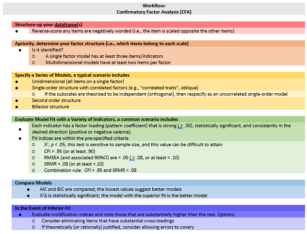

# CFA: Hierarchical and Nested Models {#CFA2nd}

[Screencasted Lecture Link](https://www.youtube.com/playlist?list=PLtz5cFLQl4KPiMveC6qIqzdnZdMHsSn7o) 
 


This is the second lecture in our series on confirmatory factor analysis (CFA). In this lesson we will compare first-order structures (with correlated uncorrelated factors) to second-order and bifactor structures. Modification indices will alow us to tweak each model's fit. We will also determine and track the identification status of models, including nested/nesting models and examining issues of equivalent models.  

## Navigating this Lesson

The lecture is just under two hours. I would add another two-to-three hours to work through and digest the materials.

While the majority of R objects and data you will need are created within the R script that sources the chapter, occasionally there are some that cannot be created from within the R framework. Additionally, sometimes links fail.  All original materials are provided at the [Github site](https://github.com/lhbikos/ReC_Psychometrics) that hosts the book. More detailed guidelines for ways to access all these materials are provided in the OER's [introduction](#ReCintro).

### Learning Objectives

Focusing on this week's materials, make sure you can:

* Specify single order (correlated and uncorrelated), second order, and bifactor models.
* Interpret model adequacy and fit.
* Compare models on the basis of statistical criteria.
* Determine which (among models) is the nested model.
* Memorize which model (nested or nesting) will have better fit (without looking at the results).
* Determine whether or not models (or alterations to their specification) remain statistically identified.

### Planning for Practice

In each of these lessons I provide suggestions for practice that allow you to select one or more problems that are graded in difficulty. The least complex is to change the random seed and rework the problem demonstrated in the lesson. The results *should* map onto the ones obtained in the lecture. 

The second option involves utilizing one of the simulated datasets available in this OER. The [last lesson](#sims) in the OER contains three simulations that could be used for all of the statistics-based practice suggestions. Especially if you started with one of these examples in an earlier lesson, I highly recommend you continue with that.

Alternatively, Lewis and Neville's [-@lewis_construction_2015] Gendered Racial Microaggressions Scale for Black Women was used in the lessons for exploratory factor analysis and Conover et al.'s [-@conover_development_2017] Ableist Microaggressions Scale is used in the lesson on invariance testing. Both of these would be suitable for the CFA homework assignments.

As a third option, you are welcome to use data to which you have access and is suitable for CFA. This could include other simulated data, data found on an open access repository, data from the ReCentering Psych Stats survey described in the [Qualtrics lesson](#qualTRIX), or your own data (presuming you have permission to use it). 

The suggestion for practice spans the [prior chapter](#CFA1st) and this one . For this combination assignment, you should plan to:

* Prepare the data frame for CFA. 
* Specify and run unidimensional, single order (with correlated facrors), second-order, and bifactor models.
* Narrate the adequacy of fit with $\chi ^{2}$, CFI, RMSEA, SRMR. 
  - Write a mini-results section for each.
* Compare model fit with $\chi ^{2}\Delta$, AIC, and BIC.
* Write an APA style results sections with table(s) and figures.

In preparing this chapter, I drew heavily from the following resource(s). Other resources are cited (when possible, linked) in the text with complete citations in the reference list.

* Byrne, B. M. (2016). Application 3: Testing the Factorial Validity of Scores from a Measurement Scale (Second-Order CFA model). Chapter 5. In Structural Equation Modeling with AMOS: Basic Concepts, Applications, and Programming, Third Edition. Taylor & Francis Group. http://ebookcentral.proquest.com/lib/spu/detail.action?docID=4556523

* Dekay, Nicole (2021). Quick Reference Guide: The statistics for psychometrics  https://www.humanalysts.com/quick-reference-guide-the-statistics-for-psychometrics

* Flora, D. B. (2020). Your Coefficient Alpha Is Probably Wrong, but Which Coefficient Omega Is Right? A Tutorial on Using R to Obtain Better Reliability Estimates. Advances in Methods and Practices in Psychological Science, 3(4), 484–501. https://doi.org/10.1177/2515245920951747

* Kline, R. (2016). Principles and practice of structural equation modeling (Fourth ed., Methodology in the social sciences). New York: The Guilford Press.
  - Chapter 6:  Specification of Observed-Variable (Path Models) 
  - Chapter 7:  Identification of Observed-Variable (Path) Models *
  - Chapter 9:  Specification and Identification of Confirmatory Factor Analysis Models
  - Chapter 13:  Analysis of Confirmatory Factor Analysis Models
    
* Rosseel, Y. (2019). The *lavaan* tutorial. Belgium: Department of Data Analysis, Ghent University. http://lavaan.ugent.be/tutorial/tutorial.pdf 

### Packages

The packages used in this lesson are embedded in this code. When the hashtags are removed, the script below will (a) check to see if the following packages are installed on your computer and, if not (b) install them.

```r
#will install the package if not already installed
#if(!require(lavaan)){install.packages("lavaan")}
#if(!require(semPlot)){install.packages("semPlot")}
#if(!require(psych)){install.packages("psych")}
#if(!require(semTable)){install.packages("semTable")}
#if(!require(semTools)){install.packages("semTools")}
```

## CFA Workflow

Below is a screenshot of a CFA workflow. The original document is located in the [Github site](https://github.com/lhbikos/ReC_Psychometrics) that hosts the ReCentering Psych Stats:  Psychometrics OER.



Because the intended audience for the ReCentering Psych Stats OER is the scientist-practitioner-advocate, this lesson focuses on the typical workflow and associated decisions. As you might guess, the details of CFA can be quite complex and require more investigation and decision-making in models that pose more complexity or empirical challenges. The following are the general steps in a CFA.

* Creating an items only dataframe where any items are scaled in the same direction (e.g., negatively worded items are reverse-scored).
* Determining a factor structure that is *identified*, that is
  - a single factor (unidimensional) model has at least three items/indicators
  - a multidimensional models with at least two items per factor
* Specify a series of models, these typicallyinclude
  - a unidimensional model (all items on a single factor)
  - a single order structure with correlated factors
  - a second orer structure
  - a bifactor structure
* Evaluate model fit with a variety of indicators
  - factor loadings
  - fit indices
* Compare models
* In the event of poor model fit, investigate modification indices and consider respecification
  - eliminating items
  - changing factor membership
  - allowing errors to covary

## Another Look at Varying Factor Structures

In this lecture we move into second-order and bifactor models, let's look again factor structures, considering unidimensional, first-order, and second-order variations.


Models A and B are **first-order models**.  Note that all factors are on a single plane.

* Model A is undimensional. Each item is influenced by a single common factor, and defined by a single term that includes systematic and random error.  Note that there is only one *systematic* source of variance for each item AND it is from a single source: F1.

* Model B is often referred to as a "correlated traits" model.  Here, the larger construct is separated into distinct-yet-correlated elements.  The variance of each item is assumed to be a weighted linear function of two or more common factors.  

* Model C is a second-order factor structure.  Rather than merely being correlated, factors are related because they share a common cause.  In this model, the second-order factor *explains* why three or more traits are correlated.  Note that there is no direct relationship between the item and the target construct.  Rather, the relationship between the second-order factor and each item is mediated through the primary factor (yes, an indirect effect!).

* Model D is a bifactor structure.  Here, each item loads on a general factor.  This general factor (bottom row) reflects what is common among the items and represents the individual differences on the target dimension that a researcher is most interested in.  Group factors (top row) are now specified as *orthogonal*.  The group factors represent common factors measured by the items that explain item response variation not accounted for by the general factor.  In some research scenarios, the group factors are termed "nuisance" dimensions.  That is, that which they have in common interferes with measuring the primary target of interest.

## Revisiting Model Identification

Model identification means it is *theoretically possible* for a statistical analysis to derive a unique estimate of every model parameter.  

*Theoretical* is emphasizes that identification is a property of the model and not the data; that is, it doesn't matter if the sample size is 100 or 10,000.  

CFA has the same general requirements for identification as other forms of SEM:

1. Every latent variable (including errors) must be scaled; and
2. Model degrees of freedom must be at least zero $(df_{M}\leq 0)$ (aka "the counting rule"; this means that there must be at least as many observations as there are free parameters)


### Identification Status 

**Underidentified** (or underdetermined) models violate the counting rule because there are more free parameters than observations.  

For example, solve this equation:  

$a + b = 6$.  

There are an infinite number of solutions:  4 + 2, 3 + 3, 2.5 + 3.5...and so on to $\infty$.  When the computing algorithm tries to solve this problem, it will fail to converge.

The parallel scenario in an SEM/CFA model with more free parameters than observations would have *negative df*.


**Just-identified** (or just-determined) models have a single unique solution, 

$(df_{M} = 0)$  

For example, for this set of equations:

$a + b = 6$  
$2a + b = 10$

The only answer is: $a = 4, b = 2$


**Overidentified** (or overdetermined) models have more observations than free parameters. That is: 

$df_{M} > 0$

For example, solve for this set of equations:

$a + b = 6$  
$2a + b = 10$  
$3a + b = 12$

There is no single solution that satisfies all three formulas, but there is a way to find a unique solution.  We can impose a statistical criterion that leads to the *overidentified/overdetermined* circumstance with more observations than free parameters.  For example, we could impose the *least squares criterion* (from regression, but with no intercept/constant in the prediction equation).  The constraint (instruction) would read:

*Find values of a and b that yield total scores such that the sum of squared differences between the observations (6, 10, 12) and these total scores is as small as possible (and also unique).*

In this case, answers are $a = 3.00, b = 3.33$ and the solutions are 6.44, 9.33, 12.33.  While the solution doesn't perfectly reproduce the data, it facilitates model testing.

**The bad news** is that SEM/CFA computer tools are generally not helpful in determining whether a model is identified or not.  Why?  Computers are great a numerical processing, but not symbolic processing (needed for determining identification status).  This means that we, the researchers, must learn the *identification heuristics* to determine the model's degree of identification.

*Need a break already?*  My [favorite scene](https://www.youtube.com/watch?v=_C25CwNlVjA) during **The Imitation Game** parallels issues of identification, iterations, and convergence. The Turing machine runs and runs until its users can feed it proper start values so that it finally converges on a solution.

Kenny [@kenny_sem_2012] provides some helpful guidelines in determining model identification with the calculation of *knowns* and *unknowns*.  In in a standard CFA/SEM specification, *knowns* are the number of covariances between all the variables in the model, $(k(k+1))/2$, where $k$ is the number of variables in the model.  *Unknowns* are the *free parameters* that must be calculated.  These include: paths; covariances between exogenous variables, between disturbances (error terms), and between exogenous variables and disturbances (error terms); variances of the exogenous variables; and disturbances (error terms) of the endogenous variables (minus the number of linear constraints).  

    * If $knowns \lt unknowns$ then the model is *under-identified*
    * If $knowns = unknowns$ then the model is *just-identified*
    * If $knowns \gt unknowns$ then the model is *overidentified*

### Identification in Practice

It is essential that every latent variable (including errors) must be scaled such that the degrees of freedom for the model be greater than or equal to zero ($df_{M} \geq 0$).

Operationally, in a standard CFA model:

1. A single factor model needs at least 3 indicators for the single factor.
2. Factor models with more than one factor require at least two or more indicators per factor.
    + For purposes of identification, more is better with 3-5 being recommended.
   
(Among other things) *nonstandard* models occur when:

* errors are allowed to correlate/covary
* *complex indicators* are defined by more than one factor

We will return to these as we encounter them later in today's lecture.  Essentially, we will need to "subtract" 1 df for every parameter we "free" to covary. This is because we then need to estimate it and it becomes "unknown."

**Empirical underidentification** is also a threat.  This means, the model fails to converge because of the characteristics of the data. For example, perhaps we specified model on the cusp of identification: 2 factors, correlated, with 2 indicators each.  If in fact, the data did not support the correlation between the two factors...because of the "just barely" identified circumstance, you may receive an "empirically underidentified" solution.

Today we are going to specify second-order and bifactor models.  As we do each, we will address these issues of model identification.

## Research Vignette

This lesson's research vignette emerges from Keum et al's Gendered Racial Microaggressions Scale for Asian American Women (GRMSAAW; [@keum_gendered_2018]). The article reports on two separate studies that comprised the development, refinement, and psychometric evaluation of two, parallel, versions (stress appraisal, frequency) of scale. I simulated data from the final construction of the frequency version as the basis of the lecture.  If the scale looks somewhat familiar it is because the authors used the Gendered Racial Microaggressions Scale for Black Women [@lewis_construction_2015] as a model. 

Keum et al. [-@keum_gendered_2018] reported support for a total scale score (22 items) and four subscales. Below, I list the four subscales, their number of items, and a single example item. At the outset, let me provide a content advisory For those who hold this particular identity (or related identities) the content in the items may be upsetting. In other lessons, I often provide a variable name that gives an indication of the primary content of the item. In the case of the GRMSAAW, I will simply provide an abbreviation of the subscale name and its respective item number. This will allow us to easily inspect the alignment of the item with its intended factor, and hopefully minimize discomfort. If you are not a member of this particular identity, I encourage you to learn about these microaggressions by reading the article in its entirety.  Please do not ask members of this group to explain why these microaggressions are harmful or ask if they have encountered them.  

There are 22 items on the GRMSAAW scale. Using the same item stems, the authors created two scales. One assesses frequency of the event, the second assesses the degree of stressfulness. I simulated data from the stessfulness scale. Its Likert style scaling included: 0 (*not at all stressful*), 1(*slightly stressful*), 2(*somewhat stressful*), 3(*moderately stressful*), 4(*very stressful*), and 5(*extremely stressful*).

The four factors, number of items, and sample item are as follows:

* Ascribed Submissiveness (9 items)
  - Others expect me to be submissive. (AS1)
  - Others have been surprised when I disagree with them. (AS2)
  - Others take my silence as a sign of compliance. (AS3)
  - Others have been surprised when I do things independent of my family. (AS4)
  - Others have implied that AAW seem content for being a subordinate. (AS5)
  - Others treat me as if I will always comply with their requests. (AS6)
  - Others expect me to sacrifice my own needs to take care of others (e.g., family, partner) because I am an AAW. (AS7)
  - Others have hinted that AAW are not assertive enough to be leaders. (AS8)
  - Others have hinted that AAW seem to have no desire for leadership. (AS9)
* Asian Fetishism (4 items)
  - Others express sexual interest in me because of my Asian appearance. (AF1)
  - Others take sexual interest in AAW to fulfill their fantasy. (AF2)
  - Others take romantic interest in AAW just because they never had sex with an AAW before. (AF3)
  - Others have treated me as if I am always open to sexual advances. (AF4)
* Media Invalidation (5 items)
  - I see non-Asian women being casted to play female Asian characters.(MI1)
  - I rarely see AAW playing the lead role in the media. (MI2)
  - I rarely see AAW in the media. (MI3)
  - I see AAW playing the same type of characters (e.g., Kung Fu woman, sidekick, mistress, tiger mom) in the media. (MI4)
  - I see AAW characters being portrayed as emotionally distant (e.g., cold-hearted, lack of empathy) in the media. (MI5)
* Assumptions of Universal Appearance (4 items)
  - Others have talked about AAW as if they all have the same facial features (e.g., eye shape, skin tone). (AUA1)
  - Others have suggested that all AAW look alike.(AUA2)
  - Others have talked about AAW as if they all have the same body type (e.g., petite, tiny, small-chested). (AUA3)
  - Others have pointed out physical traits in AAW that do not look 'Asian'.

Four additional scales were reported in the Keum et al. article [@keum_gendered_2018]. Fortunately, I was able to find factor loadings from the original psychometric article or subsequent publications. For multidimensional scales, I assign assign variable names according to the scale to which the item belongs (e.g., Env42). In contrast, when subscales or short unidimensional scales were used, I assigned variable names based on item content (e.g., "blue"). In my own work, I prefer item-level names so that I can quickly see (without having to look up the item names) how the items are behaving. The scales, their original citation, and information about how I simulated data for each are listed below. 

* **Racial Microaggressions Scale** (RMAS; [@torres-harding_racial_2012]) is a 32-item scale with Likert scaling ranging from 0 (*never*) to 3  (*often/frequent*). Higher scores represent greater frequency of perceived microaggressions. I simulated data at the subscale level. The RMAS has six subscales, but only four (Invisibility, Low-Achieving/Undesirable Culture, Foreigner/Not Belonging,and Environmental Invalidation) were used in the study. Data were simulated using factor loadings (from the four factors) in the source article. 
* **Schedule of Sexist Events** (SSE; [@klonoff_schedule_1995]) is a 20-item scale that with Likert scaling ranging from 1 (*the event has never happened to me*) to 6 (*the event happened almost all [i.e., more than 70%] of the time*). Higher scores represent greater frequency of everyday sexist events. I simulated data the subscale level. Within two larger scales (recent events, lifetime events), there are three subscales: Sexist Degradation and Its Consequences, Unfair/Sexist Events at Work/School, and Unfair Treatment in Distant and Close Relationships. Data were simulated using factor loadings fromthe source article.
* **PHQ-9** [@kroenke_phq-9_2001] is a 9-item scale with Likert scaling ranging from 0 (*not at all*) to 3 (*nearly every day*). Higher scores indicate higher levels of depression. I simulated data by estimating factor loadings from Brattmyr et al. [-@brattmyr_factor_2022].
* **Internalized Racism in Asian American Scale** (IRAAS [@choi_development_2017]) is a 14-item scale with Likert scaling ranging from 1 (*strongly disagree*) to 6 (*strongly agree*). Higher scores indicate greater internalized racism.  Data were simulated using the factor loadings from the bifactor model in the source article.

As you consider homework options, there is sufficient simulated data to use the RMAS, SSE, or IRAAS. 

Below, I walk through the data simulation. This is not an essential portion of the lesson, but I will lecture it in case you are interested. None of the items are negatively worded (relative to the other items), so there is no need to reverse-score any items.

Simulating the data involved using factor loadings, means, standard deviations, and correlations between the scales. Because the simulation will produce "out-of-bounds" values, the code below rescales the scores into the range of the Likert-type scaling and rounds them to whole values.


```r
#Entering the intercorrelations, means, and standard deviations from the journal article

Keum_GRMS_generating_model <- '
        #measurement model
        General =~ .50*AS1 + .44*AS2 + .50*AS3 + .33*AS4 + .58*AS5 + .49*AS6 + .51*AS7 + .53*AS8 + .50*AS9 + .53*AF1 + .74*AF2 + .54*AF3 + .52*AF4 + .64*AUA1 + .59*AUA2 + .67*AUA3 + .64*AUA4 + .59*MI1 + .50*MI2 + .52*MI3 + .40*MI4 + .55*MI5
        AS =~ .68*AS1 + .65*AS2 + .53*AS3 + .55*AS4 + .54*AS5 + .55*AS6 + .42*AS7 + .47*AS8 + .50*AS9
        AF =~ .63*AF1 + .45*AF2 + .56*AF3 + .54*AF4
        AUA =~ .55*AUA1 + .55*AUA2 + .31*AUA3 + .31*AUA4
        MI =~ .27*MI1 + .53*MI2 + .57*MI3 + .29*MI4 + .09*MI5
        RMAS_FOR =~ .66*FOR1 + .90*FOR2 + .63*FOR4
        RMAS_LOW =~ .64*LOW22 + .54*LOW23 + .49*LOW28 + .63*LOW29 + .58*LOW30 + .67*LOW32 + .67*LOW35 + .76*LOW36 + .72*LOW37
        RMAS_INV =~ .66*INV33 + .70*INV39 + .79*INV40 + .71*INV41 + .71*INV47 + .61*INV49 + .65*INV51 + .70*INV52
        RMAS_ENV =~ .71*ENV42 + .70*ENV43 + .74*ENV44 + .57*ENV45 + .54*ENV46
        
        SSEL_Deg =~ .77*LDeg18 + .73*LDeg19 + .71*LDeg21 + .71*LDeg15 + .67*LDeg16 + .67*LDeg13 + .62*LDeg14 + .58*LDeg20
        SSEL_dRel =~ .69*LdRel4 + .68*LdRel6 + .64*LdRel7 + .64*LdRel5 + .63*LdRel1 + .49*LdRel3
        SSEL_cRel =~ .73*LcRel11 + .68*LcRel9 + .66*LcRel23
        SSEL_Work =~ .73*LWork17 + .10*LWork10 + .64*LWork2
        
        SSER_Deg =~ .72*RDeg15 + .71*RDeg21 + .69*RDeg18 + .68*RDeg16 + .68*RDeg13 + .65*RDeg19 + .58*RDeg14 + .47*RDeg20
        SSER_dRel =~ .74*RDeg4 + .67*RDeg6 + .64*RDeg5 + .54*RDeg7 + .51*RDeg1
        SSER_cRel =~ .69*RcRel9 + .59*RcRel11 + .53*RcRel23
        SSER_Work =~ .72*RWork10 + .67*RWork2 + .62*RWork17 + .51*RWork3
        
        SSE_Lifetime =~ SSEL_Deg + SSEL_dRel + SSEL_cRel + SSEL_Work
        SSE_Recent =~ SSER_Deg + SSER_dRel + SSEL_cRel + SSER_Work
        
        PHQ9 =~ .798*anhedonia + .425*down +  .591*sleep +  .913*lo_energy +  .441*appetite +  .519*selfworth +  .755*concentration +  .454*too_slowfast + .695*s_ideation
        
        gIRAAS =~ .51*SN1 + .69*SN2 + .63*SN3 + .65*SN4 + .67*WS5 + .60*WS6 + .74*WS7 + .44*WS8 + .51*WS9 + .79*WS10 + .65*AB11 + .63*AB12 + .68*AB13 + .46*AB14
        SelfNegativity =~ .60*SN1 + .50*SN2 + .63*SN3 + .43*SN4
        WeakStereotypes =~ .38*WS5 + .22*WS6 + .10*WS7 + .77*WS8 + .34*WS9 + .14*WS10
        AppearanceBias =~ .38*AB11 + .28*AB12 + .50*AB13 + .18*AB14
        
        
        #Means
        #Keum et al reported total scale scores, I divided those totals by the number of items per scale for  mean scores
         AS ~ 3.25*1
         AF ~ 3.34*1
         AUA ~ 4.52
         MI ~ 5.77*1
         General ~ 3.81*1
         RMAS_FOR ~ 3.05*1
         RMAS_LOW ~ 2.6*1
         RMAS_INV ~ 2.105*1
         RMAS_ENV ~ 3.126*1
         SSEL_Deg ~ 2.55*1
         SSEL_dRel ~ 1.96*1
         SSEL_cRel ~ 3.10*1
         SSEL_Work ~ 1.66*1
         SSER_Deg ~ 2.02*1
         SSER_dRel ~ 1.592*1
         SSER_cRel ~ 1.777*1
         SSER_Work ~ 1.3925*1
         SSER_Lifetime ~ 2.8245*1
         SSER_Recent ~ 2.4875*1
         PHQ9 ~ 1.836*1
         gIRAAS ~ 2.246*1
         
        #Correlations
         AS ~~ .00*AF
         AS ~~ .00*AUA
         AS ~~ .00*MI
         AS ~~ .00*General
         AS ~~ .28*RMAS_FOR
         AS ~~ .24*RMAS_LOW
         AS ~~ .46*RMAS_INV
         AS ~~ .16*RMAS_ENV
         AS ~~ .40*SSE_Lifetime
         AS ~~ .28*SSE_Recent
         AS ~~ .15*PHQ9
         AS ~~ .13*gIRAAS
         
         AF ~~ .00*AUA
         AF ~~ .00*MI
         AF ~~ .00*General
         AF ~~ .02*RMAS_FOR
         AF ~~ .05*RMAS_LOW
         AF ~~ .11*RMAS_INV
         AF ~~ .07*RMAS_ENV
         AF ~~ .34*SSE_Lifetime
         AF ~~ .27*SSE_Recent
         AF ~~ -.04*PHQ9
         AF ~~ .21*gIRAAS
          
         AUA ~~ .00*MI
         AUA ~~ .00*General
         AUA ~~ .18*RMAS_FOR
         AUA ~~ .20*RMAS_LOW
         AUA ~~ .01*RMAS_INV
         AUA ~~ -.04*RMAS_ENV
         AUA ~~ .02*SSE_Lifetime
         AUA ~~ .92*SSE_Recent
         AUA ~~ .02*PHQ9
         AUA ~~ .17*gIRAAS
         
        
         MI ~~ .00*General
         MI ~~ -.02*RMAS_FOR
         MI ~~ .08*RMAS_LOW
         MI ~~ .31*RMAS_INV
         MI ~~ .36*RMAS_ENV
         MI ~~ .15*SSE_Lifetime
         MI ~~ .08*SSE_Recent
         MI ~~ -.05*PHQ9
         MI ~~ -.03*gIRAAS
         
         General ~~ .34*RMAS_FOR
         General ~~ .63*RMAS_LOW
         General ~~ .44*RMAS_INV
         General ~~ .45*RMAS_ENV
         General ~~ .54*SSE_Lifetime
         General ~~ .46*SSE_Recent
         General ~~ .31*PHQ9
         General ~~ -.06*gIRAAS
         
         RMAS_FOR ~~ .57*RMAS_LOW
         RMAS_FOR ~~ .56*RMAS_INV
         RMAS_FOR ~~ .37*RMAS_ENV
         RMAS_FOR ~~ .33*SSE_Lifetime
         RMAS_FOR ~~ .25*SSE_Recent
         RMAS_FOR ~~ .10*PHQ9
         RMAS_FOR ~~ .02*gIRAAS
         
         RMAS_LOW ~~ .69*RMAS_INV
         RMAS_LOW ~~ .48*RMAS_ENV
         RMAS_LOW ~~ .67*SSE_Lifetime
         RMAS_LOW ~~ .57*SSE_Recent
         RMAS_LOW ~~ .30*PHQ9
         RMAS_LOW ~~ .16*gIRAAS
         
         RMAS_INV ~~ .59*RMAS_ENV
         RMAS_INV ~~ .63*SSE_Lifetime
         RMAS_INV ~~ .52*SSE_Recent
         RMAS_INV ~~ .32*PHQ9
         RMAS_INV ~~ .23*gIRAAS
         
         RMAS_ENV ~~ .46*SSE_Lifetime
         RMAS_ENV ~~ .31*SSE_Recent
         RMAS_ENV ~~ .11*PHQ9
         RMAS_ENV ~~ .07*gIRAAS
         
         SSE_Lifetime ~~ .83*SSE_Recent
         SSE_Lifetime ~~ .30*PHQ9
         SSE_Lifetime ~~ .14*gIRAAS
         
         SSE_Recent ~~ .30*PHQ9
         SSE_Recent ~~ .20*gIRAAS
         
         PHQ9 ~~ .18*gIRAAS
         
       
         #Correlations between SES scales from the Klonoff and Landrine article
         #Note that in the article the factor orders were reversed
         SSEL_Deg ~~ .64*SSEL_dRel
         SSEL_Deg ~~ .61*SSEL_cRel
         SSEL_Deg ~~ .50*SSEL_Work
         SSEL_dRel ~~ .57*SSEL_cRel
         SSEL_dRel ~~ .57*SSEL_Work
         SSEL_cRel ~~ .47*SSEL_Work
         
         SSER_Deg ~ .54*SSER_dRel
         SSER_Deg ~ .54*SSER_Work
         SSER_Deg ~ .59*SSER_cRel
         SSER_dRel ~ .56*SSER_Work
         SSER_dRel ~ .46*SSER_cRel
         SSER_Work ~ .43*SSER_cRel
         
         SSE_Lifetime ~ .75*SSE_Recent
        
        '

set.seed(240311)
dfGRMSAAW <- lavaan::simulateData(model = Keum_GRMS_generating_model,
                              model.type = "sem",
                              meanstructure = T,
                              sample.nobs=304,
                              standardized=FALSE)

#used to retrieve column indices used in the rescaling script below
col_index <- as.data.frame(colnames(dfGRMSAAW))

#The code below loops through each column of the dataframe and assigns the scaling accordingly
#Rows 1 thru 22 are the GRMS items
#Rows 23 thru 47 are the RMAS
#Rows 48 thru 87 are the SSE
#Rows 88 thru 96 are the PHQ9
#Rows 97 thru 110 are the IRAAS
#Rows 111 thru 112 are scale scores for SSE

for(i in 1:ncol(dfGRMSAAW)){  
  if(i >= 1 & i <= 22){   
    dfGRMSAAW[,i] <- scales::rescale(dfGRMSAAW[,i], c(0, 5))
  }
    if(i >= 23 & i <= 47){   
    dfGRMSAAW[,i] <- scales::rescale(dfGRMSAAW[,i], c(0, 3))
    }
  if(i >= 48 & i <= 87){   
    dfGRMSAAW[,i] <- scales::rescale(dfGRMSAAW[,i], c(1, 6))
  }
    if(i >= 88 & i <= 96){   
    dfGRMSAAW[,i] <- scales::rescale(dfGRMSAAW[,i], c(0, 3))
    }
    if(i >= 97 & i <= 110){   
    dfGRMSAAW[,i] <- scales::rescale(dfGRMSAAW[,i], c(1, 6))
  }
}

#rounding to integers so that the data resembles that which was collected
library(tidyverse)
dfGRMSAAW <- dfGRMSAAW %>% round(0) 

#quick check of my work
#psych::describe(dfGRMSAAW) 
```

The optional script below will let you save the simulated data to your computing environment as either an .rds object or a .csv file. 

An .rds file preserves all formatting to variables prior to the export and re-import.  For the purpose of this chapter, you don't need to do either. That is, you can re-simulate the data each time you work the problem.

```r
# to save the df as an .rds (think 'R object') file on your computer;
# it should save in the same file as the .rmd file you are working
# with saveRDS(dfGRMSAAW, 'dfGRMSAAW.rds') bring back the simulated
# dat from an .rds file dfGRMSAAW <- readRDS('dfGRMSAAW.rds')
```

If you save the .csv file (think "Excel lite") and bring it back in, you will lose any formatting (e.g., ordered factors will be interpreted as character variables).

```r
# write the simulated data as a .csv write.table(dfGRMSAAW,
# file='dfGRMSAAW.csv', sep=',', col.names=TRUE, row.names=FALSE)
# bring back the simulated dat from a .csv file dfGRMSAAW <- read.csv
# ('dfGRMSAAW.csv', header = TRUE)
```

## A Quick *lavaan* Syntax Recap

* It's really just regression
    + tilda (~, *is regressed on*) is the regression operator 
    + place DV (y) on left side of the regression operator
    + place IVs, separated by +, on the right of the regression operator  

* f is a latent variable (LV)  

* Example:  y ~ f1 + f2 + x1 + x2  

* LVs must be *defined* by their manifest or latent indicators.  
    + the special operator (=~, *is measured/defined by*) is used for this
    + Example:  f1 =~ y1 + y2 + y3  
  
* Variances and covariances are specified with a double tilde operator (~~, *is correlated with*)
    + Example of variance:  y1 ~~ y1 (variable's relationship with itself)
    + Example of covariance:  y1 ~~ y2 (relationship with another variable)
    + Example of covariance of a factor:  f1 ~~ f2  
  
* Intercepts (~ 1) for observed variables and LVs are simple, intercept-only regression formulas.  
    + Example of variable intercept:  y1 ~ 1
    + Example of factor intercept:  f1 ~ 1  
  
* A complete lavaan model is a combination of these formula types, enclosed between single quotation marks.  Readability of model syntax is improved by:  
    + splitting formulas over multiple lines
    + using blank lines within single quote
    + labeling with the hashtag

CFAmodel <- '  
f1 =~ y1 + y2 + y3  
f2 =~ y4 + y5 + y6  
f3 =~ y7 + y8 + y9 + y10  
'  
Behind the scenes the *cfa()* function:

* fixes the factor loading of the first indicator of an LV to 1 (setting the scale)
* automatically adds residual variances (required)
* correlates all exogenous LVs; to turn these off add the following statement to the *cfa()* function statement: *orthogonal = TRUE*

## Comparing and Tweaking Multidimensional First-Order Models

In the prior lesson we examined unidimensional and multidimensional variants of the GRMSAAW.  Our work determined that the first-order structure that included four correlated factors was superior to a unidimensional measure. Starting with the multidimensional model (four factors), let's specify both correlated and uncorrelated options and compare them.  We'll choose the best and see if we can further "tweak"" it into acceptable fit.

## An Uncorrelated Factors Model

### Specifying the Model

In the absence of a more complex (e.g,. second-order) structure, *lavaan's* *cfa()* function automatically correlates first-order factors.  However, the more parsimonious model is one with uncorrelated factors.  We'll run it first.  To do so, we need to turn off the default so that factors will be uncorrelated.  This is accomplished in the *cfa()* function script with *orthogonal = TRUE*.

In the first step we specify the equations in our model.


```r
grmsAAW4mod <- "AS =~ AS1 + AS2 + AS3 + AS4 + AS5 + AS6 + AS7 + AS8 + AS9
             AF =~ AF1 + AF2 + AF3 + AF4 
             MI =~ MI1 + MI2 + MI3 + MI4 + MI5
             AUA =~ AUA1 + AUA2 + AUA3 + AUA4"
grmsAAW4mod
```

```
[1] "AS =~ AS1 + AS2 + AS3 + AS4 + AS5 + AS6 + AS7 + AS8 + AS9\n             AF =~ AF1 + AF2 + AF3 + AF4 \n             MI =~ MI1 + MI2 + MI3 + MI4 + MI5\n             AUA =~ AUA1 + AUA2 + AUA3 + AUA4"
```

The next code will run the model. This is where we insert *orthogonal = TRUE*.

```r
# next, use the cfa function to apply the model to the data
uncorrF <- lavaan::cfa(grmsAAW4mod, data = dfGRMSAAW, orthogonal = TRUE)
lavaan::summary(uncorrF, fit.measures = TRUE, standardized = TRUE, rsquare = TRUE)
```

```
lavaan 0.6.17 ended normally after 44 iterations

  Estimator                                         ML
  Optimization method                           NLMINB
  Number of model parameters                        44

  Number of observations                           304

Model Test User Model:
                                                      
  Test statistic                               461.102
  Degrees of freedom                               209
  P-value (Chi-square)                           0.000

Model Test Baseline Model:

  Test statistic                              1439.317
  Degrees of freedom                               231
  P-value                                        0.000

User Model versus Baseline Model:

  Comparative Fit Index (CFI)                    0.791
  Tucker-Lewis Index (TLI)                       0.769

Loglikelihood and Information Criteria:

  Loglikelihood user model (H0)              -8395.340
  Loglikelihood unrestricted model (H1)      -8164.789
                                                      
  Akaike (AIC)                               16878.679
  Bayesian (BIC)                             17042.229
  Sample-size adjusted Bayesian (SABIC)      16902.683

Root Mean Square Error of Approximation:

  RMSEA                                          0.063
  90 Percent confidence interval - lower         0.055
  90 Percent confidence interval - upper         0.071
  P-value H_0: RMSEA <= 0.050                    0.003
  P-value H_0: RMSEA >= 0.080                    0.000

Standardized Root Mean Square Residual:

  SRMR                                           0.151

Parameter Estimates:

  Standard errors                             Standard
  Information                                 Expected
  Information saturated (h1) model          Structured

Latent Variables:
                   Estimate  Std.Err  z-value  P(>|z|)   Std.lv  Std.all
  AS =~                                                                 
    AS1               1.000                               0.552    0.603
    AS2               1.169    0.139    8.425    0.000    0.646    0.639
    AS3               0.931    0.124    7.534    0.000    0.515    0.548
    AS4               0.904    0.121    7.451    0.000    0.499    0.540
    AS5               1.138    0.135    8.453    0.000    0.629    0.642
    AS6               0.653    0.094    6.935    0.000    0.361    0.493
    AS7               0.800    0.118    6.785    0.000    0.442    0.479
    AS8               0.899    0.121    7.443    0.000    0.496    0.539
    AS9               0.770    0.106    7.291    0.000    0.426    0.525
  AF =~                                                                 
    AF1               1.000                               0.591    0.659
    AF2               0.881    0.151    5.851    0.000    0.521    0.536
    AF3               0.665    0.126    5.287    0.000    0.393    0.445
    AF4               0.943    0.159    5.950    0.000    0.557    0.566
  MI =~                                                                 
    MI1               1.000                               0.426    0.511
    MI2               1.136    0.209    5.447    0.000    0.484    0.549
    MI3               1.475    0.264    5.589    0.000    0.629    0.614
    MI4               1.089    0.212    5.139    0.000    0.464    0.483
    MI5               0.614    0.166    3.703    0.000    0.262    0.297
  AUA =~                                                                
    AUA1              1.000                               0.590    0.579
    AUA2              0.950    0.148    6.401    0.000    0.560    0.628
    AUA3              0.745    0.124    6.027    0.000    0.439    0.535
    AUA4              0.928    0.149    6.243    0.000    0.547    0.576

Covariances:
                   Estimate  Std.Err  z-value  P(>|z|)   Std.lv  Std.all
  AS ~~                                                                 
    AF                0.000                               0.000    0.000
    MI                0.000                               0.000    0.000
    AUA               0.000                               0.000    0.000
  AF ~~                                                                 
    MI                0.000                               0.000    0.000
    AUA               0.000                               0.000    0.000
  MI ~~                                                                 
    AUA               0.000                               0.000    0.000

Variances:
                   Estimate  Std.Err  z-value  P(>|z|)   Std.lv  Std.all
   .AS1               0.535    0.050   10.643    0.000    0.535    0.637
   .AS2               0.603    0.059   10.283    0.000    0.603    0.591
   .AS3               0.618    0.056   11.065    0.000    0.618    0.700
   .AS4               0.607    0.055   11.117    0.000    0.607    0.709
   .AS5               0.563    0.055   10.248    0.000    0.563    0.587
   .AS6               0.407    0.036   11.386    0.000    0.407    0.757
   .AS7               0.654    0.057   11.451    0.000    0.654    0.770
   .AS8               0.602    0.054   11.122    0.000    0.602    0.710
   .AS9               0.477    0.043   11.209    0.000    0.477    0.725
   .AF1               0.454    0.065    6.992    0.000    0.454    0.565
   .AF2               0.672    0.071    9.516    0.000    0.672    0.713
   .AF3               0.627    0.059   10.659    0.000    0.627    0.802
   .AF4               0.658    0.073    8.991    0.000    0.658    0.679
   .MI1               0.516    0.053    9.801    0.000    0.516    0.739
   .MI2               0.543    0.059    9.205    0.000    0.543    0.698
   .MI3               0.652    0.082    7.959    0.000    0.652    0.622
   .MI4               0.710    0.070   10.164    0.000    0.710    0.767
   .MI5               0.706    0.061   11.654    0.000    0.706    0.912
   .AUA1              0.689    0.075    9.140    0.000    0.689    0.664
   .AUA2              0.482    0.059    8.205    0.000    0.482    0.606
   .AUA3              0.483    0.049    9.827    0.000    0.483    0.714
   .AUA4              0.605    0.066    9.201    0.000    0.605    0.669
    AS                0.305    0.058    5.229    0.000    1.000    1.000
    AF                0.349    0.076    4.605    0.000    1.000    1.000
    MI                0.182    0.050    3.659    0.000    1.000    1.000
    AUA               0.348    0.081    4.312    0.000    1.000    1.000

R-Square:
                   Estimate
    AS1               0.363
    AS2               0.409
    AS3               0.300
    AS4               0.291
    AS5               0.413
    AS6               0.243
    AS7               0.230
    AS8               0.290
    AS9               0.275
    AF1               0.435
    AF2               0.287
    AF3               0.198
    AF4               0.321
    MI1               0.261
    MI2               0.302
    MI3               0.378
    MI4               0.233
    MI5               0.088
    AUA1              0.336
    AUA2              0.394
    AUA3              0.286
    AUA4              0.331
```
Producing a figure can be useful to represent what we did to others as well as checking our own work. That is, "Did we think we did what we intended?"  When the *what = "col", whatLabels = "stand"* combination is shown, paths that are "fixed" are represented by dashed lines. Below, we expect to see each of the four factors predicting only the items associated with their factor. One item for each factor (the first on the left) should be specified as the indicator variable (and represented with a dashed line). Additionally, the factors/latent variables should not be freed to covary (i.e., an uncorrelated traits or orthogonal model). Because they are "fixed" to be 0.00, they will be represented with dashed (not solid) curves with double-headed arrows.


```r
semPlot::semPaths(uncorrF, layout = "tree", style = "lisrel", what = "col",
    whatLabels = "stand")
```

<!-- -->

Among my first steps are also to write the code to export the results. The *tidySEM* package has useful functions to export the fit statistics, parameter extimates, and correlations among the latent variables (i.e., factors).


```r
UncorrFitStats <- tidySEM::table_fit(uncorrF)
```

```
Registered S3 method overwritten by 'tidySEM':
  method          from  
  predict.MxModel OpenMx
```

```r
Uncorr_paramEsts <- tidySEM::table_results(uncorrF, digits=3, columns = NULL)
UncorrCorrs <- tidySEM::table_cors(uncorrF, digits=3)
#to see each of the tables, remove the hashtab
#Uncorr_FitStats
#Uncorr_paramEsts
#UncorrCorrs
```

Next, I export them.

```r
write.csv(UncorrFitStats, file = "UncorrFitStats.csv")
write.csv(Uncorr_paramEsts, file = "Uncorr_paramEsts.csv")
write.csv(UncorrCorrs, file = "UncorrCorrs.csv")
```


### Interpreting the Output

|Criteria                       | Our Results                         | Criteria met?|
|:------------------------------|:-----------------------------------:|:------------:|
|Factor loadings significant, strong, proper valence |AS: .59 to .80; AF: .64 to .82; MI: .35 to .62; AUA: .49 to .82 |Yes           | 
|Non-significant chi-square     |$\chi ^{2}(209) = 461.102, p < 0.001$  |No           |  
|$CFI\geq .90$ or $.95$                  |CFI =  0.791                           |No           |  
|$RMSEA\leq .05$ (but definitely < .10)|RMSEA = 0.063, 90%CI(0.055, 0.071)|Yes (with caution)        |  
|$SRMR\leq .08$ (but definitely < .10) |SRMS = 0.151                   |No| 
|Combination rule: $CFI \geq .95$ and $SRMR \leq .08$|CFI = 0.791, SRS = 0.151|No     |

### Partial Write-up

>**Uncorrelated factors model**. Our model where factors were fixed to remain uncorrelated demonstrated less than adequate fit to the data: $\chi ^{2}(209)  = 461.102, p < 0.001$, CFI = 0.791, RMSEA = 0.063, 90%CI(0.055, 0.071), SRMR = 0.151.  Factor loadings ranged from .59 to .80 for the AS scale, .64 to .82 for the AF scale, .35 to .62 for the MI scale, and .49 to .82 for the fear of AUA scale.

Our fit is not satisfactory. We can expect the correlated factors model should have a better fit. Instead of "tweaking" this one, let's move onto the correlated factors model.

## A Correlated Factors Model

Let's revisit the statement I just made: *...the correlated factors model should have a better fit.*  Why did I make this statement?  It's all about degrees of freedom and whether the model is the nested or nesting model.

### Nested Models

When we specify (i.e., draw) models in SEM/CFA, we often think that the paths (single headed arrows/paths, double-headed arrows/covariances) between the parameters are our hypotheses.  They are, but they are *soft hypotheses* in that we are *freeing* the elements to covary. The *hard hypotheses* (i.e., no paths, no covariances) states that the parameters are unrelated. We are trying to explain the covariance matrix (where all parameters are freed to covary) with the fewest paths possible. That is, we are freeing the relations between our hypothesized parameters and restricting all others to be zero.

Two models are **nested** (aka **hierarchical**) if one is a proper subset of the other.  The **nesting** model is the one with the most parameters freed to covary.  That is, it has more paths/covariances drawn on it.  Almost always, the **nesting model** (i.e., most sticks, fewer degrees of freedom) will have better fit than the **nested** model (i.e., fewer sticks, more degrees of freedom).  

In our example, *uncorrF* has four uncorrelated factors and its degrees of freedom was 209.

Our new model will *add covariances* (making it the *nesting model* with presumed better fit) to all possible combinations of the four factors (we end up with 6 covariance paths).  Freeing these additional factors to covary in the corrF model (recall they were fixed to 0.0 in the uncorrF model) leads to a model with 203 degrees of freedom.  The degrees of freedom are lower because the algorithm now needs to estimate 6 additional covariances/parameters (i.e., $209 - 6 = 203$).

Model fit (generally) improves when paths/covariances are added (and degrees of freedom decreases). The model with the *most paths* (I think of "sticks" in a nest) and the *fewest df* is the *nesting model* and it (almost) always has superior fit.

Let's try. We continue to use the model of equations we specified for the orthogonal, uncorrelated traits, model.


```r
# in our 4-factor models we can use the same baseM, the difference
# here is that we deleted 'orthogonal = TRUE' uncorrF <-
# lavaan::cfa(grmsAAW4mod, data = dfGRMSAAW, orthogonal = TRUE) #for
# comparison, this was the uncorrelated model
corrF <- lavaan::cfa(grmsAAW4mod, data = dfGRMSAAW)
lavaan::summary(corrF, fit.measures = TRUE, standardized = TRUE, rsquare = TRUE)
```

```
lavaan 0.6.17 ended normally after 42 iterations

  Estimator                                         ML
  Optimization method                           NLMINB
  Number of model parameters                        50

  Number of observations                           304

Model Test User Model:
                                                      
  Test statistic                               232.453
  Degrees of freedom                               203
  P-value (Chi-square)                           0.076

Model Test Baseline Model:

  Test statistic                              1439.317
  Degrees of freedom                               231
  P-value                                        0.000

User Model versus Baseline Model:

  Comparative Fit Index (CFI)                    0.976
  Tucker-Lewis Index (TLI)                       0.972

Loglikelihood and Information Criteria:

  Loglikelihood user model (H0)              -8281.015
  Loglikelihood unrestricted model (H1)      -8164.789
                                                      
  Akaike (AIC)                               16662.030
  Bayesian (BIC)                             16847.882
  Sample-size adjusted Bayesian (SABIC)      16689.307

Root Mean Square Error of Approximation:

  RMSEA                                          0.022
  90 Percent confidence interval - lower         0.000
  90 Percent confidence interval - upper         0.034
  P-value H_0: RMSEA <= 0.050                    1.000
  P-value H_0: RMSEA >= 0.080                    0.000

Standardized Root Mean Square Residual:

  SRMR                                           0.047

Parameter Estimates:

  Standard errors                             Standard
  Information                                 Expected
  Information saturated (h1) model          Structured

Latent Variables:
                   Estimate  Std.Err  z-value  P(>|z|)   Std.lv  Std.all
  AS =~                                                                 
    AS1               1.000                               0.550    0.600
    AS2               1.132    0.136    8.330    0.000    0.623    0.617
    AS3               0.958    0.123    7.769    0.000    0.527    0.561
    AS4               0.901    0.120    7.504    0.000    0.496    0.536
    AS5               1.152    0.134    8.620    0.000    0.634    0.647
    AS6               0.669    0.094    7.133    0.000    0.368    0.503
    AS7               0.829    0.118    7.043    0.000    0.456    0.495
    AS8               0.905    0.120    7.551    0.000    0.498    0.540
    AS9               0.757    0.104    7.256    0.000    0.417    0.514
  AF =~                                                                 
    AF1               1.000                               0.505    0.563
    AF2               1.195    0.174    6.862    0.000    0.603    0.621
    AF3               0.738    0.137    5.395    0.000    0.373    0.422
    AF4               1.138    0.171    6.665    0.000    0.575    0.584
  MI =~                                                                 
    MI1               1.000                               0.482    0.577
    MI2               0.917    0.148    6.216    0.000    0.442    0.501
    MI3               1.169    0.177    6.602    0.000    0.563    0.550
    MI4               0.921    0.157    5.865    0.000    0.444    0.461
    MI5               0.688    0.137    5.018    0.000    0.332    0.377
  AUA =~                                                                
    AUA1              1.000                               0.553    0.543
    AUA2              0.981    0.140    7.016    0.000    0.543    0.608
    AUA3              0.785    0.122    6.457    0.000    0.434    0.528
    AUA4              1.083    0.152    7.140    0.000    0.599    0.630

Covariances:
                   Estimate  Std.Err  z-value  P(>|z|)   Std.lv  Std.all
  AS ~~                                                                 
    AF                0.148    0.030    4.951    0.000    0.533    0.533
    MI                0.136    0.028    4.889    0.000    0.513    0.513
    AUA               0.181    0.034    5.257    0.000    0.595    0.595
  AF ~~                                                                 
    MI                0.154    0.031    5.010    0.000    0.632    0.632
    AUA               0.164    0.034    4.805    0.000    0.588    0.588
  MI ~~                                                                 
    AUA               0.189    0.036    5.303    0.000    0.709    0.709

Variances:
                   Estimate  Std.Err  z-value  P(>|z|)   Std.lv  Std.all
   .AS1               0.538    0.050   10.833    0.000    0.538    0.640
   .AS2               0.632    0.059   10.699    0.000    0.632    0.620
   .AS3               0.605    0.054   11.111    0.000    0.605    0.685
   .AS4               0.610    0.054   11.260    0.000    0.610    0.713
   .AS5               0.557    0.053   10.408    0.000    0.557    0.581
   .AS6               0.401    0.035   11.433    0.000    0.401    0.747
   .AS7               0.641    0.056   11.470    0.000    0.641    0.755
   .AS8               0.601    0.053   11.235    0.000    0.601    0.708
   .AS9               0.484    0.043   11.379    0.000    0.484    0.736
   .AF1               0.548    0.055    9.928    0.000    0.548    0.683
   .AF2               0.579    0.064    9.062    0.000    0.579    0.614
   .AF3               0.642    0.057   11.230    0.000    0.642    0.822
   .AF4               0.638    0.066    9.651    0.000    0.638    0.659
   .MI1               0.465    0.047    9.823    0.000    0.465    0.667
   .MI2               0.582    0.055   10.664    0.000    0.582    0.749
   .MI3               0.731    0.072   10.158    0.000    0.731    0.697
   .MI4               0.729    0.066   10.994    0.000    0.729    0.787
   .MI5               0.665    0.058   11.519    0.000    0.665    0.858
   .AUA1              0.730    0.069   10.535    0.000    0.730    0.705
   .AUA2              0.501    0.051    9.787    0.000    0.501    0.630
   .AUA3              0.487    0.046   10.675    0.000    0.487    0.721
   .AUA4              0.546    0.058    9.475    0.000    0.546    0.603
    AS                0.303    0.058    5.264    0.000    1.000    1.000
    AF                0.255    0.058    4.412    0.000    1.000    1.000
    MI                0.232    0.051    4.559    0.000    1.000    1.000
    AUA               0.306    0.070    4.391    0.000    1.000    1.000

R-Square:
                   Estimate
    AS1               0.360
    AS2               0.380
    AS3               0.315
    AS4               0.287
    AS5               0.419
    AS6               0.253
    AS7               0.245
    AS8               0.292
    AS9               0.264
    AF1               0.317
    AF2               0.386
    AF3               0.178
    AF4               0.341
    MI1               0.333
    MI2               0.251
    MI3               0.303
    MI4               0.213
    MI5               0.142
    AUA1              0.295
    AUA2              0.370
    AUA3              0.279
    AUA4              0.397
```
As we plot this model we expect to see each of the four factors predicting only the items associated with their factor, one item for each factor (the first on the left) specified as the indicator variable, and double-headed arrows between the factors/latent variables, indicating that they are free to covary (i.e., a correlated traits model).


```r
semPlot::semPaths(corrF, layout = "tree", style = "lisrel", what = "col",
    whatLabels = "stand")
```

<!-- -->

Among my first steps are also to write the code to export the results. The *tidySEM* package has useful functions to export the fit statistics, parameter extimates, and correlations among the latent variables (i.e., factors).


```r
CorrFitStats <- tidySEM::table_fit(corrF)
Corr_paramEsts <- tidySEM::table_results(corrF, digits=3, columns = NULL)
CorrCorrs <- tidySEM::table_cors(corrF, digits=3)
#to see each of the tables, remove the hashtab
#CorrFitStats
#Corr_paramEsts
#CorrCorrs
```

Next, I export them.

```r
write.csv(CorrFitStats, file = "CorrFitStats.csv")
write.csv(Corr_paramEsts, file = "Corr_paramEsts.csv")
write.csv(CorrCorrs, file = "CorrCorrs.csv")
```


### Interpreting the Output

|Criteria                       | Our Results                         | Criteria met?|
|:------------------------------|:-----------------------------------:|:------------:|
|Factor loadings significant, strong, proper valence|AS: .50 to .65; AF: .42 to .62; MI: .46 to .58; AUA: .54 to .63 |Yes           | 
|Non-significant chi-square     |$\chi ^{2}(203) = 232.453, p = 0.076$  |Yes           |  
|$CFI\geq .95$                  |CFI = 0.976                           |Yes           |  
|$RMSEA\leq .05$ (but definitely < .10)|RMSEA = 0.022, 90%CI(0.000, 0.034)|Yes          |  
|$SRMR\leq .08$ (but definitely < .10) |SRMR =  0.047                   |Yes           | 
|Combination rule: $CFI \geq .95$ and $SRMR \leq .08$|CFI = 0.976, SRS = 0.047|Yes     |

### Partial Write-up

>**Correlated factors model**. We evaluated a single-order, correlated factors model where each of the 22 items loaded onto one of four factors and the factors were free to correlate. Standardized pattern coefficients ranged between .37 and .60 on the AF factor, between .37 and .63 on the AS factor, between .33 and .56 on the MI factor, and between .43 and .60 on the AUA factor.  The Chi-square index was not statistically signficant ($\chi ^{2}(203)=232.453, p = 0.076$) indicating reasonable fit. The CFI value of 0.972 exceeded the recommendation of .95. The RMSEA = 0.022 (90%CI[.000, 0.034]) was satisfactory.  The SRMR value of 0.047 remained below the warning criteria of .10.  The AIC and BIC values were 16662.030 and 16847.882, respectively.

Recall that we can formally compare these models with the $\chi_{D}^{2}$, AIC, and BIC.


```r
lavaan::lavTestLRT(uncorrF, corrF)
```

```

Chi-Squared Difference Test

         Df   AIC   BIC  Chisq Chisq diff   RMSEA Df diff            Pr(>Chisq)
corrF   203 16662 16848 232.45                                                 
uncorrF 209 16879 17042 461.10     228.65 0.34938       6 < 0.00000000000000022
           
corrF      
uncorrF ***
---
Signif. codes:  0 '***' 0.001 '**' 0.01 '*' 0.05 '.' 0.1 ' ' 1
```

The AIC and BIC are flexible to compare nested and non-nested models. Models with the lower values are superior. Consistent with what we expect (i.e., the nesting model [the model with the most parameters and fewest degrees of freedom] should be superior), the AIC and BIC favor the correlated factors model.

The $\chi_{D}^{2}$ can only be used for nested models (where items/indicators are identical -- the only difference is the presence/absence of parameters).  If it is statistically significant, the better model is the one with the lower chi-square value (and better fit indices). In this particular comparison there is a statistically significant difference favoring the correlated factors model ($\chi ^{2}(6)=228.65, p < 0.001$).

To recap the highlights of nesting, the *nesting* model will usually have the best fit.  The *nesting* model has:

* the most free parameters 
    + (the most "sticks")
* the fewest degrees of freedom


Examining the two models we compared side-by-side (uncorrelated on left; correlated on right), we  note the additional "sticks" (i.e., the covariances that were freed) in the correlated factors model (i.e., the nesting model) and can guess (without analyzing the data) that it because it has (a) more sticks and (b) fewer degrees of freedom, it will have (c) better fit.

How to keep them straight: "the nested is within (or 'sits in' or 'fits in') the nesting model." I also think, "The nested sits within but the nesting will win." Just keep saying these until they "stick" (bad pun intended).

## Model Respecification

Our correlated factors model has excellent fit, but this is not always the case. One way to improve model fit is to add parameters to simpler models -- this is called **model building**.  This can only occur for models that are **overidentified** (i.e., they have positive degrees of freedom).  

In the CFA/psychometric case, an just-identified model is one that has at least 3 items per scale for a unidimensional factor structure and at least 2 items per scale in a multidimensional factor structure.  

As we "free" each parameter (i.e., add paths or covariances), we correspondingly decrease the df.  So we must be diligent when engaging in model building.

In the CFA/psychometric case, *freeing parameters* usually means one of two things.

* Allowing cross-loadings.  
  - This would mean that an item belongs to two factors/scales.  While this might be theoretically defensible, items that belong to more than one scale cause scoring difficulties when the scale is put into practice.
* Allowing the error variances of indicators to correlate.  
  - This would mean that there is something in common about the two items that is not explained/caused by the items' relationship(s) with their respective factor(s). There are a variety of reasons this could occur, perhaps they have a content element that is in common, but different than the factor to which they belong. Methods factors (e.g., reverse scored items) can also contribute to items being correlated.

We use **modification indices** as a guide to determine if an error covariance is worth freeing. Modification indices tell you the degree to which your chi-square value will drop if the relationship between the two parameters are freed to relate (either a path or a covariance). Generally, a 1 degree of freedom change in a model will be a statistically significant difference if the chi-square value drops by 4 points. This is purely a statistical test that you have to then discern:

* if allowing the two elements to relate is theoretically defensible; and/or
* if there is truly something reasonably in common betwen the elements that is different from the theorized relations with the factors

Although many psychometricians frown on this, I think it, minimally, makes good diagnostic sense to take a look. The code below extracts the modification indices (MIs) from the object (*corrF*) that holds the *lavaan* output. Only MIs with a value greater than 4.0 are shown and they are sorted in descending order.  We only ask for MIs greater than 4.0 because a 1 degree-of-freedom Chi-square difference test requires a difference of 3.841 (rounds to 4.0) to be statistically significant at $p < 0.05$.


```r
lavaan::modindices(corrF, sort = TRUE, minimum.value = 4)
```

```
    lhs op  rhs    mi    epc sepc.lv sepc.all sepc.nox
282 AF1 ~~ AUA1 8.812 -0.124  -0.124   -0.196   -0.196
324 MI2 ~~  MI3 8.166  0.135   0.135    0.206    0.206
275 AF1 ~~  AF3 7.785  0.115   0.115    0.195    0.195
69   AF =~  AS2 7.738 -0.435  -0.220   -0.218   -0.218
77   AF =~  MI1 7.221  0.517   0.261    0.313    0.313
120 AUA =~  MI5 6.740  0.537   0.297    0.337    0.337
95   MI =~  AF1 6.221 -0.539  -0.260   -0.290   -0.290
241 AS7 ~~  MI4 5.912  0.102   0.102    0.150    0.150
319 MI1 ~~  MI5 5.849 -0.092  -0.092   -0.166   -0.166
288 AF2 ~~  MI1 5.755  0.088   0.088    0.169    0.169
78   AF =~  MI2 5.748 -0.473  -0.239   -0.271   -0.271
193 AS4 ~~  MI4 5.479 -0.097  -0.097   -0.145   -0.145
289 AF2 ~~  MI2 5.191 -0.090  -0.090   -0.155   -0.155
163 AS3 ~~  AS5 5.059 -0.089  -0.089   -0.153   -0.153
124 AS1 ~~  AS5 5.050  0.085   0.085    0.156    0.156
168 AS3 ~~  AF1 4.910  0.082   0.082    0.143    0.143
112 AUA =~  AF1 4.850 -0.372  -0.206   -0.230   -0.230
113 AUA =~  AF2 4.735  0.416   0.230    0.237    0.237
278 AF1 ~~  MI2 4.601 -0.080  -0.080   -0.141   -0.141
63   AS =~  MI5 4.516  0.277   0.152    0.173    0.173
64   AS =~ AUA1 4.492 -0.349  -0.192   -0.188   -0.188
67   AS =~ AUA4 4.463  0.334   0.184    0.193    0.193
259 AS8 ~~ AUA3 4.441 -0.072  -0.072   -0.133   -0.133
182 AS4 ~~  AS6 4.380 -0.065  -0.065   -0.132   -0.132
92   MI =~  AS7 4.127  0.312   0.151    0.163    0.163
96   MI =~  AF2 4.072  0.494   0.238    0.245    0.245
```

### Respecifying with Correlated Errors

When we inspect the modification indices output, we are: 

* inspecting (and perhaps acting on) at the highest *mi* value, one at a time,
* seeing if that value seems a substantially higher than the next highest value.

In CFA models, freeing the errors of the items to covary means that there is something in common between the items that is not explained by their relationship to the factor (or, factors, if they are assigned to different factors). It is important to consider (theoretically, rationally) what might be shared between the items. It could be content; it could be a methods factor (e.g., reverse-scored items).

In our dataset, allowing the AF1 error to correlate with the AUA1 error will reduce the $\chi ^{2}$ by 8.812 points. Generally, a 1 degree of freedom change in a model will be a statistically significant difference if the chi-square value drops by 4 points, so we can expect this to make a statistically significant difference.

Next, we must inspect the relationship to see if we could justify connecting them through a path or covariance. The items in question are:

* Others express sexual interest in me because of my Asian appearance. (AF1)
* Others have talked about AAW as if they all have the same facial features (e.g., eye shape, skin tone). (AUA1)

The MI value greater than 4.0 suggests that there *may* be something in common between these two items that is not explained by their relationship with their respective factors (which are allowed to correlate). To allow these variables to covary we simply update the object which holds our map/model of equations and specify a covariance between the variables ("AF1 ~~ AUA1)"=." What's actually happening is that we are allowing the *errors* of these variables to correlate, hence this is frequently referred to as "correlated errors" or "error covariances."

Here's where the research team has the opportunity to reexamine these variables, their hypothesized relationship with the factor, and consider alternatives. In the specific case of these variables, the two factors are Asian Fetishism (AF) and Assumption of Universal Appearance (AUA). One of my first thoughts is that, like the items on the AUA factor, AF1 references appearance or physical features. Thus, I can see why the items would be correlated.  I do note that an MI of 8 is relatively low. The typical approach is to look at the sorted MIs and start with the "outrageously high" ones. Once the MIs even out, we stop respecifying.

Were this my data, I would be happy with these results and not respecify the model. However, because this is a teaching lesson, I will demonstrate the respecification and evaluation. 


```r
ModInd_M1 <- "AS =~ AS1 + AS2 + AS3 + AS4 + AS5 + AS6 + AS7 + AS8 + AS9
             AF =~ AF1 + AF2 + AF3 + AF4 
             MI =~ MI1 + MI2 + MI3 + MI4 + MI5
             AUA =~ AUA1 + AUA2 + AUA3 + AUA4

             #adding the correlated errors
             AF1 ~~ AUA1
"
```

We'll give our respecified model a new object name and run it. Because we have added a path (allowing the cross-loading), this becomes the nesting model (it has the most paths and the fewest degrees of freedom).


```r
ModInd_M1f <- lavaan::cfa(ModInd_M1, data = dfGRMSAAW)
lavaan::summary(ModInd_M1f, fit.measures = TRUE, standardized = TRUE)
```

```
lavaan 0.6.17 ended normally after 42 iterations

  Estimator                                         ML
  Optimization method                           NLMINB
  Number of model parameters                        51

  Number of observations                           304

Model Test User Model:
                                                      
  Test statistic                               223.332
  Degrees of freedom                               202
  P-value (Chi-square)                           0.145

Model Test Baseline Model:

  Test statistic                              1439.317
  Degrees of freedom                               231
  P-value                                        0.000

User Model versus Baseline Model:

  Comparative Fit Index (CFI)                    0.982
  Tucker-Lewis Index (TLI)                       0.980

Loglikelihood and Information Criteria:

  Loglikelihood user model (H0)              -8276.455
  Loglikelihood unrestricted model (H1)      -8164.789
                                                      
  Akaike (AIC)                               16654.910
  Bayesian (BIC)                             16844.478
  Sample-size adjusted Bayesian (SABIC)      16682.732

Root Mean Square Error of Approximation:

  RMSEA                                          0.019
  90 Percent confidence interval - lower         0.000
  90 Percent confidence interval - upper         0.032
  P-value H_0: RMSEA <= 0.050                    1.000
  P-value H_0: RMSEA >= 0.080                    0.000

Standardized Root Mean Square Residual:

  SRMR                                           0.046

Parameter Estimates:

  Standard errors                             Standard
  Information                                 Expected
  Information saturated (h1) model          Structured

Latent Variables:
                   Estimate  Std.Err  z-value  P(>|z|)   Std.lv  Std.all
  AS =~                                                                 
    AS1               1.000                               0.550    0.600
    AS2               1.133    0.136    8.327    0.000    0.623    0.617
    AS3               0.959    0.123    7.771    0.000    0.528    0.561
    AS4               0.901    0.120    7.493    0.000    0.495    0.535
    AS5               1.152    0.134    8.611    0.000    0.634    0.647
    AS6               0.670    0.094    7.132    0.000    0.368    0.503
    AS7               0.829    0.118    7.038    0.000    0.456    0.495
    AS8               0.906    0.120    7.553    0.000    0.498    0.541
    AS9               0.757    0.104    7.248    0.000    0.416    0.513
  AF =~                                                                 
    AF1               1.000                               0.508    0.568
    AF2               1.183    0.171    6.915    0.000    0.601    0.619
    AF3               0.740    0.135    5.469    0.000    0.376    0.425
    AF4               1.118    0.167    6.686    0.000    0.568    0.577
  MI =~                                                                 
    MI1               1.000                               0.483    0.578
    MI2               0.915    0.147    6.217    0.000    0.442    0.501
    MI3               1.170    0.177    6.617    0.000    0.565    0.552
    MI4               0.918    0.157    5.860    0.000    0.443    0.460
    MI5               0.683    0.137    5.000    0.000    0.330    0.375
  AUA =~                                                                
    AUA1              1.000                               0.551    0.543
    AUA2              0.982    0.140    7.023    0.000    0.541    0.606
    AUA3              0.785    0.121    6.459    0.000    0.432    0.526
    AUA4              1.087    0.152    7.161    0.000    0.599    0.630

Covariances:
                   Estimate  Std.Err  z-value  P(>|z|)   Std.lv  Std.all
 .AF1 ~~                                                                
   .AUA1             -0.126    0.042   -2.996    0.003   -0.126   -0.200
  AS ~~                                                                 
    AF                0.147    0.030    4.933    0.000    0.526    0.526
    MI                0.136    0.028    4.891    0.000    0.513    0.513
    AUA               0.180    0.034    5.251    0.000    0.593    0.593
  AF ~~                                                                 
    MI                0.156    0.031    5.047    0.000    0.635    0.635
    AUA               0.173    0.033    5.217    0.000    0.618    0.618
  MI ~~                                                                 
    AUA               0.187    0.035    5.295    0.000    0.704    0.704

Variances:
                   Estimate  Std.Err  z-value  P(>|z|)   Std.lv  Std.all
   .AS1               0.538    0.050   10.832    0.000    0.538    0.640
   .AS2               0.632    0.059   10.693    0.000    0.632    0.620
   .AS3               0.605    0.054   11.105    0.000    0.605    0.685
   .AS4               0.611    0.054   11.261    0.000    0.611    0.713
   .AS5               0.557    0.054   10.408    0.000    0.557    0.581
   .AS6               0.401    0.035   11.430    0.000    0.401    0.747
   .AS7               0.642    0.056   11.469    0.000    0.642    0.755
   .AS8               0.600    0.053   11.229    0.000    0.600    0.707
   .AS9               0.485    0.043   11.379    0.000    0.485    0.737
   .AF1               0.543    0.055    9.879    0.000    0.543    0.678
   .AF2               0.582    0.063    9.180    0.000    0.582    0.617
   .AF3               0.640    0.057   11.237    0.000    0.640    0.819
   .AF4               0.646    0.066    9.808    0.000    0.646    0.667
   .MI1               0.464    0.047    9.807    0.000    0.464    0.666
   .MI2               0.582    0.055   10.667    0.000    0.582    0.749
   .MI3               0.729    0.072   10.140    0.000    0.729    0.696
   .MI4               0.730    0.066   11.000    0.000    0.730    0.788
   .MI5               0.666    0.058   11.528    0.000    0.666    0.860
   .AUA1              0.726    0.069   10.534    0.000    0.726    0.705
   .AUA2              0.503    0.051    9.864    0.000    0.503    0.632
   .AUA3              0.489    0.046   10.727    0.000    0.489    0.723
   .AUA4              0.545    0.057    9.527    0.000    0.545    0.603
    AS                0.302    0.057    5.260    0.000    1.000    1.000
    AF                0.258    0.058    4.466    0.000    1.000    1.000
    MI                0.233    0.051    4.567    0.000    1.000    1.000
    AUA               0.304    0.069    4.402    0.000    1.000    1.000
```

#### Interpreting the Output

|Criteria                       | Our Results                         | Criteria met?|
|:------------------------------|:-----------------------------------:|:------------:|
|Factor loadings significant, strong, proper valence|AS: AS: .50 to .65; AF: .43 to .62; MI: .38 to .58; AUA: .54 to .63 |The cross-loaded item is really low (-0.20)           | 
|Non-significant chi-square     |$\chi ^{2} (202) = 223.332, p = 0.145$ |Yes          |  
|$CFI\geq .95$                  |CFI = 0.982                          |Yes          |  
|$RMSEA\leq .05$ (but definitely < .10)|RMSEA = 0.019, 90%CI(0.000, 0.032)|Yes          |  
|$SRMR\leq .08$ (but definitely < .10) |SRMR = 0.047                   |Yes          | 
|Combination rule: $CFI \geq .95$ and $SRMR \leq .08$|CFI = 0.982, SRMR = 0.047
|Yes   |

We can formally test the difference in models:


```r
lavaan::lavTestLRT(corrF, ModInd_M1f)
```

```

Chi-Squared Difference Test

            Df   AIC   BIC  Chisq Chisq diff   RMSEA Df diff Pr(>Chisq)   
ModInd_M1f 202 16655 16845 223.33                                         
corrF      203 16662 16848 232.45     9.1206 0.16344       1   0.002527 **
---
Signif. codes:  0 '***' 0.001 '**' 0.01 '*' 0.05 '.' 0.1 ' ' 1
```

We see that the difference between ModInd_M1f and corrF is statistically significant and that the AIC and BIC are very slightly lower (more favorable) for the respecified model. Because our fit indices were already strong, the correlated error is low, and it "makes a mess" of scoring and interpretation, we will not retain this model and I will not write it up. However, we can learn some things from it:

* The correlated error is statistically significant and negative. 
* As predicted, freeing one parameter improved model fit. The respecified model with the additional parameter is the *nesting model.*
* Just because there is statistical support for freeing a parameter, there must be strong rationale for doing so.

The plot below shows the added covariance between the errors for AF1 and AUA1.


```r
semPlot::semPaths(ModInd_M1f, layout = "tree", style = "lisrel", what = "col",
    whatLabels = "stand")
```

<!-- -->

### Respecifying with Crossloadings

Another route to improving model fit is to allow items to load on more than one factor (i.e., crossload). Let's return to those original modification indices from the corrF specification.


```r
lavaan::modindices(corrF, sort = TRUE, minimum.value = 4)
```

```
    lhs op  rhs    mi    epc sepc.lv sepc.all sepc.nox
282 AF1 ~~ AUA1 8.812 -0.124  -0.124   -0.196   -0.196
324 MI2 ~~  MI3 8.166  0.135   0.135    0.206    0.206
275 AF1 ~~  AF3 7.785  0.115   0.115    0.195    0.195
69   AF =~  AS2 7.738 -0.435  -0.220   -0.218   -0.218
77   AF =~  MI1 7.221  0.517   0.261    0.313    0.313
120 AUA =~  MI5 6.740  0.537   0.297    0.337    0.337
95   MI =~  AF1 6.221 -0.539  -0.260   -0.290   -0.290
241 AS7 ~~  MI4 5.912  0.102   0.102    0.150    0.150
319 MI1 ~~  MI5 5.849 -0.092  -0.092   -0.166   -0.166
288 AF2 ~~  MI1 5.755  0.088   0.088    0.169    0.169
78   AF =~  MI2 5.748 -0.473  -0.239   -0.271   -0.271
193 AS4 ~~  MI4 5.479 -0.097  -0.097   -0.145   -0.145
289 AF2 ~~  MI2 5.191 -0.090  -0.090   -0.155   -0.155
163 AS3 ~~  AS5 5.059 -0.089  -0.089   -0.153   -0.153
124 AS1 ~~  AS5 5.050  0.085   0.085    0.156    0.156
168 AS3 ~~  AF1 4.910  0.082   0.082    0.143    0.143
112 AUA =~  AF1 4.850 -0.372  -0.206   -0.230   -0.230
113 AUA =~  AF2 4.735  0.416   0.230    0.237    0.237
278 AF1 ~~  MI2 4.601 -0.080  -0.080   -0.141   -0.141
63   AS =~  MI5 4.516  0.277   0.152    0.173    0.173
64   AS =~ AUA1 4.492 -0.349  -0.192   -0.188   -0.188
67   AS =~ AUA4 4.463  0.334   0.184    0.193    0.193
259 AS8 ~~ AUA3 4.441 -0.072  -0.072   -0.133   -0.133
182 AS4 ~~  AS6 4.380 -0.065  -0.065   -0.132   -0.132
92   MI =~  AS7 4.127  0.312   0.151    0.163    0.163
96   MI =~  AF2 4.072  0.494   0.238    0.245    0.245
```

The highest "factor to item" (as opposed to "item to item") modification index is AF	=~	AS2	. If we draw a path from AF to AS2, the overall chi-square will be reduced by	7.738 points. Recall, a 1 degree of freedom change in a model will be a statistically significant difference if the chi-square value drops by 4 points, so we can expect this to make a statistically significant difference.

In CFA models, allowing an item to load on more than one factor suggests that the item has something in common with both factors. Theoretically, this could make a great deal of sense. on, though, this creates confusion about scoring measures and interpreting them. 

The item in question, AS2 reads, "Others have been surprised when I disagree with them." Presently, it is assigned to the Ascribed Submissiveness factor. The MI is suggesting that it also be assigned to the Asian Fetishism scale.

In the context of this instrument whose CFA properties are already strong, I find it difficult to justify allowing these errors to covary, but I want to demonstrate the technique. We respecify it by adding AF1 to the MI factor.


```r
ModInd_M2 <- "AS =~ AS1 + AS2 + AS3 + AS4 + AS5 + AS6 + AS7 + AS8 + AS9
             AF =~ AF1 + AF2 + AF3 + AF4 + AS2
             MI =~ MI1 + MI2 + MI3 + MI4 + MI5
             AUA =~ AUA1 + AUA2 + AUA3 + AUA4 
            "
```


```r
ModInd_M2f <- lavaan::cfa(ModInd_M2, data = dfGRMSAAW)
lavaan::summary(ModInd_M2f, fit.measures = TRUE, standardized = TRUE)
```

```
lavaan 0.6.17 ended normally after 45 iterations

  Estimator                                         ML
  Optimization method                           NLMINB
  Number of model parameters                        51

  Number of observations                           304

Model Test User Model:
                                                      
  Test statistic                               224.190
  Degrees of freedom                               202
  P-value (Chi-square)                           0.136

Model Test Baseline Model:

  Test statistic                              1439.317
  Degrees of freedom                               231
  P-value                                        0.000

User Model versus Baseline Model:

  Comparative Fit Index (CFI)                    0.982
  Tucker-Lewis Index (TLI)                       0.979

Loglikelihood and Information Criteria:

  Loglikelihood user model (H0)              -8276.884
  Loglikelihood unrestricted model (H1)      -8164.789
                                                      
  Akaike (AIC)                               16655.768
  Bayesian (BIC)                             16845.336
  Sample-size adjusted Bayesian (SABIC)      16683.590

Root Mean Square Error of Approximation:

  RMSEA                                          0.019
  90 Percent confidence interval - lower         0.000
  90 Percent confidence interval - upper         0.032
  P-value H_0: RMSEA <= 0.050                    1.000
  P-value H_0: RMSEA >= 0.080                    0.000

Standardized Root Mean Square Residual:

  SRMR                                           0.045

Parameter Estimates:

  Standard errors                             Standard
  Information                                 Expected
  Information saturated (h1) model          Structured

Latent Variables:
                   Estimate  Std.Err  z-value  P(>|z|)   Std.lv  Std.all
  AS =~                                                                 
    AS1               1.000                               0.544    0.593
    AS2               1.437    0.194    7.424    0.000    0.781    0.774
    AS3               0.974    0.125    7.806    0.000    0.530    0.564
    AS4               0.913    0.121    7.514    0.000    0.496    0.536
    AS5               1.149    0.135    8.536    0.000    0.625    0.638
    AS6               0.675    0.095    7.124    0.000    0.367    0.501
    AS7               0.835    0.119    7.032    0.000    0.454    0.493
    AS8               0.913    0.121    7.542    0.000    0.496    0.539
    AS9               0.760    0.105    7.221    0.000    0.413    0.510
  AF =~                                                                 
    AF1               1.000                               0.501    0.559
    AF2               1.222    0.176    6.943    0.000    0.613    0.631
    AF3               0.752    0.138    5.456    0.000    0.377    0.426
    AF4               1.123    0.170    6.622    0.000    0.563    0.572
    AS2              -0.480    0.181   -2.648    0.008   -0.240   -0.238
  MI =~                                                                 
    MI1               1.000                               0.481    0.577
    MI2               0.916    0.148    6.200    0.000    0.441    0.500
    MI3               1.171    0.177    6.597    0.000    0.564    0.551
    MI4               0.924    0.157    5.872    0.000    0.445    0.463
    MI5               0.690    0.137    5.021    0.000    0.332    0.377
  AUA =~                                                                
    AUA1              1.000                               0.553    0.543
    AUA2              0.981    0.140    7.018    0.000    0.543    0.608
    AUA3              0.784    0.121    6.459    0.000    0.434    0.528
    AUA4              1.083    0.152    7.146    0.000    0.599    0.630

Covariances:
                   Estimate  Std.Err  z-value  P(>|z|)   Std.lv  Std.all
  AS ~~                                                                 
    AF                0.156    0.031    5.092    0.000    0.572    0.572
    MI                0.140    0.028    4.997    0.000    0.534    0.534
    AUA               0.182    0.034    5.302    0.000    0.607    0.607
  AF ~~                                                                 
    MI                0.152    0.030    5.003    0.000    0.629    0.629
    AUA               0.165    0.034    4.847    0.000    0.597    0.597
  MI ~~                                                                 
    AUA               0.189    0.036    5.301    0.000    0.709    0.709

Variances:
                   Estimate  Std.Err  z-value  P(>|z|)   Std.lv  Std.all
   .AS1               0.545    0.050   10.974    0.000    0.545    0.648
   .AS2               0.566    0.063    9.029    0.000    0.566    0.555
   .AS3               0.602    0.054   11.167    0.000    0.602    0.682
   .AS4               0.610    0.054   11.324    0.000    0.610    0.712
   .AS5               0.568    0.054   10.607    0.000    0.568    0.593
   .AS6               0.402    0.035   11.496    0.000    0.402    0.749
   .AS7               0.643    0.056   11.531    0.000    0.643    0.757
   .AS8               0.602    0.053   11.310    0.000    0.602    0.710
   .AS9               0.487    0.043   11.456    0.000    0.487    0.740
   .AF1               0.552    0.055   10.047    0.000    0.552    0.687
   .AF2               0.568    0.063    8.987    0.000    0.568    0.602
   .AF3               0.639    0.057   11.232    0.000    0.639    0.818
   .AF4               0.652    0.066    9.885    0.000    0.652    0.673
   .MI1               0.466    0.047    9.826    0.000    0.466    0.668
   .MI2               0.583    0.055   10.673    0.000    0.583    0.750
   .MI3               0.730    0.072   10.152    0.000    0.730    0.697
   .MI4               0.728    0.066   10.982    0.000    0.728    0.786
   .MI5               0.665    0.058   11.515    0.000    0.665    0.858
   .AUA1              0.730    0.069   10.536    0.000    0.730    0.705
   .AUA2              0.502    0.051    9.795    0.000    0.502    0.630
   .AUA3              0.487    0.046   10.679    0.000    0.487    0.721
   .AUA4              0.545    0.058    9.475    0.000    0.545    0.603
    AS                0.296    0.057    5.220    0.000    1.000    1.000
    AF                0.251    0.057    4.403    0.000    1.000    1.000
    MI                0.232    0.051    4.553    0.000    1.000    1.000
    AUA               0.306    0.070    4.394    0.000    1.000    1.000
```
#### Interpreting the Output

|Criteria                       | Our Results                         | Criteria met?|
|:------------------------------|:-----------------------------------:|:------------:|
|Factor loadings significant, strong, proper valence|AS:49. to .77; AF: -.24 to .63; MI:  .38 to .58; AUA: .53 to .63 |No! When added to AF, AS1 is in the wrong direction        | 
|Non-significant chi-square     |$\chi ^{2}(202) = 224.190, p = 0.136$ |Yes          |  
|$CFI\geq 0.982$                  |CFI =  0.980                           |Yes          |  
|$RMSEA\leq .05$ (but definitely < .10)|RMSEA = 0.019, 90%CI(0.000, 0.032)|Yes          |  
|$SRMR\leq .08$ (but definitely < .10) |SRMR = 0.045                  |Yes          | 
|Combination rule: $CFI \geq .95$ and $SRMR \leq .08$|CFI =  0.982, SRMR = 0.045|Yes   |

We can formally test the difference in models. 


```r
lavaan::lavTestLRT(corrF, ModInd_M2f)
```

```

Chi-Squared Difference Test

            Df   AIC   BIC  Chisq Chisq diff   RMSEA Df diff Pr(>Chisq)   
ModInd_M2f 202 16656 16845 224.19                                         
corrF      203 16662 16848 232.45     8.2622 0.15456       1   0.004048 **
---
Signif. codes:  0 '***' 0.001 '**' 0.01 '*' 0.05 '.' 0.1 ' ' 1
```

AIC and BIC are able to compare nested and non-nested models.  Models with the lower values are superior.  They both favor the the model that allows AF1 to crossload on MI.

The $\chi_{D}^{2}$ can only be used for nested models (where items/indicators are identical -- the only difference is the presence/absence of parameters).  If it is statistically significant, the better model is the one with the lower chi-square value. This, too, favors the correlated factors model, $\chi ^{2}(1) = 8.262, p = 0.004$ .

Diagramming this model helps further clarify how we have specified this crossloading. It's maybe tough to see, but AF1 now has arrows pointing from the AF and MI factors.

```r
semPlot::semPaths(ModInd_M2f, layout = "tree", style = "lisrel", what = "col",
    whatLabels = "stand")
```

<!-- -->
After each step, we should look again for modification indices. 


```r
lavaan::modindices(ModInd_M2f, sort = TRUE, minimum.value = 4)
```

```
    lhs op  rhs    mi    epc sepc.lv sepc.all sepc.nox
282 AF1 ~~ AUA1 9.276 -0.127  -0.127   -0.200   -0.200
324 MI2 ~~  MI3 8.250  0.135   0.135    0.207    0.207
275 AF1 ~~  AF3 7.525  0.113   0.113    0.190    0.190
77   AF =~  MI1 7.359  0.520   0.261    0.312    0.312
120 AUA =~  MI5 6.739  0.538   0.298    0.338    0.338
78   AF =~  MI2 6.647 -0.506  -0.254   -0.288   -0.288
124 AS1 ~~  AS5 6.220  0.094   0.094    0.169    0.169
319 MI1 ~~  MI5 5.868 -0.092  -0.092   -0.166   -0.166
241 AS7 ~~  MI4 5.828  0.101   0.101    0.148    0.148
288 AF2 ~~  MI1 5.707  0.087   0.087    0.169    0.169
193 AS4 ~~  MI4 5.463 -0.096  -0.096   -0.145   -0.145
95   MI =~  AF1 5.441 -0.492  -0.237   -0.264   -0.264
65   AS =~ AUA1 4.882 -0.372  -0.202   -0.199   -0.199
289 AF2 ~~  MI2 4.780 -0.086  -0.086   -0.149   -0.149
112 AUA =~  AF1 4.739 -0.367  -0.203   -0.226   -0.226
64   AS =~  MI5 4.561  0.286   0.156    0.177    0.177
259 AS8 ~~ AUA3 4.480 -0.072  -0.072   -0.133   -0.133
168 AS3 ~~  AF1 4.472  0.079   0.079    0.136    0.136
68   AS =~ AUA4 4.463  0.342   0.186    0.195    0.195
163 AS3 ~~  AS5 4.382 -0.082  -0.082   -0.140   -0.140
182 AS4 ~~  AS6 4.229 -0.064  -0.064   -0.129   -0.129
278 AF1 ~~  MI2 4.045 -0.075  -0.075   -0.132   -0.132
```
Not surprisingly, these values continue to be quite low and I would not propose that we make any of the modifications (not even the ones I have just demonstrated).


Looking at the models side-by-side, we can continue to thinking about the nested-to-nesting continum.  The *uncorrF* (upper left) model is *nested* (fewer specified parameters, higher degrees of freedom) in the *corrF* model (upper right). Our initial comparison was of these two models.  We expected *corrF* to have superior fit, and it did!

We then compared the *corrF* model to the two models below. In these comparisons *corrF* was nested in each of the lower models which had one parameter freed (the error covariance on the lower left; the cross-loading on the lower right). As is common, each of these nesting models (more parameters, fewer degrees of freedom) had better fit. However, because the additions were not theoretically justifiable (and the fit for *corrF* was satisfatory), we did not retain these respecifications.

Think back to the don't break the ice analogy -- freeing all those parameters gets closer to the just-identified circumstance where all the relations in the sample covariance matrix are allowed to relate to each other (none are set to 0.0 or knocked out of the ice frame).   


Source:  https://www.flickr.com/photos/arfsb/4407495674

## Modeling the GRMSAAW as a Second-Order Structure

Another approach to model building is to explore alternative factor structures.  Let's investigate a second-order model.

A **second-order model** represents the hypothesis that a second-order factor, *g*, causes each of the identified **first-order factors**.  Note that:

* the first-order factors have indicators, but the general factor has none; that is, the second-order factor is measured only indirectly through the indicators of the first-order factors
* the specification of *g* as a common cause of the lower order factors implies that any additional association between the first-order factors is spurious
* there must be at least three first-order factors or their disturbance variances may be underidentified;
    + each first-order factor should have at least two indicators; more is better
* two options for scaling *g*
    + fixing the direct of effect of *g* on one factor (usually the first or last) to 1.0; or
    + fixing the variance of *g* to 1.0 (standardizing it); this leaves all direct effects of *g* on the first-order factors as free parameters
  
In our second-order model, we will add an the overall GRMS factor as our *g* below the four existing factors.


```r
secondM <- "AS =~ AS1 + AS2 + AS3 + AS4 + AS5 + AS6 + AS7 + AS8 + AS9
             AF =~ AF1 + AF2 + AF3 + AF4 
             MI =~ MI1 + MI2 + MI3 + MI4 + MI5
             AUA =~ AUA1 + AUA2 + AUA3 + AUA4
             GRMS =~ AS + AF + MI + AUA"
```
Next, we extract the results from the *secondM* object with the *lavaan::cfa()* function.

```r
secondF <- lavaan::cfa(secondM, data = dfGRMSAAW)
lavaan::summary(secondF, fit.measures = TRUE, standardized = TRUE, rsquare = TRUE)
```

```
lavaan 0.6.17 ended normally after 41 iterations

  Estimator                                         ML
  Optimization method                           NLMINB
  Number of model parameters                        48

  Number of observations                           304

Model Test User Model:
                                                      
  Test statistic                               234.741
  Degrees of freedom                               205
  P-value (Chi-square)                           0.076

Model Test Baseline Model:

  Test statistic                              1439.317
  Degrees of freedom                               231
  P-value                                        0.000

User Model versus Baseline Model:

  Comparative Fit Index (CFI)                    0.975
  Tucker-Lewis Index (TLI)                       0.972

Loglikelihood and Information Criteria:

  Loglikelihood user model (H0)              -8282.159
  Loglikelihood unrestricted model (H1)      -8164.789
                                                      
  Akaike (AIC)                               16660.319
  Bayesian (BIC)                             16838.736
  Sample-size adjusted Bayesian (SABIC)      16686.504

Root Mean Square Error of Approximation:

  RMSEA                                          0.022
  90 Percent confidence interval - lower         0.000
  90 Percent confidence interval - upper         0.034
  P-value H_0: RMSEA <= 0.050                    1.000
  P-value H_0: RMSEA >= 0.080                    0.000

Standardized Root Mean Square Residual:

  SRMR                                           0.047

Parameter Estimates:

  Standard errors                             Standard
  Information                                 Expected
  Information saturated (h1) model          Structured

Latent Variables:
                   Estimate  Std.Err  z-value  P(>|z|)   Std.lv  Std.all
  AS =~                                                                 
    AS1               1.000                               0.549    0.598
    AS2               1.138    0.137    8.326    0.000    0.625    0.618
    AS3               0.959    0.124    7.740    0.000    0.526    0.560
    AS4               0.902    0.121    7.475    0.000    0.495    0.535
    AS5               1.154    0.134    8.589    0.000    0.633    0.647
    AS6               0.674    0.094    7.142    0.000    0.370    0.505
    AS7               0.833    0.118    7.043    0.000    0.457    0.496
    AS8               0.908    0.120    7.539    0.000    0.498    0.541
    AS9               0.759    0.105    7.242    0.000    0.417    0.514
  AF =~                                                                 
    AF1               1.000                               0.506    0.564
    AF2               1.193    0.174    6.847    0.000    0.603    0.621
    AF3               0.740    0.137    5.402    0.000    0.374    0.423
    AF4               1.134    0.171    6.644    0.000    0.573    0.582
  MI =~                                                                 
    MI1               1.000                               0.476    0.570
    MI2               0.937    0.151    6.197    0.000    0.446    0.505
    MI3               1.201    0.182    6.590    0.000    0.571    0.558
    MI4               0.928    0.160    5.798    0.000    0.442    0.459
    MI5               0.698    0.140    4.992    0.000    0.332    0.377
  AUA =~                                                                
    AUA1              1.000                               0.550    0.541
    AUA2              0.988    0.141    6.988    0.000    0.544    0.609
    AUA3              0.788    0.123    6.427    0.000    0.434    0.528
    AUA4              1.091    0.153    7.112    0.000    0.600    0.631
  GRMS =~                                                               
    AS                1.000                               0.683    0.683
    AF                1.001    0.184    5.450    0.000    0.742    0.742
    MI                1.033    0.183    5.657    0.000    0.814    0.814
    AUA               1.244    0.222    5.594    0.000    0.847    0.847

Variances:
                   Estimate  Std.Err  z-value  P(>|z|)   Std.lv  Std.all
   .AS1               0.540    0.050   10.844    0.000    0.540    0.642
   .AS2               0.630    0.059   10.679    0.000    0.630    0.618
   .AS3               0.606    0.055   11.116    0.000    0.606    0.687
   .AS4               0.611    0.054   11.264    0.000    0.611    0.714
   .AS5               0.558    0.054   10.413    0.000    0.558    0.582
   .AS6               0.400    0.035   11.421    0.000    0.400    0.745
   .AS7               0.640    0.056   11.463    0.000    0.640    0.754
   .AS8               0.600    0.053   11.230    0.000    0.600    0.708
   .AS9               0.484    0.043   11.377    0.000    0.484    0.736
   .AF1               0.548    0.055    9.902    0.000    0.548    0.682
   .AF2               0.579    0.064    9.040    0.000    0.579    0.614
   .AF3               0.641    0.057   11.212    0.000    0.641    0.821
   .AF4               0.640    0.066    9.652    0.000    0.640    0.661
   .MI1               0.471    0.048    9.902    0.000    0.471    0.676
   .MI2               0.579    0.055   10.611    0.000    0.579    0.744
   .MI3               0.722    0.072   10.051    0.000    0.722    0.689
   .MI4               0.731    0.066   11.000    0.000    0.731    0.789
   .MI5               0.665    0.058   11.510    0.000    0.665    0.858
   .AUA1              0.733    0.070   10.552    0.000    0.733    0.708
   .AUA2              0.500    0.051    9.760    0.000    0.500    0.629
   .AUA3              0.488    0.046   10.671    0.000    0.488    0.722
   .AUA4              0.544    0.058    9.439    0.000    0.544    0.601
   .AS                0.160    0.036    4.499    0.000    0.533    0.533
   .AF                0.115    0.034    3.342    0.001    0.449    0.449
   .MI                0.076    0.028    2.750    0.006    0.337    0.337
   .AUA               0.085    0.034    2.505    0.012    0.282    0.282
    GRMS              0.140    0.036    3.877    0.000    1.000    1.000

R-Square:
                   Estimate
    AS1               0.358
    AS2               0.382
    AS3               0.313
    AS4               0.286
    AS5               0.418
    AS6               0.255
    AS7               0.246
    AS8               0.292
    AS9               0.264
    AF1               0.318
    AF2               0.386
    AF3               0.179
    AF4               0.339
    MI1               0.324
    MI2               0.256
    MI3               0.311
    MI4               0.211
    MI5               0.142
    AUA1              0.292
    AUA2              0.371
    AUA3              0.278
    AUA4              0.399
    AS                0.467
    AF                0.551
    MI                0.663
    AUA               0.718
```
As we plot this model we expect to see a "second level" factor predicting each of the "first order" factors. The indicator was set on GRM --> AS. Each of the four factors predicts only the items associated with their factor with one item for each factor (the first on the left) specified as the indicator variable. 


```r
semPlot::semPaths(secondF, layout = "tree", style = "lisrel", what = "col",
    whatLabels = "stand")
```

<!-- -->
Again, among my first steps are also to write the code to export the results. The *tidySEM* package has useful functions to export the fit statistics, parameter extimates, and correlations among the latent variables (i.e., factors).


```r
secondFFitStats <- tidySEM::table_fit(secondF)
secondF_paramEsts <- tidySEM::table_results(secondF, digits=3, columns = NULL)
#because of the second order, there are no correlations among the LVs to request 
#to see each of the tables, remove the hashtab
#secondFFitStats
#secondF_paramEsts
```

Next, I export them.

```r
write.csv(secondFFitStats, file = "secondFFitStats.csv")
write.csv(secondF_paramEsts, file = "secondF_paramEsts.csv")
```


### Interpreting the Output

|Criteria                       | Our Results                         | Criteria met?|
|:------------------------------|:-----------------------------------:|:------------:|
|Factor loadings significant, strong, proper valence|AS: .50 to .65; AF: .42 to .62; MI: .38 to .57; AUA: .53 to .63; GRMS: .68 to .85 |Yes           | 
|Non-significant chi-square     |$\chi ^{2}(205) =  234.741, p = 0.076$  |Yes           |  
|$CFI\geq .95$                  |CFI = 0.975                           |Yes           |  
|$RMSEA\leq .05$ (but definitely < .10)|RMSEA = 0.022, 90%CI(0.000, 0.034)|Yes          |  
|$SRMR\leq .08$ (but definitely < .10) |SRMR =  0.047                  |Yes           | 
|Combination rule: $CFI \geq .95$ and $SRMR \leq .08$|CFI = 0.975 , SRS =  0.047|Yes     |

### Partial Write-up

>**Second-order factor model**. Our next model represented a second order structure. Specifically, four first-order factors loaded onto a second factor model and demonstrated adequate fit to the data: $\chi ^{2}(205) =  234.741, p = 0.076, CFI = 0.975, RMSEA = 0.022, 90%CI(0.000, 0.034), SRMR = .047$.  Factor loadings ranged from .50 to .65 for the AS scale, .42 to .62 for the AF scale, .38 to .57 for the MI scale, .53 to .63 for the AUA scale, and .68 to .85 for the GRMS total scale. 

Determining if models are nested vs. hierarchically-arranged can be confusing, especially when it comes to adding in second-order structures.  That is, replacing the six correlations (in the correlated factors model) with the second-order factor (fixing the first of the first-order factors to 1.0, so adding only 3 paths to be estimated) is not a clear fixing or freeing of paths.  We need to know if they are so that we know if it is appropriate to apply/interpret the $\chi_{D}^{2}$ difference test.  

Luckily, the Muthen's (creators of Mplus) have a [discussion](http://www.statmodel.com/discussion/messages/9/344.html?1518742498) post devoted to this and it appears that our correlated factors model is the nesting model for the second-order structure.  If there is a statistically significant difference in models, then the correlated factors model is superior.


```r
lavaan::lavTestLRT(uncorrF, corrF, secondF)
```

```

Chi-Squared Difference Test

         Df   AIC   BIC  Chisq Chisq diff   RMSEA Df diff          Pr(>Chisq)
corrF   203 16662 16848 232.45                                               
secondF 205 16660 16839 234.74      2.289 0.02178       2              0.3185
uncorrF 209 16879 17042 461.10    226.361 0.42762       4 <0.0000000000000002
           
corrF      
secondF    
uncorrF ***
---
Signif. codes:  0 '***' 0.001 '**' 0.01 '*' 0.05 '.' 0.1 ' ' 1
```

Although there is not a statistically significant chi-square difference ($\chi^{2}(2) = .37923, p = .827$ between the correlated factors and second order structure, the AIC and BIC favor (by a very small amount) the second-order model.  

If our model fit was poor, we would want to inspect the modification indices and see if it would be justifiable to allow error covariances.


```r
lavaan::modindices(secondF, sort = TRUE, minimum.value = 4)
```

```
     lhs op  rhs    mi    epc sepc.lv sepc.all sepc.nox
303  AF1 ~~ AUA1 9.880 -0.131  -0.131   -0.207   -0.207
137 GRMS =~  MI5 9.635  1.388   0.520    0.591    0.591
76    AF =~  MI1 8.672  0.519   0.262    0.314    0.314
296  AF1 ~~  AF3 7.683  0.115   0.115    0.194    0.194
345  MI2 ~~  MI3 7.464  0.129   0.129    0.200    0.200
68    AF =~  AS2 7.396 -0.410  -0.207   -0.205   -0.205
119  AUA =~  MI5 6.946  0.525   0.289    0.328    0.328
129 GRMS =~  AF1 6.925 -0.953  -0.357   -0.399   -0.399
130 GRMS =~  AF2 6.303  1.048   0.393    0.405    0.405
111  AUA =~  AF1 6.125 -0.450  -0.248   -0.277   -0.277
309  AF2 ~~  MI1 5.928  0.088   0.088    0.169    0.169
262  AS7 ~~  MI4 5.764  0.101   0.101    0.148    0.148
214  AS4 ~~  MI4 5.745 -0.099  -0.099   -0.149   -0.149
121 GRMS =~  AS2 5.427 -0.614  -0.230   -0.228   -0.228
340  MI1 ~~  MI5 5.391 -0.089  -0.089   -0.158   -0.158
145  AS1 ~~  AS5 5.270  0.087   0.087    0.159    0.159
94    MI =~  AF1 5.171 -0.467  -0.222   -0.248   -0.248
189  AS3 ~~  AF1 5.066  0.084   0.084    0.145    0.145
184  AS3 ~~  AS5 4.864 -0.087  -0.087   -0.150   -0.150
310  AF2 ~~  MI2 4.801 -0.086  -0.086   -0.148   -0.148
77    AF =~  MI2 4.730 -0.400  -0.202   -0.230   -0.230
66    AS =~ AUA4 4.512  0.316   0.173    0.182    0.182
203  AS4 ~~  AS6 4.441 -0.066  -0.066   -0.133   -0.133
280  AS8 ~~ AUA3 4.375 -0.071  -0.071   -0.131   -0.131
95    MI =~  AF2 4.349  0.479   0.228    0.235    0.235
299  AF1 ~~  MI2 4.174 -0.075  -0.075   -0.134   -0.134
69    AF =~  AS3 4.137  0.294   0.148    0.158    0.158
80    AF =~  MI5 4.006  0.367   0.185    0.211    0.211
```

The same AF1 ~~ AUA1 relationship is showing as the item that has a larger modification index than the others. As we saw earlier, freeing it to covary would improve the fit. However, our more parsimonious models (correlated factors, second-order) have excellent fit. Therefore, we will not respecify at this time.


## Modeling the GRMSAAW as a Bifactor Model

**Bifactor models** are also known as **nested-factor** and **general-specific** models.  Like the second-order model, they involve several specific, correlated constructs that make up a more general construct of interest.  The big difference:

* *g* in the bifactor model directly affects the indicators but is *orthogonal*/unrelated to the specific factors
* bifactor models where *g* covaries with the specific factors may not be identified
* bifactor models partition variance into three nonoverlapping sources:
    + specific factors
    + the general factor (*g*)
    + error
  
Second-order and bifactor models make very different assumptions about whether *g* is unrelated to the other factors (bifactor model) or covaries with/mediates those other factors (second-order model).

Take note that the base factor structure for the bifactor model is identical to the second-order structure.  The difference is that the script fixes the relations between *g* and each of the factors to 0.0; and the relations between each of the factors to each other as 0.0.


```r
bifacM <- " GRMS =~ AS1 + AS2 + AS3 + AS4 + AS5 + AS6 + AS7 + AS8 + AS9 + AF1 + AF2 + AF3 + AF4 + MI1 + MI2 + MI3 + MI4 + MI5 + AUA1 + AUA2 + AUA3 + AUA4

             AS =~ AS1 + AS2 + AS3 + AS4 + AS5 + AS6 + AS7 + AS8 + AS9
             AF =~ AF1 + AF2 + AF3 + AF4 
             MI =~ MI1 + MI2 + MI3 + MI4 + MI5
             AUA =~ AUA1 + AUA2 + AUA3 + AUA4
             
            #fixes the relations between g and each of the factors to 0.0 
            GRMS ~~ 0*AS
            GRMS ~~ 0*AF
            GRMS ~~ 0*MI
            GRMS ~~ 0*AUA
            
            #fixes the relations (covariances) between each of the factors to 0.0
            AS ~~ 0*AF
            AS ~~ 0*MI
            AS ~~ 0*AUA
            AF ~~ 0*MI
            AF ~~ 0*AUA
            MI ~~ 0*AUA
"
```


```r
# On the first run I received a warning; it is not uncommon to add
# the statement 'check.gradient=FALSE' to force a solution. Then it
# is important to closely inspect the results to see if things look
# ok. If you get really stuck it is possible to change optimizers
# through control statements
bifacF <- lavaan::cfa(bifacM, data = dfGRMSAAW, check.gradient = FALSE)
lavaan::summary(bifacF, fit.measures = TRUE, standardized = TRUE, rsquare = TRUE)
```

```
lavaan 0.6.17 ended normally after 100 iterations

  Estimator                                         ML
  Optimization method                           NLMINB
  Number of model parameters                        66

  Number of observations                           304

Model Test User Model:
                                                      
  Test statistic                               191.208
  Degrees of freedom                               187
  P-value (Chi-square)                           0.401

Model Test Baseline Model:

  Test statistic                              1439.317
  Degrees of freedom                               231
  P-value                                        0.000

User Model versus Baseline Model:

  Comparative Fit Index (CFI)                    0.997
  Tucker-Lewis Index (TLI)                       0.996

Loglikelihood and Information Criteria:

  Loglikelihood user model (H0)              -8260.393
  Loglikelihood unrestricted model (H1)      -8164.789
                                                      
  Akaike (AIC)                               16652.786
  Bayesian (BIC)                             16898.110
  Sample-size adjusted Bayesian (SABIC)      16688.791

Root Mean Square Error of Approximation:

  RMSEA                                          0.009
  90 Percent confidence interval - lower         0.000
  90 Percent confidence interval - upper         0.027
  P-value H_0: RMSEA <= 0.050                    1.000
  P-value H_0: RMSEA >= 0.080                    0.000

Standardized Root Mean Square Residual:

  SRMR                                           0.039

Parameter Estimates:

  Standard errors                             Standard
  Information                                 Expected
  Information saturated (h1) model          Structured

Latent Variables:
                   Estimate  Std.Err  z-value  P(>|z|)   Std.lv  Std.all
  GRMS =~                                                               
    AS1               1.000                               0.363    0.396
    AS2               0.907    0.192    4.719    0.000    0.329    0.326
    AS3               1.089    0.209    5.204    0.000    0.395    0.421
    AS4               0.917    0.191    4.789    0.000    0.333    0.359
    AS5               1.231    0.219    5.616    0.000    0.447    0.456
    AS6               0.779    0.160    4.880    0.000    0.283    0.386
    AS7               1.077    0.213    5.060    0.000    0.391    0.424
    AS8               0.936    0.193    4.847    0.000    0.340    0.369
    AS9               0.650    0.157    4.149    0.000    0.236    0.291
    AF1               0.877    0.212    4.136    0.000    0.318    0.355
    AF2               1.432    0.278    5.149    0.000    0.520    0.535
    AF3               0.765    0.200    3.829    0.000    0.278    0.314
    AF4               1.215    0.256    4.744    0.000    0.441    0.448
    MI1               1.154    0.231    5.001    0.000    0.419    0.501
    MI2               0.884    0.211    4.199    0.000    0.321    0.364
    MI3               1.109    0.253    4.380    0.000    0.402    0.393
    MI4               0.956    0.228    4.196    0.000    0.347    0.361
    MI5               0.992    0.220    4.504    0.000    0.360    0.409
    AUA1              1.211    0.264    4.580    0.000    0.439    0.432
    AUA2              1.235    0.250    4.947    0.000    0.448    0.502
    AUA3              0.979    0.213    4.596    0.000    0.355    0.432
    AUA4              1.509    0.288    5.240    0.000    0.547    0.576
  AS =~                                                                 
    AS1               1.000                               0.416    0.453
    AS2               1.398    0.252    5.548    0.000    0.581    0.575
    AS3               0.815    0.183    4.464    0.000    0.339    0.360
    AS4               0.899    0.191    4.718    0.000    0.374    0.404
    AS5               1.056    0.203    5.201    0.000    0.439    0.448
    AS6               0.571    0.140    4.080    0.000    0.238    0.324
    AS7               0.588    0.167    3.520    0.000    0.245    0.265
    AS8               0.861    0.187    4.617    0.000    0.358    0.389
    AS9               0.867    0.177    4.892    0.000    0.360    0.444
  AF =~                                                                 
    AF1               1.000                               0.620    0.691
    AF2               0.342    0.162    2.108    0.035    0.212    0.218
    AF3               0.446    0.196    2.270    0.023    0.276    0.312
    AF4               0.474    0.207    2.293    0.022    0.294    0.298
  MI =~                                                                 
    MI1               1.000                               0.190    0.227
    MI2               1.874    0.766    2.446    0.014    0.355    0.403
    MI3               2.959    1.340    2.208    0.027    0.561    0.548
    MI4               1.326    0.610    2.174    0.030    0.251    0.261
    MI5              -0.043    0.401   -0.107    0.915   -0.008   -0.009
  AUA =~                                                                
    AUA1              1.000                               0.419    0.412
    AUA2              0.794    0.370    2.147    0.032    0.333    0.373
    AUA3              0.590    0.275    2.145    0.032    0.247    0.301
    AUA4              0.444    0.245    1.813    0.070    0.186    0.196

Covariances:
                   Estimate  Std.Err  z-value  P(>|z|)   Std.lv  Std.all
  GRMS ~~                                                               
    AS                0.000                               0.000    0.000
    AF                0.000                               0.000    0.000
    MI                0.000                               0.000    0.000
    AUA               0.000                               0.000    0.000
  AS ~~                                                                 
    AF                0.000                               0.000    0.000
    MI                0.000                               0.000    0.000
    AUA               0.000                               0.000    0.000
  AF ~~                                                                 
    MI                0.000                               0.000    0.000
    AUA               0.000                               0.000    0.000
  MI ~~                                                                 
    AUA               0.000                               0.000    0.000

Variances:
                   Estimate  Std.Err  z-value  P(>|z|)   Std.lv  Std.all
   .AS1               0.536    0.050   10.644    0.000    0.536    0.638
   .AS2               0.574    0.064    8.986    0.000    0.574    0.563
   .AS3               0.612    0.054   11.277    0.000    0.612    0.693
   .AS4               0.606    0.054   11.129    0.000    0.606    0.708
   .AS5               0.566    0.054   10.518    0.000    0.566    0.591
   .AS6               0.401    0.035   11.531    0.000    0.401    0.746
   .AS7               0.637    0.055   11.605    0.000    0.637    0.750
   .AS8               0.605    0.054   11.220    0.000    0.605    0.713
   .AS9               0.472    0.044   10.829    0.000    0.472    0.718
   .AF1               0.318    0.156    2.041    0.041    0.318    0.396
   .AF2               0.628    0.059   10.673    0.000    0.628    0.666
   .AF3               0.628    0.060   10.552    0.000    0.628    0.804
   .AF4               0.688    0.067   10.333    0.000    0.688    0.710
   .MI1               0.486    0.045   10.741    0.000    0.486    0.697
   .MI2               0.548    0.067    8.199    0.000    0.548    0.705
   .MI3               0.572    0.132    4.333    0.000    0.572    0.546
   .MI4               0.742    0.067   11.024    0.000    0.742    0.802
   .MI5               0.646    0.057   11.354    0.000    0.646    0.833
   .AUA1              0.667    0.097    6.904    0.000    0.667    0.644
   .AUA2              0.484    0.063    7.679    0.000    0.484    0.608
   .AUA3              0.488    0.049    9.917    0.000    0.488    0.723
   .AUA4              0.570    0.055   10.420    0.000    0.570    0.630
    GRMS              0.132    0.043    3.053    0.002    1.000    1.000
    AS                0.173    0.051    3.399    0.001    1.000    1.000
    AF                0.384    0.165    2.327    0.020    1.000    1.000
    MI                0.036    0.026    1.373    0.170    1.000    1.000
    AUA               0.176    0.100    1.752    0.080    1.000    1.000

R-Square:
                   Estimate
    AS1               0.362
    AS2               0.437
    AS3               0.307
    AS4               0.292
    AS5               0.409
    AS6               0.254
    AS7               0.250
    AS8               0.287
    AS9               0.282
    AF1               0.604
    AF2               0.334
    AF3               0.196
    AF4               0.290
    MI1               0.303
    MI2               0.295
    MI3               0.454
    MI4               0.198
    MI5               0.167
    AUA1              0.356
    AUA2              0.392
    AUA3              0.277
    AUA4              0.370
```

Providing a traditional diagram of the bifactor model requires some extra steps. The default from semPlot's *semPaths()* function produces this:


```r
semPlot::semPaths(bifacF, layout = "tree", style = "lisrel", what = "col",
    whatLabels = "stand")
```

<!-- -->
While it is an accurate depiction, I was seeking the traditional illustration. I found some instructive discussion on Sacha Epskamp's *semPlot* [repo](https://github.com/SachaEpskamp/semPlot/issues/4) on Github.

We can think of the variables in our model as numbered.  The items take the first numbers, followed by *g*, and then each of the factors. We need to represent them in a matrix of 0s and numbers. Let's start by mapping them out. The top row is the the factors (4), the second row is items (22), the bottom row is g (1)
 
 [1, ] 0 0 0 24 0 0 0 0 25 0 0  0  0  0  26  0  0  0 0  0  27 0  0
 [2, ] 1 2 3 4  5 6 7 8 9 10 11 12 13 14 15 16 17 18 19 20 21 22 
 [3, ] 0 0 0 0  0 0 0 0 0  0  0  0 28  0  0  0  0  0  0  0  0  0  0
 

```r
m = matrix(nrow = 3, ncol = 22)
m[1, ] = c(0, 0, 0, 0, 24, 0, 0, 0, 0, 0, 25, 0, 0, 0, 0, 26, 0, 0, 0,
    0, 27, 0)
m[2, ] = 1:22
m[3, ] = c(0, 0, 0, 0, 0, 0, 0, 0, 0, 0, 0, 23, 0, 0, 0, 0, 0, 0, 0, 0,
    0, 0)
m
```

```
     [,1] [,2] [,3] [,4] [,5] [,6] [,7] [,8] [,9] [,10] [,11] [,12] [,13] [,14]
[1,]    0    0    0    0   24    0    0    0    0     0    25     0     0     0
[2,]    1    2    3    4    5    6    7    8    9    10    11    12    13    14
[3,]    0    0    0    0    0    0    0    0    0     0     0    23     0     0
     [,15] [,16] [,17] [,18] [,19] [,20] [,21] [,22]
[1,]     0    26     0     0     0     0    27     0
[2,]    15    16    17    18    19    20    21    22
[3,]     0     0     0     0     0     0     0     0
```

 

```r
semPlot::semPaths(bifacF, "model", "std", layout = m, residuals = FALSE,
    exoCov = FALSE)
```

<!-- -->
Among my first steps are also to write the code to export the results. The *tidySEM* package has useful functions to export the fit statistics, parameter extimates, and correlations among the latent variables (i.e., factors).


```r
bifacFFitStats <- tidySEM::table_fit(bifacF)
bifacF_paramEsts <- tidySEM::table_results(bifacF, digits=3, columns = NULL)
bifacFCorrs <- tidySEM::table_cors(bifacF, digits=3)
#to see each of the tables, remove the hashtab
#bifacFFitStats
#bifacF_paramEsts
#bifacFCorrs
```

Next, I export them.

```r
write.csv(bifacFFitStats, file = "bifacFFitStats.csv")
write.csv(bifacF_paramEsts, file = "bifacF_paramEsts.csv")
write.csv(bifacFCorrs, file = "bifacFCorrs.csv")
```

**Troubleshooting tip**:  If, while working with this function you get the error: "Error in file(file, ifelse(append, "a", "w")) : cannot open the connection", it's because the .csv file that received your table is still open.  R is just trying to write over it.  A similar error happens when knitting.

### Interpreting the Output

|Criteria                       | Our Results                         | Criteria met?|
|:------------------------------|:-----------------------------------:|:------------:|
|Factor loadings significant, strong, proper valence|GRMS: .29 to .58; AS: .27 to .58; AF: .22 to .69; MI: -.01 to .55; AUA: .20 to .41
 |MI5 is near-zero and negative           | 
|Non-significant chi-square     |$\chi ^{2}(187) = 191.208, p = 0.401$  |Yes           |  
|$CFI\geq .95$                  |CFI = 0.997                           |Yes           |  
|$RMSEA\leq .05$ (but definitely < .10)|RMSEA = 0.009, 90%CI(0.000, 0.027|Yes     |
|$SRMR\leq .08$ (but definitely < .10) |SRMR = 0.039                  |Yes           | 
|Combination rule: $CFI \geq .95$ and $SRMR \leq .08$|CFI = 0.997, SRS = 0.039|Yes     |

As promised, even in spite of the wiggly factor loadings, the model fit improves. This is another example of the nesting model generally having the best fit.

### Partial Write-up 

>**Bifactor model**. The bifactor model regressed each item on its respective factor while simultaneously regressing each indicator onto an overall GRMS scale.  This model had the best fit of those compared thus far: $\chi ^{2}(187) = 164.080, p = .885$, CFI = 0.997 , RMSEA = 0.009, 90%CI(0.000, 0.027), SRMR = 0.039.  Factor loadings for the four factors ranged from .27 to .58 for the AS scale, .22 to .69 for the AF scale, -.01 to .55 for the MI scale, and .20 to .41 for the AUA scale.  Factor loadings for the overall GRMSAAW (*g*) ranged from .29 to .58.

On the basis of this evaluation we are finding all four models to be satisfactory (in terms of fit):  the single-order uncorrelated factors (uncorrF), the single-order correlated factors model (corrF), the second order factor (secondF), and the bifactor model (bifacF). We can use *lavaan's* *lavTest()* function to compare them. No matter the order that we enter them, the function orders them according to their degrees of freedom.


```r
lavaan::lavTestLRT(uncorrF, corrF, secondF, bifacF)
```

```

Chi-Squared Difference Test

         Df   AIC   BIC  Chisq Chisq diff   RMSEA Df diff            Pr(>Chisq)
bifacF  187 16653 16898 191.21                                                 
corrF   203 16662 16848 232.45     41.244 0.07204      16              0.000511
secondF 205 16660 16839 234.74      2.289 0.02178       2              0.318460
uncorrF 209 16879 17042 461.10    226.361 0.42762       4 < 0.00000000000000022
           
bifacF     
corrF   ***
secondF    
uncorrF ***
---
Signif. codes:  0 '***' 0.001 '**' 0.01 '*' 0.05 '.' 0.1 ' ' 1
```

We see that the bifacF and corrF models are statistically significantly different from each other. The AIC favors the bifacF; the BIC favors the corrF. We may be interested in knowing how it compares to the secondF model. The two models are statistically significantly different.  The lower value of the AIC favors the bifactor model; the lower value of the BIC favors the second-order model.


```r
lavaan::lavTestLRT(secondF, bifacF)
```

```

Chi-Squared Difference Test

         Df   AIC   BIC  Chisq Chisq diff    RMSEA Df diff Pr(>Chisq)    
bifacF  187 16653 16898 191.21                                           
secondF 205 16660 16839 234.74     43.533 0.068309      18  0.0006725 ***
---
Signif. codes:  0 '***' 0.001 '**' 0.01 '*' 0.05 '.' 0.1 ' ' 1
```

In the article, Keum et al. [-@keum_gendered_2018] reported the best fit for the bifactor model. They reported strong, significant, and properly valenced loadings for the *g* factor as well as for each of the group factors. Our wiggly factor loadings on *g* and the MI scale are likely an artifact of simulating the data from the EFA factor loadings.


## Another Look at Omega

Now that we've had an introduction to CFA/SEM -- and the second-order and bifactor models in particular -- let's look again the $\omega$ grouping of reliability estimates.  

In prior lessons we used the *psych* package's *omegaSem()* function with raw data. The package estimated a family of model based estimates that examine the correlations or covariances of the items and decomposed the test variance into that which is 

* common to all items (**g**, a general factor), 
* specific to some items (**f**, orthogonal group factors), and 
* unique to each item (confounding **s** specific, and **e** error variance).

When using raw data or a correlation matrix as the object for the omega analysis, it is possible to specify the number of factors, but the procedure is *exploratory* and there is no guarantee that the items will associate with the intended factor. When we are concerned with the omega reliability estimates for clearly specified factor structure we can feed our *lavaan::cfa* models to *semTools::reliability()* function and obtain the estimates.

### Omega *h* for Bifactor Models

In bifactor models the general factor captures the variance common across all items and the specific factors account for what is left over. Specific factors represent what is common across members of that factor, separate from what is claimed by *g*. 

In the context of a bifactor model, the reliability measure, $\omega_{h}$, represents the proportion of total-score variance due to a single, general construct that influences all items, despite the multidimensional nature of the item set [@flora_supplemental_2020; @flora_your_2020].

Stated in terms of the GRMSAAW, $\omega_{h}$ represents the extent to which the GRMSAAW total score provides a reliable measure of a construct represented by a general factor that influences all items in a multidimensional scale over and above the AS, AF, MI, and AUA subscales. 

If we use the *semTools::reliability()* function, we pass it the object we created from our *lavaan::cfa()*. Flora's article and supplementary materials [@flora_supplemental_2020; @flora_your_2020] provide an excellent description and review of how to specify and interpret $\omega_{h}$ with *semTools::reliability()*. 


```r
semTools::reliability(bifacF, return.total = TRUE)
```

```
            GRMS        AS        AF        MI       AUA     total
alpha  0.8485768 0.8015849 0.6327835 0.6130925 0.6665705 0.8485768
omega  0.8469630 0.6910784 0.4645562 0.3778777 0.3888254 0.8725861
omega2 0.7051557 0.4323840 0.2953065 0.2210012 0.2061386 0.8725861
omega3 0.7059886 0.4324453 0.2949845 0.2193985 0.2060547 0.8736167
avevar        NA        NA        NA        NA        NA 0.3285899
```
In the case of the bifactor model, the estimates listed under the GRMS column pertain to the general GRMS factor. We typically focus on the omega2 and omega3 values as the indicators of $\omega_{h}$. Flora [-@flora_supplemental_2020] indicates that *omega2* is calculated using the model-implied variance of the total score in its denominator and *omega3* is calculated using the observed sample variance of *X*. To the degree that these two values are different from each other, we may have concerns.  In our data, omega2 = 0.705 and omega3 = 0.706. These values indicate the proportion of GRMS total-score variance that is due to a general factor, over-and-above, the influence of effects that are specific to the group factors (i.e., AS, AF, MI, AUA). 

The omega2 and omega3 values in the AS through AUA columns are the *omega-hierarchical-subscale*. These analyses indicate how well a given subscale reliably measures a narrower construct that is *independent* from the broader higher-order construct that also influences the other subscales. Flora [-@flora_your_2020] notates these as $\omega_{h-ss}$ (omega-higherarchical-subscale). Specifically, $\omega_{h-ss}$ represents the proportion of variance in a subscale that is due to the coresponding specific factor, over and above the influence of the general factor. Comparing the relative values to each other can provide some indication of the source of reliable variance. We see that the AS, AF, and AUA factors are considerably lower than the GRMS, however they are holding their own. Taken together, the omega values from our bifactor model suggest suggest a strong general factor with subscales that are meaningful and useful. Our results paralleled the pattern reported in Keum et al. [-@keum_gendered_2018]. In their follow-up investigation of construct validity, they used structural equation modeling with the *bifactor* model to investigate the relationships between the GRMSAAW with relevant constructs.

In bifactor models, the multidimensionality of items (i.e., the existence of factors) is considered to be a "nuisance" [@flora_your_2020] for the measurement of a broad, general construct. This is different from hierarchical models such as the second-order factor structure. Since we can calculate $\omega_{h}$ for it, let's look at it, next.

### $\omega_{h}$ for Second Order Models

In the second-order structure, the researcher hypothesizes that there is a broad, overarching construct indirectly influencing all items in a test through more conceptually narrow constructs that directly influence different groupings of items. This hypothesis implies that item-level data arise from a higher order model, in which the second-order factor, causes individual differences in the first-order factor, which directly influences the observed item responses.

In this case, $\omega_{ho}$ (ho = higher order) [@flora_your_2020] represents the proportion of total-score variance that is due to the higher-order factor. As such, it represents the reliability of a total score for measuring a single construct that influences all items.

To use *semTools* we switch functions to *reliabilityL2*. The specification 

```r
semTools::reliabilityL2(secondF, "GRMS")
```

```
       omegaL1        omegaL2 partialOmegaL1 
     0.7038702      0.8547458      0.8420019 
```

The estimate listed under *omegaL1* ($\omega_{ho}$) represents the proportion of GRMSAAW total score variance due to the higher-order factor. The value of 0.704 is consistent with what we saw in the bifactor model.

We can apply the *semTools::reliability()* function to the R object that holds the second-order results to obtain omega values for the subscales. Below the alpha coefficients, the omega values indicate how reliably each subscale measures its lower order factor. For example, 80% of the total variance of a total score comprised of only the 9 items in the AS scale is explained by the AS lower order factor.


```r
semTools::reliability(secondF)
```

```
              AS        AF        MI       AUA
alpha  0.8015849 0.6327835 0.6130925 0.6665705
omega  0.8045496 0.6370410 0.6184523 0.6666061
omega2 0.8045496 0.6370410 0.6184523 0.6666061
omega3 0.8052908 0.6352363 0.6193718 0.6637510
avevar 0.3194991 0.3111493 0.2500576 0.3361644
```
Using the omega2 values, the subscale omegas range from .62 to .80. It is helpful to see how the omega values align with the alpha coefficients.


### Partial Write-up 

Given that we landed on the bifactor model as our final solution, here's how I might represent the omega results.

>As estimates of model-based internal consistency associated with the bifactor model, we calculated omega hierarchical ($\omega_{h}$) and omega hierarchical subscale ($\omega_{h-ss}$). $\omega_{h}$, represents the proportion of total-score variance due to a single, general construct that influences all items, despite the multidimensional nature of the item set [@flora_supplemental_2020; @flora_your_2020]. Our $\omega_{h}$ value of 0.71 indicates that 71% of the variance of the GRMS total scores are attributable to individual differences on the general factor. $\omega_{h-ss}$ for the subscales ranged from 0.21 to 0.43. Taken together, the omega values from our bifactor model suggest suggest a strong general factor with subscales that are meaningful and useful.

## Preparing an Overall APA Style Results Section

>**Model testing**. To evaluate the models we, we used confirmatory factor analysis (CFA) in the R package, *lavaan* (v.0.6-17) with maximum likelihood estimation. Our sample size was 304.  We selected fit criteria for their capacity to assess different aspects of the statistical analysis.  As is common among SEM researchers, we reported the Chi-square goodness of fit ($\chi^2$).  This evaluates the discrepancy between the unrestricted sample matrix and the restricted covariance matrix.  Although the associated $p$ value indicates adequate fit when the value is non-significant, it is widely recognized that large sample size can result in a statistically significant p value [@byrne_structural_2016].  The comparative fit index (CFI) is an incremental index, comparing the hypothesized modelat least .90 and perhaps higher than .95 [@kline_principles_2016].  The root mean square error of approximation (RMSEA) takes into account the error of approximation in the population and expresses it per degree of freedom.  As such, the fit indicator considers the complexity of the model. Ideal values are equal to or less than .05, values less than .08 represent reasonable fit, and values between .08 and .10 represent mediocre fit. The standardized root mean residual (SRMR) is a standardized measure of the mean absolute covariance residual -- the overall difference between the observed and predicted correlations. Values greater than .10 may indicate poor fit and inspection of residuals is then advised. Because we were interested in comparing nested models we used the Chi-square difference test where a significant chi-square indicates statistically significant differences in models.  Additionally we used Akaike’s Information Criterion (AIC) and the Bayesian Information Criterion (BIC) that take model complexity and sample size into consideration. Models with lower values on each are considered to be superior. Kline [-@kline_principles_2016] advised researchers to be cautious when using these criteria as strict cut-offs.  Elements such as sample size and model complexity should be considered when evaluating fit. Table 1 provides a side-by-side comparison of the resulting parameter estimates and fit statistics; Figures 1 and 2 provide a graphic representation of the models tested.

>To assess the factor structure of the GRMSAAW we examined five separate models: a unidimensional model, an uncorrelated factors model, a correlated factors model, a second-order model, and a bifactor models. Support for a unidimensional model would suggest that the model is best represented by a total scale score with no subfactors. Support for an uncorrelated factors model would suggest that the the factors are largely independent.  Support for a correlated factors model would suggest that the factors are related.  Support for a second-order GRMS factor would suggest that the AS, AF, MI, and AUA subfactors represent facets of the higher order factor, GRMS.  In the bifactor models, items for each scale are loaded onto both their respective subscale and the overall GRMS scale (*g*).  Support for this model would suggest that each subscale has both independent variance, and common variance that belongs to an underlying GRMS factor.  When a bifactor model is the best representation of fit to the data, researchers can utilize bifactor indices to determine the proportion of variance accounted for by the subscales and the general factor, respectively.

>Our first model was unidimensional where each of the 24 items loaded onto a single factor representing overall, gendered racial microaggressions towards Asian American women. The Chi-square index was statistically signficant ($\chi ^{2}(209) = 444.451, p < .001$) indicating likely misfit. The CFI value of .81 indicated poor fit. In contrast, the RMSEA = 0.061, 90% CI(0.053, 0.069) and SRMR = 0.067 both fell within the ranges of acceptability. Our second model was an uncorrelated factors model. It demonstrated less than adequate fit to the data: $\chi ^{2}(209)  = 461.102, p < 0.001, CFI = 0.791, RMSEA = 0.063, 90%CI(0.055, 0.071), SRMR = 0.151$. Our third model was a single-order, correlated factors where each of the 22 items loaded onto one of four factors and the factors were free to correlate. The Chi-square index was not statistically signficant ($\chi ^{2}(203)=232.453, p = 0.076$) indicating reasonable fit. The CFI value of 0.972 exceeded the recommendation of .95. The RMSEA = 0.022 (90%CI[.000, 0.034]) was satisfactory. The SRMR value of 0.047 remained below the warning criteria of .10. Our fourth model represented a second order structure. Specifically, four first-order factors loaded onto a second factor model and demonstrated adequate fit to the data: $\chi ^{2}(205) =  234.741, p = 0.076, CFI = 0.975, RMSEA = 0.022, 90%CI(0.000, 0.034), SRMR = .047$. The fifth model, a bifactor model regressed each item on its respective factor while simultaneously regressing each indicator onto an overall GRMS scale.  This model had the best fit of those compared thus far: $\chi ^{2}(187) = 164.080, p = .885, CFI = 0.997 , RMSEA = 0.009, 90%CI(0.000, 0.027, SRMR = 0.039$.  

>As shown in our table of model comparisons, Chi-square difference tests between models showed statistically significant differences between the uncorrelated factors model and the correlated factors and second-order model, which do not differ from each other. Finally, there was a statistically significant difference between the second order factor model and the bifactor model ($\chi ^{2}(18) = 43.533, p < .001$). The CFI, RMSEA, SRMR, and AIC values favor the bifactor model; the BIC favored the second order model. Thus, all of the multidimensional models demonstrated adequate fit and are suitable for research and practice.

>As estimates of model-based internal consistency associated with the bifactor model, we calculated omega hierarchical ($\omega_{h}$) and omega hierarchical subscale ($\omega_{h-ss}$). $\omega_{h}$, represents the proportion of total-score variance due to a single, general construct that influences all items, despite the multidimensional nature of the item set [@flora_supplemental_2020; @flora_your_2020]. Our $\omega_{h}$ value of 0.71 indicated that 71% of the variance of the GRMS total scores are attributable to individual differences onthe general factor. $\omega_{h-ss}$ for the subscales ranged from 0.21 to 0.43. Taken together, the omega values from our bifactor model suggest suggest a strong general factor with subscales that are meaningful and useful.

## A Conversation with Dr. Keum

Doctoral student Jadvir Gill (Industrial-Organizational Psychology) and I  were able to interview the first author (Brian TaeHyuk Keum, PhD) about the article used for the research vignette [@keum_gendered_2018]. Here's a direct [link](https://spu.hosted.panopto.com/Panopto/Pages/Viewer.aspx?id=7dc9aaa5-2ca7-4398-b2aa-aef30126b169) to that interview.

Among other things, we asked:

* What challenges did you encounter in the research process and recruiting participants?
* Can you describe how the items (or subscales) captures intersectional microaggressions for the intended population?
* How would you like to see the scale used in future science, practice, and advocacy?
* How are you using this scale in your current and future research?

## Practice Problems

In each of these lessons I provide suggestions for practice that allow you to select one or more problems that are graded in difficulty. In psychometrics, I strongly recommend that you have started with a dataset that has a minimum of three subscales and use it for all of the assignments in the OER. The suggestion for practice spans the [prior chapter]{#CFA1st} and this one. For this combination assignment, you should plan to:

* Prepare the data frame for CFA. 
* Specify and run unidimensional, single order (with correlated factors), second-order, and bifactor models.
* Narrate the adequacy of fit with $\chi ^{2}$, CFI, RMSEA, SRMR 
  - Write a mini-results section for each
* Compare model fit with $\chi ^{2}\Delta$, AIC, and BIC.
* Calculate the appropriate omega reliability estimates for the *g* and specific factors.
* Write an APA style results sections with table(s) and figures.

### Problem #1:  Play around with this simulation.

The least complex is to change the random seed in the research and rework the problem demonstrated in the lesson. The results *should* map onto the ones obtained in the lecture.                   

### Problem #2:  Use simulated data from other lessons.

The second option involves utilizing one of the simulated datasets available in this OER. The [last lesson](#sims) in the OER contains three simulations that could be used for all of the statistics-based practice suggestions. Especially if you started with one of these examples in an earlier lesson, I highly recommend you continue with that.

Alternatively, Lewis and Neville's [-@lewis_construction_2015] Gendered Racial Microaggressions Scale for Black Women was used in the lessons for exploratory factor analysis and Conover et al.'s [-@conover_development_2017] Ableist Microaggressions Scale is used in the lesson on invariance testing. Both of these would be suitable for the CFA homework assignments.

### Problem #3:  Try something entirely new.

As a third option, you are welcome to use data to which you have access and is suitable for CFA. This could include other simulated data, data found on an open access repository, data from the ReCentering Psych Stats survey described in the [Qualtrics lesson](#qualTRIX), or your own data (presuming you have permission to use it). 

### Grading Rubric 

Using the lecture and workflow (chart) as a guide, please work through all the steps listed in the proposed assignment/grading rubric.

|Assignment Component                    | Points Possible   | Points Earned|
|:-------------------------------------- |:----------------: |:------------:|
|1. Prepare data for CFA (items only df, reverse-scored) |5  |_____         |           
|2. Specify, run, and plot a unidimensional model|      5           |_____         |
|3. Narrate adequacy of fit with $\chi ^{2}$, CFI, RMSEA, SRMR (write a mini-results section)|5| _____  |  
|4. Specify, run, and plot a single-order model with correlated factors | 5 |_____ |               
|5. Narrate adequacy of fit with $\chi ^{2}$, CFI, RMSEA, SRMR (write a mini-results section)|5| _____  |
|6. Specify, run, and plot a second-order model |      5            |_____         |
|7. Narrate adequacy of fit with $\chi ^{2}$, CFI, RMSEA, SRMR (write a mini-results section)|5| _____  |  
|8. Specify, run, and plot a bifactor model                                 |5|_____   |       
|9. Narrate adequacy of fit with $\chi ^{2}$, CFI, RMSEA, SRMR (write a mini-results section)|5| _____  |
|10. Compare model fit with $\chi ^{2}\Delta$, AIC, BIC|  5        |_____   |   
|11. Calculate omega hierarchical ($\omega_{h}$) and omega-hierarchical-subscales ($\omega_{h-ss}$)|  5        |_____   |   
|12. APA style results with table(s) and figures|    5       |_____         |       
|13. Explanation to grader                 |      5          |_____         |
|**Totals**                               |      60          |_____         |    
    


## Homeworked Example
[Screencast Link](https://youtu.be/JEGhMqO4lWI)

For more information about the data used in this homeworked example, please refer to the description and codebook located at the end of the [introduction](https://lhbikos.github.io/ReCenterPsychStats/ReCintro.html#introduction-to-the-data-set-used-for-homeworked-examples) in first volume of ReCentering Psych Stats.

As a brief review, this data is part of an IRB-approved study, with consent to use in teaching demonstrations and to be made available to the general public via the open science framework. Hence, it is appropriate to use in this context.  You will notice there are student- and teacher- IDs. These numbers are not actual student and teacher IDs, rather they were further re-identified so that they could not be connected to actual people. 

Because this is an actual dataset, if you wish to work the problem along with me, you will need to download the [ReC.rds](https://github.com/lhbikos/ReC_Psychometrics/blob/main/Worked_Examples/ReC.rds) data file from the Worked_Examples folder in the ReC_Psychometrics project on the GitHub.

The course evaluation items can be divided into three subscales:

* **Valued by the student** includes the items: ValObjectives, IncrUnderstanding, IncrInterest
* **Traditional pedagogy** includes the items: ClearResponsibilities, EffectiveAnswers, Feedback, ClearOrganization, ClearPresentation
* **Socially responsive pedagogy** includes the items: InclusvClassrm, EquitableEval, MultPerspectives, DEIintegration

In this Homeworked Example I will conduct all the analyses from the immediately prior (first order CFA models) and present CFA lessons. My hope is that the results will support my solution of three dimensions: valued-by-the-student, traditional pedagogy, socially responsive pedagogy. While the repetition of the prior lesson's homeworked example is somewhat redundant, I am hopeful that this code will provide a fairly complete set of code for someone who is analyzing their own data from the beginning.

### Prepare data for CFA (items only df, reverse-scored)

We an upload the data from the .rds file. The file should be in the same folder as the .rmd file. I've named the df object that holds the data "big."

```r
big <- readRDS("ReC.rds")
```

For the demonstration of CFA models, I will create an items-only df.


```r
library(tidyverse)
items <- big %>%
    dplyr::select(ValObjectives, IncrUnderstanding, IncrInterest, ClearResponsibilities,
        EffectiveAnswers, Feedback, ClearOrganization, ClearPresentation,
        MultPerspectives, InclusvClassrm, DEIintegration, EquitableEval)
```

Let's quickly check the structure. The variables should be numeric or integer.

```r
str(items)
```

```
Classes 'data.table' and 'data.frame':	310 obs. of  12 variables:
 $ ValObjectives        : int  5 5 4 4 5 5 5 5 4 5 ...
 $ IncrUnderstanding    : int  2 3 4 3 4 4 5 2 4 5 ...
 $ IncrInterest         : int  5 3 4 2 4 3 5 3 2 5 ...
 $ ClearResponsibilities: int  5 5 4 4 5 4 5 4 4 5 ...
 $ EffectiveAnswers     : int  5 3 5 3 5 3 4 3 2 3 ...
 $ Feedback             : int  5 3 4 2 5 NA 5 4 4 5 ...
 $ ClearOrganization    : int  3 4 3 4 4 4 5 4 4 5 ...
 $ ClearPresentation    : int  4 4 4 2 5 3 4 4 4 5 ...
 $ MultPerspectives     : int  5 5 4 5 5 4 5 5 5 5 ...
 $ InclusvClassrm       : int  5 5 5 5 5 4 5 5 4 5 ...
 $ DEIintegration       : int  5 5 5 5 5 4 5 5 5 5 ...
 $ EquitableEval        : int  5 5 3 5 5 3 5 5 3 5 ...
 - attr(*, ".internal.selfref")=<externalptr> 
```

### Specify and run a unidimensional model  

First we map the relations we want to analyze.


```r
uniD <- 'CourseEvals =~ ValObjectives + IncrUnderstanding + IncrInterest + ClearResponsibilities + EffectiveAnswers + Feedback + ClearOrganization + ClearPresentation + MultPerspectives + InclusvClassrm + DEIintegration + EquitableEval' 
```

We analyze the relations by naming that object in our *lavaan* code.

```r
uniDfit <- lavaan::cfa(uniD, data = items)
lavaan::summary(uniDfit, fit.measures=TRUE, standardized=TRUE, rsquare = TRUE)
```

```
lavaan 0.6.17 ended normally after 32 iterations

  Estimator                                         ML
  Optimization method                           NLMINB
  Number of model parameters                        24

                                                  Used       Total
  Number of observations                           267         310

Model Test User Model:
                                                      
  Test statistic                               344.973
  Degrees of freedom                                54
  P-value (Chi-square)                           0.000

Model Test Baseline Model:

  Test statistic                              1940.157
  Degrees of freedom                                66
  P-value                                        0.000

User Model versus Baseline Model:

  Comparative Fit Index (CFI)                    0.845
  Tucker-Lewis Index (TLI)                       0.810

Loglikelihood and Information Criteria:

  Loglikelihood user model (H0)              -3038.064
  Loglikelihood unrestricted model (H1)      -2865.578
                                                      
  Akaike (AIC)                                6124.129
  Bayesian (BIC)                              6210.223
  Sample-size adjusted Bayesian (SABIC)       6134.129

Root Mean Square Error of Approximation:

  RMSEA                                          0.142
  90 Percent confidence interval - lower         0.128
  90 Percent confidence interval - upper         0.157
  P-value H_0: RMSEA <= 0.050                    0.000
  P-value H_0: RMSEA >= 0.080                    1.000

Standardized Root Mean Square Residual:

  SRMR                                           0.074

Parameter Estimates:

  Standard errors                             Standard
  Information                                 Expected
  Information saturated (h1) model          Structured

Latent Variables:
                   Estimate  Std.Err  z-value  P(>|z|)   Std.lv  Std.all
  CourseEvals =~                                                        
    ValObjectives     1.000                               0.309    0.515
    IncrUndrstndng    1.715    0.223    7.684    0.000    0.530    0.642
    IncrInterest      2.142    0.269    7.971    0.000    0.662    0.685
    ClearRspnsblts    2.065    0.239    8.652    0.000    0.638    0.808
    EffectivAnswrs    2.105    0.244    8.617    0.000    0.650    0.800
    Feedback          2.143    0.259    8.285    0.000    0.662    0.738
    ClearOrganiztn    2.678    0.314    8.516    0.000    0.828    0.780
    ClearPresenttn    2.521    0.285    8.832    0.000    0.779    0.846
    MultPerspectvs    2.067    0.246    8.392    0.000    0.639    0.757
    InclusvClassrm    1.246    0.170    7.324    0.000    0.385    0.592
    DEIintegration    1.015    0.174    5.820    0.000    0.314    0.424
    EquitableEval     1.435    0.179    8.027    0.000    0.443    0.694

Variances:
                   Estimate  Std.Err  z-value  P(>|z|)   Std.lv  Std.all
   .ValObjectives     0.265    0.024   11.254    0.000    0.265    0.735
   .IncrUndrstndng    0.401    0.037   10.970    0.000    0.401    0.588
   .IncrInterest      0.494    0.046   10.815    0.000    0.494    0.530
   .ClearRspnsblts    0.217    0.022    9.983    0.000    0.217    0.348
   .EffectivAnswrs    0.237    0.024   10.060    0.000    0.237    0.359
   .Feedback          0.367    0.035   10.555    0.000    0.367    0.455
   .ClearOrganiztn    0.439    0.043   10.250    0.000    0.439    0.391
   .ClearPresenttn    0.242    0.026    9.446    0.000    0.242    0.285
   .MultPerspectvs    0.304    0.029   10.431    0.000    0.304    0.427
   .InclusvClassrm    0.275    0.025   11.104    0.000    0.275    0.649
   .DEIintegration    0.449    0.040   11.372    0.000    0.449    0.820
   .EquitableEval     0.211    0.020   10.777    0.000    0.211    0.518
    CourseEvals       0.096    0.022    4.381    0.000    1.000    1.000

R-Square:
                   Estimate
    ValObjectives     0.265
    IncrUndrstndng    0.412
    IncrInterest      0.470
    ClearRspnsblts    0.652
    EffectivAnswrs    0.641
    Feedback          0.545
    ClearOrganiztn    0.609
    ClearPresenttn    0.715
    MultPerspectvs    0.573
    InclusvClassrm    0.351
    DEIintegration    0.180
    EquitableEval     0.482
```
Let's plot the results to see if the figure resembles what we intended to specify.

```r
semPlot::semPaths(uniDfit, layout = "tree", style = "lisrel", what = "col", whatLabels = "stand")
```

<!-- -->

### Narrate adequacy of fit with $\chi ^{2}$, CFI, RMSEA, SRMR (write a mini-results section)

>**Model testing**. To evaluate the models we, we used confirmatory factor analysis (CFA) in the R package, lavaan (v.0-6.17) with maximum likelihood estimation. Our sample size was 267 We selected fit criteria for their capacity to assess different aspects of the statistical analysis. As is common among SEM researchers, we reported the Chi-square goodness of fit (χ2). This evaluates the discrepancy between the unrestricted sample matrix and the restricted covariance matrix. Although the associated *p*-value indicates adequate fit when the value is non-significant, it is widely recognized that a large sample size can result in a statistically significant *p* value (Byrne, 2016b). The comparative fit index (CFI) is an incremental index, comparing the hypothesized model at least .90 and perhaps higher than .95 (Kline, 2016). The root mean square error of approximation (RMSEA) takes into account the error of approximation in the population and expresses it per degree of freedom. As such, the fit indicator considers the complexity of the model. Ideal values are equal to or less than .05, values less than .08 represent reasonable fit, and values between .08 and .10 represent mediocre fit. The standardized root mean residual is a standardized measure of the mean absolute covariance residual – the overall difference between the observed and predicted correlations. Values greater than .10 may indicate poor fit and inspection of residuals is then advised. Kline (2016) advised researchers to be cautious when using these criteria as strict cut-offs. Elements such as sample size and model complexity should be considered when evaluating fit.

>Our first model was unidimensional where each of the 12 items loaded onto a single factor representing overall course evaluations. The Chi-square index was statistically significant $(\chi^2(54)=344.97, p<.001)$ indicating likely misfit. The CFI value of .85 indicated poor fit. The RMSEA = .14 (90% CI [.13, .16]) suggested serious problems. The SRMR value of .07 was higher than .05, but was below the warning criteria of .10. The AIC and BIC values were 6124.13 and 6134.13, respectively, and will become useful in comparing subsequent models.

### Specify and run a single-order model with correlated factors     

First we map the relations we want to analyze.

```r
corrF  <- 'TradPed =~ ClearResponsibilities + EffectiveAnswers + Feedback + ClearOrganization + ClearPresentation  
             Valued =~ ValObjectives + IncrUnderstanding + IncrInterest 
             SCRPed =~ MultPerspectives + InclusvClassrm + DEIintegration + EquitableEval

  TradPed~~Valued
  TradPed~~SCRPed
  Valued~~SCRPed
'
```
Next we run the analysis.

```r
corrF_fit <- lavaan::cfa(corrF, data = items)
lavaan::summary(corrF_fit, fit.measures=TRUE, standardized=TRUE, rsquare = TRUE)
```

```
lavaan 0.6.17 ended normally after 42 iterations

  Estimator                                         ML
  Optimization method                           NLMINB
  Number of model parameters                        27

                                                  Used       Total
  Number of observations                           267         310

Model Test User Model:
                                                      
  Test statistic                               224.795
  Degrees of freedom                                51
  P-value (Chi-square)                           0.000

Model Test Baseline Model:

  Test statistic                              1940.157
  Degrees of freedom                                66
  P-value                                        0.000

User Model versus Baseline Model:

  Comparative Fit Index (CFI)                    0.907
  Tucker-Lewis Index (TLI)                       0.880

Loglikelihood and Information Criteria:

  Loglikelihood user model (H0)              -2977.975
  Loglikelihood unrestricted model (H1)      -2865.578
                                                      
  Akaike (AIC)                                6009.951
  Bayesian (BIC)                              6106.807
  Sample-size adjusted Bayesian (SABIC)       6021.201

Root Mean Square Error of Approximation:

  RMSEA                                          0.113
  90 Percent confidence interval - lower         0.098
  90 Percent confidence interval - upper         0.128
  P-value H_0: RMSEA <= 0.050                    0.000
  P-value H_0: RMSEA >= 0.080                    1.000

Standardized Root Mean Square Residual:

  SRMR                                           0.061

Parameter Estimates:

  Standard errors                             Standard
  Information                                 Expected
  Information saturated (h1) model          Structured

Latent Variables:
                   Estimate  Std.Err  z-value  P(>|z|)   Std.lv  Std.all
  TradPed =~                                                            
    ClearRspnsblts    1.000                               0.652    0.826
    EffectivAnswrs    1.015    0.065   15.606    0.000    0.662    0.815
    Feedback          1.010    0.075   13.481    0.000    0.659    0.735
    ClearOrganiztn    1.295    0.086   15.106    0.000    0.845    0.797
    ClearPresenttn    1.204    0.072   16.680    0.000    0.785    0.853
  Valued =~                                                             
    ValObjectives     1.000                               0.334    0.557
    IncrUndrstndng    1.942    0.223    8.717    0.000    0.649    0.786
    IncrInterest      2.438    0.273    8.932    0.000    0.815    0.844
  SCRPed =~                                                             
    MultPerspectvs    1.000                               0.713    0.846
    InclusvClassrm    0.622    0.053   11.672    0.000    0.444    0.682
    DEIintegration    0.589    0.063    9.365    0.000    0.420    0.567
    EquitableEval     0.642    0.052   12.410    0.000    0.458    0.717

Covariances:
                   Estimate  Std.Err  z-value  P(>|z|)   Std.lv  Std.all
  TradPed ~~                                                            
    Valued            0.171    0.026    6.640    0.000    0.785    0.785
    SCRPed            0.391    0.045    8.677    0.000    0.841    0.841
  Valued ~~                                                             
    SCRPed            0.164    0.026    6.254    0.000    0.688    0.688

Variances:
                   Estimate  Std.Err  z-value  P(>|z|)   Std.lv  Std.all
   .ClearRspnsblts    0.199    0.021    9.456    0.000    0.199    0.319
   .EffectivAnswrs    0.222    0.023    9.618    0.000    0.222    0.336
   .Feedback          0.371    0.036   10.415    0.000    0.371    0.460
   .ClearOrganiztn    0.410    0.042    9.855    0.000    0.410    0.365
   .ClearPresenttn    0.232    0.026    8.939    0.000    0.232    0.273
   .ValObjectives     0.248    0.023   10.650    0.000    0.248    0.690
   .IncrUndrstndng    0.260    0.032    8.041    0.000    0.260    0.382
   .IncrInterest      0.268    0.043    6.308    0.000    0.268    0.288
   .MultPerspectvs    0.203    0.029    7.052    0.000    0.203    0.285
   .InclusvClassrm    0.226    0.023   10.028    0.000    0.226    0.534
   .DEIintegration    0.371    0.035   10.734    0.000    0.371    0.678
   .EquitableEval     0.198    0.020    9.685    0.000    0.198    0.486
    TradPed           0.426    0.053    8.085    0.000    1.000    1.000
    Valued            0.112    0.024    4.595    0.000    1.000    1.000
    SCRPed            0.509    0.063    8.039    0.000    1.000    1.000

R-Square:
                   Estimate
    ClearRspnsblts    0.681
    EffectivAnswrs    0.664
    Feedback          0.540
    ClearOrganiztn    0.635
    ClearPresenttn    0.727
    ValObjectives     0.310
    IncrUndrstndng    0.618
    IncrInterest      0.712
    MultPerspectvs    0.715
    InclusvClassrm    0.466
    DEIintegration    0.322
    EquitableEval     0.514
```
Plotting the results. Does it look like what we intended to specify?

```r
semPlot::semPaths(corrF_fit, layout = "tree", style = "lisrel", what = "col", whatLabels = "stand")
```

<!-- -->

Code for saving the results as a .csv file.

```r
corrFitStats <- tidySEM::table_fit(corrF_fit)
corrF_paramEsts <- tidySEM::table_results(corrF_fit, digits=3, columns = NULL)
corrFCorrs <- tidySEM::table_cors(corrF_fit, digits=3)
#to see each of the tables, remove the hashtab
#corrFitStats
#corrF_paramEsts
#corrFCorrs
```

Next, I export them.

```r
write.csv(corrFitStats, file = "corrFitStats.csv")
write.csv(corrF_paramEsts, file = "corrF_paramEsts.csv")
write.csv(corrFCorrs, file = "corrFCorrs.csv")
```


### Narrate adequacy of fit with $\chi ^{2}$, CFI, RMSEA, SRMR (write a mini-results section)

>Our second model was a single-order, multidimensional model where each of the 12 items loaded onto one of four factors. Standardized pattern coefficients ranged between .74 and .85 on the TradPed factor, between .56 and .84 on the Valued factor, and between .57 and .85 on the SCRPed factor. The Chi-square index was statistically significant $(\chi^2(51) = 224.795, p < 0.001$ indicating some degree of misfit. The CFI value of .91 fell below the recommendation of .95. The RMSEA = .113 (90% CI [.098, .128]) was higher than recommended. The SRMR value of .061 remained below the warning criteria of .10. The AIC and BIC values were 6009.95 and 6021.20, respectively.


### Specify and run a second-order model


```r
secondM  <- 'TradPed =~ ClearResponsibilities + EffectiveAnswers + Feedback + ClearOrganization + ClearPresentation  
             Valued =~ ValObjectives + IncrUnderstanding + IncrInterest 
             SCRPed =~ MultPerspectives + InclusvClassrm + DEIintegration + EquitableEval
             Evals =~ TradPed + Valued + SCRPed'
```


```r
secondF <- lavaan::cfa(secondM, data = items)
lavaan::summary(secondF, fit.measures = TRUE, standardized = TRUE, rsquare = TRUE)
```

```
lavaan 0.6.17 ended normally after 37 iterations

  Estimator                                         ML
  Optimization method                           NLMINB
  Number of model parameters                        27

                                                  Used       Total
  Number of observations                           267         310

Model Test User Model:
                                                      
  Test statistic                               224.795
  Degrees of freedom                                51
  P-value (Chi-square)                           0.000

Model Test Baseline Model:

  Test statistic                              1940.157
  Degrees of freedom                                66
  P-value                                        0.000

User Model versus Baseline Model:

  Comparative Fit Index (CFI)                    0.907
  Tucker-Lewis Index (TLI)                       0.880

Loglikelihood and Information Criteria:

  Loglikelihood user model (H0)              -2977.975
  Loglikelihood unrestricted model (H1)      -2865.578
                                                      
  Akaike (AIC)                                6009.951
  Bayesian (BIC)                              6106.807
  Sample-size adjusted Bayesian (SABIC)       6021.201

Root Mean Square Error of Approximation:

  RMSEA                                          0.113
  90 Percent confidence interval - lower         0.098
  90 Percent confidence interval - upper         0.128
  P-value H_0: RMSEA <= 0.050                    0.000
  P-value H_0: RMSEA >= 0.080                    1.000

Standardized Root Mean Square Residual:

  SRMR                                           0.061

Parameter Estimates:

  Standard errors                             Standard
  Information                                 Expected
  Information saturated (h1) model          Structured

Latent Variables:
                   Estimate  Std.Err  z-value  P(>|z|)   Std.lv  Std.all
  TradPed =~                                                            
    ClearRspnsblts    1.000                               0.652    0.826
    EffectivAnswrs    1.015    0.065   15.606    0.000    0.662    0.815
    Feedback          1.010    0.075   13.481    0.000    0.659    0.735
    ClearOrganiztn    1.295    0.086   15.106    0.000    0.845    0.797
    ClearPresenttn    1.204    0.072   16.680    0.000    0.785    0.853
  Valued =~                                                             
    ValObjectives     1.000                               0.334    0.557
    IncrUndrstndng    1.942    0.223    8.717    0.000    0.649    0.786
    IncrInterest      2.438    0.273    8.932    0.000    0.815    0.844
  SCRPed =~                                                             
    MultPerspectvs    1.000                               0.713    0.846
    InclusvClassrm    0.622    0.053   11.672    0.000    0.444    0.682
    DEIintegration    0.589    0.063    9.365    0.000    0.420    0.567
    EquitableEval     0.642    0.052   12.410    0.000    0.458    0.717
  Evals =~                                                              
    TradPed           1.000                               0.980    0.980
    Valued            0.419    0.055    7.630    0.000    0.801    0.801
    SCRPed            0.958    0.086   11.128    0.000    0.859    0.859

Variances:
                   Estimate  Std.Err  z-value  P(>|z|)   Std.lv  Std.all
   .ClearRspnsblts    0.199    0.021    9.456    0.000    0.199    0.319
   .EffectivAnswrs    0.222    0.023    9.618    0.000    0.222    0.336
   .Feedback          0.371    0.036   10.415    0.000    0.371    0.460
   .ClearOrganiztn    0.410    0.042    9.855    0.000    0.410    0.365
   .ClearPresenttn    0.232    0.026    8.939    0.000    0.232    0.273
   .ValObjectives     0.248    0.023   10.650    0.000    0.248    0.690
   .IncrUndrstndng    0.260    0.032    8.041    0.000    0.260    0.382
   .IncrInterest      0.268    0.043    6.308    0.000    0.268    0.288
   .MultPerspectvs    0.203    0.029    7.052    0.000    0.203    0.285
   .InclusvClassrm    0.226    0.023   10.028    0.000    0.226    0.534
   .DEIintegration    0.371    0.035   10.734    0.000    0.371    0.678
   .EquitableEval     0.198    0.020    9.685    0.000    0.198    0.486
   .TradPed           0.017    0.023    0.728    0.467    0.039    0.039
   .Valued            0.040    0.010    3.895    0.000    0.358    0.358
   .SCRPed            0.134    0.032    4.219    0.000    0.263    0.263
    Evals             0.409    0.056    7.281    0.000    1.000    1.000

R-Square:
                   Estimate
    ClearRspnsblts    0.681
    EffectivAnswrs    0.664
    Feedback          0.540
    ClearOrganiztn    0.635
    ClearPresenttn    0.727
    ValObjectives     0.310
    IncrUndrstndng    0.618
    IncrInterest      0.712
    MultPerspectvs    0.715
    InclusvClassrm    0.466
    DEIintegration    0.322
    EquitableEval     0.514
    TradPed           0.961
    Valued            0.642
    SCRPed            0.737
```

As we plot this model we expect to see a “second level” factor predicting each of the “first order” factors. The indicator was set on GRM –> AS. Each of the four factors predicts only the items associated with their factor with one item for each factor (the first on the left) specified as the indicator variable.


```r
semPlot::semPaths(secondF, layout = "tree", style = "lisrel", what = "col", whatLabels = "stand")
```

<!-- -->
Code for saving the results as a .csv file.

```r
secondFFitStats <- tidySEM::table_fit(secondF)
secondF_paramEsts <- tidySEM::table_results(secondF, digits=3, columns = NULL)
#In a second order structure there are no correlations to request
#secondFCorrs <- tidySEM::table_cors(secondF, digits=3)

#to see each of the tables, remove the hashtab
#secondFFitStats
#secondF_paramEsts
```

Next, I export them.

```r
write.csv(secondFFitStats, file = "secondFFitStats.csv")
write.csv(secondF_paramEsts, file = "secondF_paramEsts.csv")
```
### Narrate adequacy of fit with $\chi ^{2}$, CFI, RMSEA, SRMR (write a mini-results section)

>Our next model represented a second order structure where three first-order factors loaded onto a second factor model. Across a variety of indices, model fit improved: $\chi^{2}(51) = 224.80, p < .001, CFI = .907, RMSEA = .113, 90%CI(.098, .128), SRMR = .061$. Factor loadings ranged from .75 to .85 for the TradPed scale, .56 to .84 for the Valued-by-Me scale, .57 to .85 for the SCRPed scale, and .80 to .98 for the total scale.


### Specify and run a bifactor model     
     

```r
bifacM  <- 'Evals =~ ClearResponsibilities + EffectiveAnswers + Feedback + ClearOrganization + ClearPresentation + ValObjectives + IncrUnderstanding + IncrInterest + MultPerspectives + InclusvClassrm + DEIintegration + EquitableEval
            TradPed =~ ClearResponsibilities + EffectiveAnswers + Feedback + ClearOrganization + ClearPresentation  
            Valued =~ ValObjectives + IncrUnderstanding + IncrInterest 
            SCRPed =~ MultPerspectives + InclusvClassrm + DEIintegration + EquitableEval

          #fixes the relations between g and each of the factors to 0.0 
            Evals ~~ 0*TradPed
            Evals ~~ 0*Valued
            Evals ~~ 0*SCRPed

          #fixes the relations (covariances) between each of the factors to 0.0
            TradPed ~~ 0*Valued
            TradPed ~~ 0*SCRPed
            Valued ~~ 0*SCRPed
  
'
```


```r
bifacF <- lavaan::cfa(bifacM, data = items)
```

```
Warning in lavaan::lavaan(model = bifacM, data = items, int.ov.free = TRUE, : lavaan WARNING:
    the optimizer (NLMINB) claimed the model converged, but not all
    elements of the gradient are (near) zero; the optimizer may not
    have found a local solution use check.gradient = FALSE to skip
    this check.
```

```r
lavaan::summary(bifacF, fit.measures = TRUE, standardized = TRUE, rsquare = TRUE)
```

```
Warning in lav_object_summary(object = object, header = header, fit.measures = fit.measures, : lavaan WARNING: fit measures not available if model did not converge
```

```
lavaan 0.6.17 did NOT end normally after 1256 iterations
** WARNING ** Estimates below are most likely unreliable

  Estimator                                         ML
  Optimization method                           NLMINB
  Number of model parameters                        36

                                                  Used       Total
  Number of observations                           267         310


Parameter Estimates:

  Standard errors                             Standard
  Information                                 Expected
  Information saturated (h1) model          Structured

Latent Variables:
                   Estimate  Std.Err  z-value  P(>|z|)   Std.lv  Std.all
  Evals =~                                                              
    ClearRspnsblts    1.000                               0.665    0.842
    EffectivAnswrs    0.977       NA                      0.650    0.800
    Feedback          1.032       NA                      0.686    0.765
    ClearOrganiztn    1.251       NA                      0.832    0.785
    ClearPresenttn    1.227       NA                      0.816    0.886
    ValObjectives     0.436       NA                      0.290    0.484
    IncrUndrstndng    0.757       NA                      0.504    0.610
    IncrInterest      0.923       NA                      0.614    0.636
    MultPerspectvs    0.925       NA                      0.615    0.730
    InclusvClassrm    0.531       NA                      0.353    0.543
    DEIintegration    0.387       NA                      0.258    0.348
    EquitableEval     0.644       NA                      0.429    0.671
  TradPed =~                                                            
    ClearRspnsblts    1.000                               0.018    0.023
    EffectivAnswrs   -0.115       NA                     -0.002   -0.003
    Feedback          2.260       NA                      0.040    0.045
    ClearOrganiztn   -0.130       NA                     -0.002   -0.002
    ClearPresenttn -146.233       NA                     -2.614   -2.838
  Valued =~                                                             
    ValObjectives     1.000                               0.145    0.241
    IncrUndrstndng    2.548       NA                      0.368    0.446
    IncrInterest      4.310       NA                      0.623    0.645
  SCRPed =~                                                             
    MultPerspectvs    1.000                               0.267    0.316
    InclusvClassrm    1.302       NA                      0.347    0.534
    DEIintegration    2.188       NA                      0.584    0.788
    EquitableEval     0.415       NA                      0.111    0.173

Covariances:
                   Estimate  Std.Err  z-value  P(>|z|)   Std.lv  Std.all
  Evals ~~                                                              
    TradPed           0.000                               0.000    0.000
    Valued            0.000                               0.000    0.000
    SCRPed            0.000                               0.000    0.000
  TradPed ~~                                                            
    Valued            0.000                               0.000    0.000
    SCRPed            0.000                               0.000    0.000
  Valued ~~                                                             
    SCRPed            0.000                               0.000    0.000

Variances:
                   Estimate  Std.Err  z-value  P(>|z|)   Std.lv  Std.all
   .ClearRspnsblts    0.182       NA                      0.182    0.291
   .EffectivAnswrs    0.238       NA                      0.238    0.361
   .Feedback          0.332       NA                      0.332    0.413
   .ClearOrganiztn    0.432       NA                      0.432    0.384
   .ClearPresenttn   -6.651       NA                     -6.651   -7.837
   .ValObjectives     0.255       NA                      0.255    0.708
   .IncrUndrstndng    0.292       NA                      0.292    0.429
   .IncrInterest      0.167       NA                      0.167    0.179
   .MultPerspectvs    0.262       NA                      0.262    0.368
   .InclusvClassrm    0.178       NA                      0.178    0.421
   .DEIintegration    0.141       NA                      0.141    0.257
   .EquitableEval     0.212       NA                      0.212    0.519
    Evals             0.443       NA                      1.000    1.000
    TradPed           0.000       NA                      1.000    1.000
    Valued            0.021       NA                      1.000    1.000
    SCRPed            0.071       NA                      1.000    1.000

R-Square:
                   Estimate
    ClearRspnsblts    0.709
    EffectivAnswrs    0.639
    Feedback          0.587
    ClearOrganiztn    0.616
    ClearPresenttn       NA
    ValObjectives     0.292
    IncrUndrstndng    0.571
    IncrInterest      0.821
    MultPerspectvs    0.632
    InclusvClassrm    0.579
    DEIintegration    0.743
    EquitableEval     0.481
```
Unfortunately, it's all-too-common for complex models to fail to converge. When this happens it's a slow, tedious process to find a fix.

In the ReCentering Psych Stats example I was able to fix it by adding a *check.gradient=FALSE* statement. So, let's try that


```r
bifacF <- lavaan::cfa(bifacM, data = items, check.gradient=FALSE)
```

```
Warning in lav_model_vcov(lavmodel = lavmodel, lavsamplestats = lavsamplestats, : lavaan WARNING:
    Could not compute standard errors! The information matrix could
    not be inverted. This may be a symptom that the model is not
    identified.
```

```
Warning in lav_object_post_check(object): lavaan WARNING: some estimated ov
variances are negative
```

```r
lavaan::summary(bifacF, fit.measures = TRUE, standardized = TRUE, rsquare = TRUE)
```

```
lavaan 0.6.17 ended normally after 1256 iterations

  Estimator                                         ML
  Optimization method                           NLMINB
  Number of model parameters                        36

                                                  Used       Total
  Number of observations                           267         310

Model Test User Model:
                                                      
  Test statistic                               121.965
  Degrees of freedom                                42
  P-value (Chi-square)                           0.000

Model Test Baseline Model:

  Test statistic                              1940.157
  Degrees of freedom                                66
  P-value                                        0.000

User Model versus Baseline Model:

  Comparative Fit Index (CFI)                    0.957
  Tucker-Lewis Index (TLI)                       0.933

Loglikelihood and Information Criteria:

  Loglikelihood user model (H0)              -2926.561
  Loglikelihood unrestricted model (H1)      -2865.578
                                                      
  Akaike (AIC)                                5925.121
  Bayesian (BIC)                              6054.262
  Sample-size adjusted Bayesian (SABIC)       5940.121

Root Mean Square Error of Approximation:

  RMSEA                                          0.084
  90 Percent confidence interval - lower         0.067
  90 Percent confidence interval - upper         0.102
  P-value H_0: RMSEA <= 0.050                    0.001
  P-value H_0: RMSEA >= 0.080                    0.679

Standardized Root Mean Square Residual:

  SRMR                                           0.041

Parameter Estimates:

  Standard errors                             Standard
  Information                                 Expected
  Information saturated (h1) model          Structured

Latent Variables:
                   Estimate  Std.Err  z-value  P(>|z|)   Std.lv  Std.all
  Evals =~                                                              
    ClearRspnsblts    1.000                               0.665    0.842
    EffectivAnswrs    0.977       NA                      0.650    0.800
    Feedback          1.032       NA                      0.686    0.765
    ClearOrganiztn    1.251       NA                      0.832    0.785
    ClearPresenttn    1.227       NA                      0.816    0.886
    ValObjectives     0.436       NA                      0.290    0.484
    IncrUndrstndng    0.757       NA                      0.504    0.610
    IncrInterest      0.923       NA                      0.614    0.636
    MultPerspectvs    0.925       NA                      0.615    0.730
    InclusvClassrm    0.531       NA                      0.353    0.543
    DEIintegration    0.387       NA                      0.258    0.348
    EquitableEval     0.644       NA                      0.429    0.671
  TradPed =~                                                            
    ClearRspnsblts    1.000                               0.018    0.023
    EffectivAnswrs   -0.115       NA                     -0.002   -0.003
    Feedback          2.260       NA                      0.040    0.045
    ClearOrganiztn   -0.130       NA                     -0.002   -0.002
    ClearPresenttn -146.233       NA                     -2.614   -2.838
  Valued =~                                                             
    ValObjectives     1.000                               0.145    0.241
    IncrUndrstndng    2.548       NA                      0.368    0.446
    IncrInterest      4.310       NA                      0.623    0.645
  SCRPed =~                                                             
    MultPerspectvs    1.000                               0.267    0.316
    InclusvClassrm    1.302       NA                      0.347    0.534
    DEIintegration    2.188       NA                      0.584    0.788
    EquitableEval     0.415       NA                      0.111    0.173

Covariances:
                   Estimate  Std.Err  z-value  P(>|z|)   Std.lv  Std.all
  Evals ~~                                                              
    TradPed           0.000                               0.000    0.000
    Valued            0.000                               0.000    0.000
    SCRPed            0.000                               0.000    0.000
  TradPed ~~                                                            
    Valued            0.000                               0.000    0.000
    SCRPed            0.000                               0.000    0.000
  Valued ~~                                                             
    SCRPed            0.000                               0.000    0.000

Variances:
                   Estimate  Std.Err  z-value  P(>|z|)   Std.lv  Std.all
   .ClearRspnsblts    0.182       NA                      0.182    0.291
   .EffectivAnswrs    0.238       NA                      0.238    0.361
   .Feedback          0.332       NA                      0.332    0.413
   .ClearOrganiztn    0.432       NA                      0.432    0.384
   .ClearPresenttn   -6.651       NA                     -6.651   -7.837
   .ValObjectives     0.255       NA                      0.255    0.708
   .IncrUndrstndng    0.292       NA                      0.292    0.429
   .IncrInterest      0.167       NA                      0.167    0.179
   .MultPerspectvs    0.262       NA                      0.262    0.368
   .InclusvClassrm    0.178       NA                      0.178    0.421
   .DEIintegration    0.141       NA                      0.141    0.257
   .EquitableEval     0.212       NA                      0.212    0.519
    Evals             0.443       NA                      1.000    1.000
    TradPed           0.000       NA                      1.000    1.000
    Valued            0.021       NA                      1.000    1.000
    SCRPed            0.071       NA                      1.000    1.000

R-Square:
                   Estimate
    ClearRspnsblts    0.709
    EffectivAnswrs    0.639
    Feedback          0.587
    ClearOrganiztn    0.616
    ClearPresenttn       NA
    ValObjectives     0.292
    IncrUndrstndng    0.571
    IncrInterest      0.821
    MultPerspectvs    0.632
    InclusvClassrm    0.579
    DEIintegration    0.743
    EquitableEval     0.481
```
That did not work.

I found an article on nonconvergence in bifactor models:  https://stackoverflow.com/questions/68837355/trouble-converging-bifactor-model-using-lavaan

I took out the check.gradient command and swapped in the "std.lv=TRUE" command.


```r
bifacF <- lavaan::cfa(bifacM, data = items, std.lv = TRUE)
```

```
Warning in lav_object_post_check(object): lavaan WARNING: some estimated ov
variances are negative
```

```r
lavaan::summary(bifacF, fit.measures = TRUE, standardized = TRUE, rsquare = TRUE)
```

```
lavaan 0.6.17 ended normally after 521 iterations

  Estimator                                         ML
  Optimization method                           NLMINB
  Number of model parameters                        36

                                                  Used       Total
  Number of observations                           267         310

Model Test User Model:
                                                      
  Test statistic                               121.965
  Degrees of freedom                                42
  P-value (Chi-square)                           0.000

Model Test Baseline Model:

  Test statistic                              1940.157
  Degrees of freedom                                66
  P-value                                        0.000

User Model versus Baseline Model:

  Comparative Fit Index (CFI)                    0.957
  Tucker-Lewis Index (TLI)                       0.933

Loglikelihood and Information Criteria:

  Loglikelihood user model (H0)              -2926.561
  Loglikelihood unrestricted model (H1)      -2865.578
                                                      
  Akaike (AIC)                                5925.121
  Bayesian (BIC)                              6054.262
  Sample-size adjusted Bayesian (SABIC)       5940.121

Root Mean Square Error of Approximation:

  RMSEA                                          0.084
  90 Percent confidence interval - lower         0.067
  90 Percent confidence interval - upper         0.102
  P-value H_0: RMSEA <= 0.050                    0.001
  P-value H_0: RMSEA >= 0.080                    0.679

Standardized Root Mean Square Residual:

  SRMR                                           0.041

Parameter Estimates:

  Standard errors                             Standard
  Information                                 Expected
  Information saturated (h1) model          Structured

Latent Variables:
                   Estimate  Std.Err  z-value  P(>|z|)   Std.lv  Std.all
  Evals =~                                                              
    ClearRspnsblts    0.665    0.040   16.440    0.000    0.665    0.842
    EffectivAnswrs    0.650    0.043   15.284    0.000    0.650    0.800
    Feedback          0.686    0.048   14.204    0.000    0.686    0.765
    ClearOrganiztn    0.832    0.056   14.873    0.000    0.832    0.785
    ClearPresenttn    0.816    0.048   17.021    0.000    0.816    0.886
    ValObjectives     0.290    0.035    8.203    0.000    0.290    0.484
    IncrUndrstndng    0.504    0.047   10.784    0.000    0.504    0.610
    IncrInterest      0.614    0.054   11.355    0.000    0.614    0.636
    MultPerspectvs    0.615    0.045   13.572    0.000    0.615    0.730
    InclusvClassrm    0.353    0.038    9.350    0.000    0.353    0.543
    DEIintegration    0.258    0.045    5.718    0.000    0.258    0.348
    EquitableEval     0.429    0.035   12.164    0.000    0.429    0.671
  TradPed =~                                                            
    ClearRspnsblts   -0.018    0.234   -0.076    0.940   -0.018   -0.022
    EffectivAnswrs    0.002    0.028    0.073    0.942    0.002    0.002
    Feedback         -0.040    0.529   -0.076    0.940   -0.040   -0.045
    ClearOrganiztn    0.002    0.032    0.072    0.943    0.002    0.002
    ClearPresenttn    2.637   34.860    0.076    0.940    2.637    2.863
  Valued =~                                                             
    ValObjectives     0.145    0.042    3.472    0.001    0.145    0.241
    IncrUndrstndng    0.368    0.076    4.878    0.000    0.368    0.446
    IncrInterest      0.623    0.116    5.385    0.000    0.623    0.645
  SCRPed =~                                                             
    MultPerspectvs    0.267    0.042    6.327    0.000    0.267    0.316
    InclusvClassrm    0.347    0.042    8.251    0.000    0.347    0.534
    DEIintegration    0.584    0.059    9.967    0.000    0.584    0.788
    EquitableEval     0.111    0.034    3.224    0.001    0.111    0.173

Covariances:
                   Estimate  Std.Err  z-value  P(>|z|)   Std.lv  Std.all
  Evals ~~                                                              
    TradPed           0.000                               0.000    0.000
    Valued            0.000                               0.000    0.000
    SCRPed            0.000                               0.000    0.000
  TradPed ~~                                                            
    Valued            0.000                               0.000    0.000
    SCRPed            0.000                               0.000    0.000
  Valued ~~                                                             
    SCRPed            0.000                               0.000    0.000

Variances:
                   Estimate  Std.Err  z-value  P(>|z|)   Std.lv  Std.all
   .ClearRspnsblts    0.182    0.021    8.669    0.000    0.182    0.291
   .EffectivAnswrs    0.238    0.025    9.441    0.000    0.238    0.361
   .Feedback          0.333    0.047    7.050    0.000    0.333    0.413
   .ClearOrganiztn    0.432    0.045    9.663    0.000    0.432    0.384
   .ClearPresenttn   -6.774  183.878   -0.037    0.971   -6.774   -7.982
   .ValObjectives     0.255    0.023   10.940    0.000    0.255    0.708
   .IncrUndrstndng    0.292    0.054    5.440    0.000    0.292    0.429
   .IncrInterest      0.167    0.137    1.221    0.222    0.167    0.179
   .MultPerspectvs    0.262    0.026    9.965    0.000    0.262    0.368
   .InclusvClassrm    0.178    0.024    7.298    0.000    0.178    0.421
   .DEIintegration    0.141    0.056    2.496    0.013    0.141    0.257
   .EquitableEval     0.212    0.019   10.967    0.000    0.212    0.519
    Evals             1.000                               1.000    1.000
    TradPed           1.000                               1.000    1.000
    Valued            1.000                               1.000    1.000
    SCRPed            1.000                               1.000    1.000

R-Square:
                   Estimate
    ClearRspnsblts    0.709
    EffectivAnswrs    0.639
    Feedback          0.587
    ClearOrganiztn    0.616
    ClearPresenttn       NA
    ValObjectives     0.292
    IncrUndrstndng    0.571
    IncrInterest      0.821
    MultPerspectvs    0.632
    InclusvClassrm    0.579
    DEIintegration    0.743
    EquitableEval     0.481
```
Great!  It ran, but now I have negative variances (i.e., a "Heywood case") so I need to fix that. In the "variances" you can see the negative values on:  .ClearPresenttn

Here's an article about Heywood cases (i.e., where there are negative variances):  https://s3.amazonaws.com/assets.datacamp.com/production/course_6419/slides/chapter3.pdf 


```r
items <- na.omit(items)
var(items$ClearPresentation)
```

```
[1] 0.8518206
```
I will add this statement:

  ClearPresentation~~0.852*ClearPresentation


```r
bifacM  <- 'Evals =~ ClearResponsibilities + EffectiveAnswers + Feedback + ClearOrganization + ClearPresentation + ValObjectives + IncrUnderstanding + IncrInterest + MultPerspectives + InclusvClassrm + DEIintegration + EquitableEval
            TradPed =~ ClearResponsibilities + EffectiveAnswers + Feedback + ClearOrganization + ClearPresentation  
            Valued =~ ValObjectives + IncrUnderstanding + IncrInterest 
            SCRPed =~ MultPerspectives + InclusvClassrm + DEIintegration + EquitableEval
            ClearPresentation~~0.852*ClearPresentation

          #fixes the relations between g and each of the factors to 0.0 
            Evals ~~ 0*TradPed
            Evals ~~ 0*Valued
            Evals ~~ 0*SCRPed

          #fixes the relations (covariances) between each of the factors to 0.0
            TradPed ~~ 0*Valued
            TradPed ~~ 0*SCRPed
            Valued ~~ 0*SCRPed
  
'
```

```r
bifacF <- lavaan::cfa(bifacM, data = items, std.lv = TRUE)
lavaan::summary(bifacF, fit.measures = TRUE, standardized = TRUE, rsquare = TRUE)
```

```
lavaan 0.6.17 ended normally after 48 iterations

  Estimator                                         ML
  Optimization method                           NLMINB
  Number of model parameters                        35

  Number of observations                           267

Model Test User Model:
                                                      
  Test statistic                               262.623
  Degrees of freedom                                43
  P-value (Chi-square)                           0.000

Model Test Baseline Model:

  Test statistic                              1940.157
  Degrees of freedom                                66
  P-value                                        0.000

User Model versus Baseline Model:

  Comparative Fit Index (CFI)                    0.883
  Tucker-Lewis Index (TLI)                       0.820

Loglikelihood and Information Criteria:

  Loglikelihood user model (H0)              -2996.890
  Loglikelihood unrestricted model (H1)      -2865.578
                                                      
  Akaike (AIC)                                6063.779
  Bayesian (BIC)                              6189.333
  Sample-size adjusted Bayesian (SABIC)       6078.362

Root Mean Square Error of Approximation:

  RMSEA                                          0.138
  90 Percent confidence interval - lower         0.122
  90 Percent confidence interval - upper         0.155
  P-value H_0: RMSEA <= 0.050                    0.000
  P-value H_0: RMSEA >= 0.080                    1.000

Standardized Root Mean Square Residual:

  SRMR                                           0.084

Parameter Estimates:

  Standard errors                             Standard
  Information                                 Expected
  Information saturated (h1) model          Structured

Latent Variables:
                   Estimate  Std.Err  z-value  P(>|z|)   Std.lv  Std.all
  Evals =~                                                              
    ClearRspnsblts    0.621    0.045   13.943    0.000    0.621    0.786
    EffectivAnswrs    0.637    0.045   14.110    0.000    0.637    0.784
    Feedback          0.679    0.050   13.532    0.000    0.679    0.756
    ClearOrganiztn    0.798    0.061   13.135    0.000    0.798    0.753
    ClearPresenttn    0.721    0.070   10.301    0.000    0.721    0.613
    ValObjectives     0.293    0.037    7.996    0.000    0.293    0.488
    IncrUndrstndng    0.496    0.048   10.227    0.000    0.496    0.600
    IncrInterest      0.638    0.055   11.557    0.000    0.638    0.661
    MultPerspectvs    0.643    0.046   13.886    0.000    0.643    0.763
    InclusvClassrm    0.359    0.040    9.079    0.000    0.359    0.552
    DEIintegration    0.286    0.047    6.062    0.000    0.286    0.386
    EquitableEval     0.455    0.036   12.710    0.000    0.455    0.713
  TradPed =~                                                            
    ClearRspnsblts    0.394    0.170    2.313    0.021    0.394    0.498
    EffectivAnswrs    0.121    0.086    1.405    0.160    0.121    0.149
    Feedback          0.085    0.081    1.050    0.294    0.085    0.095
    ClearOrganiztn    0.215    0.136    1.582    0.114    0.215    0.203
    ClearPresenttn    0.118    0.112    1.052    0.293    0.118    0.100
  Valued =~                                                             
    ValObjectives     0.141    0.043    3.248    0.001    0.141    0.235
    IncrUndrstndng    0.385    0.081    4.752    0.000    0.385    0.466
    IncrInterest      0.578    0.111    5.188    0.000    0.578    0.598
  SCRPed =~                                                             
    MultPerspectvs    0.226    0.047    4.824    0.000    0.226    0.268
    InclusvClassrm    0.335    0.051    6.577    0.000    0.335    0.515
    DEIintegration    0.574    0.073    7.859    0.000    0.574    0.775
    EquitableEval     0.073    0.036    2.002    0.045    0.073    0.114

Covariances:
                   Estimate  Std.Err  z-value  P(>|z|)   Std.lv  Std.all
  Evals ~~                                                              
    TradPed           0.000                               0.000    0.000
    Valued            0.000                               0.000    0.000
    SCRPed            0.000                               0.000    0.000
  TradPed ~~                                                            
    Valued            0.000                               0.000    0.000
    SCRPed            0.000                               0.000    0.000
  Valued ~~                                                             
    SCRPed            0.000                               0.000    0.000

Variances:
                   Estimate  Std.Err  z-value  P(>|z|)   Std.lv  Std.all
   .ClearPresenttn    0.852                               0.852    0.615
   .ClearRspnsblts    0.084    0.134    0.627    0.530    0.084    0.135
   .EffectivAnswrs    0.240    0.025    9.637    0.000    0.240    0.363
   .Feedback          0.337    0.034    9.812    0.000    0.337    0.419
   .ClearOrganiztn    0.440    0.050    8.847    0.000    0.440    0.392
   .ValObjectives     0.255    0.023   10.921    0.000    0.255    0.707
   .IncrUndrstndng    0.288    0.058    4.942    0.000    0.288    0.422
   .IncrInterest      0.191    0.120    1.598    0.110    0.191    0.205
   .MultPerspectvs    0.247    0.027    9.281    0.000    0.247    0.347
   .InclusvClassrm    0.182    0.028    6.557    0.000    0.182    0.430
   .DEIintegration    0.137    0.074    1.849    0.064    0.137    0.250
   .EquitableEval     0.195    0.019   10.102    0.000    0.195    0.479
    Evals             1.000                               1.000    1.000
    TradPed           1.000                               1.000    1.000
    Valued            1.000                               1.000    1.000
    SCRPed            1.000                               1.000    1.000

R-Square:
                   Estimate
    ClearPresenttn    0.385
    ClearRspnsblts    0.865
    EffectivAnswrs    0.637
    Feedback          0.581
    ClearOrganiztn    0.608
    ValObjectives     0.293
    IncrUndrstndng    0.578
    IncrInterest      0.795
    MultPerspectvs    0.653
    InclusvClassrm    0.570
    DEIintegration    0.750
    EquitableEval     0.521
```


```r
semPlot::semPaths(bifacF, layout = "tree", style = "lisrel", what = "col", whatLabels = "stand")
```

<!-- -->
In making our map the first 12 values refer to the items, 13 refers to *g*, and 14-16 point to the factors.


```r
m = matrix (nrow = 3, ncol = 12)
m[1, ] = c(14,0,0,0,0,15,0,0,0,0,0,16)
m[2, ] = 1:12
m[3, ] = c(0,0,0,0,0,13,0,0,0,0,0,0)
m
```

```
     [,1] [,2] [,3] [,4] [,5] [,6] [,7] [,8] [,9] [,10] [,11] [,12]
[1,]   14    0    0    0    0   15    0    0    0     0     0    16
[2,]    1    2    3    4    5    6    7    8    9    10    11    12
[3,]    0    0    0    0    0   13    0    0    0     0     0     0
```


```r
semPlot::semPaths(bifacF, "model", "std", layout = m, residuals = FALSE, exoCov = FALSE)
```

<!-- -->
Code for saving the results as a .csv file.

```r
bifacFFitStats <- tidySEM::table_fit(bifacF)
bifacF_paramEsts <- tidySEM::table_results(bifacF, digits=3, columns = NULL)
bifacFCorrs <- tidySEM::table_cors(bifacF, digits=3)
#to see each of the tables, remove the hashtab
#corrFitStats
#corrF_paramEsts
#corrFCorrs
```

Next, I export them.

```r
write.csv(bifacFFitStats, file = "bifacFFitStats.csv")
write.csv(bifacF_paramEsts, file = "bifacF_paramEsts.csv")
write.csv(bifacFCorrs, file = "bifacFCorrs.csv")
```


### Narrate adequacy of fit with $\chi ^{2}$, CFI, RMSEA, SRMR (write a mini-results section)

> The bifactor model regressed each item on its respective factor while simultaneously regressing each indicator onto an overall evaluation scale. The initial specification failed to converge. Adding the "std.lv = TRUE" to the lavaan::cfa function resulted in convergence. It also identified a negative covariance (i.e., a "Heywood" case). We resolved this issue by respecifying the model with a multiplication of the variance of the item (ClearPresentation) onto itself.  This model had the second best fit of those compared thus far: $\chi^2(43)=262.62, p < .001, CFI = .883, RMSEA = .138, 90%CI [.122, .155], SRMR = .084$ (the correlated factors and second order structures had the best fit). Factor loadings for the three factors ranged from .10 to .50 for the TradPed scale, .24 to .60 for the Valued-by-me scale, and .11 to .78 for the SCRPed scale. Factor loadings for the overall evaluation scale (g) ranged from .37 to .79.


### Compare model fit with $\chi ^{2}\Delta$, AIC, BIC


```r
lavaan::lavTestLRT(uniDfit, corrF_fit, secondF, bifacF)
```

```
Warning in lavaan::lavTestLRT(uniDfit, corrF_fit, secondF, bifacF): lavaan WARNING:
    Some restricted models fit better than less restricted models;
    either these models are not nested, or the less restricted model
    failed to reach a global optimum. Smallest difference =
    -37.8284756558401
```

```
Warning in lavaan::lavTestLRT(uniDfit, corrF_fit, secondF, bifacF): lavaan
WARNING: some models have the same degrees of freedom
```

```

Chi-Squared Difference Test

          Df    AIC    BIC  Chisq Chisq diff   RMSEA Df diff
bifacF    43 6063.8 6189.3 262.62                           
corrF_fit 51 6010.0 6106.8 224.79    -37.828 0.00000       8
secondF   51 6010.0 6106.8 224.79      0.000 0.00000       0
uniDfit   54 6124.1 6210.2 344.97    120.178 0.38248       3
                   Pr(>Chisq)    
bifacF                           
corrF_fit                   1    
secondF                          
uniDfit   <0.0000000000000002 ***
---
Signif. codes:  0 '***' 0.001 '**' 0.01 '*' 0.05 '.' 0.1 ' ' 1
```


```r
lavaan::lavTestLRT(secondF, bifacF)
```

```
Warning in lavaan::lavTestLRT(secondF, bifacF): lavaan WARNING:
    Some restricted models fit better than less restricted models;
    either these models are not nested, or the less restricted model
    failed to reach a global optimum. Smallest difference =
    -37.8284756538201
```

```

Chi-Squared Difference Test

        Df    AIC    BIC  Chisq Chisq diff RMSEA Df diff Pr(>Chisq)
bifacF  43 6063.8 6189.3 262.62                                    
secondF 51 6010.0 6106.8 224.79    -37.828     0       8          1
```
### Calculate omega hierarchical ($\omega_{h}$) and omega-hierarchical-subscales ($\omega_{h-ss}$)

Given that our results favored the second-order structure, I will calculate model-based assessments of the omegas with that function (*semTools::reliabilityL2*) and object (*secondF*). 

To use *semTools* we switch functions to *reliabilityL2*. The specification 

```r
semTools::reliabilityL2(secondF, "Evals")
```

```
       omegaL1        omegaL2 partialOmegaL1 
     0.8832659      0.9237686      0.9336447 
```

The estimate listed under *omegaL1* ($\omega_{ho}$) represents the proportion of the course evaluation total score variance due to the higher-order factor. The value is 0.88 and, being above .80, indicates strong reliability.

We can apply the *semTools::reliability()* function to the second-order factor to obtain omega values for the subscales. Below the alpha coefficients, the omega values indicate how reliably each subscale measures its lower order factor. For example, 80% of the total variance of a total score comprised of only the 9 items in the AS scale is explained by the AS lower order factor.


```r
semTools::reliability(secondF)
```

```
         TradPed    Valued    SCRPed
alpha  0.8973027 0.7573447 0.8037983
omega  0.9005696 0.8062411 0.8057420
omega2 0.9005696 0.8062411 0.8057420
omega3 0.9019489 0.8109489 0.7868658
avevar 0.6470672 0.6063643 0.5223301
```
Subscale omegas range from .81 to .90.

In this case, $\omega_{ho}$ (ho = higher order) [@flora_your_2020] represents the proportion of total-score variance that is due to the higher-order factor. As such, it represents the reliability of a total score for measuring a single construct that influences all items.

>We obtained estimates of model-based internal consistency associated with the second-order model. Specifically, we calculated $\omega_{ho}$, which represents the proportion of GRMSAAW total score variance due to the higher-order factor. The value of 0.88 indicates strong reliability. Similarly, we obtained omega values for the subscales. These ranged were 0.90, 0.81, and 0.81 for Traditional Pedagogy, Valued-by-the-Student, and Socially Responsive Pedagogy, respectively. Taken together, the omega values from our second order model suggest suggest a strong general factor and strong subscales.


### APA style results with table(s) and figure

Because we have written mini-results throughout, we can assemble them into a full results section. Keep in mind that most CFA models will continue testing multidimensional models. Thus, the entire analysis continues in the next lesson and associated practice problem.

>**Model testing**. To evaluate the models we, we used confirmatory factor analysis (CFA) in the R package, lavaan (v.0-6.17) with maximum likelihood estimation. Our sample size was 267 We selected fit criteria for their capacity to assess different aspects of the statistical analysis. As is common among SEM researchers, we reported the Chi-square goodness of fit (χ2). This evaluates the discrepancy between the unrestricted sample matrix and the restricted covariance matrix. Although the associated *p*-value indicates adequate fit when the value is non-significant, it is widely recognized that a large sample size can result in a statistically significant *p* value (Byrne, 2016b). The comparative fit index (CFI) is an incremental index, comparing the hypothesized model at least .90 and perhaps higher than .95 (Kline, 2016). The root mean square error of approximation (RMSEA) takes into account the error of approximation in the population and expresses it per degree of freedom. As such, the fit indicator considers the complexity of the model. Ideal values are equal to or less than .05, values less than .08 represent reasonable fit, and values between .08 and .10 represent mediocre fit. The standardized root mean residual is a standardized measure of the mean absolute covariance residual – the overall difference between the observed and predicted correlations. Values greater than .10 may indicate poor fit and inspection of residuals is then advised. Kline (2016) advised researchers to be cautious when using these criteria as strict cut-offs. Elements such as sample size and model complexity should be considered when evaluating fit.

>Our first model was unidimensional where each of the 12 items loaded onto a single factor representing overall course evaluations. The Chi-square index was statistically significant $(\chi^2(54)=344.97, p<.001)$ indicating likely misfit. The CFI value of .85 indicated poor fit. The RMSEA = .14 (90% CI [.13, .16]) suggested serious problems. The SRMR value of .07 was higher than .05, but was below the warning criteria of .10. The AIC and BIC values were 6124.13 and 6134.13, respectively, and will become useful in comparing subsequent models.

>Our second model was a single-order, multidimensional model where each of the 12 items loaded onto one of four factors. Standardized pattern coefficients ranged between .74 and .85 on the TradPed factor, between .56 and .84 on the Valued factor, and between .57 and .85 on the SCRPed factor. The Chi-square index was statistically significant $(\chi^2(51) = 224.795, p < 0.001$ indicating some degree of misfit. The CFI value of .907 met the recommendation of .90 but fell below the recommendation of .95. The RMSEA = .113 (90% CI [.098, .128]) was higher than recommended. The SRMR value of .061 remained below the warning criteria of .10. The AIC and BIC values were 6009.95 and 6021.20, respectively.

>Our third model represented a second order structure where three first-order factors loaded onto a second factor model. Across a variety of indices, model fit improved:  $\chi^{2}(51) = 224.80, p < .001, CFI = .907, RMSEA = .113, 90%CI(.098, .128), SRMR = .061$. Factor loadings ranged from .75 to .85 for the TradPed scale, .56 to .84 for the Valued-by-Me scale, .57 to .85 for the SCRPed scale, and .80 to .98 for the total scale.

> The bifactor model regressed each item on its respective factor while simultaneously regressing each indicator onto an overall evaluation scale. The initial specification failed to converge. Adding the "std.lv = TRUE" to the lavaan::cfa function resulted in convergence. It also identified a negative covariance (i.e., a "Heywood" case). We resolved this issue by respecifying the model with a multiplication of the variance of the item (ClearPresentation) onto itself.  This model had the second best fit of those compared thus far: $\chi^2(43)=262.62, p < .001, CFI = .883, RMSEA = .138, 90%CI [.122, .155], SRMR = .084$ (the correlated factors and second order structures had the best fit). Factor loadings for the three factors ranged from .10 to .50 for the TradPed scale, .24 to .60 for the Valued-by-me scale, and .11 to .78 for the SCRPed scale. Factor loadings for the overall evaluation scale (g) ranged from .37 to .79.

>As shown in our table of model comparisons, the Chi-square difference tests between models showed statistically significant differences between the unidimensional and correlated factors model ($\chi ^{2}(3) = 120.178, p < .001$). The second-order model and bifactor model did not differ from each other ($\chi ^{2}(8) = -37.828, p = 1.000$).  The CFI, RMSEA, SRMR, AIC, and BIC values all favored the second-order and correlated factors models (which did not differ from each other).

>We obtained estimates of model-based internal consistency associated with the second-order model. Specifically, we calculated $\omega_{ho}$, which represents the proportion of GRMSAAW total score variance due to the higher-order factor. The value of 0.88 indicates strong reliability. Similarly, we obtained omega values for the subscales. These ranged were 0.90, 0.81, and 0.81 for Traditional Pedagogy, Valued-by-the-Student, and Socially Responsive Pedagogy, respectively. Taken together, the omega values from our second order model suggest suggest a strong general factor and strong subscales.

### Explanation to grader


