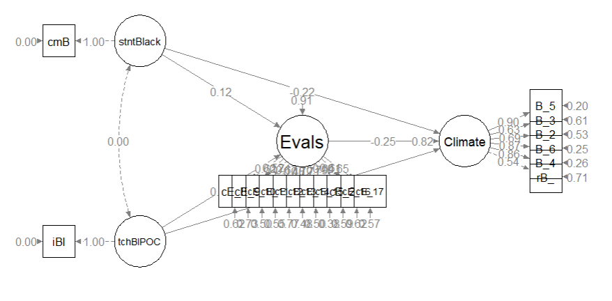

# Hybrid Models {#hybrid}

[Screencasted Lecture Link](https://www.youtube.com/playlist?list=PLtz5cFLQl4KPukMYJhxX3ZJ7meMNQ6Dku) 
 


Psychometrics courses usually focus on evaluating the psychometric properties of an instrument and outlining the steps/procedures in instrument development. I believe it is also important to understand how to incorporate those psychometrically credible measures in research designs and particularly, SEM.  Thus, the purpose of this lecture is to walk through a real dataset from missing data analysis, to analyzing and managing missing data, to assessing the distributional characteristics of the data, to creating a measurement model, and finally recrafting it as a structural mode. 

Our goal is:

* Starting with a raw dataset:  
    + examine missing patterns mechanism and managing missing data,
    + evaluate the distributional characteristics of the data, and
    + conducting preliminary analyses.
* Specify our measurement model (all the measures, allowing them all to correlate).  
* Briefly examine *identification* in the measurement and structural portions of the model.  
* Specify and evaluate our a priorily defined structural model.
* Write it up!  

At the outset, please know that this lesson (a) skips a few steps and (b) introduces (entirely too quickly) some steps that will be new to those who are not exposed to structural equation modeling (SEM). While somewhat regrettable, this is intentional. In the program where I have taught, we teach psychometrics before the multivariate class and this is the last lesson in psychometrics. One intent is to provide an advanced cognitive organizer for what is yet to come in the [SEM lessons](https://lhbikos.github.io/ReC_MultivModel/SEM.html) in multivariate modeling. In-so-doing, I'm hoping to show how the entire psychometric process is critical to our final, tested, models.

## Navigating this Lesson

There is about 1 hour and 45 minutes of lecture.  If you work through the materials with me it would be plan for an additional two hours.

While the majority of R objects and data you will need are created within the R script that sources the chapter, occasionally there are some that cannot be created from within the R framework. Additionally, sometimes links fail.  All original materials are provided at the [Github site](https://github.com/lhbikos/ReC_Psychometrics) that hosts the book. More detailed guidelines for ways to access all these materials are provided in the OER's [introduction](#ReCintro).

### Learning Objectives

Focusing on this week's materials, make sure you can:

* Identify steps in preparing data for structural equation modeling.
* Differentiate a measurement model from a structural model and know which one *will* have better fit. 
* List the general steps in evaluating a hybrid model.
* Specify and interpret the results of a measurement model.
* Specify and interpret the results of a structural model.
     
### Planning for Practice

In each of these lessons I provide suggestions for practice that allow you to select one or more problems that are graded in difficulty The least complex is to import the latest [Rate-a-Recent-Course:  A ReCentering Psych Stats Exercise](https://spupsych.az1.qualtrics.com/jfe/form/SV_b2cClqAlLGQ6nLU)data from Qualtrics and rework the problem as written in the lesson. For an increased challenge, swap out one or more variables/scales. And for a maximal challenge, try something entirely new with data (similated or real) that you have permission to use.  

Regardless of your choic(es) please work through the following:

* Structure up your dataframe.
* Analyze and manage missing data.
* Evaluate the assumptions for multivariate analysis.
* Conduct appropriate preliminary analyses.
* Specify and evaluate a measurement model.
* Prepare an APA style results section with table(s) and figure(s).
* Explain it to somebody.

### Readings & Resources

In preparing this chapter, I drew heavily from the following resource(s). Other resources are cited (when possible, linked) in the text with complete citations in the reference list.

Kline, R. (2016). Principles and practice of structural equation modeling (Fourth ed., Methodology in the social sciences). New York: The Guilford Press.

* Chapter 4, Data Preparation and Psychometrics Review\
* Chapter 10, Specification and Identification of Structural Regression Models
* Chapter 11, Estimation and Local Fit Testing
* Chapter 13, Analysis of CFA Models

Little, T. D., Cunningham, W. A., Shahar, G., & Widaman, K. F. (2002). To parcel or not to parcel: Exploring the question, weighing the merits. Structural Equation Modeling, 9(2), 151–173. https://doi.org/10.1207/S15328007SEM0902_1

Little, T. D., Rhemtulla, M., Gibson, K., & Schoemann, A. M. (2013). Why the items versus parcels controversy needn’t be one. Psychological Methods, 18(3), 285–300. https://doi.org/10.1037/a0033266

Rosseel, Y. (2019). The *lavaan* tutorial. Belgium: Department of Data Analysis, Ghent University. http://lavaan.ugent.be/tutorial/tutorial.pdf 

### Packages

The packages used in this lesson are embedded in this code. When the hashtags are removed, the script below will (a) check to see if the following packages are installed on your computer and, if not (b) install them.

```r
# will install the package if not already installed
# if(!require(psych)){install.packages('psych')}
# if(!require(lavaan)){install.packages('lavaan')}
# if(!require(semPlot)){install.packages('semPlot')}
# if(!require(psych)){install.packages('psych')}
# if(!require(semTable)){install.packages('semTable')}
# if(!require(semTools)){install.packages('semTools')}
# if(!require(semptools)){install.packages('semptools')}
```


## Introducing the Statistic

The model we are testing in this lesson is *hybrid* that is, it contains both CFA and the structural paths. Although there are several detour along the way, the analytic approach has two large stages:

* Testing the *measurement model* which includes of each of the factors and its indicators with covariances between each of the latent variables.
  - The measurement model will have the best fit because all of the structural paths are saturated (i.e., there is a covariance between them).
  - If the fit of the measurement model is below the threshold, a technique like parceling could be helpful, but we will not get there today. More information on that is found in [ReCentering Psych Stats: Multivariate Modeling](https://lhbikos.github.io/ReC_MultivModel/MeasMod.html#parceling). 
* Test the *structural model.* This means we delete the covariancs and respecify the model to include the directional paths and covariances we hypothesized.


The steps in working the STATISTIC generally include,

* Structuring -up your dataframe(s)
  - Reverse-score any items are negatively worded (i.e., the item is scaled opposite the other items)
  - Ensure proper formatting of variables (e.g., numerical, factor)
  - Conduct a missing data analysis and manage missing data. 

* Preliminary analyses
  - Evaluate assumptions for multivariate analyses. 
  - Calculate internal consistency coefficients for any measures that are “scales”
  - Create a correlation table with means and standard deviations

* Specify and evaluate a measurement model.  In this just-identified (saturated) model, all latent variables are specified as covarying
  - In the event of poor fit, respecify LVs with multiple indicators with [parcels](https://lhbikos.github.io/ReC_MultivModel/MeasMod.html#parceling).

* Specify and evaluate a structural model by replacing the covariances with paths that represent the a priori hypotheses.
  - These models could take a variety of forms.
  - It is possible to respecify models through trimming or building approaches.
  - Nested models can be compared with $\chi_{D}^{2}$ and $\Delta{CFI}$ tests.

## Research Vignette

The research vignette comes from the open survey titled, [Rate-a-Recent-Course:  A ReCentering Psych Stats Exercise](https://spupsych.az1.qualtrics.com/jfe/form/SV_b2cClqAlLGQ6nLU). A series of lessons devoted to preparing data for analysis provide information about the specific variables and link to the codebook. They are available in the [Multivariate Modeling](https://lhbikos.github.io/ReC_MultivariateModeling/)volume.  

If you are 18 years or older and have recently taken any type of course (e.g., college, graduate, continuing education), please consider taking the survey. Each time someone responds to the survey, it will allow users to follow along with a slightly different datasea.

The Rate-a-Recent-Course has a number of scales and variables. We will use four variables/scales to specify a parallel mediation predicting the perceptions of campus climate for students who are Black from the percent of classmates who are Black, the proportion of instructional staff who are BIPOC (Black, Indigenous, and Persons of Color), and course evaluation ratings that assess the degree to which the pedagogy is socially  responsive.



Variables in the model:

* Perceived Campus Climate for Black Students includes 6 items, one of which was reverse scored. This scale was adapted from Szymanski et al.'s [-@szymanski_perceptions_2020] Campus Climate for LGBTQ students. It has not been evaluated for use with other groups.  The Szymanski et al. analysis suggested that it could be used as a total scale score, or divided into three items each that assess the college's response and experienced stigma. Items were assessed on a 7-point scale ranging from *strongly disagree* to *strongly agree* with higher scores indicating a more hostile campus climate. Example items from our revised scale include:
  * College response: "My college is unresponsive to the needs of Black students."
  * Stigma:  "Anti-Black racism is visible in my college."
* Course evaluation items assessed the the degree to which the pedagogy of course course reviewed by the respondent was socially and culturally responsive. In developing this survey, we chose items after reviewing evaluation items from several institutions of higher education and reviewing evaluative tools for open education resources. Eleven items were assessed on a 5-point scale ranging from *strongly disagree* to *strongly agree* with higher scores indicating a more positive evaluation of the course. Example items include:
  * "Course content included materials authored by members of communities that are often marginalized (e.g., BIPOC, LGBTQ+, emerging economies)."
  * "A land acknowledgement was made (i.e., formal statement naming the indigenous people who originally inhabited the land)."
  * "Course materials (e.g., textbooks, articles, videos/podcasts) were free/no-cost to the students."
* Percent of Black classmates was a single item that asked respondents to estimate the proportion of students in various racial categories.
* Percent of BIPOC instructional staff, similarly, asked respondents to identify the racial category of each member of their instructional staff.

Our design has notable limitations. Briefly, (a) owing to the open source aspect of the data we do not ask about the demographic characteristics of the respondent; (b) the items that ask respondents to *guess* the identities of the instructional staff and to place them in broad categories, (c) we do not provide options for "write-in" responses. We made these decisions after extensive conversation with stakeholders. The primary reason for these decisions was to prevent potential harm (a) to respondents who could be identified if/when the revealed private information in this open-source survey, and (b) trolls who would write inappropriate or harmful comments. 

*I would like to assess the model by having the instructional staff variable to be the %Black instructional staff.  At the time that this lecture is being prepared, there is not sufficient Black representation in this variable to model this.* 


## Importing and Preparing the Data

**This section of the lesson describes how to import data directly from Qualtrics and do some formatting. Because the survey remains open, if you import the data from Qualtrics you will get different results than are in the lesson. If you want to get the same results as me, [download the dataset from the GitHub](https://github.com/lhbikos/ReC_Psychometrics/blob/main/Model_df211010.rds), save it in the same place as your working .rmd file, and skip to "START HERE". For practice, you might consider downloading the data directly from Qualtrics for updated results.**

Three chapters in the [Multivariate Modeling](https://lhbikos.github.io/ReC_MultivariateModeling/scrub.html) volume of ReCentering Psych Stats provide greater detail about the process of importing and preparing data from the [Rate-a-Recent-Course:  A ReCentering Psych Stats Exercise](https://spupsych.az1.qualtrics.com/jfe/form/SV_b2cClqAlLGQ6nLU) survey. 

We start with an intRavenous import directly from Qualtrics. This is a two-step process. 

* Establishing a connection to the Qualtrics account by supplying the base URL and API credentials.
  - Be very careful with these, they provide access to everything in your Qualtrics account. This Qualtrics account has only this survey and nothing else.
  - If the API token becomes operational, please let me know. Qualtrics security may have a protocol to replace/disable them.
* Naming the survey (via its identification number) and importing the results.


```r
# The hashtagged line of code makes the connection to the
# institution's Qualtrics account and the individual Qualtrics
# account within that institutional brand. Once that connection is
# made, hashtag it out to avoid glitches. If you are changing from
# one account to another you will likely need to restart R.
# qualtRics::qualtrics_api_credentials(api_key =
# 'mUgPMySYkiWpMFkwHale1QE5HNmh5LRUaA8d9PDg', base_url =
# 'spupsych.az1.qualtrics.com', overwrite = TRUE, install = TRUE)
# surveys <- qualtRics::all_surveys() QTRX_df
# <-qualtRics::fetch_survey(surveyID = 'SV_b2cClqAlLGQ6nLU',
# time_zone = NULL, verbose = FALSE, label=TRUE, force_request =
# TRUE, import_id = FALSE) convert=FALSE,
```

In the next set of code, I quickly prepare the data that I will use for the hybrid SEM.  In the next set of script we:

* Delete "previews" (those "tester" surveys taken prior to the official launch).
* Rename a few variables to make them easier to manipulate.
  - Most variable naming was completed inside the Qualtrics survey, prior to importing, but some variables were impossible to rename and we did not anticipate all of our needs.
* Create an ID number for each case and moving it to the front of the dataframe.
* Create a df that includes only the variables needed to specify the hybrid model.


```r
# eliminating previews QTRX_df <- dplyr::filter (QTRX_df,
# DistributionChannel != 'preview')

# renaming variables that start with numbers QTRX_df <-
# dplyr::rename(QTRX_df, iRace1 = '1_iRace', iRace2 = '2_iRace',
# iRace3 = '3_iRace', iRace4 = '4_iRace', iRace5 = '5_iRace', iRace6
# = '6_iRace', iRace7 = '7_iRace', iRace8 = '8_iRace', iRace9 =
# '9_iRace', iRace10 = '10_iRace')

# renaming variables about classmates race/ethnicity QTRX_df <-
# dplyr::rename(QTRX_df, cmBiMulti = Race_10, cmBlack = Race_1,
# cmNBPoC = Race_7, cmWhite = Race_8, cmUnsure = Race_2)

library(tidyverse)  #opening this package to be able to use pipes
# creating ID variable and moving it to the front QTRX_df <- QTRX_df
# %>% dplyr::mutate(ID = row_number()) QTRX_df <-
# QTRX_df%>%dplyr::select(ID, everything())

# downsizing df to have just variables of interest Model_df <-(select
# (QTRX_df, ID, iRace1, iRace2, iRace3, iRace4, iRace5, iRace6,
# iRace7, iRace8, iRace9, iRace10, cmBiMulti, cmBlack, cmNBPoC,
# cmWhite, cmUnsure, Blst_1:Blst_6, cEval_8, cEval_9, cEval_10,
# cEval_11, cEval_12, cEval_13, cEval_14, cEval_15, cEval_20,
# cEval_16,cEval_17))
```

The optional script below will let you save the imported data to your computing environment as either a .csv file (think "Excel lite") or .rds object (preserves any formatting you might do). If you save the .csv file and bring it back in, you will lose any formatting (e.g., ordered factors will be interpreted as character variables). 

```r
# write the simulated data as a .csv write.table(Model_df,
# file='Model_df.csv', sep=',', col.names=TRUE, row.names=FALSE)
# bring back the simulated dat from a .csv file Model_df <- read.csv
# ('Model_df.csv', header = TRUE)
```

An .rds file preserves all formatting to variables prior to the export and re-import.  For the purpose of this chapter, you don't need to do either. That is, you can re-simulate the data each time you work the problem.

**START HERE** to upload the [data you downloaded from the GitHub](https://github.com/lhbikos/ReC_Psychometrics/blob/main/Model_df211010.rds. This will produce the same results in this lesson

```r
# to save the df as an .rds (think 'R object') file on your computer;
# it should save in the same file as the .rmd file you are working
# with saveRDS(Model_df, 'Model_df.rds') bring back the simulated dat
# from an .rds file
Model_df <- readRDS("Model_df211010.rds")  #For this lesson, I saved and imported this set of data; use it if you want the same results as are in the lesson and screencasted lecture
# Model_df <- readRDS('Model_df.rds')
```

As a multicategorical variable, race/ethnicity frequently takes some thought and manipulation. I would have liked to have evaluated instructor race as the proportion of the instructional staff who is Black. At this time, there is so little variability in the instructional staff variable that we are using proportion of instructional staff who is BIPOC.

Given that classes may be teamtaught (and/or include teaching assistants) in the survey, respondents indicated how many instructional staff taught their class. For each, the respondent indicated the race/ethnicity of the instructor. It was possible to list up to 10 instructors per class. We need to get these 10 responses summarized as one variable representing the proportion of instructional faculty (per respondent/class) who were BIPOC. The code below:

* Transforms each race identification variable into a factor.
* Calculates the proportion of BIPOC instructional faculty for each respondent's class.


```r
# str(Model_df$iRace1)

Model_df$tRace1 = factor(Model_df$iRace1, levels = c(0, 1, 2, 3, 4), labels = c("Black",
    "nBpoc", "BiMulti", "White", "NotNotice"))
Model_df$tRace2 = factor(Model_df$iRace2, levels = c(0, 1, 2, 3, 4), labels = c("Black",
    "nBpoc", "BiMulti", "White", "NotNotice"))
Model_df$tRace3 = factor(Model_df$iRace3, levels = c(0, 1, 2, 3, 4), labels = c("Black",
    "nBpoc", "BiMulti", "White", "NotNotice"))
Model_df$tRace4 = factor(Model_df$iRace4, levels = c(0, 1, 2, 3, 4), labels = c("Black",
    "nBpoc", "BiMulti", "White", "NotNotice"))
Model_df$tRace5 = factor(Model_df$iRace5, levels = c(0, 1, 2, 3, 4), labels = c("Black",
    "nBpoc", "BiMulti", "White", "NotNotice"))
Model_df$tRace6 = factor(Model_df$iRace6, levels = c(0, 1, 2, 3, 4), labels = c("Black",
    "nBpoc", "BiMulti", "White", "NotNotice"))
Model_df$tRace7 = factor(Model_df$iRace7, levels = c(0, 1, 2, 3, 4), labels = c("Black",
    "nBpoc", "BiMulti", "White", "NotNotice"))
Model_df$tRace8 = factor(Model_df$iRace8, levels = c(0, 1, 2, 3, 4), labels = c("Black",
    "nBpoc", "BiMulti", "White", "NotNotice"))
Model_df$tRace9 = factor(Model_df$iRace9, levels = c(0, 1, 2, 3, 4), labels = c("Black",
    "nBpoc", "BiMulti", "White", "NotNotice"))
Model_df$tRace10 = factor(Model_df$iRace10, levels = c(0, 1, 2, 3, 4),
    labels = c("Black", "nBpoc", "BiMulti", "White", "NotNotice"))
# checking to see that they are factors glimpse(Model_df)

# counting non-White instructional staff by creating the variable
# 'count.BIPOC' by summing across tRace1 thru tRace10 and assigning a
# count of '1' each time the factor value was Black, nBpoc, or
# BiMulti
Model_df$count.BIPOC <- apply(Model_df[c("tRace1", "tRace2", "tRace3",
    "tRace4", "tRace5", "tRace6", "tRace7", "tRace8", "tRace9", "tRace10")],
    1, function(x) sum(x %in% c("Black", "nBpoc", "BiMulti")))

# created a variable that counted the number of non-missing values
# across the tRace1 thru tRace10 vars
Model_df$count.nMiss <- apply(Model_df[c("tRace1", "tRace2", "tRace3",
    "tRace4", "tRace5", "tRace6", "tRace7", "tRace8", "tRace9", "tRace10")],
    1, function(x) sum(!is.na(x)))

# calculate proportion of BIPOC instructional faculty for each case
Model_df$iBIPOC_pr = Model_df$count.BIPOC/Model_df$count.nMiss
```

The scale assessing perceptions of campus climate for Black students had six items. One was worded in the opposite direction of the rest, therefore we must reverse-score it. Following the reverse-coding, I once again trimmed the dataframe so that it includes only the variables we need for the next step.

```r
library(tidyverse)
Model_df <- Model_df %>%
    dplyr::mutate(rBlst_1 = 8 - Blst_1)  #if you had multiple items, you could add a pipe (%>%) at the end of the line and add more until the last one

# selecting the variables we want
Model_df <- dplyr::select(Model_df, ID, iBIPOC_pr, cmBlack, rBlst_1, Blst_2:Blst_6,
    cEval_8:cEval_17)
```

### Analyzing and Managing Missingness

The series of lessons on data preparation in the [Multivariate Modeling](https://lhbikos.github.io/ReC_MultivModel/) volume provide a more detailed review of analyzing and managing missing data. Much of the script below is copied from those lessons and my review and explanation in this lesson is significantly shorter.

Structural equation models lend themselves to managing missing data with Parent's [-@parent_handling_2013] *available information analysis* (AIA) approach. My approach is to:

* Create a dataframe that includes only the variables that will be used in the analysis.
* Delete all cases with greater than 20% missingness.
* If scale scores (or parcels) are used, calculate them if ~80% of the data for the calculation is present.
* Use the *full information maximum likelihood* (FIML) estimation procedure in *lavaan*; this allows item-level missingness. 


```r
cases1 <- nrow(Model_df)  #I produced this object for the sole purpose of feeding the number of cases into the inline text, below
cases1
```

```
[1] 70
```


```r
library(tidyverse)
# Create a variable (n_miss) that counts the number missing
Model_df$n_miss <- Model_df %>%
    dplyr::select(iBIPOC_pr:cEval_17) %>%
    is.na %>%
    rowSums

# Create a proportion missing by dividing n_miss by the total number
# of variables (21) Sort in order of descending frequency to get a
# sense of the missingness
Model_df <- Model_df %>%
    dplyr::mutate(prop_miss = (n_miss/21) * 100) %>%
    arrange(desc(n_miss))

PrMiss1 <- psych::describe(Model_df$prop_miss)
PrMiss1
```

```
   vars  n  mean    sd median trimmed mad min   max range skew kurtosis   se
X1    1 70 27.48 40.41      0   23.04   0   0 90.48 90.48 0.87     -1.2 4.83
```

```r
MissMin1 <- formattable::digits(PrMiss1$min, 0)  #this object is displayed below and I use input from  it for the inline text used in the write-up
MissMax1 <- formattable::digits(PrMiss1$max, 0)
MissMin1
```

```
[1] 0
```

```r
MissMax1
```

```
[1] 90
```

```r
CellsMissing1 <- formattable::percent(mean(is.na(Model_df)))  #percent missing across df
RowsMissing1 <- formattable::percent(mean(complete.cases(Model_df)))  #percent of rows with nonmissing data
CellsMissing1
```

```
[1] 26.23%
```

```r
RowsMissing1
```

```
[1] 60.00%
```
Our initial inspection of the data indicated that 70 attempted the survey. The proportion of missingness in the responses ranged from 0 to 90. Across the dataframe there was 26% of missingness across the cells. Approximately 60% of the cases had nonmissing data. 

Let's conduct an analysis of missingness with the *mice::md.pattern()* function.

```r
missingness <- mice::md.pattern(Model_df, plot = TRUE, rotate.names = TRUE)
```

<!-- -->

```r
missingness
```

```
   ID n_miss prop_miss cmBlack cEval_8 cEval_12 cEval_13 cEval_14 cEval_16
42  1      1         1       1       1        1        1        1        1
1   1      1         1       1       1        1        1        1        1
1   1      1         1       1       1        1        1        1        1
1   1      1         1       1       1        1        1        1        1
1   1      1         1       1       1        1        1        1        1
1   1      1         1       1       1        1        1        1        1
1   1      1         1       1       1        1        1        1        1
2   1      1         1       1       1        1        1        1        1
1   1      1         1       0       0        0        0        0        0
19  1      1         1       0       0        0        0        0        0
    0      0         0      20      20       20       20       20       20
   iBIPOC_pr cEval_9 cEval_10 cEval_15 cEval_20 cEval_17 Blst_2 Blst_3 Blst_5
42         1       1        1        1        1        1      1      1      1
1          1       1        1        1        1        1      1      1      1
1          1       1        1        1        1        1      0      1      1
1          1       1        1        1        1        1      0      0      0
1          1       1        1        1        1        0      1      1      1
1          1       1        1        0        0        1      1      1      0
1          1       0        0        1        1        1      1      0      1
2          0       1        1        1        1        1      1      1      1
1          1       0        0        0        0        0      0      0      0
19         0       0        0        0        0        0      0      0      0
          21      21       21       21       21       21     22     22     22
   Blst_6 cEval_11 Blst_4 rBlst_1    
42      1        1      1       1   0
1       1        1      1       0   1
1       0        1      0       0   4
1       0        1      0       0   6
1       1        1      1       1   1
1       1        0      1       0   5
1       1        0      0       0   6
2       1        1      1       1   1
1       0        0      0       0  18
19      0        0      0       0  19
       22       22     23      25 404
```

We need to decide what is our retention threshold. Twenty percent seems to be a general rule of thumb.  Let's delete all cases with missingness at 20% or greater.


```r
Model_df <- filter(Model_df, prop_miss <= 20)  #update df to have only those with at least 20% of complete data (this is an arbitrary decision)

Model_df <- dplyr::select(Model_df, iBIPOC_pr:cEval_17)  #the variable selection just lops off the proportion missing

CasesIncluded <- nrow(Model_df)
CasesIncluded  #this object is displayed below and I use input from  it for the inline text used in the write-up
```

```
[1] 47
```
We should check the missingness characteristics again.


```r
CellsMissing2 <- formattable::percent(mean(is.na(Model_df)))  #percent missing across df
RowsMissing2 <- formattable::percent(mean(complete.cases(Model_df)))  #percent of rows with nonmissing data
CellsMissing2
```

```
[1] 0.90%
```

```r
RowsMissing2
```

```
[1] 89.36%
```


```r
missingness2 <- mice::md.pattern(Model_df, plot = TRUE, rotate.names = TRUE)
```

<!-- -->

```r
missingness2
```

```
   cmBlack Blst_3 Blst_5 cEval_8 cEval_9 cEval_10 cEval_11 cEval_12 cEval_13
42       1      1      1       1       1        1        1        1        1
1        1      1      1       1       1        1        1        1        1
2        1      1      1       1       1        1        1        1        1
1        1      1      1       1       1        1        1        1        1
1        1      1      1       1       1        1        1        1        1
         0      0      0       0       0        0        0        0        0
   cEval_14 cEval_15 cEval_20 cEval_16 Blst_2 Blst_4 Blst_6 cEval_17 iBIPOC_pr
42        1        1        1        1      1      1      1        1         1
1         1        1        1        1      1      1      1        1         1
2         1        1        1        1      1      1      1        1         0
1         1        1        1        1      1      1      1        0         1
1         1        1        1        1      0      0      0        1         1
          0        0        0        0      1      1      1        1         2
   rBlst_1  
42       1 0
1        0 1
2        1 1
1        1 1
1        0 4
         2 8
```
Write up of results so far:

>Our initial inspection of the data indicated that 70 attempted the survey. The proportion of missingness in the responses ranged from 0 to 90. Across the dataframe there was 26% of missingness across the cells. Approximately 60% of the cases had nonmissing data. The predominant pattern of missingness included individuals opening the survey without completing any of the items. Beyond that, our inspection of a missingness map indicated a haphazard pattern of missingness [@enders_applied_2010].

>We decided to delete all cases with greater than 20% missinness. We reinspected the missingness of the dataset with 47 cases. Across the dataframe there was less than 1% of missingness across the cells. Approximately 89% of the cases had nonmissing data. 


### Assessing the Distributional Characteristics of the Data


```r
psych::describe(Model_df)
```

```
          vars  n mean   sd median trimmed  mad min max range  skew kurtosis
iBIPOC_pr    1 45 0.33 0.40   0.25    0.30 0.37   0   1     1  0.76    -1.06
cmBlack      2 47 6.66 7.64   5.00    5.46 7.41   0  29    29  1.29     0.85
rBlst_1      3 45 3.42 1.60   3.00    3.35 1.48   1   7     6  0.48    -0.60
Blst_2       4 46 2.67 1.59   2.00    2.58 1.48   1   6     5  0.30    -1.42
Blst_3       5 47 2.11 1.29   2.00    1.95 1.48   1   6     5  1.06     0.25
Blst_4       6 46 2.35 1.25   2.00    2.24 1.48   1   5     4  0.61    -0.80
Blst_5       7 47 2.00 1.20   2.00    1.87 1.48   1   5     4  0.89    -0.58
Blst_6       8 46 2.26 1.34   2.00    2.08 1.48   1   6     5  0.99     0.04
cEval_8      9 47 4.30 0.83   4.00    4.44 1.48   1   5     4 -1.69     3.98
cEval_9     10 47 3.81 1.06   4.00    3.87 1.48   2   5     3 -0.49    -1.00
cEval_10    11 47 4.00 0.98   4.00    4.13 1.48   1   5     4 -0.96     0.53
cEval_11    12 47 3.40 1.15   3.00    3.41 1.48   1   5     4  0.02    -1.21
cEval_12    13 47 3.85 1.27   4.00    3.97 1.48   1   5     4 -0.73    -0.83
cEval_13    14 47 3.83 1.05   4.00    3.97 0.00   1   5     4 -1.21     1.18
cEval_14    15 47 3.72 1.36   4.00    3.87 1.48   1   5     4 -0.97    -0.30
cEval_15    16 47 3.26 1.19   3.00    3.31 1.48   1   5     4 -0.41    -0.78
cEval_20    17 47 3.55 1.14   4.00    3.67 1.48   1   5     4 -0.73    -0.10
cEval_16    18 47 3.13 1.30   3.00    3.15 1.48   1   5     4 -0.23    -1.11
cEval_17    19 46 2.67 1.43   2.00    2.61 1.48   1   5     4  0.35    -1.31
            se
iBIPOC_pr 0.06
cmBlack   1.11
rBlst_1   0.24
Blst_2    0.23
Blst_3    0.19
Blst_4    0.18
Blst_5    0.17
Blst_6    0.20
cEval_8   0.12
cEval_9   0.15
cEval_10  0.14
cEval_11  0.17
cEval_12  0.18
cEval_13  0.15
cEval_14  0.20
cEval_15  0.17
cEval_20  0.17
cEval_16  0.19
cEval_17  0.21
```
Regarding the distributional characteristics of the data, skew and kurtosis values of the variables fell below the values of 3 (skew) and 8 to 20 (kurtosis) that Kline suggests are concerning [-@kline_principles_2016].


```r
Model_df$Mahal <- psych::outlier(Model_df)
```

<!-- -->

```r
library(dplyr)
# str(item_scores_df$Mahal)
Model_df$MOutlier <- if_else(Model_df$Mahal > (median(Model_df$Mahal) +
    (3 * sd(Model_df$Mahal))), TRUE, FALSE)

OutlierCount <- Model_df %>%
    count(MOutlier)
OutlierCount
```

```
# A tibble: 1 × 2
  MOutlier     n
  <lgl>    <int>
1 FALSE       47
```

```r
NumOutliers <- nrow(Model_df) - OutlierCount  #calculating how many outliers
NumOutliers  #this object is used for the inline text for the reesults
```

```
  MOutlier n
1       47 0
```

```r
NumOutliers
```

```
  MOutlier n
1       47 0
```

```r
head(Model_df)  #shows us the first 6 rows of the data so we can see the new variables (Mahal, MOutlier)
```

```
# A tibble: 6 × 21
  iBIPOC_pr cmBlack rBlst_1 Blst_2 Blst_3 Blst_4 Blst_5 Blst_6 cEval_8 cEval_9
      <dbl>   <dbl>   <dbl>  <dbl>  <dbl>  <dbl>  <dbl>  <dbl>   <dbl>   <dbl>
1     1           0      NA     NA      2     NA      2     NA       5       4
2     0           5       2      6      2      2      4      1       5       5
3   NaN           5       4      5      4      5      3      4       4       4
4   NaN          14       3      4      1      3      1      2       4       3
5     0.25        0      NA      1      1      1      1      1       4       5
6     0.333       0       3      3      5      2      2      2       5       5
# ℹ 11 more variables: cEval_10 <dbl>, cEval_11 <dbl>, cEval_12 <dbl>,
#   cEval_13 <dbl>, cEval_14 <dbl>, cEval_15 <dbl>, cEval_20 <dbl>,
#   cEval_16 <dbl>, cEval_17 <dbl>, Mahal <dbl>, MOutlier <lgl>
```

We evaluated multivariate normality with the Mahalanobis distance test. Specifically, we used the *outlier()* function in the *psych* package and included all continuous variables in the calculation. Our visual inspection of the Q-Q plot suggested that the plotted line strayed from the straight line as the quantiles increased.  Additionally, we appended the Mahalanobis distance scores as a variable to the data. Analyzing this variable, we found that no exceed three standard deviations beyond the median. *Thus, with no outliers, we assumed multivariate normality and proceeded with the data analysis* 

### Preliminary Analyses

#### Internal Consistency Coefficients

Most research projects start with some preliminary statistics. Even though we will be using item-level data in our hybrid model, for any instruments that are scales, we typically compute internal consistency coefficients and include these values in the last sentence of in the description of the respective measure. In this example we used two scales:  Perceptions of the Campus Climate for Black Students and the Course Evaluation items that evaluated the degree to which the pedagogy was socially and culturally responsive.  A more thorough description of internal consistency coefficients are found in the [reliability](rxx) chapter of this volume.

My process for calculating alpha coefficients is to first create a subset of item-level data that is consistently scaled in the same direction. That is, reverse score any items before creating the subset of data.

```r
ClimateItems <- dplyr::select(Model_df, rBlst_1, Blst_2, Blst_3, Blst_4,
    Blst_5, Blst_6)
CEvalItems <- dplyr::select(Model_df, cEval_8, cEval_9, cEval_10, cEval_11,
    cEval_12, cEval_13, cEval_14, cEval_15, cEval_16, cEval_17, cEval_20)
```

Next, in separate analyses, we apply the *psych::alpha()* function to the scale items.

```r
ClimateAlpha <- psych::alpha(ClimateItems)
ClimateAlpha
```

```

Reliability analysis   
Call: psych::alpha(x = ClimateItems)

  raw_alpha std.alpha G6(smc) average_r S/N   ase mean  sd median_r
      0.87      0.88    0.88      0.55 7.4 0.029  2.5 1.1     0.53

    95% confidence boundaries 
         lower alpha upper
Feldt     0.81  0.87  0.92
Duhachek  0.82  0.87  0.93

 Reliability if an item is dropped:
        raw_alpha std.alpha G6(smc) average_r S/N alpha se var.r med.r
rBlst_1      0.88      0.89    0.88      0.62 8.0    0.027 0.016  0.60
Blst_2       0.86      0.87    0.86      0.56 6.5    0.034 0.026  0.53
Blst_3       0.87      0.88    0.87      0.59 7.3    0.031 0.020  0.57
Blst_4       0.83      0.84    0.83      0.52 5.4    0.039 0.019  0.50
Blst_5       0.83      0.83    0.82      0.50 5.1    0.040 0.018  0.47
Blst_6       0.83      0.84    0.83      0.52 5.3    0.039 0.019  0.48

 Item statistics 
         n raw.r std.r r.cor r.drop mean  sd
rBlst_1 45  0.68  0.65  0.53   0.51  3.4 1.6
Blst_2  46  0.78  0.76  0.70   0.65  2.7 1.6
Blst_3  47  0.69  0.70  0.61   0.57  2.1 1.3
Blst_4  46  0.86  0.86  0.85   0.79  2.3 1.3
Blst_5  47  0.88  0.89  0.89   0.84  2.0 1.2
Blst_6  46  0.86  0.87  0.86   0.79  2.3 1.3

Non missing response frequency for each item
           1    2    3    4    5    6    7 miss
rBlst_1 0.09 0.24 0.22 0.22 0.09 0.09 0.04 0.04
Blst_2  0.37 0.15 0.09 0.24 0.13 0.02 0.00 0.02
Blst_3  0.43 0.30 0.09 0.15 0.02 0.02 0.00 0.00
Blst_4  0.30 0.33 0.15 0.15 0.07 0.00 0.00 0.02
Blst_5  0.47 0.28 0.06 0.17 0.02 0.00 0.00 0.00
Blst_6  0.35 0.35 0.11 0.11 0.07 0.02 0.00 0.02
```
We learn that the Cronbach's alpha coefficient for the scale assessing perceptions of campus climate for students who are Black is 0.881. This exceeds the recommended thresshold of .80. I would simply add a sentence similar to the following to the end of my description of the scale in the Method/Measures section:  In our study the estimated internal consistency reliability of the total scale score assessing campus climate was 0.881.

Let's repeat the process for the items assessing the degree to which the pedagogy was socially and culturally responsive.


```r
CEvalAlpha <- psych::alpha(CEvalItems)
CEvalAlpha
```

```

Reliability analysis   
Call: psych::alpha(x = CEvalItems)

  raw_alpha std.alpha G6(smc) average_r S/N   ase mean  sd median_r
      0.88      0.89    0.92      0.42 7.8 0.025  3.6 0.8     0.41

    95% confidence boundaries 
         lower alpha upper
Feldt     0.83  0.88  0.93
Duhachek  0.83  0.88  0.93

 Reliability if an item is dropped:
         raw_alpha std.alpha G6(smc) average_r S/N alpha se var.r med.r
cEval_8       0.87      0.88    0.90      0.42 7.2    0.027 0.017  0.42
cEval_9       0.88      0.88    0.91      0.43 7.6    0.026 0.018  0.43
cEval_10      0.87      0.87    0.90      0.41 6.8    0.028 0.019  0.40
cEval_11      0.87      0.87    0.91      0.41 6.9    0.028 0.022  0.39
cEval_12      0.88      0.89    0.92      0.44 7.8    0.025 0.018  0.43
cEval_13      0.87      0.87    0.90      0.41 6.8    0.028 0.019  0.40
cEval_14      0.87      0.87    0.90      0.41 6.9    0.029 0.019  0.41
cEval_15      0.86      0.87    0.90      0.40 6.6    0.030 0.017  0.39
cEval_16      0.87      0.88    0.91      0.42 7.2    0.028 0.021  0.40
cEval_17      0.87      0.88    0.91      0.42 7.2    0.027 0.017  0.41
cEval_20      0.87      0.88    0.90      0.42 7.2    0.028 0.017  0.41

 Item statistics 
          n raw.r std.r r.cor r.drop mean   sd
cEval_8  47  0.63  0.67  0.65   0.57  4.3 0.83
cEval_9  47  0.57  0.60  0.56   0.48  3.8 1.06
cEval_10 47  0.72  0.75  0.73   0.66  4.0 0.98
cEval_11 47  0.72  0.72  0.68   0.64  3.4 1.15
cEval_12 47  0.55  0.56  0.49   0.44  3.9 1.27
cEval_13 47  0.72  0.74  0.73   0.66  3.8 1.05
cEval_14 47  0.74  0.72  0.70   0.66  3.7 1.36
cEval_15 47  0.80  0.79  0.79   0.74  3.3 1.19
cEval_16 47  0.68  0.66  0.61   0.59  3.1 1.30
cEval_17 46  0.70  0.66  0.63   0.59  2.7 1.43
cEval_20 47  0.68  0.66  0.64   0.60  3.6 1.14

Non missing response frequency for each item
            1    2    3    4    5 miss
cEval_8  0.02 0.02 0.04 0.47 0.45 0.00
cEval_9  0.00 0.17 0.15 0.38 0.30 0.00
cEval_10 0.02 0.06 0.15 0.43 0.34 0.00
cEval_11 0.02 0.23 0.30 0.21 0.23 0.00
cEval_12 0.04 0.17 0.11 0.26 0.43 0.00
cEval_13 0.06 0.04 0.13 0.53 0.23 0.00
cEval_14 0.15 0.02 0.13 0.36 0.34 0.00
cEval_15 0.11 0.15 0.26 0.36 0.13 0.00
cEval_16 0.15 0.17 0.23 0.30 0.15 0.00
cEval_17 0.26 0.28 0.13 0.17 0.15 0.02
cEval_20 0.09 0.06 0.26 0.40 0.19 0.00
```

The alpha coefficient for the course evaluation items assessing a socially and culturally responsive pedagogy was 0.887. I would add this sentence to the description of this measure.

#### Means, SDs, r-matrix

Means, standard deviations, and a correlation matrix are also commonly reported. Because two of our constructs are scales, we will need to calculate their means for cases that have met the minimum thresshold for nonmissingness.


```r
# create lists of the items
ClimateVars <- c("rBlst_1", "Blst_2", "Blst_3", "Blst_4", "Blst_5", "Blst_6")
CEvalVars <- c("cEval_8", "cEval_9", "cEval_10", "cEval_11", "cEval_12",
    "cEval_13", "cEval_14", "cEval_15", "cEval_16", "cEval_17", "cEval_20")

# calculate means for when a specified proportion of items are
# non-missing
Model_df$ClimateM <- sjstats::mean_n(Model_df[, ClimateVars], 0.8)  #will create the mean for each individual if 80% of variables are present (this means there must be at least 5 of 6)
Model_df$CEvalM <- sjstats::mean_n(Model_df[, CEvalVars], 0.8)  #will create the mean for each individual if 80% of variables are present (this means there must be at least 9 of 11)
```

The *apaTables::cor.table* function creates the standard table that will include the means, standard deviations, and correlation matrix.


```r
apaTables::apa.cor.table(Model_df[c("ClimateM", "CEvalM", "iBIPOC_pr",
    "cmBlack")], landscape = TRUE, table.number = 1, filename = "Table1_Prelim.doc")
```

```


Table 1 

Means, standard deviations, and correlations with confidence intervals
 

  Variable     M    SD   1            2           3          
  1. ClimateM  2.46 1.09                                     
                                                             
  2. CEvalM    3.60 0.80 -.30*                               
                         [-.55, -.02]                        
                                                             
  3. iBIPOC_pr 0.33 0.40 -.26         .24                    
                         [-.52, .04]  [-.06, .50]            
                                                             
  4. cmBlack   6.66 7.64 -.19         .08         -.07       
                         [-.45, .11]  [-.21, .36] [-.36, .23]
                                                             

Note. M and SD are used to represent mean and standard deviation, respectively.
Values in square brackets indicate the 95% confidence interval.
The confidence interval is a plausible range of population correlations 
that could have caused the sample correlation (Cumming, 2014).
 * indicates p < .05. ** indicates p < .01.
 
```

### Summary of Data Preparation

>We began by creating a dataset that included only the variables of interest. Our initial inspection of the data indicated that 70 attempted the survey. The proportion of missingness in the responses ranged from 0 to 90. Across the dataframe there was 26% of missingness across the cells. Approximately 60% of the cases had nonmissing data. The predominant pattern of missingness included individuals opening the survey without completing any of the items. Beyond that, our inspection of a missingness map indicated a haphazard pattern of missingness [@enders_applied_2010].

>Using Parent's *available item analysis* [AIA; -@parent_handling_2013] as a guide, we deleted all cases where there was greater than 20% of data missing. We reinspected the missingness of the dataset with 47 cases. Across the dataframe there was less than 1% of missingness across the cells. Approximately 89% of the cases had nonmissing data. 

>Regarding the distributional characteristics of the data, skew and kurtosis values of the variables fell below the values of 3 (skew) and 8 to 20 (kurtosis) that Kline suggests are concerning [-@kline_principles_2016]. We evaluated multivariate normality with the Mahalanobis distance test. Specifically, we used the *outlier()* function in the *psych* package and included all continuous variables in the calculation. Our visual inspection of the Q-Q plot suggested that the plotted line strayed from the straight line as the quantiles increased.  Additionally, we appended the Mahalanobis distance scores as a variable to the data. Analyzing this variable, we found that no exceed three standard deviations beyond the median. Thus, with no outliers, we assumed multivariate normality and proceeded with the data analysis. Means, standard deviations, and a correlation matrix are found in Table 1.

## The Measurement Model: Specification and Evaluation

Structural regression (e.g., structural equation, hybrid) models include both *measurement* and *structural* portions. The **measurement model** examines the relationship between latent variables and their measures.  

* Testing the measurement model means *saturating* it, such that $df = 0$ and it is *just-identified*.  
* Essentially, the measurement model is a correlated factors model. However, rather than having subscales of a larger scale, these are all the LVs involved in your model.  
* Testing the measurement model points out any misfit in the measurement model (that you need to fix).  Heywood cases(usually a negative error variance, which is an impossible solution) are an example of a problem that would need to be addressed before fixing.  

The **structural model** evaluates the hypothesized relations between the latent variables.  

* The structural model is typically more parsimonious (i.e., not saturated) than the measurement model and is characterized by directional paths (not covariances) between some  (not all) of the variables.  

The specification of our measurement model resembles the first-order, correlated traits specifications in prior lessons. What differs is that we include all latent variables and their specifications.  Below, there are no surprises about the Climate and CourseEval latent variables, because these are traditional scales and they have at least three items/indicators.  In contrast, latent variables with one and two indicators requires special treatment. 

For two-indicator latent variables, Little et al. [-@little_statistical_2002] recommended placing an equality constraint on the two loadings associated with the construct because this would locate the construct at the true intersection of the two selected indicators.  Procedurally this is fairly straightforward. If we wanted to create a latent variable from the proportions of (a) instructional staff and (b) classmates who are Black we would simply assign labels to the two indicators:


```r
#PrBlack =~ v1*iBIPOC_pr + v1*cmBlack
```
  
For single indicator latent variables, Little et al. [-@little_statistical_2002] wrote, “a single-indicator latent variable is essentially equivalent to a manifest variable.  In this case, the error of measurement is either fixed at zero or fixed at a non-zero estimate of unreliability; additionally a second corresponding parameter would also need to be fixed because of issue of identification.”  

Our proportion of instructional staff who are BIPOC and estimated proportion of classmates who are Black were estimated with one item each. In order to include single items as latent variables, we set the observed variable to be 0.00. In essence, this says that the latent variable will account for all of the variance in the observed variable. Note that for each of the single-item variables, there are two lines of code.  The first, defines the LV from the item; the second specifies the error variance of the single observed variable to be 0.00.


```r
msmt <- "  
#latent variable definitions for the factors with 3 or more indicators
   Climate =~ rBlst_1 + Blst_4 + Blst_6 + Blst_2 + Blst_3 + Blst_5
   CourseEval =~ cEval_8 + cEval_9 + cEval_10 + cEval_11 + cEval_12 + cEval_13 + cEval_14 + cEval_15 + cEval_20 + cEval_16 + cEval_17
   
  #latent variable definitions for the factors with 1 indicator; we set variance of the observed variable to be 0.00; this says that the LV will account for all of the variance in the observed variable
   tBIPOC =~ iBIPOC_pr #for the factor \"t\" is teacher; for variable \"i\" is instructor
   sBlack =~ cmBlack #for factor \"s\" is student; for variable \"cm\" is classmates
  
   iBIPOC_pr ~~ 0*iBIPOC_pr #this specifies the error variance of the single observed variable to be 0.00
   cmBlack ~~ 0*cmBlack
   "
```


#### Managing missing data with FIML

If the data contain missing values, the default behavior in *lavaan* is listwise deletion.  If we can presume that the missing mechanism is MCAR or MAR (e.g., there is no systematic missingness), we can specify a *full information maximum likelihood* (FIML) estimation procedure with the argument *missing = "ml"* (or its alias *missing = "fiml"*). Recall that we retained cases if they had 20% or less missing. Usin the "fiml" option is part of the AIA approach [@parent_handling_2013].  


```r
msmt_fit <- lavaan::cfa(msmt, data = Model_df, missing = "fiml", check.gradient = FALSE)
# msmt_fit <- lavaan::cfa(msmt, data = Model_df, missing = 'fiml',
# estimator = 'ML', bounds = 'wide')
m1fitsum <- lavaan::summary(msmt_fit, fit.measures = TRUE, standardized = TRUE,
    rsquare = TRUE)
# missing = 'fiml',
m1fitsum
```

```
lavaan 0.6.17 ended normally after 80 iterations

  Estimator                                         ML
  Optimization method                           NLMINB
  Number of model parameters                        61

  Number of observations                            47
  Number of missing patterns                         5

Model Test User Model:
                                                      
  Test statistic                               239.689
  Degrees of freedom                               148
  P-value (Chi-square)                           0.000

Model Test Baseline Model:

  Test statistic                               590.701
  Degrees of freedom                               171
  P-value                                        0.000

User Model versus Baseline Model:

  Comparative Fit Index (CFI)                    0.782
  Tucker-Lewis Index (TLI)                       0.748
                                                      
  Robust Comparative Fit Index (CFI)             0.774
  Robust Tucker-Lewis Index (TLI)                0.739

Loglikelihood and Information Criteria:

  Loglikelihood user model (H0)              -1282.408
  Loglikelihood unrestricted model (H1)      -1162.563
                                                      
  Akaike (AIC)                                2686.815
  Bayesian (BIC)                              2799.674
  Sample-size adjusted Bayesian (SABIC)       2608.355

Root Mean Square Error of Approximation:

  RMSEA                                          0.115
  90 Percent confidence interval - lower         0.087
  90 Percent confidence interval - upper         0.141
  P-value H_0: RMSEA <= 0.050                    0.000
  P-value H_0: RMSEA >= 0.080                    0.980
                                                      
  Robust RMSEA                                   0.118
  90 Percent confidence interval - lower         0.090
  90 Percent confidence interval - upper         0.144
  P-value H_0: Robust RMSEA <= 0.050             0.000
  P-value H_0: Robust RMSEA >= 0.080             0.985

Standardized Root Mean Square Residual:

  SRMR                                           0.100

Parameter Estimates:

  Standard errors                             Standard
  Information                                 Observed
  Observed information based on                Hessian

Latent Variables:
                   Estimate  Std.Err  z-value  P(>|z|)   Std.lv  Std.all
  Climate =~                                                            
    rBlst_1           1.000                               0.851    0.538
    Blst_4            1.242    0.322    3.856    0.000    1.057    0.860
    Blst_6            1.343    0.347    3.866    0.000    1.142    0.867
    Blst_2            1.267    0.368    3.441    0.001    1.078    0.687
    Blst_3            0.935    0.289    3.232    0.001    0.796    0.624
    Blst_5            1.247    0.319    3.909    0.000    1.061    0.895
  CourseEval =~                                                         
    cEval_8           1.000                               0.508    0.617
    cEval_9           1.067    0.338    3.153    0.002    0.542    0.519
    cEval_10          1.352    0.331    4.087    0.000    0.687    0.710
    cEval_11          1.503    0.404    3.719    0.000    0.763    0.668
    cEval_12          1.184    0.409    2.895    0.004    0.601    0.479
    cEval_13          1.475    0.361    4.089    0.000    0.749    0.722
    cEval_14          1.870    0.505    3.701    0.000    0.949    0.704
    cEval_15          1.824    0.460    3.961    0.000    0.926    0.788
    cEval_20          1.413    0.428    3.301    0.001    0.717    0.637
    cEval_16          1.549    0.457    3.391    0.001    0.786    0.613
    cEval_17          1.835    0.539    3.403    0.001    0.932    0.654
  tBIPOC =~                                                             
    iBIPOC_pr         1.000                               0.396    1.000
  sBlack =~                                                             
    cmBlack           1.000                               7.560    1.000

Covariances:
                   Estimate  Std.Err  z-value  P(>|z|)   Std.lv  Std.all
  Climate ~~                                                            
    CourseEval       -0.138    0.086   -1.604    0.109   -0.319   -0.319
    tBIPOC           -0.075    0.057   -1.320    0.187   -0.224   -0.224
    sBlack           -1.519    1.067   -1.423    0.155   -0.236   -0.236
  CourseEval ~~                                                         
    tBIPOC            0.054    0.034    1.588    0.112    0.267    0.267
    sBlack            0.382    0.605    0.631    0.528    0.099    0.099
  tBIPOC ~~                                                             
    sBlack           -0.201    0.442   -0.455    0.649   -0.067   -0.067

Intercepts:
                   Estimate  Std.Err  z-value  P(>|z|)   Std.lv  Std.all
   .rBlst_1           3.402    0.234   14.507    0.000    3.402    2.151
   .Blst_4            2.346    0.180   13.030    0.000    2.346    1.909
   .Blst_6            2.259    0.193   11.712    0.000    2.259    1.715
   .Blst_2            2.672    0.230   11.605    0.000    2.672    1.704
   .Blst_3            2.106    0.186   11.321    0.000    2.106    1.651
   .Blst_5            2.000    0.173   11.571    0.000    2.000    1.688
   .cEval_8           4.298    0.120   35.804    0.000    4.298    5.223
   .cEval_9           3.809    0.152   24.997    0.000    3.809    3.646
   .cEval_10          4.000    0.141   28.342    0.000    4.000    4.134
   .cEval_11          3.404    0.167   20.433    0.000    3.404    2.980
   .cEval_12          3.851    0.183   21.047    0.000    3.851    3.070
   .cEval_13          3.830    0.151   25.295    0.000    3.830    3.690
   .cEval_14          3.723    0.197   18.936    0.000    3.723    2.762
   .cEval_15          3.255    0.171   18.987    0.000    3.255    2.769
   .cEval_20          3.553    0.164   21.629    0.000    3.553    3.155
   .cEval_16          3.128    0.187   16.727    0.000    3.128    2.440
   .cEval_17          2.704    0.209   12.923    0.000    2.704    1.898
   .iBIPOC_pr         0.330    0.059    5.585    0.000    0.330    0.831
   .cmBlack           6.660    1.103    6.039    0.000    6.660    0.881

Variances:
                   Estimate  Std.Err  z-value  P(>|z|)   Std.lv  Std.all
   .iBIPOC_pr         0.000                               0.000    0.000
   .cmBlack           0.000                               0.000    0.000
   .rBlst_1           1.776    0.388    4.579    0.000    1.776    0.710
   .Blst_4            0.394    0.111    3.544    0.000    0.394    0.261
   .Blst_6            0.430    0.126    3.425    0.001    0.430    0.248
   .Blst_2            1.298    0.295    4.393    0.000    1.298    0.528
   .Blst_3            0.994    0.217    4.577    0.000    0.994    0.611
   .Blst_5            0.279    0.094    2.986    0.003    0.279    0.199
   .cEval_8           0.419    0.098    4.295    0.000    0.419    0.619
   .cEval_9           0.797    0.176    4.542    0.000    0.797    0.731
   .cEval_10          0.465    0.119    3.920    0.000    0.465    0.496
   .cEval_11          0.723    0.165    4.374    0.000    0.723    0.554
   .cEval_12          1.212    0.260    4.666    0.000    1.212    0.770
   .cEval_13          0.516    0.127    4.062    0.000    0.516    0.479
   .cEval_14          0.916    0.221    4.139    0.000    0.916    0.504
   .cEval_15          0.524    0.145    3.608    0.000    0.524    0.379
   .cEval_20          0.754    0.178    4.229    0.000    0.754    0.594
   .cEval_16          1.025    0.229    4.483    0.000    1.025    0.624
   .cEval_17          1.161    0.275    4.230    0.000    1.161    0.572
    Climate           0.724    0.381    1.901    0.057    1.000    1.000
    CourseEval        0.258    0.119    2.172    0.030    1.000    1.000
    tBIPOC            0.157    0.033    4.757    0.000    1.000    1.000
    sBlack           57.161   11.791    4.848    0.000    1.000    1.000

R-Square:
                   Estimate
    iBIPOC_pr         1.000
    cmBlack           1.000
    rBlst_1           0.290
    Blst_4            0.739
    Blst_6            0.752
    Blst_2            0.472
    Blst_3            0.389
    Blst_5            0.801
    cEval_8           0.381
    cEval_9           0.269
    cEval_10          0.504
    cEval_11          0.446
    cEval_12          0.230
    cEval_13          0.521
    cEval_14          0.496
    cEval_15          0.621
    cEval_20          0.406
    cEval_16          0.376
    cEval_17          0.428
```

#### Interpreting the Output

|Criteria                       | Our Results                         | Criteria met?|
|:------------------------------|:-----------------------------------:|:------------:|
|Factor loadings significant, strong, proper valence| |Yes            | 
|Non-significant chi-square     |$\chi ^{2}(148) = 239.689, *p* < 0.001$|No|  
|$CFI\geq .95$                  |CFI = 0.782                     |No           |  
|$RMSEA\leq .05$ (but definitely < .10)|RMSEA = 0.115, 90%CI(0.087, 0.141)|No|  
|$SRMR\leq .08$ (but definitely < .10) |SRMR = 0.100           |No          | 
|Combination rule: $CFI \geq .95$ and $SRMR \leq .08$|CFI = `0.782 , SRMR = 0.100 |No   |

>**Measurement model**. A model that allowed the latent variables (representing the measurement models of all the latent variables) to correlate had clearly unacceptable fit to the data: $\chi ^{2}(148) = 239.689, *p* < 0.001, CFI = 0.782, RMSEA = 0.115, 90%CI(0.087, 0.141)$.  

Before discussing our options, let's look at what we have just specified and evaluated.

The following code can be used to write a table to a .csv file for use in creating tables for APA style results.

```r
vbls <- c(rBlst_1 = "My university provides a supportive environment for Black students",
    Blst_4 = "My university is unresponsive to the needs of Black students",
    Blst_6 = "My university is cold and uncaring toward Black students and race-related issues",
    Blst_2 = "Anti-Black racism is visible in my campus", Blst_3 = "Negative attitudes toward persons who are Black are openly expressed in my university",
    Blst_5 = "Students who are Black are harassed in my university", cEval_8 = "Students felt respected",
    cEval_9 = "A sense of community developed among the course participants",
    cEval_10 = "The learning environment was inclusive for students with diverse backgrounds and abilities",
    cEval_11 = "Elements of universal design were used to increase accessibility",
    cEval_l2 = "Course materials were free or no cost to students", cEval_13 = "Where applicable, issues were considered from multiple perspectives",
    cEval_14 = "There was a discussion about race ethnicity culture and course content",
    cEval_15 = "Course content included topics related to social justice",
    cEval_16 = "Students and instructors shared personal pronouns", cEval_17 = "A land acknowledgement was made",
    cEval_20 = "Course content included topics related to social justice",
    iBIPOC_pr = "Proportion of Instructors who are BIPOC", cmBlack = "Proportion of Classmates who are Black")

Table <- semTable::semTable(msmt_fit, columnLabels = c(eststars = "Estimate",
    se = "SE", p = "p-value"), fits = c("chisq", "df", "pvalue", "cfi",
    "rmsea", "rmsea.ci.lower", "rmsea.ci.upper", "srmr", "aic", "bic"),
    varLabels = vbls, file = "msmt_fit", type = "csv", print.results = TRUE)
```


```r
plot_m1 <- semPlot::semPaths(msmt_fit, what = "col", whatLabels = "stand",
    sizeMan = 5, node.width = 1, edge.label.cex = 0.75, style = "lisrel",
    mar = c(5, 5, 5, 5))
```

<!-- -->
We can further edit the *semPlot::semPath* object to illustrate how all the latent variables are free to covary.

```r
#IMPORTANT:  Must use the node names (take directly from the SemPlot) assigned by SemPlot
#You can change them as the last thing
m1_msmt <- semptools::layout_matrix(sBl = c(1,1),
                                  tBI = c(2,1),
                                  CrE = c(1,2),
                                  Clm = c(2,2))
#m_msmt #can check to see if it is what you thought you did

#tell where you want the indicators to face
m1_point_to <- semptools::layout_matrix (left = c(1,1),
                                      left = c(2,1),
                                      up = c(1,2),
                                      down = c(2,2))
#the next two codes -- indicator_order and indicator_factor are paired together, they specify the order of observed variables for each factor
m1_indicator_order <- c("cmB",
                     "iBI",
                     "cE_8","cE_9","cE_10","cE_11","cE_12","cE_13","cE_14","cE_15","cE_2","cE_16","cE_17",
                    "rB_", "B_4", "B_6", "B_2", "B_3", "B_5")
m1_indicator_factor <- c("sBl",
                      "tBI",
                      "CrE","CrE","CrE","CrE","CrE","CrE","CrE","CrE","CrE","CrE","CrE",
                      "Clm", "Clm", "Clm", "Clm", "Clm", "Clm")
#next set of code pushes the indicator variables away from the factor
m1_indicator_push <- c(sBl = 2.5, #pushing the 1-item indicators only a little way away
                    tBI = 2.5,
                    CrE = 2,5, #pushing the multi-item indicators further away)
                    Clm = 2.5)
m1_indicator_spread <- c(CrE = 2, #spreading the boxes away from each other
                    Clm = 2)

msmtplot1 <- semptools::set_sem_layout(plot_m1,
                                indicator_order = m1_indicator_order,
                                indicator_factor = m1_indicator_factor,
                                factor_layout = m1_msmt,
                                factor_point_to = m1_point_to,
                                indicator_push = m1_indicator_push,
                                indicator_spread = m1_indicator_spread)
plot(msmtplot1)
```

<!-- -->

```r
#changing node labels
msmtplot1b <- semptools::change_node_label(msmtplot1,
                                   c(sBl = "stntBlack",
                                     tBI = "tchBIPOC",
                                     CrE = "Evals",
                                     Clm = "Climate"),
                                   label.cex = 1.1)
plot(msmtplot1b)
```

<!-- -->

As we can see in the figure, our measurement model has allowed all the latent variables to correlate. Unfortunately, the fit is extremely sub par. In other words: this fit stinks. For this lesson, I will move onto testing a structural model. However, there is hope. Researchers might consider parceling. This is explained more fully in [ReCentering Psych Stats: Multivariate Modeling](https://lhbikos.github.io/ReC_MultivModel/MeasMod.html#parceling).

## The Structural Model:  Specification and Evaluation

Here's a quick reminder of the hypothesized model. The model is *hybrid* because it include measurement models (the CFAs for the two Course Evaluation and Perceptions of Campus Climate for Black Students scales), plus the hypothesized paths.


Having just confirmed that our measurement model is adequate, we now replace the covariances between latent variables with the paths (directional) and covariances we hypothesize. These paths and covariances are *soft* hypotheses. That is, we are "freeing" them to relate. The *hard* hypotheses are where no path/covariance exists and the relationship between these variables is "fixed" to zero. This is directly related to degrees of freedom and the identification status (just-identified, over-identified, underidentified) of the model. 

### Model Identification

There are two necessary elements for identifying any type of SEM [@kline_principles_2016], these include 

* having degrees of freedom greater-than-or-equal to zero ($df_{M}\geq 0$), and
* assigning a scale to every latent variable (including disturances or error terms).
  - We covered this criterion in the lessons on CFA.

In the case of the specification of standard CFA models (i.e., the models we use in the psychometric evaluation of measures and surveys), the extent of our "your model must be identified" conversation stopped at:  

* unidimensional models need to have a minimum of 3 items/indicators (manifest variables) per factor/scale (latent variable)  
* multidimensional models need to have a minimum of 2 items/indicators (manifest variables) per factor/scale (latent variable)  
* second order factors need three first-order factors in order to be identified  
* nonstandard models include error variances that are free to correlate -- they need closer scrutiny with regard to identification status  

Model identification, though, is more complicated than that. Let's take a closer look at model identification in hybrid models as it relates to the  $df_{M}\geq 0$ criteria.

**Underidentified or undetermined** models have fewer observations (knowns) than free model parameters (unknowns). This results in negative degrees of freedom ($df_{M}\leq 0$). This means that it is impossible to find a unique set of estimates. The classic example for this is:  $a + b = 6$ where there are an infinite number of solutions.

**Just-identified or just-determined** models have an equal number of observations (knowns) as free parameters (unknowns). This results in zero degrees of freedom ($df_{M}= 0$). Just-identified scenarios will result in a unique solution. The classic example for this is

$$a + b = 6$$
$$2a + b = 10$$
The unique solution is *a* = 4, *b* = 2.

**Over-identified or overdetermined** models have more observations (knowns) than free parameters (unknowns). This results in positive degrees of freedom ($df_{M}> 0$). In this circumstance, there is no single solution, but one can be calculated when a statistical criterion is applied. For exampe, there is no single solution that satisfies all three of these formulas:

$$a + b = 6$$
$$2a + b = 10$$
$$3a + b = 12$$

When we add this instruction "Find value of *a* and *b* that yield total scores such that the sum of squared differences between the observations (6, 10, 12) and these total scores is as small as possible."  Curious about the answer?  An excellent description is found in Kline [-@kline_principles_2016]. 

Model identification is an incredibly complex topic. It is possible to have theoretically identified models and yet they are statistically unidentified and then the researcher must hunt for the source of the problem. For this lesson, I will simply walk through the steps that are commonly used in determining the identification status of a structural model.

#### Model identification for the overall SEM

In order to be evaluated, structural models need to be *just identifed* ($df_M = 0$) or *overidentified* ($df_M > 0$). Computer programs are not (yet) good at estimating identification status because it is based on symbolism and not numbers.  Therefore, we researchers must do the mental math to ensure that our *knowns* (measured/observed variables) are equal (just-identified) or greater than (overidentified) our *unknowns* (parameters that will be estimated).  

We calculate the *knowns* by identifying the number of measured variables (*n*) and popping that number into this equation:  $\frac{n(n+1)}{2}$. *Unknowns* are counted and include:  measurement regression paths, structural regression paths, error covariances, residual error variances, and covariances.

Lets calculate this for our model.

* **Knowns**:  There are 19 observed variables, so we have 190(19(19+1)/2) pieces of information from which to drive the parameters of the model.
* **Unknowns**:  We must estimate the following parameters
  - 17 measurement regression paths (we don't count the marker variables or the single-indicator items)
  - 5 structural regression paths
  - 17 error covariances (1 for each indicator variable)
  - 2 residual error variances (any endogenous latent variable has one of these)
  - 0 covariances
  - We have a total of: 41 unknowns


```r
19*(19+1)/2
```

```
[1] 190
```

```r
17 + 5 + 17 + 2
```

```
[1] 41
```

Our overall model is overidentified with  $df_M = 41$. We know this because subtracted the unknowns (41) from the knowns (190). If we calculated this correctly, 41 will be the degrees of freedom associated with the chi-square test.


```r
190-41
```

```
[1] 149
```

#### Model identification for the structural portion of the model

It is possible to have an overidentified model but still be underidentified in the structural portion. In order to be evaluated, structural models need to be *just identifed* ($df_M = 0$) or *overidentified* ($df_M > 0$). Before continuing, it is essential to understand that the structural part is (generally) the relations between the latent variables (although in some models there could be observed variables). In our case, our structural model consists only of four latent variables.


Especially for the structural portion of the model, statistical packages are not (yet) good at estimating identification status because it is based on symbolism and not numbers.  Therefore, we researchers must make the calculations to ensure that our *knowns* are equal (just-identified) or greater than (overidentified) our *unknowns*.  

* **Knowns**: $\frac{k(k+1)}{2}$ where *k* is the number of *constructs* (humoR:  *k*onstructs?)in the model.  In our case, we have four constructs:  4(4+1)/2 = 10

* **Unknowns**: are calculated with the following 
    + Exogenous (predictor) variables (1 variance estimated for each):  we have 2 (stntBlack, tchBIPOC) 
    + Endogenous (predicted) variables (1 disturbance variance for each):  we have 2 (Evals, Climate)  
    + Correlations between variables (1 covariance for each pairing): we have 0 (the potential covariance between stntBlack and tchBIPOC is not specified)  
    + Regression paths (arrows linking exogenous variables to endogenous variables): we have 5  
    
With 10 knowns and 9 unknowns, we have 1 degree of freedom in the structural portion of the model. This is an overidentified model and we are all set to evaluate it.

As a reminder, the *measurement* model will always have better fit because it is a fully saturated (i.e., covariances between all latent variables), just-identified, $df_M = 0$, structure will best replicate the sample covariance matrix.   Our hope is that replacing covariances (double-headed arrows) with unidirectional paths and constraining some relations to be 0.0 will not result in a substantial deterioration of fit. That is to say, we hope that our more parsimonious model explains (or captures) the pattern of relations happening in the variance/covariance matrix.

### Specifying and Evaluating the Structural Model

In the script below we retain the measurement definitions for the latent variables. Our structural paths, though, reflect our hypotheses. The topic of [parallel mediation](https://lhbikos.github.io/ReC_MultivariateModeling/CompMed.html) is addressed in the context of path analysis in the [Multivariate Modeling](https://lhbikos.github.io/ReC_MultivariateModeling/) volume. Describing it is beyond the scope of this chapter.


```r
struct1 <- ' 
  #latent variable definitions for the factors with 3 or more indicators
   Climate =~ rBlst_1 + Blst_4 + Blst_6 + Blst_2 + Blst_3 + Blst_5
   CourseEval =~ cEval_8 + cEval_9 + cEval_10 + cEval_11 + cEval_12 + cEval_13 + cEval_14 + cEval_15 + cEval_20 + cEval_16 + cEval_17
   
  #latent variable definitions for the factors with 1 indicator; we set variance of the observed variable to be 0.00; this says that the LV will account for all of the variance in the observed variable
   tBIPOC =~ iBIPOC_pr #for the factor "t" is teacher; for variable "i" is instructor
   sBlack =~ cmBlack #for factor "s" is student; for variable "cm" is classmates
  
   iBIPOC_pr ~~ 0*iBIPOC_pr #this specifies the error variance of the single observed variable to be 0.00
   cmBlack ~~ 0*cmBlack
   
   #structural paths
   Climate ~ b*CourseEval + c_p1*tBIPOC + c_p2*sBlack
   CourseEval ~ a1*tBIPOC + a2*sBlack
   
   #script that produces information about indirect, direct, and total effects
   indirect1 := a1 * b
   indirect2 := a2 * b
   contrast := indirect1 - indirect2
   total_indirects := indirect1 + indirect2
   total_c := c_p1 + c_p2 + (indirect1) + (indirect2)
   direct1 := c_p1
   direct2 := c_p2
   '
```

Next we use the *lavaan::sem()* function to run the script.

```r
# note change in script from cfa to sem
struct1_fit <- lavaan::sem(struct1, data = Model_df, missing = "fiml",
    orthogonal = TRUE)
s1fitsum <- lavaan::summary(struct1_fit, fit.measures = TRUE, standardized = TRUE,
    rsquare = TRUE)
s1fitsum
```

```
lavaan 0.6.17 ended normally after 67 iterations

  Estimator                                         ML
  Optimization method                           NLMINB
  Number of model parameters                        60

  Number of observations                            47
  Number of missing patterns                         5

Model Test User Model:
                                                      
  Test statistic                               239.897
  Degrees of freedom                               149
  P-value (Chi-square)                           0.000

Model Test Baseline Model:

  Test statistic                               590.701
  Degrees of freedom                               171
  P-value                                        0.000

User Model versus Baseline Model:

  Comparative Fit Index (CFI)                    0.783
  Tucker-Lewis Index (TLI)                       0.751
                                                      
  Robust Comparative Fit Index (CFI)             0.776
  Robust Tucker-Lewis Index (TLI)                0.742

Loglikelihood and Information Criteria:

  Loglikelihood user model (H0)              -1282.512
  Loglikelihood unrestricted model (H1)      -1162.563
                                                      
  Akaike (AIC)                                2685.024
  Bayesian (BIC)                              2796.032
  Sample-size adjusted Bayesian (SABIC)       2607.850

Root Mean Square Error of Approximation:

  RMSEA                                          0.114
  90 Percent confidence interval - lower         0.087
  90 Percent confidence interval - upper         0.140
  P-value H_0: RMSEA <= 0.050                    0.000
  P-value H_0: RMSEA >= 0.080                    0.977
                                                      
  Robust RMSEA                                   0.117
  90 Percent confidence interval - lower         0.089
  90 Percent confidence interval - upper         0.143
  P-value H_0: Robust RMSEA <= 0.050             0.000
  P-value H_0: Robust RMSEA >= 0.080             0.983

Standardized Root Mean Square Residual:

  SRMR                                           0.100

Parameter Estimates:

  Standard errors                             Standard
  Information                                 Observed
  Observed information based on                Hessian

Latent Variables:
                   Estimate  Std.Err  z-value  P(>|z|)   Std.lv  Std.all
  Climate =~                                                            
    rBlst_1           1.000                               0.854    0.540
    Blst_4            1.242    0.322    3.856    0.000    1.061    0.861
    Blst_6            1.343    0.347    3.865    0.000    1.147    0.868
    Blst_2            1.267    0.368    3.441    0.001    1.082    0.689
    Blst_3            0.935    0.289    3.232    0.001    0.799    0.625
    Blst_5            1.247    0.319    3.909    0.000    1.065    0.896
  CourseEval =~                                                         
    cEval_8           1.000                               0.509    0.618
    cEval_9           1.067    0.339    3.153    0.002    0.543    0.519
    cEval_10          1.352    0.331    4.086    0.000    0.688    0.710
    cEval_11          1.503    0.404    3.719    0.000    0.764    0.669
    cEval_12          1.184    0.409    2.895    0.004    0.602    0.480
    cEval_13          1.476    0.361    4.089    0.000    0.751    0.722
    cEval_14          1.870    0.505    3.701    0.000    0.951    0.705
    cEval_15          1.824    0.461    3.961    0.000    0.928    0.789
    cEval_20          1.413    0.428    3.301    0.001    0.719    0.638
    cEval_16          1.549    0.457    3.391    0.001    0.788    0.614
    cEval_17          1.835    0.539    3.403    0.001    0.934    0.655
  tBIPOC =~                                                             
    iBIPOC_pr         1.000                               0.396    1.000
  sBlack =~                                                             
    cmBlack           1.000                               7.560    1.000

Regressions:
                   Estimate  Std.Err  z-value  P(>|z|)   Std.lv  Std.all
  Climate ~                                                             
    CorsEvl    (b)   -0.421    0.295   -1.428    0.153   -0.251   -0.251
    tBIPOC  (c_p1)   -0.369    0.339   -1.087    0.277   -0.171   -0.171
    sBlack  (c_p2)   -0.025    0.017   -1.466    0.143   -0.222   -0.222
  CourseEval ~                                                          
    tBIPOC    (a1)    0.353    0.204    1.732    0.083    0.275    0.275
    sBlack    (a2)    0.008    0.010    0.773    0.439    0.117    0.117

Covariances:
                   Estimate  Std.Err  z-value  P(>|z|)   Std.lv  Std.all
  tBIPOC ~~                                                             
    sBlack            0.000                               0.000    0.000

Intercepts:
                   Estimate  Std.Err  z-value  P(>|z|)   Std.lv  Std.all
   .rBlst_1           3.402    0.235   14.491    0.000    3.402    2.149
   .Blst_4            2.346    0.181   12.992    0.000    2.346    1.903
   .Blst_6            2.259    0.193   11.677    0.000    2.259    1.710
   .Blst_2            2.672    0.231   11.583    0.000    2.672    1.701
   .Blst_3            2.106    0.186   11.304    0.000    2.106    1.649
   .Blst_5            2.000    0.173   11.534    0.000    2.000    1.682
   .cEval_8           4.298    0.120   35.775    0.000    4.298    5.218
   .cEval_9           3.809    0.152   24.983    0.000    3.809    3.644
   .cEval_10          4.000    0.141   28.312    0.000    4.000    4.130
   .cEval_11          3.404    0.167   20.413    0.000    3.404    2.978
   .cEval_12          3.851    0.183   21.037    0.000    3.851    3.068
   .cEval_13          3.830    0.152   25.267    0.000    3.830    3.686
   .cEval_14          3.723    0.197   18.916    0.000    3.723    2.759
   .cEval_15          3.255    0.172   18.962    0.000    3.255    2.766
   .cEval_20          3.553    0.164   21.610    0.000    3.553    3.152
   .cEval_16          3.128    0.187   16.713    0.000    3.128    2.438
   .cEval_17          2.704    0.209   12.911    0.000    2.704    1.897
   .iBIPOC_pr         0.330    0.059    5.590    0.000    0.330    0.832
   .cmBlack           6.660    1.103    6.039    0.000    6.660    0.881

Variances:
                   Estimate  Std.Err  z-value  P(>|z|)   Std.lv  Std.all
   .iBIPOC_pr         0.000                               0.000    0.000
   .cmBlack           0.000                               0.000    0.000
   .rBlst_1           1.776    0.388    4.579    0.000    1.776    0.709
   .Blst_4            0.394    0.111    3.544    0.000    0.394    0.259
   .Blst_6            0.430    0.126    3.425    0.001    0.430    0.246
   .Blst_2            1.298    0.295    4.393    0.000    1.298    0.526
   .Blst_3            0.994    0.217    4.577    0.000    0.994    0.609
   .Blst_5            0.279    0.094    2.985    0.003    0.279    0.198
   .cEval_8           0.420    0.098    4.295    0.000    0.420    0.618
   .cEval_9           0.797    0.176    4.542    0.000    0.797    0.730
   .cEval_10          0.465    0.119    3.920    0.000    0.465    0.495
   .cEval_11          0.723    0.165    4.375    0.000    0.723    0.553
   .cEval_12          1.212    0.260    4.666    0.000    1.212    0.770
   .cEval_13          0.516    0.127    4.062    0.000    0.516    0.478
   .cEval_14          0.916    0.221    4.139    0.000    0.916    0.503
   .cEval_15          0.524    0.145    3.608    0.000    0.524    0.378
   .cEval_20          0.754    0.178    4.229    0.000    0.754    0.593
   .cEval_16          1.025    0.229    4.483    0.000    1.025    0.623
   .cEval_17          1.161    0.274    4.230    0.000    1.161    0.571
   .Climate           0.600    0.316    1.899    0.058    0.822    0.822
   .CourseEval        0.236    0.109    2.171    0.030    0.910    0.910
    tBIPOC            0.157    0.033    4.755    0.000    1.000    1.000
    sBlack           57.161   11.791    4.848    0.000    1.000    1.000

R-Square:
                   Estimate
    iBIPOC_pr         1.000
    cmBlack           1.000
    rBlst_1           0.291
    Blst_4            0.741
    Blst_6            0.754
    Blst_2            0.474
    Blst_3            0.391
    Blst_5            0.802
    cEval_8           0.382
    cEval_9           0.270
    cEval_10          0.505
    cEval_11          0.447
    cEval_12          0.230
    cEval_13          0.522
    cEval_14          0.497
    cEval_15          0.622
    cEval_20          0.407
    cEval_16          0.377
    cEval_17          0.429
    Climate           0.178
    CourseEval        0.090

Defined Parameters:
                   Estimate  Std.Err  z-value  P(>|z|)   Std.lv  Std.all
    indirect1        -0.149    0.129   -1.153    0.249   -0.069   -0.069
    indirect2        -0.003    0.005   -0.690    0.490   -0.029   -0.029
    contrast         -0.145    0.127   -1.144    0.253   -0.040   -0.040
    total_indircts   -0.152    0.131   -1.160    0.246   -0.098   -0.098
    total_c          -0.546    0.348   -1.570    0.116   -0.491   -0.491
    direct1          -0.369    0.339   -1.087    0.277   -0.171   -0.171
    direct2          -0.025    0.017   -1.466    0.143   -0.222   -0.222
```

Here's how I might write up the results of the overall fit.

>**Hybrid model**. A test of the hypothesized structural model had less than acceptable fit to the data: $\chi ^{2}(171) = 590.70, p < 0.001, CFI = 0.783, RMSEA = 0.0.114 (90%CI [0.087, 0.140]), SRMR = 1.000$. 

Plotting what we did is helpful for a conceptual understanding and to check our work. Let's plan ahead to update the default result of *semPaths::semPlot* to reflect what we did. If we've made an error, this will show up in the product. Producing the map starts with understanding the coded (row/column) location of our variables.


Let's start with the *semPlot::semPaths* default result.

```r
p <- semPlot::semPaths(struct1_fit, what = "col", whatLabels = "stand",
    sizeMan = 5, node.width = 1, edge.label.cex = 0.75, style = "lisrel",
    mar = c(5, 5, 5, 5))
```

<!-- -->

The code below included steps in creating a custom plot.


```r
p <- semPlot::semPaths (struct1_fit, what = "col", whatLabels = "stand", sizeMan = 5, node.width = 1, edge.label.cex = .75, style = "lisrel", mar = c(5,5,5,5))
```

<!-- -->

```r
#I used this code to get a plot without the results printed on the paths
#p <- semPlot::semPaths (struct1_fit, what = "mod", sizeMan = 5, node.width = 1, edge.label.cex = .75, style = "lisrel", mar = c(5,5,5,5))

#IMPORTANT:  Must use the node names (take directly from the SemPlot) assigned by SemPlot
#You can change them as the last thing
m_sem <- semptools::layout_matrix(sBl = c(1,1),
                                  tBI = c(3,1),
                                  CrE = c(2,2),
                                  Clm = c(2,3))

#m_sem #check to see if they are where you thougth they would be; NA will be used as placeholders

#tell where you want the indicators to face
point_to <- semptools::layout_matrix (left = c(1,1),
                                      left = c(3,1),
                                      down = c(2,2),
                                      right = c(2,3))
#the next two codes -- indicator_order and indicator_factor are paired together, they specify the order of observed variables for each factor
indicator_order <- c("cmB",
                     "iBI",
                     "cE_8","cE_9","cE_10","cE_11","cE_12","cE_13","cE_14","cE_15","cE_2","cE_16","cE_17",
                    "rB_", "B_4", "B_6", "B_2", "B_3", "B_5")
indicator_factor <- c("sBl",
                      "tBI",
                      "CrE", "CrE", "CrE", "CrE", "CrE", "CrE", "CrE", "CrE", "CrE", "CrE", "CrE",
                      "Clm", "Clm", "Clm", "Clm", "Clm", "Clm")
#next set of code pushes the indicator variables away from the factor
indicator_push <- c(sBl = 1.5, #pushing the 1-item indicators only a little way away
                    tBI = 1.5,
                    CrE = 2,5, #pushing the multi-item indicators further away)
                    Clm = 2.5)
indicator_spread <- c(CrE = 2, #spreading the boxes away from each other
                    Clm = 2)

p2 <- semptools::set_sem_layout(p,
                                indicator_order = indicator_order,
                                indicator_factor = indicator_factor,
                                factor_layout = m_sem,
                                factor_point_to = point_to,
                                indicator_push = indicator_push,
                                indicator_spread = indicator_spread)
plot(p2)
```

<!-- -->

```r
#changing node labels
p3 <- semptools::change_node_label(p2,
                                   c(sBl = "stntBlack",
                                     tBI = "tchBIPOC",
                                     CrE = "Evals",
                                     Clm = "Climate"),
                                   label.cex = 1.1)
plot(p3)
```

<!-- -->


|Model Coefficients Assessing M1 and M2 as Parallel Mediators Between X and Y
|:-----------------------------------------------------------------------------------------------|

|                         
|:-----:|:-:|:--:|:-:|:--:|:------------------------:|:-:|:----------:|:------------:|:---------:|
|IV     |   |M   |   |DV  |$B$ for *a* and *b* paths |   |$B$         | $SE$         |$p$        |
|tBIPOC |-->|Evals|-->|Climate|(0.353) X (-0.421)    |=  |-0.149      |0.129         |0.249      |
|cmBlack|-->|Evals|-->|Climate|(0.008) X (-0.421)    |=  |-0.003      |0.005         |0.490      |

|
|:------------------------------------------------------:|:----------:|:------------:|:---------:|
|                                                        |$B$         | $SE$         |$p$        |
|Total indirect effect                                   |-0.152      |0.131         |0.246      |
|Direct effect of tBIPOC on Climate (c'1 path)           |-0.369      |0.339         |0.277      |
|Direct effect of cmBlack on Climate (c'2 path)          |-0.025      |0.017         |0.143      |

|
|------------------------------------------------------------------------------------------------|
*Note*. X =definition; M1 = definition; M2 = definition; Y = definition. The significance of the indirect effects was calculated with bias-corrected confidence intervals (.95) bootstrap analysis.

### APA Style Write-up of the Results

#### Preliminary Analyses

>We began by creating a dataset that included only the variables of interest. Our initial inspection of the data indicated that 70 attempted the survey. The proportion of missingness in the responses ranged from 0 to 90. Across the dataframe there was 26% of missingness across the cells. Approximately 60% of the cases had nonmissing data. The predominant pattern of missingness included individuals opening the survey without completing any of the items. Beyond that, our inspection of a missingness map indicated a haphazard pattern of missingness [@enders_applied_2010].

>Using Parent's *available item analysis* [AIA; -@parent_handling_2013] as a guide, we deleted all cases where there was greater than 20% of data missing. We reinspected the missingness of the dataset with 47 cases. Across the dataframe there was less than 1% of missingness across the cells. Approximately 89% of the cases had nonmissing data. 

>Regarding the distributional characteristics of the data, skew and kurtosis values of the variables fell below the values of 3 (skew) and 8 to 20 (kurtosis) that Kline suggests are concerning [-@kline_principles_2016]. We evaluated multivariate normality with the Mahalanobis distance test. Specifically, we used the *outlier()* function in the *psych* package and included all continuous variables in the calculation. Our visual inspection of the Q-Q plot suggested that the plotted line strayed from the straight line as the quantiles increased.  Additionally, we appended the Mahalanobis distance scores as a variable to the data. Analyzing this variable, we found that no exceed three standard deviations beyond the median. Thus, with no outliers, we assumed multivariate normality and proceeded with the data analysis. Means, standard deviations, and a correlation matrix are found in Table 1.

#### Primary Analyses

>A measurement model that allowed all latent variables to correlate had clearly unacceptable fit to the data: $\chi ^{2}(148) = 239.689, *p* < 0.001, CFI = 0.782, RMSEA = 0.115, 90%CI(0.087, 0.141), SRMR = 0.100$.  A test of the hypothesized structural model also had less than acceptable fit to the data: $\chi ^{2}(171) = 590.70, p < 0.001, CFI = 0.783, RMSEA = 0.0.114 (90%CI [0.087, 0.140]), SRMR = 0.100$. Similarly, there were no significant direct or indirect effects. Results are found in Table 2 and represented in Figure 1. 

## Practice Problems
   
In each of these lessons I provide suggestions for practice that allow you to select one or more problems that are graded in difficulty. With each of these options I encourage you to:

### Problem #1: Download a fresh sample

As an open survey the [Rate-a-Recent-Course:  A ReCentering Psych Stats Exercise](https://spupsych.az1.qualtrics.com/jfe/form/SV_b2cClqAlLGQ6nLU) has the possibility of always being updated. There has been more data added to the survey since this lesson was rendered and/or I lectured it. If not, consider taking the survey and rating another course. Rerun the analyses with the updated data. Has it changed since the lesson was last lectured/updated?  

### Problem #2: Swap one or more of the variables

The Rate-a-Recent-Course survey is composed of a number of variables. Select a different constellation of variables for the hybrid analysis.

### Problem #3:  Try something entirely new.

Conduct a hybrid analysis using data for which you have permission and access (e.g.,  IRB approved data you have collected or from your lab; data you simulate from a published article; data from an open science repository; data from the simulations found at the end of this OER).

Regardless of your choic(es) complete all the elements listed in the grading rubric.


### Grading Rubric

Using the lecture and workflow (chart) as a guide, please work through all the steps listed in the proposed assignment/grading rubric.

|Assignment Component                    | Points Possible   | Points Earned|
|:-------------------------------------- |:----------------: |:------------:|
|1. Describe and draw the research model you will evaluate.| 3|             |
|2. Import the data and format the variables in the model. |      5            |_____  |           
|3. Analyze and manage missing data.     |      5            |_____  |
|4. Assess the distributional characteristics of the data. |      5           | _____  |  
|5. Conduct appropriate preliminary analyses (*M*s, *SD*s, *r*-matrix).| 5 |_____  |               
|6. Specify and evaluate a measurement model.|    5        |_____  |   
|7. Specify and evaluate a structural model; tweak as necessary.|    5        |_____  |   
|8. APA style results with table(s) and figure.|    5        |_____  |       
|9. Explanation to grader.                 |      5        |_____  |
|**Totals**                               |      43       |_____  |          


## Homeworked Example
[Screencast Link](https://youtube.com/playlist?list=PLtz5cFLQl4KONpFF3j9LLwT5UWrTjuFgv&si=cE9TyjSUiXvAMluw)

For more information about the data used in this homeworked example, please refer to the description and codebook located at the end of the [introductory lesson](https://lhbikos.github.io/ReCenterPsychStats/ReCintro.html#introduction-to-the-data-set-used-for-homeworked-examples) in [ReCentering Psych Stats](https://lhbikos.github.io/ReCenterPsychStats/). An .rds file which holds the data is located in the [Worked Examples](https://github.com/lhbikos/ReC_MultivModel/tree/main/Worked_Examples) folder at the GitHub site the hosts the OER. The file name is *ReC.rds*.

The suggested practice problem for this chapter is to evaluate the measurement model that would precede the evaluation of a structural model. Next we respecify that model as the structural model. This model will (in all likelihood) be more parsimonious (i.e., have fewer paths) and have worse fit. The goal, though, is that our more parsimonious, structural model, is just as explanatory as the measurement model, where all factors were allowed to covary.

As we end the set of lessons on psychometric development and evaluation, and important part of this lesson is to start with very raw data and work through the scrubbing, scoring, and data diagnostics as we prepare it for the structural equation model that is the primary analysis

###  Describe and draw the research model you will evaluate {-} 

It should have a minimum of three variables and could be one of the prior path-level models you already examined.  

With a simple linear regression, I want to predict students' valuation (Valued, Y) of the statistics course from

* Traditional pedagogy (TradPed, X1)
* Socially responsive pedagogy (SRPed (X2))
* Centering status:  0 = precentered; 1 = recentered (Centering, X3)
 
X1 = Centering: explicit recentering (0 = precentered; 1 = recentered)
X2 = TradPed: traditional pedagogy (continuously scaled with higher scores being more favorable)
X3 = SRPed:  socially responsive pedagogy (continuously scaled with higher scores being more favorable)
Y = Valued: valued by me (continuously scaled with higher scores being more favorable)

I am hypothesizing that all three predictors will have a statistically significant, positive, effect on the outcome.

It helps me to make a quick sketch:


### Import the data and format the variables in the model. {-}


```r
raw <- readRDS("ReC.rds")
```

The multiple regression approach we are using does not allow dependency in the data. Therefore, we will include only those who took the psychometrics class (i.e., excluding responses for the ANOVA and multivariate courses).

```r
raw <- (dplyr::filter(raw, Course == "Psychometrics"))
```

Although this dataset is overall small, I will go ahead and make a babydf with the item-level variables.


```r
babydf <- dplyr::select(raw, Centering, ClearResponsibilities, EffectiveAnswers,
    Feedback, ClearOrganization, ClearPresentation, ValObjectives, IncrUnderstanding,
    IncrInterest, InclusvClassrm, EquitableEval, MultPerspectives, DEIintegration)
```

Let's check the structure of the variables:


```r
str(babydf)
```

```
Classes 'data.table' and 'data.frame':	112 obs. of  13 variables:
 $ Centering            : Factor w/ 2 levels "Pre","Re": 2 2 2 2 2 2 2 2 2 2 ...
 $ ClearResponsibilities: int  3 5 5 4 4 3 4 4 5 5 ...
 $ EffectiveAnswers     : int  3 5 5 3 3 2 4 4 4 4 ...
 $ Feedback             : int  2 5 5 4 4 4 4 4 4 4 ...
 $ ClearOrganization    : int  2 5 5 3 3 2 4 4 4 4 ...
 $ ClearPresentation    : int  2 4 4 2 4 1 4 3 4 4 ...
 $ ValObjectives        : int  3 4 4 4 4 5 4 4 5 4 ...
 $ IncrUnderstanding    : int  4 4 4 2 4 2 5 4 3 4 ...
 $ IncrInterest         : int  1 4 4 2 4 1 5 3 4 2 ...
 $ InclusvClassrm       : int  3 5 5 4 5 3 5 5 5 4 ...
 $ EquitableEval        : int  3 5 5 4 4 2 4 5 4 5 ...
 $ MultPerspectives     : int  1 5 5 5 4 3 5 3 5 NA ...
 $ DEIintegration       : int  2 5 5 5 5 5 5 5 5 4 ...
 - attr(*, ".internal.selfref")=<externalptr> 
```
All of the item-level variables are integers (i.e., numerical). This is fine. 

The centering variable will need to be dummy coded as 0/1:


```r
babydf$CEN <- as.numeric(babydf$Centering)
babydf$CEN <- (babydf$CEN - 1)
str(babydf)
```

```
Classes 'data.table' and 'data.frame':	112 obs. of  14 variables:
 $ Centering            : Factor w/ 2 levels "Pre","Re": 2 2 2 2 2 2 2 2 2 2 ...
 $ ClearResponsibilities: int  3 5 5 4 4 3 4 4 5 5 ...
 $ EffectiveAnswers     : int  3 5 5 3 3 2 4 4 4 4 ...
 $ Feedback             : int  2 5 5 4 4 4 4 4 4 4 ...
 $ ClearOrganization    : int  2 5 5 3 3 2 4 4 4 4 ...
 $ ClearPresentation    : int  2 4 4 2 4 1 4 3 4 4 ...
 $ ValObjectives        : int  3 4 4 4 4 5 4 4 5 4 ...
 $ IncrUnderstanding    : int  4 4 4 2 4 2 5 4 3 4 ...
 $ IncrInterest         : int  1 4 4 2 4 1 5 3 4 2 ...
 $ InclusvClassrm       : int  3 5 5 4 5 3 5 5 5 4 ...
 $ EquitableEval        : int  3 5 5 4 4 2 4 5 4 5 ...
 $ MultPerspectives     : int  1 5 5 5 4 3 5 3 5 NA ...
 $ DEIintegration       : int  2 5 5 5 5 5 5 5 5 4 ...
 $ CEN                  : num  1 1 1 1 1 1 1 1 1 1 ...
 - attr(*, ".internal.selfref")=<externalptr> 
```
### Analyze and manage missing data. {-}

Structural equation models lend themselves to managing missing data with Parent's [-@parent_handling_2013] *available information analysis* (AIA) approach. My approach is to:

* Create a dataframe that includes only the variables that will be used in the analysis.
* Delete all cases with greater than 20% missingness.
* If scale scores (or parcels) are used, calculate them if ~80% of the data for the calculation is present.
* Use the *full information maximum likelihood* (FIML) estimation procedure in *lavaan*; this allows item-level missingness. 


```r
cases1 <- nrow(babydf)  #I produced this object for the sole purpose of feeding the number of cases into the inline text, below
cases1
```

```
[1] 112
```
112 students completed at least some of the course evaluation.

The next code creates a variable that counts the number of cells with missing data.

```r
library(tidyverse)
# Create a variable (n_miss) that counts the number missing
babydf$n_miss <- babydf %>%
    dplyr::select(Centering:DEIintegration) %>%
    is.na %>%
    rowSums
```

The next code creates a variable that calculates the proportion of the data that is missing. Additionally, it sorts the data from highest to lowest proportion of missingness.

```r
# Create a proportion missing by dividing n_miss by the total number
# of variables (21) Sort in order of descending frequency to get a
# sense of the missingness
babydf <- babydf %>%
    dplyr::mutate(prop_miss = (n_miss/13) * 100) %>%
    arrange(desc(n_miss))
```

From the code below we can the average missingness as well as the range.

```r
PrMiss1 <- psych::describe(babydf$prop_miss)
PrMiss1
```

```
   vars   n mean   sd median trimmed mad min   max range skew kurtosis   se
X1    1 112 1.24 3.66      0    0.17   0   0 15.38 15.38 2.94     7.69 0.35
```
We see that row (or case) level missingness ranged from 0 to 15%. This is great! Most students are completing the entire evaluation.

Finally, we canwrite code to provide the proportion of missingness across the entire data frame, and then the percent of cases/rows with nonmissing data.

```r
CellsMissing1 <- formattable::percent(mean(is.na(babydf)))  #percent missing across df
RowsMissing1 <- formattable::percent(mean(complete.cases(babydf)))  #percent of rows with non-missing data
CellsMissing1
```

```
[1] 1.00%
```

```r
RowsMissing1
```

```
[1] 88.39%
```
Across the data frame, 1% of the data is missingness.  Further, 88% of students have non-missing data. 

Let's conduct an analysis of missingness with the *mice::md.pattern()* function.

```r
missingness <- mice::md.pattern(babydf, plot = TRUE, rotate.names = TRUE)
```

<!-- -->

```r
missingness
```

```
   Centering ClearResponsibilities Feedback ClearOrganization ClearPresentation
99         1                     1        1                 1                 1
7          1                     1        1                 1                 1
4          1                     1        1                 1                 1
1          1                     1        1                 1                 1
1          1                     1        1                 1                 1
           0                     0        0                 0                 0
   ValObjectives IncrUnderstanding IncrInterest EquitableEval CEN n_miss
99             1                 1            1             1   1      1
7              1                 1            1             1   1      1
4              1                 1            1             1   1      1
1              1                 1            1             1   1      1
1              1                 1            1             1   1      1
               0                 0            0             0   0      0
   prop_miss EffectiveAnswers MultPerspectives InclusvClassrm DEIintegration   
99         1                1                1              1              1  0
7          1                1                1              1              0  1
4          1                1                1              0              0  2
1          1                1                0              1              1  1
1          1                0                1              1              0  2
           0                1                1              4             12 18
```

Tentative write-up:

>Our initial inspection of the data indicated that 112 attempted the course evaluation. Across cases, the proportion of missingness in the responses ranged from 0% to 15%. Across the dataframe there was 1% of missingness across the cells. Approximately 88% of the cases had nonmissing data. Our inspection of a missingness map indicated missingness on several of the items assessing socially responsive pedagogy (e.g., multiple perspectives, inclusive classroom, DEI integration). This could be because these items were added to the course evaluations after the study began. Because missingess was so low, we retained all cases and did not inspect further.

### Assess the distributional characteristics of the data. {-}


```r
psych::describe(babydf)
```

```
                      vars   n mean   sd median trimmed  mad min   max range
Centering*               1 112 1.42 0.50    1.0    1.40 0.00   1  2.00  1.00
ClearResponsibilities    2 112 4.62 0.60    5.0    4.72 0.00   3  5.00  2.00
EffectiveAnswers         3 111 4.52 0.69    5.0    4.64 0.00   2  5.00  3.00
Feedback                 4 112 4.38 0.75    5.0    4.51 0.00   2  5.00  3.00
ClearOrganization        5 112 4.22 0.92    4.0    4.38 1.48   1  5.00  4.00
ClearPresentation        6 112 4.35 0.85    5.0    4.51 0.00   1  5.00  4.00
ValObjectives            7 112 4.53 0.57    5.0    4.58 0.00   3  5.00  2.00
IncrUnderstanding        8 112 4.38 0.76    4.5    4.50 0.74   1  5.00  4.00
IncrInterest             9 112 3.93 1.03    4.0    4.08 1.48   1  5.00  4.00
InclusvClassrm          10 108 4.63 0.65    5.0    4.76 0.00   2  5.00  3.00
EquitableEval           11 112 4.66 0.56    5.0    4.74 0.00   2  5.00  3.00
MultPerspectives        12 111 4.47 0.80    5.0    4.62 0.00   1  5.00  4.00
DEIintegration          13 100 4.56 0.73    5.0    4.72 0.00   2  5.00  3.00
CEN                     14 112 0.42 0.50    0.0    0.40 0.00   0  1.00  1.00
n_miss                  15 112 0.16 0.48    0.0    0.02 0.00   0  2.00  2.00
prop_miss               16 112 1.24 3.66    0.0    0.17 0.00   0 15.38 15.38
                       skew kurtosis   se
Centering*             0.32    -1.91 0.05
ClearResponsibilities -1.30     0.59 0.06
EffectiveAnswers      -1.42     1.87 0.07
Feedback              -1.25     1.52 0.07
ClearOrganization     -1.35     1.78 0.09
ClearPresentation     -1.69     3.51 0.08
ValObjectives         -0.69    -0.58 0.05
IncrUnderstanding     -1.61     3.66 0.07
IncrInterest          -1.04     0.69 0.10
InclusvClassrm        -1.70     2.31 0.06
EquitableEval         -1.70     3.45 0.05
MultPerspectives      -1.56     2.50 0.08
DEIintegration        -1.60     1.88 0.07
CEN                    0.32    -1.91 0.05
n_miss                 2.94     7.69 0.04
prop_miss              2.94     7.69 0.35
```
Regarding the distributional characteristics of the data, skew and kurtosis values of the variables fell below the values of 3 (skew) and 8 to 20 (kurtosis) that Kline suggests are concerning [-@kline_principles_2016].

Next I will conduct an outlier analysis with the Mahalanobis test. The dataset for this can only have continuously scaled variables. First I will create a Mahal_df that excludes the Centering variable (and those other variables we created to assess missingness).


```r
Mahal_df <- dplyr::select(babydf, ClearResponsibilities, EffectiveAnswers,
    Feedback, ClearOrganization, ClearPresentation, ValObjectives, IncrUnderstanding,
    IncrInterest, InclusvClassrm, EquitableEval, MultPerspectives, DEIintegration)
```

We'll append a variable to the Mahal_df that calculates the distance from the *centroid* of the data. To the degree that the data strays from the diagonal line (and particularly if there are numbered variables), we have outliers.


```r
Mahal_df$Mahal <- psych::outlier(Mahal_df)
```

<!-- -->

The code below appends a TRUE/FALSE variable to the data. Cases are TRUE if the Mahalanobis distance test is more than three standard deviations from the centroid.

```r
library(dplyr)
# str(item_scores_df$Mahal)
Mahal_df$MOutlier <- if_else(Mahal_df$Mahal > (median(Mahal_df$Mahal) +
    (3 * sd(Mahal_df$Mahal))), TRUE, FALSE)

head(Mahal_df)  #shows us the first 6 rows of the data so we can see the new variables (Mahal, MOutlier)
```

```
   ClearResponsibilities EffectiveAnswers Feedback ClearOrganization
1:                     4                4        4                 3
2:                     5                5        4                 5
3:                     5               NA        4                 5
4:                     5                5        4                 4
5:                     5                5        5                 5
6:                     5                4        4                 4
   ClearPresentation ValObjectives IncrUnderstanding IncrInterest
1:                 4             4                 4            3
2:                 5             5                 4            3
3:                 5             5                 5            4
4:                 5             4                 5            4
5:                 5             4                 5            5
6:                 4             4                 4            2
   InclusvClassrm EquitableEval MultPerspectives DEIintegration     Mahal
1:             NA             4                3             NA 12.529051
2:             NA             5                4             NA 10.386495
3:              5             5                5             NA  6.607345
4:             NA             5                5             NA  7.815809
5:             NA             5                5             NA  7.250698
6:              4             5               NA              4 16.461642
   MOutlier
1:    FALSE
2:    FALSE
3:    FALSE
4:    FALSE
5:    FALSE
6:    FALSE
```

Below, the code will count the number of outliers.

```r
OutlierCount <- Mahal_df %>%
    count(MOutlier)
OutlierCount
```

```
   MOutlier   n
1:    FALSE 108
2:     TRUE   4
```
We have only 4 outliers. Should we delete any? One common practice is to sort the data by the "Mahal" variable and look for "jumps." If there is a consistent increase, then many researchers leave the data in.

>Next we evaluated the distributional characteristics of the data. From a univariate perspective, skew and kurtosis values of the variables fell below the values of 3 (skew) and 8 to 20 (kurtosis) that Kline suggests are concerning [-@kline_principles_2016]. We evaluated multivariate normality with the Mahalanobis distance test. Specifically, we used the *outlier()* function in the *psych* package and included all continuous variables in the calculation. Our visual inspection of the Q-Q plot suggested that the plotted line strayed from the straight line as the quantiles increased.  Additionally, we appended the Mahalanobis distance scores as a variable to the data. Analyzing this variable, we found that four cases exceeded three standard deviations beyond the median. We sorted the Mahalanobis values. Because there was a continuous increase with no "jumps" we retained all cases.  

### Conduct appropriate preliminary analyses (*M*s, *SD*s, *r*-matrix). {-}

#### Internal consistency (alpha) coefficients {-}

Although these are typically reported in the Method section in the description of the measures, we should calculate internal consistency coefficients for our three scales.

```r
ValuedVars <- c("ValObjectives", "IncrUnderstanding", "IncrInterest")
TradPedVars <- c("ClearResponsibilities", "EffectiveAnswers", "Feedback",
    "ClearOrganization", "ClearPresentation")
SRPedVars <- c("InclusvClassrm", "EquitableEval", "MultPerspectives", "DEIintegration")
```


```r
psych::alpha(babydf[, ..ValuedVars])
```

```

Reliability analysis   
Call: psych::alpha(x = babydf[, ..ValuedVars])

  raw_alpha std.alpha G6(smc) average_r S/N  ase mean   sd median_r
      0.78       0.8    0.74      0.57 3.9 0.03  4.3 0.67     0.54

    95% confidence boundaries 
         lower alpha upper
Feldt     0.70  0.78  0.84
Duhachek  0.72  0.78  0.84

 Reliability if an item is dropped:
                  raw_alpha std.alpha G6(smc) average_r S/N alpha se var.r
ValObjectives          0.80      0.82    0.69      0.69 4.5    0.036    NA
IncrUnderstanding      0.63      0.70    0.54      0.54 2.4    0.056    NA
IncrInterest           0.62      0.63    0.46      0.46 1.7    0.069    NA
                  med.r
ValObjectives      0.69
IncrUnderstanding  0.54
IncrInterest       0.46

 Item statistics 
                    n raw.r std.r r.cor r.drop mean   sd
ValObjectives     112  0.73  0.79  0.61   0.55  4.5 0.57
IncrUnderstanding 112  0.86  0.85  0.76   0.69  4.4 0.76
IncrInterest      112  0.92  0.88  0.81   0.73  3.9 1.03

Non missing response frequency for each item
                     1    2    3    4    5 miss
ValObjectives     0.00 0.00 0.04 0.40 0.56    0
IncrUnderstanding 0.01 0.03 0.04 0.43 0.50    0
IncrInterest      0.04 0.07 0.13 0.45 0.31    0
```

```r
# if this code throws an error for you rewrite deleting the two dots
# in front of the ValuedVars object
```

Alpha for the Valued-by-Me dimension is 0.80


```r
psych::alpha(babydf[, ..TradPedVars])
```

```

Reliability analysis   
Call: psych::alpha(x = babydf[, ..TradPedVars])

  raw_alpha std.alpha G6(smc) average_r S/N   ase mean   sd median_r
      0.88      0.89    0.88      0.62 8.1 0.017  4.4 0.63     0.64

    95% confidence boundaries 
         lower alpha upper
Feldt     0.84  0.88  0.91
Duhachek  0.85  0.88  0.92

 Reliability if an item is dropped:
                      raw_alpha std.alpha G6(smc) average_r S/N alpha se  var.r
ClearResponsibilities      0.85      0.86    0.83      0.60 5.9    0.023 0.0095
EffectiveAnswers           0.83      0.84    0.81      0.57 5.3    0.025 0.0065
Feedback                   0.88      0.90    0.88      0.68 8.7    0.017 0.0041
ClearOrganization          0.86      0.87    0.85      0.63 6.7    0.021 0.0137
ClearPresentation          0.85      0.86    0.84      0.61 6.3    0.023 0.0130
                      med.r
ClearResponsibilities  0.61
EffectiveAnswers       0.58
Feedback               0.65
ClearOrganization      0.60
ClearPresentation      0.61

 Item statistics 
                        n raw.r std.r r.cor r.drop mean   sd
ClearResponsibilities 112  0.85  0.86  0.84   0.77  4.6 0.60
EffectiveAnswers      111  0.89  0.90  0.89   0.83  4.5 0.69
Feedback              112  0.73  0.74  0.62   0.59  4.4 0.75
ClearOrganization     112  0.84  0.82  0.76   0.72  4.2 0.92
ClearPresentation     112  0.85  0.84  0.79   0.75  4.3 0.85

Non missing response frequency for each item
                         1    2    3    4    5 miss
ClearResponsibilities 0.00 0.00 0.06 0.26 0.68 0.00
EffectiveAnswers      0.00 0.02 0.05 0.32 0.61 0.01
Feedback              0.00 0.04 0.05 0.40 0.51 0.00
ClearOrganization     0.02 0.04 0.09 0.39 0.46 0.00
ClearPresentation     0.02 0.03 0.05 0.39 0.51 0.00
```

Alpha for Traditional Pedagogy dimension is 0.89


```r
psych::alpha(babydf[, ..SRPedVars])
```

```

Reliability analysis   
Call: psych::alpha(x = babydf[, ..SRPedVars])

  raw_alpha std.alpha G6(smc) average_r S/N   ase mean   sd median_r
      0.86      0.87    0.84      0.62 6.4 0.021  4.6 0.58     0.64

    95% confidence boundaries 
         lower alpha upper
Feldt     0.81  0.86   0.9
Duhachek  0.82  0.86   0.9

 Reliability if an item is dropped:
                 raw_alpha std.alpha G6(smc) average_r S/N alpha se   var.r
InclusvClassrm        0.80      0.80    0.74      0.58 4.1    0.031 0.00522
EquitableEval         0.84      0.85    0.79      0.65 5.6    0.026 0.00039
MultPerspectives      0.82      0.82    0.77      0.60 4.6    0.030 0.00892
DEIintegration        0.83      0.84    0.78      0.63 5.2    0.027 0.00064
                 med.r
InclusvClassrm    0.60
EquitableEval     0.65
MultPerspectives  0.64
DEIintegration    0.64

 Item statistics 
                   n raw.r std.r r.cor r.drop mean   sd
InclusvClassrm   108  0.87  0.88  0.83   0.77  4.6 0.65
EquitableEval    112  0.79  0.81  0.72   0.67  4.7 0.56
MultPerspectives 111  0.88  0.86  0.79   0.73  4.5 0.80
DEIintegration   100  0.84  0.83  0.75   0.69  4.6 0.73

Non missing response frequency for each item
                    1    2    3    4    5 miss
InclusvClassrm   0.00 0.01 0.06 0.21 0.71 0.04
EquitableEval    0.00 0.01 0.02 0.28 0.70 0.00
MultPerspectives 0.01 0.01 0.11 0.25 0.62 0.01
DEIintegration   0.00 0.02 0.08 0.22 0.68 0.11
```
Alpha for the SCR Pedagogy dimension is 0.87

#### Means, standard deviations, and a correlation matrix {-}

Means, standard deviations, and a correlation matrix are also commonly reported. Because three of our constructs are scales, we will need to calculate their means for cases that have met the minimum thresshold for nonmissingness.


```r
# calculate means for when a specified proportion of items are
# non-missing
babydf$Valued <- sjstats::mean_n(babydf[, ..ValuedVars], 0.66)  #will create the mean for each individual if 66% of variables are non-missing
babydf$TradPed <- sjstats::mean_n(babydf[, ..TradPedVars], 0.66)  #will create the mean for each individual if 66% of variables are non-missing
babydf$SRPed <- sjstats::mean_n(babydf[, ..SRPedVars], 0.66)  #will create the mean for each individual if 66% of variables are non-missing
```

The *apaTables::cor.table* function creates the standard table that will include the means, standard deviations, and correlation matrix.  For some reason my concatonated list function isn't working so I'm just creating a corr_df and will conduct the analyses with those.


```r
corr_df <- dplyr::select(babydf, Valued, TradPed, SRPed, CEN)
apaTables::apa.cor.table(corr_df)
```

```


Means, standard deviations, and correlations with confidence intervals
 

  Variable   M    SD   1            2           3          
  1. Valued  4.28 0.67                                     
                                                           
  2. TradPed 4.42 0.63 .76**                               
                       [.66, .83]                          
                                                           
  3. SRPed   4.58 0.58 .56**        .76**                  
                       [.42, .68]   [.67, .83]             
                                                           
  4. CEN     0.42 0.50 -.19*        -.18        -.09       
                       [-.37, -.01] [-.35, .00] [-.27, .10]
                                                           

Note. M and SD are used to represent mean and standard deviation, respectively.
Values in square brackets indicate the 95% confidence interval.
The confidence interval is a plausible range of population correlations 
that could have caused the sample correlation (Cumming, 2014).
 * indicates p < .05. ** indicates p < .01.
 
```
#### Write up of preliminary analyses

>Our initial inspection of the data indicated that 112 attempted the course evaluation. Across cases, the proportion of missingness in the responses ranged from 0% to 15%. Across the dataframe there was 1% of missingness across the cells. Approximately 88% of the cases had nonmissing data. The predominant pattern of missingness included individuals opening the survey without completing any of the items. Beyond that, our inspection of a missingness map indicated a missingness on several of the items assessing socially responsive pedagogy (e.g., multiple perspectives, inclusive classroom, DEI integration). This could be because these items were added to the course evaluations after the study began. Because missingess was so low, we retained all cases and did not inspect further.

>Next we evaluated the distributional characteristics of the data. From a univariate perspective, skew and kurtosis values of the variables fell below the values of 3 (skew) and 8 to 20 (kurtosis) that Kline suggests are concerning [-@kline_principles_2016]. We evaluated multivariate normality with the Mahalanobis distance test. Specifically, we used the *outlier()* function in the *psych* package and included all continuous variables in the calculation. Our visual inspection of the Q-Q plot suggested that the plotted line strayed from the straight line as the quantiles increased.  Additionally, we appended the Mahalanobis distance scores as a variable to the data. Analyzing this variable, we found that four cases exceeded three standard deviations beyond the median. We sorted the Mahalanobis values. Because there was a continuous increase with no "jumps" we retained all cases.  Means, standard deviations, and a correlation matrix are found in Table 1.


### Specify and evaluate a *measurement* model. {-}

A measurement model includes all of the variables to be included in the model in a structure that allows all the latent variables to freely correlate with each other. This model WILL HAVE the best fit of all models where there are fewer paths.


```r
msmt_mod <- "
        ##measurement model
         CTR =~ CEN 
         TrP =~ ClearResponsibilities + EffectiveAnswers + Feedback + ClearOrganization + ClearPresentation
         SRP =~ InclusvClassrm + EquitableEval + MultPerspectives + DEIintegration
         Val =~ ValObjectives + IncrUnderstanding + IncrInterest
    
         
        # Variance of the single item indicator
         CTR ~~ 0*CEN
        
        # Covariances
         CTR ~~ TrP
         CTR ~~ SRP
         CTR ~~ Val
         TrP ~~ SRP
         TrP ~~ Val
         SRP ~~ Val
         
        "

set.seed(230916)
msmt_fit <- lavaan::cfa(msmt_mod, data = babydf, missing = "fiml")
lavaan::summary(msmt_fit, fit.measures = TRUE, standardized = TRUE)
```

```
lavaan 0.6.17 ended normally after 91 iterations

  Estimator                                         ML
  Optimization method                           NLMINB
  Number of model parameters                        44

  Number of observations                           112
  Number of missing patterns                         5

Model Test User Model:
                                                      
  Test statistic                               212.694
  Degrees of freedom                                60
  P-value (Chi-square)                           0.000

Model Test Baseline Model:

  Test statistic                              1040.629
  Degrees of freedom                                78
  P-value                                        0.000

User Model versus Baseline Model:

  Comparative Fit Index (CFI)                    0.841
  Tucker-Lewis Index (TLI)                       0.794
                                                      
  Robust Comparative Fit Index (CFI)             0.831
  Robust Tucker-Lewis Index (TLI)                0.780

Loglikelihood and Information Criteria:

  Loglikelihood user model (H0)              -1123.976
  Loglikelihood unrestricted model (H1)      -1017.629
                                                      
  Akaike (AIC)                                2335.952
  Bayesian (BIC)                              2455.565
  Sample-size adjusted Bayesian (SABIC)       2316.510

Root Mean Square Error of Approximation:

  RMSEA                                          0.151
  90 Percent confidence interval - lower         0.129
  90 Percent confidence interval - upper         0.173
  P-value H_0: RMSEA <= 0.050                    0.000
  P-value H_0: RMSEA >= 0.080                    1.000
                                                      
  Robust RMSEA                                   0.158
  90 Percent confidence interval - lower         0.136
  90 Percent confidence interval - upper         0.181
  P-value H_0: Robust RMSEA <= 0.050             0.000
  P-value H_0: Robust RMSEA >= 0.080             1.000

Standardized Root Mean Square Residual:

  SRMR                                           0.071

Parameter Estimates:

  Standard errors                             Standard
  Information                                 Observed
  Observed information based on                Hessian

Latent Variables:
                   Estimate  Std.Err  z-value  P(>|z|)   Std.lv  Std.all
  CTR =~                                                                
    CEN               1.000                               0.494    1.000
  TrP =~                                                                
    ClearRspnsblts    1.000                               0.499    0.830
    EffectivAnswrs    1.222    0.101   12.109    0.000    0.610    0.895
    Feedback          0.981    0.130    7.558    0.000    0.490    0.655
    ClearOrganiztn    1.375    0.151    9.126    0.000    0.686    0.751
    ClearPresenttn    1.389    0.136   10.205    0.000    0.693    0.823
  SRP =~                                                                
    InclusvClassrm    1.000                               0.532    0.824
    EquitableEval     0.839    0.094    8.929    0.000    0.446    0.797
    MultPerspectvs    1.186    0.128    9.283    0.000    0.631    0.798
    DEIintegration    0.975    0.125    7.811    0.000    0.519    0.711
  Val =~                                                                
    ValObjectives     1.000                               0.379    0.670
    IncrUndrstndng    1.571    0.232    6.781    0.000    0.596    0.785
    IncrInterest      2.246    0.317    7.078    0.000    0.852    0.832

Covariances:
                   Estimate  Std.Err  z-value  P(>|z|)   Std.lv  Std.all
  CTR ~~                                                                
   .CEN               0.000                               0.000      NaN
    TrP              -0.052    0.025   -2.080    0.038   -0.212   -0.212
    SRP              -0.030    0.027   -1.105    0.269   -0.114   -0.114
    Val              -0.040    0.020   -1.968    0.049   -0.214   -0.214
  TrP ~~                                                                
    SRP               0.231    0.041    5.684    0.000    0.871    0.871
    Val               0.164    0.033    4.948    0.000    0.868    0.868
  SRP ~~                                                                
    Val               0.139    0.031    4.411    0.000    0.687    0.687

Intercepts:
                   Estimate  Std.Err  z-value  P(>|z|)   Std.lv  Std.all
   .CEN               0.420    0.047    8.999    0.000    0.420    0.850
   .ClearRspnsblts    4.616    0.057   81.248    0.000    4.616    7.677
   .EffectivAnswrs    4.526    0.064   70.214    0.000    4.526    6.643
   .Feedback          4.384    0.071   62.112    0.000    4.384    5.869
   .ClearOrganiztn    4.223    0.086   48.938    0.000    4.223    4.624
   .ClearPresenttn    4.348    0.080   54.647    0.000    4.348    5.164
   .InclusvClassrm    4.631    0.062   75.290    0.000    4.631    7.170
   .EquitableEval     4.661    0.053   88.099    0.000    4.661    8.325
   .MultPerspectvs    4.466    0.075   59.682    0.000    4.466    5.651
   .DEIintegration    4.544    0.071   63.735    0.000    4.544    6.228
   .ValObjectives     4.527    0.054   84.595    0.000    4.527    7.993
   .IncrUndrstndng    4.384    0.072   61.141    0.000    4.384    5.777
   .IncrInterest      3.929    0.097   40.604    0.000    3.929    3.837

Variances:
                   Estimate  Std.Err  z-value  P(>|z|)   Std.lv  Std.all
   .CEN               0.000                               0.000    0.000
   .ClearRspnsblts    0.113    0.019    6.057    0.000    0.113    0.311
   .EffectivAnswrs    0.093    0.018    5.090    0.000    0.093    0.200
   .Feedback          0.318    0.045    7.057    0.000    0.318    0.571
   .ClearOrganiztn    0.363    0.054    6.770    0.000    0.363    0.435
   .ClearPresenttn    0.228    0.037    6.233    0.000    0.228    0.322
   .InclusvClassrm    0.134    0.025    5.265    0.000    0.134    0.322
   .EquitableEval     0.115    0.020    5.612    0.000    0.115    0.365
   .MultPerspectvs    0.227    0.039    5.783    0.000    0.227    0.363
   .DEIintegration    0.263    0.044    5.956    0.000    0.263    0.494
   .ValObjectives     0.177    0.027    6.461    0.000    0.177    0.551
   .IncrUndrstndng    0.221    0.040    5.487    0.000    0.221    0.383
   .IncrInterest      0.322    0.071    4.549    0.000    0.322    0.307
    CTR               0.244    0.033    7.483    0.000    1.000    1.000
    TrP               0.249    0.047    5.276    0.000    1.000    1.000
    SRP               0.283    0.056    5.033    0.000    1.000    1.000
    Val               0.144    0.038    3.755    0.000    1.000    1.000
```

Below is script that will export the global fit indices (via *tidySEM::table_fit*) and the parameter estimates (e.g., factor loadings, structural regression weights, and parameters we requested such as the indirect effect) to .csv files that you can manipulate outside of R.  


```r
# global fit indices
msmt_globalfit <- tidySEM::table_fit(msmt_fit)
```

```
Registered S3 method overwritten by 'tidySEM':
  method          from  
  predict.MxModel OpenMx
```

```r
msmt_fit_pEsts <- tidySEM::table_results(msmt_fit, digits = 3, columns = NULL)
write.csv(msmt_globalfit, file = "msmt_globalfit.csv")
# the code below writes the parameter estimates into a .csv file
write.csv(msmt_fit_pEsts, file = "msmt_fit_pEsts.csv")
```

Let's plot what we did>

```r
msmt_m1 <- semPlot::semPaths(msmt_fit, what = "col", whatLabels = "stand",
    sizeMan = 5, node.width = 1, edge.label.cex = 0.75, style = "lisrel",
    mar = c(5, 5, 5, 5))
```

<!-- -->

>With the exception of the SRMR, the fit of the measurement model was poor: $\chi ^{2}(60) = 212.69, *p* < 0.001, CFI = .841, RMSEA = 0.151, CI90(0.129, 0.173), SRMR = 0.071$, SRMR = 0.071.

If this project were for actual publication, I would take this a step further and respecify the model with parcels. Why? Because a parcelled model (which approaches a *just-identified model* will usually have better global fit). I address this topic more completely in [ReCentering Psych Stats: Multivariate Modeling](https://lhbikos.github.io/ReC_MultivModel/MeasMod.html).

### Specify and evaluate a *structural* model {-}

As a reminder, I am hypothesizing a multiple regression predicting value to the student from traditional pedagogy, socially responsive pedagogy, and centering. 

X1 = Centering: explicit recentering (0 = precentered; 1 = recentered)
X2 = TradPed: traditional pedagogy (continuously scaled with higher scores being more favorable)
X3 = SRPed:  socially responsive pedagogy (continuously scaled with higher scores being more favorable)
Y = Valued: valued by me (continuously scaled with higher scores being more favorable)

This structural model will have fewer paths than its predecessor, the measurement model. The *lavaan::sem* specification looks quite similar to the measurement model. Differences are:

* The map of equations predicts Valued by centering, traditional pedagogy, and socially responsive pedagogy.
* The *lavaan::sem* code includes the statement "auto.cov.lv.x=FALSE"; this prevents lavaan from allowing the latent variables to correlate with each other.


```r
ReC_struct_mod1 <- "
        #measurement model
         CTR =~ CEN #this is a single item indicator, I had to add code below to set the variance
         TrP =~ ClearResponsibilities + EffectiveAnswers + Feedback + ClearOrganization + ClearPresentation
         SRP =~ InclusvClassrm + EquitableEval + MultPerspectives + DEIintegration
         Val =~ ValObjectives + IncrUnderstanding + IncrInterest
    
        # Variance of the single item indicator
         CTR ~~ 0*CEN
        
        #structural model
          Val ~ CTR + TrP + SRP
         
          "
set.seed(230916)  #needed for reproducibility 
ReC_struct_fit1 <- lavaan::sem(ReC_struct_mod1, data = babydf, missing = "fiml",
    fixed.x = FALSE, auto.cov.lv.x = FALSE)
lavaan::summary(ReC_struct_fit1, fit.measures = TRUE, standardized = TRUE,
    rsq = TRUE)
```

```
lavaan 0.6.17 ended normally after 87 iterations

  Estimator                                         ML
  Optimization method                           NLMINB
  Number of model parameters                        41

  Number of observations                           112
  Number of missing patterns                         5

Model Test User Model:
                                                      
  Test statistic                               314.627
  Degrees of freedom                                63
  P-value (Chi-square)                           0.000

Model Test Baseline Model:

  Test statistic                              1040.629
  Degrees of freedom                                78
  P-value                                        0.000

User Model versus Baseline Model:

  Comparative Fit Index (CFI)                    0.739
  Tucker-Lewis Index (TLI)                       0.676
                                                      
  Robust Comparative Fit Index (CFI)             0.734
  Robust Tucker-Lewis Index (TLI)                0.671

Loglikelihood and Information Criteria:

  Loglikelihood user model (H0)              -1174.942
  Loglikelihood unrestricted model (H1)      -1017.629
                                                      
  Akaike (AIC)                                2431.885
  Bayesian (BIC)                              2543.343
  Sample-size adjusted Bayesian (SABIC)       2413.769

Root Mean Square Error of Approximation:

  RMSEA                                          0.189
  90 Percent confidence interval - lower         0.168
  90 Percent confidence interval - upper         0.210
  P-value H_0: RMSEA <= 0.050                    0.000
  P-value H_0: RMSEA >= 0.080                    1.000
                                                      
  Robust RMSEA                                   0.194
  90 Percent confidence interval - lower         0.173
  90 Percent confidence interval - upper         0.215
  P-value H_0: Robust RMSEA <= 0.050             0.000
  P-value H_0: Robust RMSEA >= 0.080             1.000

Standardized Root Mean Square Residual:

  SRMR                                           0.289

Parameter Estimates:

  Standard errors                             Standard
  Information                                 Observed
  Observed information based on                Hessian

Latent Variables:
                   Estimate  Std.Err  z-value  P(>|z|)   Std.lv  Std.all
  CTR =~                                                                
    CEN               1.000                               0.494    1.000
  TrP =~                                                                
    ClearRspnsblts    1.000                               0.496    0.824
    EffectivAnswrs    1.259    0.102   12.299    0.000    0.624    0.916
    Feedback          0.939    0.133    7.048    0.000    0.465    0.623
    ClearOrganiztn    1.402    0.155    9.041    0.000    0.695    0.761
    ClearPresenttn    1.377    0.141    9.760    0.000    0.682    0.810
  SRP =~                                                                
    InclusvClassrm    1.000                               0.554    0.857
    EquitableEval     0.732    0.090    8.166    0.000    0.406    0.725
    MultPerspectvs    1.132    0.131    8.623    0.000    0.628    0.794
    DEIintegration    1.012    0.119    8.504    0.000    0.561    0.771
  Val =~                                                                
    ValObjectives     1.000                               0.369    0.659
    IncrUndrstndng    1.582    0.234    6.772    0.000    0.584    0.781
    IncrInterest      2.261    0.319    7.078    0.000    0.835    0.828

Regressions:
                   Estimate  Std.Err  z-value  P(>|z|)   Std.lv  Std.all
  Val ~                                                                 
    CTR              -0.039    0.054   -0.716    0.474   -0.052   -0.052
    TrP               0.638    0.125    5.102    0.000    0.856    0.856
    SRP               0.016    0.080    0.196    0.844    0.024    0.024

Covariances:
                   Estimate  Std.Err  z-value  P(>|z|)   Std.lv  Std.all
  CTR ~~                                                                
   .CEN               0.000                               0.000      NaN

Intercepts:
                   Estimate  Std.Err  z-value  P(>|z|)   Std.lv  Std.all
   .CEN               0.420    0.047    8.999    0.000    0.420    0.850
   .ClearRspnsblts    4.616    0.057   81.248    0.000    4.616    7.677
   .EffectivAnswrs    4.526    0.064   70.232    0.000    4.526    6.644
   .Feedback          4.384    0.071   62.112    0.000    4.384    5.869
   .ClearOrganiztn    4.223    0.086   48.938    0.000    4.223    4.624
   .ClearPresenttn    4.348    0.080   54.647    0.000    4.348    5.164
   .InclusvClassrm    4.628    0.062   75.037    0.000    4.628    7.151
   .EquitableEval     4.661    0.053   88.099    0.000    4.661    8.325
   .MultPerspectvs    4.465    0.075   59.618    0.000    4.465    5.645
   .DEIintegration    4.540    0.071   63.975    0.000    4.540    6.235
   .ValObjectives     4.527    0.053   85.399    0.000    4.527    8.069
   .IncrUndrstndng    4.384    0.071   61.956    0.000    4.384    5.854
   .IncrInterest      3.929    0.095   41.213    0.000    3.929    3.894

Variances:
                   Estimate  Std.Err  z-value  P(>|z|)   Std.lv  Std.all
   .CEN               0.000                               0.000    0.000
   .ClearRspnsblts    0.116    0.019    6.047    0.000    0.116    0.321
   .EffectivAnswrs    0.075    0.018    4.054    0.000    0.075    0.161
   .Feedback          0.341    0.048    7.094    0.000    0.341    0.612
   .ClearOrganiztn    0.352    0.054    6.481    0.000    0.352    0.422
   .ClearPresenttn    0.244    0.040    6.071    0.000    0.244    0.343
   .InclusvClassrm    0.111    0.027    4.060    0.000    0.111    0.266
   .EquitableEval     0.149    0.024    6.157    0.000    0.149    0.475
   .MultPerspectvs    0.232    0.045    5.176    0.000    0.232    0.370
   .DEIintegration    0.215    0.039    5.498    0.000    0.215    0.406
   .ValObjectives     0.178    0.027    6.494    0.000    0.178    0.566
   .IncrUndrstndng    0.219    0.040    5.473    0.000    0.219    0.391
   .IncrInterest      0.320    0.070    4.552    0.000    0.320    0.315
    CTR               0.244    0.033    7.483    0.000    1.000    1.000
    TrP               0.246    0.047    5.210    0.000    1.000    1.000
    SRP               0.307    0.059    5.187    0.000    1.000    1.000
   .Val               0.036    0.013    2.802    0.005    0.264    0.264

R-Square:
                   Estimate
    CEN               1.000
    ClearRspnsblts    0.679
    EffectivAnswrs    0.839
    Feedback          0.388
    ClearOrganiztn    0.578
    ClearPresenttn    0.657
    InclusvClassrm    0.734
    EquitableEval     0.525
    MultPerspectvs    0.630
    DEIintegration    0.594
    ValObjectives     0.434
    IncrUndrstndng    0.609
    IncrInterest      0.685
    Val               0.736
```

Below is script that will export the global fit indices (via *tidySEM::table_fit*) and the parameter estimates (e.g., factor loadings, structural regression weights, and parameters we requested such as the indirect effect) to .csv files that you can manipulate outside of R.  

```r
# global fit indices
ReC_globalfit1 <- tidySEM::table_fit(ReC_struct_fit1)
ReC_struct_pEsts <- tidySEM::table_results(ReC_struct_fit1, digits = 3,
    columns = NULL)
write.csv(ReC_globalfit1, file = "ReC_globalfit1.csv")
# the code below writes the parameter estimates into a .csv file
write.csv(ReC_struct_pEsts, file = "ReC_struct_pEsts1.csv")
```

Let's work up a figure. Luckily, the *layout* and *rotate* commands within within *semPlot:semPlot* make it easy to produce a reasonable figure.

```r
plot_ReC_struct1 <- semPlot::semPaths(ReC_struct_fit1, what = "col", whatLabels = "stand",
    sizeMan = 3, node.width = 1, edge.label.cex = 0.75, style = "lisrel",
    mar = c(2, 2, 2, 2), structural = FALSE, curve = FALSE, intercepts = FALSE,
    layout = "tree", rotation = 2)
```

<!-- -->


If we table the results, here's what we have:

**Table 2 ** 

|Model Coefficients Assessing the Effect of Perceived Value from Recentering, Traditional Pedagogy, and Socially Responsive Pedagogy
|:----------------------------------------------------------------------|

| Predictor                        |$B$     |$SE_{B}$|$p$      |$\beta$ |                  
|:---------------------------------|:------:|:------:|:-------:|:-------|
|Centering                         |-0.039  |0.054	 |0.474	   |-0.052  | 
|Traditional Pedagogy              |0.638	  |0.125	 |< 0.001  |1.218   |
|Socially Responsive Pedagogy      |-0.016  |0.080	 |0.844	   |0.024   |
 


>Our structural model was a multiple regression, predicting perceived value to the student directly from centering, traditional pedagogy, and socially responsive pedagogy. Results of the global fit indices all fell below the thresholds of acceptability $(\chi^2(63) = 314.63, p < 0.001, CFI = 0.739, RMSEA = 0.189, 90CI[0.168, 0.210, SRMR =  0.289)$. As shown in Table 2, only traditional pedagogy was a significant predictor of value to the student.


### APA style results with table(s) and figure.

>**Preliminary Analyses**
>>Our initial inspection of the data indicated that 112 attempted the course evaluation. Across cases, the proportion of missingness in the responses ranged from 0% to 15%. Across the dataframe there was 1% of missingness across the cells. Approximately 88% of the cases had nonmissing data. The predominant pattern of missingness included individuals opening the survey without completing any of the items. Beyond that, our inspection of a missingness map indicated a missingness on several of the items assessing socially responsive pedagogy (e.g., multiple perspectives, inclusive classroom, DEI integration). This could be because these items were added to the course evaluations after the study began. Because missingess was so low, we retained all cases and did not inspect further.

>Next we evaluated the distributional characteristics of the data. From a univariate perspective, skew and kurtosis values of the variables fell below the values of 3 (skew) and 8 to 20 (kurtosis) that Kline suggests are concerning [-@kline_principles_2016]. We evaluated multivariate normality with the Mahalanobis distance test. Specifically, we used the *outlier()* function in the *psych* package and included all continuous variables in the calculation. Our visual inspection of the Q-Q plot suggested that the plotted line strayed from the straight line as the quantiles increased.  Additionally, we appended the Mahalanobis distance scores as a variable to the data. Analyzing this variable, we found that four cases exceeded three standard deviations beyond the median. We sorted the Mahalanobis values. Because there was a continuous increase with no "jumps" we retained all cases.  

>**Primary Analyses**

>We used structural equation modeling to predict course value to the student (Value) from traditional pedagogy (TradPed), socially responsive pedagogy (SRPed), and centering status (Centering, 0 = precentered, 1 = recentered).

>We began by specifying a measurement model that permitted all latent variables to covary. Fit of this model was poor: $\chi ^{2}(60) = 212.69, *p* < 0.001, CFI = .841, RMSEA = 0.151, CI90(0.129, 0.173), SRMR = 0.071$. Our structural model was a multiple regression, predicting perceived value to the student directly from centering, traditional pedagogy, and socially responsive pedagogy. Results of the global fit indices for the structural model were worse than the measurement model: $(\chi^2(63) = 314.63, p < 0.001, CFI = 0.739, RMSEA = 0.189, 90CI[0.168, 0.210, SRMR =  0.289)$. As shown in Table 2, only traditional pedagogy was a significant predictor of the course's value to the student.


